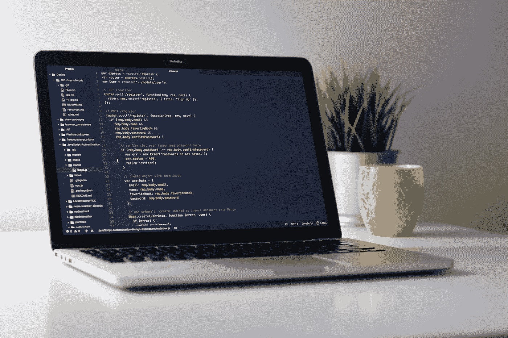

# Python 日期时间库的简单指南

> 原文：<https://towardsdatascience.com/a-simple-guide-to-pythons-datetime-library-55eb6ce845b5>

## 实际使用案例的示例和说明



由 [Clément Hélardot](https://unsplash.com/@clemhlrdt?utm_source=medium&utm_medium=referral) 在 [Unsplash](https://unsplash.com?utm_source=medium&utm_medium=referral) 上拍摄

Python 的内置`datetime`库是操纵日期和时间对象数据的最常见模块之一。您可以创建`date`和`datetime`对象，遍历一系列日期，解析和格式化日期字符串，等等。在本指南中，我将介绍一些我发现在处理日期和时间时很有用的最常见的用法。

## 创建日期和时间对象

获得一个`date`对象的最基本的方法是用适当的参数调用`date()`。在下面的例子中，您可以看到我们为今天创建了一个`date`对象，今天恰好是 2022 年 6 月 15 日:

```
import datetimetoday = datetime.date(2022, 6, 15)
print(today, type(today))
```

输出:

```
2022-06-15 <class 'datetime.date'>
```

您可以看到，`date()`函数参数可以接受年、月和日，并创建一个`datetime.date`对象。

还有一个`time`对象，它的调用方式与`date`相同，您可以输入小时、分钟和秒钟:

```
import datetimetime = datetime.time(9, 15, 57)
print(time, type(time))
```

输出:

```
09:15:57 <class 'datetime.time'>
```

您甚至可以在`time`对象中指定微秒，范围从 0 到 999999，如下所示:

```
datetime.time(9, 15, 57, 999991)
```

一个`datetime`对象也存在于组合了`date`和`time`对象的`datetime`库中(我知道这有点混乱)。这里，参数输入是`date`和`time`对象的组合:

```
import datetimetime = datetime.datetime(2022, 2, 3, 4, 5, 6, 789)
print(time, type(time))
```

输出:

```
2022-02-03 04:05:06.000789 <class 'datetime.datetime'>
```

## 获取今天的日期

或者，您可以使用`today()`函数，而不是硬编码今天的日期:

```
import datetime
today_datetime = datetime.datetime.today()
today_date = datetime.date.today()print(today_datetime)
print(today_date)isoformat()
```

输出:

```
2022-06-15 12:32:22.613419
2022-06-15
```

注意，您可以同时使用`datetime.datetime`和`datetime.date`来调用`today()`，其中`datetime`除了包含今天的日期之外，还将包含执行的确切时间。

## 使用时间增量

`timedelta`对象是两个日期之间的差值。它们用于操作日期和时间对象，在试图查找两个日期之间的经过时间或以特定间隔遍历时间时非常有用。下面是我经常使用的一个日常用例——遍历每一天，并返回一个范围内的每个日期:

```
import datetimedef get_date_range():
    date_list = [] start_date = datetime.date(2022, 6, 1) # June 1st, 2022
    end_date = datetime.date(2022, 6, 10) # June 10th, 2022 delta = datetime.timedelta(days=1) while start_date < end_date:
        date_list.append(start_date.strftime("%Y%m%d"))
        start_date += delta

    return date_list
```

该函数将返回从`start_date`到`end_date`指定范围内的日期列表。`datetime.timedelta()`有一个参数`days=1`，每次迭代一天的时间间隔。我已经使用这个函数获得了一个日期列表，我使用这个列表来遍历 API 调用以获得每天的数据。

## 日期时间操作

在上面的例子中，你可以看到我们在`start_date`中添加了`delta`。`datetime`库允许使用`timedelta`对象增加和减少日期和时间，并将返回一个新的`timedelta`对象。另一个例子是，如果你想找出两个时间之间的差异:

```
import datetimestart_time = datetime.timedelta(hours=8, minutes=15, seconds=20)
end_time = datetime.timedelta(hours=17, minutes=45, seconds=30)duration = end_time - start_timeprint(duration)
print(type(duration))
```

输出:

```
9:30:10
<class 'datetime.timedelta'>
```

你可以看到`start_time`和`end_time`的区别已经计算出来了，新的`duration`还是一个`timedelta`对象。出于本教程的考虑，我还将`start_time`和`end_time`加在一起，以表明`datetime`库可以适当地处理时间:

```
import datetimestart_time = datetime.timedelta(hours=8, minutes=15, seconds=20)
end_time = datetime.timedelta(hours=17, minutes=45, seconds=30)sum = end_time + start_timeprint(sum)
```

输出:

```
1 day, 2:00:50
```

总时间超过 24 小时，增加到 1 天 2 小时，而不是天真地输出 26 小时。

## 解析和格式化日期时间

在前面的`timedelta`例子中，我使用了函数`strftime()`。`strftime()`和`strptime()`都是格式化和解析日期和时间对象的两个重要函数。`strftime()`中的“f”和`strptime()`中的“p”分别代表“格式”和“解析”。

**strptime()**

`strptime()`用于将一个字符串解析成一个`datetime`对象。该函数接受要解析的字符串和字符串格式代码。对于下面的例子，我们有一个格式为“YYYY/MM/DD”的日期。年、月、日的格式码分别为`%Y`、`%m`和`%d`。

```
import datetimedate = "2022/06/15"
parsed_date = datetime.datetime.strptime(date, "%Y/%m/%d")print(parsed_date)
print(type(parsed_date))
```

输出:

```
2022-06-15 00:00:00
<class 'datetime.datetime'>
```

**strftime()**

`strftime()`用于将现有的`date`、`time`和`datetime`对象格式化为具有特定格式约束的字符串。在上面的例子中，我们将一个字符串转换成了一个`datetime`，但是它的格式并不理想。我们可以使用`strftime()`来改变`datetime`对象的格式并返回一个字符串。下面我们将补充上一个例子:

```
import datetimedate = "2022/06/15"
parsed_date = datetime.datetime.strptime(date, "%Y/%m/%d")print(parsed_date)
print(type(parsed_date))formatted_dated = parsed_date.strftime("%m-%d-%Y")print(formatted_dated)
print(type(formatted_dated))
```

这里，我们在带有字符串格式`"%m-%d-%Y"`的`parsed_date`对象上使用`strftime()`。这将把`parsed_date`对象格式化成具有所需格式的字符串。上面脚本的输出是:

```
2022-06-15 00:00:00
<class 'datetime.datetime'>06-15-2022
<class 'str'>
```

**格式化代码**

除了我们已经使用的`%Y`、`%m`和`%d`之外，其他标准格式器包括`%H`、`%M`和`%S`，分别用于小时、分钟和秒。有关所有格式化代码的完整列表，请参见`datetime`文档[此处](https://docs.python.org/3/library/datetime.html#strftime-and-strptime-format-codes)。

## 包装它

在处理日期和时间数据时，`datetime`库是一个强大的工具。可以格式化和解析字符串，可以迭代天数，可以执行数学运算来产生运行时间和总时间。

我希望这个指南对你有所帮助，并且你可以在将来把它作为一个参考。

编码快乐！

## 如果你喜欢这篇文章，你可能也会喜欢:

[](/a-simple-guide-to-command-line-arguments-with-argparse-6824c30ab1c3) [## ArgParse 命令行参数的简单指南

### 快速启动和运行 argparse 的入门指南

towardsdatascience.com](/a-simple-guide-to-command-line-arguments-with-argparse-6824c30ab1c3) [](/a-simple-guide-to-pandas-dataframes-b125f64e1453) [## 熊猫数据框简单指南

### 如何使用 Python 的 Pandas 库创建、存储和操作数据

towardsdatascience.com](/a-simple-guide-to-pandas-dataframes-b125f64e1453) 

## 通过下面的链接加入 Medium，支持成千上万的其他作家和我。

[](https://sestarkman.medium.com/membership) [## 通过我的推荐链接加入 Medium-Sam stark man

### 作为一个媒体会员，你的会员费的一部分会给你阅读的作家，你可以完全接触到每一个故事…

sestarkman.medium.com](https://sestarkman.medium.com/membership)