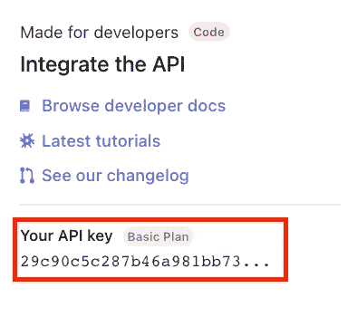

# 使用 Python 进行语音识别的简单指南

> 原文：<https://towardsdatascience.com/a-simple-guide-to-speech-recognition-with-python-796161e5606c>

## 了解如何通过三个简单的步骤使用 Python 执行语音到文本转换


杰森·罗斯韦尔在 [Unsplash](https://unsplash.com?utm_source=medium&utm_medium=referral) 上的照片

语音识别(也称为语音到文本)是机器识别口语单词并将其转换为可读文本的能力。

语音识别系统使用算法将说出的单词匹配到最合适的文本表示。尽管构建这样的算法并不简单，但我们可以使用 API 来自动将音频转换成文本转录。

在本教程中，我将向您展示如何通过 AssemblyAI 的语音到文本 API 使用 Python 将语音转换为文本。这个 API 稍后将帮助我们使用诸如摘要、内容审核、主题检测等技术来理解我们的数据。

# 使用 Python 进行语音到文本转换

在本教程中，我将转录我的一个 [YouTube 视频](https://youtu.be/CoGdmK0oTIg)的介绍。原始文件的背景中有一首歌，但是在这个例子中，我去掉了它，只在音频文件中留下了歌词。音频文件可以在[这里](https://drive.google.com/drive/folders/1UTtQ6yDtIcE-PmEYeN1oOtfA3E0rxpDn?usp=sharing)下载。

在我们开始之前，我们需要创建一个[免费的 AssemblyAI 帐户](https://www.assemblyai.com/)，以便获得一个 API 密钥。此键允许我们将音频/视频文件转换为文本。

创建您的帐户后，登录并转到主页选项卡。在那里你会发现一个名为“集成 API”的框在那个盒子里，有你的 API 密匙。复制那把钥匙，我们以后会用到它。



现在我们需要遵循 3 个简单的步骤来使用 Python 和 AssemblyAI 的 API 执行语音到文本的转换。

在本例中，我们将上传一个本地文件进行转录，但是您也可以转录可通过 URL 访问的音频/视频文件(有关更多详细信息，请查看[官方文档](https://docs.assemblyai.com/))

## 步骤 1:上传本地文件进行转录

为了转录我们的音频文件，我们首先需要将文件上传到 AssemblyAI API。为此，我们创建了两个变量:`filename`和`api_key`。

第一个包含对应于您先前下载的音频文件的路径，而第二个包含您在创建免费 AssemblyAI 帐户后获得的 API 令牌。

然后我们创建一个`read_file`函数并发送一个 post 请求来上传我们的文件。

文件上传后，我们会得到一个 JSON 响应。这个响应包含一个指向私有 URL(只有 AssemblyAI 的后端服务器可以访问)的`upload_url`键，我们将通过`/v2/transcript`端点提交这个私有 URL，以便在步骤 2 中进行处理。

在上面的代码片段中，我选择了`upload_url`键，并将其存储在一个名为`audio_url`的变量中。

## 第二步:提交你的上传进行转录

既然我们的音频文件已经上传，我们可以提交它进行转录。当提交文件进行转录时，我们将使用从步骤 1 中获得的`audio_url`变量。

在上面的代码中，我们再次发送了一个 post 请求，并创建了一个变量`response_json`，它将帮助我们在下一步中检查出`status`键。开始时，`status`键将被“排队”，然后从“排队”到“处理中”再到“完成”

我们要等到`status`键“完成”才能拿到我们的成绩单。

## 步骤 3:检查状态的更新，并获取副本

为了在`status`键设置为“completed”时立即获得我们的脚本，我们在 while 循环中发送重复的`GET`请求(我在每个请求之间添加了 5 秒的等待时间，但是您可以增加或减少它)

一旦`status`键显示为`"completed"`，我们将获得一个包含`text`、`words`和 JSON 响应中其他键的`response_result`。

包含我们的转录的键是`text`键，所以我们选择它并将其存储在一个名为`transcript`的变量中。

最后，我们可以打印文字记录或将其保存在文本文件中。

就是这样！现在我们有了笔录。我检查了文本文件，认为 AssemblyAI 在识别我的 YouTube 视频介绍中提到的所有单词方面做得很好(不管我的口音！)

这是我得到的抄本:

```
If you are thinking about making a career switch to data science or having watching tutorials to learn data science on your own. This video is for you. In this video, I will show you all the things you need to learn to become am a data scientist. I will introduce you to all the concepts you need to master from math and statistics, the programming languages you need to know as a data scientist and also the visualization tools used in data science, as well as some popular data science projects.
```

请用我的音频或您自己的音频亲自尝试一下。你可以在我的 [Github](https://github.com/ifrankandrade/api.git) 上找到本文使用的代码。

[**与 7k 以上的人一起加入我的电子邮件列表，获取我在所有教程中使用的 Python for Data Science 备忘单(免费 PDF)**](https://frankandrade.ck.page/bd063ff2d3)

如果你喜欢阅读这样的故事，并想支持我成为一名作家，可以考虑报名成为一名媒体成员。每月 5 美元，让您可以无限制地访问数以千计的 Python 指南和数据科学文章。如果你使用[我的链接](https://frank-andrade.medium.com/membership)注册，我会赚一小笔佣金，不需要你额外付费。

[](https://frank-andrade.medium.com/membership) 