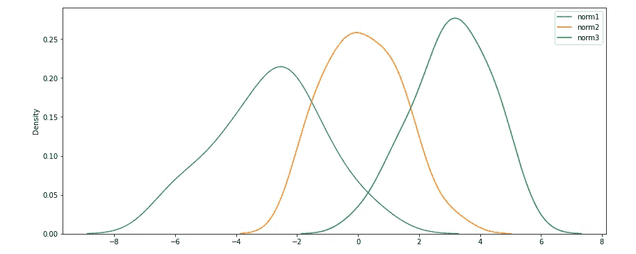
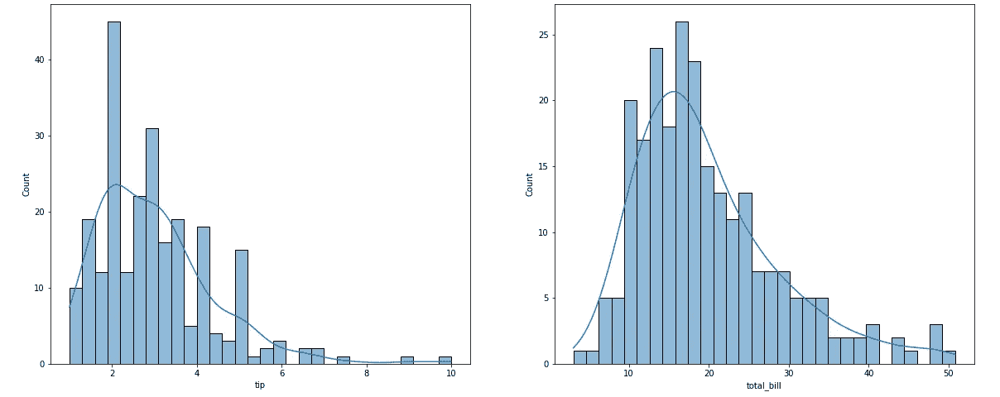
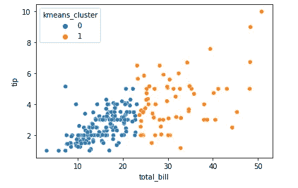
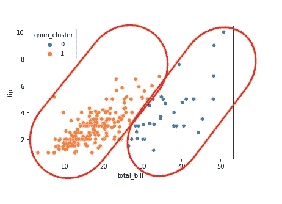

# 高斯混合模型(GMM)简介

> 原文：<https://towardsdatascience.com/a-simple-introduction-to-gaussian-mixture-model-gmm-f9fe501eef99>

## 这篇文章将向您展示——使用简单的词语——在 Python 中聚类数据的另一种选择


马里奥·普里西克在 [Unsplash](https://unsplash.com/s/photos/groups?utm_source=unsplash&utm_medium=referral&utm_content=creditCopyText) 上的照片

高斯分布也就是我们所知道的正态分布。众所周知，钟形曲线概念以平均值和中间值为中心点。

鉴于此，如果我们观察一个数据集，即使它不遵循正态分布，我们也有办法让它看起来像正态分布。或者，更好的是，我们可以说在一个数据集中，每个数据点可能来自许多正态分布。

现在假设我们正在获取一个数据集来创建三个集群。一种方法是假设其中有三个高斯(正态)分布。然后，我们将查看每个数据点，并分析该数据点更适合哪种分布。



三个正态分布。图片由作者提供。

看上面的图，我来说明一下概念。GMM 算法将每个高斯分布视为一个聚类。因此，它将获取每个数据点，并检查该点在 3 个分布中的概率。为其选择的集群就越高。

> GMM 认为每个集群是不同的高斯分布。然后它会根据概率告诉你数据点是从哪个分布中出来的。

可能最著名和最常用的聚类算法是 K-Means。但它有其局限性。其中之一是，聚类将根据聚类中心的最佳半径值进行分离，该半径值是根据到该点的欧几里德距离计算的。因此，如果你的集群没有被定义为一个圆形，你就很难正确地分离它。GMM，另一方面，与其他格式，椭圆形状是最常见的。

## GMM 是如何运作的

好的，在我们完成了一些初始概念之后，让我们基本上理解算法是如何在幕后工作的。

就像 K-Means 算法一样，GM 模型必须从某个地方开始，使用一个随机参数并以此为基础构建。一旦选择了初始参数，该算法就开始一系列计算，试图找到收敛估计的高斯分布以满足具有初始参数的高斯分布所需的最佳权重和手段。换句话说，选择每个数据点的分布。

为此，有一个名为`init_params`的超参数，你可以在`‘random’`点之间进行选择，或者使用默认的`'kmeans'`。使用 K-Means 可以帮助收敛发生得更快，因此我会保留默认值。我将在最后为那些想要/需要深入研究这个算法背后的疯狂数学的人建议一些参考帖子。

这里下一个有趣的参数是`covariance_type`，在这里你可以选择'*满'、'绑'、'诊断'、'球形'。* 为了帮助你理解这个参数，下面是我能找到的对它的最好解释。但是在你去那里之前，记住 K-Means 只使用圆形来聚集点。

*   **全**表示部件可以独立采用任何位置和形状。
*   **并列**表示它们形状相同，但形状可能是任何东西。
*   **对角线**表示轮廓轴沿坐标轴定向，但除此之外，组件之间的偏心率可能不同。
*   **球形**是圆形轮廓的“对角线”情况(更高维度的球形，因此得名)。

## 让我们开始编码吧！

说得够多了，现在让我们做点什么吧。

从数据集开始，我将使用 Seaborn 原生的玩具数据集:*提示*。

```
import seaborn as sns
df = sns.load_dataset('tips')
```

本例需要的其他导入。

```
# Basic
import pandas as pd# Viz
import matplotlib.pyplot as plt
import seaborn as sns# KMeans
from sklearn.cluster import KMeans# Gaussian Misture Model (GMM)
from sklearn.mixture import GaussianMixture
```

我将把变量 *total_bill* 和 *tip* 输入到算法中，看看 K-Means 和 GMM 如何进行聚类，这样我们就可以评估差异。

注意，它们都不是正态分布的。



tip 和 total_bill 变量的分布。图片由作者提供。

创建用于聚类的输入数据集。

```
X = df[['total_bill', 'tip']].copy()
```

用 K-均值聚类。

```
kmeans = KMeans(n_clusters=2, max_iter=600)
fitted = kmeans.fit(X)
prediction = kmeans.predict(X)
```

高斯混合模型聚类。

```
gmm = GaussianMixture(n_components=2, covariance_type='full').fit(X)
prediction_gmm = gmm.predict(X)
```

现在让我们绘制两个结果并进行比较。

## GMM 满了

```
# Add predictions to the original dataset
df['kmeans_cluster'] = prediction
df['gmm_cluster'] = prediction_gmm# Plot K-Means
sns.scatterplot(data=df, y='tip', x='total_bill', hue='kmeans_cluster');
```



k-表示结果。图片由作者提供。

K-Means 按预期工作，圆形分割。我们可以看到一串高达 23 美元左右，小费高达 5.5 美元。其余为总账单较高的集群。

```
#Plot GMM
sns.scatterplot(data=df, y='tip', x='total_bill', hue='gmm_cluster');
```


GMM 全部结果。图片由作者提供。

“完整”协方差类型为我们提供了一个更紧密的分类 1 和一个分类 0，分类 1 中的小费与总账单非常成比例，分类 0 中有更多的分布值。它们有不同的形状。

让我们来看看 GMM 的其他协方差类型的图形。

## GMM 打平了

```
# Rerun the model
gmm = GaussianMixture(n_components=2, covariance_type='tied').fit(X)
prediction_gmm = gmm.predict(X)# Replace the predictions
df['gmm_cluster'] = prediction_gmm# Plot
sns.scatterplot(data=df, y='tip', x='total_bill', hue='gmm_cluster');
```

捆绑意味着我希望集群具有相同的形状。有趣的



GMM 潮汐结果。图片由作者提供。

## GMM 对角线

```
# Rerun the model
gmm = GaussianMixture(n_components=2, covariance_type='diag').fit(X)
prediction_gmm = gmm.predict(X)# Replace the predictions
df['gmm_cluster'] = prediction_gmm# Plot
sns.scatterplot(data=df, y='tip', x='total_bill', hue='gmm_cluster');
```

在这里，形状遵循坐标轴，但一些异常值可能因组件而异。


GMM 对角线结果。图片由作者提供。

## GMM 球形

```
# Rerun the model
gmm = GaussianMixture(n_components=2, covariance_type='spherical').fit(X)
prediction_gmm = gmm.predict(X)# Replace the predictions
df['gmm_cluster'] = prediction_gmm# Plot
sns.scatterplot(data=df, y='tip', x='total_bill', hue='gmm_cluster');
```

这与 K-Means 结果非常相似，因为聚类被定义为球形。


GMM 球形结果。图片由作者提供。

## 在你走之前

这个问题并不简单。它可能看起来很简单，但它有更多的深度。我建议你阅读我留下的帖子，作为更好地理解 GMMs 的参考。

底线是，没有容易的路。你必须尝试不同类型的模型，以确定哪种模型最适合你的情况。

如果你愿意，不要忘记关注我的博客或者使用我的推荐链接订阅 Medium。

<https://gustavorsantos.medium.com/>  

## 参考

[Sklearn 文档:GMM](https://scikit-learn.org/stable/modules/generated/sklearn.mixture.GaussianMixture.html)

[解释堆栈交换的协方差类型](https://stats.stackexchange.com/questions/326671/different-covariance-types-for-gaussian-mixture-models)

</gaussian-mixture-models-explained-6986aaf5a95>  </how-to-code-gaussian-mixture-models-from-scratch-in-python-9e7975df5252>  </gaussian-mixture-modelling-gmm-833c88587c7f>  </gaussian-mixture-models-d13a5e915c8e> 