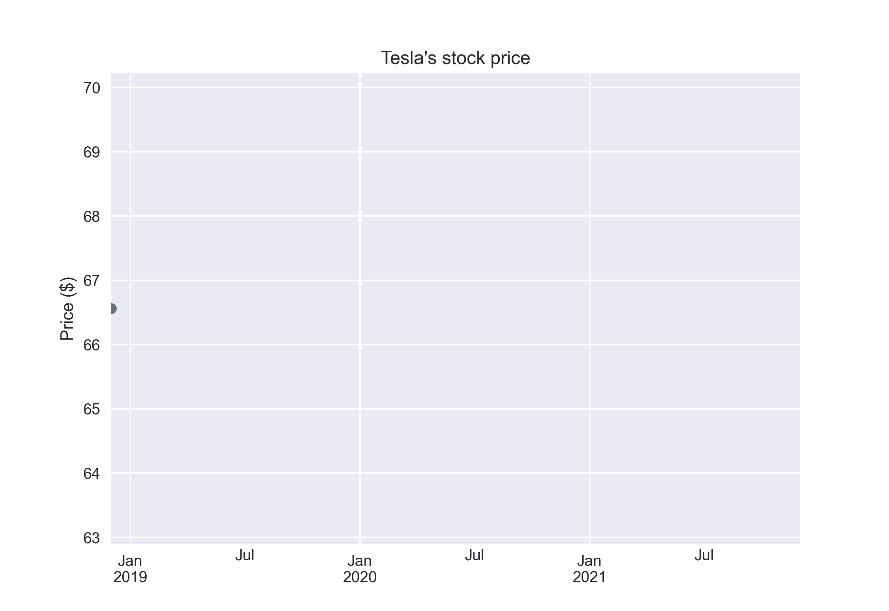
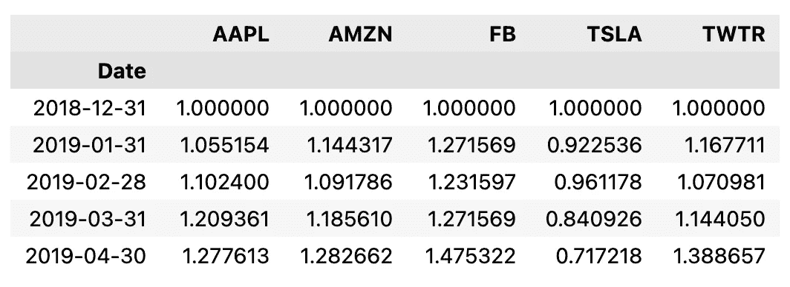
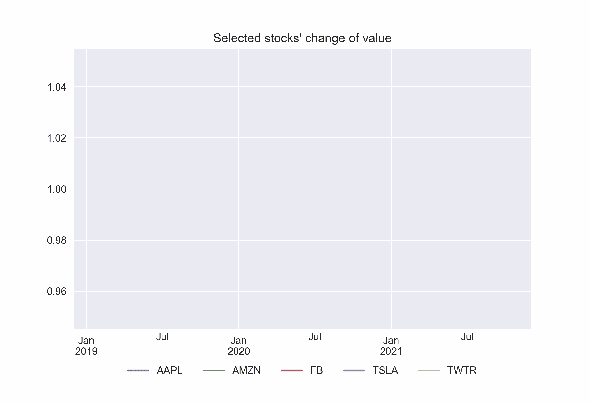

# 用 Python 把你的图转换成 gif 的简单方法

> 原文：<https://towardsdatascience.com/a-simple-way-to-turn-your-plots-into-gifs-in-python-f6ea4435ed3c>


雅各布·欧文斯在 [Unsplash](https://unsplash.com/s/photos/video?utm_source=unsplash&utm_medium=referral&utm_content=creditCopyText) 上的照片

# 用 Python 把你的图转换成 gif 的简单方法

## 用动画情节打动你的观众

随着时间的推移，我看到了相当多的动画情节，例如，不同产品的销售如何随着时间的推移而变化，特定公司的市场份额如何演变，感染人数等。最近我想，用 Python 创作这样的动画，一定有简单的方法。经过快速搜索，我找到了最适合这项工作的图书馆。在这篇短文中，我将向您展示如何用几行代码轻松地将您的情节转换为动画 gif。

# 设置

和往常一样，我们从导入库开始。为了创建 gif，我们将使用`gif`库。在所有的导入之后，我们也将 DPI(每英寸点数)增加到 300，这样我们的动画将会有更高的分辨率。

# 图 1:一个简单的线形图

我在考虑用哪种图来演示，我决定用线图，因为它们显示了一些值是如何随时间变化的。这使得他们成为动画的完美候选人。更准确地说，我们将关注股票价格。

我们从下载特斯拉 2019 年至 2021 年的股价开始。

我们下载了每日数据，这导致数据帧超过 1000 行。对于我们的用例来说，这可能有点过了。这就是为什么我们通过取每个月的最后一个值将数据重新采样到每月频率。

```
tsla_df = df[["Adj Close"]].resample("M").last()
```

然后，我们定义一个辅助函数来分别显示动画的每一帧。

这里有几件事值得一提:

*   我们创建了一个函数来显示动画中每一帧的情节。在我们的例子中，每一帧对应于显示特定日期之前数据的图。稍后我们将把这些帧组合成一个动画。
*   在定义函数时，我们使用了`@gif.frame`装饰器(必需的步骤)。
*   我们使用下面的代码片段`df.iloc[i:] = np.nan`来屏蔽当前帧之后的所有数据。这是一个从开始显示整个 x 轴的简单技巧，因此我们不会观察到一个不断扩展的轴。在我看来，这简直是赏心悦目。
*   使用`matplotlib`绘图时，该函数不应返回任何内容(这与我们使用`plotly`或`altair`时不同)。

然后，我们使用 for 循环来获取动画的所有帧，并将它们附加到一个列表中。

最后，我们把所有的帧放在一起并保存 GIF。我们使用`save`函数来实现。我们提供了帧列表、GIF 的预期名称、持续时间以及表示时间的单位。最后，我们还应该指定`between`参数。它决定了`duration`参数描述的是帧之间的时间(`“frames”`)还是整个动画的持续时间(`“startend”`)。我们选择后者。

下面，我们可以观察我们工作的产出。



作者制作的动画

另一方面，这是相当可观的增长📈！

# 图 2:多个时间序列

说到成长，让我们更进一步。这一次，我们下载了同一时间段的五家科技公司(任意选择:特斯拉、Twitter、脸书、亚马逊、苹果)的股价。与前面的例子类似，我们也以每月一次的频率对数据进行重采样。然后，我们计算相对于锚定期(第一行)，即 2018 年 12 月，每个月的价格如何变化。

您可以在下面看到数据框的预览:



我们再次定义了一个用于绘制框架的辅助函数。逻辑和上次差不多。最大的变化出现在函数的末尾，我们将图例移到了图的外面。否则，它可以根据线条的当前位置，在帧之间的图形周围跳跃。这样，我们使它的位置固定在绘图区域之外。

**注**:操纵图例的代码改编自[this stack overflow answer](https://stackoverflow.com/questions/4700614/how-to-put-the-legend-out-of-the-plot)，在这里你也可以找到如何将其放置在剧情的其他部分。这在和`matplotlib`一起工作的时候绝对可以派上用场！

我们没有展示其余的过程(存储帧和保存 GIF ),因为与第一个动画相比没有什么变化。

最后，我们可以看看结果。



作者制作的动画

在这一点上，值得一提的是`gif`库并不局限于从线图创建 gif。我们可以随心所欲地设计任何情节。也许我们唯一需要记住的是，动画应该强调我们试图传达的故事，而不是仅仅为了动画而创作动画。

# 外卖食品

*   是一个方便的库，可以将你的常规情节转换成动态的、易于共享的动画，
*   该库与`matplotlib`、`plotly`、`altair`、
*   我们可以基于各种类型的图表创建动画。

就个人而言，我认为我更喜欢静态的剧情(或者像`plotly`中那样的互动)，而不是动画。因为这样我们就可以更深入地分析并尝试识别模式。然而，这样的动画情节在特殊情况下绝对是很好的“炫耀”——这完全取决于目的。

你可以在我的 [GitHub](https://github.com/erykml/medium_articles/blob/master/Misc/creating_gifs.ipynb) 上找到本文使用的代码。此外，欢迎任何建设性的反馈。你可以在推特或评论中联系我。

喜欢这篇文章吗？成为一个媒介成员，通过无限制的阅读继续学习。如果你使用[这个链接](https://eryk-lewinson.medium.com/membership)成为会员，你将支持我，不需要额外的费用。提前感谢，再见！

您可能还会对以下内容感兴趣:

[](/8-more-useful-pandas-functionalities-for-your-analyses-ef87dcfe5d74) [## 用于分析的 8 个更有用的熊猫功能

### 它们可以让你的日常工作更轻松、更快捷

towardsdatascience.com](/8-more-useful-pandas-functionalities-for-your-analyses-ef87dcfe5d74) [](https://medium.com/geekculture/top-4-python-libraries-for-technical-analysis-db4f1ea87e09) [## 用于技术分析的 4 大 Python 库

### 有一个计算布林线的例子

medium.com](https://medium.com/geekculture/top-4-python-libraries-for-technical-analysis-db4f1ea87e09) [](/use-annotations-to-tell-better-stories-with-your-plots-410cb1752bee) [## 使用注释来讲述更好的故事

### 以及如何使用 plotly 在 Python 中实现它

towardsdatascience.com](/use-annotations-to-tell-better-stories-with-your-plots-410cb1752bee) 

# 参考

*   [https://github.com/maxhumber/gif](https://github.com/maxhumber/gif)