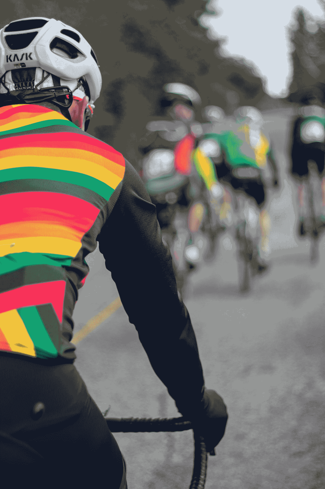

# 过去一年我参加 Kaggle 比赛的经验总结

> 原文：<https://towardsdatascience.com/a-summary-of-my-experience-with-kaggle-competitions-over-the-last-year-bac740974484>

## 在高尔夫球比赛中取得好成绩的系统方法

格雷格·罗森克在 [Unsplash](https://unsplash.com?utm_source=medium&utm_medium=referral) 上的照片

作为一名数据科学爱好者，我尝试了许多不同的事情来提升我的知识和经验。读一年的每周机器学习论文，做 Coursera 的课程，看动手机器学习的书，参加 Kaggle 的比赛。在我看来，获得数据科学经验的最佳方式(除了在行业中工作)是参加 Kaggle 竞赛。当我开始写它们的时候，我确实面临着巨大的挫折，这也是我写这篇文章的原因。在做了 2-3 个以上的 Kaggle 比赛后，我开始注意到许多有用的模式，我希望我早就注意到了。如果你是第一次参加比赛，我强烈建议你注意这些事情，因为这会节省你很多时间。

## 1.探索数据，慢慢来(练习探索性数据分析(EDA))

我曾经非常兴奋地开始将数据输入机器学习模型，并尽快开始工作。然而，经过几次尝试后，我发现最初花时间研究这些数据是非常值得的。有大量的 EDA 教程，参加比赛的人通常会在最初发布大量的 EDA 笔记本。了解这些数据将为您节省大量时间，并帮助您做出明智的决策，决定尝试哪个模型，避免哪个模型。一般来说，我会说，如果比赛持续 3 个月左右，不要担心，如果你花前 2-3 周做 EDA。在第一阶段探索要比剥削好得多！

EDA 包括许多不同的工具，但我通常注意到这些工具是最有用的:

1.  检查特征的分布。尝试查看要素是正态分布还是偏态分布。这可能会影响您预处理数据的方式。
2.  检查要素的数据类型
3.  检查要素的平均值、中值和标准差
4.  检查要素的数量、数据集的大小
5.  检查是否有任何可空/空字段
6.  检查特征的相关性，高度相关的特征有时会被丢弃

你可以做更多的事情，但是如果你是一个初学者，也许就从这些开始吧。

## 2.开始阅读关于竞赛领域的论文

这可能不明显，有些人会不同意，但我强烈建议你阅读一些与竞争对手相同领域的初始机器学习论文。例如，如果你正在做一个关于在图像中检测皮肤癌的比赛，试着找到最近做最相似任务的论文(例如，可能是生物信息学中的计算机视觉)。

对你将要阅读的论文要务实和谨慎。很容易陷入无休止的循环阅读，甚至忘记比赛。浏览大约 10-20 篇论文，选择最好的 5 篇。我还强烈建议您与竞赛社区分享这些论文。获得人们的反馈，看看他们的想法，还可以获得几个 Kaggle 点！

**3。开始试验模型**

由[安德斯·吉尔登](https://unsplash.com/@andersjilden?utm_source=medium&utm_medium=referral)在 [Unsplash](https://unsplash.com?utm_source=medium&utm_medium=referral) 拍摄

这里一个很常见的错误是没有跟踪你的实验，迷失在混乱的笔记本中。你必须对你的实验系统化，记下你将要使用的模型和你将要测试的超参数范围。这是非常重要的建立一个坚实的基线，你可以在此基础上建立。

另外:

> 不要从神经网络开始

我总是看到这种错误，我为自己犯了几次这样的错误而感到内疚。从神经网络开始是非常诱人的(例如，从 NLP 竞赛中的变压器开始)。不要从最复杂的模型开始，你最终会非常沮丧。从最基本的模型开始，逐步构建更复杂的模型。使用梯度推进机器而不是深度神经网络赢得了很多比赛。此外，你必须学会如何使用梯度推进机，因为在这些 Kaggle 比赛中，它们绝对是性能方面的野兽。它们也很容易使用，其中几个作为轻量级 GBM 给你带来了非常有意义的结果，比如特性的重要性。

## 4.与社区合作

记住你是在一个公共的 Kaggle 社区上做一个竞赛。你总是会有问题，把它们贴在论坛上。如果可以的话，试着在团队中工作。向别人学习比自己学习要快得多。我保证，如果你在团队中工作，你正在犯的许多错误是可以避免的。

此外，与公共笔记本保持同步，尽可能多地从它们身上学习。

> 但是，不要简单地复制粘贴它们！

复制和粘贴它们只会让你一事无成，因为你实际上什么也学不到，而且大多数时候你会发现改进别人的代码非常困难。相反，试着理解他们的代码，也许复制一两个可以帮助你的程序块。

## 5.全体，全体，全体

老实说，集合是在 Kaggle 比赛中取得好成绩的秘密关键。我以前总是忘记做这件事。运行实验后，不要简单地提交最佳模型的预测。提交你最好的 3 个甚至 5 个模特的合奏。并且总是使用 3 或 5 K 倍来训练你的模型。

## 结论

老实说，我不觉得参加卡格尔比赛是一条容易的路。我通常觉得它们很有挑战性，现在依然如此。我从来没有赢过，但我总是发现自己在做了一次后学到了很多新概念。我也一直注意到，典型的卡格尔大师只有在参加了大量(100+)的卡格尔比赛后才能到达那里，这绝对是疯狂的。不确定我是否会走到那一步，因为在某个时候，你开始获得特定于 Kaggle 的经验，而不是可转移的数据科学经验。但是，我认为除非你参加 50 场以上的比赛，否则你不会达到那个水平。

如果您想定期收到关于人工智能和机器学习的最新论文的论文评论、高质量的 ML 教程等，请添加您的电子邮件[此处](https://artisanal-motivator-8249.ck.page/5524b8f934) &订阅！