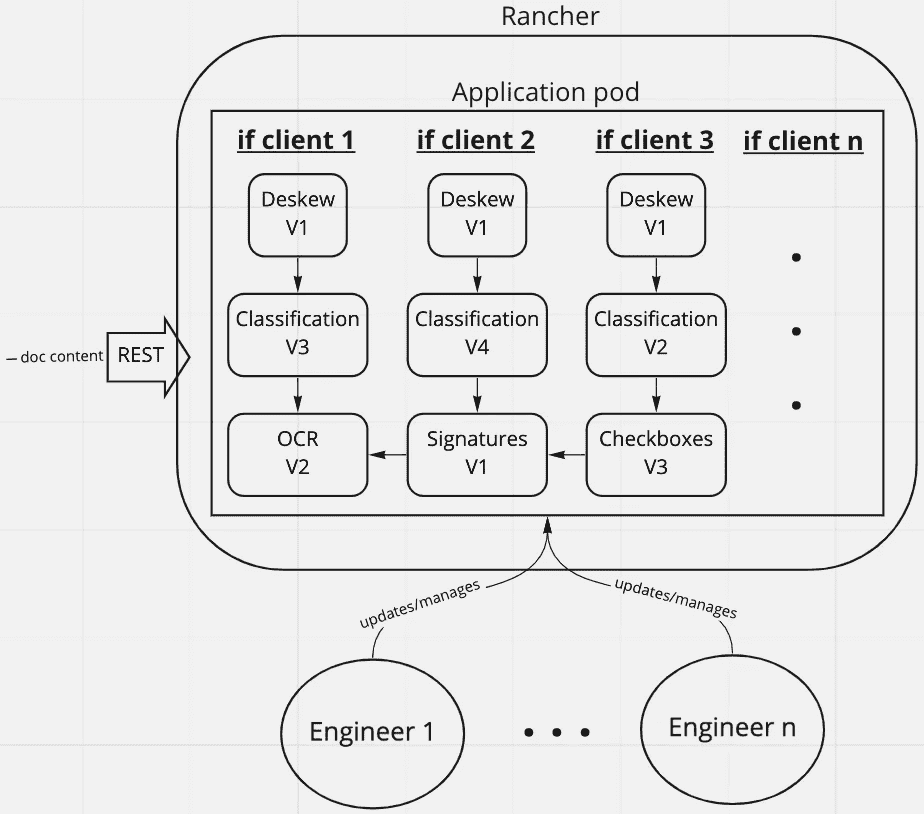
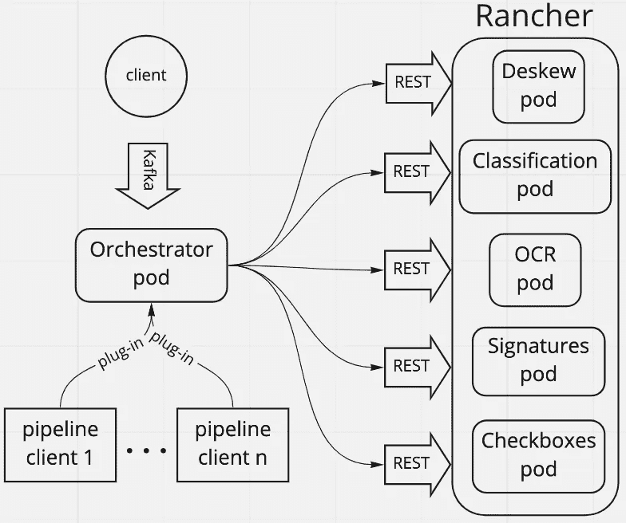
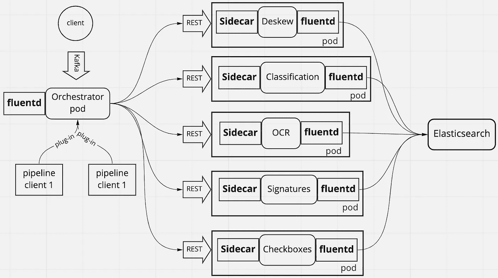
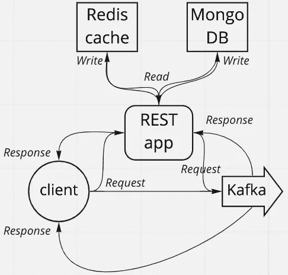
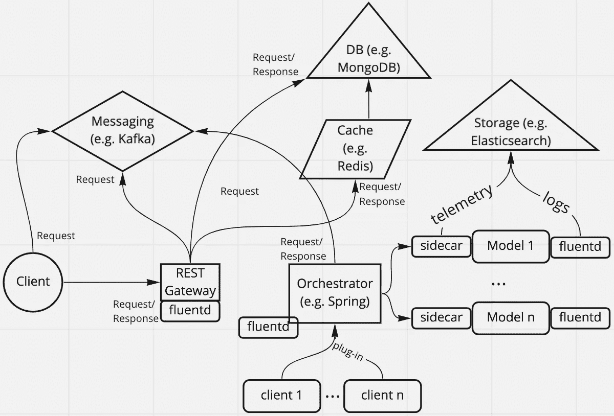

# 两个建筑的故事

> 原文：<https://towardsdatascience.com/a-tale-of-two-architectures-48758462f5fd>

## **将机器学习模型部署为微服务**

*从*开始是最容易的，从开始是最难的，可以这样解释狄更斯的杰作(其中之一)*【双城记】*的第一行。

我最近转到了另一个团队，那里正在开发一个非常有趣且具有挑战性的文档(pdf 和图像)分析解决方案。主要思想是提供内部自动化工具，以自动化和/或促进不同业务单元的流程接收文档。

例如，其中一个业务部门收到了大量的申请表。表格可能是手工填写的，由于扫描而歪斜，由于扫描而质量不好，等等。多年前创建的接收这些表单的原始流程是让某人手动提取感兴趣的字段，并将其输入到应用程序中。这个过程不仅容易出错，因为偶尔会出现图像质量不佳的情况，而且特别是因为处于循环中的人，他们唯一的(极其无聊的)功能是在最好的情况下复制粘贴数据，在最坏的情况下理解和键入像手写首字母缩写词这样的东西。

当我加入团队时，我的任务是帮助重新设计系统，通过不同的模型，在文档类型数量、请求数量，特别是整个系统提供的功能数量方面变得可扩展。这是通过将包含所有模型的整体应用程序分解为独立的微服务来实现的，这就是我将要谈到的旅程。

**像往常一样各个击破**

该团队从一开始就意识到单一模型是不够的，并试图理解概念验证需要什么。结论是，需要采取以下措施:

。*光学字符识别(OCR)模型*

。*抗扭斜模型*

。*一个分类模型*

需要 OCR 模型来提取文档的内容。需要抗扭斜模型来确保文档正确对齐。需要分类模型来确保文档是模型所期望的类型。如果不是，那么 OCR 模型将被绕过。

一旦决定下来，每个数据科学家/ML 工程师(我从现在开始将他们都简称为工程师)都被分配了一个要解决的问题。因为这篇文章的重点是展示这些模型是如何首先集成到一个 monolith 应用程序中，然后再拆分成一个基于微服务的应用程序，所以我将把每个模型的细节放在另一个时间。

工程师们启动他们的 Jupyter 环境，收集数据并开始工作。不久之后，他们每个人都有了可以集成到更大的解决方案中的概念证明。正如古老的奥卡姆剃刀教导我们的那样，实体的增加不应该超出需要，所有的模型都被集成到一个单一的、基于 Python 的整体应用程序中。

该应用程序还公开了一个接收文档内容的 REST 端点。该解决方案被装箱，部署到 Rancher(一个 Kubernetes 企业管理解决方案)中，每个人都出去庆祝。

第一个，单块，版本(作者图片)

乐观的诅咒

最初的测试一如既往地有效，但真实数据打破了一切，也一如既往。允许通过 API 直接发送多个文档的内容会带来内存问题。此外，随着文档数量的增加，响应时间减少了，在某些情况下，一个请求甚至需要十几分钟。很明显，系统还没有准备好在客户端以同步方式*工作。*

基于第一次尝试的结果，提出了三个要求。首先，客户端不应该暴露给同步 API。第二，应该应用一些节流。第三，早就应该进行监测了。

要将系统调用转换成异步调用，一个显而易见的解决方案是在应用程序前面放置一个消息代理，例如 Kafka。消息可以被格式化为 Avro，模式将被存储在模式注册表中，这将有助于模式管理。然后，客户将能够把要分析的文档发送给 Kafka，应用程序将对其进行处理，并将结果发送回客户将会收听的另一个 Kafka 主题。因为在当前请求完成之前，应用程序不会收到另一个请求，所以内存问题将会消失。例如，节流可以通过 Kafka 主题分区的数量来实现。监控可以使用第三方库，一切正常。

但对于一个主要目的是使用机器学习模型来分析文档的应用程序来说，这是不是太多了？即系统在被很好地调用时很好地工作。此外，根据应用程序的吞吐量和文档的大小，让许多文档在 Kafka 主题中等待可能会成为一个内存问题。

基于此，并应用良好的旧职责分离，采用的路线是实现这三个新功能，异步调用、节流和监控，不是在应用程序内部，而是作为另一个应用程序(从现在称为 Orchestrator)的一部分，该应用程序将独立部署并调用文档分析器应用程序。此外，客户现在将发送可以下载文件的位置(例如 AWS S3 ),而不是它们的内容。这将缓解内存问题，并在需要时实现更快的文档检查，因为团队不需要接触客户来请求它们。

整个过程是这样的:

1.客户机将文档的位置和一个标识符(请求 id)发送给输入的 Kafka 主题，并监听输出的主题

2.Orchestrator 拾取消息，下载文档，提取其内容，调用文档分析器应用程序，等待响应，并在收到响应时将其发送给 Kafka

3.Orchestrator 使用最合适的工具收集和导出遥测数据

4.客户端根据请求 id 从响应 Kafka 主题中获取响应

语义听起来很棒，即一个指挥者指挥两个系统的操作，Kafka 和应用程序是两者的中心联系点，这使它处于一个独特的位置来监控周围的一切。

使系统在客户端异步(图片由作者提供)

自身成功的受害者

新方法很成功，更多的客户想使用它。然而，下一个用例带来了另一个复杂性。客户还想确定某些复选框是否被选中。

现在，应用程序必须以两种方式更新:

1.  能够识别复选框
2.  通过一个“if”语句来检查应该执行哪个管道，因为两个用例有不同的需求。

开发了复选框标识模型，并更新了 CI 管道，以将最新的模型文件包含到运行应用程序的容器中。Kafka 消息的 Avro 模式被更新，以作为有效载荷的一部分通知用例，然后一切又开始工作，直到下一个用例出现，带来了对另一个模型的需求，该模型应该能够识别签名是否存在。

重复上面提到的过程，即开发模型，将新的模型文件添加到 CI 管道，并插入另一个“if”语句以适应新的用例。

在那之后，情况是这样的:有五个工程师改变了相同的代码库，使用不同的模块，但使用相同的共享工具，例如图像处理方法，这开始违背 DRY(不要重复自己)原则。此外，对一个模型的每次更改都需要重新部署整个应用程序。随着模型被独立开发，它们版本的管理开始变得很糟糕。

重复的代码+来自不同空间的多个所有者=噩梦的秘诀(图片由作者提供)

**各个击破，第二幕**

正如开始提到的，我加入团队后的任务是帮助应用程序变得更具可伸缩性。一切都运行得很好，工具的选择已经很好了，所以这是一个重新考虑现有架构的问题。

我想到的第一个问题是:如果模型，尽管生活在相同的代码库中，是独立开发和维护的，是什么阻止了它们以相同的方式部署？答案不出所料:什么都没有。所以，我们进入正题。

第一步是将应用程序中的每个模型提取到它自己的存储库中。由于抗扭斜模型总是第一个被调用，所以它自然是第一个被提取的。它获得了自己的代码库、CI/CD 管道和 Rancher pod。现在，Orchestrator 在收到请求后，首先调用去歪斜模型，然后将得到的去歪斜文档传递给应用程序。接下来是要提取的文档分类模型，接下来是复选框和签名模型。剩下的代码库成为了 OCR 模型的基础。

但是，以前存在于 monolith 应用程序中的 ML 管道呢？嗯，因为他们的工作是通知哪个模型应该以哪个顺序被调用，自然的方向是将他们移动到指挥者那里。改变 Orchestrator 使其适合基于插件的架构，允许管道也可以独立开发，并简单地插入 Orchestrator。

将模型提取到微服务中，并将管道转换为可插拔组件(图片由作者提供)

**让每个人都负起责任**

这个新的架构似乎完全解决了这个问题。模型可以独立地发展，新的用例可以很快地添加进来(假设模型已经存在)。该应用程序已经成为一个完全分布式的应用程序，能够纵向扩展和横向扩展。但是对模型本身的监控呢？

到目前为止，Orchestrator 一直是遥测的单点，但现在应该为每个模型收集相同类型的指标。当然，自然的选择是应用 Sidecar 模式。sidecar 可以与模型一起部署，作为一个即插即用的解决方案，简单地添加到 pod 的部署描述符中，并成为模型 API 的代理，同时还收集指标。

最后，在考虑遥测的同时，我们还决定收集日志。仍然本着即插即用的精神，Fluentd 非常方便，也可以作为简单的部署人工制品添加到每个吊舱中。我们将 Elasticsearch 设置为这些日志的汇集点，瞧！现在，除了完全分布式和能够纵向扩展之外，应用程序是完全可观察的。

添加边车，使系统完全可见(图片由作者提供)

蛋糕上的樱桃

尽管一切都很顺利，但有一件事听起来还是不太对劲。Kafka 是一个很棒的工具，但是将它作为一个 API 向所有客户公开听起来并不合适。如前所述，为了促进模式的发展，我们使用了 Avro 和模式注册中心，虽然有很多库可以帮助集成，但这仍然不是很简单，尤其是在由 Kerberos 这样的解决方案保护的环境中。此外，通过 API 与外部系统交互的客户机更习惯于 REST 之类的东西，在某些情况下可能更喜欢它。

但是休息是第一选择，并没有像预期的那样起作用，就像开始解释的那样。此外，该系统具有异步性，一些客户已经在使用 Kafka。那么如何解决呢？很简单，通过添加 YAG，或者，另一个网关。

这个新的网关将与 Kafka 交互，并向客户端公开两个方法:**发送(请求 Id，文档位置)**和**接收(请求 Id，状态，结果)**。前者将接收来自客户端的消息并将其发送给 Kafka，而后者将返回请求的当前状态(处理中、就绪、失败等)以及结果。

如果使用 Spring 之类的东西，将 REST API 连接到 Kafka 是非常容易的。不过，问题是要让多个客户端不断地访问数据库(我们在这个项目中使用了 MongoDB)。当然，请求是基于主键的，使用请求 id 作为索引集合的键，但是，根据请求的规模，这仍然可能导致问题。幸运的是，我们已经运行了一个 Redis 集群，我们可以将它用作缓存层。

允许客户在 REST 和 Kafka 之间选择

现在只是最好的时候。

整个建筑的典型代表(图片由作者提供)

**参考文献**

                

一张服务的网，只因为图像的美丽:)(图片由 Unsplash 提供)