# PyTorch 中学习速率调度程序的可视化指南

> 原文：<https://towardsdatascience.com/a-visual-guide-to-learning-rate-schedulers-in-pytorch-24bbb262c863>

## Python 深度学习的 LR 衰减和退火策略

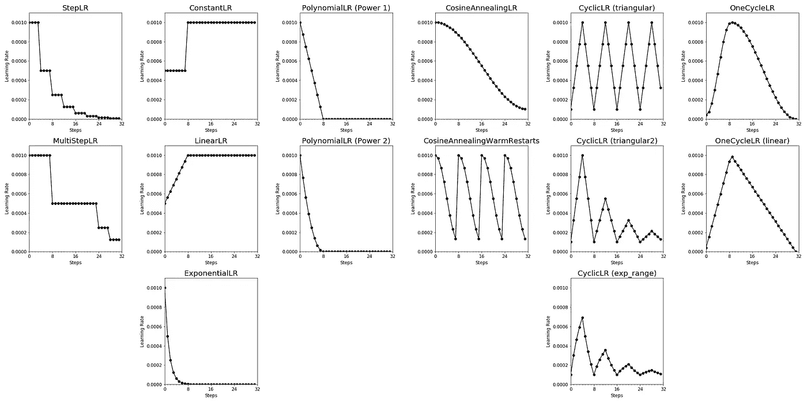

作者图片

# 深度学习中的学习率是多少？

神经网络有许多影响模型性能的超参数。**基本超参数**之一是学习率(LR)，它决定了训练步骤之间模型权重的变化程度。在最简单的情况下，LR 值是 0 和 1 之间的固定值。

然而，选择正确的 LR 值可能具有挑战性。一方面，**大的学习率**可以帮助算法快速收敛。但它也可能导致算法在最小值附近反弹，而不会达到最小值，或者如果最小值太大，甚至会跳过它。另一方面，一个**小的学习率**可以更好地收敛到最小值。但是，如果太小，优化器可能需要太长时间才能收敛或者停滞不前。

# 什么是学习率计划程序？

帮助算法**快速收敛到最优**的一个解决方案是使用学习率调度器。学习率调度器在训练过程中根据预定义的时间表调整学习率。

> 帮助算法快速收敛到最优的一个解决方案是使用学习率调度器。

通常，学习率在训练开始时被设置为较高的值，以允许更快的收敛。随着训练的进行，学习率降低，以使收敛到最优，从而导致更好的性能。在训练过程中降低学习率也被称为**退火或衰退**。

不同学习速率调度程序的数量可能会令人不知所措。因此，本文旨在向您概述 PyTorch 中不同的预定义学习率调度程序如何在训练期间调整学习率:

*   [StepLR](#eec7)
*   [多步](#e836)
*   [常数 R](#deba)
*   [LinearLR](#a9e8)
*   [指数运算](#b465)
*   [多项式](#1209)
*   [CosineAnnealingLR](#fad1)
*   [CosineAnnealingWarmRestartsLR](#6de9)
*   [CyclicLR](#1dbe)
*   [OneCycleLR](#badd)
*   [reducelronplateaaulr](#5407)
*   [带有 Lambda 功能的定制学习率调度器](#811c)

# 学习率调度程序

对于本文，我们使用 PyTorch 版本 1.13.0。您可以在 [PyTorch 文档](https://pytorch.org/docs/stable/optim.html)中阅读更多关于学习率调度器的详细信息。

```
import torch
```

您可以在本文末尾的附录中找到用于可视化 PyTorch 学习率调度程序的 Python 代码。

## StepLR

在每经过预定数量的训练步骤后，`[StepLR](https://pytorch.org/docs/stable/generated/torch.optim.lr_scheduler.StepLR.html#torch.optim.lr_scheduler.StepLR)`将学习率降低一个倍数。

```
from torch.optim.lr_scheduler import StepLR

scheduler = StepLR(optimizer, 
                   step_size = 4, # Period of learning rate decay
                   gamma = 0.5) # Multiplicative factor of learning rate decay
```

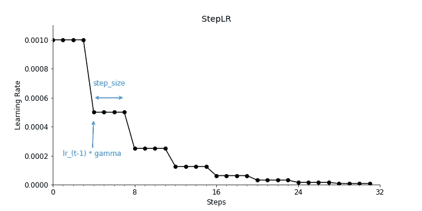

PyTorch 学习率调度器`StepLR` (图片由作者提供)

## 多步骤

`[MultiStepLR](https://pytorch.org/docs/stable/generated/torch.optim.lr_scheduler.MultiStepLR.html#torch.optim.lr_scheduler.MultiStepLR)`——类似于`[StepLR](https://pytorch.org/docs/stable/generated/torch.optim.lr_scheduler.StepLR.html#torch.optim.lr_scheduler.StepLR)`——也以倍增因子降低学习率，但在每个预定义的里程碑之后。

```
from torch.optim.lr_scheduler import MultiStepLR

scheduler = MultiStepLR(optimizer, 
                        milestones=[8, 24, 28], # List of epoch indices
                        gamma =0.5) # Multiplicative factor of learning rate decay
```

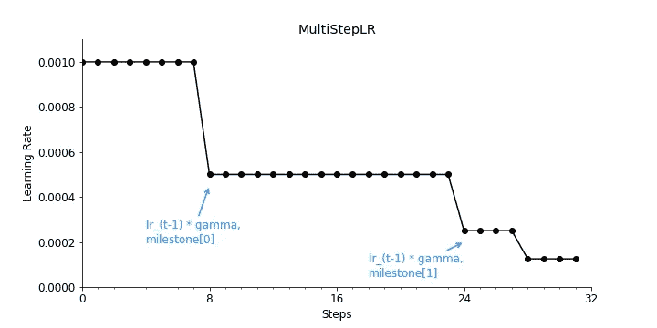

PyTorch 学习率调度器`MultiStepLR` (图片由作者提供)

## ConstantLR

`[ConstantLR](https://pytorch.org/docs/stable/generated/torch.optim.lr_scheduler.ConstantLR.html#torch.optim.lr_scheduler.ConstantLR)`以倍增系数降低学习率，直到训练步数达到预定义的里程碑。

```
from torch.optim.lr_scheduler import ConstantLR

scheduler = ConstantLR(optimizer, 
                       factor = 0.5, # The number we multiply learning rate until the milestone.
                       total_iters = 8) # The number of steps that the scheduler decays the learning rate
```

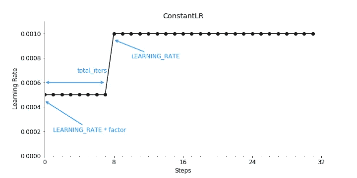

PyTorch 学习率调度器`ConstantLR` (图片由作者提供)

正如你可能已经注意到的，如果你的起始因子小于 1，这个学习率计划程序会在训练过程中增加学习率，而不是减少。

## 线性 LR

与`[ConstantLR](https://pytorch.org/docs/stable/generated/torch.optim.lr_scheduler.ConstantLR.html#torch.optim.lr_scheduler.ConstantLR)`类似，`[LinearLR](https://pytorch.org/docs/stable/generated/torch.optim.lr_scheduler.LinearLR.html#torch.optim.lr_scheduler.LinearLR)`也在训练开始时以倍增系数降低学习率。但是它在限定数量的训练步骤上线性地增加学习速率，直到它达到它最初设置的学习速率。

```
from torch.optim.lr_scheduler import LinearLR

scheduler = LinearLR(optimizer, 
                     start_factor = 0.5, # The number we multiply learning rate in the first epoch
                     total_iters = 8) # The number of iterations that multiplicative factor reaches to 1
```

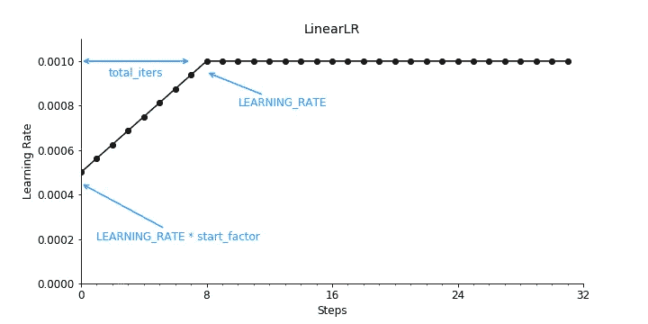

PyTorch 学习率调度器`LinearLR` (图片由作者提供)

如果你的起始因子小于 1，这个学习率计划程序还会在训练过程中提高学习率，而不是降低它。

## 指数 LR

在每个训练步骤中，`[ExponentialLR](https://pytorch.org/docs/stable/generated/torch.optim.lr_scheduler.ExponentialLR.html#torch.optim.lr_scheduler.ExponentialLR)`以倍增系数降低学习率。

```
from torch.optim.lr_scheduler import ExponentialLR

scheduler = ExponentialLR(optimizer, 
                          gamma = 0.5) # Multiplicative factor of learning rate decay.
```

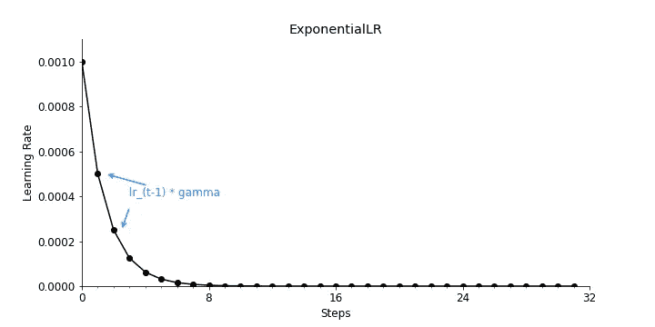

PyTorch 学习率调度器`ExponentialLR` (图片由作者提供)

## 多项式 lLR

`[PolynomialLR](https://pytorch.org/docs/stable/generated/torch.optim.lr_scheduler.PolynomialLR.html#torch.optim.lr_scheduler.PolynomialLR)`通过使用一个多项式函数来定义步数，从而降低学习率。

```
from torch.optim.lr_scheduler import PolynomialLR

scheduler = PolynomialLR(optimizer, 
                         total_iters = 8, # The number of steps that the scheduler decays the learning rate.
                         power = 1) # The power of the polynomial.
```

下面你可以看到`power = 1`的学习率下降。

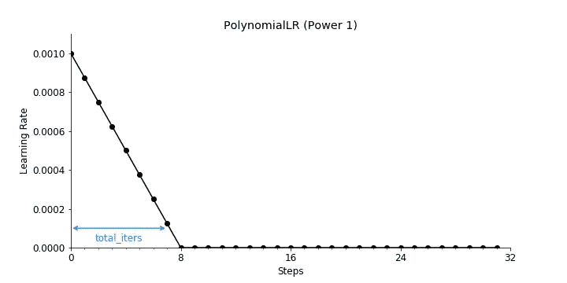

PyTorch 学习率调度器`PolynomialLR with Power = 1` (图片由作者提供)

使用`power = 2`得到的学习率衰减将如下所示。

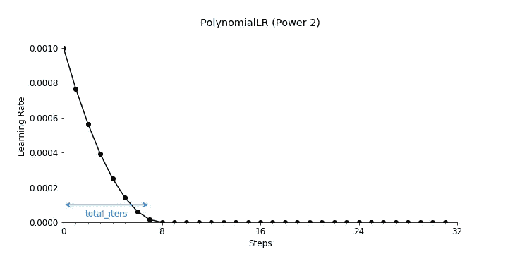

PyTorch 学习率调度器`PolynomialLR with Power = 2` (图片由作者提供)

## CosineAnnealingLR

`[CosineAnnealingLR](https://pytorch.org/docs/stable/generated/torch.optim.lr_scheduler.CosineAnnealingLR.html#torch.optim.lr_scheduler.CosineAnnealingLR)`通过余弦函数降低学习率。

虽然您可以从技术上安排学习率调整遵循多个周期，但想法是在最大迭代次数的半个周期内衰减学习率。

```
from torch.optim.lr_scheduler import CosineAnnealingLR

scheduler = CosineAnnealingLR(optimizer,
                              T_max = 32, # Maximum number of iterations.
                             eta_min = 1e-4) # Minimum learning rate.
```

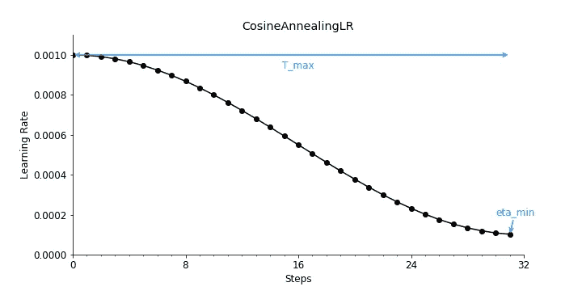

PyTorch 学习率调度器`CosineAnnealingLR` (图片由作者提供)

两位 Kaggle 竞赛大师 Philipp Singer 和 Yauhen Babakhin 推荐使用余弦衰减作为深度迁移学习的学习速率调度器[2]。

## CosineAnnealingWarmRestartsLR

`[CosineAnnealingWarmRestarts](https://pytorch.org/docs/stable/generated/torch.optim.lr_scheduler.CosineAnnealingWarmRestarts.html#torch.optim.lr_scheduler.CosineAnnealingWarmRestarts)`类似于余弦退火程序。但是，它允许您使用初始 LR 在每个时期重新启动 LR 计划。

```
from torch.optim.lr_scheduler import CosineAnnealingWarmRestarts
scheduler = CosineAnnealingWarmRestarts(optimizer, 
                                        T_0 = 8,# Number of iterations for the first restart
                                        T_mult = 1, # A factor increases TiTi​ after a restart
                                        eta_min = 1e-4) # Minimum learning rate
```

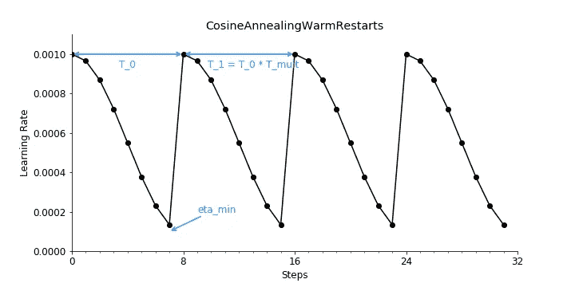

PyTorch 学习率调度器`CosineAnnealingWarmRestarts` (图片由作者提供)

这被称为热重启，于 2017 年推出[1]。增加 LR 会导致模型发散。然而，这种有意的发散使得模型能够避开局部极小值并找到更好的全局极小值。

## CyclicLR

`[CyclicLR](https://pytorch.org/docs/stable/generated/torch.optim.lr_scheduler.CyclicLR.html#torch.optim.lr_scheduler.CyclicLR)`根据循环学习率策略调整学习率，该策略基于我们在上一节刚刚讨论过的热重启概念。PyTorch 中有三个内置策略。

```
from torch.optim.lr_scheduler import CyclicLR

scheduler = CyclicLR(optimizer, 
                     base_lr = 0.0001, # Initial learning rate which is the lower boundary in the cycle for each parameter group
                     max_lr = 1e-3, # Upper learning rate boundaries in the cycle for each parameter group
                     step_size_up = 4, # Number of training iterations in the increasing half of a cycle
                     mode = "triangular") 
```

使用`mode = "triangular"`,得到的学习率衰减将遵循基本的三角周期，没有幅度缩放，如下所示。


PyTorch 学习率调度器`CyclicLR with mode = 'triangular'` (图片由作者提供)

使用`mode = "triangular2"`，最终的学习率衰减将遵循一个基本的三角周期，在每个周期将初始振幅减半，如下所示。

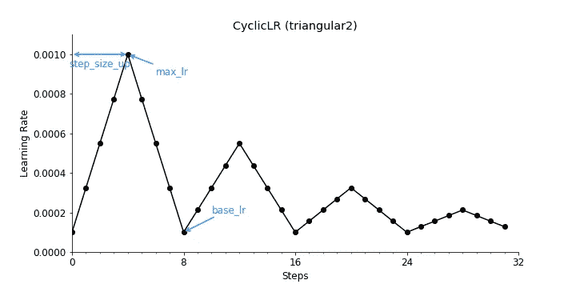

PyTorch 学习率调度器`CyclicLR with mode = 'triangular2'` (图片由作者提供)

使用`mode = "exp_range"`得到的学习率衰减将如下所示。

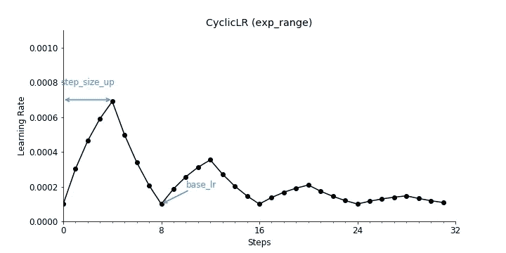

PyTorch 学习率调度器`CyclicLR with mode = 'exp_range'` (图片由作者提供)

## OneCycleLR

`[OneCycleLR](https://pytorch.org/docs/stable/generated/torch.optim.lr_scheduler.OneCycleLR.html#torch.optim.lr_scheduler.OneCycleLR)`根据 1cycle 学习率策略降低学习率，该策略在 2017 年的一篇论文中介绍过[3]。

与许多其他学习率调度器相比，学习率不仅在训练过程中降低。相反，学习率从初始学习率增加到某个最大学习率，然后再次降低。

```
from torch.optim.lr_scheduler import OneCycleLR

scheduler = OneCycleLR(optimizer, 
                       max_lr = 1e-3, # Upper learning rate boundaries in the cycle for each parameter group
                       steps_per_epoch = 8, # The number of steps per epoch to train for.
                       epochs = 4, # The number of epochs to train for.
                       anneal_strategy = 'cos') # Specifies the annealing strategy
```

使用`anneal_strategy = "cos"`得到的学习率衰减将如下所示。

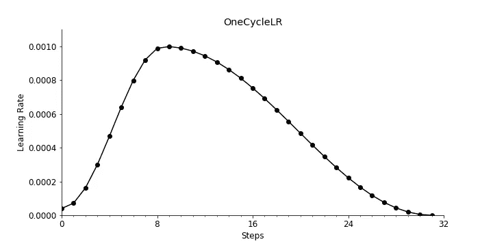

PyTorch 学习率调度器`OneCycleLR with` anneal_strategy = 'cos '(图片由作者提供)

使用`anneal_strategy = "linear"`得到的学习率衰减将如下所示。


PyTorch 学习率调度器`OneCycleLR with` anneal_strategy = 'linear '(图片由作者提供)

## reducelronplateaaulr

当指标停止改善时,`[ReduceLROnPlateau](https://pytorch.org/docs/stable/generated/torch.optim.lr_scheduler.ReduceLROnPlateau.html#torch.optim.lr_scheduler.ReduceLROnPlateau)`会降低学习率。正如您所猜测的，这很难可视化，因为学习率降低的时间取决于您的模型、数据和超参数。

## 带有 Lambda 函数的定制学习率调度程序

如果内置的学习率调度程序不能满足你的需要，你可以定义一个带有 lambda 函数的调度程序。lambda 函数是一个基于纪元值返回乘法因子的函数。

`[LambdaLR](https://pytorch.org/docs/stable/generated/torch.optim.lr_scheduler.LambdaLR.html#torch.optim.lr_scheduler.LambdaLR)`通过将来自λ函数的乘法因子应用于**初始** LR 来调整学习率。

```
lr_epoch[t] = lr_initial * lambda(epoch)
```

另一方面，`[MultiplicativeLR](https://pytorch.org/docs/stable/generated/torch.optim.lr_scheduler.MultiplicativeLR.html#torch.optim.lr_scheduler.MultiplicativeLR)`通过将来自 lambda 函数的乘法因子应用于前一时期的 LR 来调整学习率。

```
lr_epoch[t] = lr_epoch[t-1] * lambda(epoch)
```

这些学习率调度器也有点难以可视化，因为它们高度依赖于定义的 lambda 函数。

# 结论和可视备忘单

现在你已经看到了各种不同的内置 PyTorch 学习速率调度器，你可能很好奇你应该为你的深度学习项目选择哪种学习速率调度器。

不幸的是，答案并不那么容易——在生活中经常如此。有一段时间，`[ReduceLROnPlateau](https://pytorch.org/docs/stable/generated/torch.optim.lr_scheduler.ReduceLROnPlateau.html#torch.optim.lr_scheduler.ReduceLROnPlateau)`是一个流行的学习率调度器。如今，像`[CosineAnnealingLR](https://pytorch.org/docs/stable/generated/torch.optim.lr_scheduler.CosineAnnealingLR.html#torch.optim.lr_scheduler.CosineAnnealingLR)`和`[OneCycleLR](https://pytorch.org/docs/stable/generated/torch.optim.lr_scheduler.OneCycleLR.html#torch.optim.lr_scheduler.OneCycleLR)`这样的方法或者像`[CosineAnnealingWarmRestarts](https://pytorch.org/docs/stable/generated/torch.optim.lr_scheduler.CosineAnnealingWarmRestarts.html#torch.optim.lr_scheduler.CosineAnnealingWarmRestarts)`和`[CyclicLR](https://pytorch.org/docs/stable/generated/torch.optim.lr_scheduler.CyclicLR.html#torch.optim.lr_scheduler.CyclicLR)`这样的热重启方法越来越受欢迎。

尽管如此，您可能需要运行一些实验来确定哪种学习速率调度程序最适合您的问题。但是，我们可以说的是，使用任何学习调度程序最有可能导致更好的模型性能。

下面是 PyTorch 中所讨论的学习率调度器的可视化总结。


PyTorch 中学习率调度器的备忘单(图片由作者提供)

# 喜欢这个故事吗？

*如果你想把我的新故事直接发到你的收件箱，* [*订阅*](https://medium.com/subscribe/@iamleonie) *！*

*成为媒介会员，阅读更多其他作家和我的故事。报名时可以用我的* [*推荐链接*](https://medium.com/@iamleonie/membership) *支持我。我将收取佣金，不需要你额外付费。*

[](https://medium.com/@iamleonie/membership) [## 通过我的推荐链接加入 Medium—Leonie Monigatti

### 阅读 Leonie Monigatti(以及媒体上成千上万的其他作家)的每一个故事。您的会员费直接…

medium.com](https://medium.com/@iamleonie/membership) 

*在*[*Twitter*](https://twitter.com/helloiamleonie)*[*LinkedIn*](https://www.linkedin.com/in/804250ab/)*[*Kaggle*](https://www.kaggle.com/iamleonie)*！***

# **参考**

**[1] Loshchilov，I .，& Hutter，F. (2016)。Sgdr:带有热重启的随机梯度下降。arXiv 预印本 arXiv:1608.03983 。**

**[2] Singer，P. & Babakhin，Y. (2022) [深度迁移学习的实用技巧。2022 年巴黎卡格勒日。](https://drive.google.com/drive/folders/1VtJF-zPbXc-V-UDl2bDgWJp05DnKZpQH)**

**[3]纽约州史密斯和托平(2019 年)。超收敛:使用大学习率非常快速地训练神经网络。在*面向多领域运算应用的人工智能和机器学习*(第 11006 卷，第 369–386 页)。SPIE。**

# **附录**

**下面是我用来可视化学习率调度程序的代码:**

```
**import torch
from torch.optim.lr_scheduler import StepLR # Import your choice of scheduler here

import matplotlib.pyplot as plt
from matplotlib.ticker import MultipleLocator

LEARNING_RATE = 1e-3
EPOCHS = 4
STEPS_IN_EPOCH = 8

# Set model and optimizer
model = torch.nn.Linear(2, 1)
optimizer = torch.optim.SGD(model.parameters(), lr=LEARNING_RATE)

# Define your scheduler here as described above
# ...

# Get learning rates as each training step
learning_rates = []

for i in range(EPOCHS*STEPS_IN_EPOCH):
    optimizer.step()
    learning_rates.append(optimizer.param_groups[0]["lr"])
    scheduler.step()

# Visualize learinig rate scheduler
fig, ax = plt.subplots(1,1, figsize=(10,5))
ax.plot(range(EPOCHS*STEPS_IN_EPOCH), 
        learning_rates,
        marker='o', 
        color='black')
ax.set_xlim([0, EPOCHS*STEPS_IN_EPOCH])
ax.set_ylim([0, LEARNING_RATE + 0.0001])
ax.set_xlabel('Steps')
ax.set_ylabel('Learning Rate')
ax.spines['top'].set_visible(False)
ax.spines['right'].set_visible(False)
ax.xaxis.set_major_locator(MultipleLocator(STEPS_IN_EPOCH))
ax.xaxis.set_minor_locator(MultipleLocator(1))
plt.show()**
```