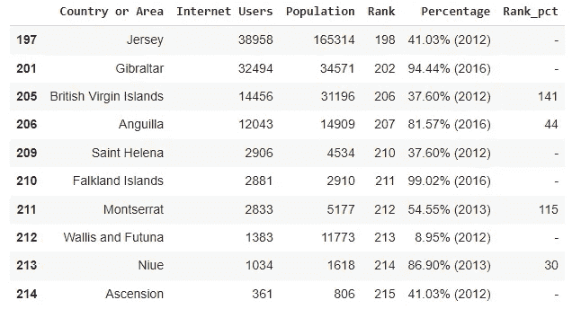
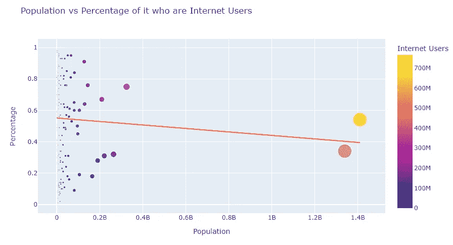
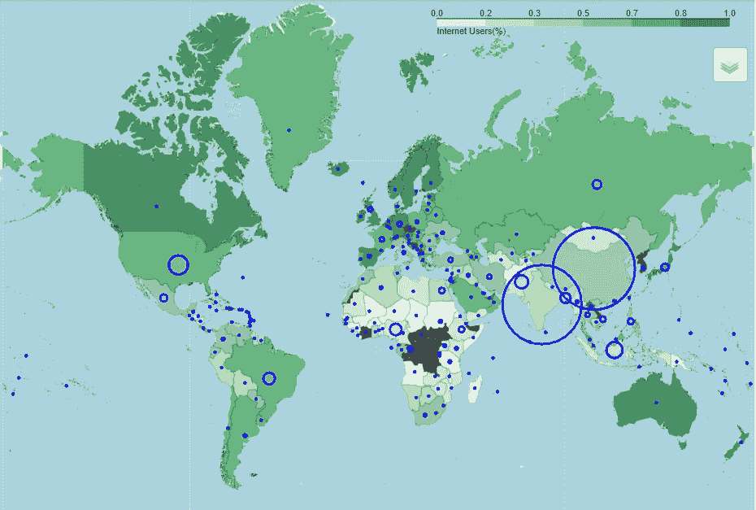

# 数据可视化的工作流

> 原文：<https://towardsdatascience.com/a-workflow-for-data-visualization-c887d57d7ef1>

## 使用这个循序渐进的工作流程创建更有意义的可视化效果


作者图片

最近从编辑那里拿到了这本书 [*《生物技术和生命科学中的机器学习:使用 Python 构建机器学习模型并部署在云上*](https://www.amazon.com/Machine-Learning-Biotechnology-Life-Sciences/dp/1801811911/ref=sr_1_1?crid=366VHUA40WBOP&keywords=biotechnology+packt&qid=1647374173&sprefix=biotechnology+packt%2Caps%2C63&sr=8-1) 来评论并给出我的看法。

虽然这不是一个关于这本书本身的帖子，但我想指出的一点是，内容非常扎实。作者是 *Saleh Alkhalifa* ，他研究了除生物技术之外的许多概念，如关系数据库、Python、Data Viz、云*等*。

引起我注意的一件事是这个关于数据可视化的工作流程。我将在这篇文章中详细介绍每一个步骤，但是请注意每一步的代码和解释都是我的。我只是用 Alkhalifa 的工作流程向你展示一个数据可视化的好例子。有时，步骤中的任务会相互重叠。

> **获取**:从数据源获取数据
> 
> **了解**:了解数据，了解类别和特性
> 
> **过滤器**:清理数据，去除缺失或错误的值
> 
> **挖掘**:识别模式，设计新功能
> 
> **浓缩**:分离出最有意义的特征
> 
> **代表**:选择这些特征的代表

## 获取数据

显然，好的可视化的第一步是有一些数据要查看，对吗？如果我没有事实，我就不能给你讲故事。

要获取数据，有许多可能，例如 SQL 查询、Excel 或 csv 格式的公司内部报告、来自互联网的数据集、来自政府、组织等。

在这个例子中，我将使用 Python 和 Pandas 来获取数据。数据集是这个关于 2018 年*国家互联网用户的数据集*来自 [Kaggle](https://www.kaggle.com/datasets/tanuprabhu/list-of-countries-by-number-of-internet-users) 。原始资料来自维基百科，使用知识共享署名-相似分享许可 3.0。

```
# Reading the data from a csv
internet = pd.read_csv(file_path)
internet.head(10)
```


数据集的头。图片由作者提供。

## 了解您的数据

这一部分非常重要，因为在这里你将真正开始构思你想讲什么故事，你想向观众展示什么。

理解数据，实际上就是熟悉变量和变量中的内容，也许是绘制一些分布和统计描述。

```
# Check data types
internet.info() *>> Here we will have to clean some wrong data since the columns Percentage and Rank_pct have some wrong values. This will be shown in the Filter Section*-------
# Check the dataset shape
internet.shape
**[OUT]:** (215, 6)-------
# Check if there are duplicated countries
internet['Country or Area'].duplicated().sum()
**[OUT]:** 0-------
# Variables correlation
internet.corr().round(2).style.background_gradient(cmap='coolwarm')-------
# Statistical Description
internet.describe()
```


数据集中的相关性。图片由作者提供。


数据集的统计数据。图片由作者提供。

从上面的描述中，我们已经可以发现一些初步的见解:

*   各国互联网用户的中位数为 250 万人。
*   我们不会考虑平均数，因为数据中有很大的差异。只看最小值和最大值。同样，很容易看出标准偏差几乎是平均值的 4 倍。因此，差异相当大。
*   人口遵循这一模式，因为用户和人口都具有 0.96 的强相关性。
*   2018 年，连接到互联网的人口比例约为全球的 55%。


箱线图。图片由作者提供。

## 过滤器

过滤器部分是关于清理和切片数据来讲述你的故事。

由于数据集非常小，只有 215 个条目，我们不能根据我们试图创建的可视化删除太多的行。我们来看看这个数据在缺失值方面有多可靠。

```
# Missing data
internet.isnull().sum()
**[OUT]:** Country or Area    0 
Internet Users     0 
Population         0 
Rank               0 
Percentage         0 
Rank_pct           0 
dtype: int64
```

很好，没有遗漏信息。我们可以继续分析了。但是，如前所述，我们需要对列 *Percentage* 和 *Rank_pct 进行一些清理。*我们知道这些列可能有一个非数字的数字，因此它们被强制为字符串。所以让我们使用正则表达式来找到有问题的值。

```
# import re for regular expressions
import re# Check for non-numeric values
non_number = internet.Percentage.apply(lambda x: re.findall('^[1234567890]*', x) != ['0'])# slice on the problematic values
internet[non_number]
```



数据不是来自 2018 年的值有一个括号。图片由作者提供。

从这里，我们可以选择删除这些值，或者只删除(XXXX)并使用最新的值。我会选择放弃它们。

```
# Drop those values
internet.drop(internet[non_number].index, axis=0, inplace=True)# Assign correct value type
internet = internet.astype({'Percentage':float,'Rank_pct': int})
```

## 我的

在这一步中，我们将找到绘制数据的最佳模式。

嗯，我们可能在这个数据集中发现的最强模式是人口和互联网用户之间的正相关。因此，人口越多，互联网用户的数量就越多。让我们用图表来看看。

```
# Plot Internet vs Population size
px.scatter(internet, x= 'Population', y= 'Internet Users')
```


尽管中国和印度是例外，但这种相关性是强而正的。图片由作者提供。

然而，我们不能说人口越多的国家互联网用户就越多。

```
# Rank vs Pop Size
px.scatter(internet, x= 'Population', y= 'Percentage',
   size= 'Population', trendline="ols",
   title= "Population vs Percentage of it who are Internet Users", 
   color= 'Internet Users')
```



弱相关。图片由作者提供。

显然，我们可以做得更多，从其他数据集获取信息，如国家 GDP，并检查国家经济发展与互联网普及率之间的关系。但是为了简单起见，我们在这篇文章中没有这样做。

## 凝结

Condense now 意味着我们必须审视我们迄今为止所做的工作，并挑选出最佳见解，将它们整合在一起，以便能够在下一部分创建故事。

到目前为止，我们已经加载了数据，理解了数据，删除了丢失的值和错误的条目，然后检查了数据中的一些关系。

在这一步中，我将选择最佳特征以在下一步中创建可视化。

我知道我将使用地图来表示这些数据。由于我们处理的是国家数据，而观测数据不是时间序列，我认为最好的数据呈现方式是在地图上。因此，我将只省去两个排名栏。

## 代表

让我们绘制这些国家的地图，用互联网渗透率制作一个 choropleth 图层来显示它有多好，然后我们还将绘制气泡图来显示那个国家的人口规模。

下面是代码和结果:

```
# Import Folium for plot
import folium# Add population in millions column for better plotting
internet['pop_millions'] = internet.Population.div(1_000_000)# Bring lat long by country
lat_long = pd.read_html('[https://developers.google.com/public-data/docs/canonical/countries_csv')[0](https://developers.google.com/public-data/docs/canonical/countries_csv')[0)]
lat_long.reset_index(inplace=True)
# Correct Country names to match
lat_long.name.replace({'Myanmar [Burma]': 'Myanmar',
                       "Côte d'Ivoire": 'Ivory Coast',
                       "Congo [Republic]": 'Republic of the Congo',
                       "Palestinian Territories": 'Palestinian Authority',
                       "Macedonia [FYROM]": 'Macedonia',
                       "Timor-Leste": 'Timor Leste',
                       "Cape Verde": 'Cabo Verde'}, inplace=True)internet['Country or Area'].replace({'South Sudan': 'Sudan',
                                     'Democratic Republic of the Congo': 'Republic of the Congo',
                                      'The Gambia': 'Gambia',
                                     'The Bahamas' : 'Bahamas',
                                     'Micronesia, Federated States of': 'Micronesia'}, inplace=True)# json file for the world map
map_geo = '/content/globe.geo.json'
# Create the base map
m = folium.Map(location=[50, 0], zoom_start=3)# Create Choropleth layer
folium.Choropleth(
    geo_data=map_geo,
    name='choropleth',
    data=internet,
    columns=['Country or Area', 'Percentage'],
    key_on='feature.properties.name',
    fill_color='YlOrRd',
    fill_opacity=0.7,
    line_opacity=0.2,
    legend_name='Internet Users(%)').add_to(m)# Add Bubbles for the size of the country
for country in internet['Country or Area']:
  folium.CircleMarker(location= [ lat_long.query('name == [@country](http://twitter.com/country)')['latitude'].values[0], lat_long.query('name == [@country](http://twitter.com/country)')['longitude'].values[0] ],
                      radius=internet.query('`Country or Area` == [@country](http://twitter.com/country)')['Population'].values[0]/25000000,
                      color='blue',
                      fill=True, 
                      fill_color='red').add_to(m)folium.LayerControl().add_to(m)# View
m
```



彩色层是使用互联网的人口百分比，气泡是人口规模。图片由作者提供。

一些结论是，人口规模本身并不是互联网渗透率的良好指标。然而，我们看到绿色越深的国家(互联网用户越多)人口越少。我们还可以看到，美洲和欧洲的互联网普及率高于非洲国家和中美洲部分地区。考虑到一些国家人口众多，亚洲正在努力适应中绿色。

## 在你走之前

创建可视化并不是一件容易事情，但是我确信这个工作流程将帮助你从现在开始在你的头脑中构建这个任务。

请记住，我们必须加载，理解，清理，选择变量和最好的形式来代表你的故事。

如果您对数据有很好的理解，那么创建相关的可视化就会变得更容易。

如果这个内容你感兴趣，关注我。

[](https://gustavorsantos.medium.com/) [## 古斯塔沃·桑托斯-中等

### 阅读古斯塔夫·桑托斯在媒介上的作品。数据科学家。我从数据中提取见解，以帮助个人和公司…

gustavorsantos.medium.com](https://gustavorsantos.medium.com/) 

## 参考

[叶文档](https://python-visualization.github.io/folium/quickstart.html#Getting-Started)。

[Git Hub 中的代码和数据集。](https://github.com/gurezende/Studying/tree/master/Python/DataViz)