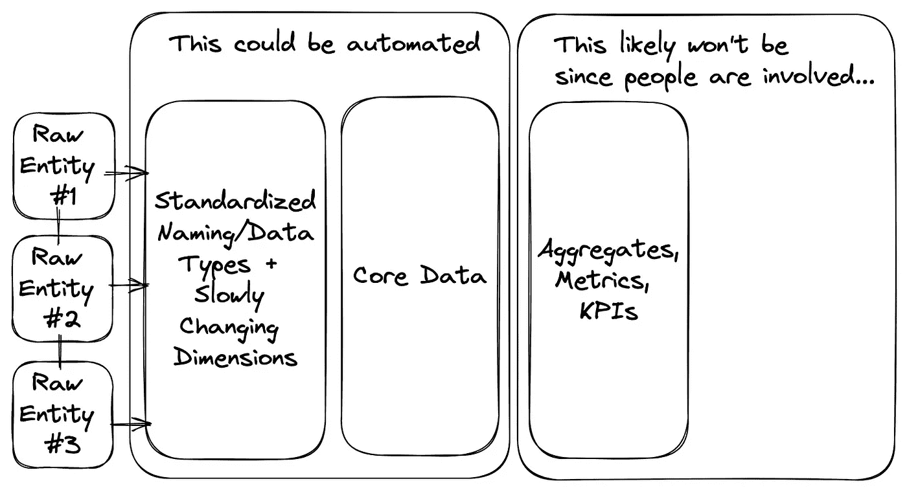

# 零 ETL 的未来

> 原文：<https://towardsdatascience.com/a-zero-etl-future-83c0d377ad95>

## AWS 和雪花能减少数据重复吗？

照片由[seli̇m·阿尔达·埃里希马兹](https://unsplash.com/@selimarda?utm_source=medium&utm_medium=referral)在 [Unsplash](https://unsplash.com?utm_source=medium&utm_medium=referral) 上拍摄

AWS 已经赶上了消除 ETL 需求的潮流。Snowflake 通过其混合表以及与 Salesforce 的合作伙伴关系宣布了这一点。

现在，我对“零 ETL”的命名有点异议。因为从表面上看，所描述的功能通常更接近于零集成的未来，这可能不够“令人兴奋”。这也可能只是 AWS 和雪花计划的第一阶段，以消除对 ETL 的需求。

总的来说，我同意减少存在的重复逻辑和数据的想法。作为一名专业的数据工程师，我确实觉得有时候数据管道会变得过于复杂，而且非常脆弱，这取决于它们对数据生产者的依赖程度。因此，如果有某种形式的途径通向零 ETL 世界，我们应该让它发生。

但是需要什么呢？

在本文中，我将经历一个零 ETL 的未来，以及我们如何实现它。

# 感知的问题

当我读到或听到这样的公告时，我认为其中有未讨论的细微差别。但我发现，当企业阅读这些类型的公告时，他们会从表面上看。

他们回来告诉他们的团队，我们希望走向无代码、零 ETL 和无服务器的未来。从商业角度来看，这一切听起来都不错:[成本将会降低](https://www.theseattledataguy.com/reducing-data-analytics-costs-in-2023-doing-more-with-less/#page-content)，人员数量可以大幅削减，数据的价值可以立即获得。

但是这将跳过所有其他不可避免的细微差别。

我读过的一篇文章甚至说:

> ETL 是每个数据科学家和团队的祸根，因为他们试图让数据成型并投入工作。正如 AWS 首席执行官 Adam Selipsky 解释的那样，您可能在许多不同的地方有数据，如数据库中的应用程序使用数据和数据湖中的客户评论。迄今为止，将它们组合在一起一直是一个巨大的挑战。— [技术危机](https://techcrunch.com/2022/11/29/amazon-takes-a-step-towards-a-zero-etl-future-with-two-announcements-at-reinvent/)

这听起来好像通过 AWS 的解决方案，数据科学家的问题将不复存在。是的，如果我们可以创造一个零 ETL 的世界，数据科学家可以简单地从他们想要的任何地方提取数据，而不需要与数据工程师交谈。奇怪的是，他们跳过了数据工程师，只提到了对数据科学家的影响。

但是能做到吗？数据科学家能生活在一个只有数据存在的世界吗？

在深入零 ETL 的未来之前，让我们回顾一下 ETL 存在的一些原因。

# 我们为什么要 ETL

简单地将数据从 A 点复制到 B 点不是 ETL。如果这就是我们需要做的，我们可以创建[复制数据库并报告这些](https://seattledataguy.substack.com/i/47552632/the-replicant-database)。那么，为什么要创建复杂的系统并使用像[气流或提督](https://seattledataguy.substack.com/p/should-you-use-apache-airflow)这样的工具呢？

为什么要聘请昂贵的[数据工程师](https://seattledataguy.substack.com/p/different-types-of-data-engineering)？

为什么还要 ETL？

我个人在脸书开始问自己这个问题。我们有 [Presto(现在是 Trino)](https://www.theseattledataguy.com/what-is-trino-and-why-is-it-great-at-processing-big-data/#page-content) ，它可以从技术上直接从 MySQL 源查询大量数据。我们需要 toETL 吗？

**历史数据** —一般来说，大多数可操作的数据库不会跟踪历史数据。具体来说，它们不会跟踪历史上不断变化的实体数据，比如客户住在哪里。

因此，当数据被更新或删除时，如果您没有使用 CDC(变更数据捕获),您将会丢失信息。这就是为什么存在渐变维度的概念，以帮助跟踪信息，确保如果客户搬家或员工跳槽，我们可以随着时间的推移准确地反映出来。

别误会我的意思。除了传统的 SCD(s [低变化维度](https://www.sqlshack.com/implementing-slowly-changing-dimensions-scds-in-data-warehouses/))之外，您可以做的只是创建一个日期分区，并将数据加载到一个不断扩展的表中。我们在脸书经常这样做，因为这是一个更简单的设计。

但这也让分析师和数据科学家更难查询数据。在很多情况下，我必须构建一个二级表，添加逻辑来跟踪每个日期分区的变化。

因此，最终，从数据模型中移除缓慢变化的维度的概念可能会非常棘手(但也许我们可以自动化它？)

整合数据 —在脸书工作的主要好处之一是数据在应用程序层面的整合程度。有一个[实体层，任何人在构建他们的新特性的时候都可以从中提取出来](https://engineering.fb.com/2013/06/25/core-data/tao-the-power-of-the-graph/)，这意味着在应用程序端和分析端都可以很容易地将实体连接在一起。

当我在脸书工作结束时，我们已经将大部分[核心管道](https://www.youtube.com/watch?v=5P2luRwaKek)缩减到 30-50 行代码，因为这主要只是配置。甚至 SQL 部分也可能被删除。这在很大程度上是由这样一个事实驱动的，即因为实体层得到了很好的开发，我们不需要编写复杂的查询来尝试连接数据。

情况并非总是如此。许多公司都有各种形状和大小的数据，因此几乎不可能跨来源集成数据，或者需要额外的几百行 SQL 才能跨实体连接。

**易用性** —从 MongoDB 或 MySQL 等运营数据库中提取的数据通常以分析师难以处理的方式进行组织。你能想象把 MongoDB 的数据文件交给分析师吗？它嵌套很深，容易出错，很难做成任何可用的形状。

同样，来自传统 MySQL 数据库的高度规范化的数据模型也会带来问题。简单地将数据复制到 Redshift 或 Snowflake 将迫使分析师编写需要多个连接和可能的业务逻辑的查询。

同样，容易出错。

**对数据所做的许多事情，无论是标准化命名约定还是重塑数据，都是为了让分析师更容易访问数据。不仅仅是把它放入另一个数据库，而是把它当作一个用户可以与之互动的产品。**

尽管如此，我确实相信 ETL，至少是创建数据核心层的 ETL，在未来可能会被移除。

# 这个零 ETL 的未来需要什么？

# 实体层

如果更多的公司可以构建在应用层集成的系统，那么在集成数据方面就不会有任何问题。

这也会给应用团队和 SaaS 解决方案带来更多的责任。我确实相信这将带来一个重大的挑战，并且是为什么真正的零 ETL 未来会受到阻碍的主要原因。

# 命名和数据类型约定

标准化命名和类型约定将节省大量繁琐的工作。我认为有理由问…为什么数据工程师仍然必须编写小的“t”转换？

在一天结束的时候，我们最好都同意开始用标准化的约定命名所有的字段。

这将允许我们也标准化数据类型。当然，软件工程师也必须在日期格式上达成一致。

# 生产者所有权

> *数据仓库或任何独立的基础架构层都无法解决适用于 SaaS 应用的 ZeroETL。只有 SaaS 供应商负责将数据移动到他们客户的数据仓库，这一愿景才能实现。——*[*阿伦·图拉斯达兰*](https://www.linkedin.com/posts/arun-thulasidharan-53a1322b_zeroetl-zeroetl-datawarehouses-activity-7006633281739784192-bt9o?utm_source=share&utm_medium=member_desktop)

除了负责移动数据，SaaS 供应商和数据生产者还必须确保他们管理所有的逻辑和数据变更。

移除 ETL 最困难的部分是 t，而不是一些基本的转换，比如标准化命名约定和数据类型(实际上，为什么这还没有自动化)。即使加上缓慢变化的维度，也可以说是广义的。

不，在那之后会有更多的变化。任何需要人工管理的业务逻辑或奇怪的枚举器都必须由数据的生产者来处理，无论是公司应用程序还是 Salesforce。

# 真相

有些人可能会认为，因为我一开始是一名数据工程师，所以我想捍卫 ETL，这是我们承担的一项常见任务。然而，世界在变，如果世界不再需要数据工程师来构建 ETL 呢？那就这样吧。

现在[我认为这不会在未来两年内。](https://movedata.airbyte.com/event/data-contracts-are-so-hot-right-now-because-they-are-just-interfaces)尤其是在企业层面，对他们来说，从当前解决方案中迁移出来需要两年的时间(如果顺利的话)。所以即使他们今天就开始了，我们离零 ETL 还有很长的路要走。

你有什么想法，你能想象一个没有 ETL 的世界吗？需要什么？