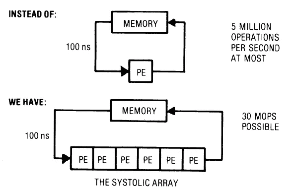
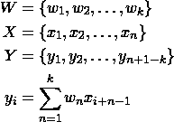
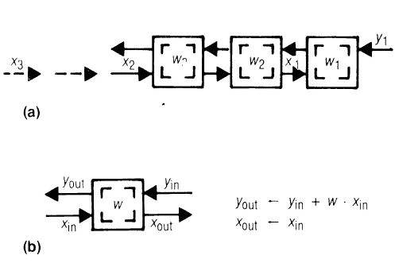
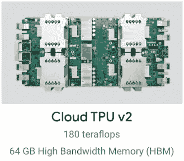
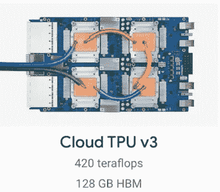
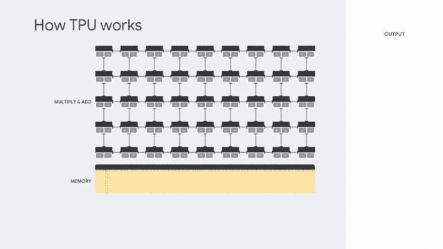
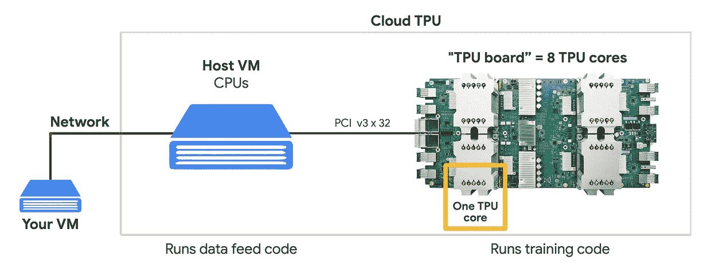
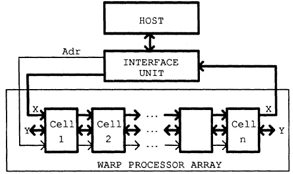

# 在谷歌 TPU 上使用 TensorFlow 加速分布式训练

> 原文：<https://towardsdatascience.com/accelerated-distributed-training-with-tensorflow-on-googles-tpu-52f1fe21da33>

## 了解您的硬件以优化您的软件


Cloud TPU v3 POD BY[Google Cloud](https://cloud.google.com/tpu)下 [(CC BY 4.0)](https://creativecommons.org/licenses/by/4.0/)

在这篇文章中，我将从硬件的角度向您展示张量处理单元(TPU)的基本原理，并一步一步地向您展示如何使用 TensorFlow 在 TPU 上执行加速分布式训练来训练您自己的模型。

# 概述

1.  [简介](#258a)
    1.1。[张量处理单元](#cda1)1.2
    。[分销策略](#Distribution Strategies)
2.  [用 TensorFlow](#dade)
    2.1 在 TPU 上实现分布式训练。[硬件检测](#8056)
    2.2。[分布式数据集](http://89ae)
    2.3。[手动降损](#a35e)
    2.4。[自定义训练循环](#9fce)
3.  [结论](#40af)
4.  [更多资源](#11c7)

# 1.介绍

无论是谷歌的[伯特](https://arxiv.org/abs/1810.04805)，OpenAI 的 [GPT-3](https://arxiv.org/abs/2005.14165) ，英伟达的[威震天图灵 NLG](https://developer.nvidia.com/blog/using-deepspeed-and-megatron-to-train-megatron-turing-nlg-530b-the-worlds-largest-and-most-powerful-generative-language-model/) 还是[谷歌的开关变形金刚](https://arxiv.org/abs/2101.03961)，这些模型都表明，通过大规模缩放你的模型和数据集，可以实现令人印象深刻的结果。虽然在这样的模型上运行推理已经是一个挑战，但训练模型更具挑战性。训练一个模型通常需要比推理多几个数量级的计算资源。需要大型硬件加速器集群在合理的时间内训练这些模型。除了 GPU 之外，张量处理单元(TPU)在训练模型中也起着重要的作用。为了利用 TPU 的高计算性能，理解底层硬件架构和理解必须如何准备代码是至关重要的。

让我们从一些解释开始，这些解释将帮助您了解 TPU 硬件的基本原理，并在实现代码时采取正确的措施。

在这篇文章的底部，你会找到一个笔记本的链接，在那里我用本文描述的技术改编了 TensorFLow 的 DCGAN 模型，并在 TPU 上训练该模型。

## 1.1.张量处理单元

张量处理单元是一种硬件加速器，用于加速矩阵的 MAC(乘法和累加)运算，这是机器学习中的主要运算之一。

底层硬件的性能依赖于许多方面，但有一个限制因素:内存接口。为了进行计算，处理器必须从内存中提取数据。有两个主要问题。第一个是内存访问延迟。访问存储器比对提取的数据执行计算花费更多的时钟周期，因为需要等待直到数据可用于计算。第二个是能耗。从 DRAM 读取数据比从芯片内部存储器读取数据需要更多的能量[3]。这种影响与时钟速度成线性比例关系，这意味着如果试图通过提高时钟速度来减少延迟，就必须考虑冷却策略。因此，性能瓶颈是内存接口。

如果可以以某种方式减少访问存储器的次数，就可以充分利用可用的计算资源，同时节省大量的电力。几十年前就已经提出了这个问题的解决方案:脉动阵列。想法很简单:对从内存中读取的单个数据项执行多个操作。它的灵感来自于通过我们身体泵送的血细胞。它们在心脏中开始循环，被泵送通过我们身体中的几个细胞，并循环回到心脏。心脏类似于记忆，每个细胞都是对血液进行操作的处理单元。图 1 中描绘了脉动阵列的抽象表示，其中 PE 是处理元件的一般形式。



图 1 心脏收缩系统的基本原理[4]

一般来说，PE 可以是任何东西，从单个逻辑门到整个处理器(链接回我们的 TPU 硬件)。过程如下:从内存中读取数据，由 PE 执行任意操作，将数据传递给下一个 PE，最后，在最后一个 PE 之后，将计算结果写回内存。

让我们更具体地看一个简单的例子。考虑一维卷积问题，这里我们有一个权重序列 *W* ，一个输入序列 *X* 。我们将计算输出序列 *Y* 及其元素 *y_i* 。



这个问题可以用图 2 所示的收缩期阵列来解决



图 2 收缩期卷积阵列(a)和单元(b ),其中 w_i 保持不变，x_i 和 y_j 在收缩期向相反方向移动[4]

在这种情况下，PE 有两个输入和两个输出。权重被预加载，同时数据 *x* 流经数组，计算各自的输出 *y* 。

上面的脉动阵列是一个简化的例子，有助于我们理解其背后的思想。在 TPU 中，脉动阵列以更复杂的方式使用，因为矩阵乘法单元伴随有向量和标量单元、高带宽互连和高带宽存储器接口。图 3 描绘了谷歌的 TPUv2 和 TPUv3。



图 3: Google 的张量处理单元，(左)Google Colab 中可用的 TPUv2，(中)Kaggle 中可用的 TPUv3，(右)由 [Google Cloud](https://cloud.google.com/tpu/docs/intro-to-tpu) 在 [(CC BY 4.0)](https://creativecommons.org/licenses/by/4.0/) 下制作的 TPU 的矩阵乘法单元动画

特别是 Google 的 TPUv2 实现了 8 核 180 万亿次浮点运算，每个都有一个 128x128 PEs 的二维脉动阵列。谷歌的 TPUv3 实现了高达 420 万亿次浮点运算。在其他改进中，TPUv3 将每个内核的脉动阵列数量增加了一倍，将每个内核的内存容量增加了一倍，引入了高带宽内存并改善了互连。上面提到的 FLOPS 是理论上限。在实践中，很难实现这些价值，因为不是所有的操作都受益于这种非常专业化的架构。此外，应该优化数据的输入管道，以保持 TPU 的计算资源繁忙。

脉动阵列和 TPU 一样，对于某些任务来说是高度专业化的。然而，训练机器学习模型需要更多的步骤，例如预处理数据或更新优化器状态。对于这样的任务，通用处理器(即 CPU)仍然是有益的。如果建立了到 Google 的一个云 TPU 的连接，那么实际上就建立了到一个主机 VM 的连接。该主机虚拟机管理与本地环境的通信，并通过高带宽 PCIe 接口控制 TPU(参见图 4)。



图 4[Google Cloud](https://cloud.google.com/tpu/docs/intro-to-tpu)在 [(CC BY 4.0)](https://creativecommons.org/licenses/by/4.0/) 、【右】WARP 架构下(左)云 TPU 界面对比[5]

几十年前(也是在 80 年代)，通过具有特殊编译器的通用主机来控制快速专用脉动阵列的想法再次被提出，即 WARP 架构。[5]这样的系统是可扩展的，最重要的是，对程序员隐藏了它们的复杂性。

如果你对谷歌 TPUs 的内部架构感兴趣，我推荐你观看[谷歌来自 Hot Chip 2020](https://www.youtube.com/watch?v=4bGoGjTRT9U) 的演示。

## 1.2.分销策略

在研究 TensorFlow 中的实现之前，理解分布式培训的概念很重要。我们之前已经看到 TPU 有几个内核。多核的出现实现了真正的时间并行，这意味着代码可以并行执行，而不仅仅是以时间复用的方式执行。至少有两种范例可以实现并行以加快训练过程:模型并行和数据并行。模型并行性和数据并行性的图形表示如图 3 所示。


图 3:并行训练编程习惯用法，(左)模型并行训练，(右)数据并行训练[2]

在模型并行中，模型的不同部分在不同的设备上训练，但是在相同的训练批次上。

在数据并行训练中，单个模型被镜像并分布在由主机设备管理的多个设备(也称为工作者)中。主机设备充当模型的参数服务器。每个工人在训练批次的子集上训练其模型。对每个员工单独计算损失，并将其发送到外派国。各个损失值通过例如将它们相加来组合。最后，主机更新模型的权重，并重新分配更新后的模型。在这种情况下，客户端的单个线程可以控制训练循环，而大部分模型计算分布在几个设备上。由于所有模型总是具有相同的参数，并且同步更新，这种方法被称为同步数据并行。

# 2.用 TensorFlow 在 TPU 上实现分布式训练

在 TPU 上分配你的训练并不像听起来那么琐碎，但绝对值得努力。在 Github 上的[这个笔记本里可以找到在 TPU 训练 DCGAN 的完整例子。](https://github.com/sascha-kirch/ML_Notebooks/blob/7591d0c595620a28ccccc028618619815fd0d607/GAN_distributed_training.ipynb)

## 2.1.硬件检测

第一步是连接到 TPU。与 CPU 和 GPU 环境相比，在 TPU 环境中，您必须显式检测并连接到 TPU。由于 Google Colab 和 Kaggle 中的 TPU 资源有限，您可能希望在 CPU/GPU 上开发和调试，并在 TPU 上执行培训。因此，脚本自动检测可用的硬件并自动设置所需的策略是很有用的(参见代码 1)。

代码 1:自动检测硬件并设置相应的策略

> 提示:自动硬件检测的实现可以在我在 [Github](https://github.com/sascha-kirch/DeepSaki) 或 [PyPi](https://pypi.org/project/DeepSaki/) 上的深度学习库 DeepSaki 中找到。

如果您正在运行一个 TPU 环境，例如 GoogleColab 或 Kaggle，您现在应该连接到您的 TPU。

## 2.2.分布式数据集

如前所述，当遵循同步数据并行范例时，您的训练数据将分布在所有工作人员中。TensorFlow 提供了一个从`[tf.data.Dataset](https://www.tensorflow.org/api_docs/python/tf/data/Dataset)`转换到`[tf.distribute.DistributedDataset](https://www.tensorflow.org/api_docs/python/tf/distribute/DistributedDataset)`的简单 API。这里举个例子:

```
train_distributed = strategy.experimental_distribute_dataset(train)
test_distributed = strategy.experimental_distribute_dataset(test)
```

在上面的例子中，`train`和`test`属于`tf.data.Dataset`类型。通常你会首先使用`batch()`、`cache()`或`map()`来定义你的输入管道，然后将你的数据集转换成分布式数据集。使用全局批处理大小而不是每个副本的批处理大小进行批处理非常重要。全局批次大小由所有副本中训练的批次数量决定。如果数据集除以可用于培训的员工人数，则为批量大小。

## 2.3.人工减少损失

您可能想知道为什么总是得到标量损失值，即使在计算多维损失时，比如两幅图像之间的像素损失。原因是:TensorFlow 执行自动损耗减少，在大多数情况下，损耗是通过对一个批次内的所有值求和并除以批次大小来减少的。实现自定义训练循环时，TensorFlow 要求您手动减少损失，因为不允许使用`tf.keras.losses.Reduction.AUTO`。

我们要做的基本上是重新实现上述行为。以下代码显示了使用[铰链损耗](https://en.wikipedia.org/wiki/Hinge_loss)的程序:

```
import tf.keras.losses as losses
loss_fn = losses.Hinge(reduction=losses.Reduction.NONE)
loss = loss_fn(ground_truth, prediction)
loss = tf.reduce_sum(loss) * (1./GLOBAL_BATCH_SIZE)
```

首先，定义损失函数，并应用无减少策略。因此不执行任何缩减。接下来，计算`ground_truth`和模型的`prediction`之间的损失。然后，`loss`的所有值相加得到一个标量。最后，标量损失由全局批处理大小来缩放，而不是当前副本的批处理大小。使用全局批处理大小而不是每个副本的批处理大小进行缩放的原因是，在引言中描述的数据并行性范例中，所有工作线程的损失被加在一起。关于实现的细节将在定制训练循环一节中介绍。

## 2.4.自定义训练循环

到目前为止，我们已经连接到 TPU，准备了分布式数据集并执行了手动损失缩放。最后缺失的部分是分布式训练循环。

该示例侧重于培训的实现，但也可以以类似的方式应用于验证。

假设我们已经通过子类化`tf.keras.Model`实现了自己的定制模型(参见代码 2)。为了实现我们的定制训练循环，我们首先必须实现两个方法:`train_step()`和`distributed_train_step()`。

占位符`(…)`表示缺少代码，这是特定于给定示例的，但对于解释定制训练循环并不重要。

方法`train_step()`计算损失函数相对于模型权重的梯度。梯度计算在`[tf.GradientTape](https://www.tensorflow.org/api_docs/python/tf/GradientTape)`的上下文中完成。最后，优化器应用更新的权重。

方法`distributed_train_step()`将`train_step()`的执行分配给所有工人，收集每个工人的最终损失，并对所有损失项求和。

装饰器`@[tf.function](https://www.tensorflow.org/api_docs/python/tf/function)`将装饰过的函数编译成图形，这加速了它的执行。

代码 2:分布式培训步骤的实现

定义好培训步骤后，我们现在可以继续最后一步:实现实际的培训循环。

代码 3:训练循环的实现

在这个函数中，我们使用 for 循环一次执行一个时期，直到所有时期都被执行。然后，我们在分布式数据集上逐批迭代，并在每一批上调用模型的`distributed_train_step()`方法。该方法返回所有工作线程的损失。我们对每一批的损失进行求和，并在迭代所有批后，根据训练的批数对结果进行缩放。

就是这样！祝贺你，你成功了！👏🎉

# 3.结论

我们已经从理解传统计算硬件的内存瓶颈走了很长一段路，引入了脉动阵列作为谷歌 TPU 的关键元素，讨论了分布式训练，最后研究了 TensorFlow 中的实现。TPU 具有惊人的性能指标，但因此是高度专业化的硬件，这意味着您可能无法充分利用它。

事实上，你可以免费访问 TPUs 是惊人的，因此，如果你知道如何使用它，这是一个很好的机会。

当然，TPU 并不是加速你训练的唯一方法。在其他技术中，你可以在 GPU/TPU 上使用混合精度进一步[加速你的 TensorFlow 训练，通过它你可以利用专门的 float16 加速。](https://medium.com/@SaschaKirch/speed-up-your-tensorflow-training-with-mixed-precision-on-gpu-tpu-acf4c8c0931c)

# 4.更多资源

1.  在 TPU 上训练 DCGAN 的笔记本: [Github](https://github.com/sascha-kirch/ML_Notebooks/blob/7591d0c595620a28ccccc028618619815fd0d607/GAN_distributed_training.ipynb)
2.  深度学习 python 库 DeepSaki: [Github](https://github.com/sascha-kirch/DeepSaki) 或者 [PyPi](https://pypi.org/project/DeepSaki/)
3.  关于[的指南在 GPU/TPU 上用混合精度加速你的 TensorFlow 训练](https://medium.com/@SaschaKirch/speed-up-your-tensorflow-training-with-mixed-precision-on-gpu-tpu-acf4c8c0931c)

[1]谷歌。2021."云 TPU . "谷歌云。检索到 2021 年 5 月 2 日([https://cloud.google.com/tpu/docs/system-architecture?hl=de](https://cloud.google.com/tpu/docs/system-architecture?hl=de))。

[2]阿巴迪等人 2016。"张量流:异构分布式系统上的大规模机器学习."*ArXiv:1603.04467【Cs】*。

[3] M. Horowitz，“计算的能源问题(以及我们可以做些什么)”，2014 年 IEEE 国际固态电路会议技术论文摘要(ISSCC)，美国加利福尼亚州三藩市，2014 年 2 月，第 10-14 页。doi: 10.1109/ISSCC.2014

[4]孔汉东(1982 年)。为什么选择脉动架构？IEEE 计算机，15(1)，37–46。[https://doi.org/10.1109/MC.1982.1653825](https://doi.org/10.1109/MC.1982.1653825)

[5] Annaratone，m .，Arnould，e .，Gross，t .，Kung，H. T .，Lam，m .，Menzilcioglu，o .，和 Webb，J. A. (1987 年)。翘曲计算机:结构、实现和性能。IEEE 计算机汇刊，36(12)。[https://doi.org/10.1109/TC.1987.5009502](https://doi.org/10.1109/TC.1987.5009502)