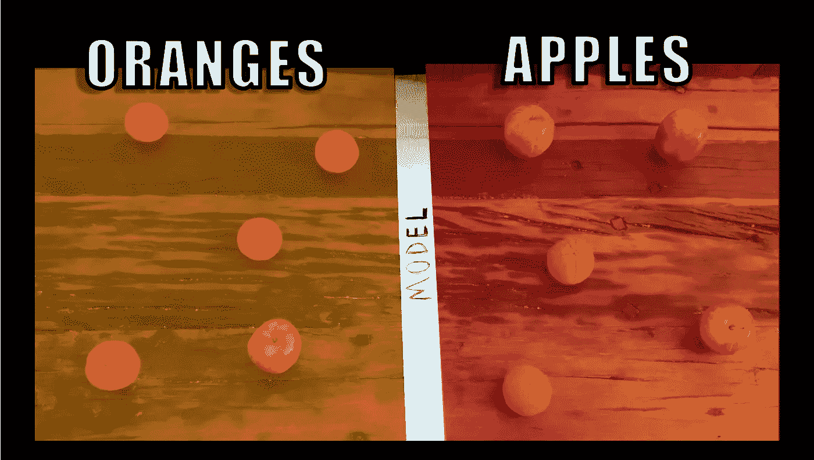
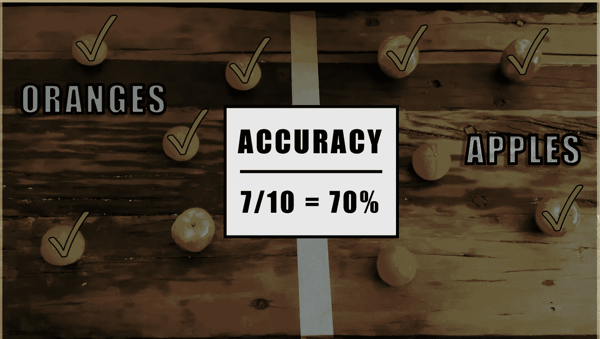
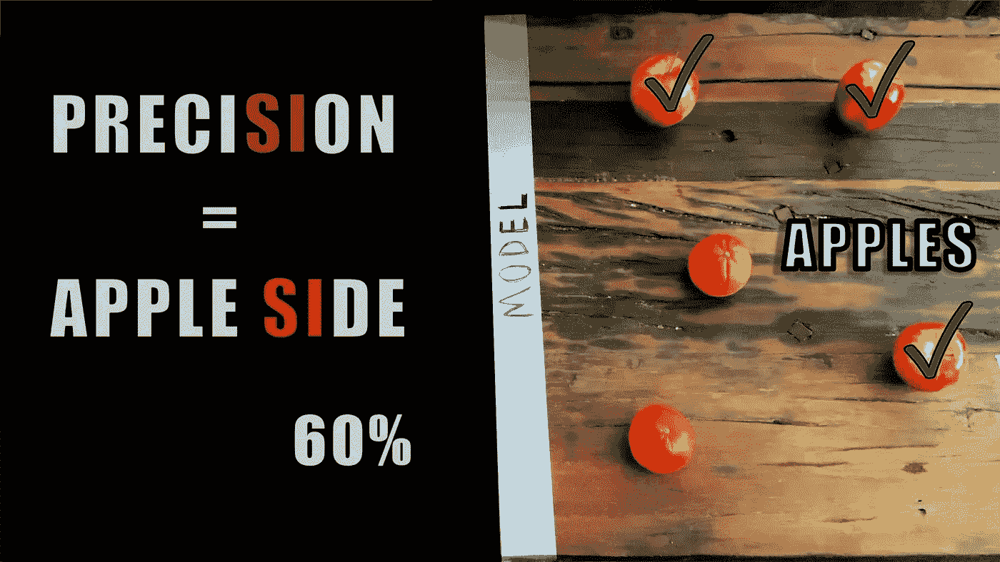
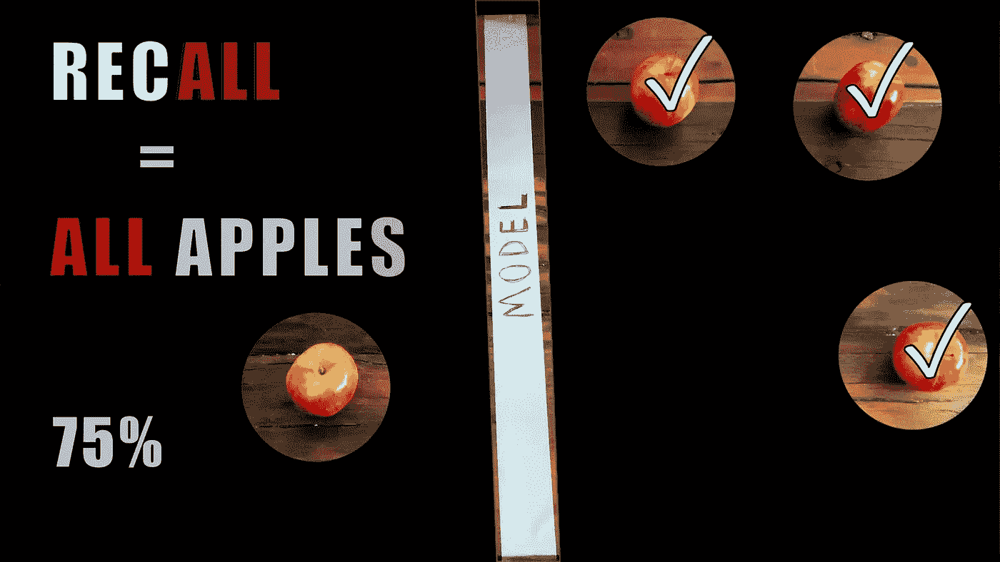
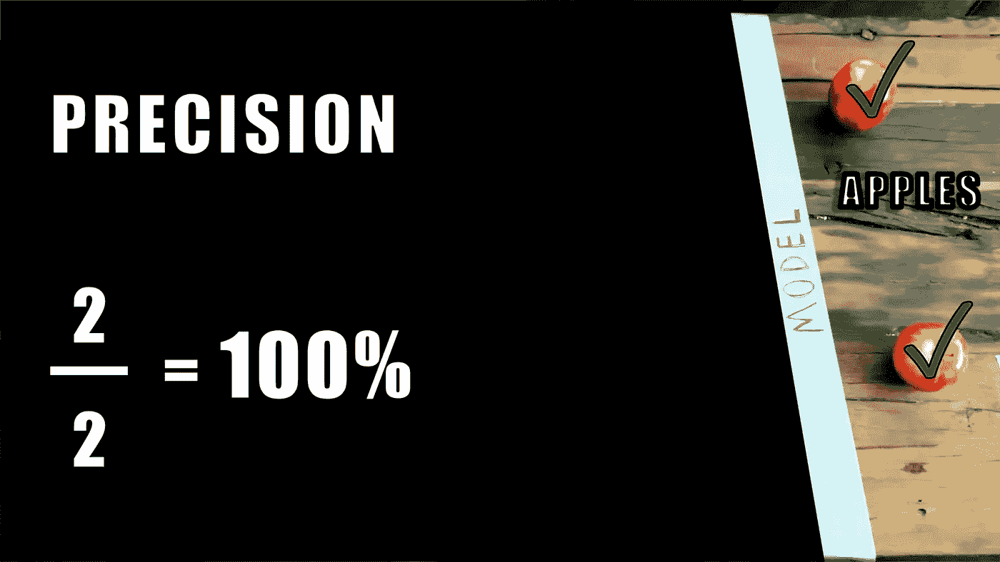
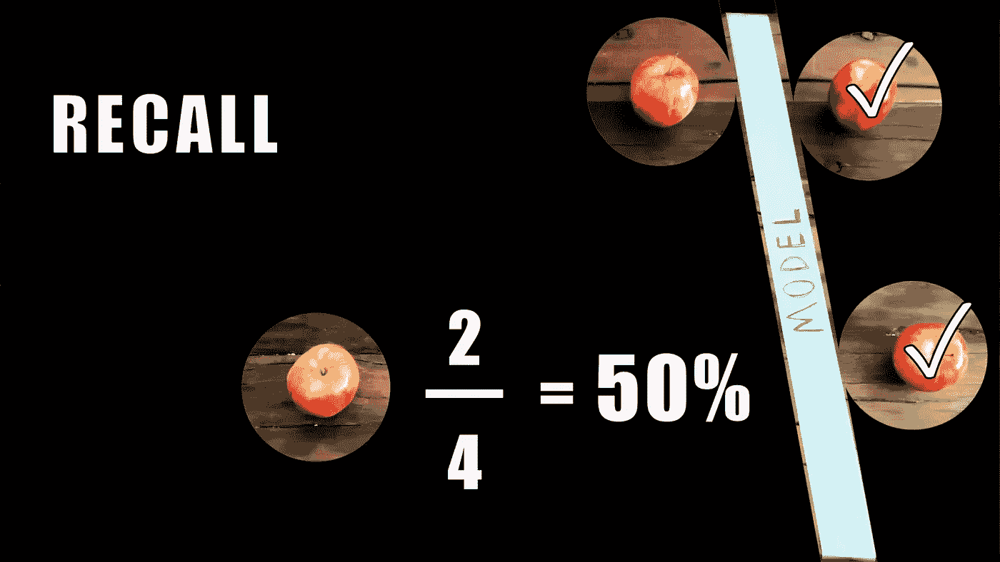
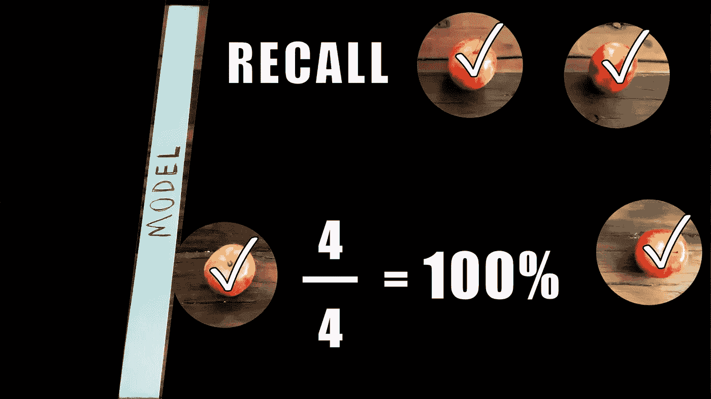
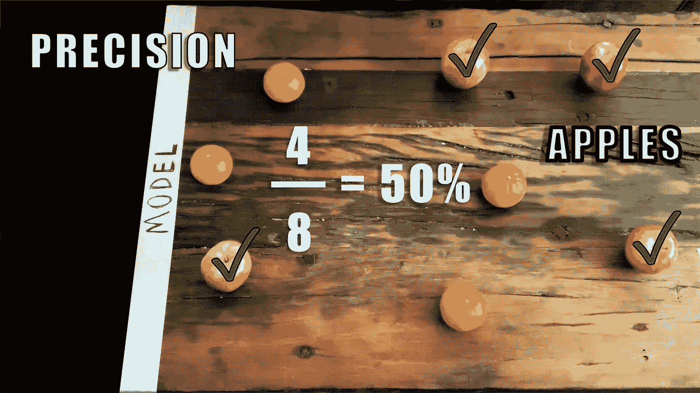

# 准确性、精确性和可回忆性——再也不会忘记！

> 原文：<https://towardsdatascience.com/accuracy-precision-and-recall-never-forget-again-33e64635780>

设计有效的分类模型需要预先选择合适的分类指标。这篇文章通过一个例子向你展示了三种可能的度量标准(准确度、精确度和召回率),同时教你如何容易地记住每一个标准的定义。

为了设计一个有效的监督机器学习模型，数据科学家必须首先选择合适的指标来判断他们的模型是否成功。但是选择一个有用的度量标准往往比预期的更具挑战性，特别是对于有大量不同度量标准选项的分类模型。

准确性仍然是最受欢迎的分类标准，因为它易于计算和理解。然而，准确度伴随着一些严重的缺点，特别是对于不平衡的分类问题，其中一个类别支配准确度计算。

在这篇文章中，让我们回顾一下准确性，同时定义另外两个分类指标:精确度和召回率。我将分享一种记忆精度和召回率的简单方法，并解释精度-召回率的权衡，这可以帮助您构建一个健壮的分类模型。

*除特别注明外，所有图片均为作者所有。*

# 模型和数据设置

为了使分类度量的研究更具相关性，可以考虑构建一个模型来对平面上的苹果和橙子进行分类，如下图中的表格所示。

大多数橙子出现在桌子的左边，而苹果大多出现在右边。因此，我们可以创建一个分类模型，将表从中间分开。桌子左侧的所有东西都会被模型认为是橙子，而右侧的所有东西都会被认为是苹果。

# 什么是准确性？

一旦我们建立了一个分类模型，我们如何确定它是否做得很好？准确性提供了一种判断分类模型的方法。要计算精确度，只需将所有正确分类的观察值加起来，然后除以观察值的总数。这个分类模型正确地将 4 个橙子和 3 个苹果分类，总共有 7 个正确的观察值，但是总共有 10 个水果。这个模型的准确率是 7/10，即 70%。

虽然准确性因其简单性而被证明是最受欢迎的分类标准之一，但它有几个主要缺陷。想象一下，我们有一个不平衡的数据集；也就是说，如果我们有 990 个橘子，只有 10 个苹果呢？一个达到非常高精度的分类模型预测所有的观察值都是橙子。准确率是 990/1000，或者 99%,但是这个模型完全忽略了苹果的所有观察。

此外，准确性平等地对待所有的观察。有时某些种类的错误应该比其他错误受到更重的惩罚；也就是说，某些类型的错误可能比其他类型的错误成本更高或风险更大。以预测欺诈为例。许多客户可能更希望他们的银行打电话给他们检查实际上合法的可疑收费(所谓的“假阳性”错误)，而不是允许欺诈性购买通过(“假阴性”)。精确度和召回率是有助于区分错误类型的两个度量，并且对于类不平衡的问题仍然是有用的。

# 精确度和召回率

精确度和召回率都只被定义为一个类别，通常是正类或少数类。让我们回到苹果和橘子的分类上来。这里我们将专门针对 apple 类计算精度和召回率。

精度衡量一个特定类的模型预测质量，因此对于精度计算，只放大模型的苹果一侧。你可以暂时忘记橙色的一面。

精度等于正确的苹果观察值的数量除以模型的苹果侧的所有观察值。在下面的示例中，模型正确识别了 3 个苹果，但它将总共 5 个水果归类为苹果。苹果精度是 5 分之 3，或者 60%。为了记住精度的定义，请注意 preci **SI** on 只关注模型的 apple **SI** de。

另一方面,“回忆”( Recall)衡量的是模型对某一特定类别的实际观察的效果。现在来看看这个模型对所有真实的苹果做了什么。为此，你可以假装所有的橙子都不存在。这个模型正确地识别了 4 个实际苹果中的 3 个；召回率是 3/4，即 75%。记住这个简单的助记法:rec **ALL** 聚焦于 **ALL** 实际的苹果。

想看看实际情况吗？查看随附的 YouTube 视频，观看视觉演示！

# 精确-召回权衡

那么，衡量精度和召回率而不是坚持准确性有什么好处呢？这些度量当然允许您强调一个特定的类，因为它们是一次为一个类定义的。这意味着，即使您有不平衡的类，您也可以测量少数类的精度和召回率，并且这些计算不会受多数类观察的支配。但事实证明，在精确度和召回率之间也有一个很好的权衡。

一些分类模型，例如逻辑回归，不仅预测每个观察值属于哪一类，还预测属于特定类的概率。例如，模型可以确定特定水果有 80%的概率是苹果，20%的概率是橙子。像这样的模型带有一个决策阈值，我们可以调整它来划分类别。

假设您想要提高模型的精度，因为避免错误地声称一个实际的橙子是一个苹果(假阳性)非常重要。你可以提高决策阈值，精度会变得更好。对于我们的苹果橙模型，这意味着将模型线向右移动。在示例图像中，更新的模型边界产生 100%的完美精度，因为所有预测的苹果实际上都是苹果。然而，当我们这样做时，回忆可能会减少，因为提高阈值除了错误的橙子之外，还会漏掉真正的苹果。在这里，回忆下降到 50%。

好吧，如果我们想提高回忆呢？我们可以通过将模型线向左移动来降低决策阈值。我们现在在我们的模型的苹果侧捕获更多的实际苹果，但是当我们这样做时，我们的精度可能会降低，因为更多的橙子也会潜入苹果侧。这次更新后，召回率提高到了 100%，但准确率下降到了 50%。

当我们调整模型的决策阈值时，监控和选择适当的精度-召回权衡允许我们优先考虑某些类型的错误，无论是假阳性还是假阴性。

# 结论

与标准的精确度计算相反，精确度和召回提供了判断分类模型预测的新方法。凭借苹果的精准和召回，我们专注于苹果类。高精度确保了我们的模型所说的苹果实际上是一个苹果(preci**SI**on = apple**SI**de)，但回忆优先正确识别所有实际的苹果(rec**ALL**=**ALL**apple)。

精确度和召回率允许我们区分不同类型的错误，精确度和召回率之间也有很大的权衡，因为我们不能盲目地改善一个而不经常牺牲另一个。精确度和召回率之间的平衡也可以帮助我们建立更健壮的分类模型。事实上，在建立分类模型时，从业者经常测量并试图提高一种叫做 F1-score 的东西，它是精确度和召回率之间的调和平均值。这确保了两个度量都保持健康，并且主导类不会像它通常在准确性方面那样压倒度量。

选择合适的分类指标是数据科学设计流程中至关重要的早期步骤。例如，如果你想确保不遗漏欺诈交易，你可能会优先召回欺诈案例。尽管在其他情况下，准确度、精确度或 F1 分数可能更合适。最终，您对度量标准的选择应该与您项目的目标紧密联系在一起，一旦它被确定，选择的度量标准应该驱动您的模型开发和选择过程。

*原载于 2022 年 4 月 3 日*[*【http://kimberlyfessel.com】*](http://kimberlyfessel.com/mathematics/data/accuracy-precision-recall/)*。*