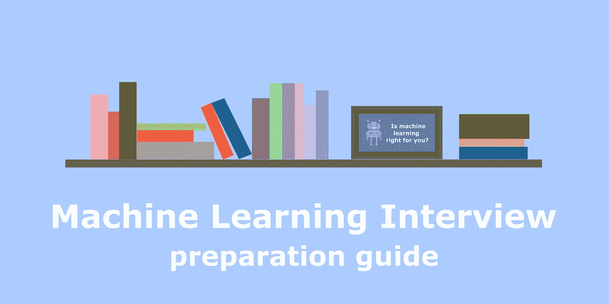

# 进行机器学习面试

> 原文：<https://towardsdatascience.com/acing-machine-learning-interviews-aa73d6d7b07b>

## 每个机器学习面试有四个关键部分——准备指南和资源

作者的形象。

我在攻读博士学位期间的许多同事现在都在寻找下一个搬来的地方。我知道要找到第一份工作有很多困难，所以我会积极帮助他们做好准备。随着时间的推移，我积累了大量的面试反馈语料库，在本文中，我总结了机器学习面试准备的相关来源。

在机器学习领域找工作的人有四个角色:研究科学家、应用科学家、研究工程师和(开发)工程师。尽管角色不同(看看这里的和这里的每个角色会有什么不同)，所有这些角色在面试准备方面都有很多共同之处。一般来说，所有四个职位的面试都有四个部分，分别针对编码、机器学习理论、系统理解和软技能。

文章最后总结了文章中提到的有用资源列表！

# 编码

没有什么比编码更容易练习了——解决尽可能多的问题，你就安全了。一般来说，有两种类型的编码问题——实时编码和家庭任务。

## 实时编码

对于 ML 职位，询问繁重的算法问题不是一种普遍的做法。很难说您会被要求实现一个红黑树……但是，一般知识问题可能包含日常 ML 工作的某些方面。

编码部分不仅测试你解决问题的能力，还测试你的思维过程以及与面试官交流并写出清晰实用的代码的能力。因此，即使您知道解决方案并且可以直接编写，首先也要花一些时间解释您的推理，并努力思考代码的结构，使其干净且易于解析。

如果问题不简单，请提出澄清问题，并从强力解决方案开始。下一步是概述解决方案的伪代码——要么用函数声明和注释，要么只用注释。这将更容易看到更大的图景。然后，您可以查看填写解决方案的注释部分。

一般来说，最好的准备方式是在 [leetcode](https://leetcode.com) 上解决 50-100 个问题。与其他平台相比，leetcode 的一大优势是详细的答案和问题统计——问题难度和哪些公司问过它。另一个有用的资源是[破解编码面试书](https://www.amazon.co.uk/Cracking-Coding-Interview-6th-Programming/dp/0984782850/ref=asc_df_0984782850/?tag=googshopuk-21&linkCode=df0&hvadid=310816411121&hvpos=&hvnetw=g&hvrand=5684732032924351614&hvpone=&hvptwo=&hvqmt=&hvdev=c&hvdvcmdl=&hvlocint=&hvlocphy=1006598&hvtargid=pla-388890317700&psc=1&th=1&psc=1)。

## 家庭作业

得到一个家庭作业编码/工程任务是很常见的，这将直接测试你在一个实际问题上的领域知识和技能。通常会给你一个数据集和一组指令。你要么被要求分配 4-6 个小时(倒计时将从你收到任务的那一刻开始)，要么给你几天到一周的更长时间来解决问题。

要准备这种问题，一个很好的资源就是 [kaggle](https://www.kaggle.com/) 。在这里，您既可以练习数据科学问题，也可以从其他人那里查找解决方案。同样的原则也适用于实时编码——清晰的、文档化的和可重用的代码，具有合理的算法决策。如果有你依赖的论文，确保也包括它们。

根据工作要求定制你的解决方案——如果该公司是一家高频交易基金，使用缓慢的深度学习算法将是不明智的——简单的感知机通常就足够了。另一方面，卫星成像公司会期待视觉深度模型的知识。

家庭作业通常会在下一个面试阶段讨论。你将有机会证明你的决定是正确的，并思考如何改进解决方案。

**问题举例:**

1.  编写一个图像/文本分类器。
2.  给定一个嘈杂的电力消耗时间序列，检测厨房中的灯何时被关闭。
3.  给定数据，提取特征并建立聚类模型。

# 机器学习理论

通常会有关于基础知识的问题——线性代数、微积分、概率论和一般机器学习知识，以及专业领域的领域知识。对于研究职位，你可能会被要求展示你目前的研究或者阅读并讨论一篇论文。

## 基本原则

**线性代数**:最小二乘、特征向量、特征值、矩阵的秩、主成分分析、奇异值分解、正定矩阵、正交和标准正交矩阵；
**概率**:随机变量、方差、期望、似然、后验、贝叶斯推断、抽样、分布、概率密度函数；
**微积分与最优化:**凸性、正则化、积分、链式法则求微分；
**机器学习:**偏差-方差权衡，支持向量机，感知器。

在准备这篇文章的时候，我发现了这本[机器学习职位的面试问答书](https://arxiv.org/pdf/2201.00650.pdf)，里面有一个坚实的问题列表，上面有这些问题的答案。另一本优秀的书，[机器学习面试准备书](https://huyenchip.com/ml-interviews-book/?q=)，里面有很多很好的面试行为和薪资谈判部分以及技术问题。另外，我发现[这个博客](https://neptune.ai/blog/machine-learning-engineer-interview)总结了来自 [glassdoor](http://glassdoor.com/) 的关于机器学习面试的反馈。

**问题举例:**

1.  什么是批量标准化？它的弊端是什么？描述纠正它们的标准化。
2.  解释偏差-方差权衡。
3.  列出常见的生成模型及其优缺点。
4.  为什么香草甘斯很难训练？你如何能提高训练？
5.  你如何防止神经网络过度拟合？
6.  解释如何申请退学。训练和测试有区别吗？
7.  给出神经网络优化器的例子，它们是如何工作的？什么是渐变爆炸？如何用激活功能来矫正？
8.  为什么神经网络可能不适合给定的任务？([查看此文](/seven-questions-to-ask-before-introducing-ai-to-your-project-b969d591c98b))
9.  解释变形金刚中的注意力机制(这些现在是一个通用的框架，可以应用于广泛的问题)。
10.  描述一种你选择的降维技术。

## 专业领域

大多数情况下，这份工作会假设你专攻某个领域。根据职位的不同，你可能需要知道一个月前发表的开创性论文或者开创性论文和最先进的模型。

我发现 paperswithcode 的[方法部分对于准备面试时修改核心论文非常有帮助。该部分最有用的特点是论文摘要，附有图片和基本解释。](https://paperswithcode.com/methods)

**简历问题举例:**

1.  为什么 CNN 应用在图像上那么好？
2.  如何应用反卷积？
3.  为什么变形金刚应用于图像具有挑战性？
4.  你如何将情绪从一张脸映射到另一张脸上？
5.  什么是时态一致性，如何实现时态一致性？
6.  对于创成式模型，可以使用哪些损失函数？
7.  为什么 FID 评分可能不是最好的现实主义指标？
8.  描述卷积类型及其背后的动机。
9.  什么是实例规范化？
10.  描述图像重建的损失函数及其优缺点。

**NLP 问题示例:**

1.  为什么我们在变形金刚中需要位置编码？
2.  描述几种注意机制，各有利弊？
3.  LSTMs 相对于普通 RNNs 的优势是什么？
4.  我们对一个好的嵌入有什么期望？
5.  如何评价翻译质量？[为什么 BLEU 不是一个很好的指标？](https://medium.com/towards-data-science/even-google-does-not-get-it-right-a9685f7f63c9)
6.  什么是对比预测编码，为什么它有帮助？
7.  你知道哪些 NLP 数据增强技术？
8.  训练模型时如何学习生僻字？
9.  解释语言是如何被视为图形的。这个图会有什么性质？

## 系统理解

系统理解问题将测试你解决公司遇到的典型问题的方法。例如，你可能被要求列出为一家广告管理公司设计推荐系统的步骤；对于成像公司，你可能会被问及创建新滤镜的步骤；对于一家计算机图形公司来说，你会被问到一种可以重建图像法线贴图的算法。

**问题举例:**

1.  你如何判断两个模型中哪一个更好？
2.  你会如何从零开始设计一个视频 in-painting/人脸转移/法线贴图重建(这是来自计算机图形学)/垃圾邮件检测器算法？
3.  如何处理部署模型中的数据漂移？
4.  如何设计一个算法，给定一幅受损栅栏的图像，就能估算出保险费用？

## 呈现

在研究职位的面试中，你会被要求准备一份关于你的研究的报告，或者谈论一篇最近在相关会议上发表的论文。

在每种情况下，都要根据你申请的职位来组织演讲。在每一种情况下，确保你知道更广泛的领域，知道最近的出版物和后续工作。我有一个关于如何在这里做一个强有力的陈述的指南。

# 软技能

软技能在面试过程的每个阶段都会受到测试——你如何与面试官交流，你如何谈论编码解决方案，以及你如何对笔记、批评和挑战做出反应。然而，几乎总是有一个单独的部分来测试行为部分。

亚马逊采访的每个人都喜欢清晰地了解他们期望员工具备的价值观。总的来说，我认为他们的[面试准备指南](https://www.amazon.jobs/en-gb/landing_pages/in-person-interview)在行为和软技能问题上是最诚实和最相关的。你可以在这里和这里找到测试每个潜在软技能值[的问题示例。](https://www.amazon.jobs/en-gb/principles)

几个框架可以用来回答基于原则/行为的问题。大部分都属于[情境目标行动结果(STAR)](https://www.thebalancecareers.com/what-is-the-star-interview-response-technique-2061629) 框架。手边总要有几个例子。

在我自己面试了几十个候选人之后，我意识到最好雇用一个技术能力稍差但有很强的沟通和团队能力的人。我在这篇文章中总结了一些技巧。你可能想在面试前检查一下。

# 多方面的

## 了解你的面试官

在面试之前，你通常会被告知面试官的名字。一定要查阅他们的资料，阅读他们的专业领域。了解一些他们领域的核心论文，以及他们看待机器学习的角度，将有助于你更好地找到答案。

## 态度

从我的经验来看，态度和知识技能一样重要。我是两本书的超级粉丝，这两本书分别是《思考的快与慢》和《T2 离群值》。第一个帮助你理解你的思维会引诱你进入的常见陷阱，第二个设置正确的心态。

尽管目前非常困难，尤其是如果你面临找工作的压力，把面试当作一次学习经历而不是一次考试——这将有助于你在这个过程中更加开放和接受。

## 大脑冷冻

我还没有见过一个人在面试中没有经历过大脑冻结——你的大脑变得麻木，手在发抖，甚至熟悉的问题也变得具有挑战性。

有一个简单的方法对我有效了很多次——不要试图隐藏冻结，承认它。大声对面试官说，你正准备陷入大脑冻结，担心即使是简单的事情也会无法解决。有了这个技巧，你就可以解除试图隐藏大脑冻结的压力，并向面试官发出信号寻求支持。毕竟，他们也希望你表现出色！

## 问题

面试是双向的；利用面试时间更多地了解角色和团队。你将有机会提问——不要只是问“我什么时候能得到回复？”。

# 摘要

不幸的是，面试是一种通过被拒绝的痛苦经历获得的技能(或者在模拟面试的更安全的环境中，我强烈建议你练习)。发出数百份申请，进行数十次面试才能被录用的情况并不少见。因此，最好在最后离开你最喜欢的公司，这样你才能为面试做好充分准备。下面我总结一下我在文中提到的链接:

**软技能:** [亚马逊面试备考指南](https://www.amazon.jobs/en-gb/landing_pages/in-person-interview)、[亚马逊期望在员工身上体现的原则](https://www.amazon.jobs/en-gb/principles)、[亚马逊原则解释](https://www.carrus.io/blog/amazon-newprinciples)、[情境任务行动结果技巧](https://www.thebalancecareers.com/what-is-the-star-interview-response-technique-2061629)、[软技能来自一个机器学习博士](https://medium.com/towards-data-science/three-soft-skills-every-phd-student-gets-for-free-f63f4b1d3f2d)；
**编码:** [编码面试准备 leetcode](https://leetcode.com) ，[破解编码面试本](https://www.amazon.co.uk/Cracking-Coding-Interview-6th-Programming/dp/0984782850/ref=asc_df_0984782850/?tag=googshopuk-21&linkCode=df0&hvadid=310816411121&hvpos=&hvnetw=g&hvrand=5684732032924351614&hvpone=&hvptwo=&hvqmt=&hvdev=c&hvdvcmdl=&hvlocint=&hvlocphy=1006598&hvtargid=pla-388890317700&psc=1&th=1&psc=1)，[练习机器学习题](https://www.kaggle.com)；
**机器学习理论:** [机器学习 QA 书 1](https://arxiv.org/pdf/2201.00650.pdf) ，[机器学习 QA 书 2](https://huyenchip.com/ml-interviews-book/?q=) ，[总结自 glassdoor](https://neptune.ai/blog/machine-learning-engineer-interview) ，[不使用机器学习时的](/seven-questions-to-ask-before-introducing-ai-to-your-project-b969d591c98b)，[方法部分的论文代码](https://paperswithcode.com/methods)。

如果你喜欢这篇文章，请与朋友分享！要阅读更多关于机器学习和图像处理的主题，请点击订阅！

## 喜欢作者？保持联系！

我错过了什么吗？请不要犹豫，直接在 [LinkedIn](https://www.linkedin.com/in/aliakseimikhailiuk/) 或 [Twitter](https://twitter.com/mikhailiuka) 上给我留言、评论或发消息吧！

   