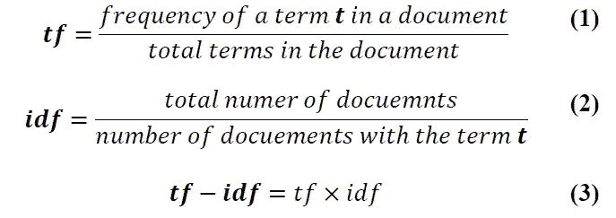
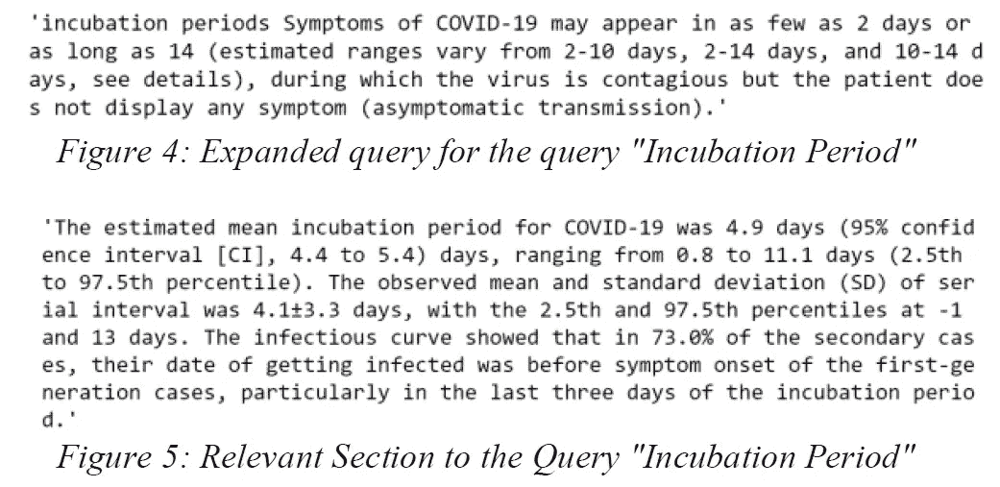

# 新型冠状病毒相关研究论文中的可操作知识抽取

> 原文：<https://towardsdatascience.com/actionable-knowledge-extraction-from-research-articles-related-to-novel-coronavirus-6d27eadc6119>

## 使用自然语言处理的分级相关知识提取:查询扩展和相似性网络


[疾控中心](https://unsplash.com/@cdc?utm_source=medium&utm_medium=referral)在 [Unsplash](https://unsplash.com?utm_source=medium&utm_medium=referral) 拍摄的照片

## **概述**

世界正在经历一场由称为严重急性呼吸综合征-冠状病毒 2(新型冠状病毒)的新型冠状病毒引起的肺炎爆发[1]。该流行病于 2020 年 1 月 30 日被宣布为国际关注的突发公共卫生事件，并于 2020 年 3 月 11 日被世界卫生组织确认为疫情[2]。作为对疫情的回应，白宫和一个领先研究团体的联盟已经准备了新冠肺炎开放研究数据集(CORD-19)，其中包含超过 51，000 篇学术文章，包括超过 40，000 篇关于新冠肺炎、新型冠状病毒和相关冠状病毒的全文[3]。包括医生在内的医疗专业人员经常寻求特定问题的答案，以改进指导方针和决策。医学文献的巨大资源对于产生新的见解是重要的，新的见解可以帮助医学界提供相关知识和全面对抗传染病。医学研究社区可以通过从大量发表的文章中高效地分析和提取冠状病毒相关的特定知识来改进他们的政策。从大量文章中手动提取相关知识是劳动密集型的，不可扩展的，并且具有挑战性[4]。因此，已经进行了几次尝试来开发智能系统，以从许多非结构化文档中自动提取相关知识。在本文中，我提出了一个简单而有效的问答框架，它基于自动分析数千篇文章来生成长文本答案(部分/段落),以回答医疗社区提出的问题。在开发框架的过程中，我们广泛探索了自然语言处理技术，如查询扩展、数据预处理和向量空间模型。

## **简介**

自 2019 年 12 月以来，中国湖北省最大的大都市武汉爆发了肺炎疾病[5]。这种呼吸道疾病由一种名为严重急性呼吸综合征-冠状病毒 2(新型冠状病毒)的新型冠状病毒引起，在人与人之间传播，已在大约四分之一年内导致疫情，影响了全球 230 个国家。截至 2020 年 4 月 11 日，该传染病已导致 1，779，842 例确诊病例和 108，779 例确诊死亡，从根本上影响了美国、意大利、西班牙和法国[6]。作为对疫情的回应，白宫和一个领先研究团体的联盟准备了新冠肺炎开放研究数据集(CORD-19)，其中包含超过 51，000 篇学术文章，包括超过 40，000 篇全文，涉及新冠肺炎、新型冠状病毒和相关冠状病毒。我们开发了一个自动知识提取系统，该系统将从数千篇文章中生成有意义的信息，以帮助医疗保健专业人员和政府官员进行决策。

本文的目标是展示:

1.  用于知识提取的问答框架能够从与特定问题或查询相关的文章中，按照章节/段落提取最相关的长文本答案。
2.  在第二阶段，该框架将提供从给定文章生成的相关部分的相似性网络。该网络将提供关于特定查询的更广泛的观点。在这个过程中，医疗保健专业人员不仅会从一篇相关文章中获得信息，还会从讨论该主题的其他文章中获得信息。

为了在决策过程中帮助医疗专业人员，我们主要调查了该疾病在人类中的潜伏期，以进行演示[3]。

## **数据集**

作为对疫情的回应，白宫和领先研究团体的联盟已经准备并提供了新冠肺炎开放研究数据集(CORD-19)，其中包含超过 51，000 篇学术文章，包括超过 40，000 篇关于新冠肺炎、新型冠状病毒和相关冠状病毒**【3，8】**的全文论文。CORD-19 数据集整合了来自几个**来源的论文:**世界卫生组织、PubMed Central、bioRxiv 和 medRxiv，这些来源公开了论文元数据以及与每篇论文相关的文档 **[8]。**

在这个项目中，只有来自 biorxiv_medrxiv 文件夹的研究文章(由 803 篇全文论文组成)才会从这些广泛的语料库中进行分析。给出的论文是 JSON 格式的，需要转换成结构化格式以便进一步研究。图 1 显示了 JSON 格式的一篇样本论文的片段。每篇论文由 7 个部分组成:论文 id、元数据、摘要、正文、bib 条目、ref 条目和 back_matter。对于这项研究，我们只从每篇 JSON 格式的论文中提取了文章标题(来自 paper_id)、摘要和正文。图 2 示出了从 JSON 格式的论文中提取标题、摘要和正文。随后，提取的文本被连接以形成完整的纸质文本。


图 JSON 格式的文本(图片由作者提供)


图 2:标题、摘要和正文的提取(图片由作者提供)

**方法:**

我们开发了一个自动知识提取框架，从新冠肺炎相关研究文章的语料库中提取最相关的部分。该框架执行几个步骤来检索给定特定查询的最相关部分。检索信息时，执行了一些步骤:

**1。** **查询扩展:**使用短查询进行信息检索会导致信息检索中的术语不匹配问题，因为查询术语可能缺少足够数量的单词。查询扩展技术通过向现有术语添加新的标记(单词)并生成扩展的查询来克服这一限制。局部分析是一种 QE 技术，其中通过利用给定查询的排名靠前的相关检索部分来扩展查询。相关性反馈是另一种利用用户提供的相关文档的 QE 方法[7]。

**2。** **数据预处理**

a.大小写折叠:在这一步中，文档中的所有文本都被转换成小写字母，就像短语“数据挖掘”被转换成“数据挖掘”一样。

b.停用词去除:停用词是指 a、an、the、that 等词。在包含琐碎信息的文档中。在建立模型的过程中应该去掉停用词。

c.特殊字符删除:文档中有一些特殊字符，如“？”, "#", "!"等等。应该去掉。

d.词汇化:由于语法原因，文档中可能会使用不同形式的单词(如 studies、studying)。词汇化用于将单词的屈折形式简化为常见的基本形式(研究，研究à研究)。

e.N-grams: N-grams 考虑 N 个连续的单词，而不是一个单词。例如，2 个单词的短语:“病毒的传播动力学”à“传播动力学”、“的动力学”、“的动力学”和“病毒”。它可以用来捕获文档中文本的上下文。

**3。** **使用 TF-IDF 的变换-向量空间模型:**首先通过将每个句子拆分成单词来将文档变换成单词包(BoW)。随后，通过术语频率-逆文档频率(TF-IDF)方法将 BoW 转换到向量空间。术语频率(TF)是通过取术语(词)的总出现次数与文档中的总字数之间的比率来定义的。另一方面，逆文档频率(IDF)测量术语对于语料库集合中的文档的重要性或权重[4]。等式 1、2 和 3 以数学形式给出了 TF、IDF 和 TF-IDF 的定义。



**4。** **相似度计算:**余弦相似度是计算文档对之间相似度的方法之一。它测量两个向量之间角度的余弦，其中每个向量是通过使用向量空间模型导出的文档(句子/章节/段落)的数字表示。等式 3 示出了余弦相似性的数学定义，其中 A 和 B 是两个文档。


**5。** **信息提取:**在该步骤中，框架通过利用查询对和所有文档之间的相似性得分来检索与查询相关的信息。

**6。** **相似性网络:**加权相似性网络是在项目的第二阶段开发的，以从研究文章中获得更多可操作的见解。在这一步中，我们将利用阶段 1 的输出。

## **实验和结果**

从文章中检索最相关的部分或段落的过程如图 3 所示。例如，用户输入查询术语“潜伏期”。然后将相关反馈查询扩展技术应用于该查询，并生成扩展的查询以供进一步研究。我们收集了冠状病毒潜伏期相关的信息，然后将其添加到查询词中[6]。图 4 显示了对术语“潜伏期”的扩展查询。随后，该框架首先搜索最相关的文章，然后分层调查每篇文章的最相关部分，最后向用户返回基于排序的相关部分。图 5 示出了从题为“冠状病毒疾病 2019 在潜伏期期间的传播可能导致隔离漏洞”的文章中检索到的与查询术语“潜伏期”最相关的部分。从图 5 中，该部分包含与新型冠状病毒的潜伏期相关的许多重要信息，这些信息对于医学专业人员做出决定可能是重要的。它可以帮助医疗保健专业人员对传染病的当前和未来规模进行建模，并评估疾病控制策略，如决定可能接触过病毒的人需要隔离多少天。


图 3:知识提取的过程(图片由作者提供)

从图 5 中，该部分包含与新型冠状病毒的潜伏期相关的许多重要信息，这些信息对于医学专业人员做出决定可能是重要的。它可以帮助医疗保健专业人员对传染病的当前和未来规模进行建模，并评估疾病控制策略，如决定可能接触过病毒的人需要隔离多少天。



(图片由作者提供)

在第二阶段，加权网络图将基于给定的查询词提供文章之间的相似性。图 5 展示了给定查询术语“潜伏期”的网络的例子。节点“潜伏期”和“id:23”之间的分数 0.23 表明它们之间的相似性是 0.23(这是该网络的最大值)，而“id:23”是给定研究文章之一的 id。医疗专业人员可以通过这个网络研究所有的文章以获得潜伏期相关的知识。


(图片由作者提供)

## **结论**

世界正在经历由一种新型冠状病毒引起的肺炎爆发。与冠状病毒相关的大量医学文献资源包含有价值的信息，可以为医学研究团体提出的特定问题提供答案。卫生保健专业人员可以通过从许多已发表的文章中高效地分析和提取冠状病毒相关的特定知识来改进他们的政策，并全面抗击传染病。我们开发了一个可操作的知识抽取框架，它可以根据与特定查询相关的部分/段落自动抽取相关信息。该框架在模型构建过程中利用了最先进的自然语言处理技术。该框架还提供了从给定文章生成的相似性网络，这些文章提供了关于特定查询的更广泛的观点。因此，医疗保健专业人员不仅会从一篇相关文章中获得信息，还会从讨论该主题的其他文章中获得信息。

代码:

```
import os
import json
import numpy as np
import pandas as pd
import nltk
# nltk.download()
from nltk.corpus import stopwords 
stopwords = stopwords.words('english')
from nltk.tokenize import word_tokenize 
import re
from nltk.stem import WordNetLemmatizer, PorterStemmer
lemmatizer = WordNetLemmatizer()
stemmer = PorterStemmer()f = path-directory-of-the-datafiles_in_bioarve = os.listdir(f)# Reading the parts of given papers from the local computer one by one: p1--> read all papers in dictionary format, title--> title of the paper, abstract_text --> abstract of the paper, body_text --> body texts are spread all over the article, adding all those text bodies togetherpaper_id = []
title_text = []
abstract_text = []
body_text = [] 
for j in range(len(files_in_bioarve)):
    a_text = ''
    b_text = ''
    t_text = ''
    p1 = json.load(open(f + files_in_bioarve[j], 'rt'))for i in range(len(p1['metadata'])):
        t_text += p1['metadata']['title']
    title_text.append(t_text)

    for i in range(len(p1['abstract'])):
        a_text += p1['abstract'][i]['text']
    abstract_text.append(a_text)

    for i in range(len(p1['body_text'])):
        b_text += p1['body_text'][i]['text']
    body_text.append(b_text)# aggregating all the parts of each of the papersdocs = [title_text[i] + abstract_text[i] + body_text[i]  for i in range(len(body_text))]## input: a sprecific queryquery = """case days period incubation incubation period covid-19 quarantine infect epidemic time individuals disease isolation median range transmission infection onset mean quarantine period report study hospitalize result periods data estimate fatality rate number expose period days coronavirus include adults longer model wuhan history symptom day use casualties symptom onset fatality rate outbreak base therefore population 7-day"""docs.insert(0, query)def text_preprocessing_0(text):
    """
    1\. case folding: all letters folded to lower case
    2\. removing non-alphanumeric characters
    3\. tokeinizing the sentences into words
    4\. removing stopwords
    5\. lemmatization
    6\. steming
    """
    lower_case = text.lower()  
    token =  word_tokenize(lower_case)
    filter_tokens = [w for w in token if w not in stopwords]
    lemmatized_words = [lemmatizer.lemmatize(filter_tokens[i], pos = 'v') for i in range(len(filter_tokens))] 
    return lemmatized_wordsclean_docs = [' '.join(text_preprocessing_0(docs[i])) for i in range(len(docs))]
```

我扩展了这个工作，并在去年的 **IEEE 大数据 2020** 大会上发表。如果你想引用这个作品—

[马苏姆，m .，沙赫里亚尔，h .，哈达德，H. M .，阿哈迈德，s .，斯内哈，s .，拉赫曼，m .，Cuzzocrea，A. (2020，12 月)。新冠肺炎的可操作知识提取框架。在 *2020 年 IEEE 大数据国际会议(大数据)*(第 4036–4041 页)。IEEE。](https://www.computer.org/csdl/proceedings-article/big-data/2020/09378398/1s64BZZgj7i)

# 阅读默罕默德·马苏姆博士(以及媒体上成千上万的其他作家)的每一个故事。

你的会员费将直接支持和激励穆罕默德·马苏曼德和你所阅读的成千上万的其他作家。你还可以在媒体上看到所有的故事—[](https://masum-math8065.medium.com/membership)

****快乐阅读！****

****参考****

***[1]埃斯特拉达，E. (2020)。SARS 冠状病毒 2 型主要蛋白酶的拓扑分析。bioRxiv。***

***【2】奥尔蒂亚，I .&博克，J. O. (2020)。通过影响途径分析和网络分析重新分析新型冠状病毒感染宿主细胞蛋白质组学时程数据。与炎症反应的潜在联系。BioRxiv。***

***【3】*[*https://www . ka ggle . com/Allen-institute-for-ai/CORD-19-research-challenge*](https://www.kaggle.com/allen-institute-for-ai/CORD-19-research-challenge)**

***【4】穆罕默德，m .，科萨拉朱，s .，t .，莫德吉尔，g .&康，M. (2018 年 10 月)。使用层次文档分析从 OCR 文档中自动提取知识。《2018 年适应性和融合系统研究会议论文集》(第 189–194 页)。***

**[5]黄，杨，涂，米，王，陈，周，周，陈，陈…&黄，秦(2020)。中国武汉地区新型冠状病毒感染实验室确诊阳性病例的临床特征:回顾性单中心分析。旅行医学和传染病。**

**【https://www.worldometers.info/coronavirus/】[](https://www.worldometers.info/coronavirus/)**

****【7】崔，h，文，林君如，聂，林君宜，&马文友(2002 年 5 月)。使用查询日志的概率查询扩展。《第 11 届万维网国际会议论文集》(第 325-332 页)。****

****【8】王，L. L .，Lo，k .，Chandrasekhar，y .，Reas，r .，Yang，j .，Eide，d .，… & Kohlmeier，S. (2020)。新冠肺炎开放研究数据集。ArXiv。****