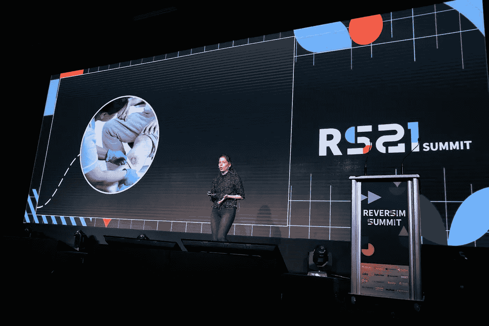
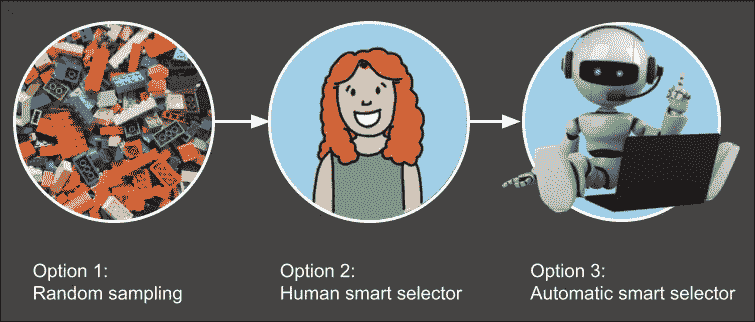
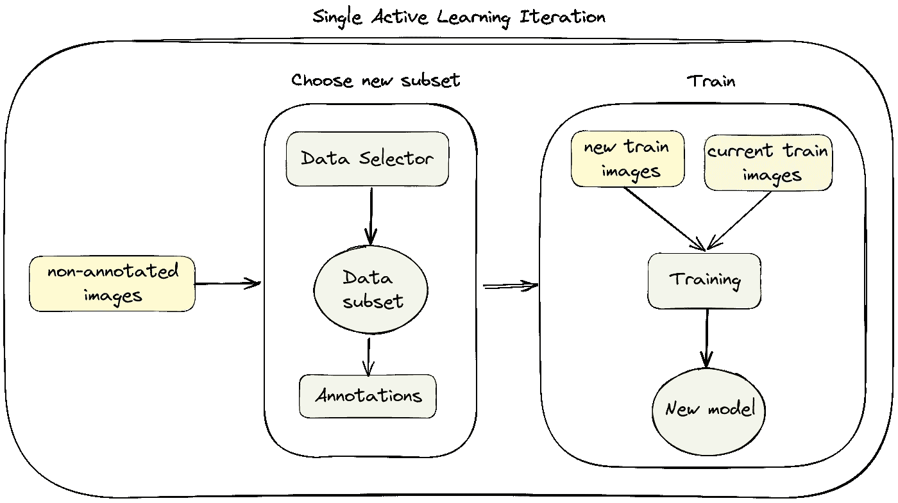
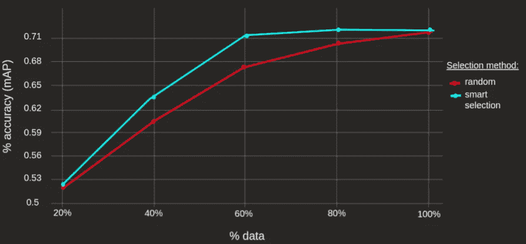
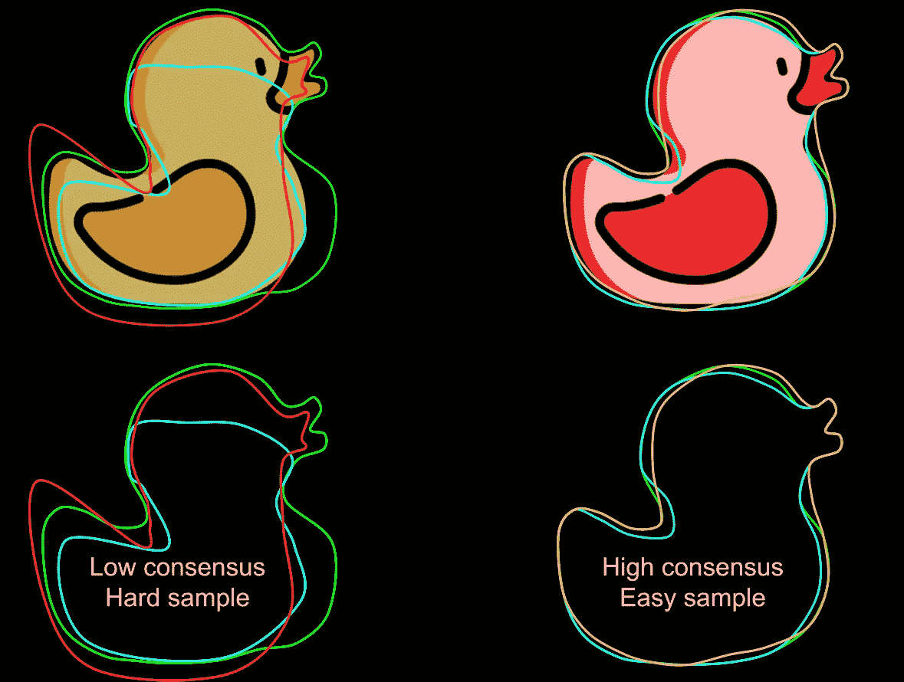
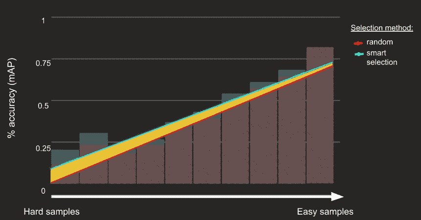
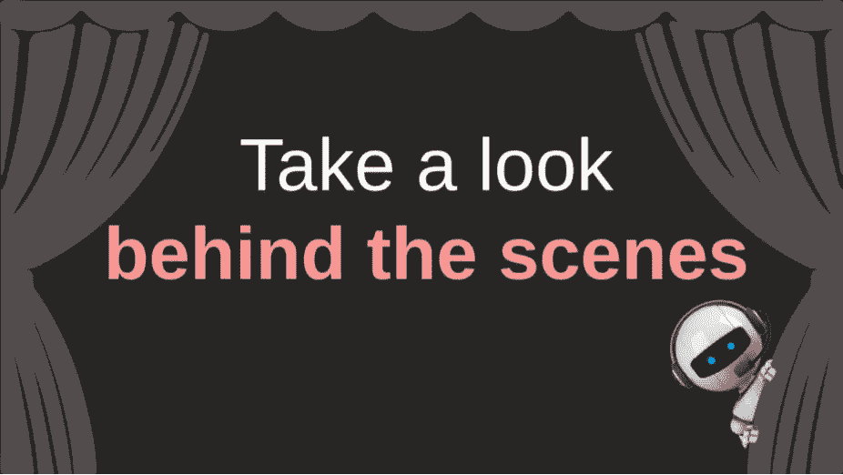

# 幕后的主动学习

> 原文：<https://towardsdatascience.com/active-learning-behind-the-scenes-7e82f024a5db>

# 幕后的主动学习

## 我如何评估我的主动学习结果？

照片由[格温·金](https://unsplash.com/@gwenking?utm_source=medium&utm_medium=referral)在 [Unsplash](https://unsplash.com?utm_source=medium&utm_medium=referral)

在我以前的帖子中，我描述了什么是主动学习([主动学习介绍和主要方法](/how-to-start-being-an-active-learner-8d311d68fb70))以及如何以简单通用的方式实现这样的管道([主动学习管道的架构](/towards-a-fully-automated-active-learning-pipeline-29b8f4eb7d73))。

这篇文章基于我在 2021 年 Reversim 峰会上的演讲。我想向前跳几步，谈谈我如何评估我的主动学习模型的结果，以及它如何帮助我抓住一个巨大的错误。

图片由 Gilad Artzi 提供，来自 2021 年 Reversim 峰会(经组织者许可)

# 主动学习=数据选择器

一般来说，当我们谈论主动学习时，我们谈论的是创建一个数据选择器。一种自动算法，它将能够从我们的未标记数据中选择一个子集，并将为我们的模型提供最大的性能增益，因此它将能够学习并提高其准确性。

数据选择器。图片由作者提供。

# 数据选择器演变

假设我们有 100 万个新的未标记图像。我们只能将其中的 1000 个发送给标注器，并将它们添加到训练集中。我们将如何选择这 1000 张图片？

## **随机抽样**

选择未标记数据进行标记的最流行的方法是随机抽样。只需随机选择你需要的样品数量。在这种情况下，假设数据越多，我们的算法就越精确。使用随机抽样，我们不考虑我们目前的模型，如果我们有一个。我们选择数据时不考虑模型的优缺点。

这让我们想到了第二个选择。

## **人类智能选择器**

在这个选项中，我们利用我们作为数据科学家所拥有的关于数据和模型的知识。我们可以明智地选择我们想要使用的数据。我们知道什么类型的数据对我们的模型更具挑战性，在什么样的样本上它会失败，我们可以使用这些知识来选择那些确切的样本，并对它们进行努力。

但这不会持续太久。它不可扩展。单个数据科学家无法检查庞大的未标记数据集。我们真正想要的是我们自己的自动化版本。

## **自动智能选择器**

我们实际上想要的是创建一个自动算法，封装我们关于模型和数据的知识，当然还有更多我们目前没有的知识。这样，从我们的未标记数据中明智地选择一个子集将会更容易和更快。

数据选择进化。图片由作者提供。左乐高图片:照片由[哈维·卡夫雷拉](https://unsplash.com/@xavi_cabrera?utm_source=medium&utm_medium=referral)在 [Unsplash](https://unsplash.com?utm_source=medium&utm_medium=referral) 上拍摄

创建这样一个自动数据选择器有几种方法。你可以在我之前的[帖子](/towards-a-fully-automated-active-learning-pipeline-29b8f4eb7d73)中读到更多。

在本帖中，我们将重点评估[不确定性方法](/how-to-start-being-an-active-learner-8d311d68fb70)的结果。提醒一下，在不确定性方法中，我们的目标是识别硬样本，即我们的模型对其输出不确定的样本。

# 主动学习迭代—概述

在我们继续评估之前，让我们简单回顾一下单个的主动学习迭代。主动学习是一个连续的过程，在每次迭代中，我们将数据选择器应用于当前未标记的数据集。单次迭代包括两个主要步骤——从未标记数据中选择和注释子集，并使用新选择的数据以及现有的训练数据再次训练模型。

单一主动学习迭代。作者图片

# 主动学习评价

一旦我们开发了我们的数据选择器，我们想评估我们的整个学习管道。

在 POC 阶段，我们有一个用于研究的大型带注释的数据集。我们将在这里使用它进行评估。

验证集在所有实验中都是固定的。只是训练在变。

## 智能选择与随机选择

第一个也是最重要的评估是检查我们的模型在有和没有数据选择器的情况下的性能。我们的基线是使用数据的随机抽样开发的模型(没有数据选择器)。我们希望我们的新模型，即使用明智选择的数据(带有数据选择器)开发的模型，在使用相同数量的数据时，能够获得比基线更好的性能。

模特表演。图片由作者提供。

太好了！我们获得了比基线更高的性能！

## 够不够？

这个图表告诉我们关于数据选择器的什么信息？我们怎么知道它选择了硬的和不确定的样本？答案是我们没有。我们需要看到这张图表背后的场景，更好地理解数据选择和已经完成的学习。

我告诉你是因为我有过不好的经历。我的第一个性能图是完美的，好得令人难以置信。事实也的确如此。有一个巨大的错误，不知何故导致图形是伟大的。而我掉进了陷阱，以为自己钉死了，完成了任务。但是当我调查我的数据选择器时，我得到了奇怪的结果。我就是在那里找到我的虫子的。如果我不去看幕后，我永远也不会发现它。

## 对数据样本进行排序既困难又容易

为了更好地理解我们的数据选择器，我们需要将我们的样本(在我的例子中是图像)分为简单样本和困难样本，以便我们能够研究数据选择器的选择。

在我的例子中，每张图片都由三个不同的标注者标记。我可以使用所有的注释来计算注释者之间的共识。一致性低的图像可以看作硬样本，一致性高的图像可以看作易样本。

作者创造的形象。

## 数据选择器评估

在这一节中，我将描述如何调查我的数据选择器结果。使用上一节中的排名图，我创建了下图:

作者创作的图表。

让我看一下图表。

*   y 轴——注释者的平均共识，如上一节所述。高共识→易样本。
*   x 轴——我们的数据选择器在每次学习迭代中选择的子集。
*   红线——随机抽样。正如预期的那样，当我们随机抽样时，所有迭代的一致性保持不变。
*   青色线-智能选择。在这种情况下，我们期望图形单调增加。每次数据选择器选择一个新的子集，它应该选择最难的例子。因此，它将选择的下一个子集将是更容易的子集。这是因为我们在研究阶段有一个有限的数据集。

如果我们没有得到一条单调递增的线，我们需要问自己为什么，它是否有意义。这可能是一个 bug，也可能是因为您使用的方法的特性而发生的。无论如何，**我们需要这个图表来查看我们的数据选择器的行为方式。**

## 学习评价

好的，很好，我们的数据选择器工作了。现在我们想向前迈一步，看看我们学习过程的幕后。我们想知道在简单的样本上，更好的性能是来自更好的精度，还是在困难的样本上，我们也能获得更好的性能。

为此，我创建了如下图表:

作者创作的图表。

那么我们在这里看到了什么？

*   y 轴-模型的精确度
*   x 轴——注释者一致同意从难到易的样本。(例如，最左边的条柱表示注释者在 0%到 10%之间的共识，而最右边的条柱表示在 90%到 100%之间的共识)
*   红色和青色直方图-分别使用随机采样和智能选择的结果。
*   红色和青色线—直方图的趋势线(根据颜色，每个直方图对应一条线)。

现在让我们看看从这个图表中我们能学到什么，以及为什么它是一个重要的图表。首先，我们看到青色趋势线(智能选择)总是高于红色趋势线(随机选择)。意思是，**当我们明智地选择数据时，无论是简单样本还是困难样本，我们都能获得更高的准确性。**

但是还有更多。如果我们看黄色多边形，趋势线之间的区域，我们可以看到该区域在硬样本区更大。意思是，**相对于随机抽样，我们获得的准确性增益来自于对硬样本的改进，而不是对简单样本的改进。**

这正是我们想要的！！

# 外卖食品

图片由作者提供。

最终，我知道并不是我在这里描述的所有东西都能应用到你的数据上。但这不是重点。

主要的收获是，我们需要看一看幕后，每个人都有自己合适的方式。在这种情况下，仅有性能图是不够的。性能图并没有告诉你整个故事(在我的例子中是一个 bug)。我们需要更深入地挖掘并理解我们的数据选择器行为，我们需要检查我们是否确实在数据中的硬样本上获得了改进，因为这是我们想要努力的地方。

**那么让我们一起来看看幕后，让我们来改进我们的模型吧！**

 [## 如何开始成为一个主动的学习者？

### 计算机视觉主动学习简介

towardsdatascience.com](/how-to-start-being-an-active-learner-8d311d68fb70)  [## 走向完全自动化的主动学习管道

### 用于主动学习的简单、模块化和通用架构

towardsdatascience.com](/towards-a-fully-automated-active-learning-pipeline-29b8f4eb7d73) 

想听更多我的作品吗？在 [Linkedin](https://www.linkedin.com/in/sbiham/) 上关注我，并访问我的[网站](https://www.sbiham.com/)。