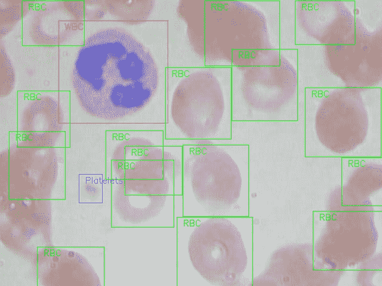
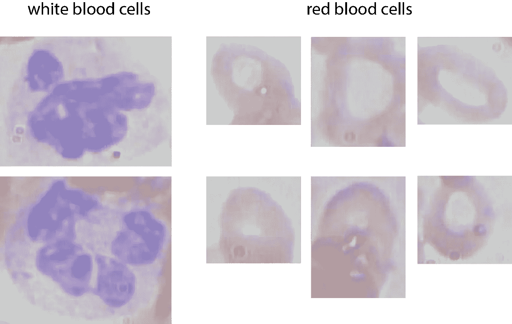
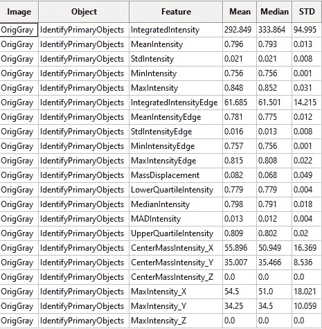

# 细胞成像的主动学习

> 原文：<https://towardsdatascience.com/active-learning-for-cell-imaging-99fc7dcdbc82>

## 根据标记对模型性能的预期影响，优先标记细胞成像样本。

# 作者(同等贡献)

[阿迪·尼西姆](https://www.linkedin.com/in/adinissim/)，[诺姆·西格尔](https://www.linkedin.com/in/noamsiegel/)，[尼姆罗德·伯曼](https://www.linkedin.com/in/nimrod-berman-a26250143/)

# 介绍

许多机器学习任务面临的主要障碍之一是缺乏标记数据。标注数据可能既费钱又费钱。因此，由于缺乏标签，很多时候甚至尝试使用机器学习方法来解决问题都是不合理的。

为了缓解这个问题，机器学习中出现了一个领域，叫做主动学习。主动学习是机器学习中的一种方法，它提供了一个框架，用于根据模型已经看到的已标记数据对未标记数据样本进行优先排序。我们不会对此进行详细介绍，您可以阅读机器学习中的[主动学习文章，该文章深入解释了该框架。](/active-learning-in-machine-learning-525e61be16e5)

细胞成像中的数据科学是一个快速发展的研究领域。然而，正如在其他机器学习领域一样，标签是昂贵的。为了解决这个问题，我们在这篇文章中展示了一个对红细胞和白细胞的**图像细胞主动学习分类**任务的端到端工作。

我们的目标是介绍生物学和主动学习的结合，并帮助其他人使用主动学习方法解决生物学领域中类似的和更复杂的任务。

**文章由三个主要部分构成:**

*   细胞图像预处理——我们展示了如何预处理未分割的血细胞图像。
*   使用 Cell Profiler 提取细胞特征——我们展示了如何从生物细胞照片中提取形态特征，以用作机器学习模型的特征。
*   使用主动学习——我们展示了一个模拟使用主动学习的实验，以及与不使用主动学习的对比。

项目资料馆位于:
[https://github.com/noamsgl/active_learning_cell_imaging](https://github.com/noamsgl/active_learning_cell_imaging)

# 细胞图像预处理

## 数据集

我们将使用一个血细胞图像的数据集，该数据集在麻省理工学院的许可下被上传到 GitHub 和 T2 Kaggle。每张图片都根据红细胞(RBC)和白细胞(WBC)分类进行标记。4 种白细胞(嗜酸性粒细胞、淋巴细胞、单核细胞和嗜中性粒细胞)还有其他标记，但我们在研究中没有使用这些标记。

以下是来自数据集的全尺寸原始图像示例:

一个被 16 个红血球包围的白血球。来源: [BloodImage_00023.jpg](https://github.com/Shenggan/BCCD_Dataset/blob/master/BCCD/JPEGImages/BloodImage_00023.jpg)

## 创建示例数据框架

我们发现原始数据集包含一个 [export.py](https://github.com/Shenggan/BCCD_Dataset/blob/master/export.py) 脚本，该脚本将 XML 注释解析为一个 [CSV 表](https://github.com/Shenggan/BCCD_Dataset/blob/master/test.csv)，其中包含每个单元格的文件名、单元格类型标签和边界框。

不幸的是，原始脚本没有包含一个 **cell_id** 列，这是必要的，因为我们正在对单个单元格进行分类。因此，我们稍微修改了代码以包含该列，并选择了包含 **image_id** 和 [**cell_id**](https://github.com/Shenggan/BCCD_Dataset/blob/master/BCCD/JPEGImages/BloodImage_00023.jpg) 的新文件名:

预处理数据集以包含整齐的数据集

# 种植

为了能够处理数据，第一步是基于边界框坐标裁剪全尺寸图像。这导致了怪异的细胞图像:

细胞图像示例。裁剪原始图像后，每个单独的单元格都被单独保存到文件中。

这里是代码:

裁剪图像到单元格并更新文件名。

为了您的方便，我们将原始存储库分叉，并将裁剪后的图像上传到 GitHub！可以在以下位置找到它们:

[https://github . com/noamsgl/BCCD _ 数据集/树/主人/BCCD/裁剪](https://github.com/noamsgl/BCCD_Dataset/tree/master/BCCD/cropped)

这就是预处理！现在，继续用 CellProfiler 提取特征。

# 基于细胞轮廓仪的细胞特征提取

[CellProfiler](https://cellprofiler.org/) 是一款免费的开源图像分析软件，旨在从大规模细胞图像中自动定量测量表型。CellProfiler 有一个用户友好的图形用户界面(GUI ),允许您使用内置管道以及使用各种测量和功能根据您的特定需求构建自己的管道。

## 开始使用:

首先，[下载 Cellprofiler](https://cellprofiler.org/releases) 。如果 CellProfiler 无法打开，您可能需要安装 [Visual C++可再发行版](https://aka.ms/vs/16/release/VC_redist.x64.exe)。

一旦 GUI 弹出，加载图像并将组织好的元数据写入 CellProfiler。如果您选择[构建自己的管道](https://cellprofiler-manual.s3.amazonaws.com/CellProfiler-4.2.1/help/pipelines_building.html)，[在这里](https://cellprofiler-manual.s3.amazonaws.com/CellProfiler-4.2.1/modules/input.html)您可以找到 CellProfiler 中可用的模块列表。大多数模块分为三个主要组:图像处理、对象处理和测量。您可以保存您的管道配置并重复使用或与世界共享。

现在我们将演示特征提取过程:

*   **图像处理**例如，将图像从彩色转换为灰度:

这里显示的是原始细胞图像(左)，以及相同的图像转换为灰度(右)。灰度转换是对象处理步骤所必需的。

*   **对象处理-** 这些模块检测和识别，或者允许你操纵图像中的对象。

CellProfiler GUI 中对象识别步骤的结果。该算法检测和定位用于测量的主要感兴趣生物对象。

*   **测量-** 现在，在我们已经激活图像处理模块，并且我们已经在其中识别了主要对象之后，已知有助于细胞剖析的测量可以针对每个对象进行计算并且针对每个图像进行总结。

使用测量模块从灰度图像中提取的特征示例。每行代表一种特征类型。平均值、中值和标准值中的每一个都被输入到分类器。

使用 CellProfiler，您可以将输出数据保存到 spreedsheets 或其他类型的数据库中。我们将输出保存为. CSV 文件，并将其作为机器学习模型的特征加载到 Python 中。

# 使用主动学习

好了，现在我们终于有了表格数据，我们可以尝试用它来做实验。我们想要试验使用主动学习策略是否可以通过标记更少的数据和获得更高的准确性来节省时间。我们的假设是，使用主动学习，我们可以通过显著减少在细胞分类任务中训练机器学习模型所需的标记数据量，来潜在地节省宝贵的时间和精力。

## **主动学习框架**

在我们开始实验之前，我们想快速介绍一下[模态](https://modal-python.readthedocs.io/en/latest/)。ModAL 是 python 的一个主动学习框架。它共享 Sklearn API，所以如果你使用 Sklearn 的话，很容易将它集成到你的代码中。这个框架允许你轻松地使用不同的先进的主动学习策略。他们的文档很容易理解，我们强烈建议在您的主动学习管道中使用。

## **主动学习 VS 随意学习**

**实验**

为了验证我们的假设，我们将进行一项实验，比较添加新标记数据的随机子采样策略和主动学习策略。我们将开始用几个相同的标记样本训练 2 个逻辑回归估计量。然后，我们将对一个模型使用随机策略，对第二个模型使用主动学习策略。我们将在后面解释这到底是如何工作的。

**为实验准备数据**

我们首先加载由 Cell Profiler 创建的特性。为了使事情更容易，我们过滤无色血细胞血小板。我们只保存红细胞和白细胞。因此，我们试图解决一个二元分类问题-红细胞与白细胞。然后我们使用 sklearn 标签编码器设置标签，从数据中提取学习特征到 X，最后拆分数据进行训练和测试。

为实验拆分训练集/测试集

**为实验准备数据**

现在我们将设置模型

初始化基线和主动学习者

虚拟学习者将是使用随机策略的模型，而主动学习者将使用主动学习策略。为了实例化一个主动学习者模型，我们使用模态包中的 active learner 对象。在' *estimator* '字段中，您可以插入任何适合数据的 sklearn 模型。在' *query_strategy* '字段中，您可以选择特定的主动学习策略。我们使用了'*不确定性 _ 采样()*'。更多信息请查看[模态文档](https://modal-python.readthedocs.io/en/latest/content/query_strategies/uncertainty_sampling.html)。

## 分割训练数据

为了创建我们的虚拟策略实验，我们将训练数据分成两组。第一个是训练数据，我们知道它的标签，我们将使用它来训练我们的模型。第二个是训练数据，我们表现得好像不知道它的标签。我们将已知的训练规模设置为 5 个样本。

拆分每个模型的数据集

## 模拟活动与虚拟

现在，我们将运行 298 个时期，在每个时期中，我们将训练每个模型，选择下一个样本，我们将根据每个模型的策略插入' *base* '数据，并测量其在每个时期的准确性。我们将使用[平均精度得分](https://scikit-learn.org/stable/modules/generated/sklearn.metrics.average_precision_score.html)来衡量模型的性能。我们选择这一指标是因为数据集的不平衡性质。

为了在随机策略中选取下一个样本，我们将把下一个样本添加到虚拟数据集的“*新*”组中。这个数据集是混洗的，所以不需要重新混洗。为了使用主动学习框架挑选下一个样本，我们将使用名为' *query* 的 ActiveLearner 方法，该方法获取' *new* '组的未标记数据，并返回他建议添加到训练' *base* '组的样本的索引。我们挑选的每个样本都将从' *new* '组中删除，这样就不会有样本被选择两次或更多次。

运行主动学习实验

在这个例子中，我们在每次迭代中增加了 1 个样本。在现实世界中，一次采样一批 *k 个*样本可能更实际。

## 结果

虚拟学习与主动学习的平均精确度分数

这些策略之间的差异是惊人的！

我们可以看到，使用主动学习，我们能够在只有 25 个样本的情况下达到平均精度 0.9 分！而虚拟策略需要 175 个样本才能达到相同的精度！多么大的差距！

此外，活动模型达到几乎 0.99 的高分，而虚拟模型停止在 0.95 左右！如果我们使用所有的数据，那么它们最终会达到相同的分数，但是出于我们的目的，我们限制了来自数据集的 300 个随机样本。

该图的代码:

绘制上述结果的代码

# 结论/讨论

用于细胞图像分类的监督机器学习技术需要有标签的数据集。随着数据的增长，这些技术的成功将受到预算外标签的限制。为了克服这一挑战，我们展示了如何轻松地使用主动学习来选择最少数量的图像进行标记，同时仍然获得最高的分类分数。我们的实验表明，主动学习策略在只有 25 个标签的情况下获得了 0.9 的平均精度(适用于不平衡数据集的指标)，而随机选择虚拟策略的平均精度为 0.4。

细胞成像对生物学、医学和药理学领域做出了巨大贡献。它用于识别细胞的类型、毒性、完整性和阶段，这些信息对于医疗保健提供者和科学家识别疾病和扩展我们对细胞生物学的理解至关重要。以前，分析细胞图像需要宝贵的专业人力资本。显微镜方法的质量和可用性的现代改进以及先进的机器学习算法，使数据科学领域能够彻底改变细胞成像。这些新技术导致了动态和多维质量数据库，并且处理这种现代细胞成像数据的能力在细胞生物学领域的进步中具有至关重要的作用。

希望细胞生物学家和其他人会发现这篇文章有助于理解主动学习策略，如何在定制的机器学习解决方案中实现它们，并发现在他们的研究中使用数据科学方法更容易。

最后，欢迎您在项目中使用主动学习后，在评论区分享您的想法和建议！

# 参考

[1] [机器学习中的主动学习|作者 Ana Solaguren-Beascoa 博士|致力于数据科学](/active-learning-in-machine-learning-525e61be16e5)

[2] [GitHub —圣干/BCCD_Dataset: BCCD(血细胞计数与检测)数据集是一个小规模的血细胞检测数据集。](https://github.com/Shenggan/BCCD_Dataset)

[3] [血细胞图像| Kaggle](https://www.kaggle.com/datasets/paultimothymooney/blood-cells)

[4] [卡彭特，A. E .、琼斯，T. R .、兰普莱希特，M. R .、克拉克，c .、康，I. H .、弗里曼，o .……&萨巴蒂尼，D. M. (2006)。CellProfiler:用于识别和量化细胞表型的图像分析软件。*基因组生物学*， *7* (10)，1–11](https://genomebiology.biomedcentral.com/articles/10.1186/gb-2006-7-10-r100)。

[5] [斯特灵，D. R .、斯温-鲍登，M. J .、卢卡斯，A. M .、卡彭特，A. E .、西米尼，b . a .&古德曼，A. (2021)。CellProfiler 4:速度、效用和可用性方面的改进。 *BMC 生物信息学*， *22* (1)，1–11。](https://link-springer-com.ezproxy.bgu.ac.il/article/10.1186/s12859-021-04344-9)