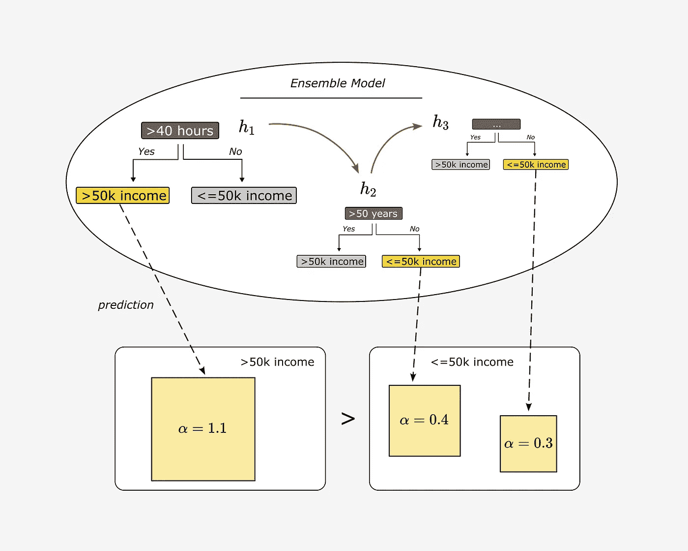
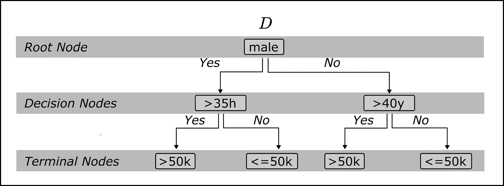
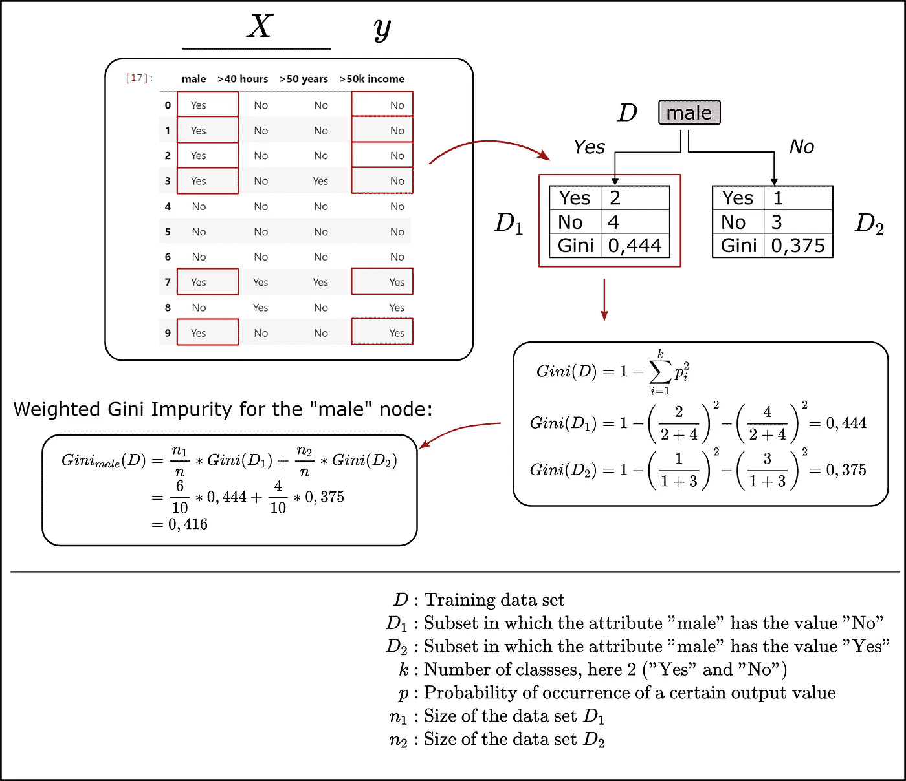
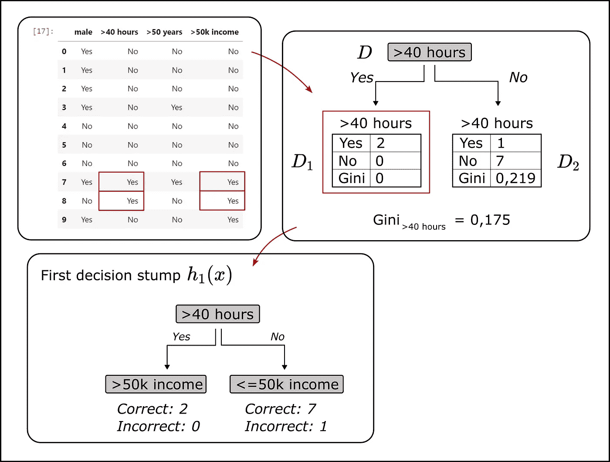
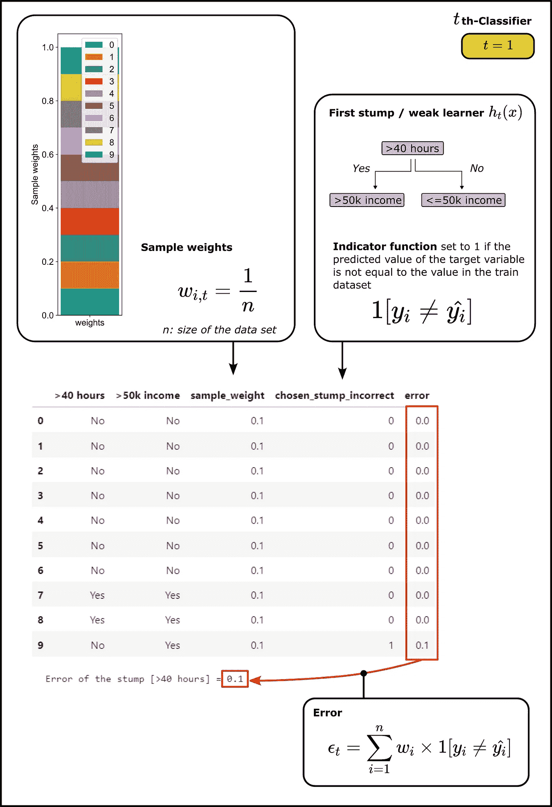
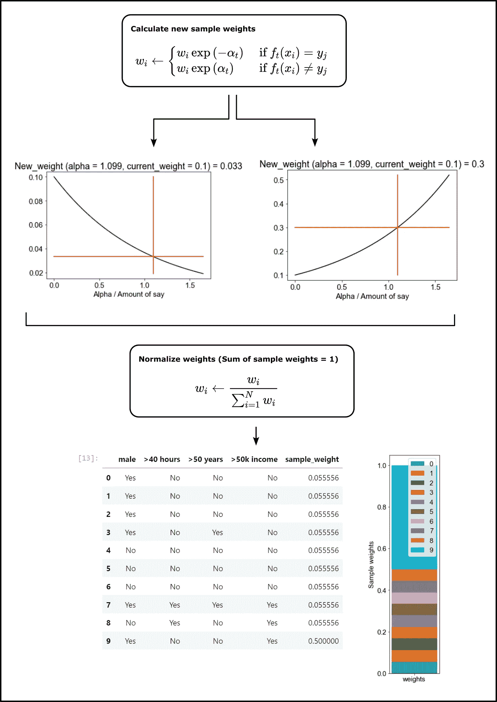
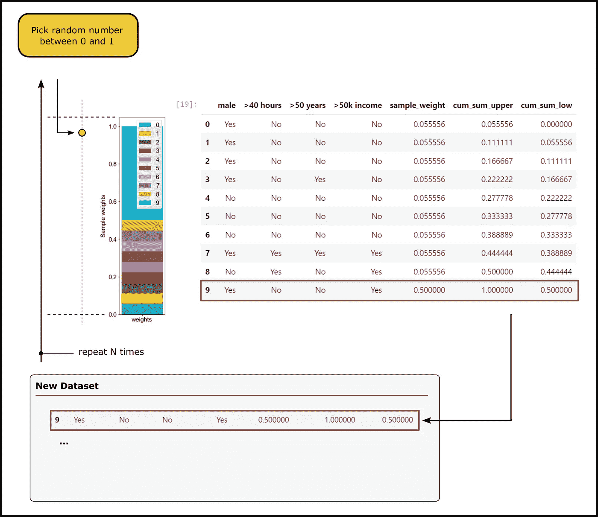
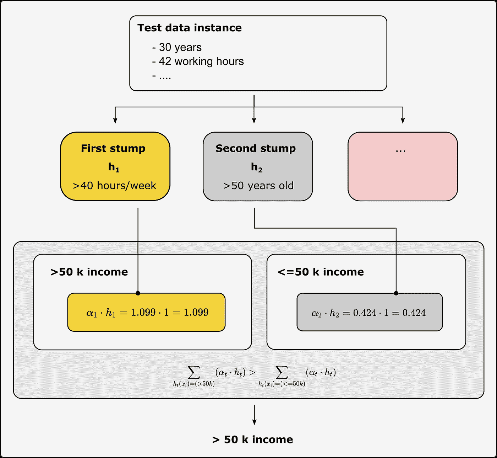

# AdaBoost，循序渐进

> 原文：<https://towardsdatascience.com/adaboost-in-7-simple-steps-a89dc41ec4>

## 升压和 AdaBoost 简介

AdaBoost—作者图片

AdaBoost 属于集成学习方法，并模仿“群体智慧”的原则:单独表现不佳的模型在组合时可以形成强大的模型。

2021 年发表的一项麻省理工学院的研究描述了人群如何识别假新闻。没有背景知识或事实核查，个人往往很难可靠地识别假新闻。然而，根据我们的经验，我们通常至少能够给出一个趋势，这通常比随机猜测要好。如果我们想知道一个给定的标题描述的是事实还是包含假新闻，我们可以简单地随机问 100 个人。如果超过 50 个说头条含有假新闻，我们就归类为假新闻。

几个单个弱学习器的预测组合起来可以产生一个强学习器，该强学习器能够以很高的准确度区分真伪。

***用集成学习，我们模仿这个概念***

***Boosting*** 是最流行的集成学习技术之一。建立一组所谓的弱学习器，即性能略好于随机猜测的模型。单个弱学习器的输出被组合为加权和，并代表增强分类器的最终输出。AdaBoost 代表“自适应增压”。适应性，因为模型是一个接一个地建立的，并且前面模型的性能影响后面模型的模型建立过程。

在学习过程中，AdaBoost 算法还会为每个弱学习者分配一个权重。因此，不是每个弱学习者对集成模型的预测都有相同的影响。这个计算整体模型预测的过程称为 ***软表决*** 。另一方面，如果每个弱学习者的结果被同等地加权，我们会说 ***硬投票*** 。[Kum21]

仅次于 ***装袋*** ， ***助推*** 是最广为人知的合奏方法。

*   在 ***装袋中，*** 我们训练一组相互独立的个体模型。各个模型彼此不同，因为它们是用训练数据集的不同随机子集训练的。随机森林就是基于这个原理。一组单独的决策树形成集合模型的预测。
*   另一方面，在 ***增强*** 中的训练是连续的。各个模型的建模过程一个接一个地进行，由此模型预测的准确性影响后续模型的训练过程。AdaBoost 算法是如何做到这一点的，将在本文中逐步解释。模型由弱学习器、深度为 1 的简单决策树，即所谓的“决策树桩”来表示。

本文旨在逐步解释 AdaBoost 算法背后的概念。为此，我搜索了一个简单的分类数据集，找到了“成人”数据集。[【KOH 96】](https://archive.ics.uci.edu/ml/datasets/adult)

# 使用的数据集

“成人”数据集(也称为“人口普查收入”数据集)用于二元分类任务。该数据集包含描述生活在美国的人的数据，如性别、年龄、婚姻状况和教育程度等属性。目标变量区分年收入低于和高于 50，000 美元。

为了说明 AdaBoost 算法是如何工作的，我简化了数据集，只使用了其中的一小部分。我已经将代码片段打包到 Jupyter 笔记本中描述的步骤中。如果您想自己遵循这些步骤，可以随意克隆 repo 或使用文本中的代码片段。

[https://github.com/polzerdo55862/Ada-Boost-Tutorial](https://github.com/polzerdo55862/Ada-Boost-Tutorial)

# 加载数据集

# 准备数据集

我直接从 UCI 加载数据集，并准备 3 个简单的二进制特征:

*   男性(是或否)
*   每周超过 40 小时(是或否)
*   50 岁以上(是或否)

在下文中，我将使用这个简单的数据集来解释 AdaBoost 算法的工作原理。

# 1.建造第一个 WeakLearner:找到性能最好的树桩

第一步，找一个 WeakLearner，可以对目标变量做一个陈述(> 50k 收入)，至少比随机猜测略胜一筹。

AdaBoost 可以与几种机器学习算法结合使用。在这种情况下，我们选择决策树作为弱学习器，这是 AdaBoost 算法最流行的应用。

*只是作为一个简短的复习:*

决策树在所谓的 ***节点*** 逐步分割整个数据集。树中的第一个节点叫做 ***根节点*** ，所有跟随 ***决策的节点*** 。不再发生数据集分割的节点被称为 ***终端节点*** 或 ***叶节点*** 。

决策树—作者图片

我在这里描述了用于回归任务的决策树和随机森林的工作原理:

 [## 7 种最常用的回归算法以及如何选择正确的算法

### 线性和多项式回归、RANSAC、决策树、随机森林、高斯过程和支持向量回归

towardsdatascience.com](/7-of-the-most-commonly-used-regression-algorithms-and-how-to-choose-the-right-one-fc3c8890f9e3) 

如果您对如何使用决策树执行异常检测任务感兴趣，您可以在此处找到对 ***隔离林*** 的介绍:

 [## 异常检测多样化领域的初学者综合指南

### 隔离森林，局部异常因子，一类 SVM，自动编码器，稳健协方差估计和时间序列…

towardsdatascience.com](/a-comprehensive-beginners-guide-to-the-diverse-field-of-anomaly-detection-8c818d153995) 

现在，我们试图找到在预测输出变量方面表现最佳的第一个决策树桩。为此，我们遵循与学习决策树相同的过程。第一步，我们确定数据集中最有可能区分高于和低于 50k 收入的特征。

为了有某种度量来评估不同的特征，我们使用了基尼系数。我们想找到叶子杂质最低的节点。

我们从随机选择的特征开始；这里的特征是“男性”。属性只区分这个人是不是男人。根节点将整个数据集分割成一个子集，其中仅包含男性和所有其他人的实例。

如果一个子集(例如 D1)包含 k 个不同的类，那么一条记录属于 I 类的概率可以描述为 p_i. [Kar22]下图中，我描述了如何计算左边终端节点的 ***基尼杂质*** 。

我们在下面使用的简单数据集只包含 10 个实例，6 个实例描述男性，4 个描述女性。如果我们查看包含 6 个“男性”数据样本的子集 D1，我们会看到 6 个人中有 4 个人的收入在 5 万英镑或以下。只有 2 张唱片的收入超过 50k。

因此，子集 D_1 的随机样本显示收入高于 50k 的概率**是 2/6 或 **1/3** ，样本显示收入低于 50k 的概率是 4/6 或 **2/3** 。因此，叶 1(子集 D_1)基尼系数为 0.444** 。

如果我们对叶子 2 做同样的事情，我们得到的杂质为 **0.375** 。

由于我们想要比较根节点“雄树”、“40 小时以上”和“50 年以上”的树桩的性能/基尼指数，我们首先计算根节点“雄树”的加权基尼系数，作为单个树叶的加权和。

计算基尼指数-作者图片

我在下面的 Python 片段中绘制了基尼指数的计算，它只是简单地迭代数据框的所有列，并执行上述基尼指数计算:

目标是最小化叶子的基尼杂质，从而最大化基尼增益，基尼增益被计算为两个分裂子集的加权杂质和整个数据集的杂质之间的差。

工作时间特征为" > 40 小时"的树桩显示出最高的基尼系数，因此被用于构建第一个树桩。

作者计算残肢图像的误差

AdaBoost 现在正在继续按顺序建造树桩。AdaBoost 的特别之处在于，第一个树桩产生的误差会影响下一个树桩的建模过程。第一个树桩错误分类的实例将在下一个树中被赋予更大的权重。单个残肢的结果在集合模型中的权重取决于残肢的误差有多高。

# 2.计算残肢的误差

在上图中，我已经画出了正确和错误分类的实例数量。据此，在为训练数据集的记录预测目标变量时，stump 仅产生一个错误。数据集中只有一个例子，每周工作时间超过 40 小时，但每年收入不到 5 万英镑。数据集中的所有其他实例都已经用这个简单的*决策树桩*正确分类了。

对于误差值的计算，我们为数据集的每个记录引入权重。在第一个树桩形成之前，每个实例的*权重 w* 为 *w=1/n* ，其中 n 对应数据集的大小。因此，所有权重的总和为 1。

然后，决策残肢产生的误差被简单地计算为残肢错误分类目标变量的所有样本权重的总和。由于所选的决策树桩仅错误分类了一个实例，**第一次运行的错误是 1/10。**

计算加权误差-作者图片

函数“*calculate _ error _ for _ choosed _ stump*”计算我选择的特征作为根节点的树桩的加权误差(*selected _ root _ node _ attribute*)。

# 3.计算树桩的权重，即“话语权”

正如已经提到的，集合模型的结果是所有树桩预测的加权和。因此，在下文中，我们感兴趣的是刚刚构建的树的预测对于最终的集合模型有多重要。或者换句话说，say (alpha) 的 ***量有多高。***

我们计算出***α***的金额如下:

计算作者的 say-Image 数量

上图左边部分显示了***say***(alpha)量与残肢加权误差的关系。对于小误差 ***量大的说*** 。对于较大的误差，α甚至可以取负值。对于 0.1 的第一个残端的误差，***alpha/量说*** 大约是 **1.1** 。

# 4.样品重量的调整

由于我们希望在对第二个树桩建模时考虑第一个树桩的结果，所以我们根据第一个树桩的误差来调整样本权重。第一个树桩预测错误的数据集记录应该在下一个树桩的构建过程中发挥更大的作用。为此，我们首先调整单个样本的权重。

使用 ***alpha*** 计算样品的新重量，如下所示:

1.  左图显示了正确分类样本的缩放比例。
2.  右图显示了错误分类样本的缩放比例
3.  然后，新的样本权重被归一化

计算样品重量—图片由作者提供

计算并绘制新的重量标度:

使用刚刚定义的函数更新样品重量:

# 5.第二次运行:形成新的引导数据集

对于第二次运行，我可以简单地为每个属性构建一个树桩，并选择加权误差最小的树桩。

或者，我们可以使用样本权重来生成一个新的数据集，其中权重较大的样本在统计上更常见。为此，我使用样本权重将范围 0–1 划分为多个区间。

您可以在图像中看到描述为“累计 _ 总和 _ 下限”和“累计 _ 总和 _ 上限”的箱范围。

定义范围-作者提供的图像

然后，我在 0 和 1 之间选择一个随机数，并寻找该数所在的范围/bin。我复制已识别的记录，并将其添加到新的数据集中。

我重复这个过程 N 次，直到我得到一个新的数据集，它是我的原始数据集的两倍长。

由于权重较大的样本在权重范围(从 0 到 1)中占据较大的范围，因此权重较大的样本通常会在新数据集中出现多次。这正是您在下图的数据集中看到的内容。被第一个树桩错误分类的样本权重更大(这里权重为 0.5)，最终更频繁地出现在新数据集中。

生成新数据集-作者提供的图像

对于新数据集，我们重复第一步:

1.  计算所有特征的基尼系数，并选择该特征作为显示最大基尼系数的第二个树桩的根节点
2.  建造第二个树桩
3.  将加权误差计算为错误分类样本的样本权重之和

找到第二个树桩的根节点:

# 6.重复该过程，直到达到终止条件

该算法现在重复刚刚描述的步骤，直到达到某个终止条件，例如直到所有特征已经被用作根节点一次。

**总结**

对于 1 中的 t…t:

1.  找到最大化基尼增益(或者最小化错误分类实例的误差)的弱学习器 h_t(x)
2.  将弱学习器的加权误差计算为误分类样本的样本权重之和。
3.  将分类器添加到集成模型中。模型的结果是个别弱学习者的结果的总结。使用上面确定的“说的量”/加权错误率α对弱学习者进行加权。
4.  更新权重:在加权和误差的帮助下，我们将α计算为刚形成的弱学习者的“发言权数量”。
5.  我们使用这个 alpha 来重新调整样本权重。
6.  新的样本权重被归一化，使得权重之和再次为 1
7.  使用新的权重，我们通过在 0 和 1 之间选择 N 次随机数来生成新的数据集，然后将数据样本添加到代表该数据集的新数据集。

# 7.将弱学习者组合成一个集成模型

集合模型计算预测如下:

*   **对每个树桩做预测**。

举个简单的例子，一个 30 岁的人每周工作 42 小时，第一个树桩的结果是收入高于 50k，第二个树桩的结果是收入低于 50k。

*   **将*的量累加到*的每一个输出值**。

到目前为止，我们的简单集合模型只包含两个树桩。我们将收入分类在 50k 以上的树桩和收入分类在 50k 以下的树桩的权重相加。

建立集合模型——作者的图像

然后我们简单的比较一下权重之和。因为在我们的例子中，第一个树桩的重量占优势，所以集合模型的预测是收入 50k。

# 摘要

近年来，Boosting 方法在许多数据竞赛中表现出了优异的结果，然而它们背后的概念却非常简单。简单易懂的步骤构建简单可解释的模型。只有简单模型的组合才能产生强大的学习者。

[如果您还不是中级高级会员，并且想要成为会员，您可以通过使用此推荐链接注册来支持我。](https://dmnkplzr.medium.com/membership)

感谢您的阅读！

# 参考

彼得·迪兹克斯:麻省理工学院新闻，2021 年。[https://news.mit.edu/2021/crowd-source-fact-checking-0901](https://news.mit.edu/2021/crowd-source-fact-checking-0901)

[Kar22] [Fatih Karabiber](https://www.learndatasci.com/author/FatihKarabiber) :基尼杂质，2022。https://www.learndatasci.com/glossary/gini-impurity/

[Kum21] Ajitesh Kumar:硬投票与软投票分类器 Python 示例，2021。[https://vital flux . com/hard-vs-soft-voting-classifier-python-example/](https://vitalflux.com/hard-vs-soft-voting-classifier-python-example/)

[Koh96] Kohavi，Ronny 和 Becker，Barry:成人数据集，1996 年。[https://archive.ics.uci.edu/ml/datasets/adult](https://archive.ics.uci.edu/ml/datasets/adult)(CC 乘 4.0)

[Wiq20] Wiqaas:推进决策树桩，2020 年。[https://github . com/wiq AAS/YouTube/blob/master/Machine _ Learning _ from _ Scratch/ada boosting/ada boosting _ Decision _ tree . ipynb](https://github.com/wiqaaas/youtube/blob/master/Machine_Learning_from_Scratch/AdaBoosting/AdaBoosting_Decision_Tree.ipynb)