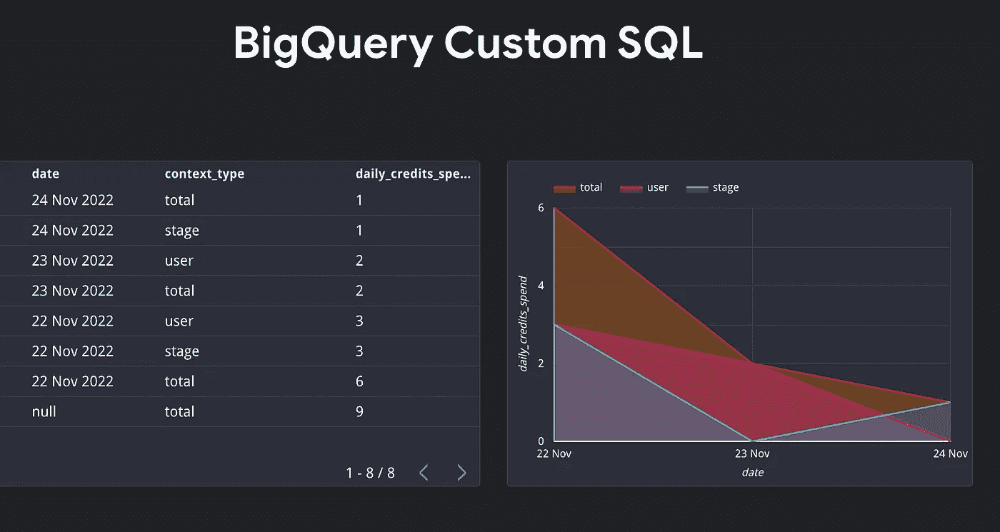

# 面向初学者的高级 SQL 技术

> 原文：<https://towardsdatascience.com/advanced-sql-techniques-for-beginners-211851a28488>

## 从 1 到 10，你的数据仓库技能有多好？

[Github](https://gist.github.com/638f8f09346769ad480d11764f11975c)

杰斯·贝利在 [Unsplash](https://unsplash.com?utm_source=medium&utm_medium=referral) 上拍摄的照片

从 1 到 10，你的数据仓库技能有多好？想上 7/10 以上？这篇文章是给你的。

想尽快准备好数据分析师的工作面试吗？这篇博文详细解释了一些复杂的数据仓库 SQL 技术。我将使用 BigQuery 标准 SQL 方言来写下关于这个主题的一些想法。

# 1.增量表和合并

以正确的方式有效地更新表是很重要的。这的确很重要。理想的情况是当你有主键、唯一整数和自动增量的事务时。这种情况下的表更新很简单:

在现代数据仓库中处理非规范化的星型模式数据集时，情况并非总是如此。您可能需要用 SQL 创建**会话**和/或用一部分数据增量更新数据集。`transaction_id`可能不存在，但你将不得不处理数据模型，其中唯一键依赖于已知的最新`transaction_id`(或时间戳)。例如，`last_online`数据集中的`user_id`依赖于最近已知的连接时间戳。在这种情况下，您可能希望`update`现有用户和`insert`新用户。

## 合并和增量更新

您可以使用**合并**或者将操作分成两个动作。一个用新记录更新现有记录，另一个插入不存在的全新记录(左连接情况)。

**MERGE** 是关系数据库中普遍使用的语句。Google BigQuery MERGE 命令是数据操作语言(DML)语句之一。它通常用于在一条语句中自动执行三个主要功能。这些功能是更新、插入和删除。

*   当两个或多个数据匹配时，可以使用 UPDATE 或 DELETE 子句。
*   当两个或多个数据不同且不匹配时，可以使用 INSERT 子句。
*   当给定的数据与源数据不匹配时，也可以使用 UPDATE 或 DELETE 子句。

这意味着 Google BigQuery MERGE 命令允许您通过更新、插入和删除 Google BigQuery 表中的数据来合并 Google BigQuery 数据。

**考虑这个 SQL:**

在这里，我们只用一个操作就完成了更新和插入。

# 2.计数单词

执行 UNNEST()并检查您需要的单词是否在您需要的列表中，这在许多情况下可能是有用的，例如数据仓库情感分析:

# 3.在 SELECT 语句外使用 IF()语句

这给了我们一个机会来节省一些代码行，并且在代码方面更有说服力。通常情况下，您会希望将它放入一个子查询中，并在 **where** 子句中添加一个过滤器，但是您可以改为执行 **this** :

另一个例子是**而不是**如何与**分区的**表一起使用。**不要这样**。这是一个不好的例子，因为由于匹配的表后缀可能是动态确定的(基于你的表中的某些东西)，你**将被收取全表扫描的费用。**

也可以在`HAVING`子句和`AGGREGATE`函数中使用。

# 4.使用分组依据汇总

ROLLUP 函数用于在多个级别执行聚合。当您必须处理尺寸图时，这很有用。

作者图片

以下查询根据在 **where** 子句中指定的交易类型(is_gift)返回每天的信用消费总额，并且还显示每天的消费总额以及所有可用日期的消费总额。

# 5.将表格转换成 JSON

假设您需要将表转换成 JSON 对象，其中每条记录都是嵌套数组的一个元素。这就是`to_json_string()`功能变得有用的地方:

然后你可以在任何地方使用它:日期、营销漏斗、指数、直方图等。

# 6.使用分区依据

给定`user_id`、`date`和`total_cost`列。对于每个日期，如何在保留所有行的同时显示每个客户的总收入值？您可以这样实现:

# 7.移动平均数

通常，BI 开发人员的任务是将移动平均值添加到报告和他们奇妙的仪表板中。这可能是 7 日、14 日、30 日/月甚至是年的 MA 线图。那么我们该怎么做呢？

# 8.日期数组

当你使用**用户保持**或者想要检查一些数据集是否缺少值，例如日期时，变得非常方便。BigQuery 有一个函数叫做`GENERATE_DATE_ARRAY`:

我之前在这里写过:

</retention-and-daily-active-users-explained-79c5dab1bf84>  

# 9.Row_number()

这有助于从数据中获取最新信息，如最新更新的记录等。或者甚至删除重复项:

# 10.NTILE()

另一个编号功能。如果你有一个手机应用程序，监控`Login duration in seconds`这样的事情真的很有用。例如，我将我的应用程序连接到 Firebase，当用户使用`login`时，我可以看到他们用了多长时间。

作者图片

该函数根据行排序将行划分到`constant_integer_expression`桶中，并返回分配给每一行的从 1 开始的桶号。存储桶中的行数最多相差 1。余数值(行数除以时段的余数)从时段 1 开始为每个时段分配一个。如果`constant_integer_expression`评估为空、0 或负，则提供错误。

在本文中，您可以找到如何使用 Firebase 和 Google Analytics 4 数据创建自定义用户活动和绩效仪表板的教程:

</i-stopped-using-firebase-dashboards-ive-built-my-own-instead-299631185b41>  

# 11.等级/密集 _ 等级

它们也被称为**编号**功能。我倾向于使用`DENSE_RANK` **作为默认排名函数**，因为它不会跳过下一个可用的排名，而`RANK`会。它返回连续的等级值。您可以将它与一个将结果划分到不同存储桶的分区一起使用。如果每个分区中的行具有相同的值，它们将获得相同的等级。**示例:**

**另一个关于产品价格的例子:**

# 12.透视/取消透视

透视将行更改为列。这就是它的全部功能。Unpivot 做与相反的[。最后，它在 BigQuery 中可用:](https://cloud.google.com/bigquery/docs/reference/standard-sql/query-syntax#unpivot_operator)

# 13.名值/姓值

这是另一个有用的函数，它有助于获得特定分区中每一行相对于第一个/最后一个值的增量。

# 14.将一个表转换成结构数组，并将它们传递给 UDF

当您需要将带有复杂逻辑的用户定义函数(UDF)应用于每一行或每一个表时，这非常有用。你总是可以把你的表看作一个 STRUCT 类型对象的数组，然后把它们传递给 UDF。看你的逻辑了。例如，我用它来计算购买过期时间:

以类似的方式，您可以创建不需要使用 **UNION ALL** 的表。例如，我用它来模拟单元测试的一些测试数据。这样你可以在你的编辑器中使用`Alt` + `Shift` + `Down`来快速完成。

</sql-unit-testing-in-bigquery-here-is-a-tutorial-64fc7a6b377>  

# 15.使用跟随和无限跟随创建事件漏斗

营销渠道就是一个很好的例子。您的数据集可能包含连续重复的相同类型的事件，但理想情况下，您会希望将每个事件与下一个不同类型的事件链接起来。当你需要得到某个东西的列表时，例如事件、购买等，这可能是有用的。为了建立一个漏斗数据集。使用 PARTITION BY it 使您有机会将以下所有事件分组，而不管每个分区中有多少个事件。

# 16.正则表达式

如果您需要从非结构化数据中提取某些信息，例如汇率、自定义分组等，您可以使用它。

# 使用 regexp 处理货币汇率

考虑汇率数据的这个例子:

# 使用 regexp 处理应用程序版本

有时，您可能想使用`regexp`为您的应用获取**主要**、**发布**或**修改**版本，并创建自定义报告:

# 结论

SQL 是帮助操作数据的强大工具。希望这些来自数字营销的 SQL 用例对你有用。这确实是一项方便的技能，可以帮助你完成许多项目。这些 SQL 片段让我的生活变得更加轻松，我几乎每天都在工作中使用它们。此外，SQL 和现代数据仓库是数据科学的必备工具。其强大的方言功能允许轻松地建模和可视化数据。因为 SQL 是数据仓库和商业智能专业人员使用的语言，如果您想与他们共享数据，它是一个很好的选择。这是与市场上几乎所有数据仓库/湖解决方案进行通信的最常见方式。

# 推荐阅读:

[1][https://cloud . Google . com/big query/docs/reference/standard-SQL/DML-syntax # merge _ statement](https://cloud.google.com/bigquery/docs/reference/standard-sql/dml-syntax#merge_statement)

[6][https://towards data science . com/how-to-compute-a-moving-average-in-big query-using-SQL-15 F3 fedd 7489](/how-to-compute-a-moving-average-in-bigquery-using-sql-15f3fedd7489)

[11][https://cloud . Google . com/big query/docs/reference/standard-SQL/window-function-calls](https://cloud.google.com/bigquery/docs/reference/standard-sql/window-function-calls)

[12][https://cloud . Google . com/big query/docs/reference/standard-SQL/query-syntax # unpivot _ operator](https://cloud.google.com/bigquery/docs/reference/standard-sql/query-syntax#unpivot_operator)

[14][https://cloud . Google . com/big query/docs/reference/standard-SQL/functions-and-operators # first _ value](https://cloud.google.com/bigquery/docs/reference/standard-sql/functions-and-operators#first_value)

*最初发表于*[T5【https://mydataschool.com】](https://mydataschool.com/blog/advanced-sql-techniques_for-beginners/)*。*