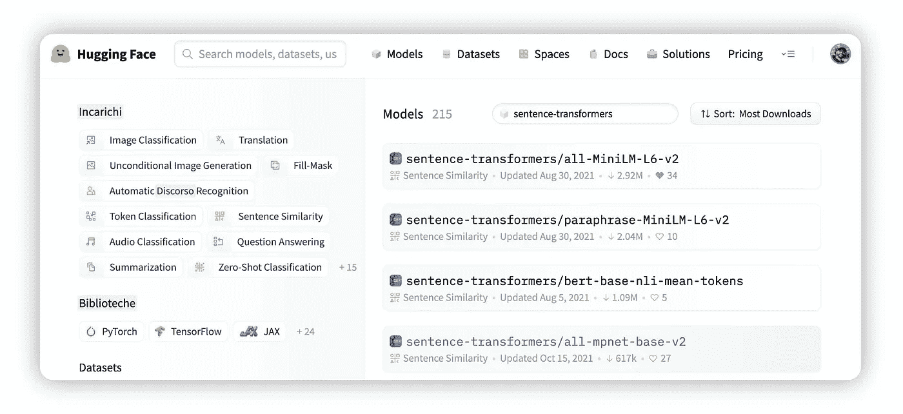
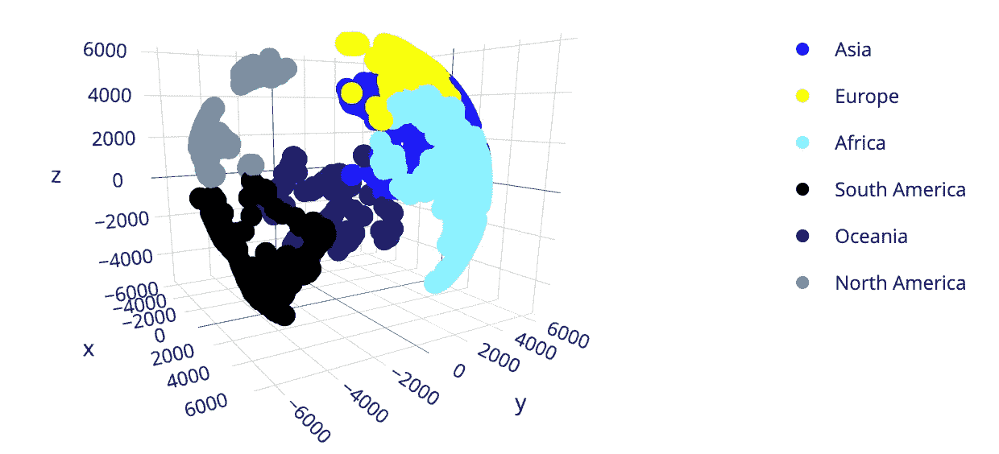
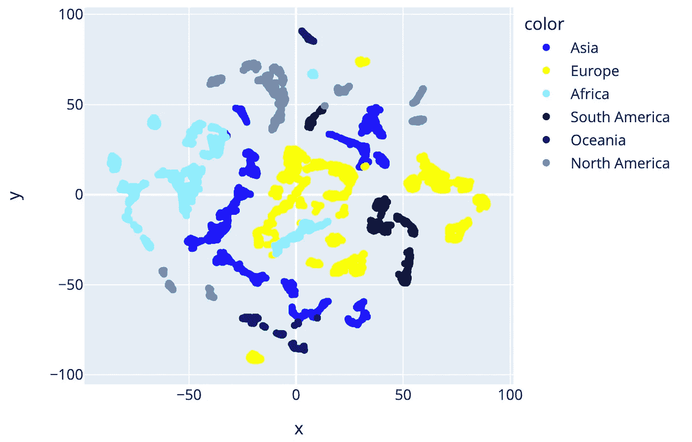
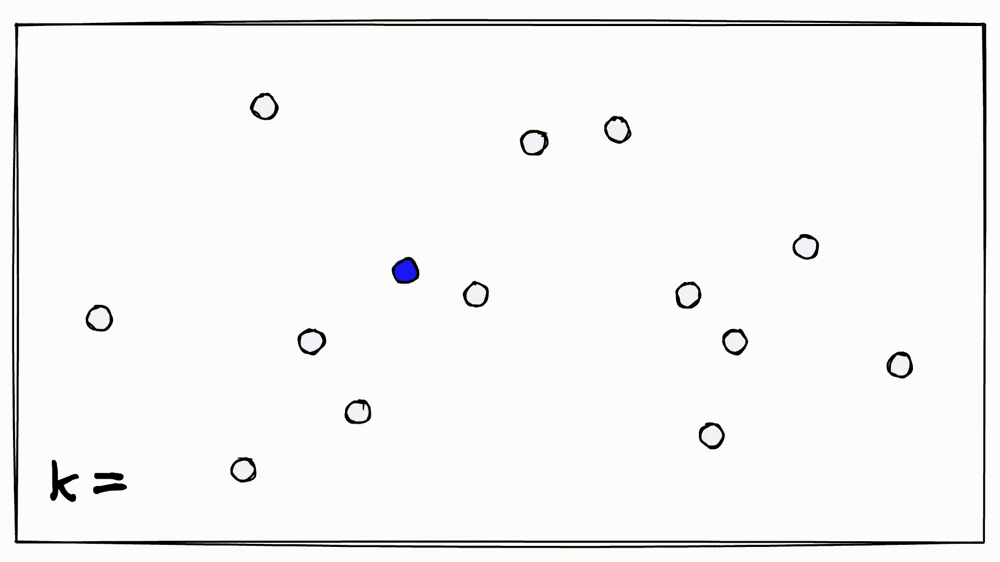
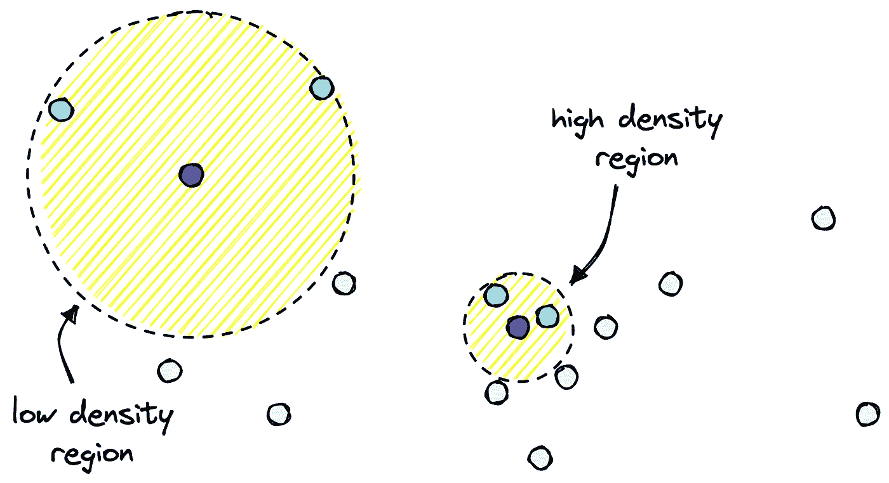
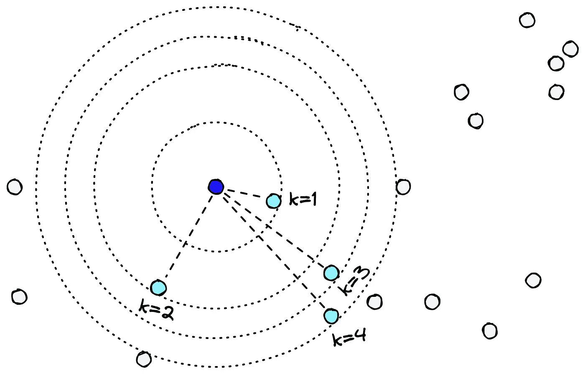
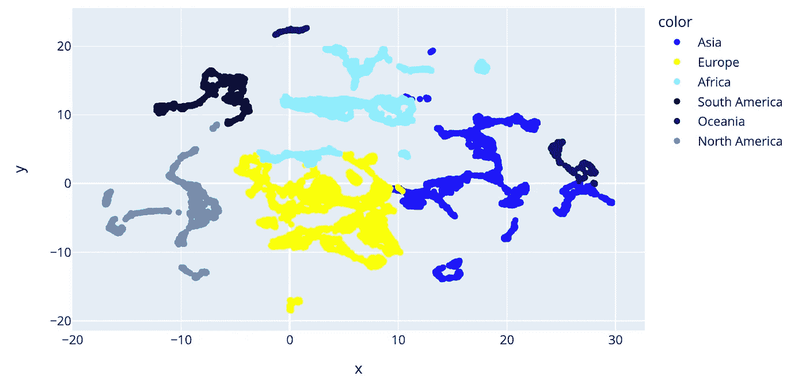
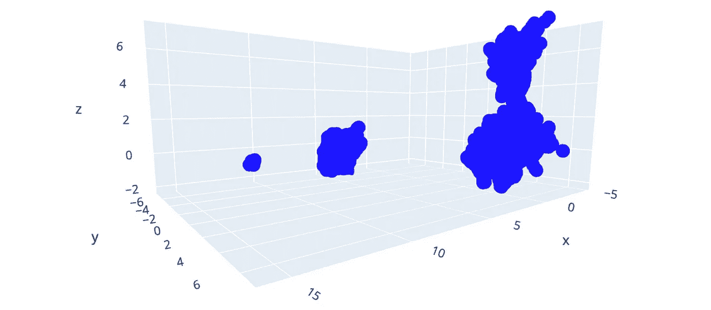
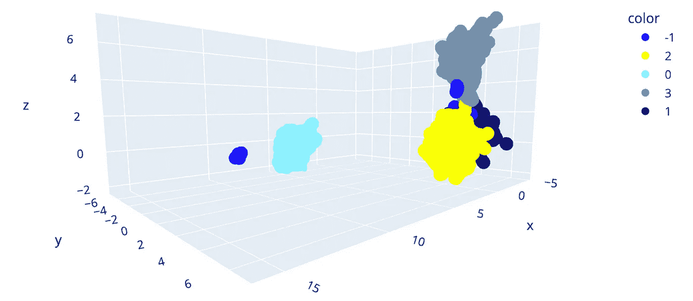

# 使用 BERTopic 进行高级主题建模

> 原文：<https://towardsdatascience.com/advanced-topic-modeling-with-bertopic-85fb8a90369e>

## 我们如何组织世界上最难组织的数据？

阿什·埃德蒙兹在 [Unsplash](https://unsplash.com?utm_source=medium&utm_medium=referral) 上拍摄的照片。原文章发表在 [pinecone.io](https://www.pinecone.io/learn/bertopic/)

组织大量的非结构化文本数据是复杂的。它不是为机器理解而设计的，让人类处理如此大量的数据非常昂贵，而且非常慢。

幸运的是，隧道的尽头有光明。越来越多的这种非结构化文本变得可以被机器访问和理解。我们现在可以根据*的含义* 搜索文本，识别文本情感，提取实体，等等。

变形金刚是这一切的幕后推手。这些变压器(不幸的是)不是迈克尔·贝的汽车人和霸天虎，也(幸运的是)不是嗡嗡作响的电箱。我们的 NLP 变形金刚介于两者之间，它们还不是有意识的汽车人，但它们能够理解语言，这种理解方式直到几年前还只存在于科幻小说中。

具有类似人类语言理解能力的机器对于组织大量非结构化文本数据非常有帮助。在机器学习中，我们将这项任务称为*主题建模*，即将数据自动聚类到特定主题中。

BERTopic 利用这些(尚未感知的)transformer 模型的高级语言能力，并使用其他一些 ML magic，如 UMAP 和 HDBSCAN(稍后将详细介绍)来产生当今语言主题建模中最先进的技术之一。

文章[视频版看这里](https://youtu.be/fb7LENb9eag)！

我们将深入 BERTopic [1]背后的细节，但在此之前，让我们看看如何使用它，并先看一眼它的组件。

首先，我们需要一个数据集。我们可以通过以下方式从 HuggingFace datasets 下载数据集:

数据集包含使用 Reddit API 从 */r/python* 子编辑中提取的数据。用于这个(和所有其他例子)的代码可以在找到。

Reddit 线程内容可以在`selftext`特性中找到。有些是空的或短的，所以我们用:

我们使用`BERTopic`库执行主题建模。*“基本”*方法只需要几行代码。

从`model.fit_transform`我们返回两个列表:

*   `topics`包含输入到其建模的*主题*(或集群)的一对一映射。
*   `probs`包含一个输入属于他们指定主题的概率列表。

然后，我们可以使用`get_topic_info`查看主题。

顶部的`-1`主题通常被认为是不相关的，它通常包含停用词，如*、*、*、*、*、*。然而，我们通过`vectorizer_model`参数删除了停用词，因此它向我们显示了主题的*【最一般】*，如*【Python】**【code】**【data】*。

该库有几个内置的可视化方法，如`visualize_topics`、`visualize_hierarchy`和`visualize_barchart`。

BERTopic 的`visualize_hierarchy`可视化让我们可以查看主题的“层次”。

这些代表了 BERTopic 库的表层，它有很好的文档，所以我们在这里不再赘述。相反，让我们试着理解一下*BERTopic*是如何工作的。

# 概观

BERTopic [2]中使用的*有四个*关键部件，它们是:

*   变压器嵌入模型
*   UMAP 降维
*   HDBSCAN 聚类
*   使用 c-TF-IDF 的聚类标记

我们已经在这几行 BERTopic 代码中完成了所有这些工作；一切都被抽象化了。但是，我们可以通过了解每个组件的要点来优化流程。本节将在没有 BERTopic 的情况下完成每个组件*，并在最后返回 BERTopic 之前了解它们是如何工作的。*

## 变压器嵌入

BERTopic 支持几个库，用于将我们的文本编码成密集的矢量嵌入。如果我们构建低质量的嵌入，我们在其他步骤中所做的任何事情都无法帮助我们，所以从一个支持的库中选择一个合适的嵌入模型*非常重要*，这包括:

*   句子变形金刚
*   天资
*   空间
*   根西姆
*   使用(从 TF Hub)

其中，*语句转换器*库提供了最广泛的高性能[语句嵌入模型](https://www.pinecone.io/learn/sentence-embeddings/)库。在 HuggingFace Hub 上搜索*“句子变形金刚”*就能找到。

在 HuggingFace Hub 上搜索*“句子变形金刚”*，可以找到*官方*句子变形金刚模型。

这个搜索的第一个结果是`sentence-transformers/all-MiniLM-L6-v2`，这是一个流行的高性能模型，它创建了 *384* 维句子嵌入。

为了初始化模型并编码我们的 Reddit 主题数据，我们首先`pip install sentence-transformers`然后编写:

在这里，我们对文本进行了成批的`16`编码。每个批次都被添加到`embeds`数组中。一旦我们拥有了`embeds`中所有的[句子嵌入](https://www.pinecone.io/learn/sentence-embeddings/)，我们就准备好进入下一步了。

## 降维

在构建我们的嵌入之后，BERTopic 将它们压缩到一个低维空间中。这意味着我们的 384 维向量转化为二维/三维向量。

我们可以这样做，因为 384 维是很多的 T21，我们不太可能真的需要那么多维来表示我们的文本。相反，我们试图将这些信息压缩成二维或三维。

我们这样做是为了更有效地执行下面的 HDBSCAN 集群步骤。用 384 个维度执行聚类步骤会非常慢[5]。

另一个好处是我们可以可视化我们的数据；这在评估我们的数据是否可以聚集时非常有用。可视化也有助于调整降维参数。

为了帮助我们理解降维，我们将从世界的 3D 表示开始。你可以在这里找到这部分的代码。

来自`[jamescalam/world-cities-geo](https://huggingface.co/datasets/jamescalam/world-cities-geo)`数据集的点的 3D 散点图。[互动视觉可以在这里找到](https://www.pinecone.io/learn/bertopic/#:~:text=3D%20scatter%20plot%20of%20points)。

我们可以对这些数据应用许多降维技术；两个最受欢迎的选择是 PCA 和 t-SNE。

我们的 2D 世界减少了使用五氯苯甲醚。

PCA 通过保持*更大的距离*(使用均方误差)来工作。结果是数据的*全局结构*通常被保留[6]。我们可以看到上面的行为，因为每个大陆都与其相邻的大陆组合在一起。当我们在数据集中有容易区分的聚类时，这可能是好的，但对于更细微的数据，这种方法表现不佳，因为*局部结构*很重要。

2D 地球减少使用 t-SNE。

t-SNE 则相反；它保留了*局部结构*而不是*全局结构*。这种局部的焦点来自于 t-SNE 建立一个图表，连接所有最近的点。这些局部结构可以间接地暗示整体结构，但它们没有被强烈地捕捉到。

*PCA 侧重于保持* ***相异*** *而 t-SNE 侧重于保持* ***相似*** *。*

幸运的是，我们可以使用一种不太为人所知的技术来捕捉这两者的最佳之处，这种技术叫做**U**n form**M**anifold**A**approximation 和**P**production(UMAP)。

我们可以使用使用`pip install umap-learn`安装的 UMAP 库在 Python 中应用 UMAP。要使用默认的 UMAP 参数映射到 3D 或 2D 空间，我们只需编写:

UMAP 算法可以使用几个参数进行微调。尽管如此，仅用`n_neighbors`参数就可以实现最简单和最有效的调优。

对于每个数据点，UMAP 搜索其他点并识别第 **k** 个最近的邻居[3]。它是由`n_neighbors`参数控制的 **k** 。

**k** 和`n_neighbors`在这里是同义词。当我们增加`n_neighbors`时，UMAP 构建的图表可以考虑更远的点，更好地代表全球结构。

在我们有许多点(高密度区域)的地方，我们的点和它的第 **k** 个最近邻点之间的距离通常较小。在点数较少的低密度区域，距离会大得多。

使用不同区域中第 **k** 个最近邻居之间的距离间接测量密度。

UMAP 将试图保持到第 k 个最近点的距离，这就是 UMAP 在转移到一个更低维度时试图保持的距离。

通过增加`n_neighbors`，我们可以保留更多的全局结构，而更低的`n_neighbors`可以更好地保留局部结构。

更高的`n_neighbors` ( **k** )意味着我们保留了更大的距离，从而保留了更多的全局结构。

与 PCA 或 t-SNE 等其他降维技术相比，找到一个好的`n_neighbours`值可以让我们相对较好地保留*局部和全局结构。*

将其应用到我们的 3D 地球，我们可以看到邻国仍然是邻居。同时大陆摆放正确(南北倒置)，岛屿与大陆分离。我们甚至还有“西欧”的伊比利亚半岛。

UMAP 还原的地球。

UMAP 保留了 PCA 没有保留的可识别特征和比 SNE 霸王龙更好的全局结构。这是 UMAP 利益所在的一个很好的例子。

如果我们已经标记了数据，通过将标签传递给`target`参数，UMAP 也可以用作监督降维方法。使用这种有监督的方法有可能产生更有意义的结构。

记住所有这些，让我们将 UMAP 应用于我们的 Reddit 主题数据。使用`3` - `5`中的`n_neighbors`似乎效果最好。我们可以添加`min_dist=0.05`来允许 UMAP 将点放得更近(默认值是`1.0`)；这帮助我们将三个*相似的*主题从 *r/Python* 、 *r/LanguageTechnology* 和 *r/pytorch* 中分离出来。

Reddit 主题使用 UMAP 将数据简化到 3D 空间。

随着我们的数据减少到一个低维空间，主题很容易视觉识别，我们在一个很好的位置上移动到集群。

## HDBSCAN 聚类

我们已经使用现有的*子*特征为我们的聚类着色，可视化了 UMAP 缩减的数据。它看起来很漂亮，但是我们通常不执行主题建模来标记已经标记的数据。如果我们假设我们没有现有的标签，我们的 UMAP 视觉将如下所示:

UMAP 减少了城市数据，我们可以区分许多集群/大洲，但没有标签着色就困难得多。

现在让我们看看如何使用 HDBSCAN 对(现在的)低维向量进行聚类。

聚类方法可以分为平面或分层的*和*质心或基于密度的技术【5】。每一种都有自己的优点和缺点。

扁平化或层次化仅仅关注聚类方法中是否存在层次。例如，我们可以(理想地)将我们的图层次结构视为从大陆到国家再到城市。这些方法允许我们查看一个给定的层次结构，并尝试沿着树识别一个逻辑“切割”。

分层技术从一个大的集群开始，将这个集群分成越来越小的部分，并试图在层次结构中找到理想的集群数量。

另一种分裂是基于质心或基于密度的聚类。即基于接近质心的聚类或基于点密度的聚类。基于质心的聚类非常适合于*【球形】*聚类，而基于密度的聚类可以处理更不规则的形状*和*识别异常值。

基于质心的聚类(左)与基于密度的聚类(右)。

HDBSCAN 是一种基于密度的分层方法。这意味着我们可以受益于分层数据更容易的调整和可视化，处理不规则的聚类形状，*和*识别异常值。

当我们第一次将 HDBSCAN 聚类应用于我们的数据时，我们将返回由下面的*浓缩树图*中的红色*圆圈*标识的*多个*微小聚类。

*随着算法通过增加λ值进行扫描，浓缩树图显示了离群点的减少和聚类的分裂。*

*HDBSCAN 根据不同 lambda 值下的大小和持久性选择最终聚类。树中最粗、最持久的“分支”被认为是最稳定的，因此是聚类的最佳候选。*

这些聚类不是很有用，因为*默认*创建一个聚类所需的最小点数仅仅是`5`。给定我们的～3K 点数据集，我们的目标是产生～4 个子旋涡星团，这是很小的。幸运的是，我们可以使用`min_cluster_size`参数增加这个阈值。

好些了，但还不够。我们可以尝试将`min_cluster_size`减少到`60`，以将三个集群拉到绿色区块下方。

不幸的是，这仍然拉进绿色块，甚至允许*太小的*簇(如左边)。另一个选择是保留`min_cluster_size=80`，但增加`min_samples=40`，以允许更多稀疏的核心点。

现在我们有四个集群，我们可以使用`clusterer.labels_`中的数据来可视化它们。

HDBSCAN 对 reddit 主题进行聚类，准确识别不同的子 Reddit 聚类。稀疏的蓝点是异常值，并且不被识别为属于任何聚类。

一些异常值用蓝色标记，其中一些有意义(固定的每日讨论线程),其他没有意义。然而，总的来说，这些集群是非常准确的。有了这些，我们就可以试着识别这些集群的意义。

## 基于 c-TF-IDF 的主题抽取

BERTopic 的最后一步是为每个集群提取主题。为此，BERTopic 使用了 TF-IDF 的修改版本，称为 c-TF-IDF。

TF-IDF 是一种流行的技术，用于识别给定一个术语或一组术语的最相关的*【文档】*。c-TF-IDF 通过在一个集群中找到所有“文档”中最相关的*术语*来扭转这一局面。

c-TF-IDF 从每个类(集群)中寻找最相关的术语来创建主题。

在我们的 Reddit 主题数据集中，我们已经能够识别非常独特的集群。然而，我们仍然需要确定这些集群谈论什么。我们首先预处理`selftext`来创建令牌。

c-TF-IDF 的一部分要求计算类别 *c* 中术语 *t* 的频率。为此，我们需要查看哪些令牌属于每个类。我们首先将集群/类标签添加到`data`。

现在创建特定于类的令牌列表。

我们可以计算每个类的频率(TF)。

请注意，这可能需要一些时间；我们的 TF 过程将可读性放在任何效率概念之上。一旦完成，我们就可以计算**I**v 反转 **D** 文档 **F** 频率(IDF ),它告诉我们一个术语有多常见。罕见术语比常见术语具有更高的相关性(并将输出更高的 IDF 分数)。

在`tf_idf`，我们有一个`vocab`大小的每个职业的 TF-IDF 分数列表。我们可以使用 Numpy 的`argpartition`函数来检索包含每个类的最大 TF-IDF 分数的索引位置。

现在我们将这些索引位置映射回`vocab`中的原始单词。

# 回到 BERTopic

我们已经讨论了相当多的内容，但是我们能把我们所学的应用到 BERTopic 库吗？

幸运的是，我们只需要几行代码。和以前一样，我们初始化我们的自定义嵌入、UMAP 和 HDBSCAN 组件。

您可能会注意到，我们已经将`prediction_data=True`作为一个新参数添加到了`HDBSCAN`中。我们需要这样做，以避免在将我们的自定义 HDBSCAN 步骤与 BERTopic 集成时出现 **AttributeError** 。添加`gen_min_span_tree`为 HDBSCAN 增加了另一个步骤，可以改善生成的集群。

我们还必须初始化一个`vectorizer_model`来处理 c-TF-IDF 步骤中的停用词移除。我们将使用 NLTK 中的停用词列表，但是添加了一些看起来会影响结果的标记。

我们现在准备将所有这些传递给一个`BERTopic`实例，并处理我们的 Reddit 主题数据。

我们可以用`model.visualize_barchart()`来想象新的主题

我们的最终主题是使用 BERTopic 库和经过调整的 UMAP 和 HDBSCAN 参数生成的。

我们可以看到主题与*r/投资*、 *r/pytorch* 、 *r/LanguageTechnology* 和 *r/Python* 完美契合。

Transformers、UMAP、HDBSCAN 和 c-TF-IDF 显然是功能强大的组件，在处理非结构化文本数据时有着巨大的应用。BERTopic 已经抽象了这个堆栈的大部分复杂性，允许我们只用几行代码就可以应用这些技术。

虽然 BERTopic 可能很简单，但您已经看到它可以深入到各个组件中。通过对这些组件的高度理解，我们可以极大地提高我们的主题建模性能。

我们已经在这里介绍了一些要点，但是在本文中，我们实际上只是触及了主题建模的皮毛。BERTopic 和每个组件的内容比我们希望在一篇文章中涵盖的要多得多。

所以，去应用你在这里学到的东西吧，记住，尽管这里展示了 BERTopic 令人难以置信的性能，它还可以做更多的事情。

# 资源

🔗[所有笔记本脚本](https://github.com/pinecone-io/examples/tree/master/learn/algos-and-libraries/bertopic)

[1] M. Grootendorst， [BERTopic Repo](https://github.com/MaartenGr/BERTopic) ，GitHub

[2] M. Grootendorst， [BERTopic:基于类的 TF-IDF 过程的神经主题建模](https://arxiv.org/abs/2203.05794) (2022)

[3] L .麦金尼斯，j .希利，j .梅尔维尔， [UMAP:一致流形逼近与降维投影](https://arxiv.org/abs/1802.03426) (2018)

[4] L .麦金尼斯，[谈 UMAP 降维](https://www.youtube.com/watch?v=nq6iPZVUxZU) (2018)，SciPy 2018

[5] J. Healy， [HDBSCAN，基于快速密度的聚类，如何和为什么](https://www.youtube.com/watch?v=dGsxd67IFiU) (2018)，PyData NYC 2018

[6] L .麦金尼斯，[《一个骗子的降维指南》](https://www.youtube.com/watch?v=9iol3Lk6kyU) (2018)，PyData NYC 2018

[UMAP 解说](https://www.youtube.com/watch?v=6BPl81wGGP8)，AI 与 Letitia 的茶歇，YouTube

**除另有说明外，所有图片均出自作者之手*