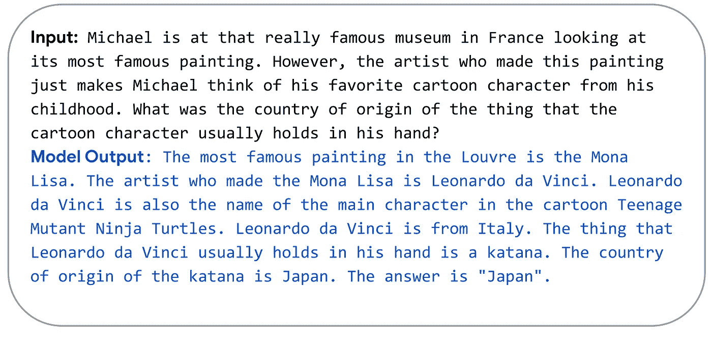

# 推进机器智能:为什么环境决定一切

> 原文：<https://towardsdatascience.com/advancing-machine-intelligence-why-context-is-everything-4bde90fb2d79>

*图片来源:*[*red pixel*](https://stock.adobe.com/contributor/200825764/redpixel?load_type=author&prev_url=detail)*via*[*Adobe Stock*](https://stock.adobe.com/)*。*

我们大多数人都听说过这样一句话，“形象就是一切。”但是当谈到把人工智能带到一个新的水平时，语境才是最重要的。

情境意识体现了人类学习中所有微妙的细微差别。正是“谁”、“哪里”、“何时”和“为什么”决定了人类的决策和行为。如果没有上下文，当前的[基础模型](https://arxiv.org/abs/2108.07258)注定会旋转它们的轮子，并最终打断对人工智能改善我们生活的期望的轨迹。

这篇博客将讨论上下文在 ML 中的重要性，以及*后期绑定上下文*如何提高机器启蒙的标准。

# **为什么背景很重要**

背景深深植根于人类的学习中，以至于我们很容易忽视它在我们如何应对特定情况时所扮演的关键角色。为了说明这一点，考虑两个人之间的对话，对话以一个简单的问题开始:*奶奶好吗？*

在真实世界的对话中，这个简单的查询可以根据上下文因素(包括时间、环境、关系等)引发任意数量的潜在响应。：

*图一。一个恰当的回答“奶奶好吗？”高度依赖于上下文。图片来源:英特尔实验室。*

这个问题说明了人类的大脑如何跟踪和考虑大量的上下文信息，甚至是微妙的幽默，以返回相关的响应。这种流畅地适应各种微妙环境的能力远远超出了现代人工智能系统的能力。

为了理解机器学习中这种缺陷的意义，考虑基于强化学习(RL)的自主代理和机器人的发展。尽管基于 RL 的架构在模拟游戏环境中取得了宣传和成功，如 [Dota 2](https://cdn.openai.com/dota-2.pdf) 和[星际争霸 2](https://www.nature.com/articles/s41586-019-1724-z)，但即使是纯粹的游戏环境，如 [NetHack](https://paperswithcode.com/dataset/nethack-learning-environment) 也对当前的 RL 系统构成了巨大的障碍，因为赢得游戏所需的政策具有高度的条件性和复杂性。类似地，正如[在](https://arxiv.org/pdf/2110.06169.pdf)[最近的许多作品](https://journals.sagepub.com/doi/full/10.1177/0278364920987859)中指出的，自主机器人在能够与以前看不见的物理环境互动之前还有很长的路要走，而不需要在部署之前[模拟正确的环境类型](https://www.science.org/doi/10.1126/scirobotics.abg5810)，或者强化已学习的策略。

# **当前 ML 和上下文查询的处理**

除了一些[显著的例外](https://arxiv.org/pdf/2104.06378.pdf)，大多数 ML 模型包含非常有限的特定查询的上下文，主要依赖于模型被训练或微调的数据集所提供的通用上下文。这种模型也引起了对[偏差](https://dl.acm.org/doi/abs/10.1145/3457607)的极大关注，这使得它们不太适合在许多商业、医疗保健和其他关键应用中使用。即使是在语音助手 AI 应用程序中使用的最先进的模型，如 [D3ST](https://arxiv.org/abs/2201.08904) ，也需要手动创建模式或本体的描述，其中可能包含模型识别上下文所需的意图和动作。虽然这涉及相对最低水平的手工制作，但这意味着每次更新任务的上下文时都需要明确的人工输入。

这并不是说机器学习模型的上下文感知没有重大发展。OpenAI 团队的著名大型语言模型 GPT-3 已经被用来生成与人类文章相媲美的完整文章 T2，这是一项至少需要跟踪本地上下文的任务。谷歌在 2022 年 4 月推出的[路径语言模型](https://arxiv.org/pdf/2204.02311.pdf) (PaLM)展示了更强大的能力，包括在适当的上下文中理解概念组合的能力，以回答复杂的查询。

*图二。PaLM 能够成功地处理需要在同一概念的不同上下文之间跳转的查询。图片鸣谢:*[*Google Research*](https://arxiv.org/pdf/2204.02311.pdf)*【13】*[*CC BY 4.0 license*](https://creativecommons.org/licenses/by/4.0/)*。*

最近的许多进步都集中在[基于检索的查询增强](https://arxiv.org/pdf/2005.11401.pdf)，其中对模型(查询)的输入通过从辅助数据库中自动检索相关数据来补充。这使得[在问答和知识图推理等应用上取得了重大进展](https://www.deepmind.com/publications/improving-language-models-by-retrieving-from-trillions-of-tokens)。

即使在一些背景约束下，可实现的输出质量也有了如此大幅度的提高，这可能很容易让人认为这表明了现代人工智能系统中更普遍的背景意识。然而，这些模型仍然不能提供更复杂的应用所需要的环境，如制造业、医疗实践等。这样的应用程序通常需要一定的上下文灵活性——正如在之前的一篇博客中的[适应性](/lm-km-3e81e1e1c3ae)部分所讨论的。例如，相关上下文可能必须以时间信息为条件，如用户请求的紧急程度，或者交互的目标和敏感性。这种适应性将允许给定查询的适当上下文基于与人的通信的进展而发展。简单地说，模型必须避免妄下结论，直到获得所有相关的上下文信息。这种对原始查询的最终响应的谨慎定时的暂停可以被称为*后期绑定上下文*。

值得一提的是，最近的神经网络模型确实具有实现某些后期绑定上下文的能力。例如，如果模型附加了像维基百科这样的辅助数据库，它可以用最新版本的[维基数据](https://www.wikidata.org/wiki/Wikidata:Main_Page)来调整其响应，从而在对特定查询提供响应之前考虑某种程度的时间相关上下文。

高度重视上下文的一个领域是[对话式人工智能](https://www.forbes.com/sites/googlecloud/2022/03/21/conversational-ais-moment-is-now/?sh=cb239b053919)，特别是[多回合对话建模](https://www.aaai.org/AAAI21Papers/AAAI-9758.XuY.pdf)。然而，[承认](https://dl.acm.org/doi/full/10.1145/3498557)在提供话题意识、考虑隐含时间、先验知识和意向性方面存在关键[挑战](https://www.sciencedirect.com/science/article/pii/S2666651021000164)。

大多数当前部署的人工智能技术的问题是，即使它们可以在特定情况下执行条件反射过程，随着时间的推移条件反射*对许多应用程序来说仍然是一个挑战，因为它需要结合对手头任务的理解以及对之前发生的事件序列的记忆，这充当了条件反射先验。为了考虑一个更轻松、更隐喻的例子，人们可以回忆起加拿大侦探剧“默多克之谜”，它以其副歌“你有什么，乔治？”。这是侦探默多克不断用来询问治安官克雷布特里最新进展的短语，答案总是不同的，并且高度依赖于故事中先前发生的事件。*

# **将上下文构建到机器学习中**

那么，如何在机器学习中大规模地整合和利用后期绑定上下文呢？

一种方法是创建[元知识](/understanding-of-and-by-deep-knowledge-aac5ede75169)的“选择掩码”或“覆盖层”,提供相关上下文信息的重叠层，基于特定用例有效地缩小搜索参数。例如，在对正确处方进行医学搜索的情况下，医生会考虑患者的诊断状况、其他共病、年龄、以前的不良反应和过敏史等，以将搜索空间限制在特定药物上。为了处理上下文的后期绑定方面，这种覆盖必须是动态的，以捕捉最近的信息、基于特定于案例的知识对范围的细化、对正在进行的交互的目标的理解等等。

*图 3:正确的医疗决策需要大量针对患者的及时背景考虑。图片来源:英特尔实验室。*

源属性是另一个关键的元知识维度，它作为一个选择掩码特别有用，可用于启用后期绑定上下文。这就是为什么一个模型会更相信一个特定的来源——比如《新英格兰医学杂志》对一个匿名的 Reddit 帖子。来源归属的另一个应用是选择一组正确的决策规则和约束条件，这些规则和约束条件应在给定的情况下应用，例如，当地司法管辖区的法律或特定州的交通规则。来源归属也是减少偏差的关键，因为它是在创建信息的来源的背景下考虑信息，而不是通过出现次数的统计来假设信息的正确性。

这篇博客没有触及一个非常重要的方面——人类或未来的人工智能系统如何选择相关的信息片段作为特定查询的上下文？为了找到上下文相关的数据片段，必须搜索的数据结构是什么？这种结构是如何学习的？在以后的文章中会有更多关于这些问题的内容。

# **避免断章取义**

人工智能领域在整合条件作用、组合性和上下文方面取得了长足的进步。然而，机器智能的下一个级别将需要在合并动态理解和应用后期绑定上下文的多个方面的能力方面取得重大进展。当在高度感知、即时互动的人工智能范围内考虑时，上下文就是一切。

# **参考文献**

1.  Bommasani，r .，Hudson，D. A .，Adeli，e .，Altman，r .，Arora，s .，von Arx，s .，… & Liang，P. (2021)。[论基金会模式的机遇与风险](https://arxiv.org/abs/2108.07258)。 *arXiv 预印本 arXiv:2108.07258* 。
2.  Berner，c .、Brockman，g .、Chan，b .、Cheung，v .、Dę biak，p .、Dennison，c .……、张，S. (2019)。[大规模深度强化学习的 Dota 2。](https://cdn.openai.com/dota-2.pdf) *arXiv 预印本 arXiv:1912.06680* 。
3.  Vinyals，o .，Babuschkin，I .，Czarnecki，W. M .，Mathieu，m .，Dudzik，a .，Chung，j .，…，Silver，D. (2019)。[星际争霸 2 中的特级大师级使用多智能体强化学习。](https://www.nature.com/articles/s41586-019-1724-z) *性质*， *575* (7782)，350–354。
4.  h . küttler，n . nard elli，a . Miller，r . raile anu，r . selva tici，m . Grefenstette，e .，& rocktschel，T. (2020 年)。[net hack 学习环境。](https://proceedings.neurips.cc/paper/2020/hash/569ff987c643b4bedf504efda8f786c2-Abstract.html) *神经信息处理系统的进展*， *33* ，7671–7684。
5.  Kostrikov，I .，Nair，a .，& Levine，S. (2021 年)。[采用隐式 q 学习的离线强化学习。](https://arxiv.org/abs/2110.06169)arXiv 预印本 arXiv:2110.06169 。
6.  Ibarz，j .，Tan，j .，Finn，c .，Kalakrishnan，m .，Pastor，p .，和 Levine，S. (2021)。如何用深度强化学习训练你的机器人:我们已经学到的教训。 *《国际机器人研究杂志》*，*40*(4–5)，698–721。
7.  Loquercio，a .，Kaufmann，e .，Ranftl，r .，Müller，m .，Koltun，v .，和 Scaramuzza，D. (2021 年)。[在野外学习高速飞行。](https://www.science.org/doi/abs/10.1126/scirobotics.abg5810) *科学机器人*， *6* (59)，eabg5810。
8.  Yasunaga，m .，Ren，h .，Bosselut，a .，Liang，p .，，Leskovec，J. (2021)。Qa-gnn:使用语言模型和知识图进行推理，用于问题回答。 *arXiv 预印本 arXiv:2104.06378* 。
9.  Mehrabi、f . mor statter、n . sa xena、Lerman、k .和 a . Galstyan(2021 年)。[关于机器学习中偏见和公平的调查。](https://dl.acm.org/doi/abs/10.1145/3457607) *ACM 计算调查(CSUR)* ， *54* (6)，1–35。
10.  赵，顾磊杰，曹，于，王，李，吴，(2022)。[描述驱动的面向任务的对话建模。](https://arxiv.org/abs/2201.08904) *arXiv 预印本 arXiv:2201.08904* 。
11.  t .布朗、b .曼恩、n .赖德、Subbiah、m .卡普兰、J. D .、Dhariwal、p .…& amo dei，D. (2020 年)。语言模型是一次性学习者。 *神经信息处理系统的进展*， *33* ，1877–1901。
12.  记者 G. S. (2020 年 9 月 11 日)。一个机器人写了整篇文章。你害怕了吗，人类？守护者。
13.  Chowdhery，a .、Narang，s .、Devlin，j .、Bosma，m .、Mishra，g .、Roberts，a .…& Fiedel，N. (2022)。Palm:用通路来扩展语言建模。 *arXiv 预印本 arXiv:2204.02311* 。
14.  Lewis，p .，Perez，e .，Piktus，a .，Petroni，f .，Karpukhin，v .，Goyal，n .，… & Kiela，D. (2020)。[知识密集型自然语言处理任务的检索增强生成。](https://arxiv.org/pdf/2005.11401.pdf) *神经信息处理系统进展*， *33* ，9459–9474。
15.  Borgeaud，s .，Mensch，a .，Hoffmann，j .，Cai，t .，Rutherford，e .，Millican，k .，… & Sifre，L. (2021)。[通过从数万亿个标记中检索来改进语言模型。](https://arxiv.org/abs/2112.04426) *arXiv 预印本 arXiv:2112.04426* 。
16.  歌手 g(2022 年 1 月 15 日)。 [*LM！=KM:语言模型无法满足下一代人工智能*知识模型需求的五大原因。](/lm-km-3e81e1e1c3ae)中等。
17.  摩尔，A. W. (2022，4 月 14 日)。 [*对话 AI 的时刻现在是*。](https://www.forbes.com/sites/googlecloud/2022/03/21/conversational-ais-moment-is-now/?sh=cb239b053919)福布斯。
18.  徐，杨，赵，洪，张，(2021 年 5 月)。[话题感知的多回合对话建模。](https://www.aaai.org/AAAI21Papers/AAAI-9758.XuY.pdf)在*第三十五届 AAAI 人工智能大会(AAAI-21)* 。
19.  李玉英，李伟文，聂，等(2022)。[对话式开放领域问答的动态图推理。](https://dl.acm.org/doi/full/10.1145/3498557) *美国计算机学会信息系统汇刊(TOIS)* ， *40* (4)，1–24。
20.  高，陈，雷，魏，何，德，李，蔡，等(2021)。[会话式推荐系统的进展与挑战:综述。](https://www.sciencedirect.com/science/article/pii/S2666651021000164) *艾开*， *2* ，100–126。
21.  歌手 g(2022 b，5 月 9 日)。 [*对知识的理解和深入*](/understanding-of-and-by-deep-knowledge-aac5ede75169) *—走向数据科学*。中等。