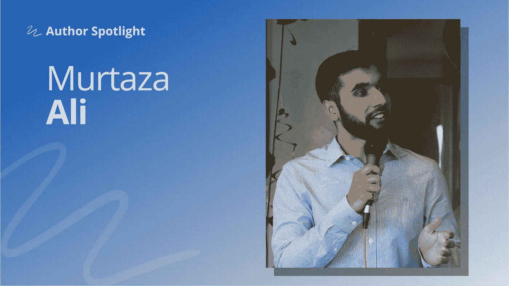

# 做了调查之后，是时候相信你的直觉了

> 原文：<https://towardsdatascience.com/after-doing-your-research-its-time-to-trust-your-instinct-252412610fc9>

## [作者聚焦](https://towardsdatascience.com/tagged/author-spotlights)

## *关于数据科学教育的挑战，以及让复杂的主题变得容易理解。*

*在 Author Spotlight 系列中，TDS 编辑与我们社区的成员谈论他们在数据科学领域的职业道路、他们的写作以及他们的灵感来源。今天，我们很高兴与* [*穆尔塔扎·阿里*](https://medium.com/u/607fa603b7ce?source=post_page-----252412610fc9--------------------------------) *分享我们的对话。*

照片由穆尔塔扎·阿里提供

*Murtaza 是华盛顿大学的博士生，研究以人为中心的设计和工程，专注于数据科学。他的研究重点是数据可视化、以人为中心的数据科学和计算教育，他的一些其他(偶尔相关)兴趣包括写作和教学。*

## **是什么激发了你最初对数据相关话题的兴趣？**

我在加州大学伯克利分校读本科时是应用数学专业的学生，在我大三的时候，我选修了一门很受欢迎的课程——“数据 100:数据科学的原理和技术。”我对这门课没有太多期望；我接受它主要是因为其他人推荐它，而且它涵盖了我的一个主要需求。

那门课对我未来的学术轨迹产生了巨大的影响。它有一个独特的结构:由两位教授共同授课，一位是统计专家，另一位是著名的计算机科学家。这样做是为了强调数据科学本质上是跨学科的，这是我在写作和工作中经常强调的。在每周的讲座中，他们讨论高层次的话题以及社会影响，并分配实验室和项目，让学生动手实践数据争论、处理和分析任务。

然而，那个学期特别独特的是，它是在 2020 年春天——由于新冠肺炎，我们上线时被打断了。那个学期，我花了很多时间使用课堂上的技能来探索和分析各种在线数据集，甚至参加了我的第一次 Kaggle 比赛。我参加了每周的 Zoom 办公时间，与教授讨论我初露头角的兴趣，教授鼓励我，甚至指导我加入了一个以数据为中心的研究小组。从那以后大约两年了，我对数据的迷恋没有任何停止的迹象。

## 作为一个正在攻读博士学位的人，你最感兴趣的问题是什么？

早在我参加“数据 100”课程并对数据科学感兴趣之前，我是一名计算机科学入门助教，我知道我喜欢教学——这是我最初获得博士学位的动力。经过多次培训，在许多学生面前挣扎，并审查各种教学评估的结果，我意识到学生(我不严格地使用这个词，因为它不仅仅指大学本科生)最希望他们的老师有一点:*以简单易懂的方式简化复杂概念的能力*。那是黄金标准，我努力去实现它。

在许多方面，我认为这是吸引我进入数据科学的原因——在数据科学中，是数据可视化的原因。我看到了可视化和教育之间的许多联系，其中最主要的一点是，它们都旨在为一些目标受众获取复杂的想法并简化它们。这就是我在博士申请中所写的内容，也是我主要致力于数据可视化和计算教育相关问题的原因。

## **你已经知道未来几年你的作品会是什么样了吗？**

由于我还在读博士，我还没有一个占据我大部分时间的具体项目，但我正在探索各种途径，试图找到我的定位。也就是说，有几个问题我目前有兴趣回答:

*   文本数据本质上是非结构化和无序的，这使得它很难可视化。如果我们简化它，把重点放在具有人类定义的顺序的文本和文档上会怎么样？这种文本的一个例子是学术研究论文，其按节组织，并且在节内按段落组织。有没有有效的方法来设计和实现这些和相关文档的可视化？
*   人们喜欢漂亮的东西。在使可视化吸引人的眼球，同时又能有效地呈现数据之间，什么是正确的平衡？我们希望人们学习，但我们也希望他们享受其中。
*   在当今以技术为中心的世界中，计算教育变得越来越重要，然而美国的教育体系也存在令人难以置信的缺陷、偏见和漏洞。这是一个极其宽泛的问题，但也是一个同样重要的问题:我们如何让它变得更好？“更好”到底是什么意思？
*   一个稍微相关的问题:所有这些关于连接可视化和教育的东西只是我头脑中的一个幻想吗，或者我们实际上可以混合这两个领域的技术以便各自受益？

## **这些听起来像是需要探索的非常重要的问题！你认为为了接近这些大课题，高级学位是必要的吗？**

大约在我完成本科学业的时候，许多人坚定地认为，至少硕士学位是在数据科学职位上有竞争机会的必要条件。虽然我认为这种说法肯定还是有一些价值的，但我也认为随着大学数据科学课程变得越来越先进和广泛，一个高级学位可能不是严格必要的。

## 你会建议人们如何做这个决定？

有几个重要的问题需要自己考虑。

我目前的技能如何适应我想要的工作？获得硕士学位的额外一年或两年时间是否会让我获得更多统计、概率和数据科学方面的基础知识，或者使我能够专攻我感兴趣的领域，如人工智能？我*真的*需要上学，还是可以自学？

许多人盲目地归因于对自我学习的崇拜，但我个人认为这因人而异。有些人，比如我自己，从一个有组织的班级中受益匪浅，这个班级有结构化的作业和外部责任。

有了博士，问题就不一样了。在获得博士学位之前，你需要绝对确定你喜欢研究或教学。虽然获得博士学位后回到工业界而不是留在学术界肯定是可能的，但博士学位期间将涉及大量的研究和一些教学。大多数博士项目都是有报酬的，学生可以获得生活津贴，但数额非常低(通常每月 2000 至 3000 美元，一年 9 个月，取决于学校所在的地区和项目)，因此这也值得思考。

当然，回报也可能是巨大的:你将学到大量的东西，你将成为你论文特定领域的领先专家，你将成为就业市场上的抢手货。然而，你必须问自己两个问题:1)我真的*需要*这个吗，2)我真的*想要*这个吗？

还有一件事:在你做了做决定所需的所有研究之后，相信你的直觉。它通常知道什么是对的。

## 你的公开写作是否影响或借鉴了你目前的学术工作？这两个领域是如何相互作用的？

目前，因为我还在博士的早期阶段，我还没有写我的研究项目。这在很大程度上是因为它们仍未公开，在接受同行评审时需要保持私密性。

然而，我获得博士学位的主要原因之一是因为我热爱教学，这与我的写作有着巨大的互动。我的目标之一是为计算机科学和数据科学教育设计更好的技术，尤其是为那些没有经验的人。结果我写的很多文章都是针对新手的。正如我上面提到的，我试图把复杂的想法用简单的方式表达出来。

## 这是我们在你最近的许多关于 TDS 的文章中看到的。是什么激励你开始为更广泛的读者写作？

这部分与我上面提到的有关:我的一个爱好是教学，所以写教学文章是这一爱好的自然延伸。想分享我对媒介的见解和想法，在某种程度上是我对“学术把关”这一概念感到沮丧的一种表达，作为博士学位的一部分，我对这个概念太熟悉了。

在学术界，所有的东西都是用复杂华丽的语言写成的，从来没有针对普通大众。我发现这是一个重大问题，特别是因为研究的全部目的是让世界总体上变得更美好(广义上讲)。Medium 给了我一个出口，让我可以简单通俗地写作，让每个人都能理解概念。作为一个在大学早期努力奋斗的人，这对我来说非常重要，我很感激有机会这样做。

要了解更多关于穆尔塔扎的工作和探索他的最新文章，请在[媒体](https://murtaza5152-ali.medium.com/)和[推特](https://twitter.com/murtazaali_5253)上关注他。为了体验一些 Murtaza 的可访问且有用的数据科学指南，以下是 TDS 档案中的一些亮点:

*   [**怎样才能让人工智能有道德？**](/how-can-we-make-artificial-intelligence-ethical-6d26657c6c32)**(2021 年 12 月 4 分钟)**
*   **[**数据科学的三大基石**](/the-three-building-blocks-of-data-science-2923dc8c2d78)(2022 年 3 月，7 分钟)**
*   **[**如何获得技能实习——详细指南**](/how-to-get-a-technical-internship-a-detailed-guide-ecd4e1b68154)**(2022 年 4 月，11 分钟)****
*   ****[**数据科学数学思维导论**](/an-introduction-to-mathematical-thinking-for-data-science-f1214d2cc61d)(2022 年 3 月，9 分钟)****

****想和广大观众分享一些你自己的作品吗？我们很乐意收到你的来信。****

*****这个 Q & A 是为了长度和清晰而稍加编辑的。*****