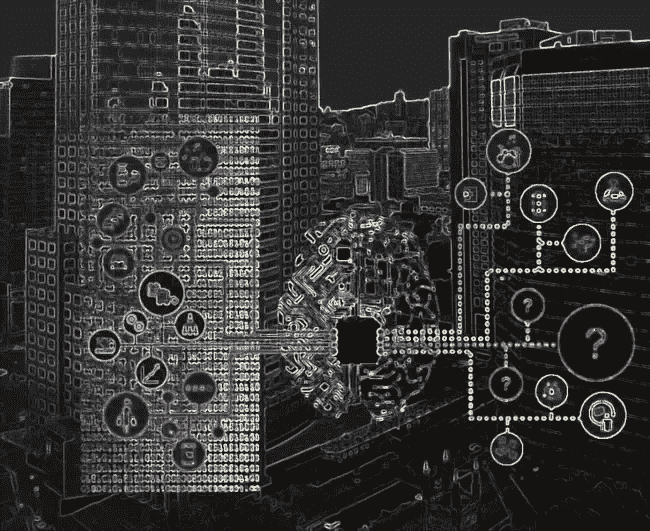
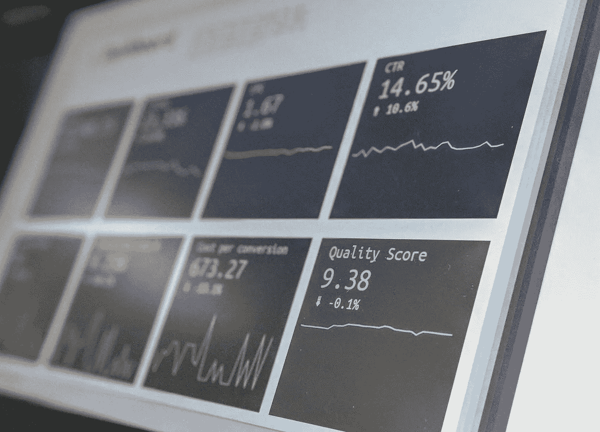

# AI 和 ML 能保存干净的转换加速吗，或者只是在风暴中保持亮着？

> 原文：<https://towardsdatascience.com/ai-and-ml-to-save-the-clean-transition-acceleration-or-just-to-keep-the-light-on-during-the-storms-9219b52a8fba>

## 在一个充满多重挑战和风暴的世界里，整合可再生能源，如果没有人工智能和机器学习，说起来容易做起来难

马克斯·拉罗彻尔在 [Unsplash](https://unsplash.com?utm_source=medium&utm_medium=referral) 上拍摄的照片

随着疫情仍处于幕后，许多国家的政治危机加剧，再加上气候变化对全球的影响越来越大，可再生能源行业(如全球许多行业)迫切需要高效的工具和方法来恢复我们的“技术”元气。

但在风暴期间保持照明是一种选择还是行业生存的必要条件？

人工智能先驱之一， [Rana el Kaliouby](https://en.wikipedia.org/wiki/Rana_el_Kaliouby) (一位 AI 思想领袖。机器学习科学家。Smart Eye 的副首席执行官、 [Affectiva](https://www.affectiva.com/) 的前联合创始人兼首席执行官)正确地表示，“人工智能正在社会中扮演许多新角色——成为我们的同事，在我们的家中充当虚拟助理，操作我们的汽车，等等”。

 [## Affectiva 首席执行官拉纳·埃尔·卡利欧比访谈

### 人工智能正在迅速成为主流，根植于我们的生活结构中，代表我们的利益行事…

blog.re-work.co](https://blog.re-work.co/interview-with-rana-el-kaliouby-ceo-affectiva/) 

虽然电网是地球上最复杂的机器之一，但它在不断变化的世界中发展迅速，而各种可再生能源的增加使其更加复杂。值得注意的是，由于众所周知的风能和太阳能固有的可变性，目前的电网在适应可再生能源的多样性方面面临许多挑战。

公用事业行业需要智能系统来帮助改善可再生能源与现有电网的整合，并使可再生能源成为能源供应中的平等参与者。

以下是人工智能技术如何有助于提高可再生能源的可靠性，以及在当地和全球范围内实现电网现代化。

**不断增长的挑战**

它始于理解和认识到每个人以及每项技术都是独一无二的，都有不同的优势、能力和经验。整合不同的能源是第一步，认识到这一点，然后创造环境，在那里你可以发挥每一个最好的方面，这样当他们一起工作时，总和远远大于部分。

在这篇文章中，我想重点关注机器学习和数据源中的技术集成，这些技术可以作为能源转型的催化剂，而技术的限制和简单的“竞争”将打破整个过程。

为了想出前沿的解决方案，你真的需要有不同的视角和技能。我们都知道，在一个团队中，如果你有相同类型的人在做某件事(都是男性，都是老人，都来自城市，等等)。)，您只能创建自己的解决方案类型。整合差异，实际上可以让你扩大视野，突破界限。人工智能有助于整合不同的解决方案，拓宽可能性的范围。

[西蒙朱](https://unsplash.com/@smnzhu?utm_source=unsplash&utm_medium=referral&utm_content=creditCopyText)在 [Unsplash](http://localhost:3000/@smnzhu?utm_source=unsplash&utm_medium=referral&utm_content=creditCopyText) 上拍照

书籍和电影中的人工智能已经以不同的形式存在了很长时间。他们被描绘成有时友好，有时险恶。但在现实生活中，我们喜欢将 AI 视为增强智能。多年来，人工智能已经在许多不同的领域证明了自己的用处。在人工智能出现之前，计算机仅根据例子识别照片中的人的想法是闻所未闻的。今天，我们甚至使用人工智能来检查医学图像，以快速识别异常，挽救患者的生命。

[Coursera 联合创始人、](https://www.andrewng.org/)[百度人工智能事业部前负责人](https://www.forbes.com/sites/aarontilley/2017/09/13/adam-coates-baidu-ai-departure/#2bda080b67e2) / [谷歌大脑](https://ai.google/research/teams/brain/)、[将人工智能的变革性影响比作 100 年前电力的变革性影响](https://medium.com/@dpereirapaz/andrew-ngs-the-state-of-artificial-intelligence-reviewed-7007d95a72a1)，我当然同意他的观点。

事实上，AI 对不同的人意味着不同的东西。对于视频游戏设计师来说，人工智能意味着编写影响机器人如何游戏或环境如何对玩家做出反应的代码。对于我们大多数人来说，我们看到的人工智能更有可能是你手机上的一个应用程序，而不是智能机器人(或 Android！).它被用于幕后管理财务，建议你的下一部网飞电影，识别信用卡欺诈，阅读医学成像，并为病人找到合适的临床试验。人工智能参与了我们每天的决策。

到 2025 年，美国人工智能支出将增长到 1200 亿美元，在 2021-2025 预测期内，复合年增长率(CAGR)为 26.0%。此外，国际数据公司( [IDC](https://www.idc.com/) )的最新[全球人工智能支出指南](https://www.idc.com/tracker/showproductinfo.jsp?containerId=IDC_P33198)中描述的所有 19 个美国行业预计将实现 20%或更高的人工智能支出增长。美国也占全球人工智能支出的一半以上。

[https://www . enterprise ai . news/2022/03/17/spending-on-ai-solutions-will-double-in-the-us-2025-says-IDC/](https://www.enterpriseai.news/2022/03/17/spending-on-ai-solutions-will-double-in-the-us-by-2025-says-idc/)

*图片来源:Smart Phases Inc .(*[*nova cab . us*](http://www.novacab.us)*)*

“使用人工智能的最大潜在好处仍然是它在开发新业务和建立新商业模式方面的用途，”IDC 客户洞察分析团队的高级研究经理 Mike Glennon 说。“然而，现有企业不愿接受这一潜力，将最大的机会留给了新的市场进入者，他们不惧怕变化，能够轻松适应新的经营方式。商业的未来是人工智能，那些能够抓住这个机会的公司很容易成为新的巨头。”

但在能源领域，它仍有很长的路要走。与许多其他行业相比，在电力行业，我们可以利用增强智能来扩展人类的能力，并完成人类或机器无法独自完成的事情。我们今天面临的一些挑战来自于过量的信息。更快的通信、分布式计算和物联网(IoT)导致了(指数级增长的)海量数据的产生，而物联网本身和社交网络鼓励了大部分数据的非结构化。数据太多，人类专家无法跟上所有的变化和进步。

 [## 没有智能储能，就没有快速(足够)的能量转换！

### 人工智能和储能 fast 需要强耦合，以便与可再生能源实现高效过渡，从而对抗狂暴的…

towardsdatascience.com](/no-fast-enough-energy-transition-without-intelligent-energy-storage-72cfbd3c096b) 

**增强智能**

随着机器学习带来的增强智能，我们可以从数据中提取更多的实质和相互关系，同时将所需的信息放在我们的指尖，并用证据支持这些信息，以便利益相关者可以做出更明智的决策。这将允许专家和决策者扩展他们的能力，以便他们能够更好地服务他们的客户。机器做耗时的工作，这样我们才能做重要的事情。

在传统编程中，一切都是确定的，if-then-else 循环决定了软件如何响应变化的条件。当您比较已知值，如温度、文本字符串或电子表格中的数字时，这很有用。但是当你想要将对象-决策-变化分类时，简单的“如果-那么”语句是行不通的。这个世界太复杂了，有灰色阴影和多个正确答案，概率答案成为一种要求。在电力领域，几乎一切都是概率性的(天气、消费者行为、高峰管理、风力涡轮机或太阳能光伏输出等)。).确定性系统可以告诉你，“答案是 X，因为比较成功”，例如恒温器上的温度，而在负载均衡或可再生发电中则需要概率性系统，因为你需要一个系统告诉你，“我非常有信心这是正确的答案，但我也有证据支持这些替代方案”(例如，储存能量以备后用，减慢风力涡轮机，因为风力可能超过限制，等等)。).

## 机器学习在电力领域的应用

AI 擅长什么，不擅长什么？答案往往归结于数据。人工智能技术就像任何技术一样会改进，所以今天的限制可能是明天的突破，但当前的人工智能技术非常擅长分类和翻译(解释)。

不管你说的是自然智能还是人工智能，没有什么是不能学习的智能。人类生来就有某种程度的先天智能，我们可以通过学习来建立这种智能。先天智能机器唯一拥有的是我们给予它们的东西，而常识目前不在那张很短的清单上。不过，我们提供的是检查示例的能力，以及基于输入和期望输出创建机器学习(ML)模型的能力。对于监督学习，我们为 AI 提供了例子。无监督学习是你提供输入，而不是标签，让机器推断质量。这种类型的学习对于聚类数据很有用，其中数据根据其与邻居的相似程度以及与其他事物的不相似程度进行分组。

一旦数据被聚类，您就可以使用不同的技术来研究这些数据并寻找模式。强化学习是机器做出决定，并根据决定是否正确给予奖励或回报。你可以使用强化学习来教机器下棋或导航障碍课程，如需求侧管理或发电计划。深度学习是应用于神经网络的机器学习的子集。深度学习网络指的是节点的排列，这肯定会是下一代与能源相关的人工智能应用

当选择用于训练机器模型的数据源时，重要的是对在生产中会遇到的数据的代表性数据进行采样。可能出现的一个挑战是训练数据无法预测未来的输入数据。这个问题必须在这个过程中尽快解决。不一定你需要所有的答案，而是你确定了一个处理这种情况的过程。因为垃圾输入等于垃圾输出，没有任何人工智能解决方案可以从坏数据中给出好的结果。然而，如果您的一些数据是坏的，您可以做的是识别并保留您的可用数据，并收集(或构建)可以在您的解决方案中使用的新数据。您应该考虑您必须处理的数据的数量、质量和敏感性。

斯蒂芬·道森在 [Unsplash](http://localhost:3000/@dawson2406?utm_source=unsplash&utm_medium=referral&utm_content=creditCopyText) 上拍摄的照片

**更高效地整合不同来源**

能源网格可以与设备和传感器互连，以收集大量数据。

当与人工智能结合时，这些数据可以为电网运营商提供新的见解，以更好地控制运营。它为能源供应商提供了灵活性，可以根据需求灵活地调整供应。

先进的负载控制系统可以安装在设备上，如工业炉或大型交流设备，当电源不足时，这些设备可以自动关闭。智能储物单元还可以根据供应流量进行调节。

此外，智能机器和先进的传感器可以预测天气和负载，从而全面提高可再生能源的整合和效率。

这对于电网运营商来说变得越来越复杂，对于较小的设施或社区来说也是如此。它现在涉及将可再生能源生产资产纳入自我消费(太阳热能和/或光电、从生物量或沼气生产热能、地热能……)，以使运营商能够减少碳足迹，实现能源组合多样化，并减少对传统燃料的依赖，这将有助于更好地控制与能源相关的长期预算。

在任何情况下，它都是优先激活的杠杆:“未用完的能源没有成本，也不会造成污染”。另一方面，即使有一些很好的成功或更有吸引力的行业，可再生能源和回收技术的部署在行业中仍然太落后。有许多障碍需要克服:巨大的投资成本、当前与化石燃料和廉价电力的竞争、对与这些创新技术相关的运营风险的恐惧、缺乏技术知识或运营能力等。这就是人工智能和数据科学可以提供很大帮助的地方。

可以分析许多积极的经验，并将其作为“学习”阶段的范例。这将旨在通过回收技术和可再生能源向该行业提供短期内的可能性，重点是主要部门和一套技术。

**可再生能源的强劲基本面**

自 2019 年可再生能源行业展望以来，“三个有利趋势支撑了强劲的基本面”。这些趋势包括支持可再生能源增长的新兴政策、扩大投资者对该领域的兴趣，以及提高风能和太阳能对电网、资产所有者和客户价值的技术进步。或许最重要的是，大多数细分市场的强劲需求。自 2017 年以来，公用事业表现出强劲的“自愿需求”(52%的公用事业规模的太阳能项目在开发中，73%的项目在 2018 年上半年宣布，而不是我们过去看到的由政策命令驱动的需求)。自 2017 年以来，仅新的太阳能项目就占[超过煤炭、天然气和核能的两倍](https://www.independent.co.uk/environment/solar-energy-world-investment-higher-coal-gas-nuclear-combined-2017-un-report-a8290051.html)。企业对可再生能源的需求迅速增长，这在一定程度上推动了自愿需求。

在联合国气候变化会议(COP26)上，落基山研究所(RMI)、气候智能风险投资公司(Climate Smart Ventures)、碳信托公司(Carbon Trust)和能源转型智库国际网络(INETT)宣布成立煤炭资产转型加速器(CATA)，这是一个首创的平台，将利用金融来加速全球煤炭转型。CATA 由 IKEA Foundation 和 Growald Climate Fund 资助，旨在为地方政府、公用事业公司、金融家和民间社会组织提供前沿分析、领先的专业知识和一系列工具和资源，以实现从煤炭到清洁能源的转型。

欧洲气候基金会(ECF)总裁兼首席执行官 Laurence Tubiana 在第 26 次缔约方会议上向代表们介绍了 CATA，他说:“显而易见的是，单靠经济和气候政策不会像气候科学所敦促的那样迅速将煤炭从系统中清除，尊重区域和当地背景并考虑到公正过渡的金融机制是关键。”。

[推出新举措，加速全球煤电厂转型……](https://zephyrnet.com/new-initiative-unveiled-to-expedite-transition-of-coal-plants-globally/)

RMI 及其合作伙伴表示，设计良好的金融机制可以支持从煤炭到清洁能源的公平过渡。

 [## 推出新举措加快全球煤电厂转型...

### 马绍尔群岛和合作伙伴说，设计良好的金融机制可以支持从煤炭到清洁能源的公平过渡…

zephyrnet.com](https://zephyrnet.com/new-initiative-unveiled-to-expedite-transition-of-coal-plants-globally/) 

2019 年，马绍尔群岛已经在展示他们通过各种采购途径购买了近 6.5 千兆瓦(GW)的可再生能源。

 [## 新的脸书，谷歌，通用汽车和沃尔玛为首的工业集团推出，目标是 60 千兆瓦…

### 华盛顿 DC，2019 年 3 月 28 日-谷歌，脸书，通用汽车和沃尔玛，以及其他 300 多家公司…

rmi.org](https://rmi.org/press-release/new-facebook-google-gm-and-walmart-led-renewables-group-launched/) 

拯救地球从未如此有利可图；这是该行业成熟的又一标志。因此，对话现在转向人工智能将如何帮助传统能源、可再生能源和储能改善电网，以满足(目前)未来的需求。

让我们把重点放在建设性的东西上，放在如何利用人工智能和能量存储的技术组合上。因此，对已经超过传统能源[的可再生能源的投资将变得更加经济合理，而且还因为这可能成为应对气候变化和建立更有弹性的电网的主要倡导者之一。](https://www2.deloitte.com/us/en/pages/energy-and-resources/articles/renewable-energy-outlook.html)

人工智能可以帮助整合微电网和管理分布式能源。当社区一级的可再生能源发电机组加入初级电网后，电网内的能量流动就变得很难平衡。

人工智能驱动的控制系统可以在解决质量和拥堵问题方面发挥至关重要的作用。

**提高安全性和可靠性**

虽然人工智能在可再生能源领域的最大目标是管理间歇性，但它也可以提高安全性、效率和可靠性。

它可以帮助您了解能源消耗模式，并识别设备的能源泄漏和健康状况。

例如，人工智能驱动的预测分析可以从风力涡轮机传感器收集数据，以监控磨损。该系统将监控设备的整体健康状况，并在需要维护时提醒操作员。

 [## 人工智能，我们在紧张的电网中最好的朋友

### 人工智能和其他转换技术，必须与不断增长的分布式能源资源(DERs

towardsdatascience.com](/artificial-intelligence-our-best-friend-in-a-stressed-if-not-devasted-power-grid-3e9303d6d9ae) 

人工智能的集成可以通过引入新的服务模式和鼓励更高的参与度来帮助可再生能源供应商扩大市场。人工智能驱动的系统将能够分析与能源收集相关的数据，并提供对能源消耗的见解。

这些数据将帮助供应商优化现有服务并推出新的服务模式。它还可以帮助零售供应商瞄准新的消费市场。

**具有智能存储的智能电网**

最后，人工智能与智能储能(IES)的集成可以为可再生能源行业提供可持续和可靠的解决方案。

这个智能电网将能够分析从几个传感器收集的大量数据，并及时做出能源分配的决定。

这也将有助于微电网有效地管理当地的能源需求，同时继续与主电网进行电力交换。

未来必要的改变。当多重危机一个接一个出现，或者同时以一种完美风暴的方式出现时，我们只需要把它们放在适当的位置。但是解决方案就在眼前。

简而言之，AI 和 ML 都可以节省干净的过渡加速度，并在前方的风暴中保持光明。让我们立即采取行动吧。

Josep Castells 在 [Unsplash](https://unsplash.com/s/photos/storms?utm_source=unsplash&utm_medium=referral&utm_content=creditCopyText) 上拍摄的照片

这篇文章是荷兰国际集团的夏羽·比洛多关于**人工智能和能量储存**的系列文章的一部分。工程师，博士，智能阶段首席技术官( [Novacab](http://www.novacab.us/) )，加拿大[工程师协会会员](https://engineerscanada.ca/about/committees/operational/public-affairs-advisory)，麦吉尔大学[工程学院讲师，](https://www.mcgill.ca/engineering/)能源中心[专家撰稿人](https://www.energycentral.com/member/profile/217621/activity)。

您可以在此找到其他文章:

 [## 组合效应对抗蝴蝶效应

### 人工智能促进储能，为可再生能源提供弹性和效率…

towardsdatascience.com](/the-combo-effect-against-the-butterfly-effect-bf7dd7a507a0)  [## 人工智能在一个“别无选择，只能让它聪明”的能源行业！

### 可再生能源的繁荣对电力部门来说是一个很好的机会&用聪明的方式对抗气候变化…

towardsdatascience.com](/artificial-intelligence-in-a-no-choice-but-to-get-it-smart-energy-industry-1bd1396a87f8)  [## 加密货币会引发向绿色能源的新转变吗？

### 比特币、以太和其他加密货币很可能会引发一场有利于可再生能源的变革。

towardsdatascience.com](/could-cryptocurrencies-initiate-a-new-transition-to-green-energy-f18c033dbff9)