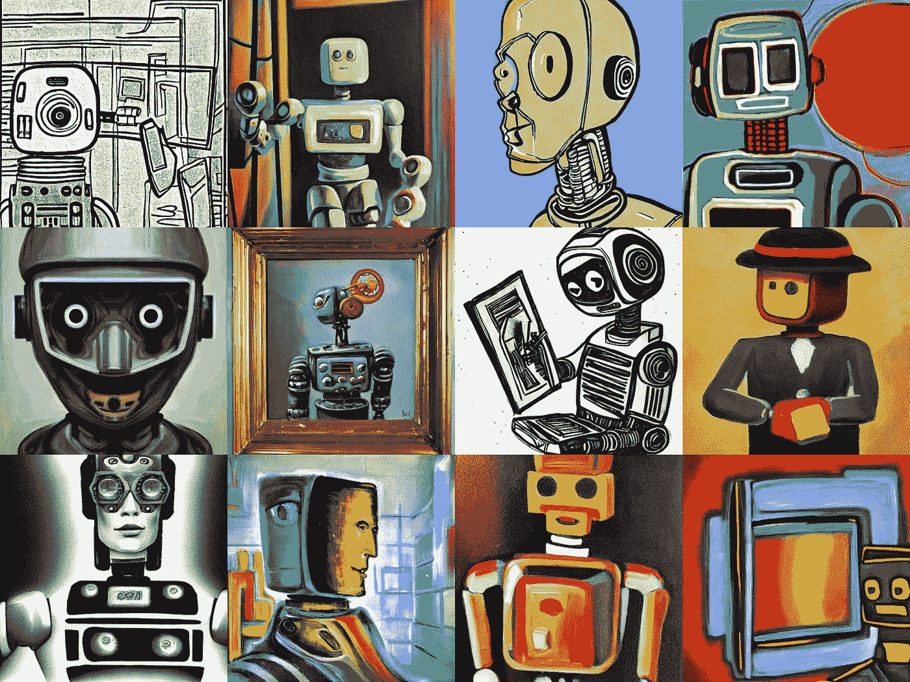
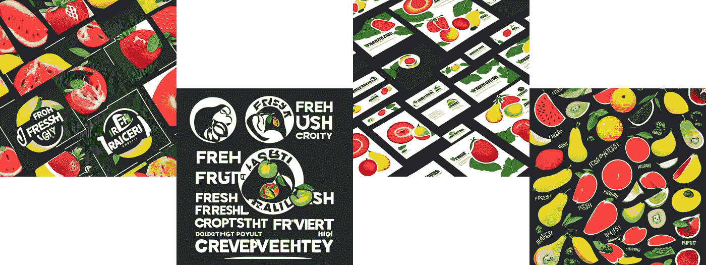
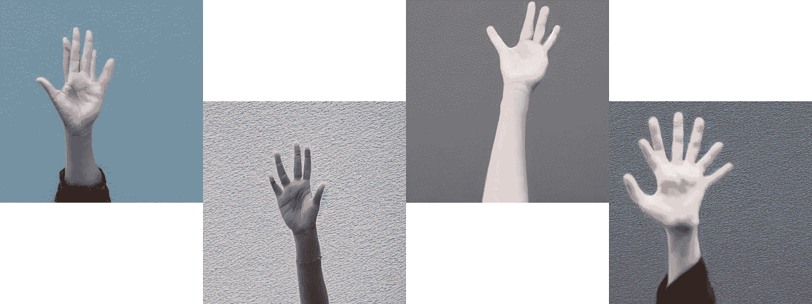

# 人工智能可以创作出获奖的艺术作品，但它仍然无法与人类的创造力相抗衡

> 原文：<https://towardsdatascience.com/ai-can-produce-prize-winning-art-but-it-still-cant-compete-with-human-creativity-4adbd54cc328>

机器人的各种艺术品，由 AI 绘制。作者创建的图像(使用稳定扩散)。

人们认为创造力是人类与生俱来的。然而，人工智能(AI)已经达到了同样具有创造力的阶段。

最近的一场比赛引起了[艺术家](https://www.nytimes.com/2022/09/02/technology/ai-artificial-intelligence-artists.html)的愤怒，因为它向一个被称为 Midjourney 的人工智能模型创作的艺术品颁奖。这种软件现在可以免费获得，这要归功于一种叫做[稳定扩散](https://stability.ai/blog/stable-diffusion-public-release)的类似模型的发布，这是迄今为止同类软件中最有效的。

创意从业者联盟，如[阻止人工智能抢尽风头](https://www.equity.org.uk/getting-involved/campaigns/stop-ai-stealing-the-show/)一段时间以来一直在[提高对人工智能在创意领域使用的关注](https://www.uktech.news/ai/performance-artists-risk-ai-20220627)。但是人工智能真的能取代人类艺术家吗？

AI 艺人。阿斯坎尼奥/阿拉米股票照片。

这些新的人工智能模型可以产生无限的可能性。上面显示的每个机器人的图像都是独一无二的，但是都是由相似用户请求的稳定扩散产生的。

有两种方法可以使用这些人工智能艺术家:写一个简短的文本提示，或者在提示旁边提供一个图像，以提供更多的指导。从一个 14 个字的提示中，我能够为一家提供水果的虚构公司产生几个标志创意。不到 20 分钟。在我的中档笔记本电脑上。

一家新鲜水果公司的设计，快速交付，徽标，高对比度，聚乙烯——我用来获得稳定扩散的提示，以制作这些图像。

从上面的结果可以看出，稳定扩散很难创造出包含文字的艺术。有些水果有点臭。

然而，如果不使用人工智能或借助图形设计师的帮助，我根本不可能制作出任何类似的东西。我也不可能自己创造机器人图片。

这项技术的潜力并没有被忽视——负责稳定扩散的初创公司 Stability AI 的目标是 10 亿美元(9 亿美元)的投资评估。但是这些人工智能模型开始对现实世界产生影响，正如获奖的 midway 图片所示。事实上，艾真正擅长的是创作结合不同元素和风格的艺术作品。

然而，虽然人工智能可以为你做大部分的跑腿工作，使用这些模型[仍然需要技能](https://albertoromgar.medium.com/while-ai-artists-thrive-detractors-worry-but-both-miss-whats-coming-b6c5511f1f1f)。有时提示并不能生成您想要的图像。或者人工智能可以与其他工具一起使用，只是组成更大管道的一小部分。

制作艺术作品不同于制作数字设计。稳定扩散更擅长绘制[风景](https://lexica.art/?q=landscape)而非[徽标](https://lexica.art/?q=logo)。

# 为什么稳定扩散会改变游戏规则

人工智能模型通常被训练使用包含惊人的 58.5 亿张图像的数据集来创建艺术[。需要这些大量的数据，这样人工智能才能学习图像内容和艺术概念。这需要很长时间来处理。](https://laion.ai/blog/laion-5b/)

对于稳定的扩散，花费了 [150，000 小时](https://huggingface.co/CompVis/stable-diffusion-v1-4)(刚刚超过 17 年)的处理器时间。然而，通过在大型计算集群(充当单个设备的强大计算机的集合)上进行[并行训练，这可以减少到不到一个月的实时时间。](https://openai.com/blog/techniques-for-training-large-neural-networks/)

Stability AI 还提供了一个名为 [DreamStudio](https://beta.dreamstudio.ai/) 的在线工具，可以让你以每张图片 0.01 美元的价格使用它的 AI 模型。相比较而言，要用竞争对手 OpenAI 的美术模型， [DALL E 2](https://openai.com/dall-e-2/) ，成本是的十几倍[。](https://openai.com/blog/dall-e-now-available-in-beta/)

这两种方法使用相同的基本方法，称为[扩散模型](https://huggingface.co/blog/annotated-diffusion)计算机程序，它通过查看大量现有图像来学习创建新图像。然而，稳定扩散具有较低的计算成本，这意味着它需要较少的训练时间，并且使用较少的能量。

另外，你实际上不能自己下载和运行 OpenAI 的模型，只能通过一个网站与之交互。同时，稳定扩散是一个开源项目，任何人都可以玩。因此，它享受着在线编码社区快速开发的好处，例如模型的改进、用户指南、与其他工具的集成。这已经在 2022 年 8 月《稳定扩散》发布后的几周内发生了。

# 艺术的未来？

人工智能艺术模型仍然很难正确地绘制手。作者使用稳定扩散创建的图像。

虽然在过去的五年里已经取得了巨大的进步，但人工智能艺术模型仍然有一些问题需要解决。他们作品中的文字是可以辨认的，但经常是胡言乱语。同样，AI 也在努力渲染人手。

还有一个明显的限制，即这些模型只能制作数字艺术。它们不能像人们一样使用油画或蜡笔。就像[黑胶唱片已经卷土重来](https://www.themanual.com/culture/why-vinyl-is-coming-back/)一样，技术最初可能会创造一种新形式，但随着时间的推移，人们似乎总是会回到最初的形式，即[最高质量的](http://eprints.nottingham.ac.uk/49583/)。

最终，正如之前的研究发现的那样，人工智能模型在目前的形式下更有可能成为艺术家的新工具，而不是创造性人类的数字替代品。例如，人工智能可以生成一系列图像作为起点，然后可以从人类艺术家中选择并改进这些图像。

这结合了人工智能艺术模型的优势(快速迭代和创建图像)和人类艺术家的优势(对艺术作品的愿景和克服人工智能模型的问题)。当需要特定的输出时，在委托艺术的情况下尤其如此。人工智能本身不太可能产生你所需要的东西。

然而，创意人员仍然面临着危险。选择不使用 AI 的数字艺术家可能会落后，无法跟上 AI 增强艺术家的快速迭代和更低成本。

*原载于 2022 年 9 月 30 日*[*【https://theconversation.com】*](https://theconversation.com/ai-can-produce-prize-winning-art-but-it-still-cant-compete-with-human-creativity-190279)*。*