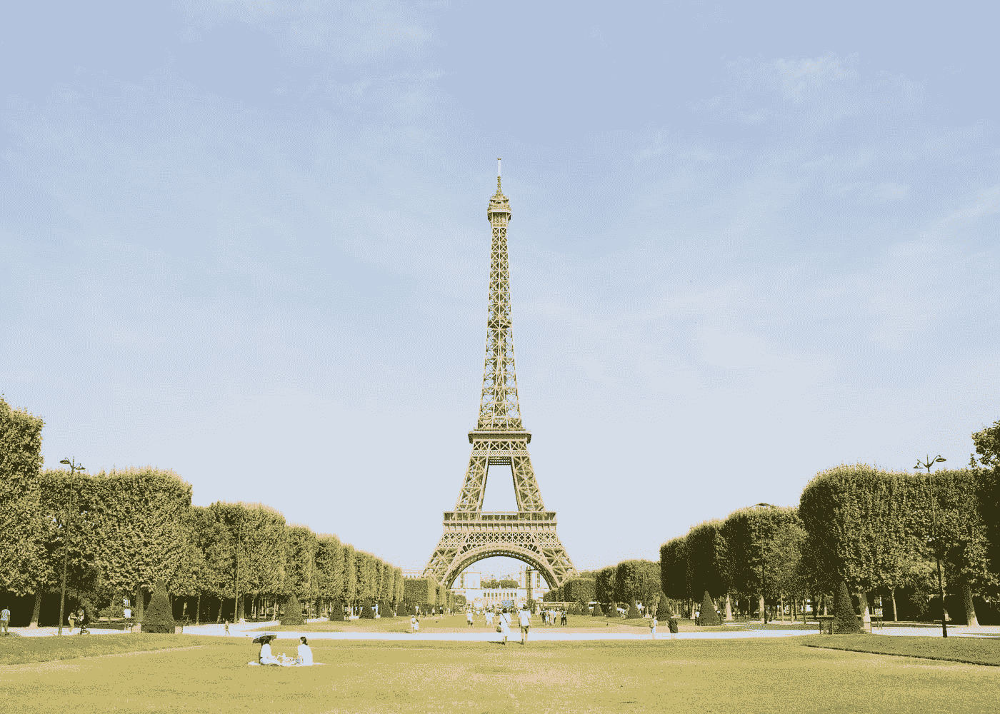
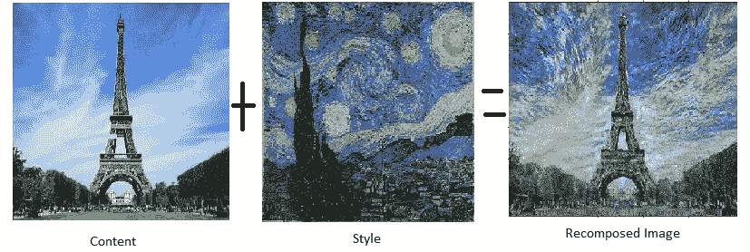
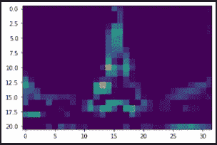
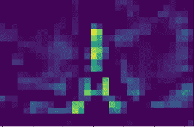
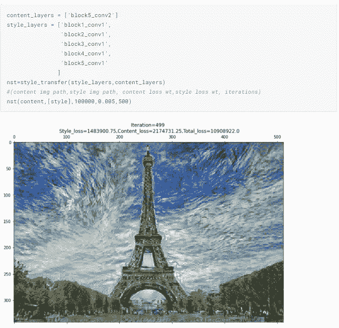
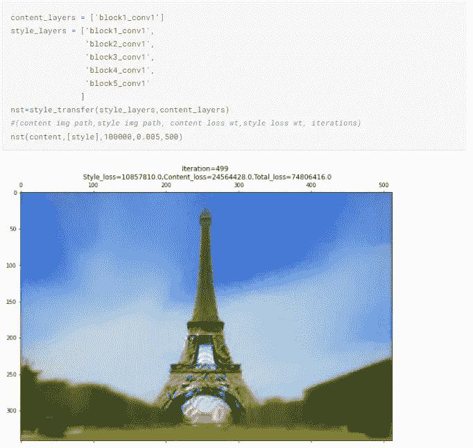
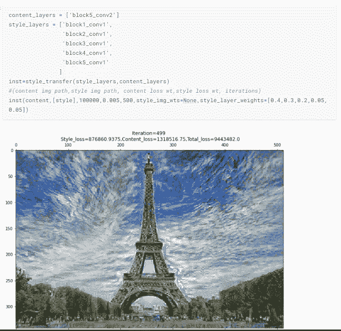
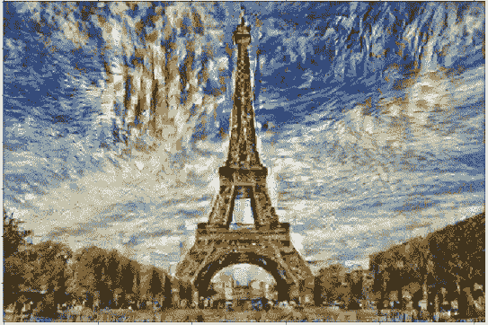

# 绘画的人工智能:揭示神经风格的转移

> 原文：<https://towardsdatascience.com/ai-for-painting-unraveling-neural-style-transfer-5ac08a20a580>

## 背景

在一个 NFT 数百万美元出售的世界，下一个有利可图的业务可能是创建独特的虚拟实体，以及谁比人工智能更适合这项工作。事实上，早在 NFT 大肆宣传之前，2018 年 10 月，第一幅人工智能生成的画像以 432，500 美元的价格售出。从那以后，人们利用他们对先进算法的深刻了解来制作令人惊叹的艺术品。例如，Refik Anadol 是一位使用人工智能创作迷人画作的艺术家。(在此[环节](https://refikanadol.com/)恳请大家查看他的一些作品)。另一位数字艺术家 [Petros Vrellis](http://artof01.com/vrellis/works/starry_night.html) 在 2012 年制作了梵高著名作品《星夜》的互动动画，三个月内点击量超过 150 万次。然而，人工智能的创作能力并不仅限于艺术作品。人们正在建造智能系统，可以写诗、歌曲、故事情节，也可能做其他创造性的工作。我们是否正在走向一个所有艺术家都将与人工智能竞争的世界？然而，也许这不是我想要讨论的。我这篇文章的目的是深入研究一种优雅的算法， ***神经风格转移*** ，这可能有助于像我这样糟糕的画家成为艺术大师。

## 1.神经类型转移——想法

任何图像都可以分为两个组成部分，内容和风格。内容是指不同对象的错综复杂，而风格是总的主题。您也可以将这两者解释为图像的局部和全局实体。例如，在下图中，埃菲尔铁塔的详细设计是内容，而背景色调——蓝天和绿色的环境——构成了风格(主题)。

照片由 [Kirsten 在](https://unsplash.com/@k_drew?utm_source=medium&utm_medium=referral) [Unsplash](https://unsplash.com?utm_source=medium&utm_medium=referral) 上绘制

神经风格转移(NST)的思想是获取一幅图像，并将其内容重组为其他图像的风格。与上面的情况不同，从更吸引人的图片(如梵高著名的《星夜》画)中转移主题(风格)可以导致令人着迷的重组。

下面详细讨论一下上面的改造。

## 2.风格转移的 CNN

既然我们处理的是图像，那么卷积神经网络是风格转换的关键就不足为奇了。还有，因为大量的 CNN 已经在图像处理任务中取得了令人难以置信的成绩，所以我们不需要为 NST 单独训练一个。我会使用 vgg-19 网络(风格转移的转移学习)，但你可以使用任何其他预训练的网络或训练自己的网络。

Vgg-19 网络具有以下架构:

首先，我们来看看上面的一些层李尔都认识什么。每层至少有 64 个过滤器来学习图像特征。为简单起见，我们将使用前十个过滤器的输出来查看这些层学到了什么。如果您想要代码，您可以使用以下链接之一。

  

[https://github . com/shashank 14k/my work/blob/main/neuralstyletransfer-experiments . ipynb](https://github.com/shashank14k/MyWork/blob/main/neuralstyletransfer-experiments.ipynb)

conv 第一街区

conv 第二街区 1 号

conv 第三街区 1 号

conv 第四街区 1 号

conv 第五街区 1 号

conv 第五街区 2 号

你从上面的情节中得到什么？初始层似乎确定了图像的整体背景(全局属性)。这些图层似乎可以识别全局的边缘和颜色，因此它们的输出与原始图像非常接近。这类似于用黄油纸描摹照片。您可能无法再现照片中不同物体的错综复杂，但是，您可以获得准确的整体表现。

然后，随着图像在网络中传输，输出会失真。这些层中的滤波器输出，尤其是 block_5_conv_2，集中于特定位置，并提取关于不同对象的形状的信息。例如，下面的两个过滤器对埃菲尔铁塔的细节感兴趣。在分类问题上，也许这些局部特征会帮助 CNN 将埃菲尔铁塔与其他轮廓相似的建筑(如电塔)区分开来。

块 _5_conv_2 的输出(滤波器 4)

块 _5_conv_2 的输出(滤波器 13)

使用 CNN 的图像的全局和局部成分的这种可分性是驱动风格转移的原因。艺术风格的神经算法的作者，关于神经风格转移的原始论文(Gatys 等人)报告说，由于较深的层在识别细节特征方面表现良好，因此它们被用于捕捉图像内容。类似地，初始层，能够伪造一个好的图像轮廓，被用来捕捉图像风格(主题/全局属性)。

## 3.图像重组

我们的目标是创建一个新的图像，从一个图像中捕捉内容，从另一个图像中捕捉风格。首先，让我们解决内容部分。

## 3.1 内容信息

我们在上一节中已经确定，更深层的输出有助于识别图像内容。我们现在需要一种机制来捕获内容。为此，我们使用一些熟悉的数学——损失函数和反向传播。

噪声图像(在 Python 中生成)

考虑上面的噪声图像(X)。此外，为了简单起见，假设我们选择的用于风格转换的 CNN 仅包括两层，A1 和 A2。通过网络传递目标图像(Y)并使用 A2 的输出 A2(A1(Y))，我们获得关于其内容的信息。为了学习/捕捉这些信息，我们让 X 通过同一个网络。由于 X 由随机排列的像素值组成，A2(A1(X))也是随机的。然后，我们将内容损失函数定义为:

这里，(I，j)是图像数组中位置的索引符号。(目标内容图像和噪声图像的大小必须相等)。本质上，如果得到的数组 A2(A1(X))和 A2(A1(Y))的形状是(m，n)，损失函数计算它们在每个位置的差，对它们求平方，然后对它们求和。这样，我们强制 X 成为一个图像，当它通过网络时，产生与 y 相同的内容信息。然后，我们可以像在任何神经网络中通常做的那样，使用反向传播来最小化内容损失。然而，有一个微小的区别。在这种情况下，变量是图像数组 X 的值，而不是网络权重。因此，最后的等式是:

我们可以将这个想法扩展到任何规模的网络，并选择任何合适的层来收集内容信息。

## 3.2 风格信息

捕捉风格比捕捉内容更复杂。它需要理解 gram 矩阵。

## 3.2.1 克矩阵

如果你参考 vgg-19 的架构(第 2 节)，你会看到 block_1_conv_1 的输出是(m，n，64)的形状。为了简单起见，假设 m，n = 3，2，并且滤波器的数量也是 2 而不是 64。

两个滤波器的输出

如你所知，CNN 过滤器学习识别不同的属性——像边缘/线条、颜色强度等空间特征。假设上面的滤镜可以识别不同位置的红色和蓝色阴影。因此，滤波器 1 输出中每个索引的像素值(范围 0-1)代表该位置红色的强度。滤光器 2 给出了关于蓝色的相同信息。现在，堆叠两个输出数组，并取结果数组与其转置的点积。我们得到了什么？

最终结果是由两个过滤器识别的属性的相关矩阵。如果您检查两个过滤器的输出，您会注意到红色强度高的位置蓝色味道较少。因此，点积矩阵的非对角线值(红色和蓝色之间的相关性)较小。如果我们现在改变像素值，使红色和蓝色一起出现，非对角线值将增加。

因此，在 CNN 的上下文中，gram 矩阵是由层的所有过滤器识别的所有特征的相关矩阵。让我们看看他们如何帮助风格转移。

## 3.2.2 风格和综合损失

[斯蒂夫·约翰森](https://unsplash.com/@steve_j?utm_source=medium&utm_medium=referral)在 [Unsplash](https://unsplash.com?utm_source=medium&utm_medium=referral) 上拍照

假设我们希望从上面的图像中转移样式。注意浅蓝色(倾向于白色)的多条条纹(垂直和水平线条)的存在。识别线条和浅蓝色的两个过滤器的 Gram 矩阵将返回这些特征之间的高度相关性。因此，该算法将确保这些特征一起出现在重组的图像中，并很好地完成风格的转换。实际上，每个 CNN 层都有许多过滤器，这导致了庞大的 gram 矩阵，但这个想法仍然有效。例如，vgg-19 中的 block_1_conv_1 的输出的 Gram 矩阵将是 64 个特征的相关矩阵。

接下来，我们需要建立风格损失的函数。假设，在通过块 _1_conv_1 传递目标风格图像时，我们得到一个 gram 矩阵 g。我们通过同一层输入我们的噪声图像 X，并计算它的 gram 矩阵(P)。风格损失的计算公式如下:

这里，(I，j)是 gram 矩阵中位置的索引符号。通过最小化该函数，我们确保 X 与我们的目标风格图像具有相同的特征相关性。

另一件要注意的事情是，不同于从单个层计算的内容损失，样式损失是从多个层计算的。 [Gatys et](https://arxiv.org/pdf/1508.06576.pdf) al 为此使用了五层。因此，最终的风格损失是:

w 是分配给每层损失的重量。这是一个超参数，可以调整来观察重组是如何变化的。我们将在最后一节讨论改变这些权重和使用单一图层进行样式转换的结果。

组合损失函数是样式和内容损失的总和。同样，每个单独的功能都有一个权重。样式的权重越大，将确保重组后的图像捕捉到更多的样式，反之亦然。

## 4.改变超参数

最后，在讨论了理论之后，让我们用不同的超参数来实验神经类型转移。代码可以参考上面提供的笔记本链接。作为参考，使用参数调用样式传递函数:

1.  内容图像的路径
2.  样式图像的路径列表
3.  含量损失重量
4.  风格损失重量
5.  迭代次数(反向传播)
6.  样式图像的权重列表—如果您想要从多个图像中传递样式，您需要为每个目标样式图像提供权重
7.  样式图层的权重列表-分配给样式损失函数中涉及的每个图层的权重

我们将使用以下图像进行实验:

**4.1 5 个损失权重相等的风格层，1 个内容层**

我们将使用这个图像来比较改变超参数的结果。

**4.2 将风格损失函数的权重从 0.005 增加到 0.1**

正如所料，增加权重会促使算法捕捉更多的风格。因此，重组具有更好的蓝色和黄色的组合。

**4.3 对样式使用单层**

仅使用 block_1_conv_1 进行样式丢失不会导致令人着迷的重组。也许，由于 syle 由各种阴影和空间属性组成，所以来自多个层的过滤器是必要的。

**4.4 对内容损失使用不同的图层**

将 block1_conv1 用于内容信息会强制网络从目标内容图像中捕获全局特征。这可能会干扰样式图像的全局特征，我们最终会得到一个令人震惊的样式转换。我认为，结果证明了为什么鼓励在 NST 中使用更深的层。它们只关注内容图像中突出对象的局部细节，能够平滑地复制样式图像的主题。

**4.5 手动为样式层分配权重[0.4，0.3，0.2，0.05，0.05]**

虽然 4.1 和目前的重组没有明显的区别，但在我看来，后者有一个整体的浅色阴影。这可能是由于分配给 block1_conv_1 的权重较高，根据 4.3，block 1 _ _ 1 从《星夜图》生成白色调。

**4.6** **手动给样式层分配权重【0.05，0.05，0.2，0.3，0.4】**

与 4.5 相比，它具有更引人注目的颜色组合。将较高的权重分配给较深的层会提供更吸引人的结果。来自这些层的 Gram 矩阵可能正在计算《星夜》中更主要的全球特征之间的相关性。

**4.7 使用多幅图像进行风格转换**

最后，让我们从多幅图像中捕捉风格，进行更艺术化的重组。它需要在风格损失上稍作修改。每幅图像的风格损失与前面 3.2.2 中讨论的一样

然而，总的风格损失是:

本质上，正如我们到目前为止所做的那样，我们为每幅图像的风格损失分配权重，并将它们相加。

## 5.评论

就这样，我结束了这篇文章。我敦促您用提供的代码进行更多的实验。另外，我已经从头开始实现了这个算法，应该有一个更有效的过程。更好的优化器肯定会提高性能。我希望用神经网络创作艺术很有趣。将神经风格迁移与生成性对抗网络结合起来是一个诱人的命题，我希望将来能涉及到它。

参考资料:

艺术风格的神经算法

[https://arxiv.org/abs/1508.06576](https://arxiv.org/abs/1508.06576)

笔记本链接:

1.卡格尔:

  

2.开源代码库

[https://github . com/shashank 14k/my work/blob/main/neuralstyletransfer-experiments . ipynb](https://github.com/shashank14k/MyWork/blob/main/neuralstyletransfer-experiments.ipynb)