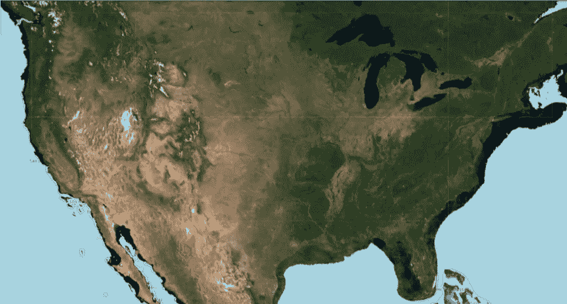
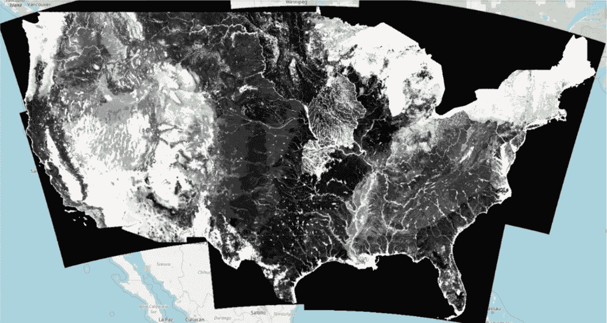
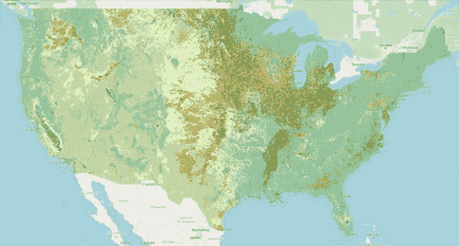
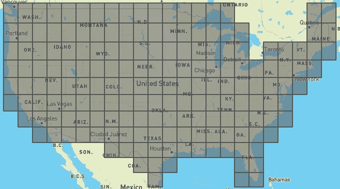
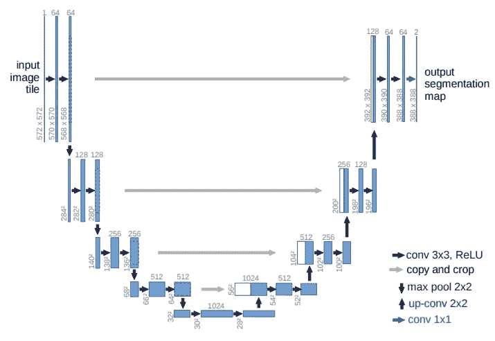
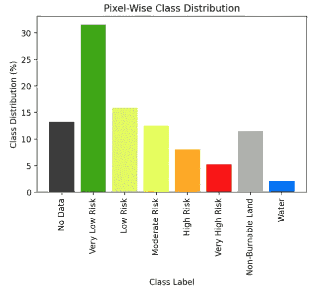
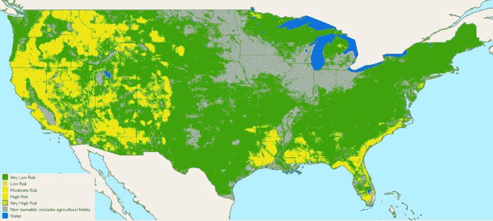
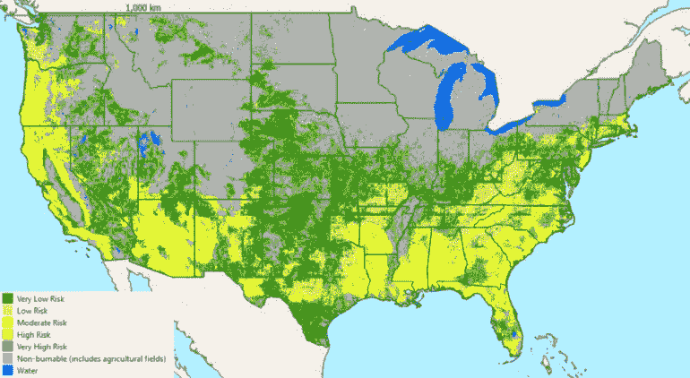

# 人工智能地理空间野火风险预测

> 原文：<https://towardsdatascience.com/ai-geospatial-wildfire-risk-prediction-8c6b1d415eb4>

# 人工智能地理空间野火风险预测

## 使用地理空间栅格数据评估美国邻近地区野火危害的预测模型

迈克·纽伯瑞在 [Unsplash](https://unsplash.com?utm_source=medium&utm_medium=referral) 上的照片

野火是意外的火灾事件，既有自然发生的，也有人类活动造成的。在美国，它们每年造成数十亿美元的损失[1]，2020 年，仅在美国，它们就烧毁了超过 1000 万英亩的土地[2]。大部分费用来自预防工作。例如，加利福尼亚州最近批准了超过 15 亿美元的野火预防预算[3]。决定将这笔支出分配到哪里需要了解哪些区域处于高风险，因此在本文中，我提出了一个使用深度学习图像处理和地理空间数据集提供最新火灾风险地图的框架。

本文的第一部分介绍了遥感领域的一些背景知识，以及在这个项目中广泛用于创建数据集的工具 **Google Earth Engine** 。如果你已经熟悉这些主题，或者只是想跳到该项目，请随意向下滚动到**人工智能地理空间野火风险预测**，其中涵盖了**准备数据集**和训练**深度学习模型**。

*该项目是作为库珀联盟研究生水平课程 ECE-471:遥感和地球观测中的机器学习主题的一部分进行的。*

# 遥感和地球观测

对于门外汉来说，**遥感**是一门从远处获取信息的科学，通常使用飞机或卫星。通常，它被认为是在卫星观测地球的背景下；一个常见的例子是谷歌地球上的卫星视图。

传感器本身的范围从被动传感器到主动传感器，被动传感器像照相机一样检测自然光，无论是发射的还是反射的，主动传感器发射自己的能量并观察反射，如雷达或激光雷达。光的不同成像频率被称为**光谱带**。卫星环绕地球运行，拍摄沿途的大片土地，如下图所示。由于这种模式，需要一定的时间来对整个地球进行成像。

美国宇航局的地球资源卫星极地轨道成像条带每 16 天重访一次每个点。从美国宇航局在 https://www.youtube.com/watch?v=yPF2jpjB3Qw[的](https://www.youtube.com/watch?v=yPF2jpjB3Qw)取回

地球上同一点的连续图像之间经过的时间被称为**重访率**。通常，在重访率(时间分辨率)和**空间分辨率**之间有一个权衡，空间分辨率是指地面上像素的大小。例如，受欢迎的 MODIS 卫星大约有 2 天的重访率，分辨率为 250 到 1000 米，具体取决于光谱带[4]。相比之下，Landsat-8 在可见光波段的分辨率为 30 米，但重访率约为 16 天[5]。

# 谷歌地球引擎

Google Earth Engine (GEE)是一个强大的界面，可以让你从地球上的任何地方访问超过三十年的卫星图像和其他地理空间数据。我强烈推荐你[探索他们的数据集](https://developers.google.com/earth-engine/datasets/)。

在下面的代码中，我展示了获取一些数据并将其绘制在交互式地图上是多么容易。首先，你必须用 GEE 注册一个开发者账户[。确保你已经安装了 *geemap* 和*ee*(Google Colab 预装了 *ee* ，但 *geemap* 没有)，并验证你的帐户。找到你感兴趣的数据集的代码，GEE 调用这些图像集合。对于这个演示，我使用“MODIS/006/MCD43A4”选择了 MODIS。该集合包含公共目录中的每一幅图像-覆盖整个地球的多年数据-因此在检索任何图像之前，您需要应用一些过滤器。](http://signup.earthengine.google.com)

在遥感和地球观测中，使用**合成图像**是很常见的，也就是说，当你将多幅图像组合起来创建一幅新的图像。例如，如果在某一天，一朵云碰巧遮住了你的图像的一部分，那么在多天的时间跨度内取一个中间值合成将会给你一个干净无云的图像。均值和中值合成是其他常见的例子，但你可以发挥创造力。例如，如果你正在制作一个洪水地图，你可以尝试一个“最湿像素”合成，使用一个巧妙的波段组合来指示水的存在。

在像 Colab 这样的 Jupyter 环境中运行上面的代码，将会弹出一个交互式地图，如下图所示。只需几行代码，我们就可以获得整个地球的卫星图像！这是 2020 年 6 月美国本土(CONUS)的中值合成图。请注意，这个特定的图像集合没有显示开阔的海洋，边缘的浅蓝色只是背景中的默认地图。

美国毗邻地区的 MODIS 影像，2020 年 6 月[4]。作者可视化。

GEE 还允许您以通用格式(包括 geotiff)导出这些图像。您可以指定分辨率、投影和感兴趣区域，感兴趣区域可以使用 geojson 等格式进行定义。这对于创建为机器学习(ML)而格式化的数据集来说很方便。

最后，不提到 GDAL [6]就很难谈论地理空间数据集的处理，但是这个工具非常强大，可以非常快速地变得非常复杂！与其在这里深入探讨，我会把你链接到罗伯特·西蒙【7】的一篇优秀的 [3 部分教程。](https://medium.com/planet-stories/a-gentle-introduction-to-gdal-part-1-a3253eb96082)

# 人工智能地理空间野火风险预测

该项目的目标是使用 GEE 上可用的大量地理空间数据集来创建一个地图，对美国各地的野火风险和危险级别进行评级。将此视为像素分类问题，有两大步骤需要讨论。首先是数据集的**准备，包括:输入地理空间数据的选择，训练标签的注释，以及使用 GIS 软件为 ML 准备数据。其次是训练一个**深度神经网络**来执行逐像素分类，也称为语义分割。最后，我们可以可视化结果并讨论模型的性能。**

# I)准备数据集

## 输入:GEE 数据集

输入数据集由来自 GEE 目录的各种地理空间数据组成。这项任务的第一个也可能是最直接的图像收集是 **MODIS** (如上所示)【4】，它的七个光学波段以 500 米的分辨率提供了美国的每日覆盖范围。之所以选择它，是因为它的重访率高，允许每周重新生成野火灾害预测工具。

第二个目录是从爱达荷大学的网格地面气象数据集[9]中得到的气象数据的集合。这些数据每天都有，分辨率为 4000 米，包含最高地表温度、最低湿度、标准化降水指数(SPI)和蒸发需求干旱指数(EDDI)等信息。

美国邻近地区的 GRIDMET 最高地表温度[9]。作者可视化。

我们考虑的第三个目录是**着陆火灾**平均火灾重现间隔(MFRI) [10]。该地图由美国农业部森林服务局和美国内政部地质调查局汇编而成，使用历史趋势根据野火之间的平均年数对每 30 米像素进行分类。这些值以分类数据的形式呈现，以 5 年为间隔进行分类。虽然这张地图只出版过一次，但数据的性质使它在几年后仍然具有相关性。这里的问题当然是这一层的输入数据不会随着时间的推移而改变，但它仍然可以帮助模型了解地区趋势。换句话说，它对于提高空间精度非常有用，但对于时间精度却没有用。这种权衡将在第三部分详细讨论。

美国邻近地区的平均火灾重现间隔[10]。如这张地图所示，越暗的地方火灾越频繁。这张地图没有提到火灾的严重程度。作者可视化。

输入数据集考虑的第四个也是最后一个集合是美国农业部国家**农业统计服务农田数据**图层[11]。这是一个 30 米分辨率的土地覆盖分类图，将每个像素分为一百多个类别，对应于不同的作物和各种非耕地类型。由于我们测量野火风险的方式，该数据集将被证明是有用的，这种方式将农田视为“不可燃”，与常年积雪/冰和裸露地面属于同一类别。这可能导致一些土地难以分类，因为它可能*看起来*可燃，但我们的数据集不会这样认为。为了抵消这一点，我们手动创建了一个二进制掩码，将每个像素分类为培养或非培养。*(最后我们注意到，如果没有这个附加层，模型实际上表现得一样好，如果不是更好的话)*

全国农业统计服务耕地数据图层[11]。尽管我们对耕地和非耕地实施了二进制图层，但此地图显示了所有可用的类别。作者可视化。

## 输出:野火潜在危险

有一堆数据来预测火灾是很好的，但是我们如何去了解*什么*实际上与火灾风险相关？我们需要一些量化火灾危险的参考地图。显然，我们不能使用燃烧过的地方的图像，因为那不能告诉我们很多关于火灾前的情况。我们考虑找到燃烧的区域，绘制出它们的边界，并考虑火灾前几周是高火灾危险的例子。虽然这种方法可能会有很好的结果，但手动搜索火灾并编写一种方法来恢复火灾前的图像将是乏味的，并且可能会将我们限制在像加利福尼亚这样的热点地区。此外，火灾的严重程度没有细微差别。

在搜索另一个火灾危险数据集时，我们发现了这个，美国农业部森林服务局的**野火潜在危险** (WHP) 地图[12]。

2020 年野火潜在危险图“描述了抑制资源难以控制的野火的相对潜在危险”[12]。美国农业部森林服务局提供的图片

WHP 地图是一个栅格地理空间数据集，旨在“帮助评估野火危害或确定大型景观中燃料管理需求的优先级”目标不仅仅是量化野火发生的可能性，还要考虑到野火的强度、破坏性和难以控制的程度。

> “用较高的 WHP 值绘制的区域表示在有利的天气条件下，燃料有较高的概率经历燃烧、隆起和其他形式的极端火灾行为。”[12]

该地图作为地理空间数据集发布了三年:2014 年、2018 年和 2020 年。它可以是分类值，有 5 个火灾危险级别(非常低、低、中、高和非常高)和 3 个其他类别(不可燃、水和已开发)，也可以是连续的整数值。虽然该数据集不作为 GEE 目录的一部分，但它是公共领域的，我们可以从美国农业部研究数据档案馆下载。

## 处理:为 ML 准备数据

我们现在有几个输入数据集，可以很容易地结合起来用于训练和运行模型，以及一个输出数据集，可以作为监督学习算法的标签。太好了！但是仍然缺少一个关键的步骤，数据根本不是 ML 格式的。尤其是对于为图像处理设计的算法。

我们要做的第一件事是按月份过滤所有栅格数据集，并确保它们在相同的坐标参考系统(CRS)中以相同的分辨率正确排列。使用 GDAL 和 *gdalwarp* 命令，这变得相当简单。我们选择了常见的 [EPSG:4326](https://epsg.io/4326) 作为我们的 CRS(用于 GPS)，500 米作为我们的分辨率。(*技术说明:对分类栅格数据集进行重采样时，请确保使用“近似”、“模式”或类似的重采样算法来保留输入值，而不是“双线性”、“立方”等…* )

第二步是将整个圆锥切割成可以由深度学习模型处理的更小的图像，并将特征图像与其标签配对。为了使模型工作，所有输入图像必须具有完全相同的大小，当在投影系统的怪圈中工作时，这比听起来更难——有数百万种方法可以展平球体，但没有一种真的那么好！我们使用在线工具 G [eoJSON Grid Creator](https://cityofaustin.github.io/geojson-grid/) 生成一个完美平铺美国的网格，然后手动删除美国边界以外的任何方块。我们的目标是每个区块大约 256 公里宽，或者 512 个像素，每个像素 500 米。下图中的最终网格包含 177 个图块。

全网格覆盖整个美国。瓷砖约为 256x256km 公里。图片作者。

准备好格网后，我们现在可以遍历数据集中的每个切片，并将该区域导出为堆叠了每个要素图层的 geotiff，以及带有 WHP 地图标注的配对 geotiff。我们使用三个夏季月份(美国大部分地区火灾季节的高峰期)、六月、七月和八月的中值合成数据进行了这项研究，这三年是 WHP 地图可用的三年中的每一年，即 2014 年、2018 年和 2020 年。最终数据集包含整个美国 9 倍以上的 13 层地理空间数据的图像。

# ii)深度学习模型

## 目标是什么？

在我们进入模型之前，我想快速谈谈我们的目标。我们最初的目标是拥有一种算法，可以每周生成美国本土的野火风险地图。我们很早就知道，为“风险区域”标记数据的发现会很困难。不仅在美国以任何分辨率标注每个像素的过程都很困难，而且构成火灾的因素也是微妙而复杂的，我们对这一主题的了解还不足以自己做出判断。找到 WHP 地图为我们解决了这个问题，但是从人工智能的角度来看，它有自己的问题。其中最大的问题是它每隔几年产生一次，并且不对应于任何特定的时间点。如果我们每周甚至每月都生成一张新地图，我们实际上是在拓展 WHP 地图的预期用途。

本质上，我们通过假设 WHP 地图最符合美国夏季火灾高峰期的观察结果来执行时间插值，并希望模型能够了解足够多的地理上*不同的位置*以将这些细微差别应用于*不同的时间*。换句话说，我们希望它从空间差异中学习时间差异*。如果我们试图预测不同季节的火灾危险，这将导致推断时的领域差距。ML 中的**域差距**是指用于训练的数据与用于推断的数据不相似。虽然我们知道这将使模型变得不完美，但我们仍然希望看到它的表现，也许可以为未来的尝试学习一些东西。*

## 一种用于语义分割的神经网络

根据 2 个以上的类别标记图像中的每个像素的任务被称为**多类别语义分割**。[o . ronne Berger，P. Fischer，T. Brox 在 2015 年](https://arxiv.org/pdf/1505.04597.pdf)推出的 **U-Net** 是完成这项任务的优秀神经网络模型【13】。虽然最初用于显微镜图像中细胞的二进制分割，但是已经表明其可以很好地推广到其他分割任务，包括遥感数据的多类分割。架构如下图所示。

原始论文中提出的 U-Net 架构。Ronneberger 等人的图表。

在此示例中，输入图像为 572x572。它们穿过卷积层，增加了信道的数量。然后，使用最大池操作将它们缩小 2 倍，通过另一组卷积层。这又进行了 3 次，之后“图像”或特征图被向上传递，使用向上卷积来反转最大池操作。来自收缩路径的图像被附加到扩展路径中的相应图像，以帮助保留原始输入的形状和内容。

我们使用 Tensorflow 和 Keras 的模型实现略有不同，以支持多个输入通道、不同的图像尺寸和输出端的多个类。完整的模型可以使用函数初始化，如下所示。

## 我们的调整

为了支持我们图像的尺寸，我们必须做另一组重要的改变。因为图像必须相互附加，收缩和扩展路径的尺寸必须完全匹配。要做到这一点，图像尺寸必须在每次收缩前被 2 整除。我们的图像是 513x565，显然不能被 2 整除，更不用说 16 了。使用 GDAL 将 geotiffs 读入 numpy 数组，然后我们将图像填充到 576x528 的维度，这是下一个可用的 16 的倍数。

我们还实现了一个加权损失函数，以防止模型完全忽略不太常见的类别，如非常高的风险或水。这是通过增加错误分类的代价来实现的，而错误分类的代价与一个类的流行度成反比。类别分布如下图所示，注意填充是如何添加空白像素的，覆盖了图像的 12.6%。

填充和标记图像中类的像素分布。图片作者。

通过这些重要的调整，我们能够使用 80%的数据集来训练我们的模型，将剩余的 20%用于验证和测试。我们选择的批量大小为 16，因为我们的 GPU 没有足够的内存容纳 32。我们的模型在 20 个时期后收敛，训练和验证数据的准确率为 65%。

## 可视化输出

为了观察我们模型的输出，我们必须将它们转换回具有适当坐标的地理 IFF。为此，我们保存每个图块的目标图像的元数据，并使用它在神经网络的输出端导出数组。然后，我们可以使用 [GQIS](https://qgis.org/en/site/) 来重新组合图块，并在地图上显示它们以及一些附加元素，如国家和州边界，以及图例[14]。使用这种方法和我们的模型，我们现在终于可以重现多年来没有的 WHP 地图了！

2019 年 7 月预测的野火潜在危险地图。图片作者。

通过观察夏季几个月的一些输出，我们注意到我们的模型在预测最高风险水平时非常害羞。将这张地图与 WHP 的原始地图相比，我们注意到少了很多红色，尤其是美国最西部的部分。然而，该模型乐观地认为这些地区中的大多数都具有高风险。同样，该模型经常忽略*低风险*类别，而是选择*非常低风险*。这些问题可以通过调整损失函数来解决，以进一步惩罚这些代表性不足的类别的错误分类。

该模型在识别水和不可燃区域方面几乎没有困难，包括中西部和密西西比河沿岸的耕地。

因此，该模型在呈现未经训练的夏季图像时表现相当好，但如果我们试图预测冬季的野火危险，会发生什么呢？为了测试这一点，我们运行了 2020 年 1 月的预测。这是结果。

2019 年 1 月预测的野火潜在危险地图。图片作者。

太棒了。这表明该模型不仅仅是记忆和再现 WHP 地图。有证据表明，该模型学会了概括其训练域之外的月份。例如，该国被雪覆盖的部分现在显示为不可燃，这是有道理的，因为常年冰雪(在训练数据中非常罕见)在原始 WHP 地图中被认为是不可燃的。另一个好的结果是，西部的许多高风险和非常高风险地区被降级为中度风险甚至更低。

虽然该模型确实显示了学习从地理差异中归纳时间差异的证据，但仍然存在一些明显的问题。例如，南方大部分地区现在被认为比夏天时风险更高。一些研究确实表明，像佐治亚州和卡罗莱纳州这样的州比像加利福尼亚这样的州更有可能在冬末或春天遭遇火灾，但这个模型似乎仍然高估了风险。由于南方没有经历太多的降雪，光秃秃的树木和干燥的冬季条件(在训练中看不到)可能是造成这种情况的原因。

另一对只在冬季预测中明显的问题是更嘈杂的输出和网格状伪像。在整个国家最北部的不可燃烧区域，似乎有一些非自然高预测的斑点，包括许多*非常高风险*的单像素。网格状伪像，在俄克拉荷马州、密苏里州和阿肯色州周围最明显，似乎是由平铺造成的，尽管它们不会在夏季预测中出现，因此可能有一种方法来纠正它们。

# iii)我们学到了什么？

鉴于这个项目令人生畏的性质，我们只有短短的几周时间来完成它，我们对结果感到兴奋。学习使用地理空间数据是令人大开眼界的，使用它来准备一个带标签的机器学习数据集绝非易事。在这个项目中，我们学到了大量关于使用地理空间栅格数据和为 ML 预处理数据的知识。

当我们开始这个项目时，据我们所知，还没有人发表过自动预测全国范围内野火风险的模型。虽然这个模型远非完美，但它可以作为概念的证明。它展示了在深度神经网络中通过像 GEE 这样的 API 使用地理空间数据来执行像美国这样大规模任务的可能性。

地理空间数据丰富，易于访问，为数据饥渴的深度学习模型提供了完美的框架。我强烈鼓励每个人去探索可能性！然而，获得好的标签可能相当困难。量化火灾风险或危险仍然是这项特殊任务的最大问题。WHP 地图是这个项目的一个很好的起点，但是在一些专家的帮助下，甚至一些人工标注，结果会有很大的改善。我期待着在时间允许的情况下再次访问这个项目。

我希望你喜欢这本书！如果你对这个项目和我忽略的许多实施细节有任何问题，请留下评论或直接通过*thjaquenoud@gmail.com 联系我。*我要感谢我在这个项目上的合作者 Kevin Kerliu 和 Brandon Bunt，以及我们的 Krishna Karra 教授，他向我们展示了栅格数据、地理信息系统以及 GDAL、GQIS 和 GEE 等工具的诀窍。

## 来源:

[1] [国家统计局](https://www.nifc.gov/fire-information/statistics) (2021)，国家机构间消防中心
【2】t . Feo 和 S. Evans，[加州野火的成本](https://ccst.us/reports/the-costs-of-wildfire-in-california/) (2020)，加州科学委员会&技术
【3】a . Beam，[加州批准干旱、野火预防的新支出](https://apnews.com/article/business-health-fires-climate-california-eec48e6279099449851b3c7f150cda33) (2021)，美联社新闻
【4】ORNL·DAAC， [MODIS 和 VIIRS 土地产品全球子集化和可视化工具【1】](https://daac.ornl.gov/cgi-bin/dsviewer.pl?ds_id=1379) [分析 LANDSAT 软件包](https://landsat.gsfc.nasa.gov/) (2011 年)中的遥感数据，统计软件杂志
【6】n . gore lick、M. Hancher、M. Dixon、S. Ilyushchenko、D. Thau 和 R. Moore， [Google Earth Engine:行星尺度的地球空间分析，面向所有人](https://earthengine.google.com/)，环境遥感
【7】GDAL/OGR 贡献者， [GDAL/OGR 地理空间数据抽象软件库](https://gdal.org/)(2020 年) [为生态应用和建模开发网格地面气象数据](http://onlinelibrary.wiley.com/doi/10.1002/joc.3413/full) (2013)，《国际气候学杂志》
【10】LANDFIRE， [LANDFIRE:现有植被类型](https://landfire.gov/index.php) (2020)，美国农业部和美国内政部
【11】美国农业部国家农业统计局，[农田数据层](https://data.nal.usda.gov/dataset/cropscape-cropland-data-layer)(2020)
【12】g . k . Dillon 林务局
【13】o . Ronneberger、P. Fischer 和 T. Brox， [U-Net:生物医学图像分割的卷积网络](https://arxiv.org/pdf/1505.04597.pdf) (2015)，计算研究储存库
【14】GQIS.org， [QGIS 地理信息系统](https://qgis.org/en/site/index.html) (2022)，QGIS 协会