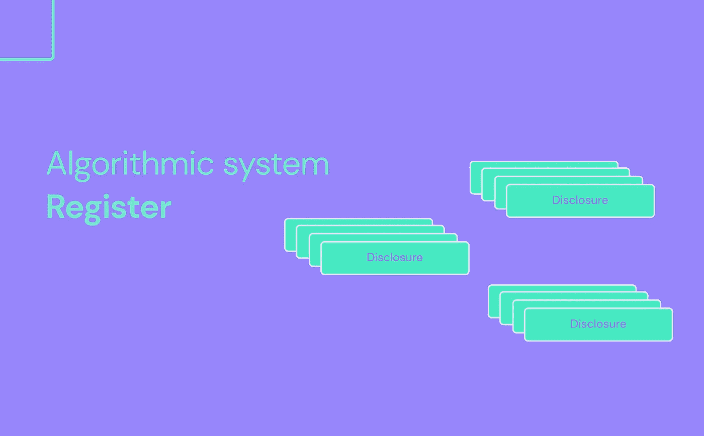
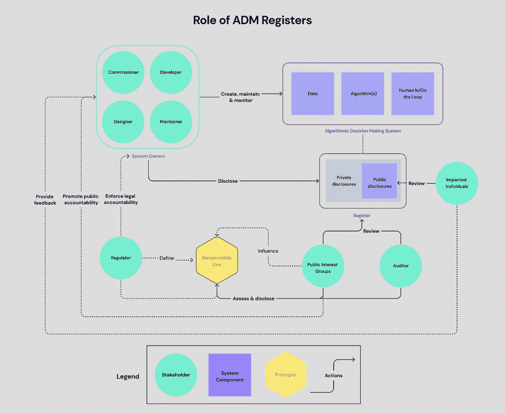
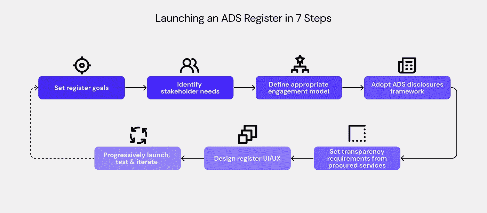
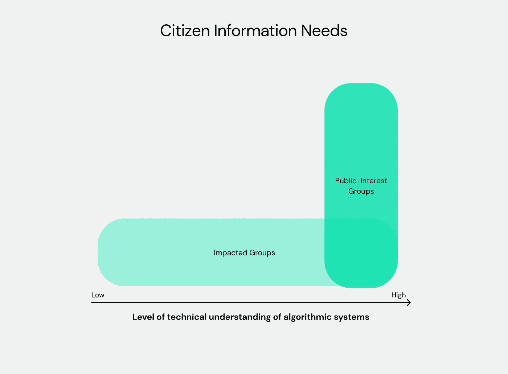
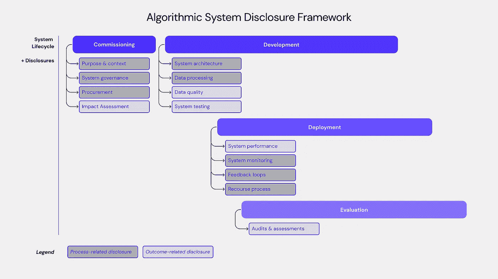
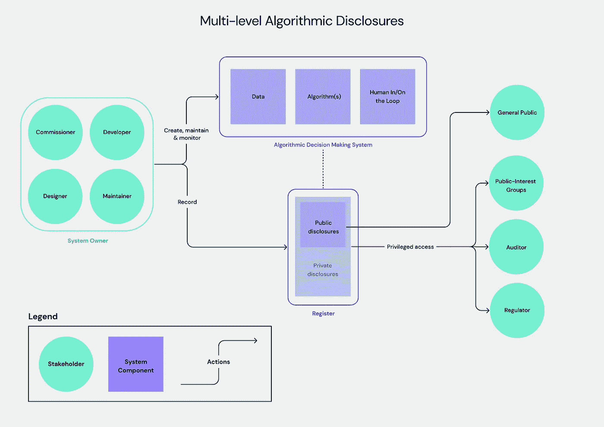
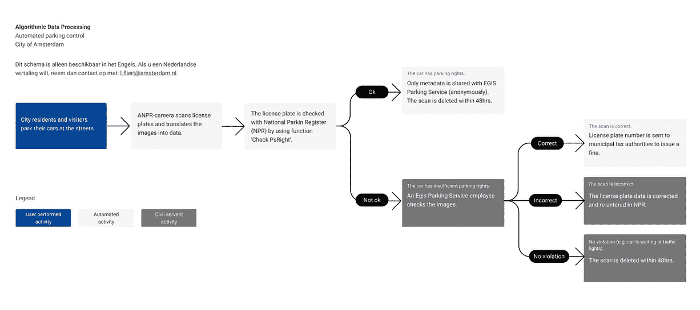
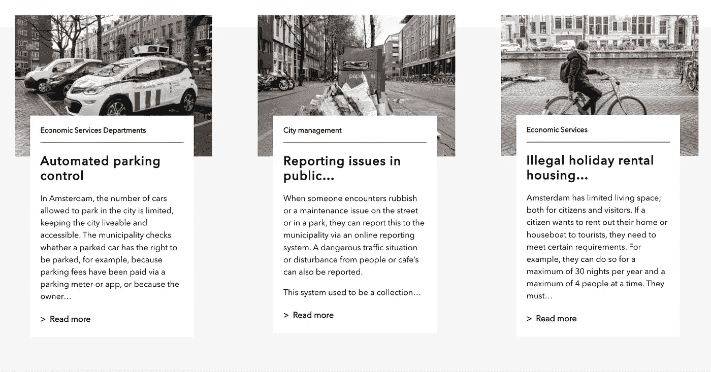

# 人工智能寄存器 101

> 原文：<https://towardsdatascience.com/ai-registers-101-7e2f58719781>

## 责任人工智能系列

## 设计和部署支持有意义的透明性的 ADS 寄存器的简短指南

来源:图片由作者提供

**术语重要提示:虽然经常被称为“AI”寄存器，但更合适的术语应该是“算法决策系统”(ADS)寄存器。**

# *什么是语域？它如何实现透明性？*

*登记册是信息的正式记录。在其最简单的形式中，它可以提供对正在使用的算法系统的可见性，这是最基本的透明形式。它还可以被设计成实现**有意义的透明度**以满足利益相关者的信息需求。我在本文中探索的是后一种用例。*

> ***有意义的透明**是人工智能伦理学中的一个重要概念。这意味着以最适合他们理解的方式交付与每个利益相关者群体相关的信息。在“高风险”系统中，这一点尤其重要，这些系统可能直接或间接影响个人可能获得的利益、惩罚或机会，在这种情况下，有意义的透明度是实现代理和问责的关键。*

*正如我在上一篇文章中所讨论的，算法政策和监管在很大程度上是滞后的。目前没有要求组织披露正在使用的算法系统。挑战这一现状的第一个重大进展是[欧盟人工智能法案(2021)](https://www.europarl.europa.eu/RegData/etudes/BRIE/2021/698792/EPRS_BRI(2021)698792_EN.pdf) 草案，该草案将授权组织创建和维护人工智能系统和风险缓解措施的清单。如果实施，这些强制披露可能不会为受影响的群体实现有意义的透明度，因为它们的范围有限，但它们标志着向提供基本可见性迈出了有益的一步。*

*尽管缺乏监管，许多地方政府，如阿姆斯特丹、T2、昂蒂布、T4、赫尔辛基、南特、纽约，已经采取措施创建他们自己的算法注册。这些第一代登记册在复杂程度和完整性方面各不相同。它们通常也达不到实现有意义的透明度的“理想”,但仍然代表了向广告透明度迈出的良好一步。*

> ***从第一代算法寄存器中我们可以学到很多东西**。基于从业者访谈的一个有趣的发现是，注册可以帮助激励广告所有者改善他们的内部治理和控制。它还可以促成公民驱动的问责机制，鉴于当前的监管环境，这一点至关重要。*

**

*算法寄存器在使[负责任地使用算法决策系统](https://medium.com/@mayamurad/back-to-basics-revisiting-the-responsible-ai-framework-847fd3ec860b)中的潜在作用。来源:图片由作者提供。*

# ***如何设计和部署算法寄存器以实现有意义的透明性？***

**

*来源:作者图片*

*虽然登记册本身似乎是一个简单的工具，但启动登记册的大部分繁重工作都与维护和共享 ADS 披露所需的治理和流程有关。*

*本指南介绍了建立 ADS 注册的关键步骤，希望这一透明工具能够得到更广泛的应用。*

## *第一步:就注册目标达成一致*

*从组织层面对成功的共同理解开始。这将是你衡量性能的标准，并在每次迭代中改进你的寄存器。*

*一些激励目标包括:*

*   *在标准报告框架下跟踪计划、部署和停用的广告；*
*   *满足公民信息需求，为受影响的群体提供代理；*
*   *围绕 ADS 实施创建强有力的治理；*
*   *能够符合现有的(或未来的)法规。*

## *步骤 2:识别和理解利益相关者的需求*

*下一步是确定所有相关的内部和外部利益相关者，并了解他们与您的组织拥有的算法决策系统集相关的信息需求。*

*内部利益相关者包括负责算法决策系统的调试、开发、部署、使用和维护的团队。他们也可以包括高层领导和其他广告团队。*

*外部利益相关者可以包括监管和监督机构(如果授权)、公共利益团体(倡导者、记者、研究人员)，以及直接或间接受算法决策系统影响的个人。*

*进行用户调查研究是发现复杂信息需求和测试与利益相关者沟通方式的一种有价值的方式。*

*例如，受算法决策系统影响的个人可能对算法和计算过程有不同程度的理解。有些人可能对这些主题一点都不精通，有些人可能有一些介绍性的概念，还有一些人可能很好奇，想亲自查看一下代码。作为受影响的个人，他们可能主要关心的是了解自己的结果并有机会进行补救。*

**

*来源:作者图片*

*另一方面，公共利益团体由通常在评估算法系统及其影响方面拥有技术专长的个人组成。他们注册的主要目的是获得验证负责任地使用算法系统所需的信息。*

*[这项关于英国公民信息需求的研究](https://assets.publishing.service.gov.uk/government/uploads/system/uploads/attachment_data/file/995014/Complete_transparency__complete_simplicity_-_Accessible.pdf)为开展类似的用户研究提供了有益的参考。这项研究的一个有趣发现是，公民通常不关心算法透明度信息，除非他们个人碰巧对某个算法系统有问题。他们还希望透明度信息能够公之于众，不管他们个人对此有何兴趣，以此作为一种手段，使公共利益团体能够代表他们审查信息，并提出任何潜在的关切。*

## *步骤 3:定义合适的参与模型*

*一旦确定了所有相关的利益相关者，您就必须定义适当的模型，以便在您的组织所使用的算法决策系统上与每个利益相关者合作。*

*在内部，应该有明确的角色和责任分配，以及正式的交接，并审查委托、设计、开发、维护和使用系统的不同团队之间的接触点。*

*在外部，根据法规，可能需要获得政府机构的批准或咨询。受影响的个人和公共利益团体也应该定期参与。在本文中，我将深入探讨这些公民参与模式。*

*在设计这种参与模型时，采用基于生命周期的方法非常重要，因为算法系统可以在部署后定期更新。对欧盟人工智能法案的主要批评之一是，它将广告提供商视为推出一次性产品的制造商，这些产品可以在发布时进行一次评估，这严重忽视了算法系统在部署后的发展程度。*

***关于算法系统最重要的决定通常是在系统开发前做出的**。在这个阶段进行的参与接触点和评估对于保证算法系统的负责任的开发和使用是至关重要的。*

*下面是一个高风险算法系统参与模式的示例，该系统需要监管机构的批准，并与民间社会充分合作，以最大限度地降低伤害风险。*

**

*高风险算法决策系统的内部和外部利益相关者之间基于生命周期的参与模型(说明性的)。来源:作者图片*

## *步骤 4:创建并采用 ADS 披露框架*

*在算法系统生命周期的每一步，都有关于适当的**过程**和系统正在实现的**结果**的重要信息需要捕捉。*

**

*广告生命周期的过程和结果相关披露的高级框架。来源:作者图片*

*每个披露都应该有一个指定的所有者，并应由其他利益相关者审查，以验证共享的信息。*

*以下是系统生命周期中建议披露的详细视图，包括披露所有人和建议接触点。*

*广告生命周期披露。来源:作者创作。*

*在利益相关者访谈和用户研究(步骤 2)中发现的见解应该有助于为每次披露提供沟通指南。*

*每个披露都应该以最能让关键利益相关者理解和代理的方式来编写和说明。*

**

*多层次算法披露。来源:作者图片*

*最完整的披露应记录在内部登记簿中。这些信息的子集可以公开共享，以最好地满足公民的信息需求。监管者、审计师和潜在公共利益团体应该通过数据共享协议获得相关私人信息的特权。*

*这就是我们所说的**多层次披露。***

*系统所有者可能不愿意将他们视为“商业秘密”的源代码和其他元素公开。还有人担心，分享一个系统如何工作的微小细节可能会导致系统游戏。多级披露允许系统所有者与通过**特权访问渠道**提供的关键信息(如源代码)共享与每个利益相关者需求最相关的信息，利益相关者可在该渠道评估该信息并共享其评估结果(但不包括源代码)。*

****

*左图:阿姆斯特丹市政当局推出的自动停车控制系统的 ADS 流程图(面向非技术用户)，[来源](https://algoritmeregister.amsterdam.nl/en/automated-parking-control/)；右图:Youtube 推荐引擎的广告架构模式(面向技术用户)，[来源](https://www.kdnuggets.com/2019/10/youtube-recommending-next-video.html)*

*让我们考虑与算法决策系统的架构相关的披露——这可以帮助相关的利益相关者了解系统如何工作。例如，受到因不当行为而被罚款的自动停车系统影响的个人想知道该系统如何工作，而不必了解驱动广告的技术栈。他们感兴趣的是了解 ADS 是如何做出罚款决定的，该过程的哪些部分是由人审查的，以及质疑潜在错误决定的过程是什么。其他利益相关者可能希望从技术角度了解系统如何工作。这意味着理解所使用的处理步骤和方法，并且有可能访问代码和测试数据。*

> *需要不同的信息集合，以使每个相关的利益攸关方获得有意义的透明度。登记册应该能够收集所有这些信息，并向每个利益攸关方披露适当的信息子集。*

*回到我们的自动停车系统的例子。公共登记簿应包括一个易于理解的流程图，解释系统如何做出罚款(或不罚款)的决定，并清楚地概述该过程的哪些部分由人类执行或监控。审计员和公共利益团体可以请求访问代码和详细的技术架构文档来执行评估。这就是多层次披露在实践中的样子。*

## *步骤 5:设置采购服务的透明度要求*

*当您没有子系统的完全所有权时，交付透明性会变得复杂。事实上，算法系统的所有者采购第三方服务(如内置模型、开箱即用模型或专用企业解决方案的数据和 AI 平台)是非常常见的。*

*大多数公共部门实体都有具体的采购指南，一些国家甚至在采购数据和人工智能相关服务时制定了具体的指南(例如[英国](https://assets.publishing.service.gov.uk/government/uploads/system/uploads/attachment_data/file/990469/Guidelines_for_AI_procurement.pdf))。我们开始看到公共部门从他们的第三方提供商那里制定具体的算法透明度要求。例如，[市要求其供应商遵守“程序透明](https://medium.com/r?url=https%3A%2F%2Fwww.amsterdam.nl%2Finnovatie%2Fdigitalisering-technologie%2Falgoritmen-ai%2Fcontractual-terms-for-algorithms%2F)”(即建立适当的安全流程所需的信息)，并在需要时向审计员提供“技术透明”(即源代码)。*

*私人组织应该利用他们的购买力来选择能够遵守透明度要求的供应商，并共同努力实现这些要求。在设计支持您注册的合作模式时，还应考虑第三方提供商。*

## *第六步:设计注册用户界面/UX*

> *设计在实现有意义的透明以满足不同利益相关者的需求方面起着至关重要的作用。*

*各种各样的利益攸关方应该能够以最有利于他们理解和代理的**方式方便地访问登记册并找到他们需要的信息。***

*登记册的设计应遵循以人为中心的迭代方法，与核心利益攸关方接触，并将他们的反馈纳入设计流程。*

*这里的一些关键交付成果包括:*

*   *为每个利益相关者角色定义用户旅程；*
*   *定义关键用户交互；*
*   *设计寄存器接口，说明披露架构、用户旅程和关键交互。*

*这里考虑边缘情况很重要。例如，低风险广告和高风险广告的用户体验有何不同？这将如何影响登记册的设计？*

**

*摘自阿姆斯特丹人工智能注册的[市政当局的登录页面。](https://algoritmeregister.amsterdam.nl/en/ai-register/)*

## *步骤 7:逐步推出和测试登记册上的算法系统*

*选择几个候选广告用于注册的测试版。理想情况下，这些广告应该处于生命周期的早期阶段(试运行阶段),以确保支持过程和治理能够捕获正确的信息。*

> *像对待产品一样对待你的收银机。从 MVP 开始，测试，根据设定的目标测量性能，并迭代。*

*在第一个系统上线后，收集相关内部和外部利益相关方的反馈，并根据注册目标跟踪进度。通常，需要几个迭代周期来获得正确的寄存器和支持它的过程。*

*一旦你有了一个稳定的广告加入机制，是时候向组织的其他成员宣传了，并把所有的广告都加入到注册中。*

## *走向更广泛的寄存器实现*

*大多数组织都有一些正在使用的内部广告日志，这些日志可能集中在一个地方，也可能不集中在一个地方。然而，组织很少公开共享这些信息(即使是其中的一部分)。*

*在本指南中，我试图阐述传播算法寄存器背后的动机，并提供实现它的指南。需要建立强有力的激励机制，以促进更广泛地采用登记册(可能通过监管)。我真的希望未来监管变化的前景和来自公民社会和公共利益团体的越来越大的压力将成为一个激励因素，促使组织在实现算法透明度时采取积极的方法。*

*在这方面，登记册是一个有用的工具；他们鼓励设置内部和外部治理，以确保负责任地使用和部署算法决策系统。*

## *更深入:实现算法透明的参与式方法*

*在下一篇文章中，我将探讨如何让公民参与负责任地使用算法决策。*

*  

*基于我的研究生论文“* [*超越黑盒*](https://dspace.mit.edu/handle/1721.1/139092)*”(MIT 2021)的一系列关于负责任的 AI 的一部分。提出的想法是基于几个在管理、部署和评估人工智能系统方面有直接经验的从业者的反馈和支持而发展起来的。我正在分享和开源我的发现，以使其他人能够轻松地研究并为这个领域做出贡献。**