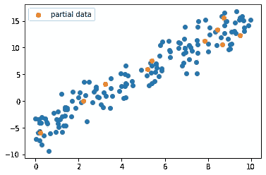
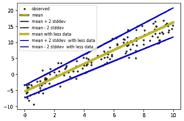
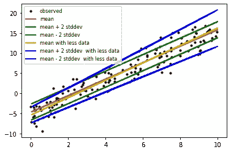

# 深度学习中的任意和认知不确定性

> 原文：<https://towardsdatascience.com/aleatoric-and-epistemic-uncertainty-in-deep-learning-77e5c51f9423>

## 它们之间的区别以及如何用张量流概率处理它们

来源:[像素](https://www.pexels.com/photo/casino-luck-game-deck-1679602/)

包括深度学习在内的机器学习与各个方面出现的不确定性密不可分。在这篇文章中，我们将讨论任意不确定性和认知不确定性之间的区别，这两种不确定性，特别是在深度学习的背景下。我们还将给出一个张量流概率的例子来形象化这两种类型的不确定性。请查看[笔记本](https://colab.research.google.com/drive/1f2KNIFRT1I7GDI6ZPGpBpyyjp6Kt7n6Z#scrollTo=NeOJ_hVcpA-7)了解更多代码详情。

# 任意与认知的不确定性

区分认知不确定性和随机不确定性的一种方法是检查是否可以通过更多的知识来减少不确定性。事实上,“认知的”一词来自希腊语“επιστήμη”,可以粗略地翻译为知识。

这两种不确定性来源的一个例子是判断一个人是否为 covid 阳性。更多的临床试验和医学实验将减少认知上的不确定性，导致对病毒更好的理解和更有说服力的诊断，而我们永远无法对我们的结论 100%确定，因为随机性质导致的随机不确定性。

在深度学习的背景下，我们更愿意将经典的神经网络视为一个概率模型:给定一个输入 x，网络的最后一层给出一个概率分布，要么是分类情况下的类集，要么是回归情况下的预测点。在这种情况下，认知不确定性通常被解释为神经网络参数的不确定性，如果我们有一个包含更多所需信息的数据集，这种不确定性可以减少。另一方面，随机不确定性出现在通过最大似然推断实现的概率预测本身中。

许多研究人员一直专注于量化机器学习环境中的两种不确定性。一种想法是测量总不确定性和随机不确定性，并将认知不确定性视为两者之间的差异[1]。

# TFP 模型化不确定性

在本节中，我们将使用[TensorFlow Probability](https://www.tensorflow.org/probability)(TFP)，这是一个基于 tensor flow 构建的 Python 库，它可以轻松地在现代硬件上结合概率模型和深度学习，以在简单的合成数据集上建模不确定性。我们将在这个例子中看到，我们可以减少认知的不确定性，但不能减少随机的不确定性。

下图显示了代码中使用的数据集。这里，橙色点仅代表全部数据的 10%。在下文中，我们将在“完整数据集”和“部分数据集”上训练相同的模型，以查看添加更多数据是否有助于减少不同类型的不确定性。

作者图片:TFP 模型中使用的数据

## 任意不确定性

我们用下面的代码来考虑任意的不确定性:

该模型仅包含两个层:一个传统的密集层，具有两个输出神经元，用作下面的分布λ层的平均值和标准偏差值。

我们在整个数据集和具有较少点的数据集(上图中的橙色点)上训练模型，并获得以下结果。我们可以立即注意到，在不同数据集上训练的模型产生了相似的结果，添加更多的数据不会减少任意的不确定性。

作者图片:任意的不确定性

## 认知不确定性

认知不确定性会发生什么？现在让我们看看下面的代码:

与我们之前所做的不同，这里的模型包含了一个稠密的变化层。这一层使用变分推理来拟合核矩阵和偏置项上的分布的后验概率，否则偏置项就像密集层一样使用。在机器学习中，变分推理是马尔可夫链蒙特卡罗(mcmc)的一种替代方法来逼近后验分布。

像以前一样，我们在整个数据集和具有较少点的数据集上训练模型。我们注意到，在下图中，当我们在更大的数据集上训练模型时，标准偏差更小。换句话说，这个例子表明更多的数据可以减少认知的不确定性。

作者图片:认知的不确定性

## 任意和认知的不确定性

对于那些感兴趣的人，我们可以把这两种不确定性放在一个单一的模型中，用下面的模型:

# 结论

在这篇文章中，我们讨论了任意不确定性和认知不确定性的区别，并用一个简单的例子说明了 TFP 的区别。然而，在结束这篇文章之前，我想说的最后一句话是，任意的和认知的不确定性不应该被视为绝对的概念。改变环境会改变不确定性的来源，有时我们很难区分。

# 参考

[1]t .德弗里斯和 g .泰勒(2018 年)。神经网络中非分布检测的学习置信度。