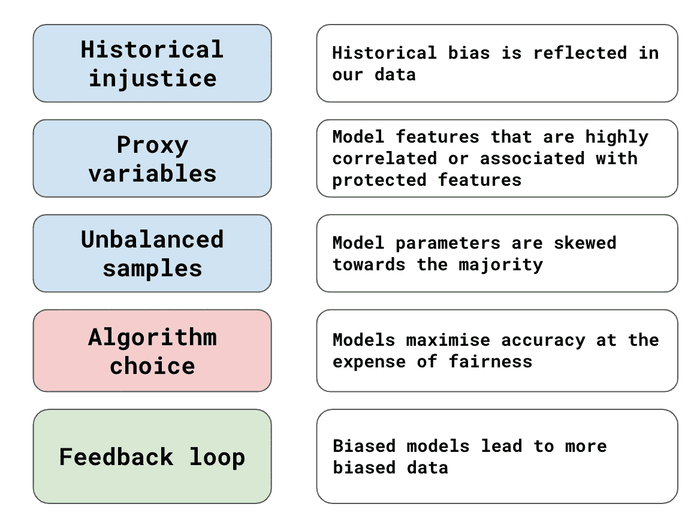
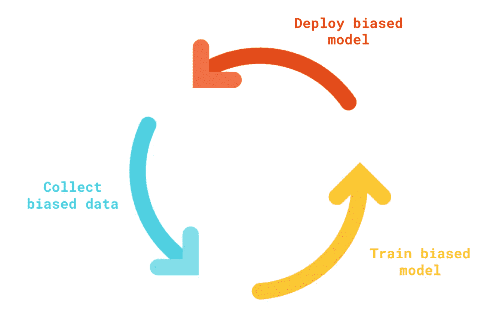

# 你的模型做出不公平预测的 5 个原因

> 原文：<https://towardsdatascience.com/algorithm-fairness-sources-of-bias-7082e5b78a2c>

## 常见偏差来源— **历史偏差**、**代理变量**、**不平衡数据集**、**算法选择**和**用户交互**

(来源: [flaticon](https://www.flaticon.com/premium-icon/woman_2817057?term=question&page=1&position=28&page=1&position=28&related_id=2817057&origin=search) )

从表面上看，机器学习看起来不偏不倚。算法没有种族、民族、性别或宗教等敏感特征的概念。所以他们不应该对某些群体做出有偏见的决定。然而，如果任其发展，他们就会这样做。为了纠正有偏见的决策，我们首先需要了解偏见来自哪里。

我们将讨论不公平决策的 5 个原因。其中三个原因涉及用于训练模型的数据。即**历史偏差**、**代理变量**和**不平衡数据集**。最后两个原因涉及**算法选择**和**用户如何与模型**互动。一路上，我们还讨论了这些如何与机器学习中更一般形式的偏差相关联。即测量偏差、表征偏差和聚合偏差。

# 偏见与公平

在我们深入研究之前，让我们澄清一些事情。偏见可能是一个令人困惑的术语。它在许多领域被用来指代一系列问题。在 ML 中，偏差是在模型开发过程中产生的任何系统误差。这些错误可能是不正确的假设或代码错误造成的。它们可以在数据收集、特征工程或培训过程中引入。甚至你部署模型的方式也会引入偏见。

例如，假设我们想要选择一个最终模型。为此，我们选择具有最高训练精度的模型。我们假设训练精度是未来模型性能的良好反映。不幸的是，这是一个不正确的假设。该模型可能过度适合于训练集。这种偏见可能会导致一些不正确的预测。

(来源: [flaticon](https://www.flaticon.com/premium-icon/data-processing_2980479) )

“公平”是指不因个人或群体的特点而对他们有任何偏见。对于“**偏见”有一个类似的通俗定义。偏见是对一个人或一群人的偏见。更糟糕的是，在算法公平领域，还有第三种偏见的定义。我们可以把**【偏差】**称为任何导致模型变得不公平的错误。在本文中，我们将在定义之间跳转。上下文应该清楚地表明使用的是哪一个。**

# 偏见的来源

基于以上，似乎所有的模型都是不公平的。机器学习的要点是根据群体的特征来区分群体。所以，定义我们所说的“特征”是很重要的。当分析公平时，我们指的是敏感的特征。这些因素包括种族、民族、原籍国、性别或宗教。在一个数据集中，这些特征被称为 ***保护变量*** 。

有许多原因可以解释为什么一个模型对这些群体中的一个不公平。在模型开发的任何时候都可能出错。然而，并不是所有的错误都会导致不公平的模式。某些错误/偏见更有可能导致不公平的模型。我们将在下一章讨论这些。

图 1:偏见来源概述(图片由作者提供)

# 原因一:历史不公

过去，某些群体受到歧视。这可以通过法律有意地发生，也可以通过无意识的偏见无意地发生。无论什么原因，这种历史偏见都可以反映在我们的数据中。模型的设计是为了适应数据。这意味着数据中的任何历史偏差都可以反映在模型本身中。

历史偏见可以以不同的方式表现出来。少数群体的数据更有可能丢失或记录不正确。目标变量可能反映不公平的决策。当目标变量基于人的主观决定时，这种情况更有可能发生。最近的一个例子来自亚马逊开发的用于帮助自动化招聘的模型。

来源: [flaticon](https://www.flaticon.com/free-icon/recruit_2910452)

亚马逊使用历史申请者的简历来训练他们的模型。目标变量基于接受或拒绝工作申请的决定。问题是，由于招聘人员的偏见，大多数成功的申请者都是男性。妇女被拒绝是因为她们的性别，而不是她们的资格。这种偏差最终会反映在目标变量中。该模型学会了将女性简历的特征与落选候选人联系起来。实际上，它甚至惩罚了“女人”这个词(例如**女子**足球队队长)。

## 测量偏差

数据中的历史偏倚与 ***测量偏倚*** 的概念有关。在机器学习中，我们需要定义特征或标签。这些作为其他更复杂或不可测量的结构的代理。首先，当一个代理是一个坏的结构替代品时，测量偏差就发生了。如果代理不是跨不同组统一创建的，也会发生这种情况。

对于招聘模式来说，历史决定就是标签。它是候选人能力的代表。问题是这些决定并不是一致做出的。男性和女性候选人受到不同的待遇。换句话说，代理在不同的组中是不一致的。在这种情况下，历史偏差导致了测量偏差。

# 原因 2:代理变量

我们上面提到过 ***被保护变量*** 。这些是代表种族或性别等敏感特征的模型特征。使用这些特征会导致不公平的模型。通常，正常特征可以与受保护特征相关或关联。我们称之为代理变量。使用代理变量的模型可以有效地使用受保护的变量来做出决策。

例如，在你生活的南非，你的种族是很有预见性的。这是由于该国的种族隔离历史。您可以在图 2 中看到我们的意思。开普敦市仍然因种族而分裂。这意味着在模型中使用某人的邮政编码可能会导致种族歧视。

图 2:按居民种族划分的开普敦地图(来源: [stats SA](https://www.statssa.gov.za/?p=7678)

理解代理变量时，关联和因果关系之间的区别很重要。假设我们正在构建一个模型来预测客户是否会拖欠贷款。一个理性的人会同意某人的种族不会导致他们的风险改变。事实上，甚至不是他们的位置改变了他们的风险。这是他们的经济地位。然而，模型只关心联想。不幸的是，在南非，种族、地理位置和经济地位都是相关联的。

# 原因 3:不平衡的样本

假设我们计算人口的平均结婚年龄。我们得到的值是 33。看一下图 3，我们可以看到这个值并不代表所有的子群体。宗教团体的平均年龄为 28 岁，要低得多。由于非宗教团体的规模，平均值有所偏差。换句话说，人口平均水平更接近非宗教群体。

图 3:人口平均值如何被扭曲的例子(图片由作者提供)

模型参数也会以类似的方式倾斜。模型试图捕捉整个训练群体的趋势。但是，在不同的子组中，模型特征可以有不同的趋势。所谓趋势，我们指的是特征和目标变量之间的关系。如果一个群体占人口的大多数，模型可以偏向于该群体内的趋势。因此，少数群体的模型性能可能会更差。

我们可以在图 4 中看到一个倾斜数据集的例子。ImageNet 是用于训练图像识别模型的大型数据集。在这里，我们可以将不同的国家视为亚组。像出租车、餐馆和婚礼这样的概念出现在数据集中。这些在不同的国家可能看起来非常不同。问题是大多数图片来自北美和欧洲。这导致来自中国(1%)和印度(2.1%)等国家的图像表现不佳。

图 ImageNet 数据集的地理多样性。al

## 表征偏差

这种偏差来源与代表性偏差有关。代表性偏差是指发展人群未能很好地推广到所有亚组。与 ImageNet 一样，如果对某些子群体关注不够，这种情况也会发生。一些数据集甚至可以反映出有意排斥少数民族的决定。在这种情况下，开发人群并不能很好地代表目标人群。

即使开发人群完美地代表了目标人群，代表性偏差仍然可能发生。根据定义，少数群体将占人口的较小比例。这意味着他们在发展人口中所占的比例也将减少。这可能会导致我们上面讨论的模型倾斜的问题。

# 原因四:算法选择

前三个偏差来源都与数据有关。我们对所用算法的选择也会导致公平性问题。首先，一些算法比其他算法更难解释。这使得识别偏差来源和纠正偏差变得更加困难。另一个主要因素是模型的目标。这就是模型被训练的目的。

(来源: [flaticon](https://www.flaticon.com/free-icon/fair_3260927) )

实际上，使用成本函数来训练模型。典型地，成本函数被设计成最大化某种精确度。这就是模型预测目标变量的精确程度。最大化准确性不一定会导致不公平的决定。然而，由于我们没有优先考虑公平，我们将更有可能以不公平的决定而告终。除非我们调整成本函数来考虑公平性，否则我们无法保证决策的公平性。

## 聚集偏差

成本函数还有另一个问题。也就是说，他们通常旨在最大化整个开发群体的准确性。如果群体由不同的子群体组成，这可能会导致问题。该模型在总体上表现良好，但对其中一个分组表现不佳。这类似于我们上面讨论的代表性偏差。只不过现在我们讨论的是模型而不是数据。

我们可以看到数据和算法选择中的偏差是如何结合起来产生不公平的决策的。数据集内的表示偏差会导致模型内的聚集偏差。类似地，算法可以使用一个代理变量来最大化准确性。它不在乎使用这些变量是否会导致不公平的决策。

# 原因 5:用户反馈循环

偏见的最后一个来源与我们如何与模型互动有关。一旦训练完成，模型将被部署。随着用户与模型的互动，我们将收集更多的数据来训练模型的未来版本。用户与模型交互的方式可能会引入偏差。模型中的现有偏差会导致新数据中的进一步偏差。

(来源: [flaticon](https://www.flaticon.com/free-icon/arrows_1635629) )

例如，假设我们开发了一个用于预测某人是否患有皮肤癌的模型。由于表征偏差，当人具有浅色皮肤时，模型表现得更好。可以理解，有色人种可能会避免使用我们的模型。因此，我们只会从针对浅色皮肤的诊断中收集数据。这将放大代表性偏差，并在未来导致更有偏差的模型。

因此，在部署模型之前，我们需要测量偏差，确定其来源并加以纠正。在这篇文章中，我们关注了偏见的来源。知道来源是关键。它将帮助您决定纠正它的最佳解决方案。未来的一篇文章将关注**测量偏差**，另一篇文章将关注**校正偏差。**

我希望这篇文章对你有帮助！你可以成为我的 [**推荐会员**](https://conorosullyds.medium.com/membership) **来支持我。你可以访问 Medium 上的所有文章，我可以得到你的部分费用。**

  

你可以在|[Twitter](https://twitter.com/conorosullyDS)|[YouTube](https://www.youtube.com/channel/UChsoWqJbEjBwrn00Zvghi4w)|[时事通讯](https://mailchi.mp/aa82a5ce1dc0/signup)上找到我——注册免费参加 [Python SHAP 课程](https://adataodyssey.com/courses/shap-with-python/)

## 图像来源

所有图片都是我自己的或从[www.flaticon.com](http://www.flaticon.com/)获得。在后者的情况下，我拥有他们的[保费计划](https://support.flaticon.com/hc/en-us/articles/202798201-What-are-Flaticon-Premium-licenses-)中定义的“完全许可”。

## 参考

Pessach，d .和 Shmueli，e .(2020)，*算法公平性*。[https://arxiv.org/abs/2001.09784](https://arxiv.org/abs/2001.09784)

Mehrabi，n .、Morstatter，f .、Saxena，n .、Lerman，k .和 Galstyan，A .，(2021)，*关于机器学习中的偏见和公平的调查*。[https://arxiv.org/abs/1908.09635](https://arxiv.org/abs/1908.09635)

Chouldechova，a .和 Roth，a .，(2018)，*机器学习中的公平前沿*[https://arxiv.org/abs/1810.08810](https://arxiv.org/abs/1810.08810)

Wickramasinghe，S. (2021)，*机器学习中的偏差&*[https://www.bmc.com/blogs/bias-variance-machine-learning](https://www.bmc.com/blogs/bias-variance-machine-learning)

Suresh，h .和 Guttag，j .(2021)，一个理解机器学习生命周期中伤害来源的框架[https://arxiv.org/abs/1901.10002](https://arxiv.org/abs/1901.10002)

《卫报》，*亚马逊抛弃了偏爱男性从事技术工作的人工智能招聘工具* (2018)，[https://www . the Guardian . com/technology/2018/oct/10/Amazon-hiring-AI-gender-bias-recruiting-engine](https://www.theguardian.com/technology/2018/oct/10/amazon-hiring-ai-gender-bias-recruiting-engine)