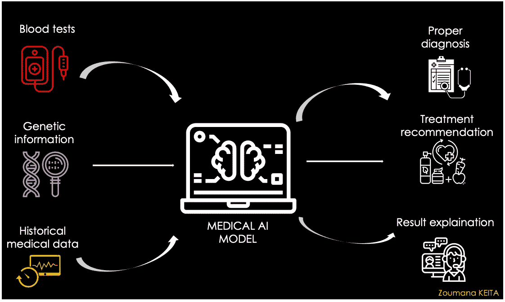

# 医疗保健中的算法偏差及其缓解策略

> 原文：<https://towardsdatascience.com/algorithmic-bias-in-healthcare-and-some-strategies-for-mitigating-it-835abe28df7>

## 当心你的人工智能系统中的偏见:有时这是生死攸关的事情

图片由[国立癌症研究所](https://unsplash.com/@nci)在 [Unsplash](https://unsplash.com/photos/701-FJcjLAQ) 上拍摄

# 介绍

不知道你怎么样，我第一次接触 AI 是在全是智能机器人的电影里。他们的行为让我相信，整个世界都会被那些愤怒的机器征服。

但是我的信念已经改变了，因为现在，我相信人工智能可以做得比试图毁灭世界更好。

> 人工智能可以改善医疗保健，拯救世界各地数百万人的生命。

# 但是什么是人工智能🤖？

人工智能有多种定义，大多数都集中在同一个意思上。以下是我对人工智能的三点定义。

*   这是教育算法使用大型复杂数据集像人类一样行动的过程。
*   它在训练过程中从数据中学习，以保持稳定，从而做出更好的决策。
*   这些模型一旦在非常大的患者数据上进行训练，就可以做出比真正的人类专家更准确的预测。

例如，在医疗保健领域，人工智能正被用于提供正确的诊断和治疗建议，所有这些都需要对结果进行清晰的解释。

人工智能在医疗保健中的图示(图片由作者提供)

[被称为深度学习教父的杰弗里·辛顿](https://en.wikipedia.org/wiki/Geoffrey_Hinton)在 2016 年发表的声明引起了放射科医生的注意:

> 人们现在应该停止培训放射科医生。很明显，在 5 年内，深度学习将会比放射科医生做得更好

然后，一年后， [CheXNet](https://arxiv.org/abs/1711.05225) 和来自斯坦福大学的 6 名放射科医生在接受了数千张图像(肺炎和非肺炎)的训练后，在最近的一次测试中进行了 50 次肺炎胸部 x 光检查。你猜怎么着:`ChexNet`赢了`81% accuracy`对`79% accuracy of the 6 Radiologists`。

ChexNet Vs. 6 放射科医生在胸部 x 线诊断(图片由作者提供)

出于训练目的，该模型被给予了数万张图像(肺炎和非肺炎)。

这是许多突出人工智能如何执行通常由医生执行的任务的项目之一。性能表明这些算法在诊断疾病方面变得更好了多少，甚至有时具有如上所示的更好的性能。

> 等等，你是在告诉我们人工智能是医疗保健中所有完美的顶峰吗？

# 不，人工智能不仅仅是医疗领域的荣耀

尽管有这些承诺，人工智能的使用并非没有法律风险。我们可以从这两个案例中说明人工智能是如何导致医疗保健领域对个人的歧视 ***。*** 你可以从[如何减轻医疗中的算法偏差](https://medcitynews.com/2020/08/how-to-mitigating-algorithmic-bias-in-healthcare/?rf=1)的新闻中了解这两个案例的更多细节。

你可能知道，种族偏见仍然是一个问题，但当它被传播到医疗保健领域时，情况会变得更糟，因为在这里，这是一个生死攸关的问题。

## 第一例→联合健康集团

Optum (UnitedHealth group)开发了一种商业算法，以确定哪些患者需要额外的医疗护理(医疗需求最大的患者)。

算法中的偏差使得需要额外护理的黑人患者数量减少了一半以上，并错误地得出结论，黑人患者比同样患病的白人患者更健康。

> 为什么会这样？

任何明显的种族信息(如肤色、邮政编码等。)实际上是在算法训练过程中使用的。但种族与其他因素相关，如历史医疗支出，以评估未来的医疗需求，这使得它反映了经济不平等，而不是病人的真正医疗需求。

根据[凯泽家族基金会](https://www.kff.org/) (KFF)…

*   家庭更有可能将年度预算的 1%用于医疗保健。
*   低收入住房的平均医疗支出是 235 美元，而私人保险是 2401 美元。

我们知道 Optum 正在通过连接和服务 150 个国家的整个卫生系统来推动卫生保健，我们已经可以想象这种偏见对人们生活的影响。

## 第二个案例→新冠肺炎的药物发现

在新冠肺炎期间，开发了一个人工智能系统来对病人进行分类，并加快新疫苗的发现。

人工智能系统能够以 70%至 80%的准确率预测哪些患者可能会患严重的肺部疾病。

这个人工智能系统的问题是，分诊过程仅仅基于患者的症状和先前存在的状况，这可能是有偏见的，因为基于种族和社会经济地位的差异。

# 减轻算法偏差的 5 种策略

这些年来，人工智能模型发展迅速。与此同时，我们也看到了许多失误。人工智能系统中的偏见最终导致了一个不公平的社会。

以下五个策略(不是一个详尽的列表)可以用来减轻这些偏见。

1.  ***收集和使用多样化的训练数据*** :算法中偏差的一个主要原因是使用了不代表真实世界人群的训练数据。为了缓解这种情况，收集和使用不同的训练数据是很重要的，这些数据准确地反映了将对其使用该算法的人群的人口统计、背景和特征。
2.  ***测试算法的偏差*** :在一个算法被训练之后，测试它的偏差是很重要的，以确保它做出公平和无偏见的决策。这可以通过多种方法来实现，包括进行偏见审计和使用公平指标来衡量算法的性能。
3.  ***使用算法公平技术*** :有几种算法公平技术可以用来减轻算法中的偏差，包括调整数据以减少偏差的预处理算法，在训练过程中进行调整的处理中算法，以及调整算法输出以使其更加公平的后处理算法。
4.  ***确保透明度和问责制*** :减少算法偏差的另一个重要步骤是确保算法透明和问责。这意味着对算法如何工作提供清晰的解释，定期审查和更新算法以消除任何可能引入的偏见，并为个人提供质疑算法所做决定的机制。
5.  *:最后，与多元化的利益相关者(包括可能受算法影响的个人和社区)进行互动非常重要，以便了解他们的观点，并将他们的反馈纳入算法的设计和实施中。这有助于确保算法是公平和公正的，并且它准确地反映了将要使用它的人群的需求和关注。*

# *这些最佳实践的局限性。*

*偏见以不同的形式存在，处理起来很有挑战性，并且可能发生在开发生命周期的不同阶段。*

*   *历史偏见:当收集来训练人工智能系统的数据不再反映当前现实时，就会出现这种情况。例如，尽管性别薪酬差距仍然是一个问题，但在过去这一问题更为严重。*
*   ***代表性偏差**:这种偏差的结果取决于如何定义训练数据以及如何从人群中取样。这种场景的一个例子是用于训练第一个面部识别系统的数据，这些数据主要依赖于白人面孔，这导致模型很难识别黑人面孔和其他深色皮肤的面孔。*
*   ***测量偏差**:当训练数据特征或测量与真实数据不同时出现。这是图像识别系统的常见问题，其中数据主要从一种类型的摄像机收集，而现实世界的数据来自多种类型的摄像机。*
*   ***编码/人类偏见**:这通常发生在科学家带着他们对研究的主观想法深入一个项目的时候。例如:*“非白人患者接受的心血管干预和肾脏移植较少”，以及“黑人妇女在被诊断患有乳腺癌后更有可能死亡”。* [*来源*](https://www.jointcommission.org/resources/news-and-multimedia/newsletters/newsletters/quick-safety/quick-safety-issue-23-implicit-bias-in-health-care/implicit-bias-in-health-care/#.Y4VE3uzMJTY)*

## *结论*

*对于任何数据项目，尤其是医疗保健项目，不要忘记人工智能中的潜在偏见，这一点很重要。*

*早期采用正确的系统，并在整个项目生命周期中保持它们，可以帮助快速识别主要问题，并以有效的方式对它们做出响应。*

*请记住，让我们非常小心，非常有意识地设计那些人工智能系统。*

*如果你喜欢阅读我的故事，并希望支持我的写作，考虑[成为一个媒体成员](https://zoumanakeita.medium.com/membership)。每月支付 5 美元，你就可以无限制地阅读媒体上的故事。*

*欢迎在[媒体](https://zoumanakeita.medium.com/)、[推特](https://twitter.com/zoumana_keita_)和 [YouTube](https://www.youtube.com/channel/UC9xKdy8cz6ZuJU5FTNtM_pQ) 上关注我，或者在 [LinkedIn](https://www.linkedin.com/in/zoumana-keita/) 上打招呼。讨论人工智能、人工智能、数据科学、自然语言处理和人工智能是一种乐趣！*

# *额外资源*

*健康算法中的种族偏见*

*[新冠肺炎和种族/民族差异](https://jamanetwork.com/journals/jama/fullarticle/2766098)*