# 对齐其他 Ode 上的平毛刺

> 原文：<https://towardsdatascience.com/aligning-flat-burrs-on-fellow-ode-2ab39a5264ea>

## 咖啡数据科学

## 咖啡研磨机带来更多乐趣

我借用了一个带有 SSP 多用途毛刺的同胞颂歌，它似乎没有表现出与我的利基不同。但是有人指出可能是对齐的原因，于是我对齐了毛刺(得到允许)。

我从来没有对齐毛刺，但过程是直截了当的。

作为参考，Ode 刻度盘上的每个数字设置之间有两个设置，所以我将这些设置称为 0.3 和 0.6。所以在设置 1 和 2 之间，还有设置 1.3 和 1.6。

## 首先，把它拆开:

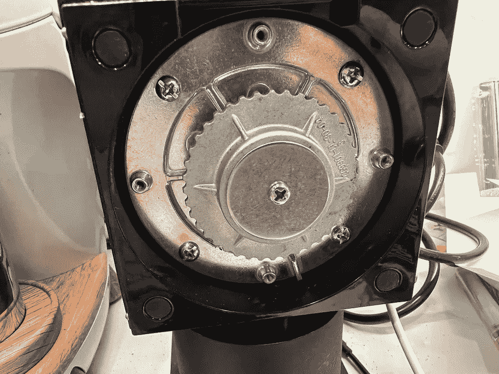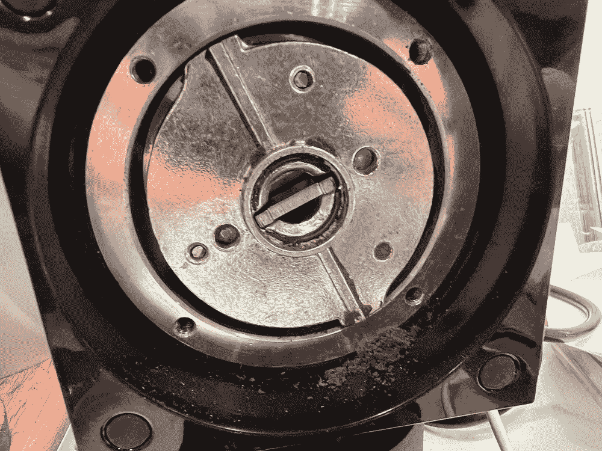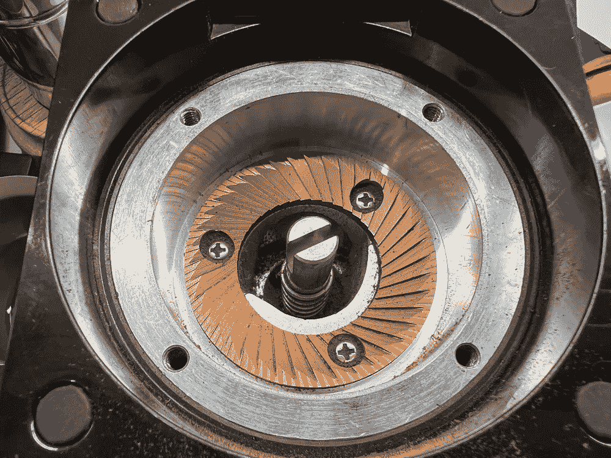

所有图片由作者提供

确保你的工作空间乱七八糟，因为这意味着你在做正确的事情。

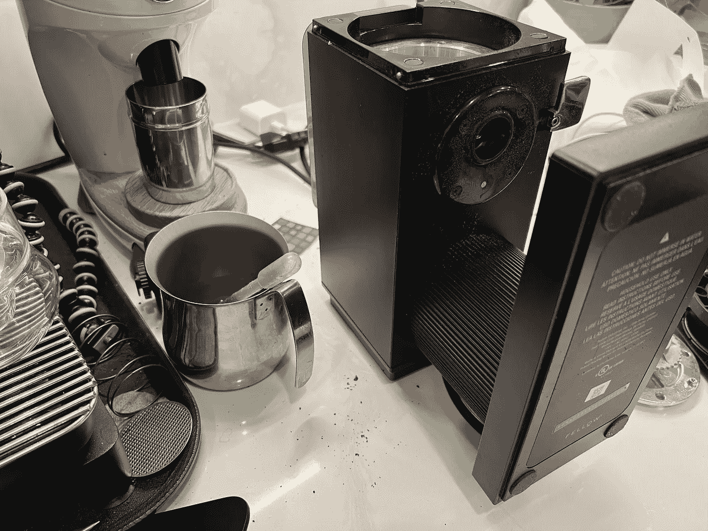

接下来，检查毛刺。我注意到一个尺寸上的标记比另一个更强，这表明我可以在哪里添加垫片来改善对齐。

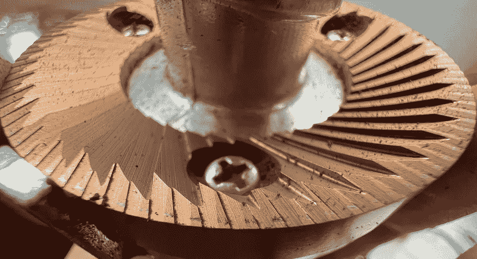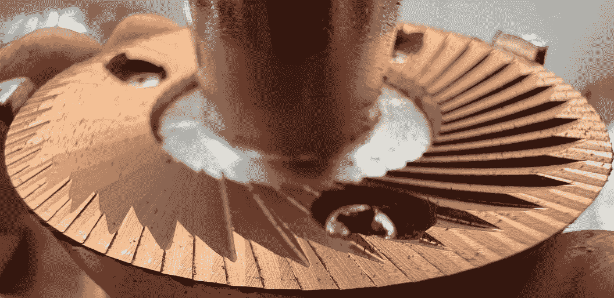

然后将垫片添加到对面标记的中间。通常情况下，您会用类似干擦市场的东西标记毛刺，运行毛刺，并查看哪里的标记被删除。因为那些标记，我不认为我必须一开始就这么做。

所以我找到了标记对面的中间，我加了铝箔。

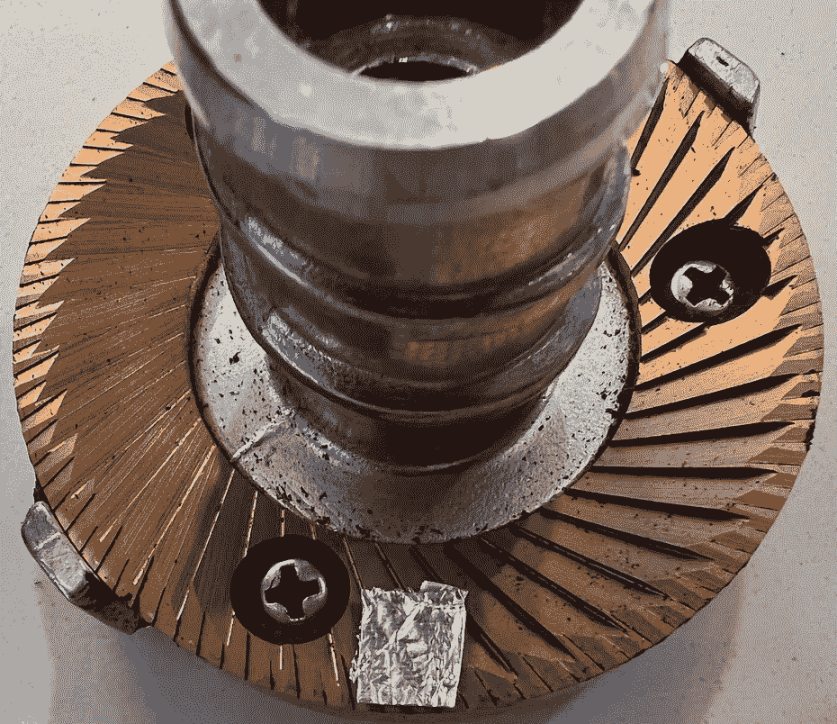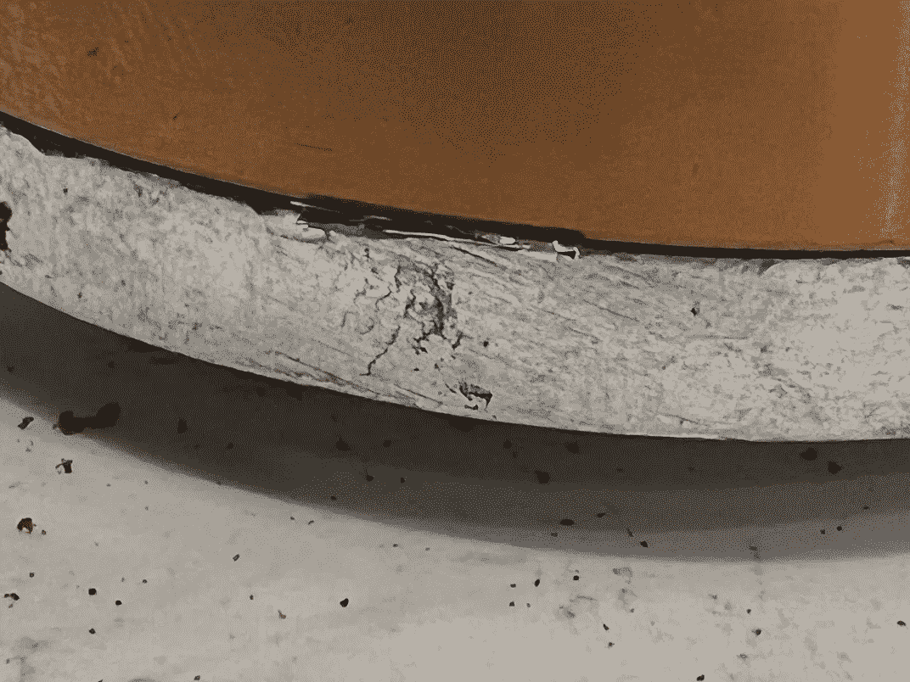

然后我用记号笔在刀片上做了标记。

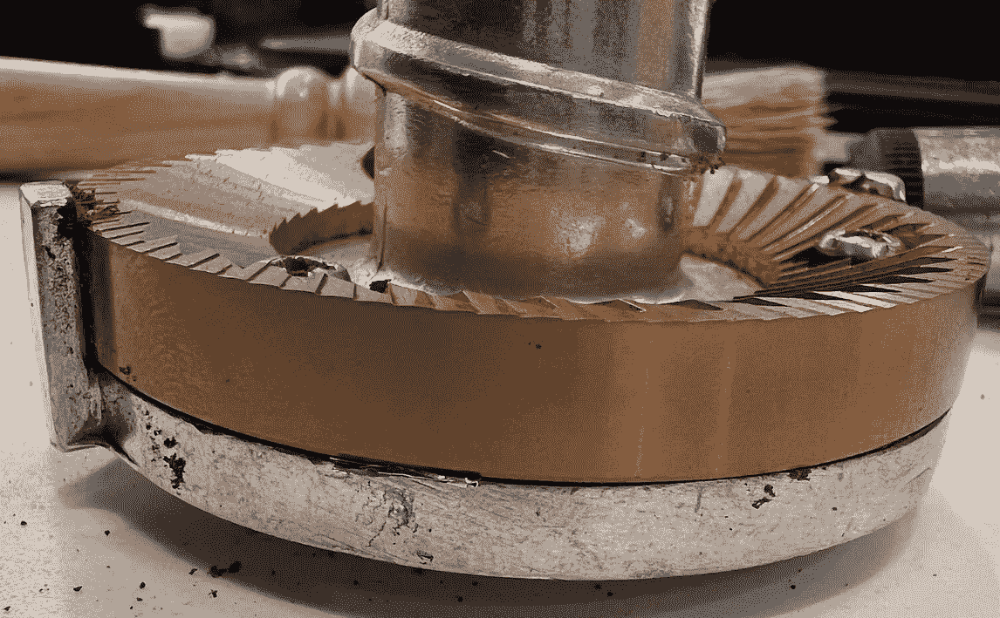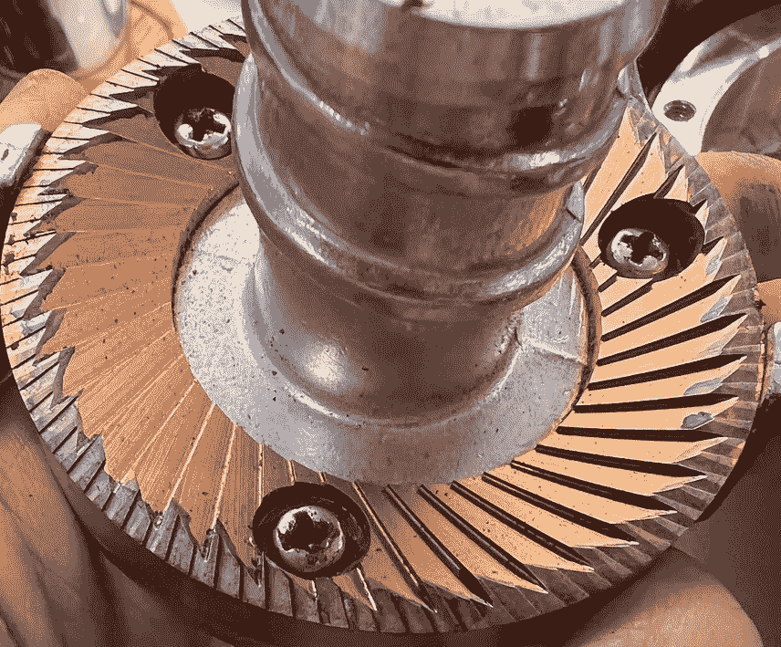

我在很低的研磨设置下运行了一段时间，一切似乎都很平稳。

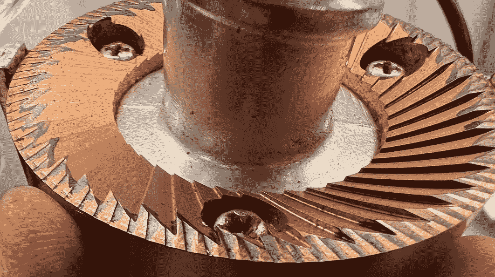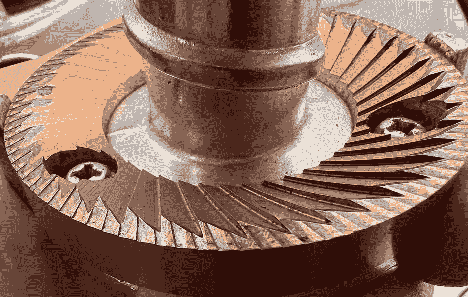

我看了毛刺集的两个部分，它似乎是均匀的。

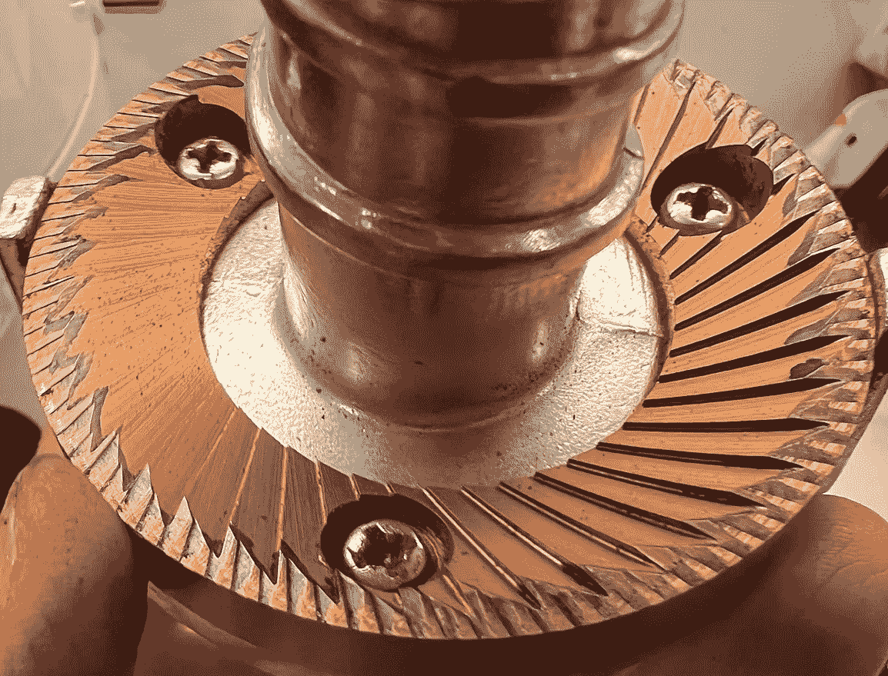

然而，我想听听别人的意见，所以我又做了一次测试。

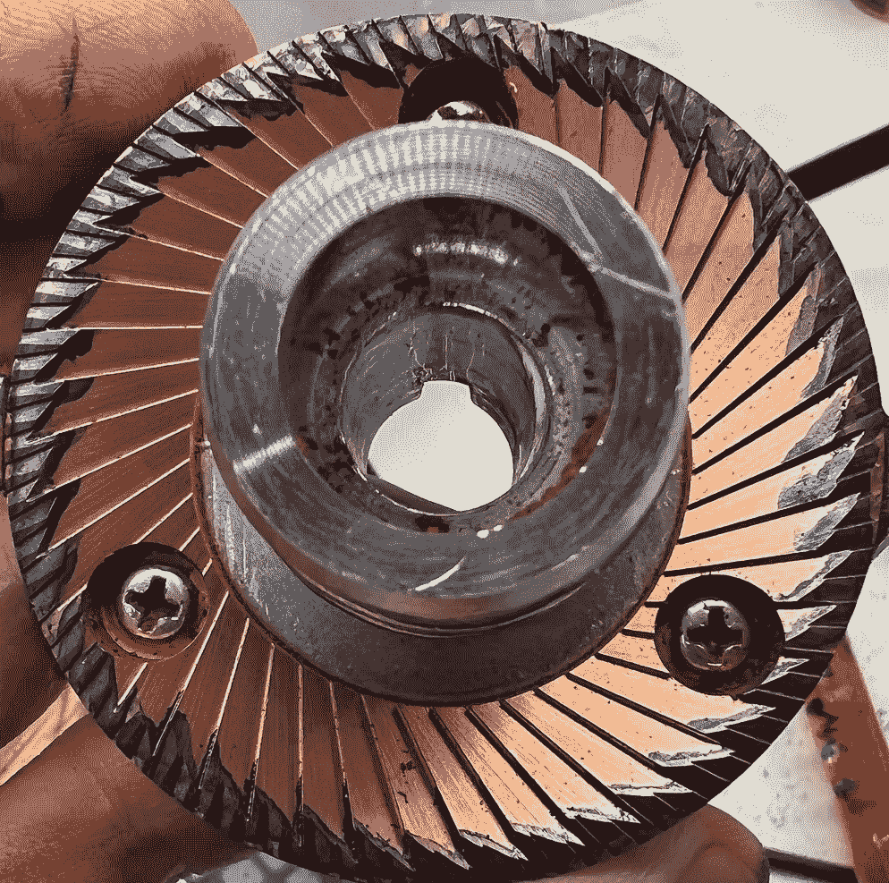

后来，我发现在同样的设置下，我的研磨效果更好。校准前拨入设置为 2.6，但校准后设置为 3.6。

我看了前后的粒子分布。我用了不同的豆子，因为我一时冲动把毛刺对齐了。我没有收集前后的样本，但我使用的其他豆子具有相似的密度:

> 校准前的咖啡密度= 0.402 克/毫升
> 
> 校准后的咖啡密度= 0.403 克/毫升

研磨后设置值 2.6 似乎介于设置值 1 和 2 之间。

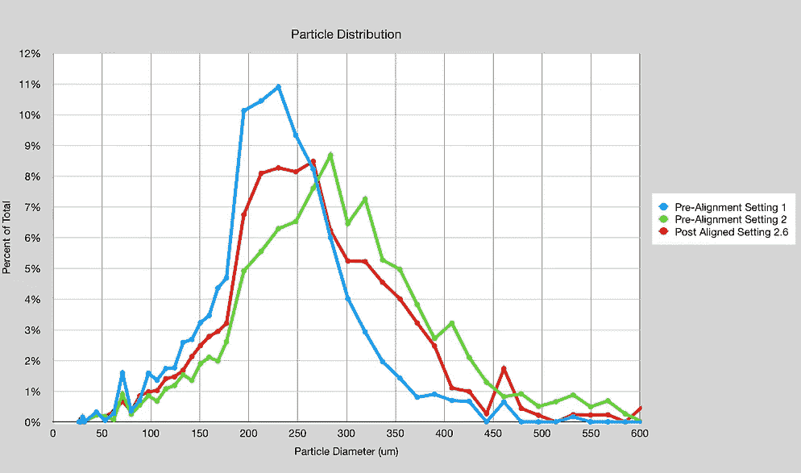

这意味着研磨机可以更精细，因为毛刺是对齐的。未对齐的毛刺会导致毛刺接触得更快。因此，如果你正在调整你的毛刺，一个很好的方法来知道你这样做是正确的，是注意到一个更好的研磨设置。

# 设备/技术

[意式咖啡机](/taxonomy-of-lever-espresso-machines-f32d111688f1) : [像样的意式咖啡机](/developing-a-decent-profile-for-espresso-c2750bed053f)

[咖啡研磨机](/rok-beats-niche-zero-part-1-7957ec49840d) : Fellow Ode+SSP 多用途毛刺

咖啡:[家庭烘焙咖啡](https://rmckeon.medium.com/coffee-roasting-splash-page-780b0c3242ea)，中杯(第一口+ 1 分钟)

镜头准备:[断奏夯实](/staccato-tamping-improving-espresso-without-a-sifter-b22de5db28f6)

[预输注](/pre-infusion-for-espresso-visual-cues-for-better-espresso-c23b2542152e):长，约 25 秒

输液:[压力脉动](/pressure-pulsing-for-better-espresso-62f09362211d)

[过滤篮](https://rmckeon.medium.com/espresso-baskets-and-related-topics-splash-page-ff10f690a738) : 20g VST

其他设备: [Atago TDS 计](/affordable-coffee-solubility-tools-tds-for-espresso-brix-vs-atago-f8367efb5aa4)、 [Acaia Pyxis 秤](/data-review-acaia-scale-pyxis-for-espresso-457782bafa5d)

# 绩效指标

我使用两个[指标](/metrics-of-performance-espresso-1ef8af75ce9a)来评估技术之间的差异:最终得分和咖啡萃取。

[**最终得分**](https://towardsdatascience.com/@rmckeon/coffee-data-sheet-d95fd241e7f6) 是评分卡上 7 个指标(辛辣、浓郁、糖浆、甜味、酸味、苦味和余味)的平均值。当然，这些分数是主观的，但它们符合我的口味，帮助我提高了我的拍摄水平。分数有一些变化。我的目标是保持每个指标的一致性，但有时粒度很难确定。

**强度半径(IR)** 定义为 TDS 对 EY 控制图上原点的半径，所以 IR = sqrt( TDS + EY)。这一指标有助于标准化产量或酿造比的击球性能。

我在 4 次烘烤中观察了 4 个镜头对。味道没有明显的趋势，但提取率略有下降。这可能是由于对齐毛刺的研磨设置太细，因为研磨设置从未对齐毛刺的设置 2.3 变为对齐毛刺的设置 3.6。我有点懒于拨入恰到好处。

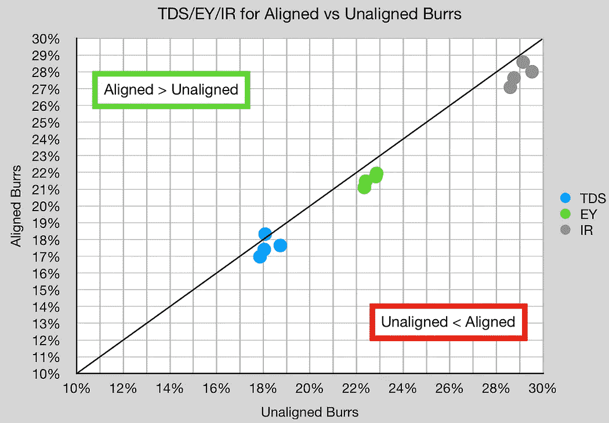

我原以为对齐后会有更紧密的分布。这看起来像是有一个转变，但看起来不像是有一些紧密的粒子分布。我仍然更喜欢有对齐的毛刺，但我没有在前后的粒子分布中看到什么特别的东西来说平的毛刺似乎与圆锥形毛刺有根本的不同。更多的将被揭露。

如果你愿意，可以在推特、 [YouTube](https://m.youtube.com/channel/UClgcmAtBMTmVVGANjtntXTw?source=post_page---------------------------) 和 [Instagram](https://www.instagram.com/espressofun/) 上关注我，我会在那里发布不同机器上的浓缩咖啡照片和浓缩咖啡相关的视频。你也可以在 [LinkedIn](https://www.linkedin.com/in/dr-robert-mckeon-aloe-01581595) 上找到我。也可以关注我在[中](https://towardsdatascience.com/@rmckeon/follow)和[订阅](https://rmckeon.medium.com/subscribe)。

# [我的进一步阅读](https://rmckeon.medium.com/story-collection-splash-page-e15025710347):

[我未来的书](https://www.kickstarter.com/projects/espressofun/engineering-better-espresso-data-driven-coffee)

[我的链接](https://rmckeon.medium.com/my-links-5de9eb69c26b?source=your_stories_page----------------------------------------)

[浓缩咖啡系列文章](https://rmckeon.medium.com/a-collection-of-espresso-articles-de8a3abf9917?postPublishedType=repub)

工作和学校故事集