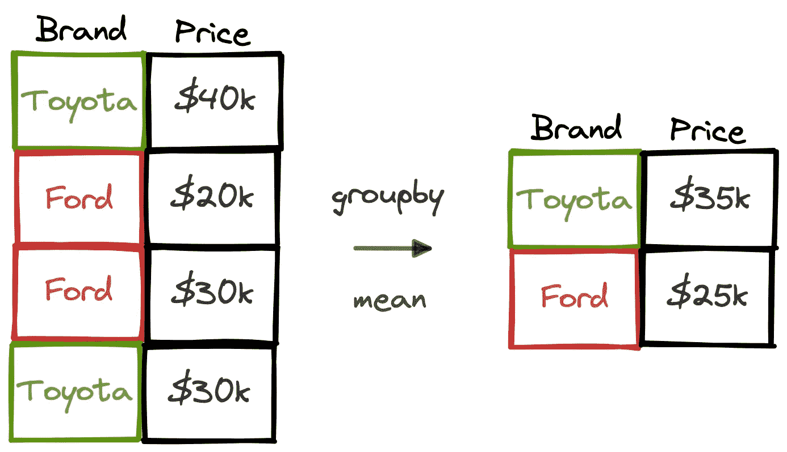
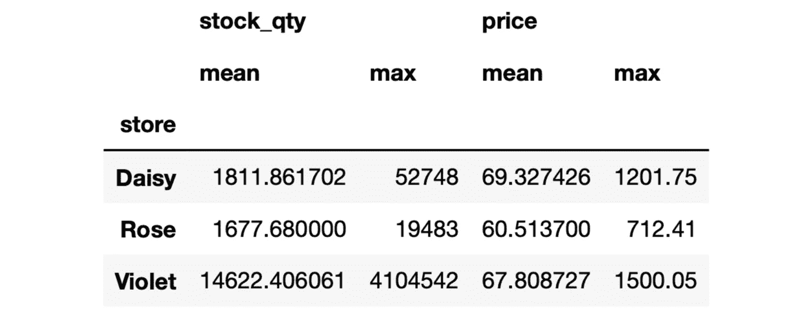
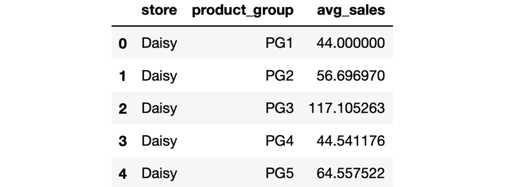
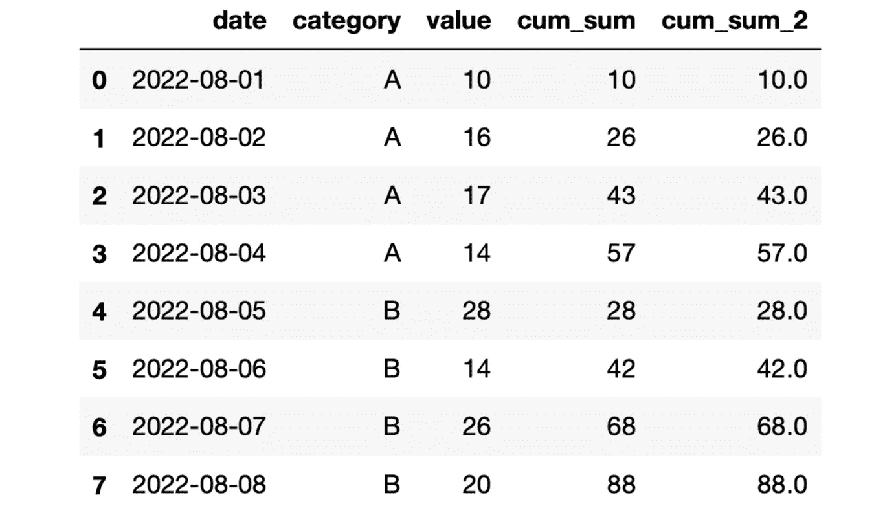
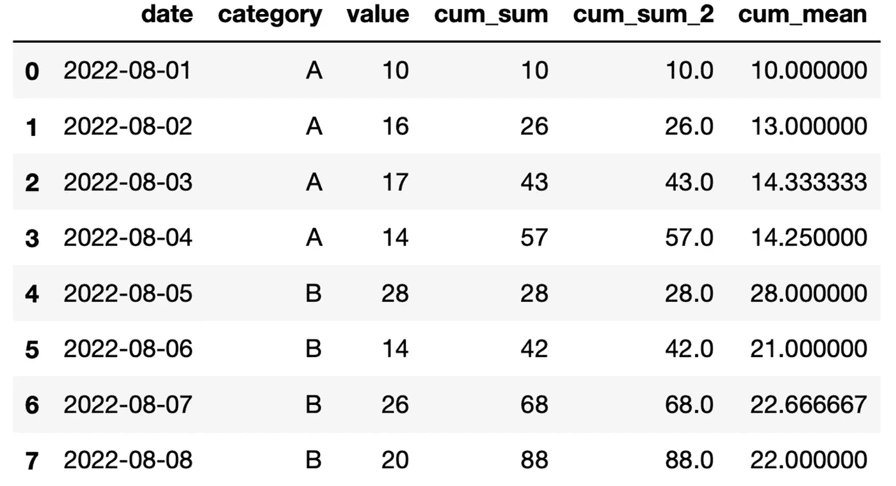
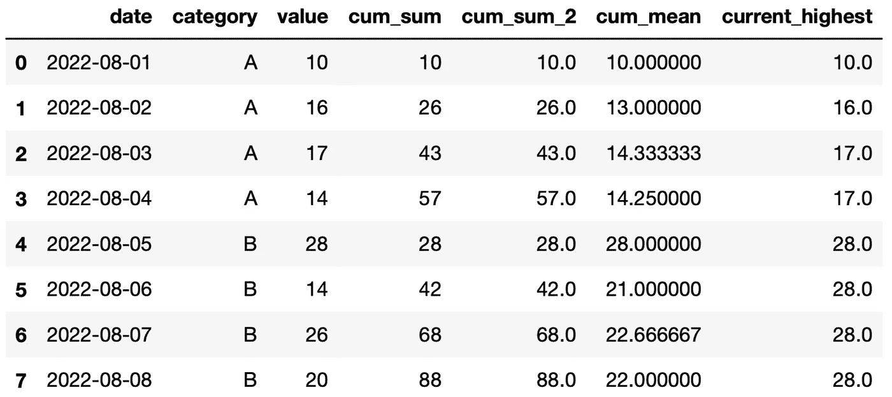

# 用 25 个例子来解释熊猫群

> 原文：<https://towardsdatascience.com/all-about-pandas-groupby-explained-with-25-examples-494e04a8ef56>

## 探索性数据分析的有效工具


莎伦·皮特韦在 [Unsplash](https://unsplash.com/s/photos/colors?utm_source=unsplash&utm_medium=referral&utm_content=creditCopyText) 上的照片

groupby 是数据分析中最常用的 Pandas 函数之一。它用于根据给定列中的不同值对数据点(即行)进行分组。然后，我们可以计算生成的组的聚合值。

如果我们有一个包含汽车品牌和价格信息的数据集，groupby 函数可用于计算每个品牌的平均价格。



(图片由作者提供)

在本文中，我们将通过 25 个例子来尝试发现 groupby 函数的全部潜力。即使你习惯使用这个函数，我还是建议你继续读下去，因为我们还会介绍一些不常用但对各种任务都很有用的操作。

我用模拟数据创建了一个销售数据集。让我们首先用这个数据集创建一个数据帧。

```
import pandas as pdsales = pd.read_csv("sales_data.csv")sales.head()
```


(图片由作者提供)

**例 1:单个聚合**

我们可以计算每个商店的平均库存数量，如下所示:

```
sales.groupby("store")["stock_qty"].mean()**Output:**store
Daisy      1811.861702
Rose       1677.680000
Violet    14622.406061
Name: stock_qty, dtype: float64
```

**示例 2:多个聚合**

我们可以在一次操作中完成多个聚合。下面是我们如何计算每个商店的平均库存数量和价格。

```
sales.groupby("store")[["stock_qty","price"]].mean()**Output:**
```


(图片由作者提供)

确保在 Python 列表中写入要聚合的列。

**示例 3:多个聚合— 2**

我们还可以使用 agg 函数来计算多个聚合值。

```
sales.groupby("store")["stock_qty"].agg(["mean", "max"])**Output**
```


(图片由作者提供)

**示例 4:命名聚合**

在前两个例子中，不清楚聚合列代表什么。例如，“平均值”并没有告诉我们它是库存数量的平均值。在这种情况下，我们可以使用命名聚合。

```
sales.groupby("store").agg(

    avg_stock_qty = ("stock_qty", "mean"),
    max_stock_qty = ("stock_qty", "max"))**Output**
```


(图片由作者提供)

要聚合的列和函数名写在一个元组中。

**示例 5:多个聚合和多个函数**

```
sales.groupby("store")[["stock_qty","price"]].agg(["mean", "max"])**Output**
```



(图片由作者提供)

**示例 6:使用不同列的命名聚合**

我们可以对不同的列和函数使用命名聚合。

```
sales.groupby("store").agg(

    avg_stock_qty = ("stock_qty", "mean"),
    avg_price = ("price", "mean"))**Output**
```


(图片由作者提供)

**例 7: as_index 参数**

如果 groupby 操作的输出是 DataFrame，则组值显示在索引中。我们可以使用 as_index 参数使它们成为数据帧中的一列。

```
sales.groupby("store", as_index=False).agg(

    avg_stock_qty = ("stock_qty", "mean"),
    avg_price = ("price", "mean"))**Output**
```


(图片由作者提供)

**示例 8:用于分组的多列**

就像我们可以聚合多个列一样，我们可以使用多个列进行分组。

```
sales.groupby(["store","product_group"], as_index=False).agg(

    avg_sales = ("last_week_sales", "mean")

).head()**Output**
```



(图片由作者提供)

为每个商店-产品组组合生成一个组。

**示例 9:对输出进行排序**

我们可以使用 sort_values 函数根据聚合列对输出进行排序。

```
sales.groupby(["store","product_group"], as_index=False).agg( avg_sales = ("last_week_sales", "mean")

).sort_values(by="avg_sales", ascending=False).head()**Output**
```


(图片由作者提供)

这些行根据平均销售额按降序排序。

**例 10:最大 n 值**

max 函数返回每组的最大值。如果我们需要最大的 n 个值，我们可以使用 nlargest 函数。

```
# largest 2 values
sales.groupby("store")["last_week_sales"].nlargest(2)**Output** store      
Daisy   413    1883
        231     947
Rose    948     883
        263     623
Violet  991    3222
        339    2690
Name: last_week_sales, dtype: int64
```

我们可以看到它们的行的值和索引，这可用于访问整行。

**例 11:最小的 n 值**

nsmallest 函数返回每个组的 n 个最小值。

```
# smallest 2 values
sales.groupby("store")["last_week_sales"].nsmallest(2)**Output**
store      
Daisy   23     12
        52     12
Rose    304    12
        320    12
Violet  20     12
        21     12
Name: last_week_sales, dtype: int64
```

**例 12:第 n 个值**

我们也可以求出一个组中的第 n 个值。让我们首先按照商店和上个月的销售列对销售数据框架进行排序。

```
sales_sorted = sales.sort_values(by=["store","last_month_sales"], ascending=False, ignore_index=True)
```

我们可以找到每个商店上个月销售额第五高的产品，如下所示:

```
sales_sorted.groupby("store").nth(4)**Output**
```


(图片由作者提供)

输出包含每个组的第 5 行。因为行是根据上个月的销售额排序的，所以我们得到上个月销售额第五高的行。

**例 13:索引为负的第 n 个**

我们也可以使用带有负值的第 n 个。例如，“nth(-2)”返回从末尾开始的第二行。

```
sales_sorted.groupby("store").nth(-2)**Output**
```


(图片由作者提供)

**例 14:唯一值**

唯一函数可用于查找每个组中的唯一值。例如，我们可以在每个组中找到唯一的产品代码，如下所示:

```
sales.groupby("store", as_index=False).agg( unique_values = ("product_code","unique"))**Output**
```


(图片由作者提供)

**示例 15:唯一值的数量**

我们还可以使用 nunique 函数找到每个组中唯一值的数量。

```
sales.groupby("store", as_index=False).agg( number_of_unique_values = ("product_code","nunique"))**Output**
```


(图片由作者提供)

**例 16: Lambda 表达式**

我们可以在 agg 函数中使用 lambda 表达式作为聚合。

```
sales.groupby("store").agg(

    total_sales_in_thousands = (
        "last_month_sales", 
        lambda x: round(x.sum() / 1000, 1)
    )

)**Output**
```


(图片由作者提供)

**示例 17:带有 apply 的 Lambda 表达式**

Lambda 表达式可以使用 apply 函数应用于每个组。例如，我们可以计算每个商店上周销售额与上月销售额四分之一之间的平均差额，如下所示:

```
sales.groupby("store").apply( lambda x: (x.last_week_sales - x.last_month_sales / 4).mean())**Output** store
Daisy     5.094149
Rose      5.326250
Violet    8.965152
dtype: float64
```

**例 18:drop na paramater。**

默认情况下，groupby 函数忽略缺少的值。因此，如果用于分组的列中有缺失值，它将不会包含在任何组中，也不会单独显示。我们可以使用 dropna 参数来改变这种行为。

让我们首先添加一个缺少存储值的新行。

```
sales.loc[1000] = [None, "PG2", 10000, 120, 64, 96, 15, 53]
```

我们将计算有和没有 dropna 参数的每个商店的平均价格，以查看差异。

```
# without dropna
sales.groupby("store")["price"].mean()**Output**
store
Daisy     69.327426
Rose      60.513700
Violet    67.808727
Name: price, dtype: float64------------------------------------------------------------------
# with dropna
sales.groupby("store", dropna=False)["price"].mean()**Output**
store
Daisy     69.327426
Rose      60.513700
Violet    67.808727
NaN       96.000000
Name: price, dtype: float64
```

***注意*** *:为了使用 groupby 函数的 dropna 参数，需要有 pandas 版本 1.1.0 或更高版本。*

**例 19:多少组**

我们有时需要知道生成了多少个组，这可以使用 ngroups 方法找到。

```
sales.groupby(["store", "product_group"]).ngroups**Output**
18
```

“商店”和“产品组”列中的不同值有 18 种不同的组合。

**示例 20:获取特定的组**

get_group 函数可以用来获取一个特定的组作为数据帧。使用用于分组的列中的值来定义组。在使用多个列进行分组的情况下，值被写入一个元组中。

例如，我们可以获得属于商店“Daisy”和产品组“PG1”的行，如下所示:

```
daisy_pg1 = sales.groupby( ["store", "product_group"]).get_group(("Daisy","PG1"))daisy_pg1.head()**Output**
```


**例 21:分配等级**

rank 函数用于根据给定列中的值为行分配等级。我们可以使用 rank 和 groupby 函数分别对每个组中的行进行排序。

```
sales["rank"] = sales.groupby("store")["price"].rank( ascending=False, method="dense")sales.head()**Output**
```


(图片由作者提供)

**例 22:累计和**

我们可以计算每组内的累积和。让我们用简单的时间序列数据创建一个新的数据框架。

```
import numpy as npdf = pd.DataFrame(
   {
     "date": pd.date_range(start="2022-08-01", periods=8, freq="D"),
     "category": list("AAAABBBB"),
     "value": np.random.randint(10, 30, size=8)
   }
)df**Output**
```


(图片由作者提供)

我们可以创建一个包含值列的累积和的列，如下所示:

```
df["cum_sum"] = df.groupby("category")["value"].cumsum()df**Output**
```


(图片由作者提供)

**例 23:展开的累加和**

扩展函数提供扩展变换。我们仍然需要一个函数来进行聚合，例如均值和求和。如果它与 sum 函数一起使用，结果将与 cumsum 函数相同。

```
df["cum_sum_2"] = df.groupby(
    "category"
)["value"].expanding().sum().valuesdf**Output**
```



(图片由作者提供)

**例 24:累积平均值**

我们还可以通过使用 expanding 和 mean 函数来计算累积平均值。

```
df["cum_mean"] = df.groupby(
    "category"
)["value"].expanding().mean().valuesdf**Output**
```



(图片由作者提供)

**示例 25:当前最高值，扩展**

扩展和最大值功能可用于记录组中的当前最大值。

```
df["current_highest"] = df.groupby(
    "category"
)["value"].expanding().max().valuesdf**Output**
```



(图片由作者提供)

## **最终想法**

groupby 函数和聚合函数一起构成了一个高效的数据分析工具。它们帮助我们从数据集中提取信息。

我们在本文中所做的例子涵盖了 groupby 函数的大多数用例。

*你可以成为* [*媒介会员*](https://sonery.medium.com/membership) *解锁我的全部写作权限，外加其余媒介。如果你已经是了，别忘了订阅*[](https://sonery.medium.com/subscribe)**如果你想在我发表新文章时收到电子邮件。**

*感谢您的阅读。如果您有任何反馈，请告诉我。*