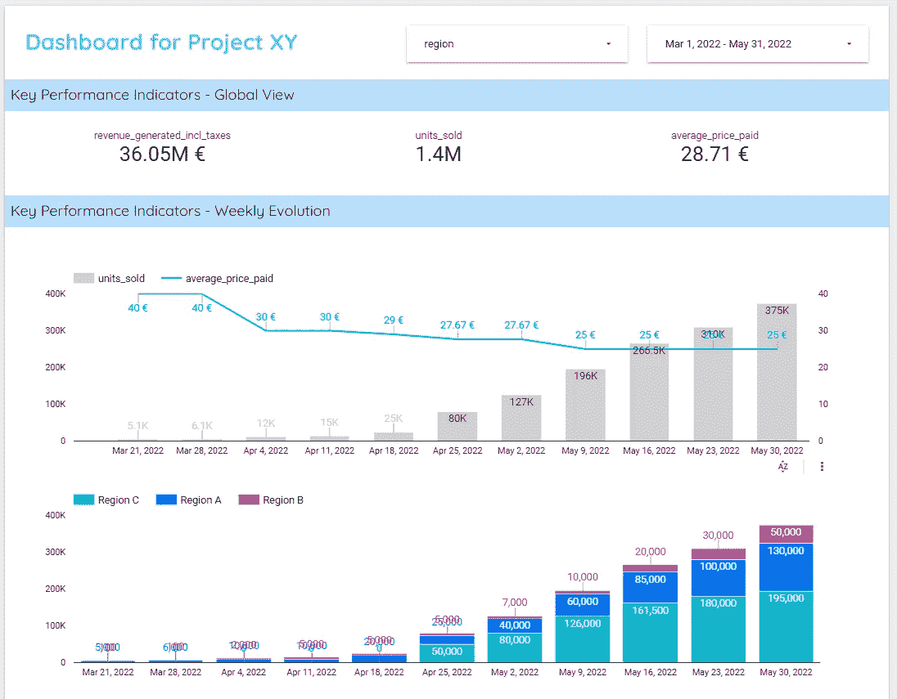
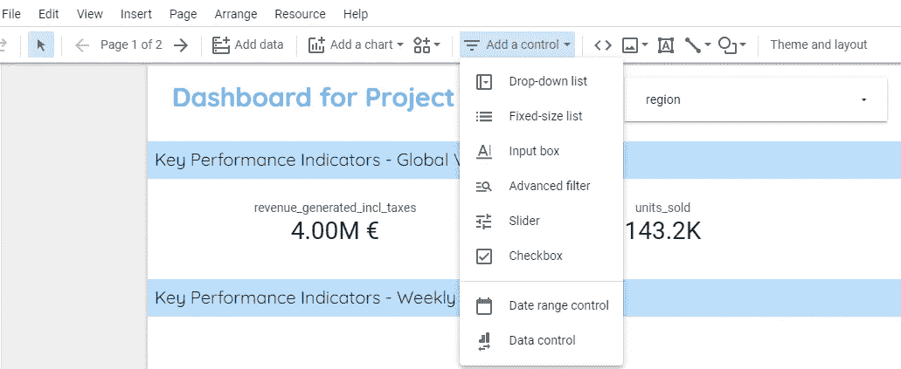
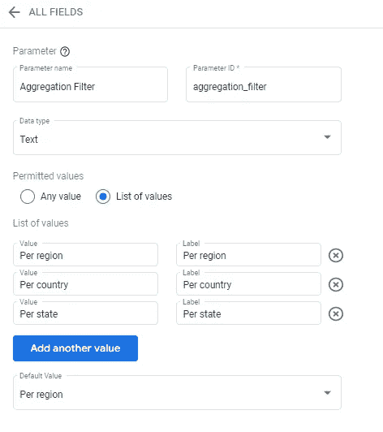
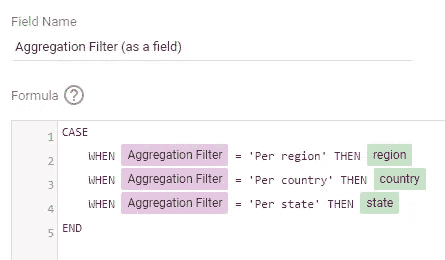
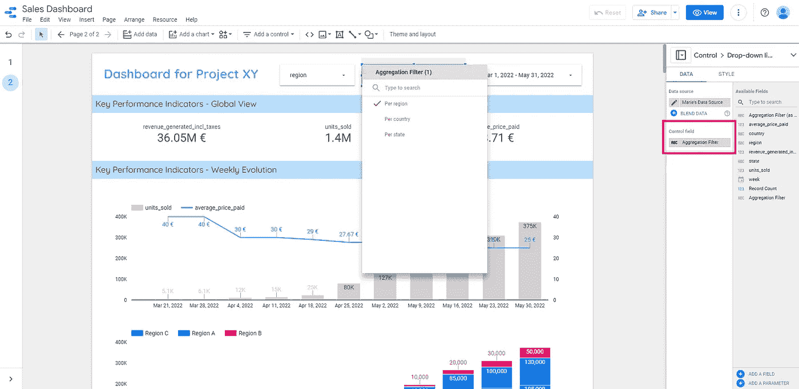
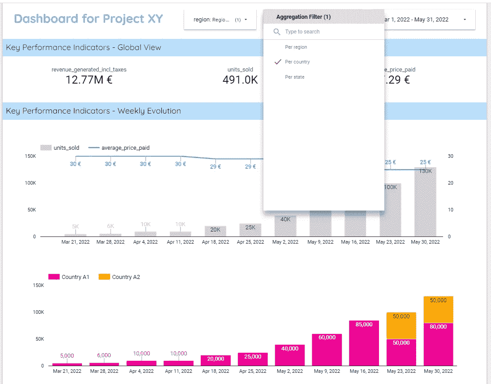

# 使用 Google DataStudio 的一体化仪表盘

> 原文：<https://towardsdatascience.com/all-in-one-dashboards-using-google-datastudio-9fba7b6d6e7d>

## 聚合过滤器被低估的能力

照片由 [Unsplash](https://unsplash.com/?utm_source=unsplash&utm_medium=referral&utm_content=creditCopyText) 上的 [Aziz Acharki](https://unsplash.com/@acharki95?utm_source=unsplash&utm_medium=referral&utm_content=creditCopyText) 拍摄

如果谷歌的数据可视化工具 DataStudio 在公司内部的使用仍在增加，**我发现它的一个功能特别被低估了**——老实说，我一开始也低估了它。聚合过滤器的概念可能适用于其他数据可视化工具，但 DataStudio 是我发现并广泛使用它的工具。作为一名数据分析师，在过去的几年里，这是迄今为止我使用最多的数据可视化工具。

让我先给你介绍一下我称之为**“聚合过滤器”**。当我在网上浏览时，我找不到我在这篇文章中所指的确切措辞。聚合过滤器是功能[“下拉列表”](https://support.google.com/datastudio/answer/11335992)和功能[“参数”](https://support.google.com/datastudio/answer/9002005)的组合。在您想知道应该在多大程度上使用这些神秘的聚合过滤器(在这种情况下，您应该直接跳到第 3 部分)之前，让我们借助一个示例来明确这个概念。

在上一篇[文章](/how-to-build-effective-and-useful-dashboards-711759534639)中，我构建了一个示例仪表板，显示给定产品的销售量:

*   总计(第一张图)
*   和每个区域(第二个图表)

玛丽·勒费夫尔—图 1

在本文中，让我们想象一下，除了显示每个地区的销售量分割，我们还需要显示每个国家的销售量分割(在每个现有地区内)。这一修改的原因可能是**每个国家经理都需要数字来监控他们自己的销售**。州经理呢？一旦他们听说了我们出色的仪表板，他们可能会想要自己的仪表板来显示每个州的销售量。

从一个利益相关者的基本情况，我们切换到我们必须**为几个利益相关者**构建类似的仪表板的情况，他们中的每一个都像他们的同事一样监控相同的指标，但是在不同的范围内。我希望**在我现有的仪表板上建立这些调整，而不是为每个利益相关者复制相同数量的工作。**

这就是聚合过滤器发挥作用的地方。

# 抱歉，聚合什么？

我在本文中提到的聚合过滤器可以添加到任何 DataStudio 报告中，方法是使用顶部栏中的“添加控件”功能，然后单击“下拉列表”。

玛丽·勒费夫尔—图 2

与常规过滤器一样，聚合过滤器是通过定义右侧面板上的“控制字段”来设置的:这是由报表用户自己通过创建的过滤器来控制的维度。

常规过滤器和聚合过滤器的主要区别是，常规过滤器使用来自数据源的一个**维度**(绿色字段)作为“控制字段”，而聚合过滤器使用来自数据源的一个**参数**(紫色字段)作为“控制字段”。

玛丽·勒费夫尔—图 3

# 如何在报表中创建聚合过滤器？

## 1.创建参数

在您之前设置的数据源中，或者直接在您的报表右侧，**点击【添加参数】**。在这里，您可以命名和定义将要创建的参数类型。

玛丽·勒费夫尔—图 4

在我们的示例中，我们希望创建一个名为“聚合过滤器”的参数，因为我们将只创建一种类型的聚合过滤器。如果您计划使用几个聚合过滤器，我建议您在命名参数时更加具体，以避免在设置不同过滤器时出现混淆。

这将是一个值列表，代表我希望在同一图表中显示的几个聚合级别:

*   每个地区
*   每个国家，考虑到一个世界区域由几个国家组成
*   每个州，考虑到一个国家由几个州组成

玛丽·勒费夫尔—图 5

## 2.配置过滤器

既然已经在数据源中创建了参数，您必须定义该参数将引用哪些维度。换句话说，我们希望在这里设置如下:**当用户选择“按国家”而不是“按地区”时，DataStudio 应该调用并显示原始数据源中的哪个字段？**

这是在**数据源**部分完成的——正是我们在步骤 1 结束时停止的地方。点击右下角的“保存”后，点击“所有字段”。您会看到出现了一个新的条目类别:*参数*，其中有一个是我们刚刚创建的名为“聚合过滤器”的条目。

玛丽·勒费夫尔—图 6

为了完成配置，我们通过在数据源中单击“添加字段”来创建一个字段。我是这样设置的:

玛丽·勒费夫尔—图 7

现在保存并返回到您的仪表板。

## 3.将过滤器应用于相关图表

在我们的示例中，我们希望当最终用户将聚合过滤器设置为“每个国家”或“每个州”时，第二个图表会根据用户的选择进行更新并显示数据。

为此，请选择要应用聚合过滤器的图形。在右侧面板上，**将“分解维度”设置为“聚合过滤器(作为字段)”**。确保您选择了刚刚在步骤 2 中创建的维度字段(绿色)。这将根据参数默认设置自动更新您的图形(在我们的示例中是每个区域，因此视觉上没有任何变化)。

玛丽·勒费夫尔—图 8

## 4.微调 UX

基于您的聚合的过滤器现在已经准备好了，**您只需要通过点击顶部栏菜单中的“添加控件”和“下拉列表”将它添加到仪表板**(参见图 2)。在右侧面板中，将“控制字段”设置为“聚合过滤器”。确保您选择了参数(而不是我们在步骤 2 中创建的字段):您将通过它的紫色来识别它。

玛丽·勒费夫尔—图 9

我想和你分享的最后一个技巧是关于**这个聚合过滤器**的设计。对于任何用户来说，**名为“聚合过滤器”的过滤器与过滤器“区域”**的行为不同可能并不明显。然而，它们的行为确实不同:

*   常规过滤器“区域”将选择应用于仪表板中显示的数据范围
*   而默认设置为“Per region”的“Aggregation filter”会影响数据在第二个图表中的显示方式

如果我将常规过滤器“region”设置为“region A ”,将聚合过滤器设置为“Per country ”,这就是我的最终输出，这里考虑到 Region A 由 country A1 和 country A2 组成(图 10)。**这是典型的仪表板视图，区域 A 的国家经理将使用**，而最初的仪表板仅用于区域经理(见图 1)。

玛丽·勒费夫尔—图 10

# 为什么您也应该开始在仪表板中使用聚合过滤器？

如果你达到了这一步，恭喜你！—您必须预见支持在各种仪表板中使用聚合过滤器的论点。无论如何，让我强调一下我所经历的聚合过滤器的两个主要优点。

## 原因 1:节省自己的时间

如果实现聚合过滤器在开始时看起来工作量很大，那么正确配置它们所花费的时间很快就会与未来工作中节省的时间相平衡。事实上，如果几个利益相关者需要类似的仪表板，聚合过滤器的替代方案是…实际上构建几个仪表板。这表示通过使用聚合过滤器技术可以节省一些时间。

除了在仪表盘构建过程中节省时间外，**仪表盘的维护也因聚合过滤器**而变得更加容易。是否需要更改显示的指标？没问题，我会换一次的！需要改变字体或颜色吗？没问题，您可以在自己创建的独特仪表板中一劳永逸地完成这项工作。

## 原因 2:将不同的利益相关者聚集在同一个仪表板上

从利益相关者的角度来看，为几个人构建一个仪表板可能被视为懒惰的表现(可能吗？)或者是一种误解，认为不同的人有不同的需求。我认为，**如果度量是相同的，并且显示可以被合并以适合所有相关方**，没有理由不这样做。

此外，**将具有相似需求的利益相关者聚集到同一个仪表板上**可能会使他们更紧密地合作，并在当前和未来指标的定义上一起工作。这有利于公司职能和/或部门之间更好的协调，我认为这对每个人都有好处。

# 结论

正如我之前所说的，我的结论是明确的:只要有意义，我们就使用聚合过滤器！

如果您知道其他数据可视化工具中类似的功能，我会有兴趣知道类似的技巧。不要犹豫，在评论区分享你的仪表板习惯。

你喜欢阅读这篇文章吗？ [*成为*](https://marie-lefevre.medium.com/membership) *的一员，加入一个不断成长的充满好奇心的社区吧！*

 