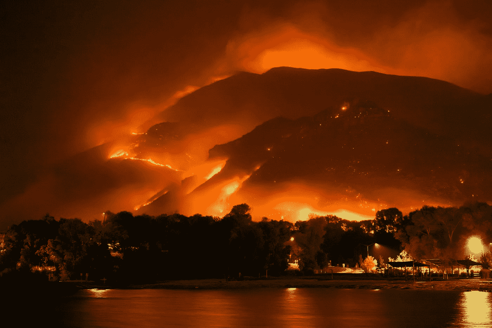
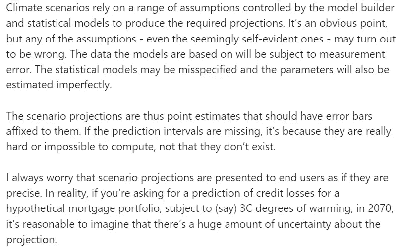

# 你能做的所有游戏自助餐:与气候相关的物理风险中的模型风险

> 原文：<https://towardsdatascience.com/all-you-can-game-buffet-model-risks-in-the-climate-related-physical-risks-8445d5f96c18>

## 与 CRPRs 相关的模型风险清单

迈克·纽伯瑞在 [Unsplash](https://unsplash.com?utm_source=medium&utm_medium=referral) 上的照片

在气候变化时代，数据科学家可以在追求可靠的数据驱动决策以促进可持续性方面发挥重要作用:稳健地建立气候相关风险(crr)模型，并为决策者提供有用的信息，以减轻风险带来的负面后果。因此，crr 与数据科学家高度相关。与 crr 建模相关的风险范围很广。在这种情况下，参与气候相关风险建模的数据科学专业人员需要对这些风险有扎实的了解。有鉴于此，我决定将我过去关于这个主题的研究著作(如[杉尾，2022](http://www.reversalpoint.com/model-risk-and-tail-risk-of-climate-related-risks.html) )汇编起来，在 TDS 上提出我个人的观点。我希望这篇文章将为数据科学专业人员提供一个清单的基础，以解决与 crr 相关的模型风险。

# 介绍

气候相关风险具有路径依赖性和高度不确定性。crr 源于高度复杂的气候系统，因此很难建模。

## 模型风险和尾部风险

通常，有两种类型的风险与模型使用相关:模型风险和尾部风险。

*   模型风险是"*因模型使用不当而导致估值错误的风险。当组织使用错误的模型或错误地使用正确的模型时，就会出现这种风险*。(Chance &艾德莱森，2019 年，第 21 页)
*   当我们在实际分布的尾部发现比使用的概率模型预期的更多的事件时，尾部风险就出现了。(Chance & Edleson，2019 年，第 21 页)

在很大程度上，2007/2008 年的金融危机可能就是这两种风险的一个例子。在广泛使用先进的投资组合风险模型——如风险价值——的同时，金融系统扩大了负债(账面上和账面下),超出了它们的能力。这些复杂的模型反而鼓励了金融行业证明过度冒险的合理性。这些模型的使用最终导致了知识错觉和控制错觉。它助长了 T2 系统性金融危机的起因，并悲惨地未能保护系统免受肥尾事件的影响。([诺切拉，2009 年](https://www.nytimes.com/2009/01/04/magazine/04risk-t.html?pagewanted=1&_r=1))

如果 crr 得不到缓解，风险变量之间的相关性可能会逐渐增加，并出现前所未有的非线性发展。([气候变化工作组，2020 年，第 9 页](https://www.actuaries.org.uk/system/files/field/document/Climate-change-report-29072020.pdf))它们可能会在气候系统的平衡中推动不可逆转的系统性范式转变。([施耐德公司，美国大学，摘要](https://www.researchgate.net/publication/222679887_Abrupt_non-linear_climate_change_irreversibility_and_surprise))

CRRs 可能对我们人类的生活造成有害的肥尾风险。鉴于金融危机的历史教训，数据科学专业人员必须解决模型风险和尾部风险( [Schneider，2003，p5](https://www.oecd.org/env/cc/2482280.pdf) )，并从数据驱动的风险管理角度稳健地构建 crr 模型。

## 气候相关风险的物理风险和转移风险

与气候相关的财务披露特别工作组(TCFD)-一个由行业领导的特别工作组，其任务是制定自愿与气候相关的财务披露指南-将 crr 分为两类风险:过渡风险和物理风险。

1.  在向低碳经济转型的过程中，可能会出现转型风险。这些风险与“*政策、法律、技术和市场变化相关，以解决与气候变化*相关的缓解和适应要求”。
2.  物理风险可分为急性(事件驱动)或慢性风险。

*   急性风险是"*事件驱动的，包括极端天气事件严重性的增加，如气旋、飓风或洪水。例如恶劣的气候。*
*   慢性风险"*指气候模式的长期变化*":例如，海平面上升或持续高温引起的慢性热浪。

( [TCFD，2017 年，第 5–6 页](https://www.fsb-tcfd.org/recommendations/#:~:text=The%20TCFD%20recommendations%20on%20climate,included%20in%20mainstream%20financial%20filings.))

下面，根据 TCFD 的分类，这篇文章将集中讨论 crr 的物理风险——称之为与气候相关的物理风险，并探讨与模拟 crpr 相关的潜在风险。并且，我希望这篇文章将为数据科学专业人员提供一个检查表的基础，以解决 crr 中涉及的各种模型风险。

# 讨论

过去，财产和意外伤害保险行业——财产和意外伤害保险公司和再保险公司——开发了自己的灾难/危险模型来评估与灾难风险相关的保险风险。在这种背景下，通常应用他们的框架来模拟与气候相关的物理风险。([环境署金融倡议，2019 年，第 8 页](https://www.unepfi.org/publications/changing-course-real-estate-tcfd-pilot-project-report-and-investor-guide-to-scenario-based-climate-risk-assessment-in-real-estate-portfolios/))

首先，A 节探讨了财产和意外保险公司的巨灾模型中潜在的不确定性来源。然后，B 节将探讨在应用财产和意外保险公司的巨灾模型框架来减轻与气候相关的物理风险时存在的潜在风险。

## ***A.*** ***保险人巨灾模型涉及的不确定性来源***

**a) 2 个不确定性的系统来源**

除了模型风险和尾部风险之外，伦敦劳埃德发表的一篇论文还关注与气候相关的物理风险的不确定性的以下两个系统来源。([图米&雷斯泰尔，2014](https://assets.lloyds.com/assets/pdf-modelling-and-climate-change-cc-and-modelling-template-v6/2/pdf-modelling-and-climate-change-CC-and-modelling-template-V6.pdf) )

*   气候系统本身的内部变化
*   人类引起的变化的影响。

除了人类引起的变化，如人类活动引起的 GHG 排放量的指数上升，气候系统本身已经有了内在的可变性。我们经常观察到一些地区发生干旱，而另一些地区同时发生洪水。气候系统固有的内部可变性，称之为 ***自然可变性*** ，这使得科学家很难概括有无人为引起变化的气候相关风险的后果。

***b)趋势***

此外，自然变化和人为引起的变化结合在一起，正在展示新出现的 ***趋势*** 。( [Toumi & Restell，2014 年，第 32 页](https://assets.lloyds.com/assets/pdf-modelling-and-climate-change-cc-and-modelling-template-v6/2/pdf-modelling-and-climate-change-CC-and-modelling-template-V6.pdf))劳埃德的论文阐述了将观察到的趋势纳入模型的必要性，如下所示:

> “如果一个灾难模型确实量化了一个地区/危险的损失，那么这个过程是复杂的，并且取决于许多假设，这自然会导致围绕该损失的一定程度的不确定性。对于更极端的事件，这种不确定性会增加，在这种情况下，经验很少，客户输入到灾难模型中的风险数据质量很差。在决策过程中，有效传达模型的局限性及其输出中固有的不确定性是至关重要的。为了让灾难模型有助于预测风险，它们必须包含观察到的趋势。”([图米&雷斯泰尔，2014 年，第 9 页)](https://assets.lloyds.com/assets/pdf-modelling-and-climate-change-cc-and-modelling-template-v6/2/pdf-modelling-and-climate-change-CC-and-modelling-template-V6.pdf)

总之，这两种可变性的混合将使科学家很难对 CRPRs 的影响进行建模。

换句话说，没有一个单一的模型可以从今天的气候系统中消除这两个固有的不确定性，仅仅因为它们是系统性的。因此，模型的任何输出都会传达这些不确定性。简而言之，我们无法使用单一值的模型对 CRPRs 做出任何精确的预测，比如点估计。当我们处理 crr 时，任何单点估计都是欺骗性的。

尽管如此，我们仍然可以探索一系列潜在的假设情景，为未来的不确定性做准备。我们需要用概率范围(如置信区间)来捕捉场景路径的风险，以测试现有策略的弹性。

***c)特定于供应商的偏见***

此外，劳埃德的论文包括另一个不确定性来源，当我们使用供应商模型时，可能会出现这种不确定性:*特定于供应商的偏差。简而言之，任何供应商模型都基于一组特定的假设，以使其能够分析 CRPRs 的复杂性。这些假设不可避免地成为模型偏差的来源，并设定了模型使用的范围和限制。*

*总体而言，在劳埃德的论文中，Toumi & Restell 在评估财产和意外保险公司的灾难/危险模型时确定了一些不确定性来源( [Toumi & Restell，2014，第 9 页](https://assets.lloyds.com/assets/pdf-modelling-and-climate-change-cc-and-modelling-template-v6/2/pdf-modelling-and-climate-change-CC-and-modelling-template-V6.pdf)):*

1.  *模型风险和尾部风险*
2.  *CRPRs 不确定性的系统来源:*

*   *气候系统的自然/内部可变性*
*   *人类引起的变化的影响*

*3.特定于供应商的偏见*

*到目前为止，我们在财产和意外保险公司的风险管理框架的背景下讨论了嵌入在财产和意外保险公司的灾难模型中的不确定性的来源。*

*不可避免的是，财产和意外保险公司的模型框架固有地受到其业务偏见的影响。*

*换句话说，在更广泛的背景下应用他们的灾难/灾害模型框架来缓解 CRPRs 有一些潜在的限制。*

## ****B.*** ***使用保险人的巨灾模型对气候相关物理风险建模的潜在风险****

*财产和意外伤害保险公司的业务偏见导致在以下三个因素上与 CRPRs 不匹配:即，*

*   *风险状况不匹配，*
*   *时间范围不匹配，以及*
*   *方案基础不匹配。*

*我们将在本节中逐一讨论这些不匹配。*

****a)风险状况不匹配:****

*一般来说，常规保险业务的运作原理是<https://link.springer.com/chapter/10.1007/978-94-011-1378-6_1>*大数法则。( [Smith & Kane，1994](https://link.springer.com/chapter/10.1007/978-94-011-1378-6_1) )从概念上来说，假设可分散的非系统性风险——这种风险预期以稳定的已知概率实现([平稳性范式](https://serc.carleton.edu/hydromodules/steps/236435.html))——财产&意外险承保人可以将风险集中起来，分散给大量的被保险人。**

**下面简单解释一下大数定律在传统保险业务中是如何工作的。**

*   **首先，财产和意外保险公司为保险产品制定了一个足够大的目标销售量方案；然后将保险索赔频率的期望概率应用于目标被保险人，以便估计假设的目标被保险人之间的期望总保险损失(索赔)。**
*   **此后，在预期总保险损失(索赔)的基础上，他们计算总运营成本和利润率，以估计特定保险产品所需的总收入。**
*   **最后，他们用目标被保险人的总收入除以保险产品的保险费。**

**这是保险费定价(精算定价)的简化版本。**

**简单地说，财产保险公司通过分散特定被保险人的非系统性风险来获利。在这种机制下，有一个关键的平稳性假设。平稳性是一种统计属性(如均值和方差)不会随时间而改变的状态。财产和意外保险公司可以期望利润，因为他们假设保险风险是平稳的。**

**相比之下，CRPRs 正不可逆转地偏离过去的平衡。由于我们处于不可逆的瞬态，CRPRs 的统计特性将会改变。因此，一开始就以稳定的范式评估民事登记和报告制度是错误的。下一段引言阐明了在处理气候系统时区分平稳性和非平稳性行为的重要性。**

**此外，由于 crpr 在所有地理位置都在加强，它将越来越系统化，因此很难在地理上使其 crpr 的覆盖范围朝着未来多样化。**

**为了应对传统保险风险管理框架的这一特殊限制，出现了一类新的产品，称为[替代风险转移(ART)](https://en.wikipedia.org/wiki/Alternative_risk_transfer) 。艺术的概念基本上是一个零和游戏。巨灾债券(CAT bonds)是 ART 的一个例子。财产&意外险保险公司可能会出售 CAT 债券，将系统风险转移给买家，以换取一系列类似息票的分期付款。不可避免的是，在气候变化的时代，随着对 CRPRs 的预期上升，CAT 债券将变得越来越难以销售。**

**总体而言，传统保险风险管理框架中的非系统性和平稳性假设与 CRPRs 的系统性和非平稳性风险状况不一致。从这个意义上说，简单地照搬财产和意外伤害保险公司的灾难/灾害风险管理框架来评估 CRPRs 可能会遭遇风险状况不匹配的问题:系统性与非系统性；平稳性与非平稳性。**

*****b)时间跨度不匹配*****

**CRPRs 在发展和时间上都是前所未有的和不确定的。因此，它们是多时间范围:短期、中期和长期范围。**

**相反，在许多情况下，财产保险项目的期限通常是一年。不可避免的是，这种商业实践使他们倾向于将其灾难/危害风险管理框架的时间范围定得很短。**

**从主要的一般保险公司之一美国国际集团与气候相关的财务披露摘录中，我们可以看到一般保险公司[风险管理框架的一个例子:](https://economictimes.indiatimes.com/definition/general-insurance)**

> **“我们的大部分普通保单每年都会续保，这让我们有机会定期对风险进行再保险和重新定价。在一般保险及人寿和退休业务的战略制定和资产负债管理决策中都考虑了中长期影响。长期的基本趋势和重大变化更具挑战性，因为很难做出精确的预测。”( [AIG2，2020，第 8–9 页](https://www.aig.com/content/dam/aig/america-canada/us/documents/about-us/report/aig-climate-related-financial-disclosures-report_2019.pdf))**

**他们对财产和意外保险公司业务的短期偏见与 CRPRs 的多时间范围行为不匹配。这很可能解释了简单地复制财产和意外保险公司的灾难风险管理框架以减轻 CRPRs 的不确定性的来源。换句话说，当应用财险公司的巨灾风险模型来管理 CRPRs 时，使用者需要适当地调整时间范围。**

**此外，如下所述，它们的短期偏差还会导致额外的不匹配。**

*****c)情景基础不匹配(数据集偏差)*****

**基于可以基于历史数据预测短期未来的假设，保险业使用历史数据并做出一组调整来评估短期范围内的巨灾风险。**

**重复地说，过去没有关于 CRPRs 将显现的前所未有的未来的信息。**

> **历史模拟法的优点是将实际发生的事件结合起来，不需要指定分布或估计参数，但只有在未来与过去相似的情况下才有用(吉斯&麦卡锡·贝克，2021 年，第 49 页)**

**任何采用历史数据集的模型都需要在用户端进行仔细检查，以确定所嵌入的使用假设是否合适。**

**特别是，在历史数据上天真地应用数据驱动的机器学习算法，如深度学习，可能会使模型欺骗性地过度适应过去的模式，并导致模型不稳定(方差)。因此，我们最终可能会低估未来的风险。尽管它们善于从数据集中发现历史模式，但它们并不是为了预测风险变量之间未来模式的前所未有的非平稳性变化而设计的。**

**CRPRs 是路径依赖的，非常不确定。因此，CRPRs 在我们面前有许多潜在的未来道路。当然，没有人知道哪条路会展开。在这种情况下， [TCFD](https://www.fsb-tcfd.org/recommendations/) 建议采用探索性情景分析来预测 CRPRs，因为我们可以将跨多个时间范围的多个假设情景纳入模型。**

**然而，场景分析也有其固有的设计限制。它依赖于主观的假设情景。最近，[博士托尼·休斯](https://www.linkedin.com/in/hughesaw/)让[在 LinkedIn 上发帖](https://www.linkedin.com/posts/hughesaw_climaterisk-stresstesting-activity-6988476287405195264-ghp_?utm_source=share&utm_medium=member_desktop)阐明了情景分析所涉及的内在不确定性:假设的有效性没有保证；统计模型的错误设定会导致误导性的结果。([休斯，2022](https://www.linkedin.com/posts/hughesaw_climaterisk-stresstesting-activity-6988476287405195264-ghp_/?utm_source=share&utm_medium=member_desktop) )**

****

**截图:摘自托尼·休斯博士 2022 年 10 月 20 日的 LinkedIn 帖子**

# *****结论*****

**我们讨论了财产和意外保险公司的灾难模型中涉及的一些不确定性来源。**

1.  **模型风险和尾部风险**
2.  **CRPRs 不确定性的系统来源:**

*   **气候系统的自然/内部可变性**
*   **人类引起的变化的影响**

**3.供应商特有的风险**

**换句话说，在选择评估与气候相关的物理风险的模型时，必须尽职调查以下清单。**

*   **尾部风险是否包含在使用中的供应商模型中:供应商模型如何在模拟前所未有的极端事件时包含增强的复杂性和不确定性**
*   **模型如何使用户能够将观察到的趋势纳入 CRPRs 评估中**
*   **模型规格如何传达模型的局限性以及决策过程输出中固有的不确定性。**

**此外，我阐述了我个人的观点，即应用财产和意外保险公司的灾难模型评估 CRPRs 的常见做法可能会因以下 3 种类型的不匹配而遭受模型风险:**

*   **风险状况不匹配:系统性风险与非系统性风险；非平稳性与平稳性行为**
*   **时间跨度不匹配:多跨度与短期**
*   **场景基础不匹配(数据库偏差):未来场景与历史数据**

**尽管如此，我无意指责财产和意外保险公司的灾难/风险模型。相反，我更想呼吁用户注意与应用财产和意外保险公司的风险管理框架在更广泛的意义上缓解 CRPRs 相关的潜在风险。**

**总的来说，如果用户选择使用财产和意外保险公司的模型，用户可以通过将 CRPRs 的以下三个特征结合到他们在 CRPRs 管理中的使用分析中来定制财产和意外保险公司的风险管理框架:**

*   **不可分散的系统性和非平稳性风险状况**
*   **多时间范围**
*   **潜在的多种未来情景**

**这可能不是一个全面的列表，无法涵盖在更广泛的背景下使用财产和意外伤害保险公司的灾难模型来缓解 CRPRs 的所有相关风险。**

**除了所有这些风险之外，一些怀有政治目的的最终用户可能会玩主观/有偏见的游戏，做出低估的预测，以操纵公众对 CRPRs 影响的看法。场景分析可以服务于 ***尽你所能游戏*** 式——就像尽你所能吃自助餐——的虐待模式。**

**无论我们使用什么模型，我们都是我们腐败和/或不稳定人性的囚徒。没有一种模式能把我们从自我幻想和政治操纵中解放出来。**

**总的来说，数据科学专业人员需要提高对这些人类缺陷和任何被玩弄/滥用的模型的脆弱性的自我意识，并就所使用的任何模型的有限范围与受众进行良好的沟通:特别是其假设和模型输出的影响。([气候变化工作组，2020 年，第 10 页](https://www.actuaries.org.uk/system/files/field/document/Climate-change-report-29072020.pdf))**

**最后，我想用英国统计学家乔治·博克斯的一句精辟的话来结束这篇文章:**

> **“所有模型都是错的，但有些是有用的”[(维基百科，2022)](https://en.wikipedia.org/wiki/All_models_are_wrong)**

**我希望这篇文章将为数据科学专业人员提供一个解决与 crr 相关的模型风险的检查表基础。**

**感谢阅读。**

# **参考**

*   **AIG2。2019 年气候相关财务披露报告— AIG。(2020 年 8 月)。检索自[https://www . AIG . com/content/dam/AIG/America-Canada/us/documents/about-us/report/AIG-climate-related-financial-disclosures-report _ 2019 . pdf](https://www.aig.com/content/dam/aig/america-canada/us/documents/about-us/report/aig-climate-related-financial-disclosures-report_2019.pdf)**
*   **投资组合管理，风险管理导论。(2019).检索自 CFA 学院:【https://www.cfainstitute.org/ **
*   **Chance，D. M .，& McCarthy Beck，m.《衡量和管理市场风险:复习阅读 2021 CFA 课程二级阅读 45 投资组合管理》。(2021).检索自[www . cfaininstitute . org:](http://www.cfainstitute.org:)[https://www . cfaininstitute . org/-/media/documents/protected/refresh-reading/2021/pdf/measuring-managing-market-risk . ashx](https://www.cfainstitute.org/-/media/documents/protected/refresher-reading/2021/pdf/measuring-managing-market-risk.ashx)**
*   **伊曼纽尔，赖斯，J. S .，，格雷戈里，J. N .(未注明)。平稳和非平稳行为。从科学教育资源中心检索:[https://serc.carleton.edu/hydromodules/steps/236435.html](https://serc.carleton.edu/hydromodules/steps/236435.html)**
*   **托尼·休斯博士。检索自 lnke din:[https://www . LinkedIn . com/posts/hughesaw _ climaterisk-stress testing-activity-6988476287405195264-GHP _/？UTM _ source = share&UTM _ medium = member _ desktop](https://www.linkedin.com/posts/hughesaw_climaterisk-stresstesting-activity-6988476287405195264-ghp_/?utm_source=share&utm_medium=member_desktop)**
*   **诺切拉 j。风险管理不善。(2009 年 1 月 2 日)。检索自[www . nytimes . com:](http://www.nytimes.com:)[https://www.nytimes.com/2009/01/04/magazine/04risk-t.html?page want = 1&_ r = 1](https://www.nytimes.com/2009/01/04/magazine/04risk-t.html?pagewanted=1&_r=1)**
*   **突发非线性气候变化，不可逆性。(2003).检索自[www . OECD . org:](http://www.oecd.org:)[https://www.oecd.org/env/cc/2482280.pdf](https://www.oecd.org/env/cc/2482280.pdf)**
*   **Schneider，S. H .摘要:突然的非线性气候变化，不可逆转性和意外。(美国)。检索自 researchgate . net:[https://www . researchgate . net/publication/222679887 _ bureau _ non-linear _ climate _ change _ reversible _ and _ surprise](https://www.researchgate.net/publication/222679887_Abrupt_non-linear_climate_change_irreversibility_and_surprise)**
*   **《大数法则和保险的力量》。(1994).检索自 springer . com:[https://link . springer . com/chapter/10.1007/978-94-011-1378-6 _ 1](https://link.springer.com/chapter/10.1007/978-94-011-1378-6_1)**
*   **气候相关风险的模型风险和尾部风险。(2022, 9 21).检索自 reversal point . com:[http://www . reversal point . com/model-risk-and-tail-risk-of-climate-related-risks . html](http://www.reversalpoint.com/model-risk-and-tail-risk-of-climate-related-risks.html)**
*   **TCFD。与气候有关的财务披露工作队的建议。(2017 年 6 月 15 日)。摘自气候相关财务披露工作队:[https://www.fsb-tcfd.org](https://www.fsb-tcfd.org)**
*   **气候变化工作组。精算师的气候变化:导论。(2020, 9 29).检索自 [www .精算师. org.uk:](http://www.actuaries.org.uk:) [https://www .精算师. org . uk/system/files/field/document/Climate-change-report-29072020 . pdf](https://www.actuaries.org.uk/system/files/field/document/Climate-change-report-29072020.pdf)**
*   **灾难建模和气候变化。(2014).从劳合社检索:[https://www . Lloyds . com/news-and-insights/risk-reports/library/disaster-modeling-and-climate-change](https://www.lloyds.com/news-and-insights/risk-reports/library/catastrophe-modelling-and-climate-change)**
*   **环境署金融倡议。改变过程:房地产——TCFD 试点项目报告和房地产投资组合中基于情景的气候风险评估投资者指南。(2019，11 月)。检索自环境署财务倡议:[https://www . une PFI . org/publications/changing-course-real-estate-tcfd-pilot-project-report-and-investor-guide-to-scenario-based-climate-risk-assessment-in-real-estate-portfolios/](https://www.unepfi.org/publications/changing-course-real-estate-tcfd-pilot-project-report-and-investor-guide-to-scenario-based-climate-risk-assessment-in-real-estate-portfolios/)**
*   **维基百科。所有的模型都是错的。(2022, 9 3).从维基媒体基金会检索到:[https://en.wikipedia.org/wiki/All_models_are_wrong](https://en.wikipedia.org/wiki/All_models_are_wrong)**