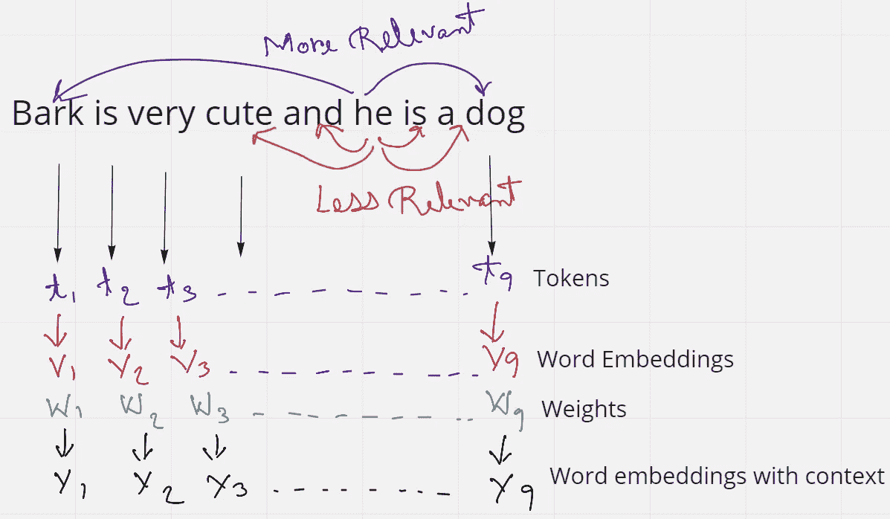
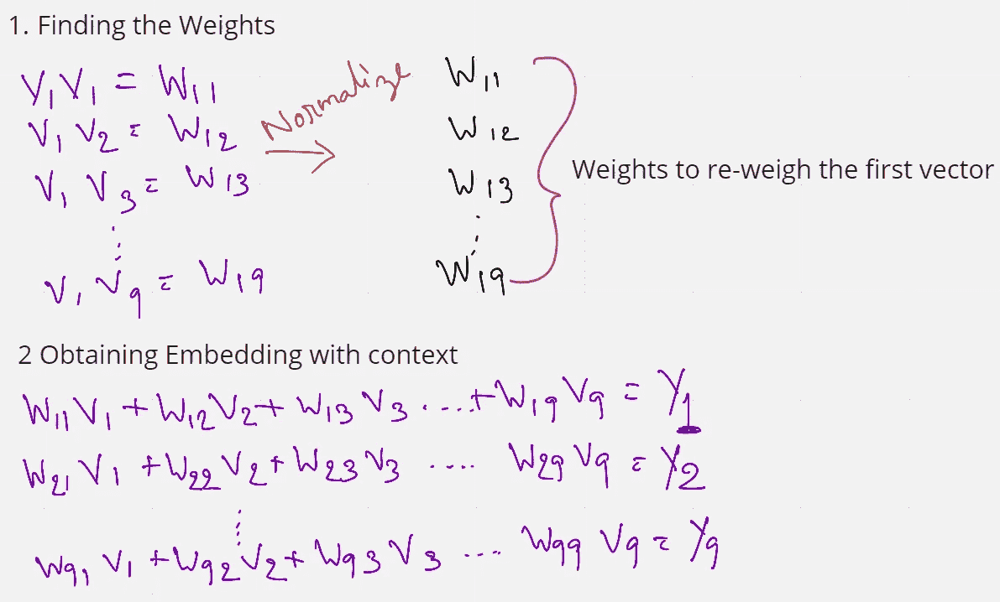
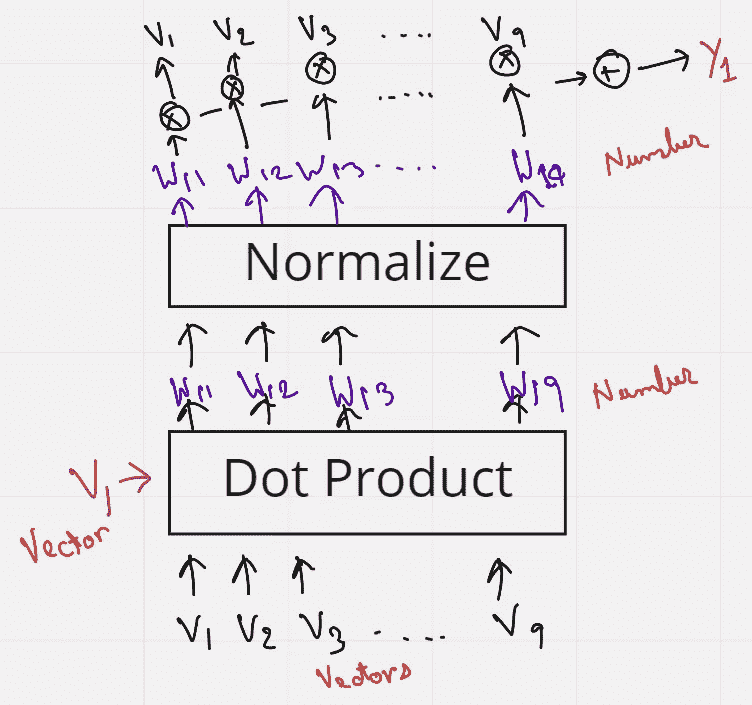
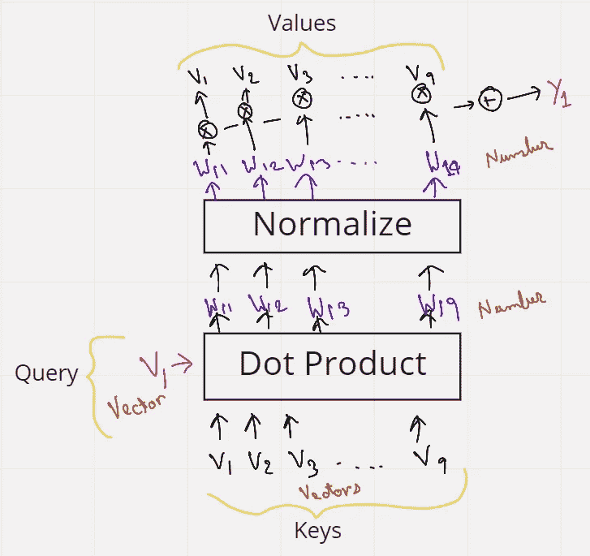
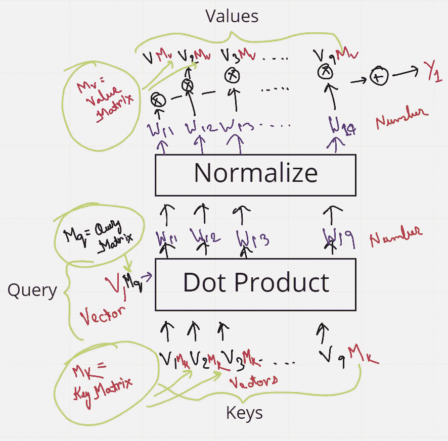
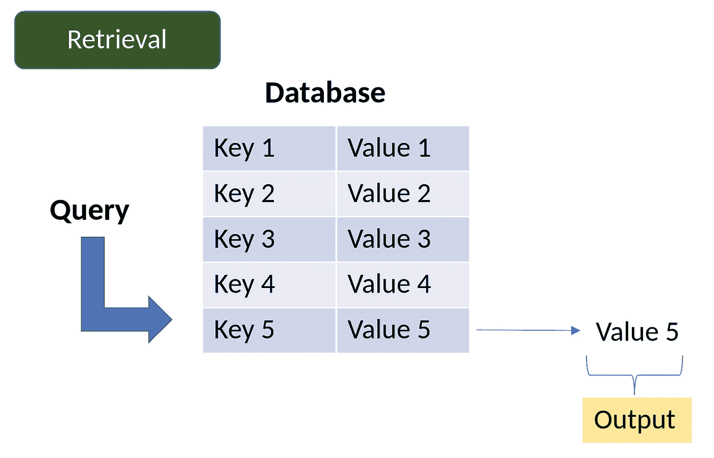
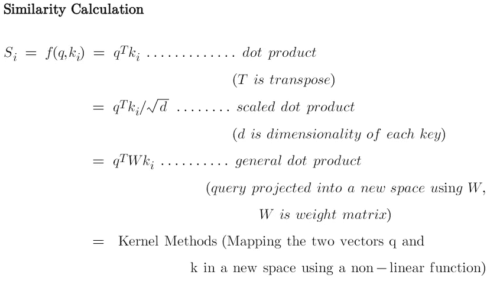
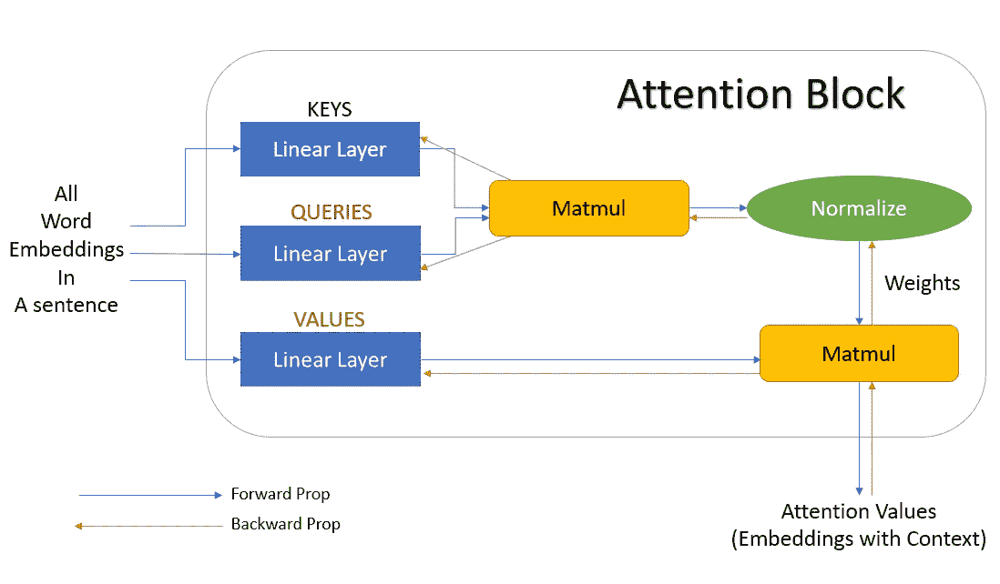
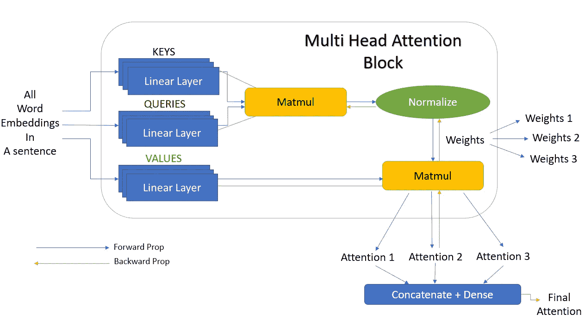

# 关于“注意力”和“变形金刚”你需要知道的一切——深入理解——第 1 部分

> 原文：<https://towardsdatascience.com/all-you-need-to-know-about-attention-and-transformers-in-depth-understanding-part-1-552f0b41d021>

## 注意力、自我注意力、多头注意力和变形金刚

图一。来源:阿瑟尼·托古列夫在 [Unsplash](https://unsplash.com/s/photos/transformers?utm_source=unsplash&utm_medium=referral&utm_content=creditCopyText) 上拍摄的照片

这是一篇很长的文章，谈论了人们需要知道的关于注意力机制的几乎所有事情，包括自我注意、查询、键、值、多头注意、掩蔽多头注意和变形金刚，包括伯特和 GPT 的一些细节。因此，我将文章分为两部分。在本文中，我将介绍所有的关注点，在下一篇文章中，我将深入探讨变压器网络架构。

## 内容:

1.  [rnn 面临的挑战以及变压器模型如何帮助克服这些挑战](#4c16)
2.  [注意机制](#8607)

[2.1 自我关注](#62ce)

[2.2 查询、键和值](#fb36)

[2.3 注意力的神经网络表征](#d43e)

[2.4 多头注意](#9c93)

3.变形金刚(下一个故事继续)

**简介**

注意力机制于 2014 年首次用于计算机视觉，试图理解神经网络在进行预测时正在看什么。这是试图理解卷积神经网络(CNN)输出的第一步。2015 年，注意力首次用于对齐机器翻译中的自然语言处理(NLP)。最后，在 2017 年，注意力机制被用于 Transformer networks 进行语言建模。自那以后，变压器已经超越了递归神经网络(RNNs)的预测精度，成为 NLP 任务的最新技术。

# 1.rnn 面临的挑战以及变压器模型如何帮助克服这些挑战

**1.1 *RNN 问题 1***——遭受长期依赖的问题。rnn 不能很好地处理长文本文档。

**变压器解决方案**—变压器网络几乎只使用关注模块。注意力有助于在序列的任何部分之间建立联系，因此长程相关性不再是问题。对于变压器，长程相关性与任何其他短程相关性一样有可能被考虑在内。

**1.2。 *RNN 问题 2*** —遭遇渐变消失和渐变爆炸。

**变压器解决方案**—几乎没有渐变消失或爆炸问题。在变压器网络中，整个序列是同时训练的，在此基础上只需增加几层。因此渐变消失或爆炸很少是一个问题。

**1.3。 *RNN 问题 3***—rnn 需要更大的训练步长才能达到局部/全局最小值。RNNs 可以被想象成一个展开的非常深的网络。网络的大小取决于序列的长度。这就产生了许多参数，而这些参数中的大多数都是相互关联的。因此，优化需要更长的训练时间和许多步骤。

**变压器解决方案** —比 RNN 需要更少的训练步骤。

**1.4。 *RNN 问题 4*—RNNs 不允许并行计算。GPU 有助于实现并行计算。但是 rnn 是作为顺序模型工作的，即网络中的所有计算都是顺序发生的，不能并行化。**

**变压器解决方案** —变压器网络中的无递归允许并行计算。所以每一步都可以并行计算。

# 2.注意机制

## 2.1 自我关注

图二。解释自我关注的例子(来源:图片由作者创建)

想想这句话——“巴克很可爱，他是一只狗”。这个句子有 9 个单词或标记。如果我们只考虑句子中的单词“he ”,我们会看到“and”和“is”是与它非常接近的两个单词。但是这些词没有给“他”一词任何上下文。相反，单词“Bark”和“dog”在句子中与“he”更相关。从这一点上，我们明白，在一个句子中，邻近并不总是相关的，但上下文更相关。

当这个句子被输入计算机时，它将每个单词视为一个标记 *t，*并且每个标记都有一个单词嵌入 *V* 。但是这些单词嵌入没有上下文。因此，这个想法是应用某种加权或相似性来获得最终的单词嵌入 *Y* ，这比初始嵌入 *V* 具有更多的上下文。

在嵌入空间中，相似的单词看起来靠得更近或者具有相似的嵌入。例如，单词“king”将更多地与单词“queen”和“royalty”相关，而不是与单词“zebra”相关。同样，“斑马”将更多地与“马”和“条纹”相关，而不是与“情感”这个词相关。要了解更多关于嵌入空间的信息，请访问吴恩达的视频( [NLP 和单词嵌入](https://www.youtube.com/watch?v=36XuT5c9qvE))。

所以，直觉上，如果‘国王’这个词出现在句首，而‘女王’这个词出现在句尾，他们应该会给对方提供更好的语境。我们使用这种思想，通过将单词嵌入相乘(点积)来获得更多的上下文，从而找到权重向量 *W，*。因此，在句子*树皮很可爱，他是一只狗，*中，我们没有使用单词嵌入，而是将每个单词的嵌入彼此相乘。图 3 应该能更好地说明这一点。

图 3。寻找权重并获得最终嵌入(来源:图片由作者创建)

正如我们在图 3 中看到的，我们首先通过将第一个单词的初始嵌入与句子中所有其他单词的嵌入相乘(点积)来找到权重。这些权重(W11 到 W19)也被归一化为总和为 1。接下来，这些权重乘以句子中所有单词的初始嵌入。

*W11 V1 + W12 V2 + …W19 V9 = Y1*

W11 到 W19 都是具有第一个单词 V1 的上下文的权重。因此，当我们将这些权重乘以每个单词时，我们实际上是朝着第一个单词的方向重新加权所有其他单词。所以从某种意义上来说，单词'*吠叫*'现在更倾向于单词'*狗*'和'*可爱*'，而不是紧随其后的单词。这在某种程度上提供了一些背景。

对所有单词都重复这一过程，这样每个单词都可以从句子中的其他单词中获得一些上下文信息。

图 4。上述步骤的图示(来源:图片由作者创建)

图 4 使用图示更好地理解了获得 Y1 的上述步骤。

这里有趣的是，没有训练权重，单词的顺序或接近度对彼此没有影响。此外，这个过程与句子的长度无关，也就是说，句子中单词的多与少并不重要。这种给句子中的单词添加一些上下文的方法被称为**自我关注**。

## 2.2 查询、键和值

自我关注的问题是什么都没有被训练。但是，如果我们添加一些可训练的参数，网络就可以学习一些模式，给出更好的上下文。该可训练参数可以是其值被训练的矩阵。因此引入了查询、键和值的概念。

我们再来考虑一下前面的句子——“*树皮很可爱，他是狗*”。在图 4《自我关注》中，我们看到最初的单词嵌入( *V* )被使用了 3 次。1st 作为第一个单词嵌入和句子中所有其他单词(包括本身，2nd)的点积得到权重，然后再乘以(第 3 次)权重，得到最终的带上下文的嵌入。这三个 V 的出现可以由三个术语**查询**、**键**和**值**来代替。

假设我们想让所有的单词都与第一个单词 V1 相似。然后我们发送 V1 作为查询词。然后，这个查询单词将与句子中的所有单词(V1 到第 9 版)进行点积，这些就是关键字。所以查询和键的组合给了我们权重。这些权重然后再次与作为值的所有单词(V1 到 V9)相乘。我们已经有了查询、键和值。如果您仍然有一些疑问，图 5 应该能够消除它们。

图 5。表示查询、键和值(来源:作者创建的图片)

但是等等，我们还没有添加任何可以训练的矩阵。这很简单。我们知道，如果一个 1×k 形状的向量乘以一个 k×k 形状的矩阵，我们得到 1×k 形状的向量作为输出。记住这一点，让我们用形状为 k×k 的矩阵 Mk(键矩阵)乘以从 V1 到 V10 的每个键(形状为 1×k 的每个键)。类似地，查询向量乘以矩阵 Mq(查询矩阵)。，并且值向量乘以值矩阵 Mv。这些矩阵 Mk、Mq 和 Mv 中的所有值现在都可以被神经网络训练，并且给出比仅仅使用自我注意好得多的上下文。为了更好地理解，图 6 展示了我刚才解释的内容的图示。

图 6。键矩阵、查询矩阵和值矩阵(来源:图片由作者创建)

现在我们知道了键、查询和值的直觉，让我们看一个数据库分析和 Attention 背后的官方步骤和公式。

让我们通过研究一个数据库的例子来理解注意力机制。因此，在一个数据库中，如果我们想要基于一个**查询** q 和**键** k *i 和*来检索某个**值** v *i* ，我们可以使用一个查询来识别对应于某个值的键，这样就可以完成一些操作。注意力可以被认为是一个类似于这种数据库技术的过程，但是以一种更加概率化的方式。下图展示了这一点。

图 7 显示了在数据库中检索数据的步骤。假设我们向数据库发送一个查询，一些操作会找出数据库中哪个键与查询最相似。一旦找到键，它将把对应于该键的值作为输出发送出去。在图中，操作发现查询与键 5 最相似，因此输出值 5。

图 7。数据库中的值检索过程(来源:作者创建的图片)

注意力机制是一种模仿这种提取过程的神经结构。

1.  注意机制测量查询 q 和每个键值 k *i.* 之间的相似性
2.  这种相似性返回每个键值的权重。
3.  最后，它产生一个输出，这个输出是我们数据库中所有值的加权组合。

数据库检索和注意力在某种意义上的唯一区别是，在数据库检索中我们只得到一个值作为输入，但在这里我们得到的是值的加权组合。在注意机制中，如果一个查询与关键字 1 和关键字 4 最相似，那么这两个关键字将获得最大的权重，并且输出将是值 1 和值 4 的组合。

F 图 8 显示了从查询、键和值获得最终关注值所需的步骤。下面详细解释了每个步骤。

(键值 *k* 为向量，相似度值 *S* 为标量，权值(softmax)值 *a* 为标量，值 *V* 为向量)

图 8。获得关注值的步骤(来源:图片由作者创作)

## 第一步。

步骤 1 包含关键字和查询以及各自的相似性度量。查询 *q* 影响相似度。我们有查询和键，我们计算相似度。相似性是查询 *q* 和键 *k* 的某个函数。查询和键都是一些嵌入向量。相似性 *S* 可以使用各种方法计算，如图 9 所示。

图 9。计算相似度的方法(来源:作者创建的图像)

相似性可以是查询和关键字的简单点积。可以定标点积，其中 *q* 和 *k、*的点积除以每个键的维数的平方根、 *d、*这是最常用的两种寻找相似性的技术。

通常，通过使用权重矩阵 *W，*将查询投影到新的空间，然后使用关键字 *k* 进行点积。内核方法也可以作为一种相似。

## 第二步。

第二步是找到重量*和*。这是通过使用' *SoftMax* '完成的。公式如下所示。(exp 是指数型的)

相似性像完全连接的层一样连接到权重。

## 第三步。

步骤 3 是 softmax ( *a* )的结果与相应值( *V* )的加权组合。 *a* 的第一个值与 *V* 的第一个值相乘，然后与 *a* 的第二个值与值 *V* 的第二个值的乘积相加，依此类推。我们获得的最终输出是所期望的关注值。

**三个步骤的总结:**

W **在查询 *q* 和关键字 *k* 的帮助下，我们获得关注值，这是值 *V、*的加权和/线性组合，权重来自查询和关键字之间的某种相似性。**

## 2.3 注意的神经网络表征

图 10。注意块的神经网络表示(来源:图片由作者创建)

图 10 显示了注意块的神经网络表示。单词嵌入首先被传递到一些线性层中。这些线性层没有“偏差”项，因此只是矩阵乘法。其中一层称为“键”，另一层称为“查询”，最后一层称为“值”。如果在键和查询之间执行矩阵乘法，然后归一化，我们就得到权重。然后将这些权重乘以这些值，并求和，得到最终的注意力向量。这个模块现在可以用于神经网络，被称为注意模块。可以添加多个这样的关注块来提供更多的上下文。最好的部分是，我们可以得到一个梯度反向传播来更新注意块(键、查询、值的权重)。

## 2.4 多头关注

为了克服使用单一注意力的一些缺陷，使用了多头注意力。让我们回到那句话——“*树皮很可爱，他是狗*”。在这里，如果我们用“狗”这个词，从语法上来说，我们理解“吠”、“可爱”和“他”应该与“狗”这个词有某种意义或关联。这几个字说的是狗的名字叫 Bark，是公狗，是可爱的狗。仅仅一个注意机制可能不能正确地识别这三个词与“狗”相关，我们可以说三个注意在这里更好地用单词“狗”来表示这三个词。这减少了寻找所有重要单词的注意力负担，也增加了容易找到更多相关单词的机会。

因此，让我们添加更多的线性层作为键、查询和值。这些线性层是并行训练的，并且彼此具有独立的权重。所以现在，每个值、键和查询给我们三个输出，而不是一个。这三个键和查询现在给出了三种不同的权重。这三个权重然后用矩阵与这三个值相乘，以给出三个倍数输出。这三个注意块最终被连接起来，以给出一个最终的注意输出。这种表示如图 11 所示。

图 11。具有 3 个线性层的多头注意力(来源:图片由作者创建)

但 3 只是我们选的一个随机数。在实际场景中，这些可以是任意数量的线性层，这些被称为头部( *h* )。也就是说，可以有 *h* 个线性层给出 *h* 个注意力输出，然后将它们连接在一起。而这也正是它被称为多头注意力(multi-head)的原因。图 11 的更简单版本，但是图 12 中示出了具有 *h* 数量的头部。

图 12。具有“h”层的多头注意力(来源:图片由作者创建)

现在，我们已经了解了注意力、查询、键、值和多头注意力背后的机制和思想，我们已经涵盖了变压器网络的所有重要构建模块。在下一个故事中，我将讲述所有这些模块如何堆叠在一起形成变压器网络，并讲述一些基于变压器的网络，如伯特和 GPT。

## 参考资料:

*Ashish Vaswani、Noam Shazeer、Niki Parmar、Jakob Uszkoreit、Llion Jones、Aidan N. Gomez、ukasz Kaiser 和 Illia Polosukhin。2017.你需要的只是关注。《第 31 届国际神经信息处理系统会议录》(NIPS'17)。美国纽约州红钩市柯伦联合有限公司，邮编 6000–6010。*