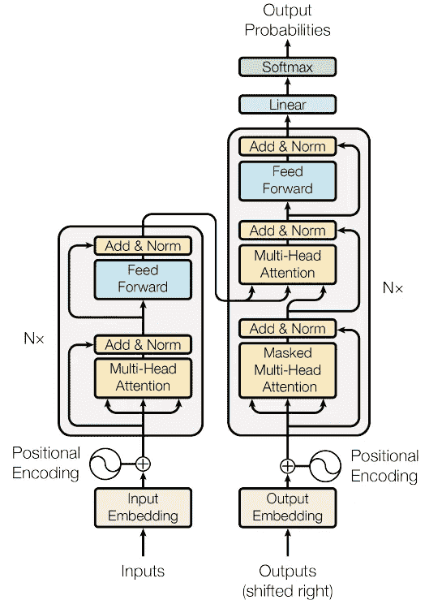
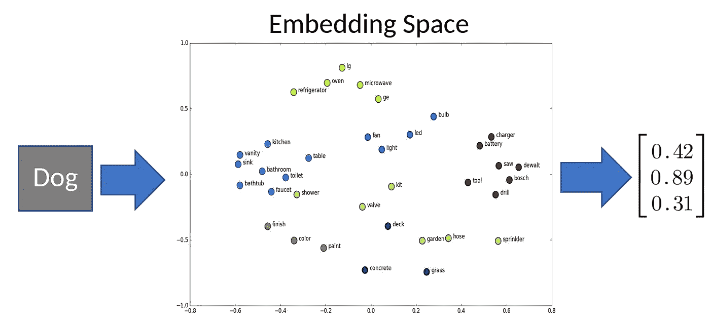
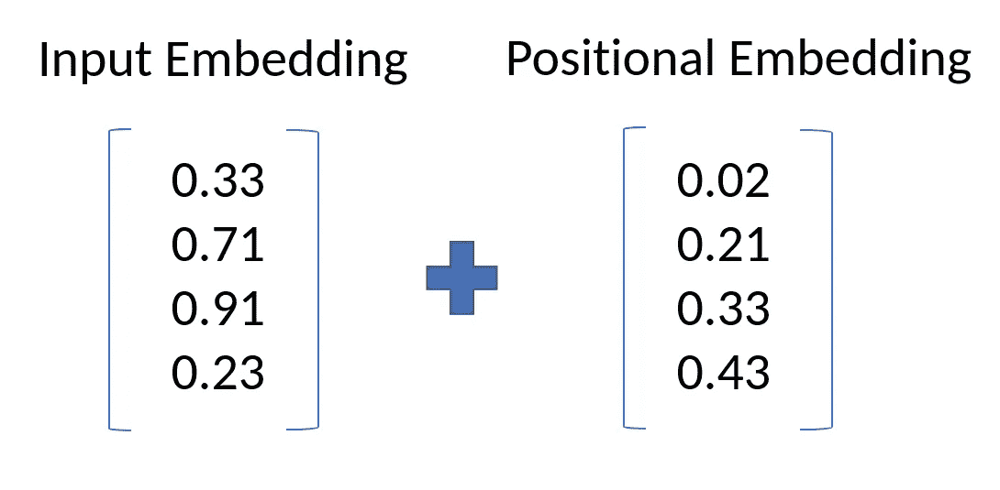
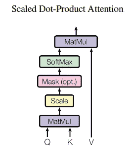
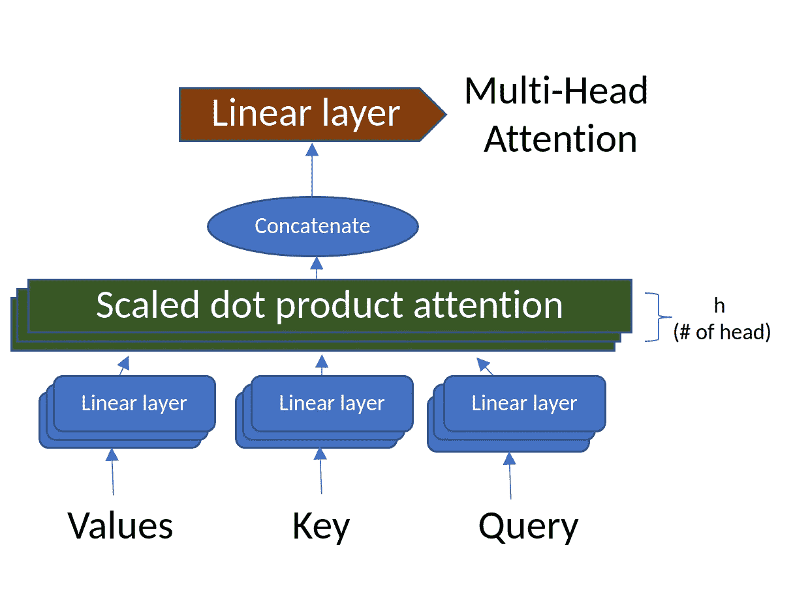
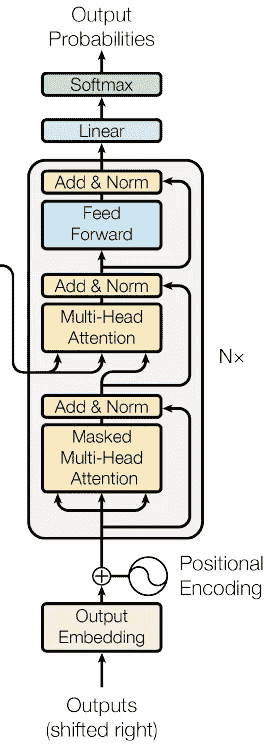
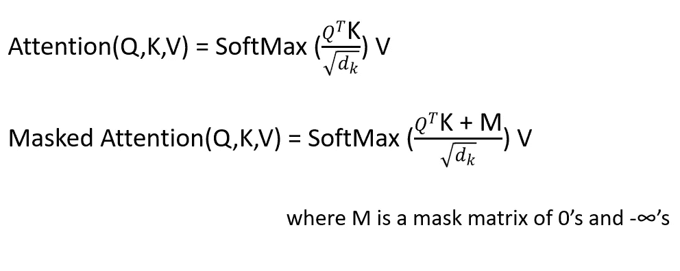
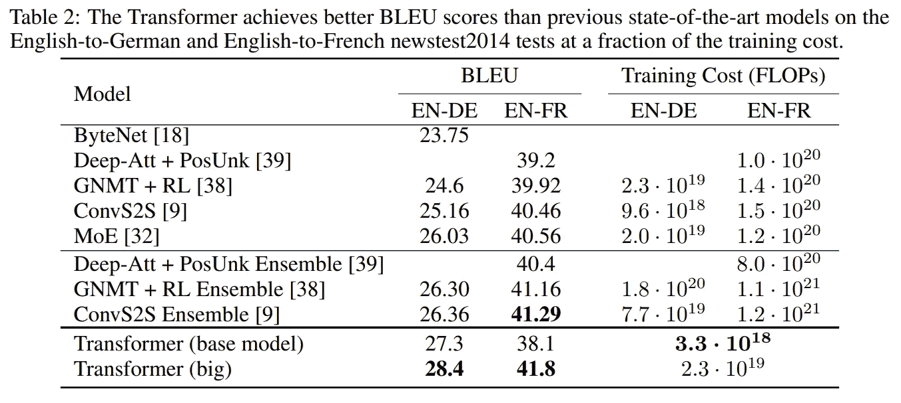

# 关于“注意力”和“变形金刚”你需要知道的一切——深入理解——第二部分

> 原文：<https://towardsdatascience.com/all-you-need-to-know-about-attention-and-transformers-in-depth-understanding-part-2-bf2403804ada>

## 注意、自我注意、多头注意、蒙面多头注意、变形金刚、伯特和 GPT

在前面的故事中，我已经解释了什么是注意力机制，以及与变形金刚相关的一些重要关键字和块，如自我注意力、查询、键和值以及多头注意力。

## **要了解关于这些话题的更多信息，请访问本故事的第一部分—** [**【你需要知道的关于‘注意力’和‘变形金刚’的一切—深入了解—第一部分**](/all-you-need-to-know-about-attention-and-transformers-in-depth-understanding-part-1-552f0b41d021) **。**

在这一部分，我将解释这些注意力块如何帮助创建变压器网络，并详细讨论网络中的所有块。

# 内容:

1.  [rnn 面临的挑战以及变压器模型如何帮助克服这些挑战](/all-you-need-to-know-about-attention-and-transformers-in-depth-understanding-part-1-552f0b41d021#4c16)(在第 1 部分中讨论)
2.  [注意机制](/all-you-need-to-know-about-attention-and-transformers-in-depth-understanding-part-1-552f0b41d021#8607) —自我注意、查询、键、值、多头注意(在第 1 部分中讨论)
3.  变压器网络
4.  GPT 基础知识(将在第 3 部分中介绍)
5.  BERT 的基础知识(将在第 3 部分讨论)

# 3.变压器网络

论文— [关注是你所需要的全部](https://arxiv.org/abs/1706.03762) (2017)

图一。变形金刚网络(来源:图片来自原论文)

图 1 显示了变压器网络。这个网络已经取代 RNNs 成为 NLP 甚至是计算机视觉中的最佳模型( [*视觉变形金刚*](https://medium.com/towards-data-science/are-transformers-better-than-cnns-at-image-recognition-ced60ccc7c8) )。

该网络包含两部分——编码器和解码器。

在机器翻译中，编码器用于对初始句子进行编码，解码器用于产生翻译后的句子。转换器的编码器可以并行处理整个句子，比 RNNs 更快更好，RNNs 一次处理一个单词。

## 3.1 编码器模块

图二。变压器网络的编码器部分(来源:图片来自原论文)

编码器网络从输入开始。在这里，整个句子是一次输入的。然后，它们被嵌入到“**输入嵌入**模块。然后将一个“**位置编码**加到句子中的每个单词上。这种编码对于理解每个单词在句子中的位置至关重要。如果没有位置嵌入，该模型会将整个句子视为一个装满单词的袋子，没有任何顺序或意义。

**详细:**

**3.1.1 输入嵌入** —句子中的单词‘dog’可以利用嵌入空间获得一个向量嵌入。嵌入只是将任何语言中的一个单词转换成它的向量表示。图 3 显示了一个例子。在嵌入空间中，相似的词具有相似的嵌入，例如，单词' cat '和单词' kitty '在嵌入空间中会落得很近，而单词' cat '和' emotion '在空间中会落得更远。

图 3。输入嵌入(来源:作者创建的图像)

**3.1.2 位置编码**

一个词在不同的句子中可能有不同的意思。比如 a 中的狗这个词，我拥有一只可爱的狗(动物/宠物—位置 5)b .你是一只多么懒的狗啊！(不值钱——位置 4)，有不同的含义。来帮助使用位置编码。它是一个向量，根据单词在句子中的上下文和位置给出信息。

在任何一个句子中，单词都是一个接一个地出现，具有重要的意义。如果句子中的单词杂乱无章，那么这个句子就没有意义。但是当转换器加载句子时，它不是按顺序而是并行加载。由于 transformer 架构不包括并行加载时单词的顺序，因此我们必须明确定义单词在句子中的位置。这有助于转换者理解句子中一个单词在另一个单词之后。这就是位置嵌入派上用场的地方。这是一种定义单词位置的矢量编码。这种位置嵌入在进入注意力网络之前被添加到输入嵌入中。图 4 给出了输入嵌入和位置嵌入在输入到注意力网络之前的直观理解。

图 4。对位置嵌入的直观理解(来源:图片由作者创建)

有多种方式来定义这些位置嵌入。例如，在最初的论文[中，作者使用正弦和余弦交替函数来定义嵌入，如图 5 所示。](https://arxiv.org/abs/1706.03762)

图 5。原始文件中使用的位置嵌入(来源:原始文件中的图像)

尽管这种嵌入在文本数据上工作得很好，但在图像数据上却不行。所以一个物体(文本/图像)的位置可以有多种嵌入方式，可以固定，也可以在训练中学习。基本思想是，这种嵌入允许 transformer 架构理解单词在句子中的位置，而不是通过混淆单词来弄乱意思。

在字/输入嵌入和位置嵌入完成之后，嵌入然后流入编码器的最重要部分，该部分包含两个重要的块——一个'**多头关注**块和一个'**前馈**网络。

**3.1.3 多头关注**

这是奇迹发生的主要街区。要了解多头注意力，请访问此链接— [2.4 多头注意力](/all-you-need-to-know-about-attention-and-transformers-in-depth-understanding-part-1-552f0b41d021#9c93)。

作为输入，这个模块接收一个包含子向量(句子中的单词)的向量(句子)。多头注意力然后计算每个位置与向量的每隔一个位置之间的注意力。

图 6。成比例的点积注意力(来源:图片来自原论文)

上图显示了成比例的点积注意力。这与自我关注完全相同，只是增加了两个模块(比例和遮罩)。要详细了解 Sef-Attention，请访问此链接— [2.1 自我关注](/all-you-need-to-know-about-attention-and-transformers-in-depth-understanding-part-1-552f0b41d021#62ce)。

如图 6 所示，比例注意力完全相同，只是在第一次矩阵乘法(Matmul)后增加了一个比例。

缩放比例如下所示，

缩放后的输出进入遮罩层。这是一个可选层，对机器翻译很有用。

图 7。关注区块(来源:图片由作者创建)

图 7 显示了注意块的神经网络表示。单词嵌入首先被传递到一些线性层中。这些线性层没有“偏差”项，因此只是矩阵乘法。其中一层称为“键”，另一层称为“查询”，最后一层称为“值”。如果在键和查询之间执行矩阵乘法，然后归一化，我们就得到权重。然后将这些权重乘以这些值，并求和，得到最终的注意力向量。这个模块现在可以用于神经网络，被称为注意模块。可以添加多个这样的关注块来提供更多的上下文。最好的部分是，我们可以得到一个梯度反向传播来更新注意块(关键字、查询、值的权重)。

多头注意力接收多个键、查询和值，通过多个按比例缩放的点积注意力块进行馈送，最后将注意力连接起来，给出最终输出。这如图 8 所示。

图 8。多头关注(来源:图片由作者创作)

更简单的解释是:主向量(句子)包含子向量(单词)——每个单词都有位置嵌入。注意力计算将每个单词视为一个'*查询*，并找到与句子中其他一些单词相对应的一些'*键*，然后取对应的'*值*的凸组合。在多头注意力中，选择多个值、查询和键，这提供了多重注意力(更好的单词嵌入上下文)。这些多重关注被连接以给出最终关注值(来自所有多重关注的所有单词的上下文的组合)，这比使用单个关注块要好得多。

在 simple words 中，多头关注的想法是采用一个单词嵌入，使用关注(或多重关注)将其与其他一些单词嵌入(或多个单词)相结合，以产生该单词的更好嵌入(嵌入周围单词的更多上下文)。

*想法是用不同的权重计算每个查询的多个关注度。*

**3.1.4 增加&定额和前馈**

下一个块是' **Add & Norm** ，它接受原始单词嵌入的剩余连接，将其添加到来自多头关注的嵌入，然后将其归一化为具有零均值和方差 1。

这被输入到一个“**前馈**模块，该模块在其输出端也有一个“添加&标准”模块。

在编码器块中，整个多头注意力和前馈块重复 n 次(超参数)。

## 3.2 解码器模块

图 9。变压器网络的解码器部分(来源:图片来自原论文)

编码器的输出也是一系列嵌入，每个位置一个嵌入，其中每个位置嵌入不仅包含原始单词在该位置的嵌入，还包含关于其它单词的信息，它使用注意力学习这些信息。

然后馈入变压器网络的解码器部分，如图 9 所示。解码器的目的是产生一些输出。在论文中，注意力是你所需要的，这个解码器被用于句子翻译(比如从英语到法语)。所以编码器会接收英语句子，解码器会把它翻译成法语。在其他应用中，网络的解码器部分是不必要的，因此我不会对此进行过多阐述。

解码器模块中的步骤—

1.  在句子翻译中，解码器模块接收法语句子(用于英语到法语的翻译)。像编码器一样，这里我们添加了一个单词嵌入和一个位置嵌入，并将其馈送到多头注意块。

2.自我关注模块将为法语句子中的每个单词生成一个关注向量，以显示句子中一个单词与另一个单词的相关程度。

3.然后将来自法语句子的注意力向量与来自英语句子的注意力向量进行比较。这是英语到法语单词映射发生的部分。

4.在最后一层，解码器预测将英语单词翻译成最可能的法语单词。

5.整个过程重复多次，以获得整个文本数据的翻译。

图 10 显示了用于上述每个步骤的模块。

图 10。不同解码块在句子翻译中的作用(来源:图片由作者创建)

解码器中有一个新的模块——掩蔽多头注意力。所有其他模块，我们之前已经在编码器中看到过。

**3.2.1 掩蔽多头注意**

这是一个多头注意力块，其中一些值被屏蔽。屏蔽值的概率无效或不被选择。

例如，在解码时，输出值应该只取决于以前的输出，而不是将来的输出。然后我们掩盖未来的输出。

## 3.3 结果和结论

图 11。结果(来源:图片来自原始论文)

本文比较了英语到德语和英语到法语的语言翻译，以及其他最先进的语言模型。BLEU 是一种用于语言翻译比较的度量标准。从图 11 中，我们看到 big Transformer 模型在两种翻译任务中都获得了较高的 BLEU 分数。他们还显著改善了培训成本。

*总之，变压器模型可以降低计算成本，同时仍能获得最先进的结果。*

在这一部分，我解释了变压器网络的编码器和解码器模块，以及每个模块在语言翻译中是如何使用的。在下一个也是最后一个部分(第 3 部分)，我将讨论一些最近变得非常著名的重要变压器网络，如 BERT(变压器的双向编码器表示)和 GPT(通用变压器)。

# 参考资料:

*阿什什·瓦斯瓦尼、诺姆·沙泽尔、尼基·帕尔马、雅各布·乌兹科雷特、利翁·琼斯、艾丹·戈麦斯、祖卡斯·凯泽和伊利亚·波洛苏欣。2017.你需要的只是关注。《第 31 届国际神经信息处理系统会议录》(NIPS'17)。美国纽约州红钩市柯伦联合有限公司，邮编 6000–6010。*