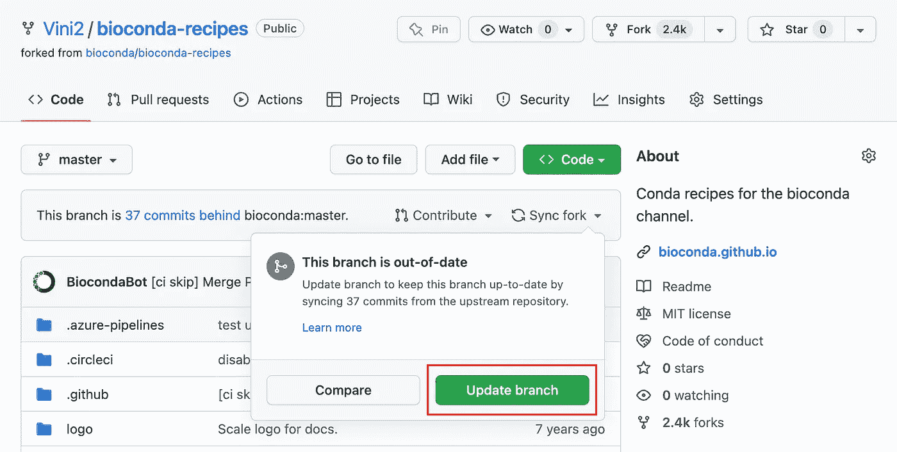
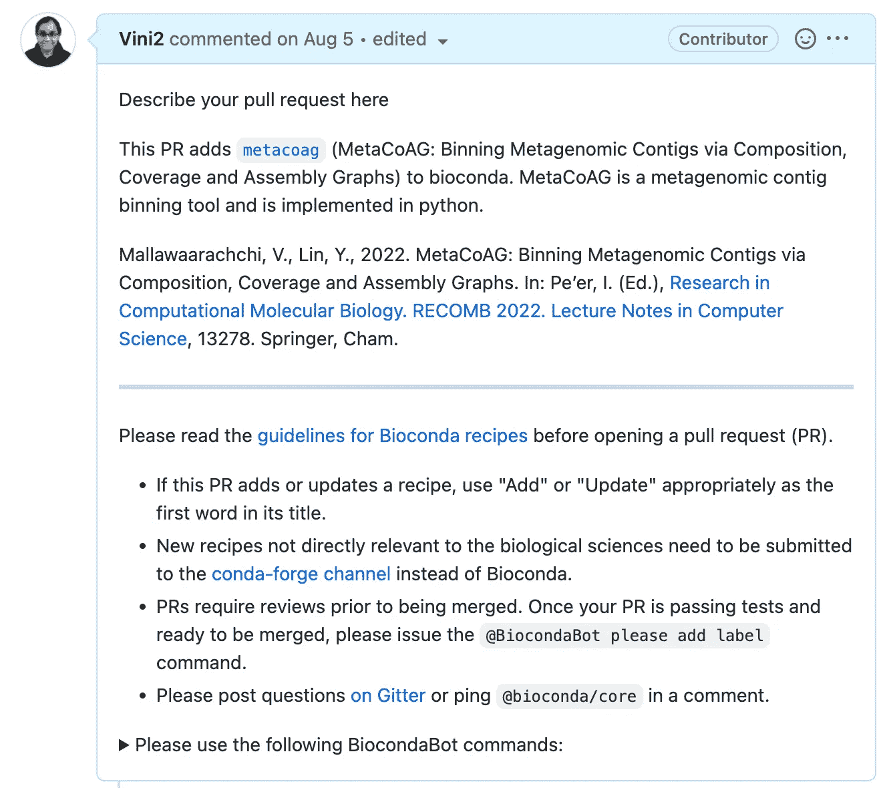

# 关于在 Bioconda 上发布软件，您需要知道的是

> 原文：<https://towardsdatascience.com/all-you-need-to-know-about-publishing-software-on-bioconda-680d48e52868>

## 在 Bioconda 上发布与生物信息学相关的 Python 包

你在安装包和运行大量命令来安装依赖项时遇到过困难吗？如果您幸运的话(大多数情况下您不会幸运)，您将在没有任何依赖问题或版本冲突的情况下完成软件包的安装。在跨学科领域的工作让我意识到让这些工具运行起来有多难，除非你知道从编程的角度来看实际上发生了什么。您希望这些工具与所有依赖项捆绑在一起，并且可以在不与您已经安装的工具冲突的情况下安装/运行。

不要害怕——我亲爱的读者们！包装经理将前来救援！这些是软件工具，像 [**【康达】**](https://docs.conda.io/en/latest/) 和 [**pip**](https://pypi.org/project/pip/) ，它们以一致的方式自动化安装、维护和删除程序的过程。将您的软件包放在这样的存储库中有助于您的用户轻松安装它。它也增加了你的包裹的可见性和可及性。在本文中，我将通过示例代码片段、模板和最佳实践向您介绍如何在 **bioconda** 上发布与生物信息学相关的 Python 包。


bioconda-recipes GitHub 知识库(作者截图)

# Bioconda 和配方

我的社区(包括我自己😃)爱 [bioconda](https://bioconda.github.io/) ！Bioconda 允许您使用 [conda](https://docs.conda.io/en/latest/) 软件包管理器安装与生物医学研究相关的软件包。Bioconda 基本上是一个 [*通道*](https://docs.conda.io/projects/conda/en/latest/user-guide/concepts/channels.html) (它是存储软件包的位置)，其中有 [*配方*](https://docs.conda.io/projects/conda-build/en/stable/concepts/recipe.html) ，这些配方包含已发布软件包的元数据。我们必须创建一个类似的配方，并将其添加到 bioconda 频道。假设你有一个 GitHub 账号，并且已经安装了 [Miniconda 或者 Anaconda](https://docs.anaconda.com/anaconda/install/) ，那就让我们开始吧。

# 步骤 1:设置 bioconda 配方库

如果这是你第一次在 bioconda 上发布，你必须建立你的[**bio conda-recipes**](https://github.com/bioconda/bioconda-recipes)库。

[](https://github.com/bioconda/bioconda-recipes)  

点击 [**此处**](https://github.com/bioconda/bioconda-recipes/fork) 创建 bioconda-recipes 库的分支。

现在使用以下命令创建存储库的本地克隆。确保用你的 GitHub 用户名替换`<USERNAME>`。

```
git clone https://github.com/<USERNAME>/bioconda-recipes.git
```

然后添加主 bioconda-recipes repo 作为上游遥控器，这样就可以很容易地更新所做的更改。

```
cd bioconda-recipes
git remote add upstream https://github.com/bioconda/bioconda-recipes.git
```

如果在制作副本后对原始存储库进行了更改，您可以使用以下命令更新您的本地副本。

```
git checkout master
git pull upstream master
git push origin master
```

您可以访问 GitHub 存储库，检查您的 fork 是否与原始存储库保持一致。



检查你的叉子是否是最新的(作者截图)

# 步骤 2:创建一个分支

建议您创建自己的分支进行工作。假设您的工具名称是`mytool`，让我们使用下面的命令创建一个分支。随意用你的工具名替换`mytool`。

```
git checkout -b mytool
```

# 第三步:制作你的食谱

配方将包含一个包含配方中所有元数据的`meta.yaml`文件。通常，对于一个纯 Python 包来说，拥有这个文件就足够了。如果您需要编译更多的包(例如 C/C++包)或导出路径，这些应该添加到 macOS 和 Linux 的`build.sh`文件或 Windows 的`bld.bat`文件中。

让我们从食谱目录开始。

```
cd recipes
```

## 使用`conda skeleton`创建配方

如果您已经在 [Python 包索引(PyPI)](https://pypi.org/) 中有了您的包，您可以使用如下的`conda skeleton`命令自动创建一个模板。以下命令将创建一个名为`mytool`的文件夹，其中包含一个`meta.yaml`文件。

```
conda skeleton pypi mytool
```

## 创造你自己的食谱

如果您的代码应该从 GitHub 库中下载并编译，那么您应该在 GitHub 上发布一个版本。这里有一个模板，假设你的包遵循[基本 Python 包结构](https://packaging.python.org/en/latest/guides/distributing-packages-using-setuptools/)。请确保更改`<USERNAME>`、`mytool`和版本号，以匹配您的 GitHub 帐户和软件包详细信息。

```



package:
  name: "{{ name|lower }}"
  version: "{{ version }}"

source:
  url: "https://github.com/<USERNAME>/{{ name }}/archive/v{{ version }}.tar.gz"
  sha256: 8e87ae23bd81b842b95d778291d9379b2d89936c14dbb8216ac9cb2d7104c87a

build:
  number: 0
  noarch: python
  entry_points:
    - myutil=mytool_utils.myutil:main
  script:
    - {{ PYTHON }} -m pip install . --no-deps -vv

requirements:
  build:
    - {{ compiler('cxx') }}
  host:
    - pip
    - python >=3.8
  run:
    - python >=3.8
    - biopython
    - pysam
    - networkx
    - scipy
    - numpy
    - tqdm

test:
  commands:
    - mytool --help

about:
  home: "https://github.com/<USERNAME>/mytool"
  license: MIT
  license_file: LICENSE
  summary: "mytool: This is a test"
  doc_url: "https://mytool.readthedocs.io/"
  dev_url: "https://github.com/<USERNAME>/mytool"

extra:
  recipe-maintainers:
    - <USERNAME>
  identifiers:
    - doi:10.10943/myjournal
```

从`package`下的包的名称和版本开始。

然后你要指向`source`下的发布。确保添加具有正确 SHA256 校验和的正确 URL。您可以使用以下命令获得源代码的 SHA256 校验和。

```
name=<your_repo_name>
version=<release_version>
url=https://github.com/<USERNAME>/$name/archive/v$version.tar.gz
wget -O- $url | shasum -a 256
```

在`build`下，您必须提供构建号(从 0 开始)、平台和构建命令(这里我为`setup.py`添加了构建命令)。这里我定义了`noarch: python`，意思是这是一个纯 python [**noarch** 包](https://www.anaconda.com/blog/condas-new-noarch-packages)，它不包含**任何操作系统特定的文件**。如果您想从命令行调用定制脚本，您可以将它们添加到`entry-points`下，这将通过识别要运行的 Python 函数来定义 shell 命令(在我们的示例中是`main`)。

然后，您必须在`requirements`下指定编译器、预处理器、Python 版本和依赖项(如果需要，可以固定特定的版本)。固定包版本时，包及其版本约束必须用空格分隔(例如，`python >=3.8`)。

接下来，您可以在`tests`中的`commands`下指定一个命令来测试安装。我通常调用我的工具的帮助命令。确保这些测试命令快速而简单。

然后，您可以在`about`下添加关于软件包的详细信息，如主页 URL、文档 URL、许可类型、许可文件和工具摘要。

最后，您可以在`recipe-maintainers`中添加您的 GitHub 用户名，在`extra`下的`identifiers`中添加出版物的 DOI。

如果你想阅读更多关于`meta.yaml`文件的细节，请查看[官方 bioconda 文档](https://bioconda.github.io/tutorials/gcb2020.html#meta-yaml-sections)。

[](https://bioconda.github.io/tutorials/gcb2020.html#meta-yaml-sections)  

## 建议:看看别人的食谱

如果你不知道如何制作食谱，可以看看其他的食谱，比如你可以使用的代码，然后复制到你自己的食谱目录中。这里有一些很棒的食谱示例。

*   [Phanotate](https://github.com/bioconda/bioconda-recipes/tree/master/recipes/phanotate) —从 PyPI 下载
*   [Physpy](https://github.com/bioconda/bioconda-recipes/tree/master/recipes/phispy) —从 PyPI 下载
*   [Samtools](https://github.com/bioconda/bioconda-recipes/tree/master/recipes/samtools) —从 GitHub 下载
*   [Hecatomb](https://github.com/bioconda/bioconda-recipes/tree/master/recipes/hecatomb) —从 GitHub 下载

您可以使用以下命令检查您的更改。

```
git status
```

# 步骤 4:提交和推送更改

您可以提交您的更改，并将它们从您的`mytool`分支推送到您分叉的 GitHub 存储库。

```
git add mytool
git commit -m 'Add mytool v0.1.0'
git push --set-upstream origin mytool
```

# 步骤 5:创建一个拉取请求

现在转到你分叉的 GitHub 库，你会看到一条消息说`This branch is 1 commit ahead [...] bioconda:master`。您将看到一个名为**拉动请求**的按钮，点击它并按照说明操作。您应该添加描述您的拉动式请求。这是我为了添加我的一个工具而创建的一个[拉请求。如果您的包有出版物，请确保也添加这些详细信息。](https://github.com/bioconda/bioconda-recipes/pull/36256)



创建信息性拉取请求(作者截图)

一旦您创建了拉取请求，bioconda 构建系统将开始测试您的更改。如果你非常幸运，你不会有任何问题，你的构建会通过。如果没有，请编辑您的配方来解决问题，并将更改再次推送到您的分支(一次又一次)。

当您的构建“变绿”并且所有检查都通过时，您可以发出`@BiocondaBot please add label`命令。

# 步骤 6:测试构建

同时，您可以发出命令`@BiocondaBot please fetch artifacts`来获取到 CI 构建的包/容器的链接。您可以下载这些构建，并使用它们在本地测试包。下载完构建之后，创建一个新的 conda 环境(不要安装在您的`base`环境中),只需运行下面的命令来安装您的包。确保将`<build_file_name>`替换为您下载的`.tar.bz2`文件的名称。

```
conda install -c packages <build_file_name>
```

现在，您可以使用以下命令测试您的安装。

```
# show the location of the executable
which mytool

# print the version
mytool --version

# print the help message
mytool --help
```

如果您已经设置了测试用例，您可以运行它们来确保您的包端到端地正确工作。我通常做这个测试，并在 pull 请求上发布输出，以显示一切正常。这是我在一个拉请求中发布的一个[测试运行](https://github.com/bioconda/bioconda-recipes/pull/36256#issuecomment-1206012532)。

如果一切顺利，来自 bioconda 团队的某人将批准您的拉取请求，并且更改将被合并到主存储库中。

# 最后的想法

Bioconda 仅支持来自`defaults`、`conda-forge`和`bioconda`渠道的依赖。因此，如果您有来自任何其他通道的依赖项，就没有办法在`meta.yaml`文件中指定它们，并且您的配方将无法通过构建(仍然有[未解决的问题](https://github.com/conda/conda-build/issues/532))。在这种情况下，您将不得不在您自己的频道上发布您的包，我们将在以后的文章中讨论这一点。

希望这篇文章对你在 bioconda 上发布自己的生物信息学软件有用。请随意浏览 [bioconda 教程](https://bioconda.github.io/tutorials/index.html)了解更多详情。

快乐包装-出版！

干杯！

# 参考

[1] **初始设置— Bioconda 文件**可在[https://bioconda.github.io/contributor/setup.html](https://bioconda.github.io/contributor/setup.html)获得

[2] **投稿工作流程— Bioconda 文档**可在[https://bioconda.github.io/contributor/workflow.html](https://bioconda.github.io/contributor/workflow.html)获得

[3] **教程— Bioconda 文档**可在 https://bioconda.github.io/tutorials/index.html[获得](https://bioconda.github.io/tutorials/index.html)

[4]我在发布包时遇到的个人问题😁