# 几乎任何图像都只有 8k 矢量

> 原文：<https://towardsdatascience.com/almost-any-image-is-only-8k-vectors-c68c1b1aa6d2>

## 一种图像表示，与生成性任务中的单词非常相似

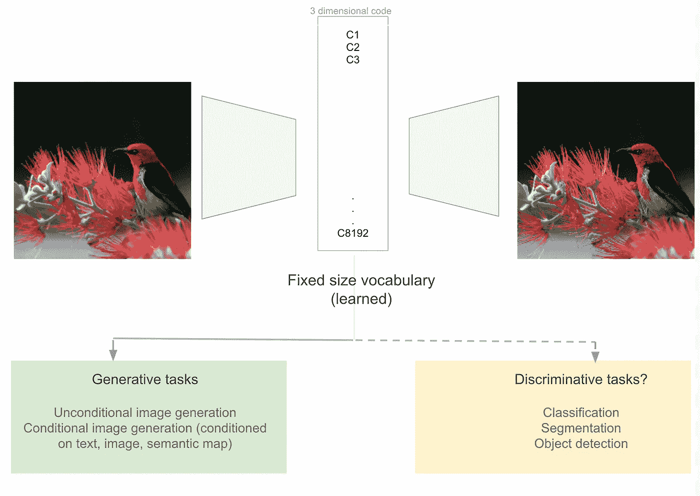

图一。不仅自动编码器的一些变体家族在图像的重建保真度方面有了显著提高，而且编码器现在还可以压缩输入图像并将其映射到固定的学习向量词汇表。这使得能够使用这种固定的词汇将图像表示为令牌流，用于图像的自我监督学习，就像我们在 NLP 中所做的那样。此外，这种降维表示还减轻了下游模型的负担，以便在没有信息损失的情况下进行比特压缩以及语义特征提取。然而，输入图像的固定词汇映射主要用于生成任务。迄今为止，还没有人尝试用同样的方法来完成区别性任务。如果这被证明是成功的，这样的词汇将有资格作为图像的模拟词。这篇文章研究了两种将输入映射到固定词汇的候选方法，其中一种非常有前途——它将输入图像(左边的鸟)映射到 8192 个学习向量的固定词汇(分布式表示)。这 8192 个向量的组合然后被馈送到解码器，该解码器几乎没有感知损失地重建原始图像(右边的鸟)。左边一只鸟的图像来自[的 DIV2k 数据集](https://data.vision.ee.ethz.ch/cvl/DIV2K/)。这篇文章使用了来自 [DIV2K 数据集的图片，并得到了作者的明确许可。谢谢拉杜蒂莫夫特](https://people.ee.ethz.ch/~timofter/publications/Agustsson-CVPRW-2017.pdf) **。**

# **概述**

寻找问题**“图像中文字的模拟是什么？”**似乎大体上沿着两条路径前进*(有一些例外)*由多种因素驱动—

*   正在解决的任务的性质*(区别性或生成性)*
*   如何训练模型*(自我监督与被监督)*
*   训练过程的性质*(例如伯特风格屏蔽输入和预测屏蔽输入)*等。

这个问题最近变得引人注目，这在很大程度上是因为 transformers 在区分任务*(分类、分割、对象检测)*和生成任务的视觉方面取得了成功，在标准基准中即使没有超过卷积架构，也与其相当。特别是，在视觉上模仿像 BERT 这样的自我监督变压器模型的成功的愿望带来了这个问题，因为像素似乎不是单词的模拟物，它们更接近于字符而不是单词。甚至将像素比作字符也感觉有点夸张——一个像素的颜色组合数量使其成为一个非常大的字符集——2 个⁴独特符号*(每个像素由 3 种颜色组成，每种颜色有 256 个可能值)*。

这种搜索的两条主要途径是

*   将图像表示为面片*(*<https://arxiv.org/pdf/2010.11929.pdf>**，* [*【分级】不同比例*](https://arxiv.org/pdf/2103.14030.pdf) *，* [*孤立的面片处理，面片之间没有交互*](https://arxiv.org/pdf/2203.09795.pdf) ，[*随机移除输入面片*](https://arxiv.org/pdf/2111.06377.pdf) ，*等。)*在用于解决图像任务的模型中。*
*   *学习向量的固定词汇，以在与原始图像维度[ [1，2，3，15，16，17](https://arxiv.org/pdf/1711.00937.pdf) ， [19](https://arxiv.org/pdf/2203.13131.pdf) ]相比维度减少的空间中表示输入图像。然后，它被用来将图像转换成这个固定的词汇表，然后解决下游的任务——一个两阶段的过程。*

*第一种方法主要用于解决识别任务，如分类、分割、目标检测等。，而后者用于生成图像。有些方法是两种途径的混合——比如将输入视为输入到转换器中的补丁，并使用模型的固定令牌词汇在输出端进行预测 *(* [*拜特*](https://arxiv.org/pdf/2106.08254.pdf) *)* 。*

*这两种方法之间的一个关键区别是，在基于面片的方法中，在大多数情况下没有输入的维度减少*(有例外，如* [*感知者*](https://arxiv.org/pdf/2103.03206.pdf) *模型，以及* [*随机移除编码器 75 %的输入面片的方法，如 MAE*](https://arxiv.org/pdf/2111.06377.pdf) ) —从输入图像空间的整个维度学习的负担落在接收这些面片作为输入的变换器模型上，以便解决其辨别任务。尽管事实上输入图像被聚集成碎片*(例如，在*[*VIT*](https://arxiv.org/pdf/2010.11929.pdf)*中，调整大小后的输入图像张量是[3，224，224]并且投影张量是包含 16×16 碎片的[768，14，14]——两者都具有 150，528 的相同展平形状，但情况仍然如此。同* [*拜特*](https://arxiv.org/pdf/2106.08254.pdf) *)。*与像素级输入图像相比，补片降低了变形器的二次计算成本，但对于补片和像素而言，扁平形式的输入维度是相同的*。*另一种方式是，转换器必须执行感知和语义压缩，这通常是通过[将模型的前几层专用于前几层](https://arxiv.org/pdf/2203.09795.pdf)并将后续层专用于后几层*(*[*Swin transformer*](https://arxiv.org/pdf/2103.14030.pdf)*)完成的，它只对补丁进行操作，在一定程度上减轻了这种情况—在参考部分注释中进行了检查*。*

*相比之下，第二种方法不仅显著降低了输入图像的维度*(在下面详细检查的特定情况下降低了 16 倍)*，而且更重要的是，还将任何输入图像映射到一组固定的学习词汇向量，并根据该学习词汇重建原始图像，而不会对自然出现的对象造成任何感知损失*(文本除外)*。有趣的是，下面讨论的模型中的固定词汇学习不是为了表示下游变换器模型的输入，而是为了具有交叉注意力的[扩散模型](https://arxiv.org/pdf/2112.10752.pdf)，该模型可以无条件地或有条件地合成关于文本、语义图、图像*(图像-图像翻译)*等的高分辨率图像。然而，先前已经尝试将输入映射到固定词汇，用于输入到自回归变压器模型。在这种情况下，自动编码器风味在降维空间中学习固定词汇*(*[*【dVAE】在 DALL-E*](https://arxiv.org/pdf/2102.12092.pdf) *)* ，但是具有感知损失*(例如像猫毛一样的精细细节的模糊重建)*、*、*用于输入到图像中使用的自回归变换器模型*(连同描述图像的文本令牌)*和*

*这篇文章重点介绍了最近的一项工作，即对输入图像进行降维，同时映射到一个已学习的固定词汇集，在重建图像中几乎没有感知损失——由以下未回答的问题引发:*

*   *我们是否可以利用这种方法*(已经证明对生成性任务很有效)*，将任何图像映射到一组固定的学习词汇向量，并使用这些向量*(令牌)*来预训练像 BERT 这样的模型？即通过屏蔽由这个学习词汇*(在预训练期间冻结？可能需要位置嵌入？还是冻结向量+学习到的位置编码的组合？)*并在输出端预测它们*(不像 BEiT 输入补丁并在输出端从固定词汇预测记号；或者像*[*MAE*](https://arxiv.org/pdf/2111.06377.pdf)*那样，不在固定的学习词汇上而是在输入补丁上进行掩蔽)。**
*   *那么，我们能否微调这样一个模型来解决歧视性任务呢？*
*   *可以利用这一点来解决我们在高分辨率大图像方面面临的挑战吗？*

*一个固定的词汇*(用于表示维度减少的图像)*在实践中对上述挑战有效，这将使我们比当前最接近单词的词汇*(用于辨别任务)* —图像补丁，更接近视觉中的单词模拟。*

# *图像生成的两阶段方法*

*以下检查的两种图像生成方法 *(DALL-E vs 扩散模型)*，具有以下共同要素*

*   *两者都将图像生成作为两个阶段的过程来执行*(这种方法似乎在 2017 年的* *和 2019 年的**的改进版本中首先完成了<https://arxiv.org/pdf/1711.00937.pdf>**
*   ***第一阶段利用一种自动编码器，将任何图像转换成学习向量的固定词汇表。DALL-E 使用离散 VAE 作为第一级，而扩散模型使用 VQGAN 作为第一级。编码器减小了输入图像的尺寸。然后，这被紧密映射*(量化)*到一组固定向量的码本，该码本然后被馈送到解码器以重建原始图像。***
*   **对于阶段 1，DALL-E 使用离散 VAE *(dVAE)* ，其编码器将输入图像[3，256，256]映射到[8192，32，32]。本质上，32×32 个向量中的每一个都是 8192 维的独热向量*(在以下与 VQGAN 模型奇偶校验的示例中，编码器将 DALL-E 的 dVAE 的输入图像张量[3，384，384]减少到[8192，48，48])。*相比之下，扩散模型的阶段 1 自动编码器是 VQGAN，其将输入图像张量[3，384，384]映射到[3，96，96]向量，这些向量然后被紧密映射到 3 维的 8192 个学习词汇向量。这个码本在本质上几乎像一个颜色空间——编码器将 RGB 空间输入映射到这个缩减的颜色空间——RGB 中的 2 个⁴颜色组合被映射到映射空间中的 8192 (2)个颜色——缩减因子为 2048。这种色彩空间缩减伴随着 16 倍的维度缩减(384x384 → 96x96)。这两种减少的组合将输入空间像素组合降低了几个数量级——2⁸*(下图 1a)*。此外，与模型的隐藏空间维度的正常大小形成鲜明对比的是，这个降维空间的大小为 3，这是一个低维的分布式表示。虽然两个码本都将输入 2 ⁴色彩空间映射到 8192 个向量的固定词汇表，但是从变换器输入的角度来看，VQGAN 码本优于 dVAE 码本——与由大小为 8192 的相互正交的向量组成的 dVAE 码本相比，VQGAN 表示是大小为 3 的分布式表示。**

**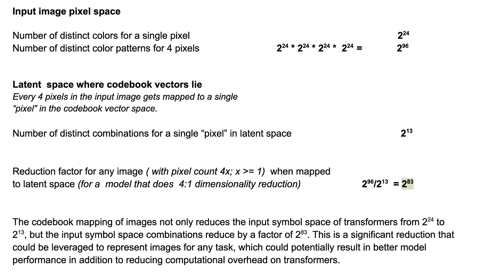**

**图 1a。给定一个编码器，其输入具有 4∶1 的维数缩减，伴随有 8192 个向量的学习码本，每 4 个像素的输入像素颜色组合的缩减因子是 2⁸。除了减少变换器的计算开销之外，输入符号空间组合中的 2⁸减少因子可能产生更好的模型性能。它已经证明了在生成任务中的收益。辨别任务的增益有待确定。图片由作者提供。**

*   **自动编码器训练的结果产生可以将输入图像映射到固定矢量码本的编码器和可以从矢量码本重建图像的解码器。编码器用于阶段 2 训练，以将图像映射到码本，而解码器用于图像生成。DALL-E 在文本和图像标记上训练自回归模型，用于根据文本生成图像。扩散模型根据文本、语义图或其他图像进行图像生成*(图像-图像转换任务，如修补)*。**

# **比较 dVAE 和 VQGAN**

**dVAE 和 VQGAN 的以下特征比较如下**

*   **图像重建质量*(阶段 1 输出)***
*   **图像生成质量*(阶段 2 输出)***
*   **Vocab 载体**

## **图像重建质量**

**下图是比较 DALL-E 的 dVAE 和扩散模型的 VQGAN 的重建质量的示例。第一幅图像是原始图像，随后是 dVAE *(中)*和 VQGAN *(右)*的重建图像。**

****

**图 2a。左边的图像是来自[的 DIV2k 数据集](https://data.vision.ee.ethz.ch/cvl/DIV2K/)的原始图像。中间是 dVAE 重建，右边是 VQGAN 重建(作者生成)**

**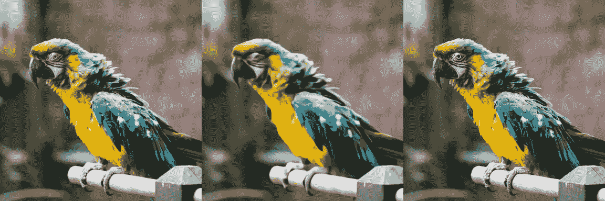**

**图 2b。左边的图像是来自 DIV2k 数据集的原始图像。中间是 dVAE 重建，右边是 VQGAN 重建(作者生成)**

****

**图 2c。左边的图像是来自[DIV2k 数据集](https://data.vision.ee.ethz.ch/cvl/DIV2K/)的原始图像。中间是 dVAE 重建，右边是 VQGAN 重建(作者生成)**

****

**图 2d。左边的图像是来自 DIV2k 数据集的原始图像。中间是 dVAE 重建，右边是 VQGAN 重建(作者生成)**

****

**图 2e。左边的图像是来自[DIV2k 数据集](https://data.vision.ee.ethz.ch/cvl/DIV2K/)的原始图像。中间是 dVAE 重建，右边是 VQGAN 重建。请注意原始图像缩放到 384x384(由作者生成)时面部的变形**

****

**图 2f。左边的图像是来自[DIV2k 数据集](https://data.vision.ee.ethz.ch/cvl/DIV2K/)的原始图像。中间是 dVAE 重建，右边是 VQGAN 重建。当输入未被缩放时，重构接近原始重构。该图像是图 2e 的裁剪后的 384×384 的区域，没有缩放。(由作者生成)**

****

**图 2g。左图为作者原图。中间是 dVAE 重建，右边是 VQGAN 重建(作者生成)**

****

**图 2h。左图为作者原图。中间是 dVAE 重建，右边是 VQGAN 重建(作者生成)**

**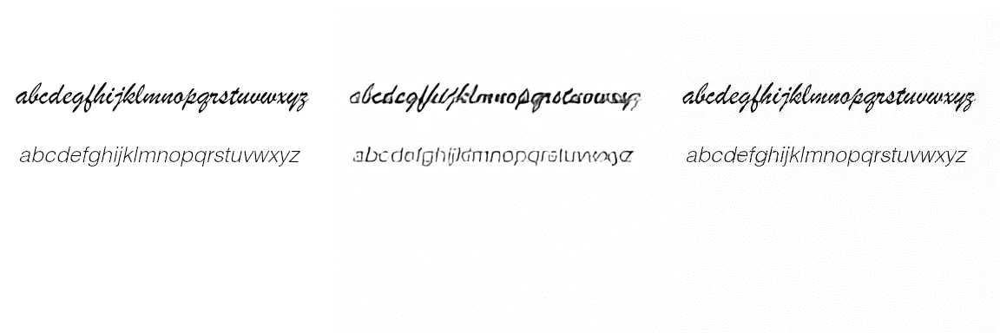**

**图 2i。左图为作者原图。中间是 dVAE 重建，右边是 VQGAN 重建(作者生成)**

**从上面的图像中可以观察到以下情况**

*   **VQGAN 重建比 dVAE 重建更接近原始图像**
*   **这两种模型都与文本重建*(图 2h-2i)* 有矛盾，特别是对于某些字体。然而，VQGAN 重建比 dVAE 更接近原始图像。**
*   **缩放图像会导致重建失真，即使在 VQGAN 中也是如此，这可以从面部特征*(图 2e)* 中看出。然而，没有缩放的原始图像在重建时几乎没有感知损失*(图 2f)。***

## **图像生成质量**

**下图是比较 DALL-E 的 dVAE 和扩散模型的 VQGAN 的生成质量的示例。第一幅图(图 3a)是使用 DALL-E *(利用阶段 1 dVAE)* 生成的图像，带有文本提示输入。随后的都是由扩散模型*(利用阶段 1 VQGAN)* 无条件地*(图 3b)* 或者有条件地利用布局输入*(图 3c)* 、图像输入*(修补-图 3d-f)* 和文本输入*(图 3g)* 生成的图像。**

****

**图 3a。图像来自 [DALL-E 纸](https://arxiv.org/pdf/2102.12092.pdf)零拍摄文本到图像生成。**

****

**图 3b。扩散模型的无条件图像采样。**图片由作者**生成**

****

**图 3c。从扩散模型到图像合成的条件图像生成。[来自扩散模型纸的图像](https://arxiv.org/pdf/2112.10752.pdf)**

**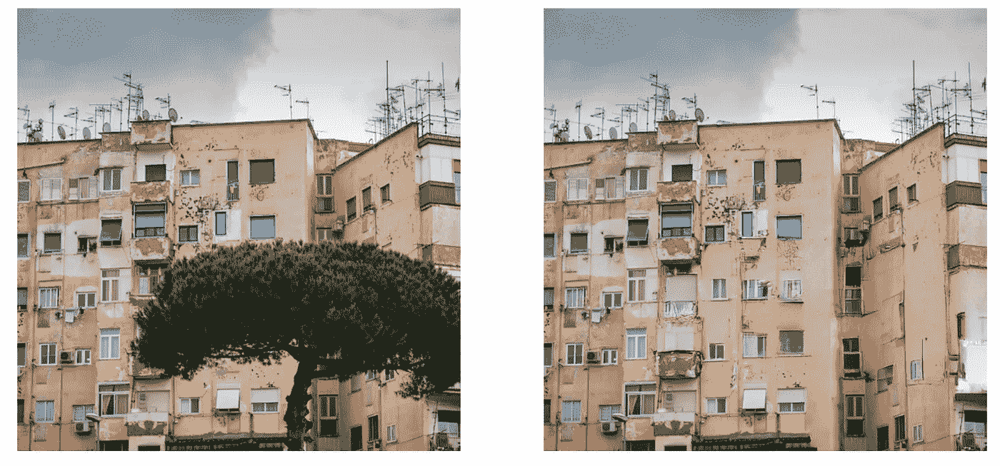**

**图 3d。基于扩散模型的条件图像生成。修补。**作者生成的图像****

**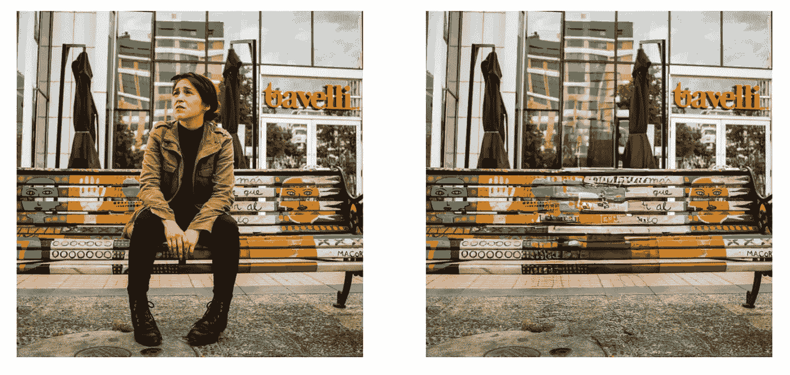**

**图 3e。基于扩散模型的条件图像生成。修补。**作者生成的图像****

**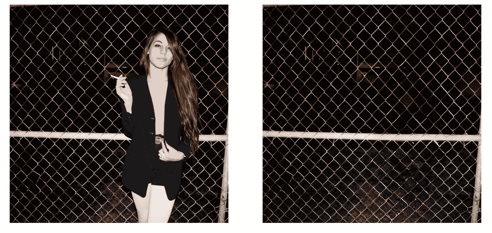**

**图 3f。基于扩散模型的条件图像生成。修补。**作者生成的图像****

**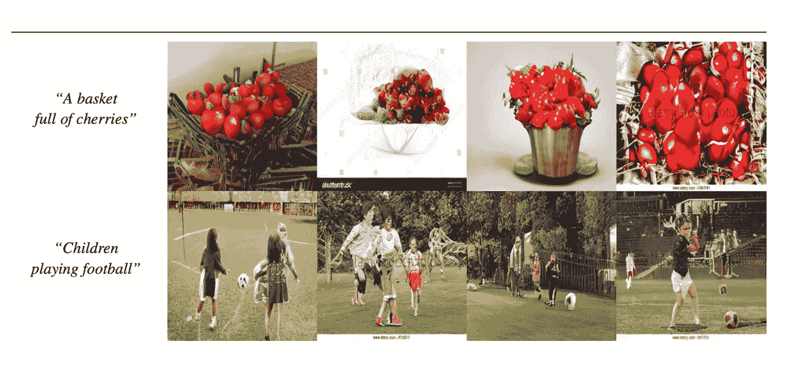**

**图 3g。[扩散模型纸的图像](https://arxiv.org/pdf/2112.10752.pdf)用户自定义提示的文本到图像合成。这些图像没有我们在重建图像中发现的同样的细节水平。例如面部的细节。然而，无条件的人脸图像生成具有非常精细的细节，如上面图 3b 所示。**

**很少定性观察**

*   **VQGAN 的图像生成质量总体上似乎优于 DALL-E 的 dVAE，尤其是精细细节的生成。生成的图像质量与我们在重建中看到的几乎相同。**
*   **然而，VQGAN 的文本到图像生成的生成质量错过了面部的细节。不清楚这是否是该任务/培训集等的结果。从布局描述、修补和 VQGAN 的无条件图像生成中生成的图像看起来更逼真。**
*   **这种定性评估表明，仅利用 VQGAN 的潜在空间码本向量的阶段 2 生成模型在照片级真实感质量方面几乎与使用阶段 1 解码器直接重建的图像一样好*(文本到图像任务除外)。*然而，直接作用于像素的扩散模型的生成能力[甚至已经优于 GANS](https://arxiv.org/pdf/2105.05233.pdf) *(更不用说 DALL-E 中用于生成图像的自回归模型的生成能力)*。因此，有人可能会认为这可能与码本或潜在空间无关——只是已经在像素空间中建立的扩散模型的生成能力。有趣的是，该论文不仅报告了重建质量的改进 [*(FID 分数 1.6x)*](https://arxiv.org/pdf/2112.10752.pdf) ，而且还报告了计算时间的加速[*(2.7x)*](https://arxiv.org/pdf/2112.10752.pdf)*，这是通过扩散模型作用于潜在空间而不是像素空间实现的。进一步支持前面的陈述，利用离散码本的潜在空间的扩散模型的照片真实感的定性检查似乎比直接作用于像素的扩散模型更好。***
*   ***作为题外话，值得注意的是 DALL-E 的 dVAE 在 BEiT 的输出端用于令牌预测。然而，该模型的输入将图像视为补丁，而不是码本向量。尚不清楚为什么做出这一特定决定——是因为 dVAE 的重建质量，还是因为 dVAE 码本矢量的正交特性不适合作为输入表示？***

## ***词汇向量***

***dVAE 将任何输入图像映射到 8192 个正交向量*(一键向量)*，而 VQGAN 将任何输入图像映射到 8192 个学习到的线性无关但非正交向量。具体来说，如前所述，任何输入图像张量[3，384，384]在 dVAE 中映射到[8192，48，48]张量，在 VQGAN 中映射到[3，384，384]到[3，96，96]，然后用作解码器的输入张量。***

**我们可以通过简单地向解码器提供与解码器输入的形状相匹配的张量中复制的 vocab 向量中的一个来可视化两个模型的固定词汇向量。下图显示了 dVAE 词汇向量*(本质上是一个热点向量)*和 VQGAN 词汇向量的可视化。**

**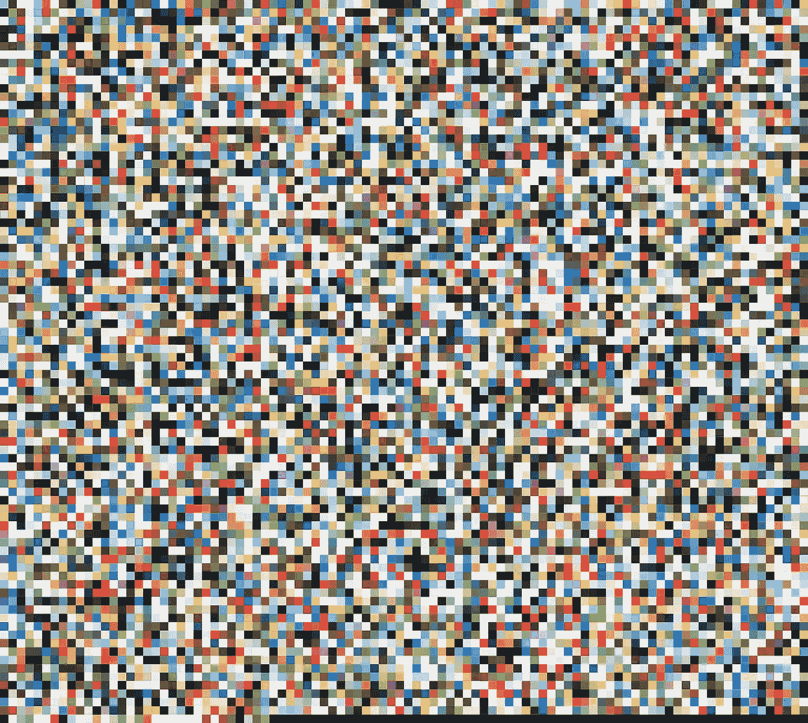**

**图 4a。构成 DALLE 的 dVAE 离散码本的 8192 个向量的可视化。8192 个值中的每一个的解码器输出图像在上面形成一个正方形小块。8192 解码器输出排列在宽度为 96 的网格中。最后一行仅部分填充了 8192%96 颜色值。如图 4c(顶行)所示，除了一小部分沿着边界具有网格状线条之外，颜色基本上是单调的。即使颜色看起来是多余的，它们也是不同的。**作者图片****

****

**图 4b。构成扩散模型中使用的 VQGAN 码本的 8192 三维向量的可视化。8192 个值中的每一个的解码器输出图像在上面形成一个正方形小块。8192 解码器输出排列在宽度为 96 的网格中。最后一行仅部分填充了 8192%96 颜色值。如图 4c(顶行)所示，除了一小部分沿着边界具有非常柔和的网格状线条之外，颜色基本上是单调的。另一个值得注意的区别是灰色代码占主导地位，这往往是非常低的幅度向量，在图像锐度中起作用，在下面的一节中讨论。即使颜色看起来是多余的，它们也是不同的。**作者图片****

****

**图 4c。两种自动编码器共有的两种风格的码本可视化的缩放再现。单调颜色主导两种码本可视化，与 VQGAN 中较柔和的网格线(边界行)相比，dVAE 具有更独特的网格线(顶行)。除了这些网格线，从色彩映射的角度来看，两个自动编码器都将色彩空间从 2 ⁴减少到 8192 距离值。**作者图片****

**关于可视化的一些定性观察**

*   **除了在两个码本可视化中的少数代码中存在网格线*(它们所起的作用尚不清楚)*，从色彩空间映射的角度来看，两个自动编码器的编码器在两个自动编码器中执行从 2 种⁴色彩组合到 8192 种色彩的色彩空间映射。与几何特征提取器相比，它们似乎都主要是色彩空间压缩器*(网格线在少数代码中的作用未知)***
*   **这些模型在映射颜色空间中的颜色表示上有所不同——dVAE 表示是一种稀疏表示 *(one-hot)* ，比 VQGAN 的密集分布式表示大 682 倍。此外，VQGAN 码本矢量的很大一部分(~66%)是非常低的幅度矢量，几乎接近于零。它们确实扮演着重要的角色*(下文将会讨论)*尽管其机制尚不清楚。**

# **VQGAN 码本的显著特性**

*   **与 dVAE 正交码本向量不同，当用欧几里德距离和余弦距离度量检查时，VQGAN 的向量揭示了不同的属性。**
*   **每个“非灰色”码本向量的欧几里德距离邻域*(图 5a、5c、5e)* ，当被可视化时，示出了由相似颜色支配的顶部邻域，不同颜色被主要由接近零的幅度向量组成的灰色带分开。此外，每个码本向量的欧几里德距离邻域属于两组 *(5a，5c，5e 对 5g)* 中的一组，这两组在视觉上和在捕获欧几里德距离分布的直方图(5i)中都是明显的——这仅仅是由于接近零的幅度向量的邻域和其他的差异。**
*   **余弦距离向量邻域，当被可视化时，具有与灰色混合的颜色——前面提到的接近零的幅度向量。这种视觉模式非常类似于任何输入图像的码本向量的可视化*(图 6a 和 6b)* 。此外，余弦距离分布的直方图(5i)示出了邻居几乎均匀地分布在余弦值的整个范围内，与可视化一致。更重要的是，接近零的幅度向量的邻域几乎均匀地分布在余弦值的整个范围内。人们很容易将这些接近零的向量和文本中的空格字符/分隔符的作用相提并论，尽管这种表面上的比较并没有揭示这些向量真正在做什么，除了边缘化它们可能扮演的更深层次的角色。将这些近零向量与 JPEG 压缩中通过量化 DCT 系数实现的稀疏矩阵进行比较也很有吸引力*(这对压缩有很大贡献)*，但这是错误的，原因如下——即使近零幅度，它们也起作用。**
*   **例如，仅用一个近零幅度矢量替换所有近零幅度矢量会使整个图像模糊*(图 7)* 。这提供了这些接近零的向量的重要性的间接证据，尽管如上所述，还不清楚它们实际上是做什么的。**
*   **码本向量似乎具有局部和全局影响*(图 8a 和 8b)* 。如果我们用不同颜色的几个代码替换输入到解码器的码本中的几个代码，这表现为如图 8a 所示的软补丁。在图 8b 中，代码的全局影响是明显的。这是一个黑色输入图像的解码器输出的可视化。黑色在码本空间中表示，在左边和上边有一个彩色带，图像的其余部分为灰色。它们似乎对整个图像的颜色有全局影响。此外，假设一个代码无论在解码器输入矩阵中的哪个位置都是相同的，那么该代码在输入矩阵中的位置可能隐含地作为解码器的位置信息。**
*   **从重构的角度来看，码本向量形成退化码。由不同码本向量组合组成的两个不同张量在解码时产生相同的输出。当用作下游任务的字模拟时，下游模型将不得不学习不同的代码是等效的，就像解码器通过将其映射到相同的输出图像*(图 8b)* 所做的那样。**
*   **将码本图像编码大小与同一图像的不同级别的 JPEG 压缩进行比较，显示码本编码的图像大小*(对于所有图像都是常数~ 16KB-2 * 8192 字节)*小于最低质量的 JPEG 版本(21KB)，其中感知损失显著*(图 9a 和 9b)* 。**

****

**图 5a。VQGAN 码本向量的欧几里德距离邻域的可视化。紧邻的邻域显示相似的颜色，随后是构成大约 66%的码本向量的灰色。其余的颜色跟随在这条灰色带之后。作者图片**

**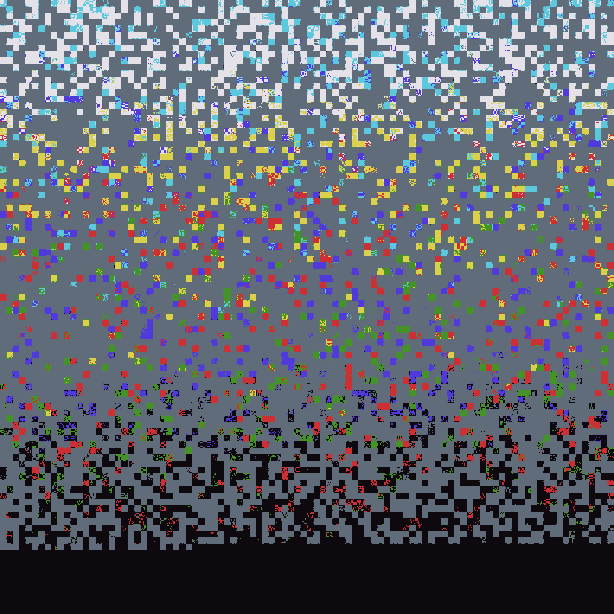**

**图 5b。图 5a 中相同码本向量的余弦距离邻域的可视化。注意，这个邻域模仿了图 5a 中的邻域颜色排序，除了灰色被分散，而不是被限制在单个带中。作者图片**

****

**图 5c。另一个码本向量的欧几里德距离邻域的可视化。紧邻的邻域显示相似的颜色，随后是构成大约 66%的码本向量的灰色。其余的颜色跟随在这条灰色带之后。作者图片**

**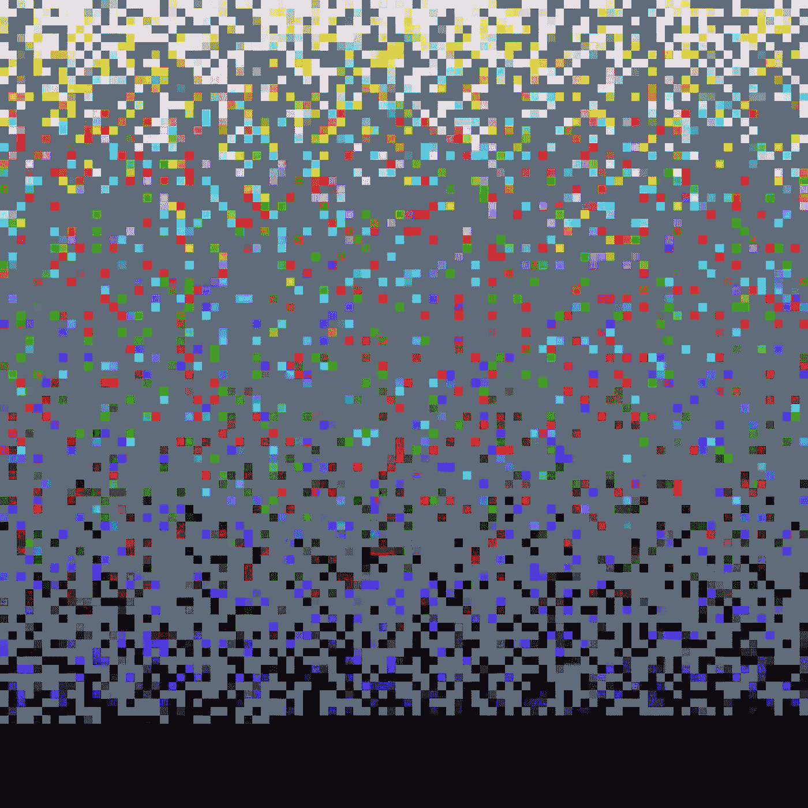**

**图 5d。图 5c 中相同码本向量的余弦距离邻域的可视化。注意，这个邻域模仿了图 5b 中的邻域颜色排序，除了灰色被分散，而不是被限制在单个带中。作者图片**

**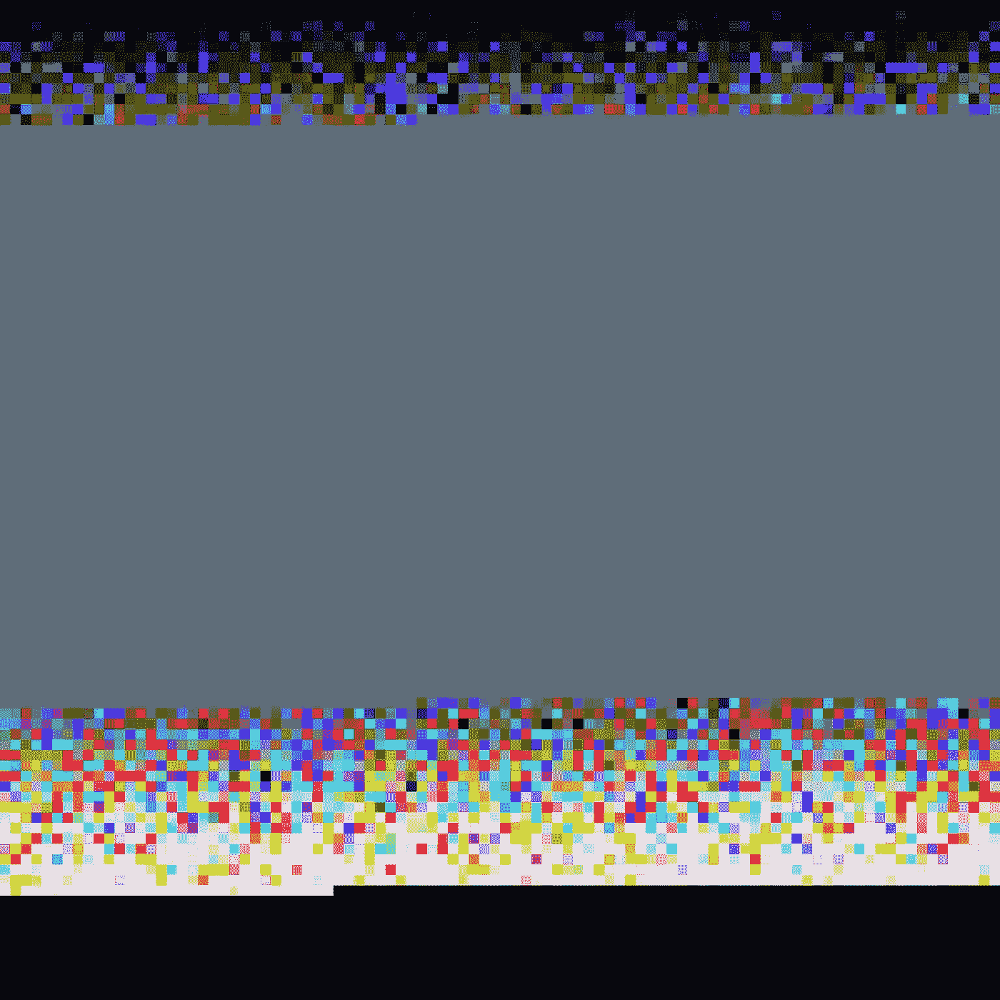**

**图 5e。另一个码本向量的欧几里德距离邻域的可视化。紧邻的邻域显示相似的颜色，随后是构成大约 66%的码本向量的灰色。其余的颜色跟随在这条灰色带之后。作者图片**

**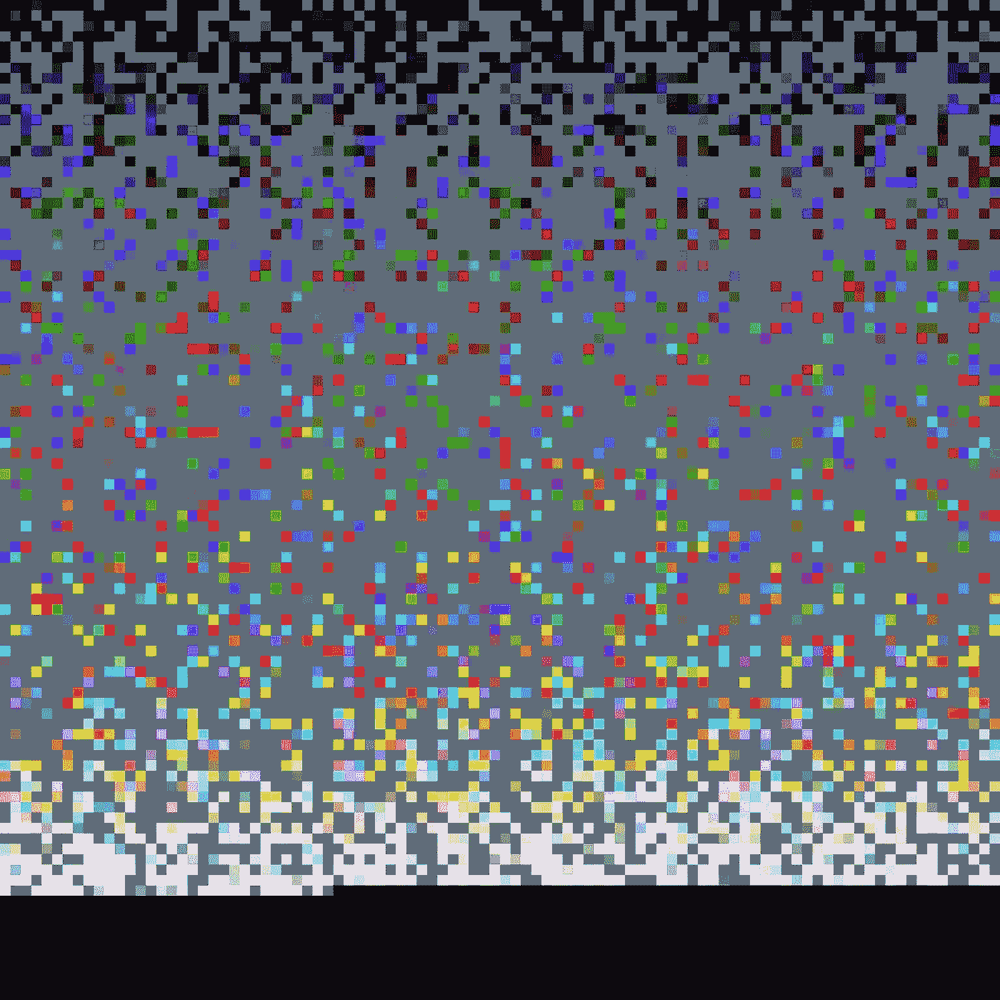**

**图 5f。图 5e 中相同码本向量的余弦距离邻域的可视化。注意，这个邻域模仿了图 5b 中的邻域颜色排序，除了灰色被分散，而不是被限制在单个带中。作者图片**

****

**图 5g。灰色码本向量的欧几里德距离邻域的可视化。所有颜色都遵循这条灰色带。作者图片**

**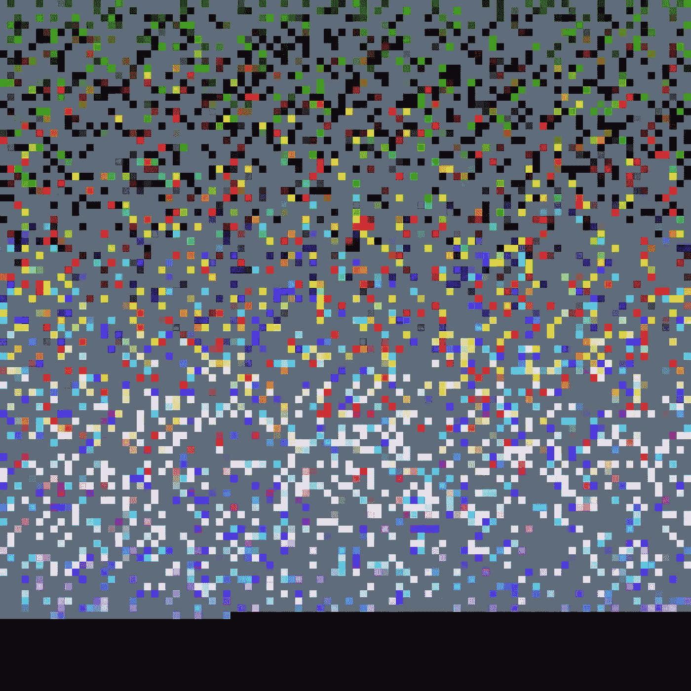**

**图 5h。与上面检查的所有向量一致，图 5g 中相同向量的余弦距离邻域到处都是灰色。作者图片**

**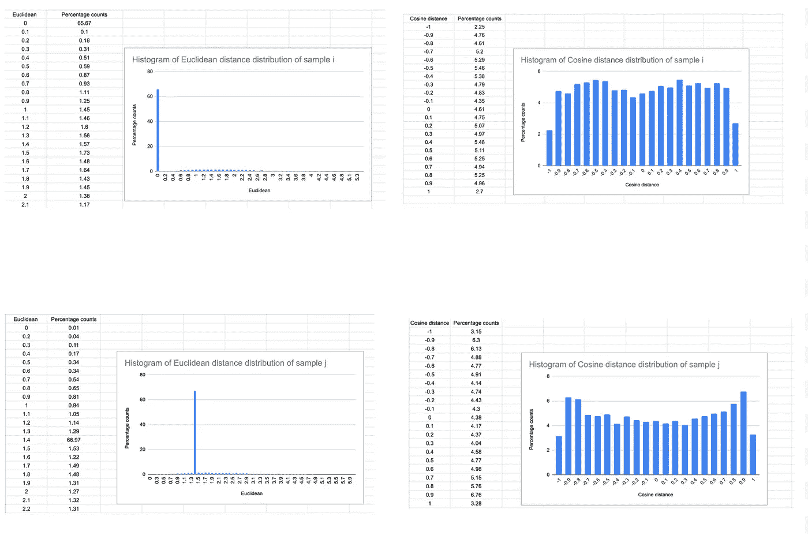**

**图 5i。这些图表总结了码本向量的特征。灰色的欧几里德距离显示了 0 附近的一个大尖峰，随后是所有的颜色。余弦距离的邻域几乎是均匀的。非灰色向量的欧几里得邻域显示了将颜色分成两部分的大量灰色。余弦距离也模拟了这一点。作者图片**

**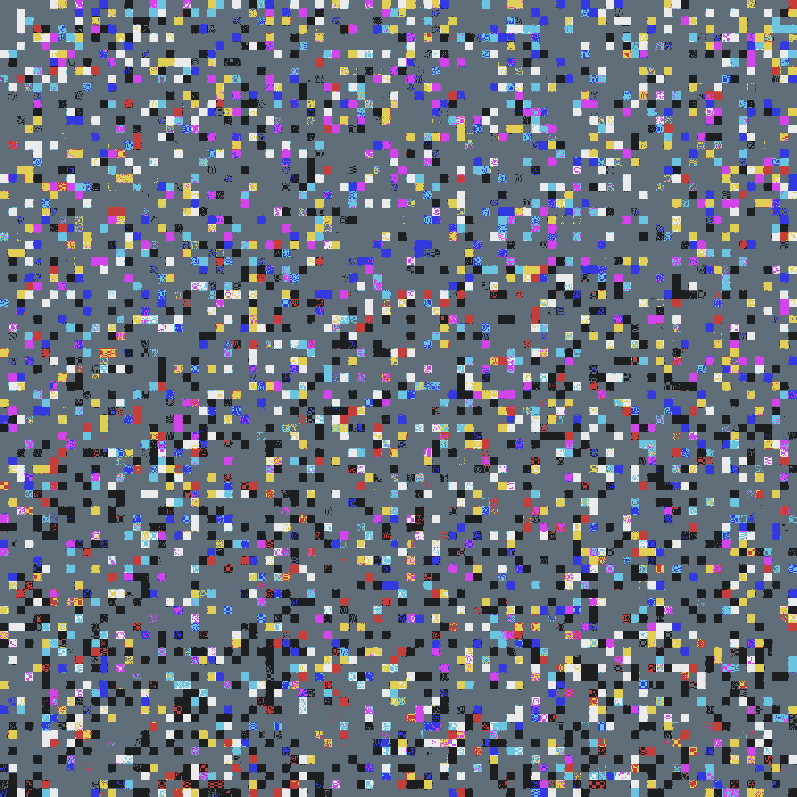**

**图 6a。上面显示的余弦距离可视化的一个奇怪属性是，它非常类似于图像输入的码本可视化。这是图 1 所示的鸟的码本可视化。作者图片**

**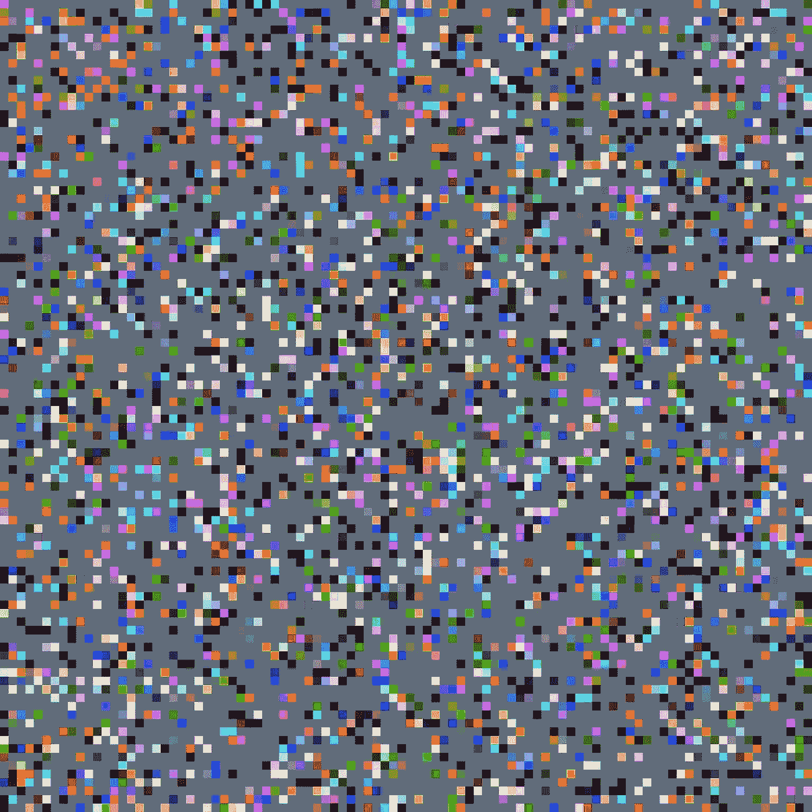**

**图 6b。余弦距离可视化的奇怪属性的另一个例子。这是松鼠的码本可视化，如下图 9a 所示。作者图片**

****

**图 7。用单个格雷码替换所有的格雷码使得整个重建图像模糊(右图)。左边的图像是原始的，中间是编码器输出映射到码本向量的重构。这一替换突出了这些近震级矢量的重要性，尽管它们的确切作用尚不清楚。DIV2k 数据集左边的鸟的图像[。作者图片](https://data.vision.ee.ethz.ch/cvl/DIV2K/)**

**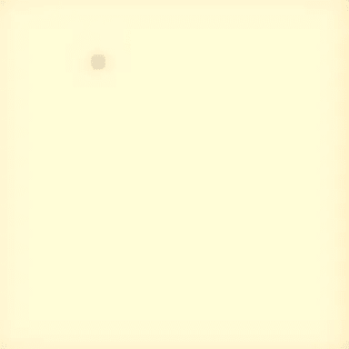**

**图 8a。如果我们用不同颜色的几个代码替换输入到解码器的码本中的几个代码，这表现为如上所示的软补丁。这说明了代码的本地化影响。作者图片**

****

**图 8b。该图说明了一项准则的全球影响。这是一个黑色输入图像的解码器输出的可视化。黑色在码本空间中表示，在左边和上边有一个彩色带。它们似乎对整个图像的颜色有全局影响。另一个事实是，多个码本矢量组合在输出空间中产生相同的颜色。输出空间中的黑色可以用这个代码或仅仅一个代码来实现(如图 4b 中的平铺图像所示的产生黑色的代码之一)。作者图片**

**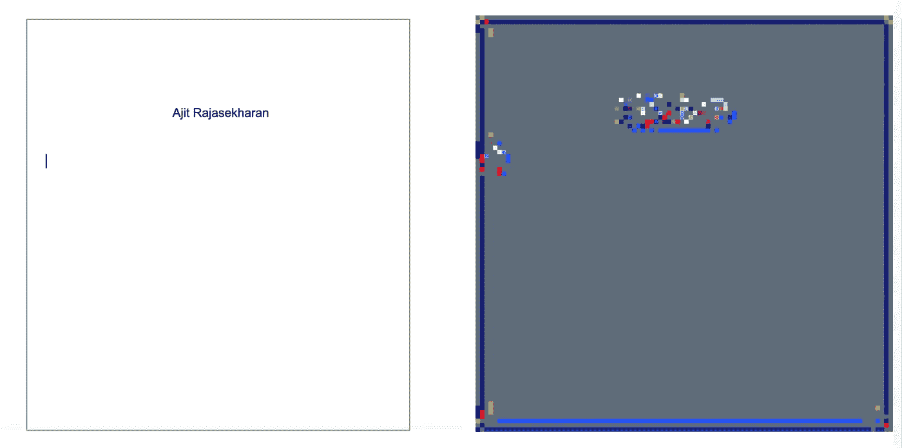**

**图 8c。这个图是代码的局部和全局影响的另一个例子。名称和光标在码本空间中由非灰色表示，这是码的局部影响。白色背景似乎被左侧和顶部的带所捕获——代码的全局影响。**

**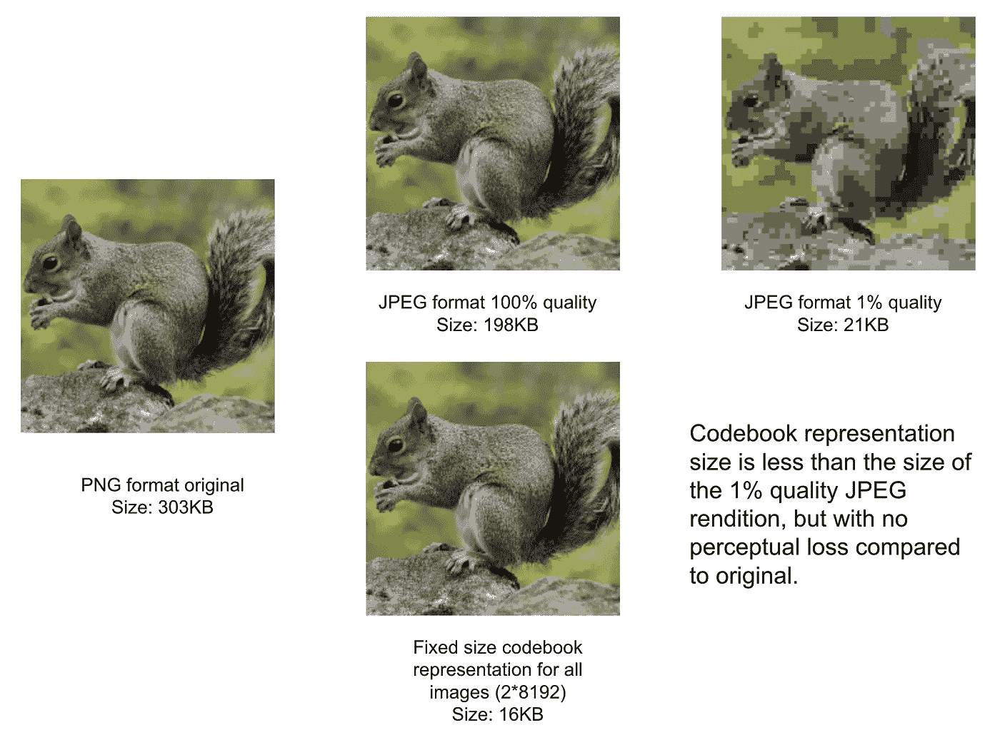**

**图 9a。左边的原始图像来自 [DIV2k 数据集](https://data.vision.ee.ethz.ch/cvl/DIV2K/)。转换/重建图像由作者提供。质量度量是在 JPEG 中以不同压缩率保存 JPEG 文件时使用的度量。顺便说一句， [*扩散模型正在作为一种可能的手段被检查*](https://arxiv.org/pdf/2111.05826.pdf) *以减少在被高度压缩(低质量因子)的 JPEG 图像的解压缩期间的可见伪像。***

**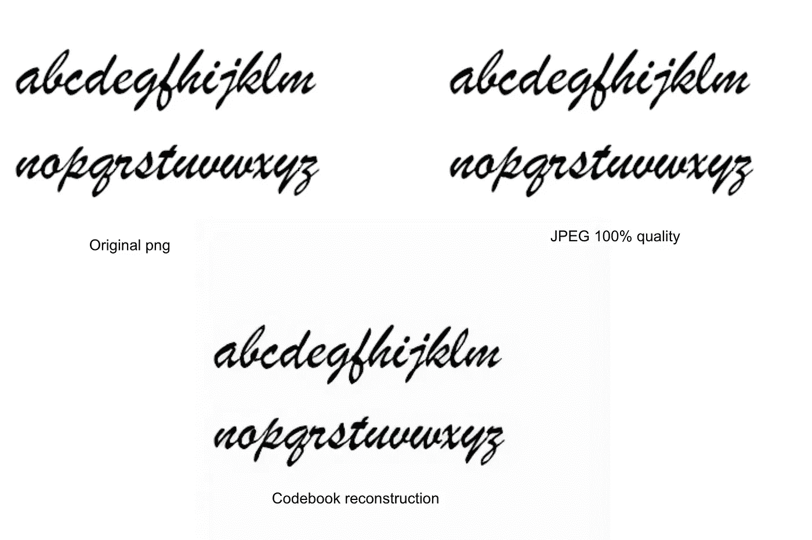**

**图 9b。由作者创建/生成的图像**

# **最后的想法**

**给定一组固定的学习向量不仅可以用于表示任何具有非常小的感知损失的图像，而且可以生成照片般逼真的图像，有证据表明，码本包含足够的信息来忠实地表示来自图像底层分布的任何样本*(文本除外)*。这意味着码本向量可以用作图像上任何下游辨别任务的单词模拟，特别是当重建质量随着[更新的码本学习设计](https://arxiv.org/pdf/2203.01941.pdf)而提高时。**

**最后，关于 VQGAN 和扩散模型的其他想法，与本文的主题无关…**

**VQGAN autoencoder 通过零特征工程实现的压缩可以超过 JPEG 等压缩方案，这至少是违反直觉的，如果不是引人注目的话——可以说是人类在特征工程方面独创性的展示范例。特别是，导致 VQGAN 压缩方案的某些可观察属性*(在上一节中检查)*的底层机制不清楚，除了它们正在执行的模糊结论之外，***在精神上*** ，JPEG 的所有关键“特征工程”思想**

*   **通过 CbCr 颜色下采样和子采样在 YCbCr 空间中实现的 jpeg 中的颜色空间缩减*(在 JPEG 压缩中约 50%的贡献)——****vqgan 中从 2 ⁴到 8192(2)颜色的颜色空间映射似乎实现了这一点。*****
*   **JPEG 中剩余的约 40-45%的压缩是通过将输入表示为高频和低频分量的组合*(由离散余弦变换的频率系数表示)*并使用精心选择的量化表来丢弃这些系数的大部分*(与低频分量相比，我们的眼睛对高频分量不太敏感，因此 JPEG 丢弃这些高频分量而没有感知损失)*从而导致压缩。**
*   **最后，利用霍夫曼编码/游程编码，通过由 VQGAN 编码器的量化— ***降维产生的稀疏矩阵的对角遍历来实现 JPEG 中的无损压缩，这似乎实现了上述 40–45%压缩的效果，以及该步骤的压缩。*****

**扩散模型不仅在生成能力上取代了 GANs，而且还被[视为一种可能的手段](https://arxiv.org/pdf/2111.05826.pdf)，以减少高度压缩的 JPEG 图像解压缩过程中的可见伪像*(低质量因子≤10)——*这是一个长期存在的图像增强问题。尽管事实上 GAN 在生成能力上已经被像素空间中的扩散模型所取代，但它是一种“GAN 风味”,将输入压缩到扩散模型的潜在空间以供消耗，这进一步增强了扩散模型生成中的照片真实感，正如我们在上面看到的。特别是[作者声称，GANs](https://compvis.github.io/taming-transformers/) 的对抗性损失有助于学习产生现实重建的表示*(通过选择一个可能的重建)*超越重建损失最小化*(*[*LPIPS*](https://arxiv.org/pdf/1801.03924.pdf)*)，*没有这些重建将是模糊的*(平均可能的重建)。***

**最后，这个想法[*(来自两所德国大学)*](https://arxiv.org/pdf/2112.10752.pdf)——结合 VQGAN 和扩散模型来同时增强和利用两者的优点*(离散密集表示码本， 照片级真实感图像)*虽然通过组合它们克服了一个关键的限制*(直接在像素空间上工作的扩散模型的长训练时间)*似乎很难得到应有的关注 *(* [*无论是在引文*](https://ui.adsabs.harvard.edu/abs/2021arXiv211210752R/abstract) *还是社交媒体* [*中尽管他们之前的工作非常有名，并用于创建抽象图像形式以及剪辑——VQGAN+剪辑组合*](https://compvis.github.io/taming-transformers/) *)* 相比之下，一些受欢迎的同行甚至无法接近这部作品的写实主义[【6】](https://ui.adsabs.harvard.edu/abs/2021arXiv211210741N/abstract)[【15】](https://ui.adsabs.harvard.edu/abs/2021arXiv210212092R/abstract)。 它可能只是相对较新，最终将随着时间的推移*(它已被接受为*[*【CVPR】22*](https://ommer-lab.com/people/ommer/)*)*。**

**[*链接到 Github* 上的码本比较](https://github.com/ajitrajasekharan/codebook_comparisons)**

# ***参考资料和附加注释***

1.  ***[使用残差量化的自回归图像生成，2022 年 3 月](https://arxiv.org/pdf/2203.01941.pdf) *本月早些时候发表的一篇论文提出将图像表示为离散码的堆叠图。****
2.  **[使用潜在扩散模型的高分辨率图像合成，2021 年 12 月](https://arxiv.org/pdf/2112.10752.pdf) *在上面的帖子中检查了使用 VQGAN 的论文。最近大量的论文倾向于使用离散码本，使用 VQVAE/VQGAN 变体作为第一阶段，使用扩散模型作为第二阶段，以根据文本、图像、布局元素等生成图像。扩散模型不是直接从图像开始并递增地添加噪声(* [*【滑动】*](https://arxiv.org/pdf/2112.10741.pdf) *)，而是从离散码本表示开始并递增地添加噪声。在反向去噪路径中——从噪声开始(可能用条件文本/图像/布局等引导，或者仅用这些条件输入的级联表示引导),模型输出去噪的离散表示，然后传递给解码器以重建生成的图像。作者声称两阶段方法是有利的，原因有几个——(1)高频的不易察觉的细节被抽象掉了，(2)该模型可以专注于数据中的重要语义信息，以及(3)在低维空间中的训练在计算上更有效。此外，这项工作的一个有趣的方面是在第一阶段使用 GAN 来生成码书，并使用扩散模型(与 GAN 相反)来生成真实感图像。这是最近一个趋势的结果，扩散模型在生成真实感图像方面已经超过了 GANs。***
3.  **[ImageBART:用于自回归图像合成的具有多项式扩散的双向上下文，2021 年 8 月](https://arxiv.org/pdf/2108.08827.pdf) *本文使用与下文提到的驯服变压器论文中提到的相同的自动编码器设计。***
4.  **[屏蔽自动编码器是可扩展视觉学习器，2021 年 12 月](https://arxiv.org/pdf/2111.06377.pdf) *它使用屏蔽自动编码器，其中编码器仅对构成输入的面片子集进行操作，而解码器根据编码器的潜在表示输出以及在去除面片的地方之间引入的屏蔽标记来预测屏蔽面片。解码器的目标是减少像素级的重建损失。这种工作在精神上非常接近于固定的学习词汇所实现的——通过随机移除输入补片来降低像素空间中的冗余，编码器被迫专注于在其输出中捕捉图像的重要方面(* [*【理想地语义*](https://youtu.be/oaacl-lAGPs) *),以帮助解码器在重建整个图像时预测在像素级别丢失的补片是什么。虽然这种减少输入(75%)并迫使编码器学习有助于解码器重建整个图像的表示的方法可以赋予编码器(在该预训练任务之后仅使用编码器)学习丰富表示的能力，以用于随后对下游辨别任务的微调——重建图像* *的模糊* [*性质不仅表明学习的表示对生成任务不起作用， 但是，学习到的表示也不像本帖中讨论的阶段 1 VQGANs 的学习到的表示那样完整，它可以用来重新生成原始图像而没有感知损失。 这表明，至少在原则上，一个在第一阶段对辨别任务的输出进行微调的模型应该表现得更好——然而，这需要得到验证。在这一点在工作模型中得到验证之前，人们可能会认为，区别性任务与生成性任务不同，可能不一定需要能够重建图像而没有知觉损失的表征。*](https://arxiv.org/pdf/2111.06377.pdf)**
5.  **[关于《视觉变形金刚》大家应该知道的三件事，2022 年 3 月](https://arxiv.org/pdf/2203.09795.pdf)。*最近的这篇论文基于视觉变压器的易于实施的变体提供了见解。其中之一是增加了一个基于 MLP 的补丁预处理，以改善伯特风格的自监督学习。然而，即使进行了变换/缩小，该模型仍然在像素级上运行。***
6.  **[GLIDE:使用文本引导扩散模型实现照片级真实感图像生成和编辑，2022 年 3 月](https://arxiv.org/pdf/2112.10741.pdf) *这项工作不采用两阶段方法来生成图像。相反，训练扩散模型以逐步向图像添加噪声，然后去噪以在像素级重新生成图像，从反向步骤以噪声开始的地方开始。去噪过程可选地由来自单独分类器的标签的文本或梯度来指导。还尝试了另一种对文本进行调节的方法，称为* [*【分类器自由引导】*](https://youtu.be/vBFBSvUbnh8) *，其中文本/标签在 20%的时间内被替换为空文本/标签，并使模型在相反的过程中预测下一个时间步长，使用该时间步长的具有文本/标签的预测来推动没有文本/标签的预测。***
7.  **[Swin Transformer:Hierarchical Vision Transformer using shift Windows，2021 年 8 月](https://arxiv.org/pdf/2103.14030.pdf) *本文也没有采用两阶段的方法，而是提供了一种创新的方法来学习仅仅来自补丁的表示，这种方法比普通的 Transformer 更有效，并且可以捕获更高分辨率的信息。它以分层的方式训练视觉变换器，其中以小的块尺寸和较小的注意跨度开始，一层的输出的相邻向量被合并，然后下一层具有具有较大注意跨度的移位窗口。这种方法在处理补丁时解决了普通变形器中的至少两个问题:( 1)低分辨率(16x16)补丁——相比之下，Swin 变形器从更小的补丁大小 4x4 开始，以及(2)导致二次复杂度的全局关注——相比之下，Swin 变形器在非重叠的局部窗口上进行自关注(但也允许具有移位窗口的跨层的跨窗口连接),因此计算效率高。实际上，Swin transformer 完成了“卷积+最大池”组合所完成的工作。***
8.  **[驯服用于高分辨率图像合成的变压器，2021 年 6 月](https://arxiv.org/pdf/2012.09841.pdf) *本文介绍了使用卷积 VQGANs 作为生成离散码本的手段。本文中的几项创新，其中关键的是学习码本，该码本在没有感知损失的情况下重建图像，这部分是由于 GAN 的对抗损失而成为可能，该 GAN 迫使模型输出可能的重建候选之一，而不是对由* [*LPIPS*](https://arxiv.org/pdf/1801.03924.pdf) *损失驱动的可能输出候选进行平均。以前有过学习离散码本的尝试，如下面的参考文献 16 和 17。这个看起来是第一个使用 VQGAN 的。***
9.  **[感知者:迭代注意的一般感知，Jun 2021](https://arxiv.org/pdf/2103.03206.pdf) *本文介绍了一种利用交叉注意机制降低输入图像维数的方法。这种方法用于不同的模态。***
10.  **[BEIT:2021 年 6 月影像变形金刚 BERT 预培训](https://arxiv.org/pdf/2106.08254.pdf)。*如前所述，这使用了一种将图像输入视为补丁的混合方法，但使模型预测由 DALLE 的 dVAE 学习的输入图像的离散表征。***
11.  **[一张图片抵得上 16X16 的文字，Jun 2021](https://arxiv.org/pdf/2010.11929.pdf) 。*这是通过输入图像作为补丁来使用图像的变形金刚的原纸。***
12.  **[LeViT:一个穿着 ConvNet 服装的视觉转换器，用于更快的推理，2021 年 5 月](https://arxiv.org/pdf/2104.01136.pdf) *本文提出了一种计算高效的方法来处理第一层中的补丁。***
13.  **[ConViT:利用软卷积电感偏置改善视觉变压器，2021 年 6 月](https://arxiv.org/pdf/2103.10697.pdf) *本文提出了一种提高视觉变压器采样效率的方法***
14.  **[训练数据高效的图像转换器&通过注意力提取，2021](https://arxiv.org/pdf/2012.12877.pdf) *这表示输入为小块。该架构不使用卷积。***
15.  **[零镜头文本到图像生成，2021 年 1 月](https://arxiv.org/pdf/2102.12092.pdf)。*本文介绍了 DALL-E，它使用了本文中讨论的离散 VAE。***
16.  **[用 VQ-VAE-2 生成多样的高保真图像，2019](https://arxiv.org/pdf/1906.00446.pdf) 。这是对 17 版 VQVAE 的改进。**
17.  **[神经离散表示学习，2018](https://arxiv.org/pdf/1711.00937.pdf) *这篇论文似乎是第一个介绍图像生成的两阶段方法——第一阶段是一种自动编码器 VQVAE 的味道。***
18.  **[链接到参考本文中引用的高质量图像数据集的论文。](https://people.ee.ethz.ch/~timofter/publications/Agustsson-CVPRW-2017.pdf)**
19.  **[制作场景:具有人类先验的基于场景的文本到图像生成](https://arxiv.org/pdf/2203.13131.pdf)。*最近的另一项工作使用 VQGAN 来学习离散码本。***
20.  **[扩散模型在图像合成上击败 GANs，Jun 2021](https://arxiv.org/pdf/2105.05233.pdf) *本文论证了扩散模型在无条件和类条件图像生成上可以超越 GANs。它还检查了对用于扩散模型的原始* [*UNet 模型*](https://arxiv.org/pdf/2006.11239.pdf) *的架构改进。***
21.  **[Palette:Image-to-Image Diffusion Models，November 2021](https://arxiv.org/pdf/2111.05826.pdf)*这篇论文认为，在非常低的质量因子值(非常高的压缩率)下使用 JPEG 压缩引入的伪像的移除(在解压缩期间)是其图像到图像翻译任务之一。***
22.  **[去噪扩散概率模型，2020。](https://arxiv.org/pdf/2006.11239.pdf) *这项工作为扩散概率模型创造了短语“扩散模型”。还展示了使用这些模型的高质量图像合成。***
23.  **[利用非平衡热力学的深度无监督学习，2015](https://arxiv.org/pdf/1503.03585.pdf) *引入扩散模型(最初称为扩散概率模型)的原始论文***
24.  **[用变形金刚进行高分辨率复杂场景合成，2021 年 5 月](https://arxiv.org/pdf/2105.06458.pdf)。*VQGAN 用于学习离散码本，该离散码本然后被用作自回归变换器的输入，该自回归变换器学习根据在训练期间与图像码本表示一起馈送的布局描述来预测潜在空间表征。***
25.  **[用改进的 VQGAN 进行矢量量化图像建模，2021 年 10 月。](https://arxiv.org/pdf/2110.04627v2.pdf) *本文采用两阶段方法。第一阶段使用基于视觉转换器的 VQGAN 进行离散码本学习。第二种状态是自回归变换器，其输入由阶段 1 编码表示。该模型用于图像生成任务和表征学习。***
26.  **[扩散自动编码器:走向有意义和可解码的](https://diff-ae.github.io/)表示。马克 2022。最近的工作描述了一种使用扩散自动编码器学习语义表示的方法。代码尚未发布。**