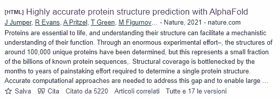
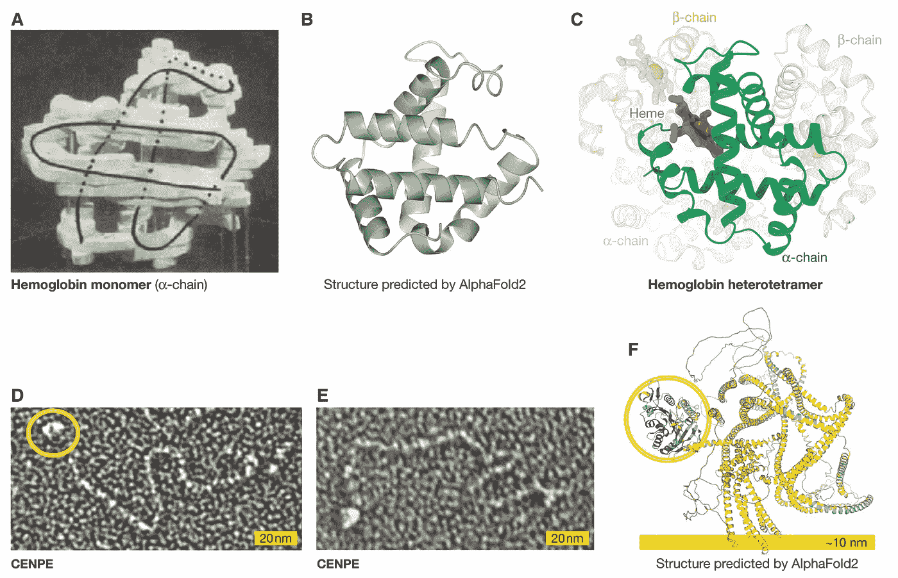
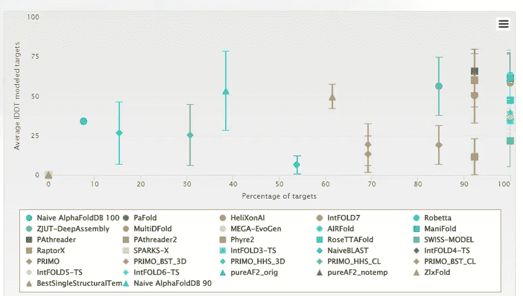
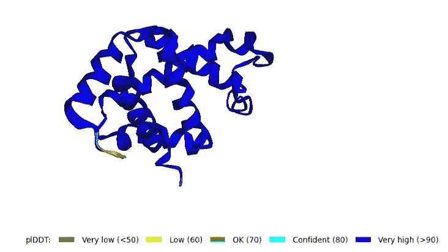
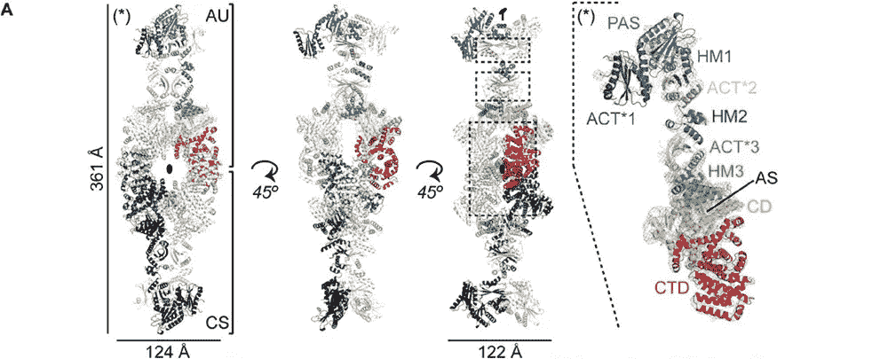
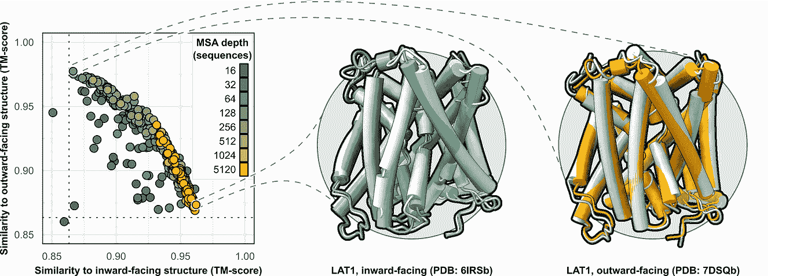
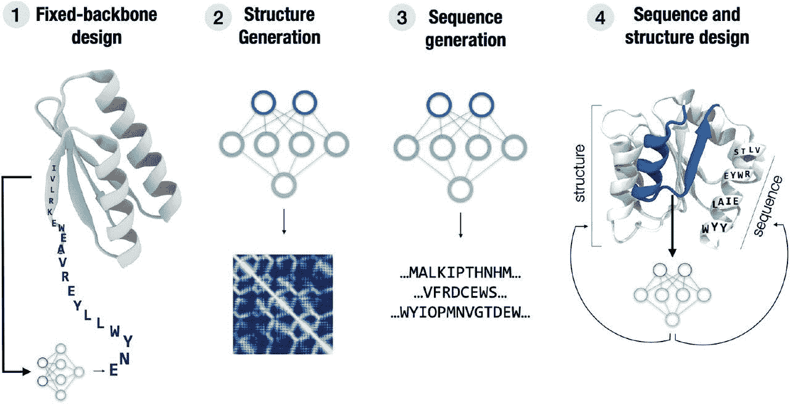

# AlphaFold2 第一年:它改变了世界吗？

> 原文：<https://towardsdatascience.com/alphafold2-year-1-did-it-change-the-world-499a5a38130a>

## DeepMind 承诺给我们一场革命。发生了吗？


图片由 [Greg Rakozy](https://unsplash.com/@grakozy) 在 unsplash.com 拍摄

一年前， [AlphaFold2 发表在《自然](https://www.nature.com/articles/s41586-021-03819-2)》上。AlphaFold 是在 CASP13(一项旨在预测已获得但尚未发表的蛋白质结构的竞赛)期间推出的，它的表现优于其他竞争对手，但没有引起轰动。在随后的 [CASP14](https://predictioncenter.org/casp14/) 比赛中，AlphaFold2 不仅击败了所有其他竞争对手，而且算法预测的结果与实验获得的结果相似。

在接下来的几天里，研究人员声称 AlphaFold2 意味着蛋白质结构预测的问题终于可以结束了。其他人声称这是一场科学革命，将打开令人难以置信的新视角。

本文提出这个问题:AlphaFold2 一年后，发生了什么？最近有什么进展？AlphaFold2 在哪些应用中使用过？

```
**Index of the article**
- **The protein: a self-assembling origami
- Does AlphaFold2 have its Achille’s heel?
- Again on the ring: AlphaFold2 will keep the belt?
- No protein left behind
- How men used the fire that Prometheus gave them
- What course does the future take?**
```

# **蛋白质:一张自我组装的折纸**


照片由[约书亚·迪克森](https://unsplash.com/@joshdixon00)在[unsplash.com](https://unsplash.com/)拍摄

简而言之，我们如何从序列中获得蛋白质结构的问题一直是二十世纪生物学的核心。[蛋白质](https://en.wikipedia.org/wiki/Protein)是生命的引擎；如果信息储存在 DNA 中，那就是蛋白质在每个生物体内执行所有功能。它们的顺序决定了它们的结构，而结构决定了它们的功能。

> 生物学是有史以来最强大的技术。DNA 是软件，蛋白质是硬件，细胞是工厂。—阿尔温德·古普塔

了解蛋白质的结构有助于更好地理解它在健康和疾病状态下的功能。该结构对于设计能够与蛋白质相互作用的分子也至关重要(实际上所有药物都是在知道蛋白质结构的情况下设计的)。然而，预测结构然后预测功能开启了几乎无限的可能性(从纳米技术到医学，从农业到制药，等等)。

然而，由于各种原因，预测结构是困难的:

*   一个序列有大量的潜在结构，但只有一个是正确的
*   蛋白质如何组装的生物物理规则是未知的
*   测试或模拟所有可能的组合在计算上过于昂贵
*   各种化学基团之间既有局部的相互作用，也有远距离的相互作用

在之前的一篇文章中，我讲述了为什么这很难，以及了解 AlphaFold2 的结构和更详细的介绍对于进一步学习的重要性:

</speaking-the-language-of-life-how-alphafold2-and-co-are-changing-biology-97cff7496221>  

# **alpha fold 2 有它的阿奇利之踵吗？**


经过一次试验，发现了一些局限性。Unsplash.com 的图片由[阿伦视觉](https://unsplash.com/@aronvisuals)提供

AlphaFold2 在蛋白质预测这样复杂的挑战中当然取得了卓越的成绩。AlphaFold2 的影响力已经可以从它获得的引用数量上看出来。 [Pubmed](https://pubmed.ncbi.nlm.nih.gov/) 标注为总引用次数 1935 次(2021 年 380 次，2022 年 1639 次)。而根据谷歌学术的说法，这个数字甚至超过了 5000:



[谷歌学术](https://scholar.google.com/)作者截图。

今年，一些研究人员也解决了 AlphaFold2 的局限性。在讨论新的应用和最近的发展之前，DeepMind 模型的局限性是什么，这很有趣。

目前，AlphaFold2 无法预测[与其他蛋白质](https://en.wikipedia.org/wiki/Protein%E2%80%93protein_interaction)的相互作用。事实上，这是一个重要的方面，因为几乎所有由蛋白质执行的功能都是与其他几个伙伴一起执行的。这是一个复杂的问题，因为蛋白质可以在[同源二聚体](https://en.wikipedia.org/wiki/Protein_dimer)(即与自身)或异源二聚体(与其他不同的蛋白质)中相互作用。这些相互作用可以改变蛋白质本身的结构，从而改变其构型。

AlphaFold2 的作者自己发表了一篇后续论文，其中他们提出了 alpha fold-多聚体，这是一种专门为模拟蛋白质相互作用和组装而设计的模型。虽然结果令人鼓舞，但仍有改进的余地。


用α折叠多聚体预测的结构实例。可视化的是地面真实结构(绿色)和预测结构(用链着色)。”图片来源:[原纸](https://www.biorxiv.org/content/10.1101/2021.10.04.463034v2.full)

此外，目前 AlphaFold2 没有预测蛋白质结构的其他重要方面:金属离子、[辅因子](https://en.wikipedia.org/wiki/Cofactor_(biochemistry))和其他配体。此外，蛋白质的结构不仅仅由氨基酸结构决定。蛋白质可以经历调节其功能和半衰期的修饰([糖基化](https://en.wikipedia.org/wiki/Glycosylation)、[磷酸化](https://en.wikipedia.org/wiki/Protein_phosphorylation)、[磷酸化](https://en.wikipedia.org/wiki/SUMO_protein)、[泛素化](https://fr.wikipedia.org/wiki/Ubiquitine)等等)。这些翻译后修饰是重要的，并且在不同的疾病中经常改变。

比如 AlphaFold2 正确预测了[血红蛋白](https://en.wikipedia.org/wiki/Hemoglobin)的结构。然而，它预测没有血红素辅因子的结构，但生理条件下的血红蛋白总是与血红素辅因子结合。在另一种情况下，CENP-E 驱动蛋白，AlphaFold2 正确地预测了所谓的分子马达[，但没有预测盘绕圈区域](https://www.embopress.org/doi/full/10.15252/embr.202154046)。事实上，AlphaFold2 在蛋白质的内在无序区域(如卷曲螺旋区域)方面存在困难。



AlphaFold2 的局限性:蛋白质血红蛋白和 CEMPE 的结构与相应的 AlphaFold2 预测。图片来源:[此处](https://www.embopress.org/doi/full/10.15252/embr.202154046)，牌照:[此处](https://onlinelibrary.wiley.com/page/journal/17444292/homepage/Permissions.html)

此外，氨基酸的[侧链并不总是精确定位的。例如，这些信息对于确定蛋白质的活性位点以及如何设计能够调节它的分子非常重要。](https://www.nature.com/scitable/topicpage/protein-structure-14122136/)

另一个问题是，蛋白质可以有不同的构象(它们不是静态的，而是动态的实体)，AlphaFold2 只返回其中的一种。在疾病条件下，蛋白质序列可能会发生改变蛋白质结构的突变，AlphaFold2 目前无法预测这一点。

一个重要的例子是人钾[电压门控通道亚家族 H 成员 2 (hERG)](https://pubmed.ncbi.nlm.nih.gov/22988594/) 蛋白，在心跳过程中可以以三种构象存在(开放、关闭、无活性)。该通道的突变或与特定药物的相互作用导致[长 QT 综合征](https://www.mayoclinic.org/diseases-conditions/long-qt-syndrome/symptoms-causes/syc-20352518)，因此预测三种不同的构象结构非常重要。

正如麻省理工学院的研究人员所指出的，AlphaFold2 目前只在药物发现的一个步骤中有用:对蛋白质的结构进行建模。事实上，该模型不允许模拟药物如何与蛋白质发生物理相互作用。事实上，研究人员试图模拟细菌蛋白质如何与抗生素相互作用(与蛋白质结合更紧密的分子可能是更好的抗生素)，[，但 AlphaFold2 不是很有效](https://www.embopress.org/doi/full/10.15252/msb.202211081)。

> “利用这些标准的分子对接模拟，我们获得了大约 0.5 的 auROC 值，这基本上表明你并不比随机猜测做得更好，”麻省理工学院研究员科林斯·JJ 谈到使用 AlphaFold2 对接抗生素和蛋白质时说道(来源:[此处](https://news.mit.edu/2022/alphafold-potential-protein-drug-0906))。

> 然而，一如既往，用户考虑到该方法的局限性是至关重要的。如果结构预测被天真地使用和解释，它会导致错误的假设或明显错误的机械模型。—[alpha fold 的欢乐与危险，EMBO 报道](https://www.embopress.org/doi/full/10.15252/embr.202154046)

AlphFold2 无疑代表了蛋白质分子结构预测的一个突破。然而，另一方面，它显示了几个局限性，正如麻省理工学院的研究人员指出的那样，在做出假设和用于某些应用时，都必须考虑到这些局限性。

无论模型的目的是什么，模型成功实现的目标都是由数据的性质决定的。AlphaFold2 使用 [PDB](https://www.rcsb.org/) (蛋白质结构数据库，一个实验确定的蛋白质分子结构的储存库)中的数据进行训练，从而预测蛋白质结构，就好像它是另一个 PDB 条目一样。问题是，许多蛋白质在生理条件下只与辅因子、其他蛋白质结合，或以大的复合物形式存在，但人们不能总是在生理条件下使蛋白质、辅因子或其他蛋白质结晶。

此外，对于超过 40%的所有 [UniProt](https://www.uniprot.org/) 家族来说，没有蛋白质结晶，而当观察超家族(一个更广泛的类别)时，超过 20%。

因此，尽管在与蛋白质结构相关的出版物中(当这是通过结晶学获得时)解释了如何以及为什么获得该结构(以及该模型的可能限制)，AlphaFold2 在其预测中并不考虑这种背景。因此，尽管 AlphaFold2 是一款出色的工具，但我们仍必须考虑其局限性。

# **再上擂台:AlphaFold2 会留腰带？**


图片由内森·杜姆劳在 Unsplash.com 拍摄

AlphaFold2 表明，使用深度学习可以很好地预测单个蛋白质的结构。另外，鉴于 AlphaFold2 最近的成绩， [**CASP**](https://predictioncenter.org/) 决定增加挑战的复杂度。如前所述 CASP 是一个致力于蛋白质结构预测算法的挑战现在在 [**其第 15 版**](https://predictioncenter.org/casp15/index.cgi) (第一个 CASP1 在 1994 年，最后两个 CASP13 和 CASP14 被 DeepMind 拿下)。

因此，CASP15 将关注几个类别，包括/

*   **单个蛋白质和结构域建模。**同样在这个版本中，将有几个单一的蛋白质结构域，但将强调细粒度的准确性(局部主链基序和侧链)。
*   **组装。**这一类别考虑蛋白质相互作用(不同蛋白质结构域之间、不同亚基之间的相互作用等等)
*   **RNA 结构和复合物。事实上，RNA 分子也可以组装成 3D 结构，这方面的知识要少得多。**
*   **蛋白质-配体复合物。**蛋白质可以有生理配体如各种代谢产物(甚至其他蛋白质)或治疗性分子也可以理解为配体。这是药物发现的关键一步，mecate 中的大多数药物实际上都是通过结合来调节目标(蛋白质)的小分子。CASP15 也是推动药物设计研究的一个挑战。
*   **蛋白质构象集合。**如上所述，蛋白质不应被视为静态实体，而是可以有几种构象变化。这些变化可以发生在特定的条件下，如结合到特定的底物，磷酸化，或结合到药物。事实上，在实验条件下获得这些构象的数据也很困难(通常通过冷冻电镜和核磁共振获得)。

可以注意到，虽然以前的版本侧重于蛋白质的静态观点，但这里的重点是蛋白质的动态观点(溶液中的行为，与其他蛋白质伴侣或其他生物大分子的相互作用)。因此，鉴于上述限制，这些类别对 AlphaFold2 构成了挑战。

CASP15 的提交于 8 月 19 日截止，结果将于 12 月在安塔利亚大会上公布。因此，我们很快就会知道 DeepMind 是否会保住冠军腰带。与此同时，对于那些喜欢剧透的人来说 [**CAMEO**](https://www.cameo3d.org/modeling/3-months/difficulty/hard/) (一个由不同机构支持的社区项目)在恒定的时间内监控来自不同来源(不同服务器，其中存在不同竞争对手的预测)的预测质量。CAMEO 提供不同的预测分数，你也可以选择时间间隔。

《同样的目标》中的 CAMEO 也使用了来自同一个 AlphaFold2(去年发布的版本)的预测。从图中可以看出，AlphaFold2 naive 版本的表现并不差(越靠近右上方越好)。



作者截图来自 [CAMEO 网站](https://www.cameo3d.org/modeling/3-months/difficulty/hard/)。

# **无蛋白质残留**


[谷歌趋势](https://trends.google.com/trends/?geo=FR)上关键词“Alphafold”的趋势，作者截图

> 仅仅 12 个月后，AlphaFold 已经被超过 50 万名研究人员访问，并用于加速从塑料污染到抗生素耐药性等重要现实问题的进展— [DeepMind 新闻稿](https://www.deepmind.com/blog/alphafold-reveals-the-structure-of-the-protein-universe)

一年后，AlphaFold2 仍然出现在谷歌搜索中，最近有一些发展，我们将在这里讨论。

文章发表后，DeepMind 立即在 [GitHub](https://github.com/deepmind/alphafold) 上提供了源代码，还提供了一个[谷歌实验室](https://colab.research.google.com/github/sokrypton/ColabFold/blob/main/AlphaFold2.ipynb#scrollTo=C2_sh2uAonJH)，在那里可以输入蛋白质的序列并获得结构的图像。

例如，只需访问 [Uniprot](https://www.uniprot.org/uniprotkb/P68871/entry) 网站，检索一种蛋白质的序列，将其插入谷歌 Colab 细胞，并运行它以获得预测。下面是[人类血红蛋白](https://en.wikipedia.org/wiki/Hemoglobin)的结构:

```
MVHLTPEEKSAVTALWGKVNVDEVGGEALGRLLVVYPWTQRFFESFGDLSTPDAVMGNPK
VKAHGKKVLGAFSDGLAHLDNLKGTFATLSELHCDKLHVDPENFRLLGNVLVCVLAHHFG
KEFTPPVQAAYQKVVAGVANALAHKYH
```



这里有一个 AlphaFold2 预测的例子，颜色代表作者使用提供的 Google Colab 得到的模型的置信度(也可以使用 GitHub 源代码但是下载重量是 2.2 TB，需要 GPU 来运行)

如前所述，同一个小组已经提出了针对多聚体复合物的 AlphaFold2 的特定版本，源代码也已公布( [GitHub](https://github.com/deepmind/alphafold) 、 [Google Colab](https://colab.research.google.com/github/sokrypton/ColabFold/blob/main/AlphaFold2_complexes.ipynb#scrollTo=g-rPnOXdjf18) )。

此外，DeepMind 与 EMBL 的[欧洲生物信息研究所(EMBL-EBI)](https://www.ebi.ac.uk/) 合作，最初发布了大约 20 个物种(35 万人)的 2000 万个蛋白质的结构。

最近，他们发布了数据库中几乎所有分类的蛋白质的结构(他们在已经收集的蛋白质序列上使用了 AlphaFold2)。DeepMind 建立了一个数据库，所有这些预测的结构都可以在这里访问( [AlphaFold DB](https://alphafold.ebi.ac.uk/) )或者批量下载[这里](https://github.com/deepmind/alphafold/blob/main/afdb/README.md)。该网站包含 2 亿个结构(最初发布了 100 万个结构)。

最近，DeepMind 宣布他们因 AlphaFold 的开发获得了 2023 年生命科学突破奖。

# **人类如何使用普罗米修斯给他们的火**

AlphaFold 1 已经被证明对科学家有用。AlphaFold 的第一个版本不能准确地模拟氨基酸侧链，但科学家发现该模型在主链方面做得非常好。例如，AlphaFold1 在[这篇科学论文](https://www.nature.com/articles/s42003-021-02222-x)中被用于确定一种大型[谷氨酸脱氢酶](https://en.wikipedia.org/wiki/Glutamate_dehydrogenase)的结构(他们利用该模型来指导对这种蛋白质结构的研究)。



大型谷氨酸脱氢酶的结构。图片来源([原创文章](https://www.biorxiv.org/content/10.1101/2020.11.14.381715v1.full))

这阐明了如何将 AlphaFold 与实验工作相结合。事实上，蛋白质结构实验测定中发展最快的技术之一是[冷冻电子显微镜](https://thebiologist.rsb.org.uk/biologist-features/focus-on-cryo-electron-microscopy)。这项技术可以用于未能结晶的蛋白质(剧透:许多重要的蛋白质)，并允许我们在更多的生理情况下观察蛋白质(构象、相互作用等……)。另一方面，这种技术产生具有低信噪比的图像，并且不产生原子分辨率。在这些情况下，AlphaFold2 可以帮助预测结构，并促进实验验证。

[Science](https://www.science.org/doi/10.1126/science.add2210) 最近出了一期特刊来解析原子核的孔隙结构。[核孔](https://en.wikipedia.org/wiki/Nuclear_pore)是一种复杂的蛋白质结构，调节生物大分子从细胞核到细胞质的进出。核孔复合物(NPC)由 1000 多个蛋白质亚单位组成，并参与几种细胞过程(除了调节运输之外)，使它们在几种疾病和与病原体的相互作用中至关重要(例如，它是几种需要进入细胞核的[病毒的靶标](https://www.sciencedirect.com/science/article/pii/S0167488910003198))。

另一方面，能够获得超过 30 种 NPC 蛋白的高分辨率 3D 图像被证明是极其困难的。今天，研究人员在 AlphaFold 的帮助下构建了这个模型，因此，[三篇文章](https://www.science.org/toc/science/376/6598)已经发表，以接近原子的分辨率展示了 NPC 的结构。


人类 NPC 的脚手架建筑。图片来源:这里

2004 年，研究人员发现 [PINK1](https://en.wikipedia.org/wiki/PINK1) 基因的突变导致了[帕金森病](https://molecularneurodegeneration.biomedcentral.com/articles/10.1186/s13024-020-00367-7)的早期发展。能够获得人类 PINK1 的结构很困难(蛋白质不稳定)，而他们已经成功获得了昆虫 PINK1 蛋白质的[结构。然后，研究人员使用 cryo-EM 和 AlphaFold2 获得了人类 PINK1 的结构。正如研究人员所说，这为研究可用于治疗帕金森病的分子开辟了可能性:](https://www.nature.com/articles/nature24645)

> 我们可以开始思考，“我们必须开发什么样的药物来修复蛋白质，而不仅仅是处理蛋白质被破坏的事实”——大卫·科曼德([来源](https://unfolded.deepmind.com/stories/accelerating-our-understanding-of-early-onset-parkinsons))

正如[belt Rao](https://unfolded.deepmind.com/stories/for-me-alphafold-is-transformative)教授所强调的，我们可以将该结构用于许多研究目的。从古生物学到药物发现，凡是讨论生物的地方，蛋白质结构都会有用。

> 我们现在可以追溯蛋白质进化的更长时间——Pedro belt Rao([此处](https://unfolded.deepmind.com/stories/for-me-alphafold-is-transformative))

AlphaFold2 不仅为药物发现开辟了工业应用的可能性，事实上，蛋白质也用于各种工业过程(洗涤剂中的酶、食品工业等……)。此外，对蛋白质的研究可以用于环境方面的重要挑战:例如，AlphaFold2 已经被用于研究卵黄蛋白原(一种对蜜蜂的免疫力很重要的蛋白质)的[结构。蛋白质结构也可以用于设计蛋白质，使 T2 降解塑料或其他污染物。](https://unfolded.deepmind.com/stories/it-took-me-two-days-to-do-something-that-could-have-taken-me-years)


一只感恩的蜜蜂，高兴我们试图帮助它们免于灭绝。图片来源:【Unsplash.com】德米特里·格里戈列夫

我们在上面讨论了 AlphaFold2 如何在不同的应用中使用。另一方面，该模型是开源的这一事实意味着它可以被使用并合并到其他模型中。例如，这就是 META 对 ESM-IF1 所做的，其中的想法是从结构中检索序列。

另一个最近的应用 [Making-it-rain](https://github.com/pablo-arantes/Making-it-rain) ，对描述蛋白质的动态很感兴趣。在动力系统中，通过施加或改变条件，分子的原子沿着可以遵循的轨迹运动。造雨模拟了蛋白质原子在水中或其他分子(核酸、小分子)存在时的行为。文章中描述的 Making-it-rain 除了几个型号之外，还集成了 AlphaFold2。此外，代码可以在 GitHub 和几个谷歌实验室中找到(链接在资源库中)。

MD 模拟运行在 Google Colab 的“造雨”笔记本上

# **未来何去何从？**


图片由 [Torsten Dederichs](https://unsplash.com/@tdederichs) 在 Unsplash.com 拍摄

[EMBL 在一份报告](https://www.embl.org/news/science/alphafold-potential-impacts/)中列出了 AlphaFold2 的一些可能应用，简单来说:

*   加速结构研究。 AlphaFold2 将能够在蛋白质难以结晶时提供帮助，并在整个蛋白质序列不可结晶时帮助解析通过低分辨率实验方法获得的结构。
*   **填充蛋白质复合物的成分。** AlphaFold2 可以帮助研究大型蛋白质复合物，与其他生物分子(RNA，DNA)的相互作用，甚至帮助提出关于蛋白质功能的假设。
*   **为蛋白质动力学分析产生假说。**结构是研究蛋白质动力学的第一步。
*   **预测 RNA 结构。我们可以从预测蛋白质结构中学习，并致力于这一新的前沿领域。**
*   **预测蛋白质的进化或序列突变的影响。**

我们已经看到了不同的应用，以及将 AlphaFold2 集成到不同模型中的可能性。其他团体关心的是如何使获取信息的途径民主化。 [ColabFold](https://github.com/sokrypton/ColabFold) 是一个项目，旨在使 AlphaFold2 和其他结构预测算法如 [RosettaFold](https://github.com/RosettaCommons/RoseTTAFold) 更容易和更有用。

此外，其他小组已经开始努力克服 AlphaFold2 的局限性，例如预测转运蛋白和受体的替代构象状态。本文中的研究人员[已经证明了这是可能的，并且也发布了代码(](https://elifesciences.org/articles/75751) [GitHub](https://github.com/delalamo/af2_conformations) )。



预测分子的不同构象。来源:[此处](https://github.com/delalamo/af2_conformations)

> 更具挑战性的是估计配体与某个口袋结合的强度(计分问题)。这是药物发现的圣杯，存在多种方法以不同的准确度描述蛋白质-配体结合。— [化学博士。Inf。模型。2022，62，3142-3156](https://pubs.acs.org/doi/10.1021/acs.jcim.2c00026)

当然，制药行业将从 AlphaFold2 的发布中受益最大。蛋白质结构是设计分子的第一步。事实上，市场上的大多数药物都是“小分子”,即插入蛋白质“口袋”并阻断或激活蛋白质的小分子。AlphaFold2 可以帮助研究人员识别新的口袋，从而实现小分子的设计。

另一个新领域是从零开始提取蛋白质。去年六月，韩国批准了一种从零开始制造蛋白质的疫苗。这一成果是经过 10 年的紧张工作才取得的。

AlphaFold2 的出现给这个领域带来了新的宣传。几家公司已经决定专注于人工智能在蛋白质设计中的应用。毕竟，设计蛋白质在医药、垃圾清理、纳米技术等各个领域都是有用的。

例如，一些建议的方法，如现有结构的变化或组装局部结构，使用 AlphaFold2 要容易得多。还有更特殊的方法，如“[蛋白质幻觉](https://www.nature.com/articles/d41586-022-00997-5)”，其中你从随机氨基酸开始，同时预测结构(尽管这种方法似乎效率低下，但它在 100 种肽上进行了测试，其中五分之一达到了预测的形状)。

正如本文中[所描述的，这个领域正在快速发展。此外，一些工具和算法正在开发中，以帮助绘制蛋白质(](https://www.biorxiv.org/content/10.1101/2022.08.31.505981v1.full) [ProteinMPNN](https://www.biorxiv.org/content/10.1101/2022.06.03.494563v1) 就是一个例子，它有助于在绘制蛋白质时进行一种“拼写检查”)。另一个有趣的方法是使用 GPT-3 而不是生成文本，它用于[生成蛋白质序列](https://www.nature.com/articles/s41467-022-32007-7)。



如何利用深度学习进行蛋白质设计的例子。图片来源:[此处](https://www.biorxiv.org/content/10.1101/2022.08.31.505981v1.full)

# **离别的思念**


图片由在 Unsplash.com 的蝠鲼拍摄

AlphaFold2 获得的结果令人印象深刻，以至于 CASP 协会取消了一些类别，因为它们被认为对可用的算法来说太简单了。
然而，我们看到的 AlphaFold2 有几个局限性(不同的构象、与其他生物分子的相互作用、配体等……)。在某种程度上，这些问题源于实验数据库的不完整性，一种算法依赖于它在训练过程中看到的数据来进行预测。

尽管有这些限制，AlphaFold2 还是被用于不同的目的和不同的出版物中。AlphaFold2 还是一个起点，毕竟结构预测只是药物发现的步骤之一。无论如何，在没有实验证据和仅仅使用算法预测的情况下开始药物开发还为时过早。

此外，添加的结构越多，这些预测模型的改进就越多。AlphaFold2 使用类似序列的比对，但即将推出的模型将更加复杂，包括其他信息、物理和生物学原理等。

> 关于构象态、动力学和瞬态相互作用的更复杂的问题仍然需要注意和实验来回答。因此，重要的是，资助者和同行评审者不要相信“折叠问题已经解决”。— [EMBL 报道](https://www.embopress.org/doi/full/10.15252/embr.202154046)

也就是说，结构生物学不会消失，而是利用算法，让它进行得更快。多年来，想获得所有蛋白质的结构是一个梦想:光靠实验方法取得成功代价太高。另一方面，许多蛋白质家族没有被涵盖，需要填补空白以帮助模型学习，并且折叠过程的许多方面仍然不清楚

正如我们所看到的，获得结构是第一步，在未来，我们将利用这些信息来设计新的蛋白质，获得它们的序列，并为各种应用生产它们。

> 迄今为止，来自 190 个国家的 500，000 多名研究人员访问了 AlphaFold 数据库，查看了超过 200 万个结构。— [DeepMind 新闻稿](https://www.deepmind.com/blog/alphafold-reveals-the-structure-of-the-protein-universe)

研究人员已经利用 AlphaFold2 进行了几个研究项目，创造了新的工具，许多新的应用程序也即将出现。要看到 AlphaFold2 开启的所有新的可能性，一年的时间仍然很短。

然而，在药物发现方面，我们只能在未来几年内看到 AlphaFold2 和这些新方法的结果。不幸的是，在一种新疗法上市之前，它必须通过临床前和临床试验的几个步骤。从构思到到达临床，也可能需要长达十年、数十亿美元的时间(更不用说很多临床试验失败)。人工智能对于缩短时间和费用至关重要，但这是另一个故事了(可能会在另一篇文章中讲述)。

# 如果你觉得有趣:

你可以寻找我的其他文章，你也可以 [**订阅**](https://salvatore-raieli.medium.com/subscribe) 在我发表文章时得到通知，你也可以在**[**LinkedIn**](https://www.linkedin.com/in/salvatore-raieli/)**上连接或联系我。**感谢您的支持！**

**这是我的 GitHub 知识库的链接，我计划在这里收集代码和许多与机器学习、人工智能等相关的资源。**

**<https://github.com/SalvatoreRa/tutorial>  

或者随意查看我在 Medium 上的其他文章:

</machine-unlearning-the-duty-of-forgetting-3666e5b9f6e5>  </how-science-contribution-has-become-a-toxic-environment-6beb382cebcd>  </a-critical-analysis-of-your-dataset-2b388e7ca01e>  </machine-learning-to-tackle-climate-change-7911e004c3a2>  

**附加资源**

*   《经济学人》的播客[采访了 AlphaFold2 的作者](https://www.economist.com/alphafold-pod)
*   [自然新闻](https://www.nature.com/articles/d41586-022-02999-9)关于 AlphaFold2 获得突破奖
*   关于 AlphaFold 预测数据库的发布:[这里](https://unfolded.deepmind.com/stories/making-alphafolds-predictions-available-to-scientists-around-the-world)
*   [关于蛋白质设计的有趣回顾](https://www.sciencedirect.com/science/article/pii/S0021925821003367)**