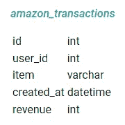

# 亚马逊数据科学面试问题

> 原文：<https://towardsdatascience.com/amazon-data-science-interview-questions-bb217eb040f6>

## *准备一次面试，以获得亚马逊的数据科学家职位*


作者在 [Canva](https://canva.com/) 上创建的图片

亚马逊是电子商务巨头，也是世界上最有价值的品牌之一。数据收集和分析是亚马逊商业模式的关键。这家电子商务巨头使用数据来个性化用户体验，创建和设计产品，甚至提高其业务运营的效率。

考虑到数据对其商业模式的重要性，亚马逊一直在寻找有前途的数据科学家加入其行列。

在面试过程中，你很可能不得不[写一个 SQL 查询](https://www.stratascratch.com/blog/best-practices-to-write-sql-queries-how-to-structure-your-code/?utm_source=blog&utm_medium=click&utm_campaign=medium)来解决一个业务问题。面试官通过观察你处理问题的方式来评估你的分析、理解能力以及关注细节的能力。

在本文中，我们将解决一个亚马逊数据科学面试问题，以展示如何以正确的方式处理这些问题。

# 亚马逊数据科学访谈中测试的基础到中级概念


作者在 [Canva](https://canva.com/) 创建的图像

亚马逊每天都要处理海量数据，所以面试官都在寻找能写出高效代码的候选人。对 SQL 的全面了解也很重要。

除了在面试中展示这些技能，你还需要它们在日常工作中脱颖而出。一旦你得到了它，你需要拿出好的成绩来脱颖而出，推进你的数据科学事业。

编写高效的 SQL 查询归结于使用该语言提供的最合适的工具。

让我们来看看亚马逊数据科学采访中测试的一些最重要的概念:

## 自连接

连接是 SQL 的一个重要特性，具有广泛的潜在应用。关于自联接的知识将使您能够处理单个表的多个引用，这对于解决本指南后面部分概述的问题是必要的。

精通自连接包括知道如何使用别名两次甚至三次引用同一个表。一个好的候选人还知道如何根据上下文给出别名来提高代码的可读性。

JOIN 和 ON 语句是并行的，所以知道如何编写后者也很重要。ON 语句描述两个表之间的关系，或者在自联接的情况下，描述同一表的两个引用之间的关系。

您可以使用 ON 语句来过滤记录，以满足特定的条件。查看“ [*SQL 连接面试问题*](https://www.stratascratch.com/blog/sql-join-interview-questions/?utm_source=blog&utm_medium=click&utm_campaign=medium) ”中使用连接的一些例子。了解如何设置条件对于获得预期结果至关重要。设置条件通常包括检查等式或进行比较。

## 间隔

许多 SQL 问题都与日期和时间有关，因此您需要精通日期格式和对日期值执行算术运算。INTERVAL 函数允许您将日期值增加一年或十天。

在 SQL 中，间隔值对于对日期和时间值执行算术运算至关重要。理想的候选人应该能够使用 interval 关键字创建一个基本的间隔值，以指定值和时间单位，如“10 天”。知道间隔值不区分大小写也是有好处的。

一般来说，考生至少应该具备加减日期值的基本知识，知道这些运算之后日期值会发生什么变化。

文章“ [*基于 SQL 场景的面试问题*](https://www.stratascratch.com/blog/sql-scenario-based-interview-questions-and-answers/?utm_source=blog&utm_medium=click&utm_campaign=medium) ”大体描述了日期-时间值的区间函数和算术运算。

## SQL 逻辑运算符

要设置复杂的条件，必须熟练掌握逻辑运算符。它们允许您找到 SQL 问题的答案，其中您必须找到满足特定标准的记录。精通逻辑运算符意味着能够将它们链接起来以获得想要的结果。

在本指南的后面部分，我们将解决一个要求您在逻辑运算符之间使用 and 和 AND 的问题。然而，这只是冰山一角，因为 SQL 中还有更多类型的逻辑运算符。

为了最大化你获得数据科学工作的机会，学习所有不同类型的逻辑运算符，并理解在 SQL 中使用逻辑运算符的可能性。

## SQL 中的数据类型

数据类型是 SQL 中最重要的概念之一。所有参加亚马逊数据科学面试的候选人都应该对使用每种数据类型的可能性和每种数据类型可能使用的功能有所了解。

所有有抱负的数据科学家都应该能够找出 SQL 中值的数据类型。除此之外，他们应该能够解释人类读取值的方式与计算机读取值的方式之间的差异。例如，是什么让 SQL 将一些数值视为数字，而将其他数值视为文本，即使它们看起来像数字？

了解使用每种数据类型的规则会很有帮助。例如，知道数值不能包含空格或逗号这一事实可以帮助您避免错误。

## 铸造值

[数据科学面试问题](https://www.stratascratch.com/blog/40-data-science-interview-questions-from-top-companies/?utm_source=blog&utm_medium=click&utm_campaign=medium)旨在具有挑战性。通常，您需要将一种值类型转换为另一种值类型来使用它。

了解用于转换值的函数及其语法是非常重要的。有些函数有简写语法，这对代码的可读性很有用。我们的问题的正确解决方案之一是使用双冒号语法对日期值执行算术运算。

# 亚马逊数据科学面试问题演练

让我们来看一个简单的问题，亚马逊面试官用这个问题来测试应聘者的 SQL 熟练程度。

**寻找用户购买**

这个问题被标记为“中等”难度，并给候选人一个相当简单的任务:返回活跃用户的列表。它还给出了什么是活跃用户的定义。在着手解决问题之前，最好多读几遍这个问题。


截图来自 [StrataScratch](https://platform.stratascratch.com/coding/10322-finding-user-purchases?code_type=1&utm_source=blog&utm_medium=click&utm_campaign=medium)

问题链接:[https://platform . stratascratch . com/coding/10322-finding-user-purchases](https://platform.stratascratch.com/coding/10322-finding-user-purchases?code_type=1&utm_source=blog&utm_medium=click&utm_campaign=medium)

要回答该问题，申请者必须找到满足指定标准的记录。问题最具挑战性的部分是在问题描述中设置一个反映标准的条件。

第一步应该是分析成为“活跃用户”意味着什么，并将其转化为 SQL 代码。然后你应该决定你解决问题的方法。你应该以效率为目标，用最少的代码找到解决方案。

# 可用数据集



# 数据假设

试图分析这个问题的可用数据的候选人有一个简单的任务:只有一个包含五列的表。

让我们检查唯一可用的 **amazon_transactions** 表的每一列:

*   我们使用订单本身的 **id** 值来确保我们比较两个单独的订单来确定它们之间的时间间隔，而不是将一个订单与其自身进行比较。
*   为了识别下订单的用户，我们必须处理来自 **user_id** 列的值。
*   产品种类不是重要因素，所以**项**栏可以忽略。
*   两个订单之间的时间间隔是一个重要的因素，所以我们必须使用来自 **created_at** 列的值。
*   **收入**列并不重要，因为这个问题并没有以任何方式提到或暗示需要计算销售量。

尽管如此，可能还有一些细节需要注意。例如，查看可用数据，您会注意到 **created_at** 列只包含日期值，没有时间。在这种情况下，当一些用户在同一天下了两个订单时，您可能会感到困惑。


截图来自 [StrataScratch](https://platform.stratascratch.com/coding/10322-finding-user-purchases?code_type=1&utm_source=blog&utm_medium=click&utm_campaign=medium)

在这种情况下，很难确定哪个订单应该先来，哪个应该后来。要找到解决这一困境的办法，你需要消化问题的提法。

活动用户的定义对订单顺序没有任何重要性。只要它们发生在任何给定的 7 天窗口内，哪个订单先出现并不重要。重要的是两者之间的时间间隔在 0 到 7 天之间。

当对数据中的异常情况感到困惑时，你应该做的第一件事是仔细阅读问题的措辞。如果问题包含帮助你做出决定的关键词，你应该继续你的方法。

有些情况下，你必须善于沟通，并与面试官反复核对，以确保你没有偏离正确的轨道。尽管如此，你不应该走极端；展现独立性和分析思维能力很重要。

# 解决方案逻辑

在编写任何 SQL 代码之前，候选人应该理解这个问题，并从逻辑上阐明她的方法。仔细阅读每一句话，因为有时只有一个词可以改变任务的意义。通过问这个问题，面试官不仅测试你的 SQL 技能，也测试你倾听和理解任务的能力。

在 SQL 中，连接对于处理两行之间的时差很有用。考虑到我们只有一个表，我们可能需要使用一个自连接。您的整体方法应该包括以下步骤:

1.  创建对该表的两个引用，并用自联接将它们连接起来
2.  使用 ON 语句设置条件，以查找符合条件的行
3.  处理边缘情况

这个问题要求我们返回满足条件(作为一个活动用户)的各个行的值。在考虑这个问题的解决方案时，关注活跃用户的定义是非常重要的。

在 7 天窗口内的任何两次购买都足以将其中一次视为“活跃用户”。为了找到符合标准的订单，我们将交叉检查所有订单，以找到符合标准的订单对。

这个亚马逊数据科学面试问题最具挑战性的部分是设置一系列条件。

第一个条件是订单必须由同一个人下。换句话说，我们应该遍历表的两个引用，找到具有相同 **user_id** 值的订单记录。

下一步是比较订单本身的 **id** 。这是必要的，以避免当我们将订单与其在另一个表中的副本进行比较，并将其作为“活动用户”的另一个实例时，仅仅因为订单的两个副本具有相同的日期。

最后，在比较两个订单时，我们必须检查其中一个订单是在同一天发生的，还是在第一个订单之后的七天内发生的。为此，我们可以使用简单的比较操作符、=。

为了比较两个订单的日期，我们必须访问它们的 **created_at** 值。假设我们有日期值 x 和 y。在 SQL 中，检查 x 是否发生在 y 之后(换句话说，比 y 更近)。

为了检查某个日期值是否比另一个日期值旧，我们使用小于(< ) sign. The condition **x < y** 来检查 **x** 是否出现在 **y** 之前。

我们将使用等号(=)和大于号(>)运算符来检查第二个订单是否发生在第一个订单的 **created_at** 值的同一天或之后。但是我们如何检查第二个订单是否发生在第一个订单之后不超过 7 天？

假设 x 是当前日期。您可以使用 INTERVAL 函数将 7 天添加到当前日期，然后使用它进行比较。

我们将不得不使用 AND 逻辑操作符将上面列出的多个条件连接起来。

请记住，我们必须找到活动用户的 user_id 值。这很简单，因为这些记录已经包含了 **user_id** 列。我们只需找到满足这些要求的两个订单记录，并从其中一个引用中输出 **user_id** 值。

最后，我们还必须处理用户不止一次激活的情况。问题描述不要求我们找出用户变得活跃的次数，所以我们不需要跟踪用户变得活跃的多个实例。我们可以使用 DISTINCT 关键字来确保最终的列表只包含唯一的用户 id。

# 解决方法

## 步骤 1:创建对表的两个引用

因为我们试图找到在某段时间内发生的两个订单，所以我们需要对同一个表进行两次引用。为了简单起见，我们称它们为 a 和 b。

```
SELECT *
FROM amazon_transactions a
JOIN amazon_transactions b
```

## 步骤 2:设置条件

现在我们到了困难的部分。我们必须建立条件以确保:

1.  订单是由同一用户下的，
2.  我们不是在比较订单本身，
3.  第二个参考的订单创建时间晚于第一个参考的订单，但不晚于 7 天。

我们将使用 AND 逻辑运算符，因此 SQL 只返回满足所有三个条件的行。

我们将使用 INTERVAL 函数的简单语法来检查两个订单是否在 7 天的窗口内。

```
SELECT *
FROM amazon_transactions a
JOIN amazon_transactions b ON a.user_id = b.user_id
AND a.id != b.id
AND b.created_at >= a.created_at
AND b.created_at <= a.created_at + INTERVAL '7 day'
```

现在，如果我们运行代码并查看输出，您将看到所有满足条件的行:


截图来自 [StrataScratch](https://platform.stratascratch.com/coding/10322-finding-user-purchases?code_type=1&utm_source=blog&utm_medium=click&utm_campaign=medium)

## 步骤 3:输出 user_id 值，处理边缘情况

这个问题要求我们输出活动用户的 **user_id** 值，而不是整行。我们必须修改我们的 SELECT 语句，从一个引用中返回 **user_id** 值。

一些用户订购很多，所以他们可能会多次满足我们成为“活跃用户”的条件。我们可以使用 DISTINCT 语句只显示每个用户一次。

```
SELECT DISTINCT a.user_id
FROM amazon_transactions a
JOIN amazon_transactions b ON a.user_id = b.user_id
AND a.id != b.id
AND b.created_at >= a.created_at
AND b.created_at <= a.created_at + INTERVAL '7 day'
```

运行这段代码，您将看到活动用户的唯一值的列表。


截图来自 [StrataScratch](https://platform.stratascratch.com/coding/10322-finding-user-purchases?code_type=1&utm_source=blog&utm_medium=click&utm_campaign=medium)

# 另一个正确的解决方案

有多种方法可以设置条件来检查 7 天内是否发生了两个订单。这种方法与 StrataScratch 平台略有不同:

```
SELECT DISTINCT(a1.user_id)
FROM amazon_transactions a1
JOIN amazon_transactions a2 ON a1.user_id=a2.user_id
AND a1.id <> a2.id
AND a2.created_at::date-a1.created_at::date BETWEEN 0 AND 7
ORDER BY a1.user_id
```

在这种情况下，我们使用 BETWEEN and 和逻辑运算符来检查两个日期之间的时间差是否在 0 到 7 天之间。

# 最后的话

在本文中，我们浏览了在亚马逊面试中向数据科学家候选人提出的一个有趣的问题。

[通过研究问题为数据科学工作面试做准备](https://www.stratascratch.com/blog/5-tips-to-prepare-for-a-data-science-interview/?utm_source=blog&utm_medium=click&utm_campaign=medium)是一个良好的开端，但真正做好准备取决于对所有 SQL 概念的透彻理解，以便提出高效的解决方案。

查看我们的其他帖子，如“ [*亚马逊 SQL 面试问题*](https://www.stratascratch.com/blog/amazon-sql-interview-questions/?utm_source=blog&utm_medium=click&utm_campaign=medium) ”和“ [*亚马逊数据分析师面试问题*](https://www.stratascratch.com/blog/amazon-data-analyst-interview-questions/?utm_source=blog&utm_medium=click&utm_campaign=medium) ”来提高你的 SQL 技能，最大限度地增加你在亚马逊找到工作的机会。