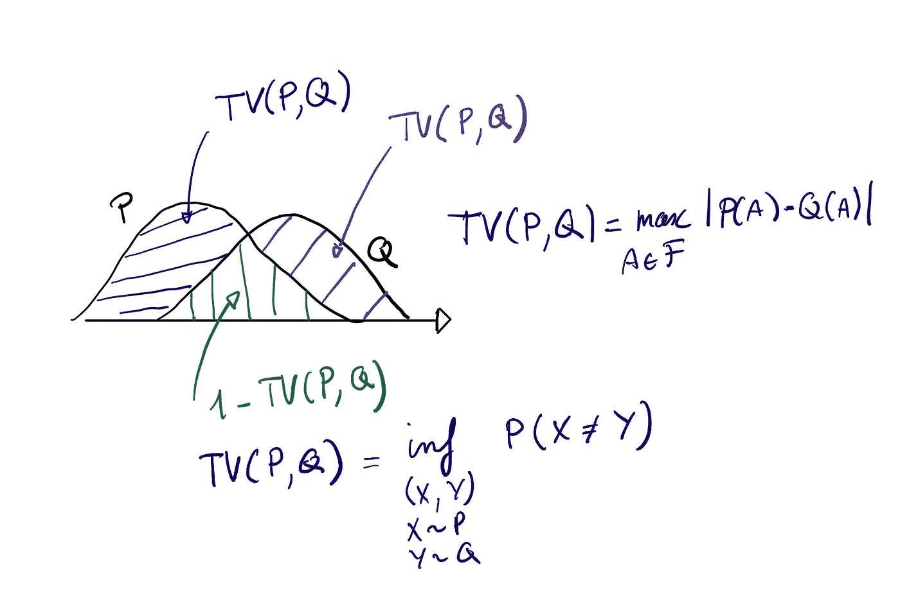
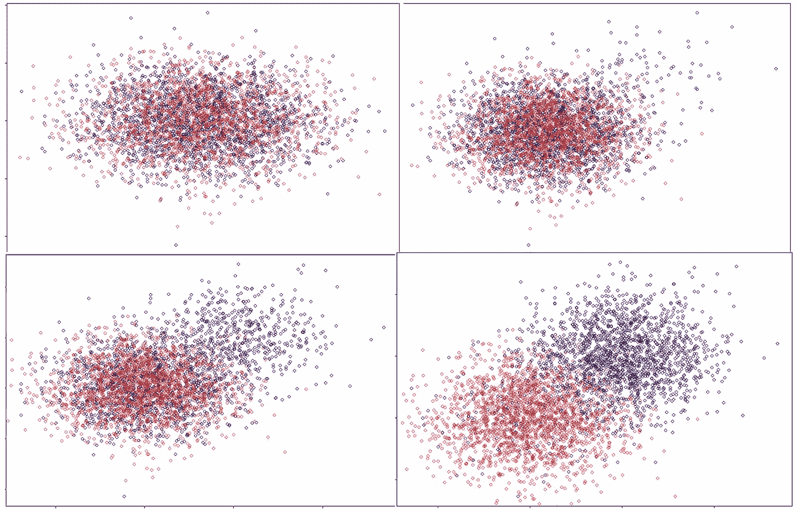

# A/B 测试中 p 值的替代方法

> 原文：<https://towardsdatascience.com/an-alternative-to-p-values-in-a-b-testing-44f1406d3f91>

## 在 A/B 测试中，总变异距离的高概率下界(HPLBs)如何能产生一个综合的有吸引力的测试统计量


图 1:来自原始论文的图(作者)

撰稿人:[洛里斯·米歇尔](https://medium.com/u/f562dceaeb63?source=post_page-----44f1406d3f91--------------------------------)，[杰弗里·纳夫](https://medium.com/u/ca780798011a?source=post_page-----44f1406d3f91--------------------------------)

一般 A/B 测试的经典步骤，即决定两组观察值是否来自不同的分布(比如 P 和 Q)，是:

*   假设一个零假设和一个备择假设(这里分别为 P=Q 和 P≠Q)；
*   定义重要性水平α；
*   构建一个统计测试(拒绝或不拒绝空值的二元决策)；
*   导出测试统计量 T；
*   从 t 的近似/渐近/精确零分布获得 p 值。

然而，当这样的检验拒绝零，即当 P 值是显著的(在给定的水平上)时，我们仍然缺乏对 P 和 Q 之间的差异有多强的度量。事实上，测试的拒绝状态在现代应用中可能是无用的信息(复杂数据)，因为有足够的样本量(假设水平和功效固定)，任何测试都倾向于拒绝空值(因为它很少完全为真)。例如，了解有多少数据点支持分布差异是很有趣的。

因此，基于来自 P 和 Q 的有限样本，一个比“P 不同于 Q 吗？”可以表述为“实际支持 P 和 Q 之间分布差异的观测值λ的概率下限是多少？”。这将正式转化为以高概率(比如 1-α)满足λˇ≤λ的估计值λˇ的构造。我们称这样的估计为λ上的**高概率下界** (HPLB)。

在这个故事中，我们想鼓励在 A/B 测试中使用 HPLBs，并给出一个论点，说明为什么λ的正确概念是 P 和 Q 之间的[总变化距离](https://en.wikipedia.org/wiki/Total_variation_distance_of_probability_measures)，即 TV(P，Q)。我们将在另一篇文章中解释和详细描述这种 HPLB 的构造。您可以随时查看我们的[***pape***r](https://arxiv.org/pdf/2005.06006.pdf)了解更多详情。

**为什么总变异距离？**

总变异距离是概率的一个强(细)度量。这意味着如果两个概率分布不同，那么它们的总变化距离将是非零的。它通常被定义为集合上概率的最大不一致。然而，它更直观地表现为概率 P 和 Q 之间的离散传输度量(见图 2):

> 概率度量 P 和 Q 之间的总变化距离是需要从 P 改变/移动以获得概率度量 Q 的概率质量的分数(反之亦然)。

实际上，总变化距离代表 P 和 Q 之间的点的分数，这正是λ的正确概念。



图 2:左上方表示 TV(P，Q)的可能质量差。右上角通常定义为 TV(P，Q)最大概率不一致(在 sigma 代数上)。底部离散的最佳运输公式，质量分数不同于 P 和 Q(作者)。

**如何使用 HPLB 及其优势？**

估计值λˇ对 A/B 测试很有吸引力，因为这个单一的数字既包含了**统计显著性**(如 p 值一样)又包含了**效应大小**估计值。它可以按如下方式使用:

*   定义置信水平(1-alpha)；
*   基于这两个样本构造 HPLBλˇ；
*   如果λˇ是零，则不拒绝该空值，否则如果λˇ> 0，则拒绝该空值，并推断λ(不同的分数)至少是概率为 1-α的λˇ。

当然，要付出的代价是λˇ的值取决于所选的置信水平(1-α),而 p 值与之无关。然而，在实践中，置信水平变化不大(通常设置为 95%)。

考虑医学中效应大小的例子。与没有接受药物治疗的安慰剂组相比，新的药物治疗需要在实验组中具有显著的效果。但影响有多大也很重要。因此，我们不应该只谈论 p 值，还应该给出一些效应大小的度量。这一点现在在优秀的医学研究中得到广泛认可。事实上，一种使用更直观的方法计算 TV(P，Q)的方法已被用于单变量设置，以描述治疗组和对照组之间的差异。我们的 HPLB 方法提供了显著性和效应大小的度量。让我们用一个例子来说明这一点:

**举个例子**

我们模拟二维的两个分布 P 和 Q。因此，P 将只是一个多元正态分布，而 Q 是 P 和具有移动平均值的多元正态分布之间的一个*混合物*。

```
library(mvtnorm)
library(HPLB)set.seed(1)
n<-2000
p<-2#Larger delta -> more difference between P and Q
#Smaller delta -> Less difference between P and Q
delta<-0# Simulate X~P and Y~Q for given delta
U<-runif(n)
X<-rmvnorm(n=n, sig=diag(p))
Y<- (U <=delta)*rmvnorm(n=n, mean=rep(2,p), sig=diag(p))+ (1-(U <=delta))*rmvnorm(n=n, sig=diag(p))plot(Y, cex=0.8, col="darkblue")
points(X, cex=0.8, col="red")
```

混合权重增量控制两个分布的不同程度。delta 从 0 到 0.9 变化，如下所示:



模拟 delta=0(右上)、delta=0.05(左上)、delta=0.3(右下)和 delta=0.8(左下)的数据。来源:作者

然后，我们可以计算每种情况下的 HPLB:

```
#Estimate HPLB for each case (vary delta and rerun the code)
t.train<- c(rep(0,n/2), rep(1,n/2) )
xy.train <-rbind(X[1:(n/2),], Y[1:(n/2),])
t.test<- c(rep(0,n/2), rep(1,n/2) )
xy.test <-rbind(X[(n/2+1):n,], Y[(n/2+1):n,])
rf <- ranger::ranger(t~., data.frame(t=t.train,x=xy.train))
rho <- predict(rf, data.frame(t=t.test,x=xy.test))$predictionstvhat <- HPLB(t = t.test, rho = rho, estimator.type = "adapt")
tvhat
```

如果我们用上面的种子集来做，我们


不同增量的估计值。

因此，HPLB 设法(I)检测何时两个分布确实没有变化，即当δ为零时它为零，(ii)当δ仅为 0.05 时已经检测到极小的差异，以及(iii)检测到差异越大，δ越大。同样，需要记住的关于这些值的重要事情是，它们确实有意义——值 0.64 将是真实 TV 的下限，概率很高。特别是，每一个大于零的数字都意味着 P=Q 在 5%的水平上被拒绝。

**结论:**

当涉及到 A/B 测试(双样本测试)时，重点通常是统计测试的拒绝状态。当检验拒绝零分布时，在实践中有一个分布差异的强度度量是有用的。通过构建总变化距离的高概率下限，我们可以构建预期不同的观测值部分的下限，从而提供分布差异和偏移强度的综合答案。

***免责声明和资源:*** *我们意识到我们遗漏了许多细节(效率、HPLBs 的构建、功率研究……)，但希望能够开阔思路。在我们的* [***页面***R](https://arxiv.org/pdf/2005.06006.pdf)**中可以找到 M *矿石的详细信息以及与现有试验的比较，并查看起重机上的 R-package HPLB。***