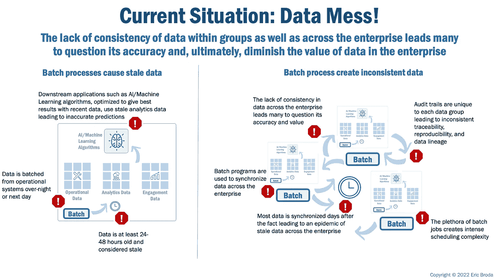
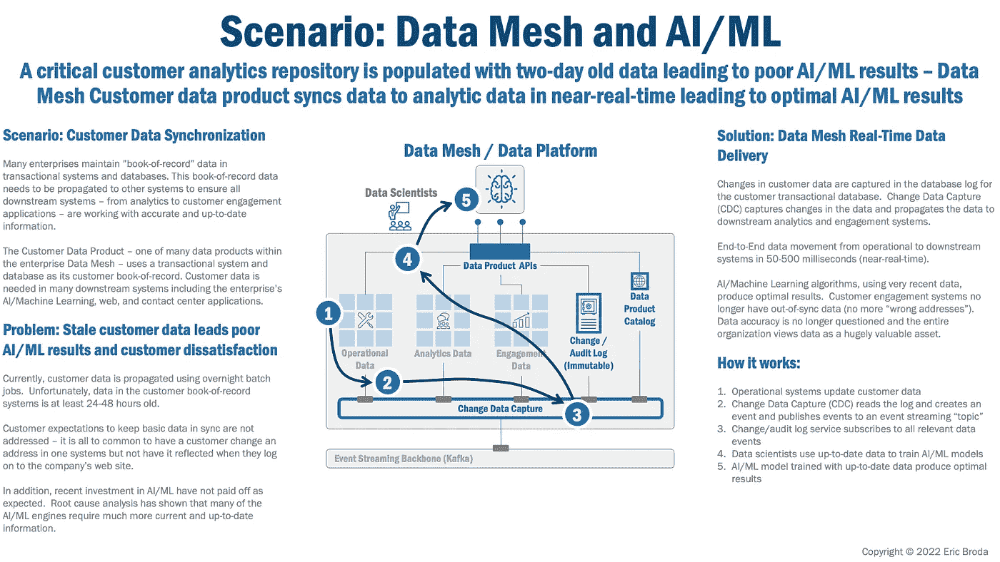
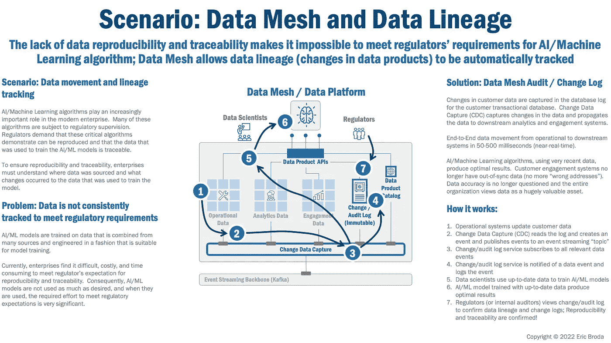
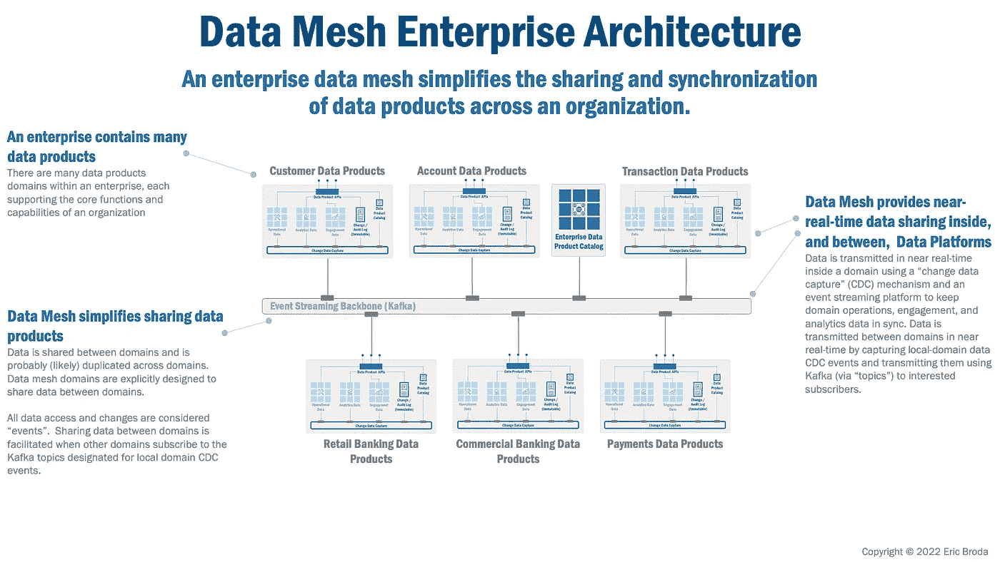
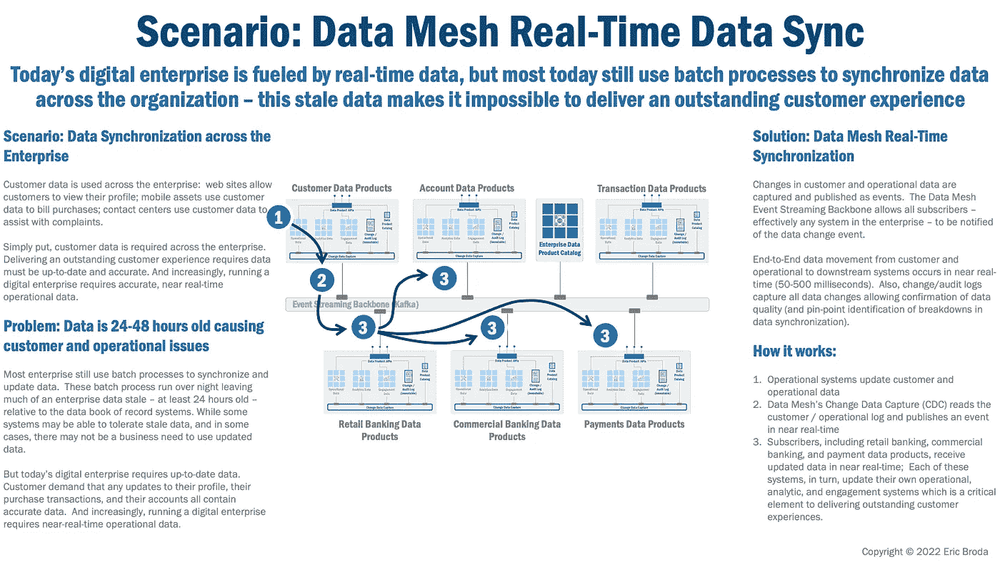

# 数据网格的体系结构

> 原文：<https://towardsdatascience.com/an-architecture-for-the-data-mesh-32ff4a15f16f>

# 数据网格的体系结构

## 数据网格正在革新企业数据管理。但是实际的数据网格架构是什么样的呢？

照片由 [Unsplash](https://unsplash.com/s/photos/blueprint-vintage?utm_source=unsplash&utm_medium=referral&utm_content=creditCopyText) 上的 [Dariusz Sankowski](https://unsplash.com/@dariuszsankowski?utm_source=unsplash&utm_medium=referral&utm_content=creditCopyText) 拍摄

# 数据网格正在革新企业数据管理

数据是新的黄金，至少他们是这么说的。但是最近挖掘这些数据价值的努力经常失败。在某些情况下，令人沮丧地失败了。我们尝试了数据仓库，但是整个企业中不一致的数据将它们变成了数据丛林。因此，我们尝试了“数据湖”,但是陈旧的数据将它们变成了数据沼泽！

因此，对数据网格持怀疑态度是合理的。它是最新的时尚还是提供了实用和持久的价值？嗯，我想这个问题还没有定论，但是我最初的观点是——在一家大型金融服务公司建立了一个现代数据网格——数据网格是实用的、可行的，而且最重要的是，它可以显著加快解决方案的交付。

但是有许多文章论述了*为什么*数据网格将改变企业数据格局，我不会试图再现这些见解(但是如果您希望阅读更多内容，请查看[此处](/an-architecture-for-the-data-mesh-32ff4a15f16f)、[此处](/data-mesh-architecture-patterns-98cc1014f251)，以及[此处](https://martinfowler.com/articles/data-monolith-to-mesh.html))。但是，鉴于我对概念感兴趣，我认为解释一下如何实现数据网格会更有用。更具体地说，本文讨论了几个主题:

*   **数据网格架构**，展示了如何使用基础技术来创建数据产品，而这些数据产品又可以组合成企业数据网格
*   **数据网格实时同步场景**，展示了数据网格/数据产品如何允许数据在整个企业内近乎实时地迁移，这可能首次解决“陈旧数据”问题
*   **数据网格人工智能/人工智能场景**，展示数据网格/数据如何产生关键数据谱系、可追溯性和可再现性，这将允许高级人工智能/人工智能模型更轻松地处理任务关键型工作负载
*   **数据网格治理和可审计性场景**，展示数据网格/数据产品如何捕捉有望彻底改变数据治理的数据变化

# 数据混乱—陈旧和不一致的数据在企业中激增

企业数据领域充斥着新数据技术的尸体。企业的“数据仓库”为分析数据提供了一个家。但它们从未解决数据一致性问题，我们很快发现，用一两天前的旧数据填充它们会使重要的分析数据变得陈旧。数据仓库变成了数据丛林。

因此，我们将数据仓库整合到“数据湖”中，并了解到查找数据并保持其一致性非常困难，并且在许多情况下不太实际，这导致用户(和高管)质疑数据的有用性。数据湖变成了数据沼泽。

*图 1:现状:数据混乱*

可以肯定地说，我们在企业中的移动方式(图 1)是一项重大挑战:

*   **陈旧数据**:批处理过程在一夜之间移动记录簿数据，留下许多系统至少 24 小时的数据；即使使用在线流程来更新数据，它们通常也是定制的，构建起来既昂贵又耗时，这可能导致它们很少被构建！
*   **不一致的数据**:批处理过程会产生不一致的数据，因为下游数据是在已经过时的记录簿批量更新后的一天(或两天)处理的；同样，用定制的解决方案来应对这一挑战是不现实的，也是不可行的。

简而言之，我们当前的实践——尤其是那些与跨企业的数据移动相关的实践——已经造成了数据混乱！

# 数据网格是组件的组合

我们遗留的数据混乱不会很快消失。然而，根据我的实际操作经验，“数据网格”将大大简化企业的数据环境，并为准确和一致的数据提供基础。

据最初概念的创造者 Zhamak Dehghani 称，数据网格是基于几个[原则](https://martinfowler.com/articles/data-mesh-principles.html):

*   **面向领域、分散的数据所有权和架构**:数据网格的核心是将责任分散和分配给最接近数据的人，以支持持续变化和可伸缩性
*   **数据即产品**:数据网格支持多种功能:包括可发现性、安全性、可探索性、可理解性、可信赖性，同时定义了负责建立这些功能的角色—域数据所有者。
*   **作为平台的自助式数据基础架构**:数据网格允许数据所有者以简单易用的自助式方式提供数据
*   **联合计算治理**:数据网格实现了一个联邦治理模型，该模型包含去中心化和领域自治、通过全球标准化实现的互操作性、动态拓扑以及最重要的平台决策的自动执行

图 2:数据网格原则

但最重要的是，这些原则允许数据网格提供引人注目的好处和结果。首先，它们不仅允许跨分析领域集成数据，还允许跨运营(交易)和参与(为与客户交互而优化)领域集成数据。

其次，数据网格提供了一种使用一组一致的可发现和自助服务接口连接企业的方法，从而提供了对整个企业中数据的无缝访问。现在，数据确实可以很容易地找到、使用和管理。

如今，这些原则并没有体现在任何单一供应商的产品中。但是，假以时日，供应商将提供真正的数据网格功能。然而，今天的数据网格必须由组件组装而成。数据网格是由许多较小的乐高积木搭建而成的乐高飞船(图 2)。

那么，这些构建块是什么，它们看起来像什么，以及如何将它们组装成数据网格？

# 数据网格/数据产品架构

数据网格体系结构中有几个关键组件(图 3 ):一个数据产品和一个数据网格，该数据网格集合了整个企业中的数据产品并使其可访问。

*图 3:数据产品(概念架构)*

先说一个数据产品。根据前面提到的数据网格原则，企业中会有许多数据产品，但每个产品都由相同的组件组成:

*   **数据**，包括
*   ****数据事件**，定义和描述与数据产品相关的任何状态变化、命令或数据传输；事件从许多来源生成，包括数据产品 API(每个请求都可以是一个事件)、[变更数据捕获](https://medium.com/@ericbroda/data-mesh-pattern-deep-dive-change-data-capture-eb3090178c34)(数据的每个变更都是一个事件)，以及数据目录变更(元数据的变更是发布给感兴趣的订户的事件)**

*   **[**数据产品目录**](/data-mesh-pattern-enterprise-data-product-catalog-ba4bf072d7c3) ，描述驻留在数据产品中的数据，同时提供用户界面和 API，使用户和机器都能轻松消费数据产品；数据产品目录集成到企业数据目录中，为所有数据产品提供一致的企业视图**

*   **[**数据产品不可变变更/审计日志**](/data-mesh-patterns-immutable-change-audit-log-aec93da33648) ，它跟踪并记录对数据产品的所有变更，以支持联合治理以及审计需求**
*   **[**事件流骨干**](/data-mesh-pattern-deep-dive-event-streaming-backbone-99a5bb2a7cbf) ，使数据产品内部以及整个企业之间的数据事件通信变得简单**

# **数据网格/数据产品场景:数据网格和 AI/ML**

**人工智能/人工智能模型的好坏取决于训练它们所用的数据。因此，我们最好确保我们用来训练这些模型的数据是准确和一致的。但是，如何在运营和分析(或参与)系统/数据库之间及时移动数据呢？**

**在图 4 中，我们展示了数据网格如何解决这种情况:**

1.  **运营系统更新客户数据**
2.  **[变更数据捕获](https://medium.com/@ericbroda/data-mesh-pattern-deep-dive-change-data-capture-eb3090178c34) (CDC)读取操作数据库事务日志，获取客户数据变更，然后创建一个事件并发布到由事件流主干(通常是 Kafka)管理的“主题”中**
3.  **订户——在我们的例子中是客户分析系统——会收到客户数据变更事件的通知**
4.  **分析系统用收到的事件中的信息更新其数据库**
5.  **AI/ML 算法使用最新和一致的数据来训练它们的模型，从而获得最佳结果**

****

***图 4:数据网格/数据产品场景:AI/ML***

# **数据网格/数据产品场景:数据沿袭**

**企业对模型可再现性、可追溯性和可验证性的需求迫使组织[重新思考](/rethinking-ai-machine-learning-model-management-8afeaa31d8f8)传统的 AI/ML 交付生命周期。特别是，金融服务、监管机构要求明确的模型可再现性、可追溯性和可验证性(详见[欧盟](https://eba.europa.eu/regulation-and-policy/model-validation)、[美国](https://www.federalreserve.gov/supervisionreg/srletters/sr1107.htm)和[加拿大](http://www.osfi-bsif.gc.ca/Eng/fi-if/rg-ro/gdn-ort/gl-ld/Pages/e23.aspx))。但是从医疗保健和生物技术到政府安全的许多其他行业也有类似的要求。事实上，现在即使是适度监管行业的企业也发现可重复性、可追溯性和可验证性的好处远远超过了它们的成本。**

**但是今天模型的可再现性、可追溯性和可验证性是如何解决的呢？企业退回到两种情况。一些企业使用端到端分析包(例如 [SAS](https://www.sas.com/) )将这些功能嵌入到它们的生命周期中，但这种情况使企业受制于专有的供应商产品，这对那些希望利用强大的开源 AI/ML 组件的企业来说是一个不利因素。**

**第二种选择是企业构建定制的组件来建立数据血统，以支持可再现性、可追溯性和可验证性。不幸的是，这种方法既昂贵又耗时，因此只适用于最关键的人工智能/人工智能模型，最终限制了人工智能/人工智能模型的机会和价值。**

****

***图 5:数据网格/数据产品场景:数据谱系***

**在图 5 中，我们展示了数据网格如何解决这种情况。该场景几乎与前一个场景(图 4)相同，只是增加了一些关键的内容。在步骤 4 中，“变更/审计日志”服务订阅被写入(在通知变更时)不可变的仅附加“变更/审计日志”的数据变更(注意，这是可配置的，使得它可以应用于任何/所有更新)。接下来，在步骤 7 中，监管机构可以检查(通过工具/实用程序)来自工具和实用程序的报告/证据，这些报告/证据说明了再现性、可追溯性和可验证性所需的数据谱系。**

# **数据网格企业架构**

**数据网格是使用企业数据产品目录支持的事件流主干连接的一组数据产品。一个企业有许多数据产品，每一个都是围绕与企业相关的业务线或组来组织的。通过捕获数据更改并将其作为事件发布在企业流主干网上，数据产品之间共享数据，从而允许订户(实际上是任何应用程序或系统)获得他们感兴趣的数据更改的通知。**

**尤其重要的是企业数据目录，它与数据产品目录同步(使用数据网格功能),以跟踪整个企业中的数据元素(即驻留在每个数据产品中的数据)。借助强大的搜索/查找功能，企业数据目录可以轻松地在整个企业中查找数据。**

****

***图 6:数据网格企业架构***

**数据网格提供了工具和机制来简化数据产品的连接:**

*   ****数据网格使数据共享变得容易**:数据在域之间共享，并且很可能跨域重复。数据网格域被明确设计为在域之间共享数据。所有数据产品访问和更改都被视为事件，这些事件在数据产品内部共享，但也在使用事件流主干的数据产品之间共享。事件被发布到一个“主题”上，任何订阅者都可以得到任何事件的通知。**
*   ****数据网格支持近实时数据共享**:使用“[变更数据捕获](https://medium.com/@ericbroda/data-mesh-pattern-deep-dive-change-data-capture-eb3090178c34)”(CDC)机制在域内近实时传输数据，从而保持域操作、参与和分析数据同步，同时通过捕获本地域数据 CDC 事件并使用 Kafka 等事件流主干(通过“主题”)将它们传输给感兴趣的订户，在域间近实时传输数据。**
*   ****数据网格与企业数据目录集成**:每个数据产品都与企业数据目录近乎实时地集成在一起，允许任何用户(或机器)访问企业中任何数据产品的相关信息。这种可见性、透明性和即时性是联合治理的基础。**

# **企业数据网格场景:实时数据同步**

**简而言之，数据网格使得在企业内部共享和同步数据产品变得简单。大多数企业有许多数据产品，其中一些可能反映业务领域(“零售银行”、“支付”、“商业银行”)，而其他可能反映数据领域(“客户”、“账户”、“交易”)。**

****

***图 7:企业数据网格场景:实时数据同步***

**在图 7 中，我们看到了如何在整个企业中移动和同步数据:**

1.  **操作系统更新数据**
2.  **数据网格 CDC 捕获数据产品中的数据更改**
3.  **订阅者——实际上是企业中的任何应用程序/系统——接收数据更改通知并更新其本地存储库。**

# **总结想法**

**数据网格使正确的数据在正确的时间可用，使企业能够自由地推动当今市场所需的创新、速度和敏捷性。它允许一个真正的联合数据访问、交付和管理模型，该模型不受官僚流程的约束，而是允许任何企业团队在任何时间以自动化的方式使用他们的项目、小组或业务线所需的数据。**

**旧的数据管理模型就是这样。老了。他们的时代已经过去了。**

**数据网格确实是更好的方法！**