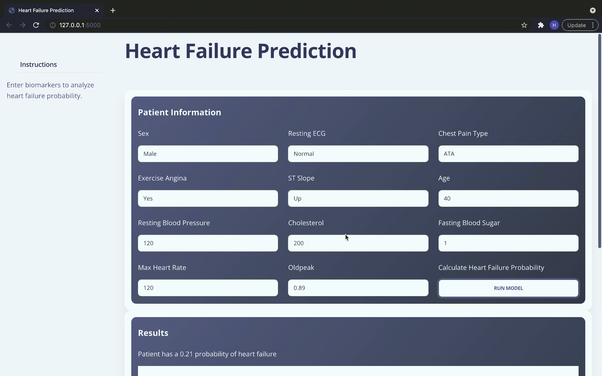
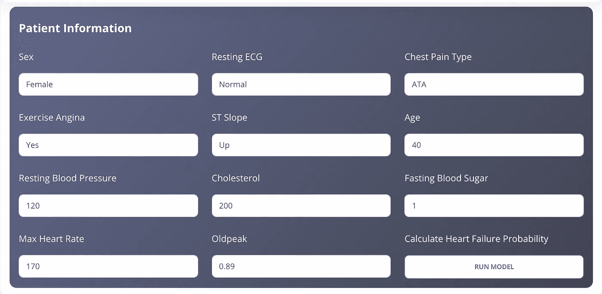
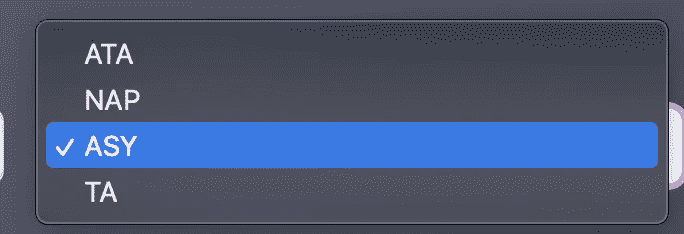
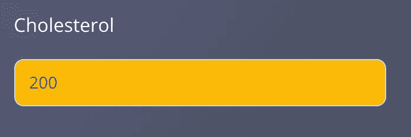
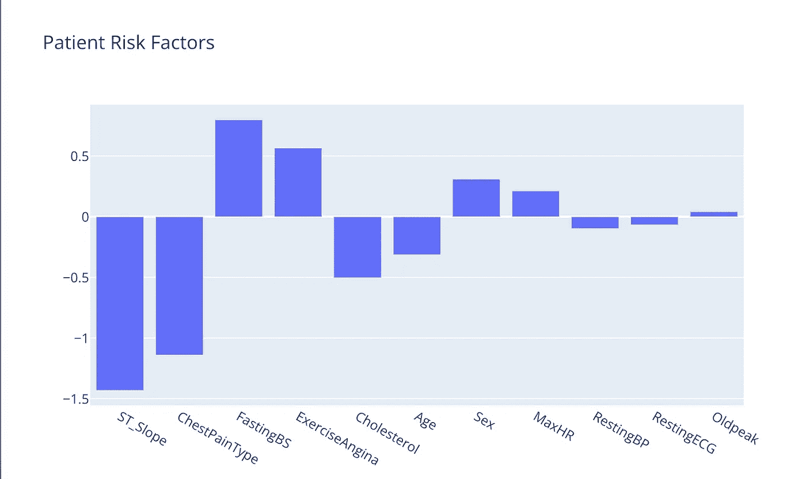
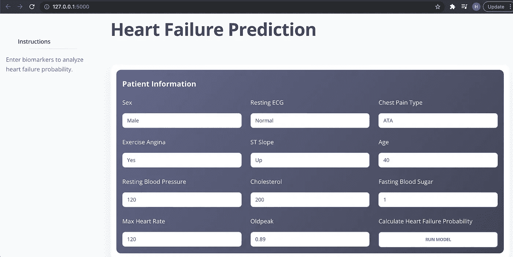

# 端到端机器学习项目:心力衰竭预测，第 2 部分

> 原文：<https://towardsdatascience.com/an-end-to-end-machine-learning-project-heart-failure-prediction-part-2-4518d2596421>

## web 应用程序中的模型部署

欢迎来到端到端机器学习项目系列的第二部分！在[第一篇文章](/an-end-to-end-machine-learning-project-heart-failure-prediction-part-1-ccad0b3b468a)中，我们训练、验证、调整并保存了一个使用患者信息来预测心力衰竭概率的机器学习模型。在本文中，我们将开发一个 web 应用程序，任何人都可以通过它与我们的模型进行交互。应用程序的前端将由 HTML、CSS 和 JavaScript 处理，后端将使用 Flask 用 python 编写。和往常一样，文章中使用的所有代码都可以在 [GitHub](https://github.com/hfhoffman1144/Heart-Disease-Prediction) 上找到。应用程序的部署版本可以在[这里](https://hf-predictor.herokuapp.com/)找到。



心力衰竭预测应用程序。图片作者。

# 目录结构

让我们首先检查这个应用程序的目录结构:

```
-/ flaskapp
   -/ models
     - heart_disease_model_2021-12-28
   -/ services
     - model_utils.py
   -/ static
     -/css
     -/ fonts
     -/ img
     -/ js
   -/ templates
     - index.html
   - api_routes.py
   - app.py 
-/ notebooks
requirements.txt
```

这个项目的两个主要目录是“flaskapp”和“notebooks”。“笔记本”目录包含我们在上一篇文章中用来训练模型的代码。“flaskapp”目录包含将托管心力衰竭模型的 web 应用程序的所有代码。我们可以通过将“flaskapp”目录分成前端和后端组件来考虑它的内容。所有的[前端](https://frontendmasters.com/guides/front-end-handbook/2018/what-is-a-FD.html)组件都包含在“静态”和“模板”目录中。目录的其余部分包含[后端](https://en.wikipedia.org/wiki/Frontend_and_backend)代码和文件。

# 前端

## 模板

“模板”目录的目的是存储应用程序中使用的所有 HTML 文件。这个特殊的应用程序只有一个页面，这个页面的结构是由 index.html 决定的。让我们从主要标题开始，浏览一些主要部分:


主标题。图片作者。

为了显示这一点，我们简单地将“h1”标记包装在“nav”标记中，如下所示:

```
<!-- Navbar --><nav class="navbar navbar-main navbar-expand-lg px-0 mx-4 shadow-none border-radius-xl" id="navbarBlur" navbar-scroll="true"> <h1>Heart Failure Prediction</h1></nav>
```

在‘nav’标签中，我们首先指定一个决定导航条样式的类——我将在下一节解释这个类的来源。接下来，我们指定一个 id，允许我们通过 JavaScript 或 HTML 的其他部分访问 navbar 的任何属性。最后一个参数“navbar-scroll”决定了当用户滚动时，navbar 是否固定在屏幕上。通过将 navbar-scroll 设置为 true，我们可以确保用户在滚动时总能看到 navbr。

向下移动页面，我们有接受用户输入的部分:



用户输入部分。图片作者。

这可以说是 HTML 文件最关键的部分，因为这些输入将通过我们的机器学习模型运行。为了创建这个部分，我们将利用[Bootstrap](https://getbootstrap.com/)——一个前端框架，允许开发人员轻松创建现代响应应用程序。特别是，我们将实现自举[网格系统](https://getbootstrap.com/docs/4.0/layout/grid/)，它允许我们将页面布局组织成行和列。为了说明这一点，让我们看看第一行输入:


第一个输入行。图片作者。

```
<div class="row"> <div class="col-lg-4"> <p style="color: white;">Sex</p> <select class='form-control' name="sex" id="sex" style="width:100%;"> <option value="M">Male</option> <option value="F">Female</option> </select> </div> <div class="col-lg-4"> <p style="color: white;">Resting ECG</p> <select class='form-control' name="restingECG" id="restingECG" style="width:100%;"> <option value="Normal">Normal</option> <option value="ST">ST</option> <option value="LVH">LVH</option> </select> </div> <div class="col-lg-4"> <p style="color: white;">Chest Pain Type</p> <select class='form-control' name="chestPainType" id="chestPainType" style="width:100%;"> <option value="ATA">ATA</option> <option value="NAP">NAP</option> <option value="ASY">ASY</option> <option value="TA">TA</option> </select></div></div>
```

我们首先用类“row”创建一个 div。紧随行 div 之后，我们创建第一个列 div，它包含第一个下拉输入。请注意，该类是“col-lg-4”。每个引导行最多可以包含 12 列；通过将类命名为“col-lg-4”，我们确保了这个 div 将使用父行中 12 个可用列空间中的 4 个。在该列中，我们指定输入的名称，然后用该特性的所有惟一值创建一个 select 标记。例如，以下 HTML 对应于“胸痛类型”下拉列表:

```
<p style="color: white;">Chest Pain Type</p><select class='form-control' name="chestPainType" id="chestPainType" style="width:100%;"> <option value="ATA">ATA</option> <option value="NAP">NAP</option> <option value="ASY">ASY</option> <option value="TA">TA</option></select>
```


图片作者。



图片作者。

需要注意的是，我们给每个“select”标签一个名称和一个 id。我们稍后在 JavaScript 中访问下拉列表的值时会用到这些字段。

我们可以通过简单地使用“input”标签并将类型指定为“number”来创建数字输入。

```
<div class="col-lg-4"> <p style="color: white;">Age</p> <input class='form-control' type="number" id="age" name="age"     value="40" min="0" max="120" style="width:100%;"></div>
```


输入患者年龄。图片作者。

请注意，我们将默认年龄设置为 40，最小年龄设置为 0，最大年龄设置为 120。对于年龄来说，这些是非常容易的选择，但是，一般来说，我们可以使用每个数字输入的分布来确定默认值、最小值和最大值。

index.html 文件中最后一个主要组件是“运行模型”按钮。

```
<div class="col-lg-4"> <p style="color: white;">Calculate Heart Failure Probability</p> <button id='makePred' class="btn btn-outline-primary btn-md mb-0" style="width:100%; background-color: white;">Run model</button></div>
```


运行模型按钮。图片作者。

同样，我们必须给这个按钮一个 id，以便它可以在以后用来触发事件。

## 静态— CSS

层叠样式表(CSS)是一个设计网页样式的框架，这也是为什么我们有漂亮的网页，看起来不像是在 1990 年写的。我不会假装自己是 CSS 专家，但我知道的足够多，足以给出这个应用程序的 CSS 要求的概述。

这款应用的风格改编自[创意蒂姆](https://demos.creative-tim.com/soft-ui-dashboard/pages/dashboard.html)提供的开源 HTML、CSS 和 JavaScript 模板；所有文件都可以在“static/css”目录下找到。为了说明样式是如何工作的，让我们看一下 *soft-ui-dashboard.css* 中的“表单控制”类:

```
.form-control {display: block;
width: 100%;
padding: 0.5rem 0.75rem;
font-size: 0.875rem;
font-weight: 400;
line-height: 1.4rem;
color: #495057;
background-color: #fff;
background-clip: padding-box;
border: 1px solid #d2d6da;
appearance: none;
border-radius: 0.5rem;
transition: box-shadow 0.15s ease, border-color 0.15s ease;}
```

“form-control”类负责进行这种史前输入:


史前的 HTML 输入。图片作者。

看起来像来自现代网络应用程序的输入:


风格化输入。图片作者。

假设我们感觉很狂野，希望我们的输入有一个橙色的背景。只需在 CSS 文件中进行以下更改:

```
.form-control {display: block;
width: 100%;
padding: 0.5rem 0.75rem;
font-size: 0.875rem;
font-weight: 400;
line-height: 1.4rem;
color: #495057;
***background-color: rgb(250, 186, 11);*** /* Change the background color */
background-clip: padding-box;
border: 1px solid #d2d6da;
appearance: none;
border-radius: 0.5rem;
transition: box-shadow 0.15s ease, border-color 0.15s ease;}
```

我们得到了喷雾鞣制的投入:



用橙色背景色输入。图片作者。

任何浏览过该项目的 repo 的人都会注意到 CSS 文件相当广泛。对于任何有兴趣学习更多 CSS 知识的人来说，这里有大量的资源。

## 静态— JavaScript

JavaScript 是世界上最流行的编程语言，负责管理网页上发生的所有操作。JavaScript 在这个项目中的主要应用是充当前端(所有 HTML、CSS 和 JavaScript 代码)和后端(用 Flask 编写的服务器端代码)之间的桥梁。我们将使用 [jQuery](https://jquery.com/) ，一个流行的经过时间考验的 JavaScript 库，向 Flask 发送请求。这些请求将包含心力衰竭模型进行预测所需的所有输入。该模型将使用请求输入进行预测，Flask 将把预测(以及我们需要的任何其他数据)发送回 jQuery。JQuery 将解析预测，并将它们发送回 index.html 文件供用户查看。

在深入研究 jQuery 代码之前，我们必须在 index.html 文件中进行三次导入:

```
<!-- Jquery CDN -->
<script src="https://code.jquery.com/jquery-3.6.0.js" integrity="sha256-H+K7U5CnXl1h5ywQfKtSj8PCmoN9aaq30gDh27Xc0jk=" crossorigin="anonymous"></script><!-- JS file to get predictions from server -->
<script src="../static/js/api.js"></script><!-- Plotly CDN-->
<script src="https://cdn.plot.ly/plotly-latest.min.js"></script>
```

第一次导入允许我们通过 jQuery 内容交付网络(CDN)使用 jQuery。这是一个包含 jQuery 库的公共 JavaScript 文件。接下来，我们导入将与 Flask 交互并返回预测的本地 JavaScript 文件。最后，导入 [plotly.js](https://plotly.com/javascript/) CDN，这样我们就可以在页面上显示图形。

现在是有趣的部分。所有的操作都使用了 50 行 jQuery:

```
$(document).ready(function(e) { $('#makePred').click(function() { $('#hfProb').empty();
      $('#hfPred').empty();

      var sex = $('#sex').val(); var restingECG = $('#restingECG').val(); var cpt = $('#chestPainType').val(); var exerciseAngina = $('#exerciseAngina').val(); var sts = $('#stSlope').val(); var age = $('#age').val(); var bp = $('#restingBP').val(); var chol = $('#cholesterol').val(); var bs = $('#fastingBS').val(); var maxHR = $('#maxHR').val(); var oldpeak = $('#oldpeak').val();

      var inputData = { 'sex': sex, 'restingECG': restingECG, 'cpt': cpt, 'exerciseAngina': exerciseAngina, 'sts': sts, 'age': age, 'bp': bp, 'chol': chol, 'bs': bs, 'maxHR': maxHR, 'oldpeak': oldpeak }; $.ajax({ url: 'main/api/make_prediction', data: inputData, type: 'post', success: function(response) { $('#hfProb').append(`<p style="color:white;">Patient has a   ${response['pred']} probability of heart failure</p>`) var figure = JSON.parse(response['plot']); Plotly.newPlot('hfPlot', figure.data, figure.layout, { displayModeBar: false, responsive: true });      } }) });});
```

首先，我们必须告诉 jQuery 在执行任何操作之前让整个网页呈现出来。我们使用下面的代码行来实现这一点:

```
$(document).ready(function(e) {   });
```

接下来，我们创建一个事件监听器来监视“运行模型”按钮。

```
$('#makePred').click(function() {});
```

回想一下“#makePred”是 index.html“运行模型”按钮的 id。每次单击“运行模型”时，这个事件监听器将执行花括号内的任何代码。在我们的例子中，我们希望将患者数据发送到服务器并获得预测结果。为此，我们必须首先访问输入的值。例如，下面的块将把病人的年龄和血压存储为 JavaScript 变量:

```
var age = $('#age').val();
var bp = $('#restingBP').val();
```

我们重复这个过程，然后将所有变量存储在一个类似于字典的 JavaScript 对象中:

```
var inputData = {'sex': sex,'restingECG': restingECG,'cpt': cpt,'exerciseAngina': exerciseAngina,'sts': sts,'age': age,'bp': bp,'chol': chol,'bs': bs,'maxHR': maxHR,'oldpeak': oldpeak };
```

“inputData”变量是将被转换为 [JSON](https://www.json.org/json-en.html) 并发送给服务器的对象。最后一步是通过 AJAX 请求将患者的数据发送到服务器。通俗地说，AJAX 允许我们在不刷新网页的情况下与服务器进行交互。让我们分解我们的 AJAX 请求:

```
$.ajax({url: 'main/api/make_prediction',data: inputData,type: 'post',success: function(response) {$('#hfProb').append(`<p style="color:white;">Patient has a   ${response['pred']} probability of heart failure</p>`)var figure = JSON.parse(response['plot']);Plotly.newPlot('hfPlot', figure.data, figure.layout, {displayModeBar: false,responsive: true });}})});
```

AJAX 主体中的“url”参数告诉 jQuery 我们试图访问的资源在服务器上的位置；我们将在下一节在 Flask 中对此进行定义。“数据”参数是包含患者信息/模型输入的对象。通过将“type”指定为“post”，我们告诉服务器我们正在向它发送数据以进行处理(患者数据)。“url”、“数据”和“类型”参数都是我们发出请求所需要的。

一旦服务器处理了请求并返回了结果，我们就可以告诉 jQuery 如何处理返回的数据。这是通过在 AJAX 主体中填充“success”参数来实现的:

```
success: function(response) {$('#hfProb').append(`<p style="color:white;">Patient has a   ${response['pred']} probability of heart failure</p>`)var figure = JSON.parse(response['plot']);Plotly.newPlot('hfPlot', figure.data, figure.layout, {displayModeBar: false,responsive: true });}
```

请注意，我们正在传入一个函数，该函数接受一个变量“response”。该变量包含从服务器发回的数据，可能如下所示:


来自服务器的响应对象。图片作者。

在我们的例子中，响应对象有一个用于模型预测的条目和一个用于风险因素图的条目(这将在下一节中解释)。现在我们可以对数据做任何我们想做的事情！

要在我们的网页上显示患者心力衰竭的概率，我们可以使用“附加”方法:

```
$('#hfProb').append(`<p style="color:white;">Patient has a   ${response['pred']} probability of heart failure</p>`)
```

大概是这样的:


图片作者。

最后，我们可以使用 plotly.js 呈现风险系数图:

```
var figure = JSON.parse(response['plot']);Plotly.newPlot('hfPlot', figure.data, figure.layout, {displayModeBar: false,responsive: true });
```

这给了我们:



图片作者。

# 后端

## 瓶

Flask 是驱动这个应用后端功能的主力。在我们的上下文中，后端的主要目的是从前端接收患者数据，转换数据，通过心力衰竭模型运行数据，并将预测返回给前端。作为复习，让我们看一下 Flask 应用程序的目录结构:

```
-/ flaskapp
   -/ models
     - heart_disease_model_2021-12-28
   -/ services
     - model_utils.py
   -/ static
     -/css
     -/ fonts
     -/ img
     -/ js
   -/ templates
     - index.html
   - api_routes.py
   - app.py
```

经训练的心力衰竭模型存储在“模型”目录中；这不要与来自 [MVC 框架](https://en.wikipedia.org/wiki/Model%E2%80%93view%E2%80%93controller)的模型概念相混淆。“服务”目录包含允许我们模块化心力衰竭模型使用的代码。实际的烧瓶代码包含在“api_routes.py”和“app.py”中。

## 让应用程序运行

我们先来看看“app.py”:

```
from flask import Flask, render_template
from api_routes import bp1app = Flask(__name__)
app.register_blueprint(bp1)@app.route('/')
def index():
  return render_template('index.html')if __name__ == "__main__":
  app.run(debug=True)
```

幸运的是，Flask 抽象出了服务器端代码的许多复杂性。这意味着我们只需要几行代码就可以让我们的应用程序运行起来！我们从导入一些基本的依赖关系开始:

```
from flask import Flask, render_template
from api_routes import bp1
```

导入“flask”类是为了创建一个 app 实例，而“render_template”函数是 Flask 用来定位和显示 HTML 文件的。“bp1”导入是一个烧瓶[蓝图](https://flask.palletsprojects.com/en/2.0.x/blueprints/)。诚然，蓝图可能有点难以把握。然而，对于这个应用程序，蓝图是一种隔离和模块化 API 代码的方法。当更多的页面和功能被添加到一个应用程序时，这就很方便了。接下来的两行代码创建 Flask 应用程序并注册 API 蓝图:

```
app = Flask(__name__)
app.register_blueprint(bp1)
```

接下来，我们定义一个名为“index”的函数，该函数将“index.html”文件呈现到主目录(“/”)中。这意味着“index.html”是我们在访问基本 url 时看到的页面。

```
@app.route('/')
def index():
  return render_template('index.html')
```

“app.py”的最后一步是运行应用程序:

```
if __name__ == "__main__":
  app.run(debug=True)
```

这就是我们让应用程序运行所需的一切！只需在终端中运行“python app.py ”,应该会出现类似如下的内容:


运行终端的 Flask 应用程序。图片作者。

在这种情况下，当我们点击“http://127.0.0.1:5000/”时，我们可以看到我们的应用程序正在运行:



Flask 呈现的网页。图片作者。

## 与前端交互

这是橡胶与路面真正相遇的地方。最后两个文件决定了数据如何流经后端并返回前端。从“model_utils.py”开始，我们导入依赖项并将心力衰竭模型加载到 Catboost 对象中:

```
import numpy as np
import pandas as pd
from catboost import CatBoostClassifier, Pool
import plotly.graph_objects as go# Global variable that stores trained model instance
MODEL = CatBoostClassifier().load_model('models/heart_disease_model_2021-12-28')
```

然后，我们创建一个字典，将前端特征名称转换为模型能够理解的特征名称:

```
# Dictionary that converts frontend feature names to names understood by modeldisplay_to_model = {'age':'Age', 'sex':'Sex', 'cpt':'ChestPainType', 'bp':'RestingBP','chol':'Cholesterol', 'bs':'FastingBS', 'restingECG':'RestingECG','maxHR':'MaxHR', 'exerciseAngina':'ExerciseAngina', 'oldpeak':'Oldpeak','sts':'ST_Slope'}
```

另外，在大多数生产软件中，字符串映射是用[枚举](https://docs.python.org/3/library/enum.html)处理的；对我们来说，字典映射完成了工作。在此之后，我们定义一个接受患者数据、重命名特征并返回模型的心力衰竭概率预测的函数:

```
def predict_hf(data:pd.DataFrame): # Make sure column names are correct
   data_predict = data.rename(display_to_model, axis=1) # Make sure columns are in the correct order
   data_predict = data_predict[MODEL.feature_names_] return MODEL.predict_proba(data_predict)
```

接下来的两个函数用于根据 SHAP 值生成风险因素图:

```
def get_shap_df(data:pd.DataFrame): # Make sure column names are correct
   data_predict = data.rename(display_to_model, axis=1) # Make sure columns are in the correct order
   data_predict = data_predict[MODEL.feature_names_] data_pool = Pool(data_predict,  cat_features=MODEL.get_cat_feature_indices()) shap_values = MODEL.get_feature_importance(data_pool,  type='ShapValues') shap_values = shap_values[:,:-1].reshape(shap_values.shape[0], len(MODEL.feature_names_)) shap_df = pd.DataFrame(shap_values, columns=MODEL.feature_names_).T shap_df.columns = ['feature'] shap_df['AbsVal'] = np.abs(shap_df['feature']) shap_df.sort_values('AbsVal', ascending=False, inplace=True) return shap_dfdef plot_shap_values(data:pd.DataFrame): shap_df = get_shap_df(data) fig = go.Figure()
   fig.add_trace(go.Bar(x=shap_df.index, y=shap_df.feature))
   fig.update_layout(title='Patient Risk Factors') return fig.to_json()
```

最后，我们转到“api_routes.py”文件:

```
import pandas as pd
from flask import Blueprint, request
from services.model_utils import predict_hf, plot_shap_valuesbp1 = Blueprint('main', __name__, url_prefix='/main')@bp1.route('/api/make_prediction', methods=['POST'])
def make_prediction(): # Read in the patient data from the frontend and convert to df
   form_df:pd.DataFrame = pd.DataFrame(request.form, index=[0]) # Make heart failure prediction  
   pred = predict_hf(form_df)
   pred_class_1 = pred[0][1] # Get risk factor plot
   plot = plot_shap_values(form_df)

   # Return prediction and plot back to frontend 
   return {'pred':round(pred_class_1, 2), 'plot':plot}
```

该文件导入依赖项，包括我们编写的用于进行预测和风险因素绘图的函数:

```
import pandas as pd
from flask import Blueprint, request
from services.model_utils import predict_hf, plot_shap_values
```

然后，我们创建前面讨论过的蓝图:

```
bp1 = Blueprint('main', __name__, url_prefix='/main')
```

最后，我们创建一个对应于“API/make _ prediction”URL 的 Flask API 路由:

```
@bp1.route('/api/make_prediction', methods=['POST'])
def make_prediction(): # Read in the patient data from the frontend and convert to df
   form_df:pd.DataFrame = pd.DataFrame(request.form, index=[0]) # Make heart failure prediction  
   pred = predict_hf(form_df)
   pred_class_1 = pred[0][1] # Get risk factor plot
   plot = plot_shap_values(form_df)

   # Return prediction and plot back to frontend 
   return {'pred':round(pred_class_1, 2), 'plot':plot}
```

“request.form”对象包含从前端传递的所有患者信息。这个对象被转换成一个数据帧，并通过预测和绘图功能。预测和情节作为字典传递回前端(Flask 将其转换为 JSON)。

# 最后的想法

本文涵盖了心力衰竭应用程序的所有组件。我们展示了数据如何从前端流向后端，以及机器学习模型如何嵌入到 web 应用程序中。我希望这篇文章给读者一个机器学习模型部署的高层次概述，我完全意识到这还远远不够全面。感谢您的阅读！[https://hf-predictor.herokuapp.com/](https://hf-predictor.herokuapp.com/)。