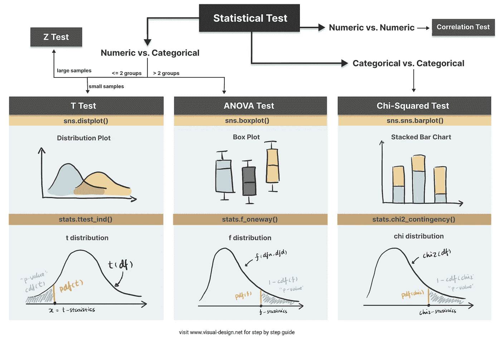
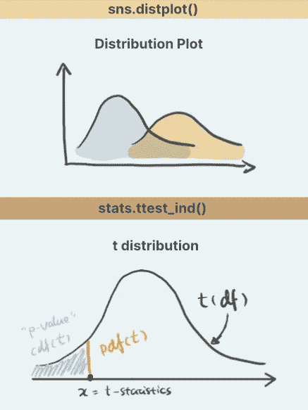
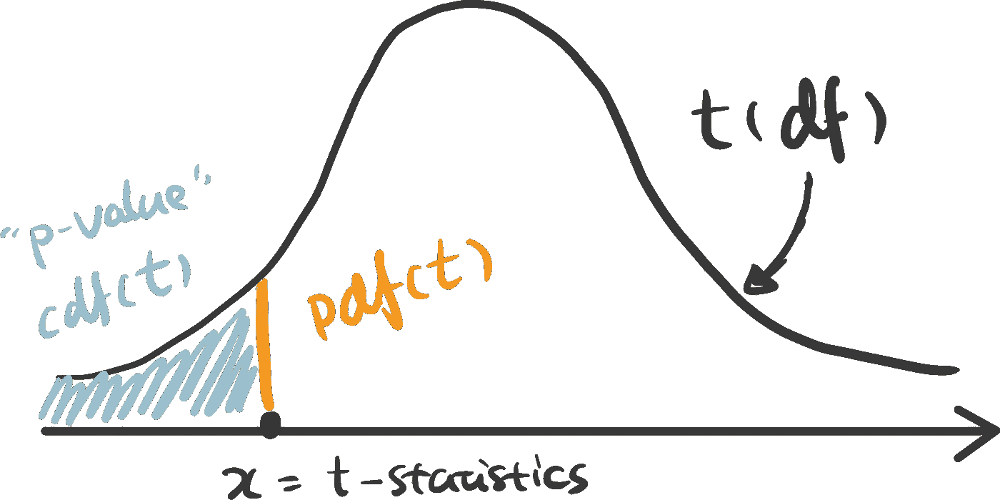
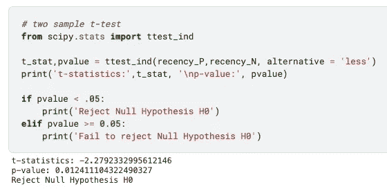
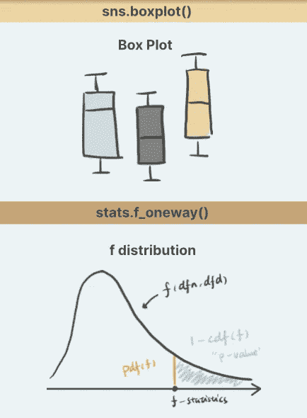
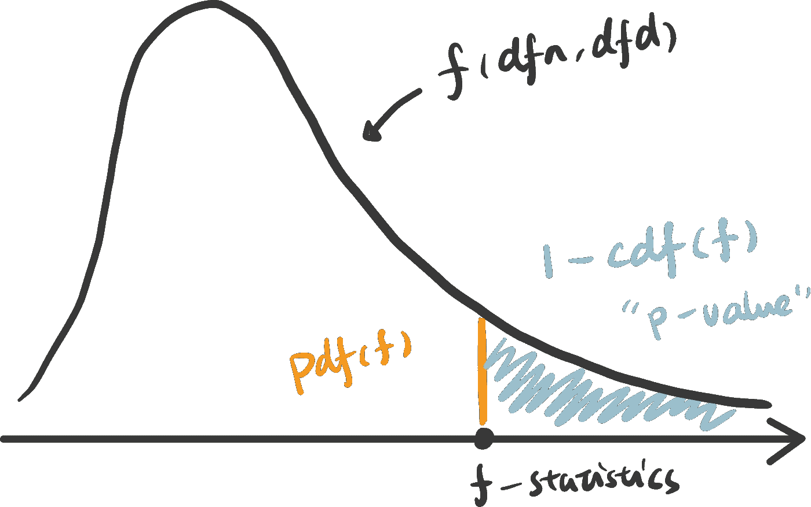
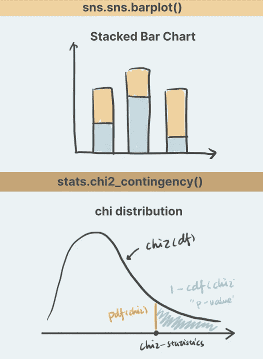
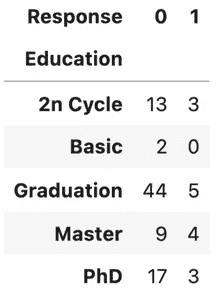
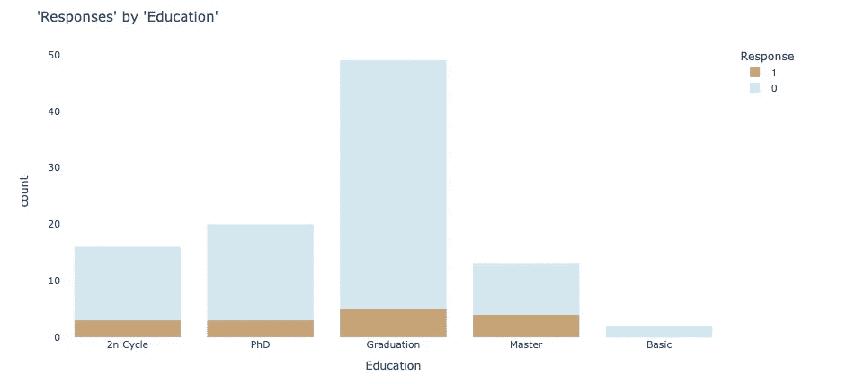
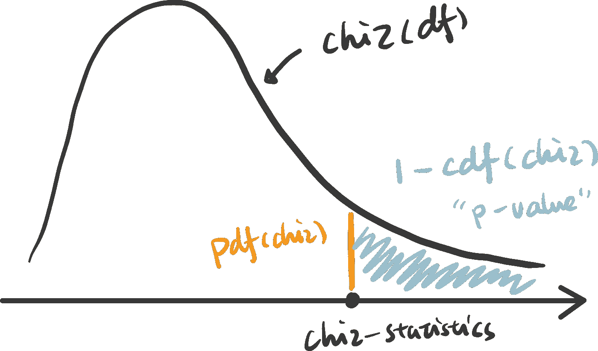

# Python 中假设检验的交互式指南

> 原文：<https://towardsdatascience.com/an-interactive-guide-to-hypothesis-testing-in-python-979f4d62d85>

## t 检验、方差分析、卡方检验及示例



Python Cheatsheet 中的统计测试(图片来自作者的[网站](https://www.visual-design.net/)

# 什么是假设检验？

假设检验是推断统计学中的一个重要部分，在推断统计学中，我们使用样本中的观察数据来得出关于未观察数据(通常是总体)的结论。

**假设检验的含义:**

*   临床研究:广泛用于心理学、生物学和医疗保健研究，以检验临床试验的有效性
*   A/B 测试:可应用于商业环境，通过测试不同版本的活动激励、网站设计等来提高转化率
*   机器学习中的特征选择:基于过滤器的特征选择方法使用不同的统计测试来确定特征的重要性
*   学院或大学:嗯，如果你主修统计学或数据科学，它很可能会出现在你的考试中…

# 假设检验的 4 个步骤

*(如果你喜欢视频演练，也请查看我的 YouTube 视频。)*

## 第一步。定义无效假设和替代假设

**零假设(H0)** 根据统计检验，可以有不同的表述，但可以概括为两个或多个变量之间不存在差异、不存在关系或不存在依赖关系。

**替代假设(H1)** 与零假设相矛盾，它声称关系存在。这是我们想要证明正确的假设。然而，在统计学中更保守的方法更受青睐，我们总是假设零假设是真的，并试图找到证据来拒绝零假设。

## 第二步。选择适当的统计检验

常见的统计检验类型包括 **t 检验、z 检验、anova 检验和卡方检验**


选择适当的统计测试(图片由作者提供)

**T 检验:**比较两组/两类小样本数值变量

**Z 检验:**用大样本量比较两组/两类数值变量

**ANOVA 检验:**比较两组或多组/多类数值变量之间的差异

**卡方检验:**检验两个分类变量之间的关系

相关性检验:检验两个数值变量之间的关系

## 第三步。计算 p 值

p 值的计算方式因统计测试而异。首先，基于观察到的样本数据的平均值和标准偏差，我们能够导出检验统计值(例如 t 统计)。然后计算得到这个检验统计量的概率给定零假设的分布(如学生 t 分布)，我们就求出 p 值。我们将使用一些例子来更详细地说明这一点。

## 第四步。确定统计显著性

然后将 p 值与显著性水平(也称为α值)进行比较，以确定是否有足够的证据来拒绝零假设。显著性水平是预定的概率阈值，通常为 0.05。如果 p 值大于阈值，则意味着该值很可能出现在零假设为真的分布中。另一方面，如果低于显著性水平，这意味着它不太可能出现在零假设分布中，因此拒绝零假设。

除了显著性水平，[功效分析](/statistical-power-in-hypothesis-testing-visually-explained-1576968b587e)也常用于假设检验，查看我关于统计功效的文章。

[](/statistical-power-in-hypothesis-testing-visually-explained-1576968b587e)  

# 用示例进行假设检验

Kaggle 数据集“[客户个性分析”](https://www.kaggle.com/datasets/imakash3011/customer-personality-analysis)用于本案例研究，展示不同类型的统计测试:T 检验、ANOVA 和卡方检验。它们对大样本量很敏感，当样本量很大时，几乎肯定会产生非常小的 p 值。因此，我从原始数据中随机抽取了一个样本(大小为 100 ):

```
sampled_df = df.sample(n=100, random_state=100)
```

# t 检验



t 测试(图片来自作者的[网站](https://www.visual-design.net/))

当我们想要测试一个数字变量和一个分类变量之间的关系时，使用 T-test。t 检验有三种主要类型。

1.  一个样本的 t-检验:根据一个常量值检验一个组的平均值
2.  双样本 t 检验:检验两组间均值的差异
3.  成对样本 t 检验:检验同一受试者两次测量值的均值差异

例如，如果我想测试“最近”(客户上次购买后的天数)是否有助于预测“响应”(客户是否在上次活动中接受了报价)，我可以使用双样本 t-检验。

第一个样本是接受报价的客户的“最近”:

```
recency_P = sampled_df[sampled_df['Response']==1]['Recency']
```

第二个样本是拒绝该提议的客户的“最近”:

```
recency_N = sampled_df[sampled_df['Response']==0]['Recency']
```

为了直观地比较这两组的“近期性”，我们可以使用直方图(或 distplot)来显示分布。


t 检验的距离图(图片由作者提供)

与消极反应相比，积极反应似乎具有较低的新近性。为了量化差异，让我们按照假设检验中的步骤进行 t 检验。

第一步。定义无效假设和替代假设

*   null:在上次活动中接受报价的客户和不接受报价的客户在*最近度*上没有区别
*   替代方案:与不接受报价的客户相比，接受报价的客户具有更低的*新近度*

**第二步。选择合适的测试**

要检验两个独立样本之间的差异，双样本 t 检验是最合适的统计检验。当零假设为真时，检验统计量遵循学生 t 分布。t 分布的形状由自由度决定，计算方法是两个样本大小之和减 2。

导入 Python 库 *scipy.stats* 并创建如下所示的 t 分布。

```
from scipy.stats import t
rv = t(df=100-2)
```

**第三步。计算 p 值**

Python 中有一些方便的函数可以计算分布中的概率。对于分布范围内覆盖的任意 x，****pdf(x)***为 x 的概率密度函数——可表示为下面的橙色线， ***cdf(x)*** 为 x 的累积密度函数——可视为累积面积。在本例中，我们正在测试另一个假设，即肯定回答的最近次数减去否定回答的最近次数小于 0。因此，我们应该使用单尾检验，并将我们得到的 t 统计量与该分布中的最低值进行比较，因此在这种情况下，p 值可以计算为***CDF(t _ statistics)***。*

**

*t 统计和 t 分布(图片由作者提供)*

****【ttest _ ind()***是 python 中一个方便的独立 t 测试函数，它已经自动为我们完成了所有这些工作。传递两个样本 recency _ P 和 recency_N 作为参数，选择备选项=“less”，我们得到 t 统计量和 P 值。*

**

*Python 中的 t-test(图片作者提供)*

*这里我用 [Plotly](https://plotly.com/python/) 来形象化 t 分布中的 p 值。将鼠标悬停在线上，查看点概率和 p 值如何随着 x 的移动而变化。填充颜色的区域突出显示了我们在这个特定示例中获得的 p 值。*

**t 分布与 t 统计的交互可视化(查看* [*代码*](https://www.visual-design.net/code-snippets) *)**

**如果你想自己构建这个，可以查看我网站上的* [*代码片段*](https://www.visual-design.net/code-snippets) *。**

***第四步。确定统计显著性***

*常用的显著性水平阈值是 0.05。由于这里的 p 值(0.012)小于 0.05，所以我们可以说，基于收集的样本，它具有统计学意义。接受该报价的客户的近期发生率较低可能不是偶然发生的。这进一步表明特征“响应”可能是目标变量“新近性”的强预测器。如果我们要为预测“最近”值的机器学习模型执行特征选择，“响应”可能具有很高的重要性。*

# *方差分析检验*

**

*方差分析测试(图片由作者提供)*

*既然我们知道 t 检验是用来比较一个或两个样本组的平均值的。如果我们想要测试两个以上的样本呢？使用 ANOVA 测试。*

*ANOVA 通过计算**组间方差与组内方差的比率**来检查组间差异。较大的比率表明组间的差异是组间差异的结果，而不仅仅是随机的。*

*作为一个例子，我使用特征“Kidhome”来预测“NumWebPurchases”。“Kidhome”有三个值——0、1、2，自然形成三组。*

```
*kidhome_0 = sampled_df[sampled_df['Kidhome']==0]['NumWebPurchases']
kidhome_1 = sampled_df[sampled_df['Kidhome']==1]['NumWebPurchases']
kidhome_2 = sampled_df[sampled_df['Kidhome']==2]['NumWebPurchases']*
```

*首先，将数据可视化。我发现**箱线图**是方差分析测试最一致的视觉表现。*

**

*方差分析检验的箱线图(图片由作者提供)*

*三个组之间似乎有明显的差异。所以让我们进行 ANOVA 测试来证明是否是这样。*

***1。定义假设:***

*   *零:三组之间没有差异*
*   *备选方案:至少两组之间存在差异*

***2。选择适当的检验:** ANOVA 检验是检查两个以上组的数值与分类值之间关系的首选方法。方差分析检验中零假设的检验统计量也遵循由自由度定义的分布，即 f 分布。自由度通过总样本数(n)和组数(k)来计算。*

*   *dfn = n — 1*
*   *dfd = n — k*

```
*from scipy.stats import f
dfn = 3-1
dfd = 100-3
rv = f(dfn, dfd)*
```

***3。计算 p 值:**为了计算 f 统计量的 p 值，我们用 f 分布的右尾累积面积，也就是`1-rv.cdf(f_statistics)` **。***

**

*f 统计和 f 分布(图片由作者提供)*

```
*x = np.linspace(rv.ppf(0.0001), rv.ppf(0.9999), 100000)
y = rv.pdf(x)
pvalue = 1 - rv.cdf(x)*
```

**f 分布与 f 统计的交互可视化(查看* [*代码*](https://www.visual-design.net/code-snippets) *)**

*为了使用 Python 轻松获得 f 统计数据和 p 值，我们可以使用函数`stats.f_oneway()`返回 p 值:0.00040。*

```
*f_stat, pvalue = stats.f_oneway(kidhome_0, kidhome_1, kidhome_2)*
```

***4。确定统计显著性**:将 p 值与 0.05 的显著性水平进行比较，我们可以推断有强有力的证据反对零假设，并且很可能至少两组之间的“NumWebPurchases”存在差异。*

# *卡方检验*

**

*卡方检验(图片来自作者的[网站](https://www.visual-design.net/)*

*卡方检验用于检验两个分类变量之间的关系。基本原则是，如果两个分类变量是独立的，那么当一个分类变量改变时，另一个分类变量应该具有相似的组成。我们来看“教育”和“反应”是否独立的例子。*

*首先，使用**堆积条形图和**列联表汇总每个类别的数量。*

```
*ed_contingency = pd.crosstab(sampled_df['Education'], sampled_df['Response'])*
```

****

*卡方检验的堆积条形图(图片由作者提供)*

*如果这两个变量彼此完全独立(零假设成立)，那么所有教育组中正面回答和负面回答的比例应该是相同的。看起来组成略有不同，但这是否足以说明存在依赖性——让我们进行卡方检验。*

***1。定义假设:***

*   *空:“教育”和“反应”是相互独立的。*
*   *备选案文:“教育”和“反应”是相互依存的。*

***2。选择适当的检验:**选择卡方检验进行分类 vsl 分类统计检验。卡方分布由自由度决定，计算方法为(行-1)x(列-1)。*

```
*from scipy.stats import chi2
r = 5
c = 2
dof = (5-1) * (2-1)
rv = chi2(df= dof)*
```

***3。计算 p 值:** p 值计算为右尾累积面积:`1-rv.cdf(chi2_statistics)`*

**

*χ2 统计和χ2 分布(图片由作者提供)*

```
*x = np.linspace(rv.ppf(0.0001), rv.ppf(0.9999), 100000)
y = rv.pdf(x)
pvalue = 1 - rv.cdf(x)*
```

*Python 还提供了一个有用的函数来获取给定列联表的 chi 统计数据和 p 值。*

```
*chi2_stat, pvalue, dof, exp = chi2_contingency(ed_contingency)*
```

**chi 分布与 chi 统计的交互可视化(查看* [*代码*](https://www.visual-design.net/code-snippets) *)**

***4。确定统计显著性**e:p 值为 0.41，表明不具有统计显著性。因此，我们不能拒绝这两个分类变量是独立的零假设。这也表明“教育程度”可能不是“反应”的强预测因素。*

*感谢到目前为止，我们已经涵盖了本文中的许多内容，但仍然有两个重要的假设检验值得在即将到来的帖子中分别讨论。*

*   *z 检验:检验两类数值变量之间的差异——当样本量较大时*
*   *相关性:测试两个数值变量之间的关系*

*如果你想阅读更多这样的文章，我将非常感谢你的支持，注册[中级会员](https://destingong.medium.com/membership):)*

# *带回家的信息*

*在本文中，我们交互式地探索和可视化三种常见统计检验之间的差异:T 检验、ANOVA 检验和卡方检验。我们还使用示例来演练假设检验中的基本步骤:*

*1.定义无效假设和替代假设*

*2.选择合适的测试*

*3.计算 p 值*

*4.确定统计显著性*

## *更多这样的文章*

*[](/how-to-self-learn-data-science-in-2022-a537a76d138e)  

[德斯坦贡](https://destingong.medium.com/?source=post_page-----979f4d62d85--------------------------------)

## 机器学习实用指南

[View list](https://destingong.medium.com/list/practical-guides-to-machine-learning-a877c2a39884?source=post_page-----979f4d62d85--------------------------------)10 stories

[德斯坦贡](https://destingong.medium.com/?source=post_page-----979f4d62d85--------------------------------)

## 开始学习数据科学

[View list](https://destingong.medium.com/list/get-started-in-data-science-8006bb4ba3ad?source=post_page-----979f4d62d85--------------------------------)8 stories

*原载于 2022 年 4 月 14 日 https://www.visual-design.net**的* [*。*](https://www.visual-design.net/post/an-interactive-guide-to-hypothesis-testing-in-python)*