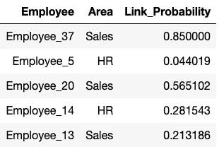

# 组织网络分析导论

> 原文：<https://towardsdatascience.com/an-introduction-to-organizational-network-analysis-cfa91a0e2fda>

## 使用图论通过发现影响者和关键人物来提高员工参与度和沟通


[阿德里安·匡威](https://unsplash.com/@adrienconverse?utm_source=unsplash&utm_medium=referral&utm_content=creditCopyText)在 [Unsplash](https://unsplash.com/es/s/fotos/brain?utm_source=unsplash&utm_medium=referral&utm_content=creditCopyText) 上的照片

在过去的几个月里，我一直在研究旨在帮助人力资源领域日常工作的数据科学解决方案。为什么？好吧，让我们说这是一个真正有趣的领域，在我看来，没有得到足够的重视。不管是什么组织，一个公司未来的成功很大程度上依赖于他们现在和未来的员工，那么为什么不关注他们呢？在这方面，我发现大多数标准解决方案都围绕以下想法:

*   CV 解析器；
*   用于招聘的聊天机器人；
*   员工流失模型；
*   培训课程的推荐系统。

如你所见，除了流失模型，这些解决方案无法为公司提供战略价值，也无法为员工带来真正的利益。但是，那时能做什么呢？好吧，另一套没有被过多讨论的相关解决方案属于*组织网络分析*的主题。在这篇介绍中，我们将通过 Python 中的一些模拟例子来介绍它背后的关键概念，以使事情更容易理解。那么，什么是*组织网络分析*？为了能够回答这个问题，我们首先需要理解组织网络的概念。

## a)网络:了解组织的工具

正如 Barabási (2013)所提到的，组织网络是由组织成员定期相互互动形成的社会网络。根据 Tichy，n .，Fombrun，C. (1979)，该网络的特征在于根据社会对象(人或群体)来表示社会交互，其中由于缺乏交互，不一定每个对象都连接到整个网络，并且它们中的一些可以共享不止一个连接。此外，通过这些互动，网络的参与者通过分享信息、情感、影响和商品或服务建立联系。换句话说，我们有一个员工网络(节点),这些员工通过他们的互动(边)联系在一起。这种组织的功能性表示有助于理解一些工作动态，否则这些动态会被隐藏起来。

从这个角度来看，刘，j .，莫斯科维纳 a .，M. (2017)将*组织网络分析* (ONA)正式定义为通过使用取自图论的技术对组织网络的系统探索。其目的是更好地理解管理结构、人际关系和组织内部的信息流动。在这方面，这种分析的范围可以非常广泛:从对检测到的影响者、非正式领导、辞职人员(退出网络)和高度/不积极参与的员工的特征的描述性分析，到旨在通过对这些类型的内部行为进行更稳健的解释来提供实际价值的预测模型。但是，请记住，与任何数据科学项目一样，在提供任何这些解决方案之前，都需要考虑组织的数据成熟度(您应该从收集和处理具有明确目标的数据开始，然后提供分析，最后转向预测性和规范性模型)。

现在你可能认为所有这些听起来不错，但为了进行任何类型的分析，你首先需要掌握组织网络，这可能相当棘手。要做到这一点，可以遵循主要方法，即进行调查，要求所有员工提名其他同事(来自组织的任何领域)作为其工作生活不同方面的参考。这些调查可以在网上进行，也可以通过任何流行的资源管理工具进行，比如 *Workday。*有些问题可能是:

*   当你想知道公司未来的重要信息时，你会找谁？(在 Barabási 的网络科学书中有一个很好的详细例子)。
*   给你情感支持的人是谁？
*   当你需要解决技术问题(例如，使用软件 A)时，你依赖谁？
*   谁是最能激励你的人？
*   你一天中经常互动最多的人是谁？

正如你所看到的，网络的正确表现取决于员工的参与率和诚实的回答，他们知道他们的答案不是匿名的。在这种情况下，人力资源部门在整个过程中发挥积极作用至关重要(作为一项建议，他们可以强制进行调查，并努力宣传其好处(稍后会提到)，以获得更好的结果)。

完成数据收集步骤后，我们可以构建有向图(网络),其中的节点是雇员，他们的有向链接代表一个到另一个的任命。作为一个模拟的例子，我将在后面解释，对于一个有 40 个成员的组织，这看起来像这样:


作者图片

在此图中，颜色代表节点的一些分组属性，这有助于我们对它们进行分类(在本例中，它指的是每个员工被分配“工作”的区域)。请注意，箭头指向提名的方向，在没有收到或发出提名的情况下，我们有孤立的节点。

一旦我们完成了网络的构建，是时候寻找组织的影响者和关键角色了。但是，到底什么是影响者或关键人物呢？我们怎么知道？这并不是一成不变的，因为有几种方式可以让某人落入这些类别中的任何一个，而且它们比仅仅考虑最多提名的人“稍微”复杂一些。例如，如果我们考虑上面列出的一系列问题，至少有 4 种有影响力的人。其中一些可能是组织信息流的关键，而另一些可能是必要的激励因素、情感支持或技术参考。此外，我们可以找到帮助其他人接触这些有影响力的人的成员(这反过来也使他们有影响力)。然而，至少我们可以说它们都有一个共同的特点:在网络内部某种程度或类型的中心性。在这里，我们需要引入一些来自网络科学的单独指标，这些指标对于这种分析是必不可少的。为了简单起见，我们将只提及其中一些想法背后的主要思想:

*   ***度* :** 一个节点的度定义为其它节点指向这个节点的链接数。当网络有向时，有必要区分指向一个节点的链路(入度)和从一个节点指向其他节点的链路(出度)。以这篇文章为例，你可以把它想成提名你的人数与你提名的人数之比。
*   ***接近中心性*** :这个度量(在 0 和 1 之间)测量网络中一个节点到其余节点的平均距离(根据到达它们所需的步数)。这使我们能够对与网络其余部分的平均接近度有一个概念。从这个角度来看，您可以将影响者或关键人物确定为其*亲密度指数*高于某个阈值的人(或人群)。
*   *:这个度量(在 0 和 1 之间)可以看作是一种量化一个节点对网络信息流的影响的方式。它主要用于查找充当节点组之间桥梁的节点。它是通过计算所有节点对之间的最短路径来计算的，这允许测量一个节点位于其他节点的最短路径之间的频率。*
*   ****枢纽和权威评分* :** 这些评分(0 到 1 之间)帮助我们将节点分为三种类型:常规、枢纽和权威。它们的特征可以总结如下:一些节点(hub)有许多链接指向一些其他的(authorities ),这些链接不经常链接到其余的节点(regular)。这种行为的一个最常见的例子发生在论文引用中，其中主要知识集中在基础论文(权威论文)中，而基础论文又被一系列论文(枢纽论文)引用，这些论文被其他论文(常规论文)更频繁地引用。在组织网络的情况下，当局可以被视为主要与枢纽交流的领导人，枢纽是当局和“正式”雇员之间的桥梁。因此，我们可以说，中心和当局都可以被视为专业网络中的关键行为者。*

*如果我们要为一个网络(如上图所示)计算这些指标，我们将获得一个类似于下表的表格:*

**

*作者图片*

*接下来，剩下的就是决定一些规则和阈值，以定义我们将考虑作为影响者的指示的行为类型。一种过于简单的方法是，采用六个指标中每个指标的前 5 分，并为每个指标定义一个不同的参与者类别。例如，那些在中拥有最高*学位的人可以被称为“寻求成员”，拥有*学位*的顶级员工可以被称为“积极成员”，那些拥有最高*亲密度*和*中间度*分数的人可以分别被称为“中心成员”和“连接成员”，最后我们有了网络的“中枢”和“权威”。注意，这些是我刚刚想到的一些随机的名字，你可以自由选择你喜欢的名字。**

*到目前为止，除了检测到的影响者之外，我们还有一个“非正式”组织的近似值，每个员工有一组网络统计数据，这本身就很有价值。问题是，你能用这些信息做什么？正如本文标题中提到的，你可以尝试提高员工的参与度和沟通。怎么会？我既不是社会学家，也不是心理学家，所以我参考了已发表的论文，并与该领域的专业人士进行了非正式交谈，为你提供了以下总结观点:*

*   *您可以通过关键节点传播信息来改善信息流，这有助于提高组织的透明度，从而提高员工的参与度；*
*   *你可以通过将新员工与一些关键节点配对来改善他们的入职情况；*
*   *需要选择变革领导者的变革管理流程可以利用这种方法检测到的领导者。同样，在需要跟踪新工具实现前后成员交互的变化的情况下，它也很有用；*
*   *在合并和收购过程中，可以调整整个方法，以找到知识专家和领导人，帮助减轻这一紧张过程的负担，同时保持业务尽可能平稳运行；*
*   *注意孤立的或很少被提名的节点可能是一个好主意，因为与组织联系不良可能表明糟糕的工作生活体验、低工作满意度和敬业度(Kahn，W. A .，1990 年)以及有缺陷的沟通系统。如果你综合所有这些因素，你可能会面对一个更容易辞职的成员；*
*   *最后，也是更有趣的是，你可以超越*组织网络分析的描述性统计(*而不是 ML 或 AI *)* ，开始考虑实现预测模型，试图使用网络提供的额外信息作为特征来回答一些常见的问题。例如，如果有足够的时间，你可以用通过几次调查获得的网络数据来补充你的客户流失模型。*

*在结束对*组织网络分析*主题的一般性介绍之前，需要强调的是，这种方法并不严格局限于专业组织，因为它也可以适用于教育机构(针对员工和校友)或任何其他可以创建人际网络的环境。*

*接下来，对于那些对“幕后”感兴趣的人，我将描述如何通过一个模拟场景来建立一个基本的网络，该场景假设您能够进行一项调查，该调查只是要求您提名与您互动最多的组织成员。*

## *b)模拟网络*

*我们从导入将要使用的库开始:*

```
*# General
import itertools as it
import numpy as np
import pandas as pd# Network
import networkx as nx*
```

*在继续创建网络之前，我们首先需要考虑将使用哪些设计参数。因为目的是创建一个虚构的组织，在那里可以找到不同类型的“有影响力”的人，所以我们需要指定:*

*   *员工人数；*
*   *员工将被分配到的区域的数量和名称；*
*   *区域的大小，以了解每个区域将有多少员工“工作”;*
*   *在每个领域中能够有较高概率提名/被他人提名的人的比例；*
*   *高关系人提名/被提名的概率；*
*   *不属于高度关联类别的员工被提名/被提名的最大概率；*
*   *区域 A 的成员提名区域 B 的成员的概率，因为一些区域比其他区域更有可能互动。*

*鉴于此，我们现在指定将定义网络的全局参数:*

```
*# GLOBAL PARAMETERS
# Set a seed to replicate the experiment
np.random.seed(1)# Specify the number of employees in the network
n_employees = 40# Specify the areas
m_areas = ['HR', 'IT', 'Finance', 'Marketing', 'Sales']# Specify the area sizes as percentage of total
area_sizes = [0.5/5, 2/5, 1/5, 0.5/5, 1/5]# Set the percentage of highly connected people per area
influencer_ratio=0.1# Give a higher probability of connection to a type of employee
influencer_link_probability=0.85# Give an upper bound to the link probability of a non "influencer" employee
max_non_influencer_link_probability=0.6# Create all pairs of areas to define their interaction probability
areas_links_combinations = list(it.combinations(m_areas,2))# Specify the probability of each pair
areas_links_probability = [0.1, 0.2, 0.3, 0.4,
                           0.4, 0.2, 0.7, 0.7,
                           0.6, 0.9]*
```

*接下来，我们创建员工，并将他们分配到一个区域:*

```
*# Generate a list of employees
employees = [f'Employee_{n}' for n in range(n_employees)]# Generate an array of employee's areas
# using the area sizes as assignment probabilitiesemployees_areas=np.random.choice(a=m_areas,
                                 size=n_employees,
                                 replace=True,
                                 p=area_sizes)# Join the data into a pandas DataFrame
df=pd.DataFrame({'Employee':employees,'Area':employees_areas})*
```

*一旦我们有了员工和区域的数据框架，我们就可以定义每个人的提名概率:*

```
*# For low link probability people a random uniform distribution
# is usedlower_proba_assignment=lambda x : np.random.uniform(
non_influencer_link_probabilities[0],
non_influencer_link_probabilities[1])# Assign the link probabilities per area and combine the data
dfs=[]
for area in m_areas: df_area=df[df['Area']==area].copy() area_employees = df_area.shape[0] n_influential = round(area_employees*influencer_ratio) influ_employees=df_area['Employee'].sample(n_influential).values df_area['Link_Probability']=np.where(
                          df_area['Employee'].isin(influ_employees),
                          influencer_link_probability,
                          df_area['Employee'].apply(
                                            lower_proba_assignment))
  dfs.append(df_area)df=pd.concat(dfs,ignore_index=True)*
```

*我们的数据帧看起来像这样:*

**

*作者图片*

*既然我们已经有了提名/被提名的节点和个体概率，我们可以继续创建它们的链接。为此，我们将首先生成所有可能的链接组合(不包括他们自己命名的情况)。*

```
*# Create the links DataFrame
possible_links=list(it.product(df['Employee'],df['Employee']))
df_links=pd.DataFrame(possible_links, columns=['From','To'])
df_links=df_links[df_links['From']!=df_links['To']].copy()*
```

*在获得所有对之后，我们有以下数据结构:*

**

*作者图片*

*我们现在需要做的是，根据每个员工所属的领域(有些领域更有可能互动)，以及他们被分配的提名概率(有些人比其他人更容易被提名/提名)，来定义我们将保留哪些链接。为此，我们需要将数据框架与雇员合并，并将概率与链接数据框架联系起来:*

```
*# Merge links DataFrame with employee data based on the 'From' side
df_links=pd.merge(df_links,
                  df[['Employee','Area','Link_Probability']],
                  left_on='From',
                  right_on='Employee',
                  how='left')# Drop the employee column as we'll need to do another merge
df_links.drop(['Employee'],axis=1, inplace=True)# Rename columns to know to what employee the data belongs to
df_links.rename(columns={'Area':'From_Area',
                        'Link_Probability':'From_Link_Probability'},
                        inplace=True)# Merge links DataFrame with employee data based on the 'To' side
df_links=pd.merge(df_links,
                  df[['Employee','Area','Link_Probability']],
                  left_on='To',
                  right_on='Employee',
                  how='left')# Rename the columns
df_links.rename(columns={'Area':'To_Area',
                         'Link_Probability':'To_Link_Probability'},
                          inplace=True)# Drop the employee column as we don't need it anymore
df_links.drop(['Employee'],axis=1, inplace=True)df_links.rename(columns={'Area':'To_Area',
                         'Link_Probability':'To_Link_Probability'},
                         inplace=True)*
```

*在前面的步骤中，我们加入了个人链接概率，但我们仍然需要添加不同地区成员之间的提名概率。特别是，由于有两种方式来显示一对区域(A，B)和(B，A ),我们需要反映关联的概率:*

```
*# Start by creating a DataFrame with the first way
external_proba_a=pd.DataFrame(areas_links_combinations,
                              columns=['From_Area','To_Area'])external_proba_a['Area_Pair_Probability']=areas_links_probability# Mirror the previous transformation but renaming the columns
external_proba_b=external_proba_a.copy()external_proba_b.rename(columns={'From_Area':'To_Area',
                                 'To_Area':'From_Area'},
                                 inplace=True)# Concatenate both DataFrames
external_proba=pd.concat([external_proba_a,
                          external_proba_b],
                         ignore_index=True)# Link the DataFrame of links with the "external" probabilities
df_links=pd.merge(df_links,
                  external_proba,
                  on=['From_Area','To_Area'],
                  how='left')# In the cases where the area is the same
# we'll keep a probability close to 1 (0.9)
# meaning the nomination depends mainly on the individual
# probabilitydf_links['Area_Pair_Probability']=np.where(
  df_links['From_Area']==df_links['To_Area'],
  0.9, df_links['Area_Pair_Probability'])# For the majority of the cases, the final pair probability
# will equal the average between individual probabilities
# times the area probabilitydf_links['Pair_Probability']=df_links['Area_Pair_Probability']*  (df_links['From_Link_Probability']+
 df_links['To_Link_Probability'])/2# In case an employee has the highest link probability
# we'll make him more prone to receive nominations than to make
# nominations by halving the pair probability df_links['Pair_Probability']=np.where(
df_links['From_Link_Probability']==influencer_link_probability,
df_links['To_Link_Probability'],df_links['Pair_Probability']/2)df_links['Pair_Probability']=np.where(
df_links['To_Link_Probability']==influencer_link_probability, df_links['From_Link_Probability'],
df_links['Pair_Probability']/2) # Finally, use the Pair_Probability to flip a coin
# and decide if the pair will be considered (Active_Link=1) or notdf_links['Active_Link']=df_links.apply(lambda x: np.random.binomial(n=1,p=x['Pair_Probability']),axis=1)*
```

*由于这一步，我们能够定义我们的节点和链接:*

```
*nodes = employees# We create a list of tuples of pairs of nodes to define the links
links = df_links[df_links['Active_Link']==1][
                 ['From','To']].to_records(index=False)*
```

*现在，我们已经准备好构建网络并计算指标:*

```
*# Create an instance of a Directed Graph using networkx
G = nx.DiGraph()# Add the nodes and links to the graph
G.add_nodes_from(nodes)
G.add_edges_from(links)# Calculate all the metrics mentioned in the previous section:# DegreeOut
degree_df_out=pd.DataFrame(G.out_degree,
                           columns=[“Employee”,”DegreeOut”])# DegreeIn
degree_df_in=pd.DataFrame(G.in_degree,
                          columns=[“Employee”,”DegreeIn”])# Closeness
closeness_df=pd.DataFrame.from_dict(nx.closeness_centrality(G),
                                    orient=”index”).reset_index()closeness_df.columns=[“Employee”,”Closeness”]# Betweenness
betweenness_df=pd.DataFrame.from_dict(nx.betweenness_centrality(G),orient=”index”).reset_index()betweenness_df.columns=[“Employee”,”Betweenness”]# Hubs and Authorities
hubs, authorities = nx.hits(G, normalized=True)hubs_df=pd.DataFrame.from_dict(hubs, orient="index").reset_index()
hubs_df.columns=["Employee","HubScore"]authorities_df=pd.DataFrame.from_dict(authorities,
                                      orient="index").reset_index()authorities_df.columns=["Employee","AuthorityScore"]# Merge the results
results=pd.merge(df, degree_df_in, on="Employee",how='left')
results=pd.merge(results, degree_df_out, on="Employee",how='left')
results=pd.merge(results, closeness_df, on="Employee",how='left')
results=pd.merge(results, betweenness_df, on="Employee",how='left')
results=pd.merge(results, hubs_df, on="Employee",how='left')
results=pd.merge(results, authorities_df, on="Employee",how='left')results=results.sort_values(by='Closeness', ascending=False)*
```

*通过这最后一步，获得了如本文第一部分所示的表格。正如您所看到的，修改代码以使用真实数据是相当简单的(您只需要在根据提名定义节点和链接之后运行最后一个块)。*

## *结束语*

*在整篇文章中，我们讨论了*组织网络分析*、*、*背后的主要思想，同时提出了一些用例，并提供了在您的组织/机构中开始一个简单项目所必需的工具。从这个意义上说，我鼓励你尝试运行你自己的模拟场景，如果可能的话，采取下一步措施，开发基于网络指标的预测模型。从我的经验来看，这些指标确实为预测模型增加了有价值的信息(至少对客户流失和参与度是如此)。*

*别忘了喜欢和订阅更多与解决真实商业问题相关的内容🙂。*

## *参考*

*蒂希，n .丰布伦，C. 1979。组织环境中的网络分析。*人伦*，32(11)，923–965。*

*巴拉巴希，2013 年。网络科学。*英国皇家学会哲学汇刊 A:数学、物理和工程科学*，371(1987)，20120375。*

*刘，2017，m。使用多重人际关系的组织网络分析决策支持系统。*多智能体和复杂系统。斯普林格*，33–47 岁。*

*w . a . Kahn，1990。工作中个人参与和脱离的心理条件。*管理学院学报*，33(4)，692–724。*

*卡兰格斯，e .，约翰斯顿，k .，比森，a .，林，I. 2015。内部沟通对员工敬业度的影响:一项初步研究。*公关评论*，41。*