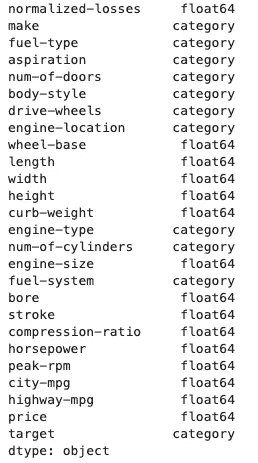
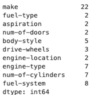
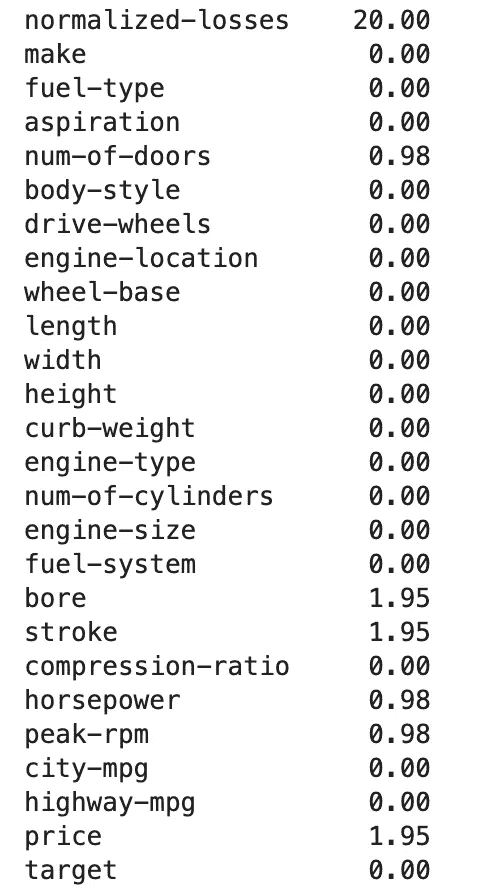

# 机器学习的数据预处理导论

> 原文：<https://towardsdatascience.com/an-introduction-to-preprocessing-data-for-machine-learning-8325427f07ab>

## 了解如何以及何时应用常见的预处理技术

马库斯·克里斯蒂亚在 [Unsplash](https://unsplash.com/s/photos/numbers?utm_source=unsplash&utm_medium=referral&utm_content=creditCopyText) 上的照片

机器学习算法学习存在于一组特征中的模式，并使用这些模式来预测新的未知数据的给定目标变量。得到的训练模型本质上是一个数学函数，它成功地将 X(特征)的值映射到 y(目标)的未知值。

与所有数学计算一样，机器学习算法只能处理用数字表示的数据。此外，由于每个算法都在各种不同的约束和假设下工作，因此以反映算法如何理解数据的方式来表示这些数字非常重要。

假设我们有一个用红色、蓝色和灰色来表示汽车颜色的特征。如果我们将每种颜色表示为一个数字，比如红色= 1、蓝色= 2 或灰色= 3，机器学习算法在不理解颜色概念的情况下，可能会将红色解释为更重要，因为它由最大的数字表示。

在机器学习术语中，预处理是指将原始特征转换为机器学习算法可以理解和学习的数据。

如图所示，为机器学习预处理数据是一种艺术形式，需要仔细考虑原始数据，以便选择正确的策略和预处理技术。

在下面的教程中，我将主要使用 [Scikit-learn](https://scikit-learn.org/stable/) 库，用代码示例介绍常见的预处理步骤。本文并不打算详尽地概述所有可用的预处理方法，而是旨在提供最常用策略的良好基础知识。如果您对本文感兴趣的话，我在文章末尾提供了一些链接，以便更深入地研究预处理。

# 安装

出于本教程的目的，我将使用来自[openml.org](https://www.openml.org/search?type=data&sort=runs&id=9&status=active)的“汽车”数据集。该数据集由许多与汽车特征相关的特征和代表其相关保险风险的分类目标变量组成。也可以下载数据集，并使用下面的代码将其转换成熊猫数据帧。

在开始预处理之前，理解每一列的数据类型是很重要的。如果我们运行`df.dtypes`，我们可以看到数据集混合了分类和数字数据类型。

汽车数据集的数据类型。作者图片

# 编码分类特征

正如文章开头提到的，机器学习算法需要数字数据。因此，在用于模型训练之前，任何分类特征必须首先被转换成数字特征。

用于处理分类变量的最常见的技术是一种热编码，有时也称为虚拟编码。该技术为要素中包含的每个唯一值创建一个新列。新列是二进制要素，如果值不存在，则包含 0，如果存在，则包含 1。

Scikit-learn 库提供了一种预处理方法，可以执行一次热编码。以下代码将数据集中的分类特征转换为一个热编码列。

当使用这种方法转换分类列时，必须特别注意特性的基数。

基数是指给定列中唯一值的数量。例如，如果我们有一个包含 50 个唯一值的特性。执行一次热编码将导致创建 50 列。

这可能导致两个问题:

1.  非常大的训练集导致训练时间明显变长。
2.  稀疏的训练集会导致过度拟合的问题。

我们可以通过运行下面的`df[categorical_cols].nunique()`来了解数据集中的特征基数。

我们可以看到 make 列具有相当高的基数。

分类特征的基数。作者图片

处理高基数类别的一种方法是将不常出现的值聚集到一个新的类别中。`OneHotEncoder`方法为此提供了两种选择。

第一个选项是将`min_frequency`参数设置为一个选定的数字。这将导致频率小于该值的任何值被添加到不频繁类别中。

*请注意，该选项目前仅适用于 Scikit-learn 1 . 1 . 0 及以上版本。*

第二个选项是将`max_categories`参数设置为任何大于 1 的数字。这将生成的列数限制在该数量或更少。

# 输入缺失值

大多数真实世界的数据集都会有一些缺失值。这可能有多种原因。生成数据的系统可能出现错误，导致观察值缺失，或者某个值可能因为与特定样本无关而缺失。

无论什么原因，大多数机器学习算法都不能解释空值，因此，有必要以某种方式处理这些值。

一种选择是删除包含缺失值的行。但是，这通常是不实际的，因为它会将训练数据集的大小减少太多，或者算法的应用可能需要为所有行生成预测。

如果无法删除丢失的值，则有必要用一个合理的值来替换它们。这是一种被称为插补的技术。

有许多策略可以用来计算缺失值。从用特征的中值、平均值或最频繁值替换缺失值的非常简单的选项。到使用机器学习算法来确定插补的最佳值的更复杂的情况。

在选择策略之前，我们首先需要了解我们的数据集是否有任何缺失值。为此，请运行以下命令。

从结果中我们可以看到，5 个特征有缺失值，除了“归一化损失”列，所有特征的缺失值百分比都很低(低于 2%)。

缺失值的百分比。图片作者。

通常，我们会对每个特征进行一些探索性分析，以便为插补策略的选择提供信息。然而，出于本教程的目的，我将简单地展示一个使用简单策略和一个更复杂策略的例子。

下面显示的代码使用了 Scikit-learn [方法](https://scikit-learn.org/stable/modules/generated/sklearn.impute.SimpleImputer.html)，称为`SimpleImputer`。由于我们混合了带有缺失值的分类和数字特征，我们将使用两种不同的简单策略来估算它们。对于数字特征，我们将用该列的平均值替换缺失值，对于分类特征，我们将使用最常出现的值。

当数据用于训练时，简单地用简单的统计(如平均值)填充所有缺失值可能不会产生最佳性能。一种更复杂的插补方法是使用机器学习算法来告知要插补的值。

一种常用的技术是[K-最近邻](/machine-learning-basics-with-the-k-nearest-neighbors-algorithm-6a6e71d01761)算法。该模型使用距离度量，如欧几里德距离，来确定一组指定的最近邻，并估算这些邻的平均值。

# 特征缩放

训练集中的数字特征通常具有非常不同的比例。例如，特性“价格”的最小值为 5，118。而“压缩比”的最小值仅为 7，最大值为 23。机器学习模型可能会错误地将“价格”特征中的较大值解释为比“压缩比”特征中的值更重要。

与缩放相关的另一个预处理步骤是在变换要素的位置居中，以便它们形成正态分布。许多机器学习算法假设特征是正态分布的，除非以这种方式表示特征，否则它们不会如预期那样表现。

Scikit-learn `StandardScaler`方法通过移除平均值并将每个特征缩放至单位方差来执行居中和缩放。下面的代码执行这些步骤。

# 扔掉

宁滨或离散化是一种用于将连续变量转换成相似值的组或桶的技术。当一个变量有大量不经常出现的值时，这种技术特别有用。在这种情况下，离散化可以减少特征中的噪声，并减少训练期间模型过拟合的风险。

在我们的数据集中，价格变量的取值范围非常大。最频繁出现的价格只有 2 次。这是一个特别受益于宁滨的特征的例子。

一旦执行了离散化，该特征就必须被视为分类的，因此必须执行额外的预处理步骤，例如一个热编码。

Scikit-learn 库有一个名为`KBinsDiscretizer`的方法，它在一个步骤中执行宁滨和分类编码。以下代码将价格功能转换为 6 个箱，然后对新的分类变量执行一次热编码。结果是一个稀疏矩阵。

# 把所有的放在一起

到目前为止，在本教程中，我们已经独立执行了所有预处理步骤。在真正的机器学习应用中，我们总是需要对训练集和任何测试或验证数据集进行预处理，然后在对新数据进行推断的过程中再次应用这些预处理。因此，编写能够一步完成所有这些转换的代码是最有效的。

Scikit-learn 有一个被称为[管道](https://medium.com/vickdata/a-simple-guide-to-scikit-learn-pipelines-4ac0d974bdcf)的有用工具。Scikit-learn 管道使预处理步骤能够与估计器链接在一起。下面的代码创建了一个管道，该管道执行本教程中概述的所有预处理步骤，并且还适合随机森林分类器。

可以重用管道来预处理测试数据集并生成预测，如下所示。

机器学习算法的学习方式与人类不同。一个算法不可能像你和我一样理解车门数量和汽车之间的关系。为了让机器学习，必须将数据转换为适合算法学习方式的表示形式。

在本文中，我们介绍了以下预处理技术。下面是对这些方法的简要总结以及它们有用的原因。

1.  **编码分类特征:**大多数机器学习算法只能处理数字数据，因此分类变量必须转换为数字表示。
2.  **输入缺失值:**大多数机器学习算法无法解释空值。输入用合理的替换来替换丢失的值。
3.  **特征缩放:**机器学习算法只理解数值关系。因此，不同比例的要素可能会被错误地解释。缩放可确保连续要素中的值都在相同的比例上。
4.  **宁滨:**具有许多不经常出现的值的连续变量可能包含大量噪声，这可能导致训练期间的过拟合。宁滨将这些值聚集成桶或相似值的组，从而产生新的分类特征。

本教程给出了应用于机器学习数据的最常见预处理技术的介绍性概述。这里描述的方法有许多不同的选项，还有更多可能的预处理步骤。

一旦你对所描述的技术有了全面的了解，如果你想更深入地研究更多的技术,《用 Scikit-learn 和 Tensorflow 进行机器学习》这本书是一个很好的资源。这本书可以通过这个[链接](https://www.knowledgeisle.com/wp-content/uploads/2019/12/2-Aurélien-Géron-Hands-On-Machine-Learning-with-Scikit-Learn-Keras-and-Tensorflow_-Concepts-Tools-and-Techniques-to-Build-Intelligent-Systems-O’Reilly-Media-2019.pdf)获得免费阅读的 PDF 格式。

关于 Scikit-learn 的更多文章，请参见我之前的帖子。

    

感谢阅读！

## 引用

***Autos 数据集:*** *Jeffrey，C. Schlimmer。https://archive.ics.uci.edu/ml/datasets/Automobile 网络数据仓库[***]。在开放科学许可证下使用。**