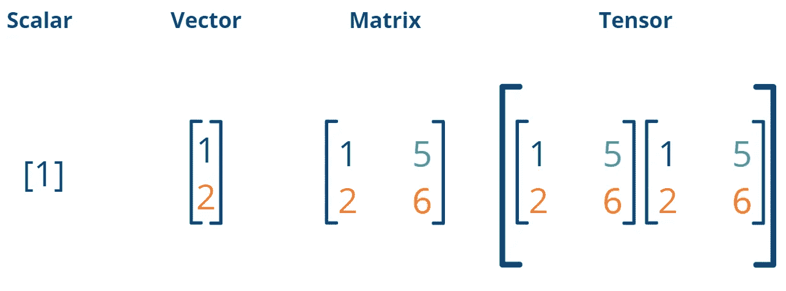

# 张量流简介

> 原文：<https://towardsdatascience.com/an-introduction-to-tensorflow-fa5b17051f6b>

## 了解机器学习框架、其架构以及与 PyTorch 的比较


照片由[在](https://unsplash.com/es/@dizzyd718?utm_source=medium&utm_medium=referral) [Unsplash](https://unsplash.com?utm_source=medium&utm_medium=referral) 上绘制的迪兹·格拉汉姆

TensorFlow，简称 TF，是谷歌开发的一个用于 D [eep 学习](https://databasecamp.de/en/ml/deep-learning-en)和[人工智能](https://databasecamp.de/en/ml/artificial-intelligence)的框架，最初只在内部使用。然而，几年来，它一直是开源的，可以用于许多编程语言，如 [Python](https://databasecamp.de/en/python-coding) 。

# 什么是张量流？

TensorFlow 是谷歌的一个开源框架，用于创建[机器学习](https://databasecamp.de/en/machine-learning)模型。虽然该软件是用 C++编写的，但它是独立于语言的，因此可以很容易地用在各种编程语言中。对于许多用户来说，这个库现在已经成为机器学习的标准，因为通用模型可以相对简单地构建。此外，最先进的 ML 模型也可以通过 TF 使用，如各种变压器。

通过 TensorFlow Keras(高级 [API](https://databasecamp.de/en/data/api-en) ，可以额外构建单独的[神经网络](https://databasecamp.de/en/ml/artificial-neural-networks)，而无需手动编程各个层。这使得 TF 可用于各种各样的应用程序并可定制。此外，它在自己的[网站](https://www.tensorflow.org/tutorials)上提供了各种免费的入门课程和示例，这进一步促进了框架的使用。

# 张量是什么？

TensorFlow 这个名字乍一看可能有点奇怪，因为它与[机器学习](https://databasecamp.de/en/machine-learning)没有直接联系。然而，这个名字来自于所谓的张量，张量用于训练[深度学习](https://databasecamp.de/en/ml/deep-learning-en)模型，因此构成了 TF 的核心。

张量是线性代数中的一个数学函数，它将选择的向量映射为一个数值。这个概念起源于物理学，随后被用于数学。可能使用张量概念的最突出的例子是广义相对论。



不同种类的多维数组|来源:作者

在[机器学习](https://databasecamp.de/en/machine-learning)领域，张量被用作许多应用的表示，例如图像或视频。这样，许多信息，其中一些是多维的，可以在一个对象中表示。例如，图像由大量单独的像素组成，这些像素的颜色值又由三个颜色层的叠加组成(至少在 RGB 图像的情况下)。这种复杂的结构可以用张量简洁地表示出来。

# TensorFlow 是如何工作的？

现在我们已经了解了什么是张量，张量在[机器学习](https://databasecamp.de/en/machine-learning)中有什么影响，我们现在来处理名字的第二部分，即“流”。在 TF 中，构建的模型被表示为数据流，更准确地说是在有向图中。这意味着我们在 TensorFlow 中建立的每个模型都可以转换为有向图，即每个箭头只能在一个方向上遍历。

在图中的每个节点执行计算操作。在[神经网络](https://databasecamp.de/en/ml/artificial-neural-networks)的例子中，这意味着，例如，节点是计算操作发生的单独层。另一方面，边是已经描述过的张量，从一个节点移动到下一个节点。

[](https://medium.com/illumination/intuitive-guide-to-artificial-neural-networks-5a2925ea3fa2)  

然而，自 2019 年以来，这种结构发生了一些变化，因为第二个版本于当年发布，改变了一些甚至是基本的功能。此后，使用高级 API Keras，它在第一个版本中仍然是一个单独的模块。这提供了一个相当简单的方法来建立一个[神经网络](https://databasecamp.de/en/ml/artificial-neural-networks)，只需调用单独的层，从而使 TF 更加用户友好。

```
# Building a neural network by defining the single layers 
import tensorflow as tf
import tf.keras.layers as layersmodel = models.Sequential()
model.add(layers.Conv2D(32, (3, 3), activation='relu', input_shape=(32, 32, 3)))
model.add(layers.MaxPooling2D((2, 2)))
model.add(layers.Conv2D(64, (3, 3), activation='relu'))
model.add(layers.MaxPooling2D((2, 2)))
model.add(layers.Conv2D(64, (3, 3), activation='relu'))
model.add(layers.Flatten())
model.add(layers.Dense(64, activation='relu'))
model.add(layers.Dense(10))
```

此外，更新还使 TF 在处理更复杂、更现代的[机器学习](https://databasecamp.de/en/machine-learning)模型方面明显更具性能。但是，这两个版本之间不兼容，因此必须重写旧代码才能在 TF 2.0 中工作。但是，仍然支持第一个版本，所以您也可以在这个版本中运行代码，尽管没有新的特性。

# 如何安装 TensorFlow Python 版本？

TensorFlow 可以相对容易地安装在 [Python](https://databasecamp.de/en/python-coding) 中，就像许多其他模块一样，只需一个终端命令。在 Jupyter 笔记本上，多一个“！”必须放在命令前面，以便将其识别为终端调用:

```
!pip install tensorflow
```

然而，TF 仍然有一些特性，这就是为什么这个通用的安装命令可能不工作或者不是最佳的。

## 马科斯

在苹果操作系统 macOS 上，正常安装可能会有问题，特别是如果安装了新的苹果处理器 M1 或 M2。要安装 TF 以便它针对这些 Mac 处理器进行优化，可以使用以下命令:

```
!pip install tensorflow-macos
```

此外，还需要另一个插件。在 macOS 上安装 TF 的详细说明可以在[苹果网站](https://developer.apple.com/metal/tensorflow-plugin/)上找到。

## 不带 GPU 的 Windows 和 Ubuntu

在 Windows 和 Ubuntu 上，已经描述过的基本安装可以工作。然而，这个版本的 CUDA 已经针对专用(外部)显卡进行了优化。如果您不想使用这些 GPU 或者只是没有安装外部 GPU，您也可以直接只安装 TF 的 CPU 版本:

```
!pip install tensorflow-cpu
```

然而，与强大的 GPU 相比，用 CPU 训练神经网络自然会有性能损失。

# TF 的架构是什么？

TensorFlow 的架构支持许多系统和应用程序，因此模型也可以用于 web 或移动环境。

在训练中，TF 提供了读取你自己的数据集并将它们转换成优化的[数据类型](https://databasecamp.de/en/data/data-types)的可能性。此外或可选地，准备好的数据集也可以从 TensorFlow Hub 获得，或者整个准备好的模型已经被加载。在构建模型时，您可以使用 Keras 高级 API 构建自己的模型，也可以使用所谓的 premade estimators，它为特定用例提供预定义的模型。

然后，培训本身可以相对灵活地分配给可用的组件。TensorFlow 支持在处理器(CPU)上训练[神经网络](https://databasecamp.de/en/ml/artificial-neural-networks)，即使这在大多数情况下性能不是很好。如果可能的话，还可以在图形处理单元(GPU)上训练模型，以尽可能缩短训练时间。如果你想在 Google Colab 中训练[机器学习](https://databasecamp.de/en/machine-learning)模型，也有可能使用所谓的张量处理单元(TPU)。这些特殊的处理器已经针对张量计算进行了优化，因此非常适合用于[机器学习](https://databasecamp.de/en/machine-learning)。


TensorFlow 架构|来源: [TensorFlow 博客](https://blog.tensorflow.org/2019/01/whats-coming-in-tensorflow-2-0.html)

模型定型后，可以保存并用于新的预测。因此，TensorFlow 提供了最多样化的部署选项，可用于多种用例。此外，它还可以用于其他编程语言，如 C 或 Java。TensorFlow 提供了一个强大的系统，可以选择在云中或本地服务器上运行模型。此外，还可以通过 TensorFlow Lite 在移动设备上创建一个可用的模型，我们将在下一章详细介绍这一点。

# TensorFlow Lite 可以用来做什么？

移动设备很少有足够的能力根据已经训练好的神经网络来计算预测。狭小的安装空间无法安装强大的处理器，当然也无法安装外部 GPU。然而，如今许多用户使用手机的频率几乎超过了笔记本电脑或电脑，因此许多公司也不可避免地为移动设备部署他们的[机器学习](https://databasecamp.de/en/machine-learning)模型。

例如，智能手机的指纹传感器或面部识别，使用[机器学习](https://databasecamp.de/en/machine-learning)模型来执行分类。这些功能还必须在没有互联网接入的情况下工作，以便手机甚至可以在飞行模式下使用。因此，制造商被迫在设备上执行模型的计算。

这就是 TensorFlow Lite 的用武之地，它提供了针对移动设备优化的特殊[机器学习](https://databasecamp.de/en/machine-learning)模型。这是通过照常在 TF 中训练任何模型，然后使用 TensorFlow Lite 将其转换为移动设备友好的版本来完成的。这样做，模型的大小和复杂性也可以减少，以确保它可以快速计算。虽然这种简化会导致精度下降，但在许多情况下，这是可以接受的，因为这样可以缩短计算时间。

# TensorFlow 有哪些模型？

除了其他一些优势，TensorFlow 也经常被使用，因为它带有许多最先进的[机器学习](https://databasecamp.de/en/machine-learning)模型，只需几行代码就可以使用。其中一些已经被预先训练，并且可以用于预测而无需训练(即使这很少有意义)。

其中最著名的型号有:

*   **各种深度神经网络层**:Keras API 提供了最常用的层来快速轻松地构建多种类型的深度神经网络。这些包括，例如，[卷积神经网络](https://databasecamp.de/en/ml/convolutional-neural-networks)或[长短期记忆(LSTM)](https://databasecamp.de/en/ml/lstms) 模型。

[](/an-introduction-to-long-short-term-memory-networks-lstm-27af36dde85d)  

*   **Transformer 模型**:对于[自然语言处理](https://databasecamp.de/en/ml/natural-language-processings)来说，目前还没有办法绕开 [Transformer](https://databasecamp.de/en/ml-blog/transformer-enter-the-stage) 模型，比如 BERT 等..然而，从头开始构建这些需要大量的数据和大量的计算能力。通过 TensorFlow 已经可以获得这些模型中的大量模型。可以用相对较少的数据和相当少的工作量对应用程序进行“微调”。

[](https://medium.com/nerd-for-tech/easy-guide-to-transformer-models-6b15c103bfcf)  

*   **残差网络(RESNet)** :这些模型用于图像识别，也可通过 TensorFlow 进行预训练。
*   **Big Transfer** :类似于 [Transformer](https://databasecamp.de/en/ml-blog/transformer-enter-the-stage) ，这些都是复杂的模型，已经根据大量数据进行了预训练，然后用少得多的数据来适应特定的应用。这允许在图像处理的各个领域中实现非常好的结果。

# 张量流 vs PyTorch

TensorFlow 和 PyTorch 是 [Python](https://databasecamp.de/en/python-coding) 中两个可能的[机器学习](https://databasecamp.de/en/machine-learning)框架，它们在某些方面有所不同，但提供了基本相似的功能。PyTorch 是由脸书开发和使用的，而 TensorFlow 来自谷歌。这也是为什么在许多情况下，两种选择之间的选择更多的是个人喜好的原因。

我们将在另一篇文章中详细比较这两个框架。然而，简而言之，TensorFlow 与 Pytorch 的选择可以分为以下三个要点:

## 新型号的可用性

在许多领域，如图像识别或自然语言处理，从零开始建立一个模型已经过时了。由于应用的复杂性，必须使用预先训练的模型。在研发方面，PyTorch 非常强大，多年来为研究人员提供了训练模型的良好框架。因此，他们的新模型和发现大多在 PyTorch 上分享。所以 PyTorch 在这一点上领先于游戏。

## 部署

然而，在工业环境中，重要的不是新模型可能提取的最后几个百分点的精度，而是该模型可以轻松快速地部署，然后提供给员工或客户。

在这一点上，TensorFlow 是更好的选择，特别是由于额外的组件 TensorFlowLite 和 TensorFlow Serving，并提供了许多轻松部署训练模型的可能性。在这个框架中，重点是端到端的[深度学习](https://databasecamp.de/en/ml/deep-learning-en)过程，即从初始数据集到可用和可访问模型的步骤。

## 生态系统

TensorFlow 和 PyTorch 都提供了不同的平台，可以在其中共享和评估包含工作模型和预训练模型的存储库。不同的平台主要通过模型的主题来区分。总的来说，在这一点上的比较非常接近，但 TensorFlow 在这方面有一点领先，因为它为几乎所有的主题领域提供了端到端的解决方案。

对于这三点更详细的概述，我们推荐 AssemblyAI 的这篇[文章。](https://www.assemblyai.com/blog/pytorch-vs-tensorflow-in-2022/)

# TensorFlow 可以用于哪些应用？

TensorFlow 已经是许多行业训练[机器学习](https://databasecamp.de/en/machine-learning)模型的标准，这些模型是专门为一个用例训练的。在他们的网站上，你已经可以看到许多使用 TF 的公司，一些案例研究解释了该框架的具体应用:

*   **Twitter** :社交网络使用[机器学习](https://databasecamp.de/en/machine-learning)框架来填充用户的时间表。必须确保只显示最相关的新推文，即使用户关注大量账户。为了做到这一点，TF 被用来建立一个只推荐最佳推文的模型。
*   **Sinovation Ventures** :这家医疗公司使用 TensorFlow 产品来训练[图像分类器](https://databasecamp.de/en/use-case/cnn-in-tensorflow)，这些图像分类器在视网膜图像上诊断不同类型的疾病。图像的这种分类在许多应用中都是需要的，包括医学以外的应用。

[](/using-convolutional-neural-network-for-image-classification-5997bfd0ede4)  

*   **Spotify** :流媒体服务提供商使用 TensorFlow (TFX)的高级版本向其客户提供个性化的歌曲推荐。与 Twitter 应用程序相比，输入尤其是一个重大挑战，因为它还必须确保歌曲的类型、节奏或速度等参数匹配。这些值比 tweets 的文本更难用数字表示。
*   **PayPal** :支付服务提供商已经建立了一个复杂的模型，可以在早期发现欺诈性支付。尤其重要的是，该模型应该尽可能少地将合法支付归类为虚假支付，以免恶化用户体验。

# 这是你应该带走的东西

*   TensorFlow，简称 TF，是 Google 开发的深度学习和人工智能框架，最初只在内部使用。
*   它为开发新的机器学习模型或使用现有模型提供了一个全面而强大的平台。
*   在 TensorFlow Lite 或 Serving 等各种组件的帮助下，模型的部署特别容易。
*   许多大型知名公司都依赖 TensorFlow 的功能。

*如果你喜欢我的作品，请在这里订阅*[](https://medium.com/subscribe/@niklas_lang)**或者查看我的网站* [*数据大本营*](http://www.databasecamp.de/en/homepage) *！还有，medium 允许你每月免费阅读* ***3 篇*** *。如果你希望有****无限制的*** *访问我的文章和数以千计的精彩文章，不要犹豫，点击我的推荐链接:*[【https://medium.com/@niklas_lang/membership】](https://medium.com/@niklas_lang/membership)每月花$***5****获得会员资格**

*[](https://medium.com/codex/why-you-should-know-big-data-3c0c161b9e14)  [](https://medium.com/@niklas_lang/understanding-mapreduce-with-the-help-of-harry-potter-5b0ae89cc88)  [](/learn-coding-13-free-sites-to-help-you-do-it-9b2c1b92e573) *