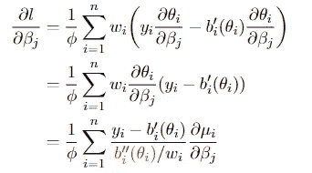

# 广义线性模型(GLM)介绍

> 原文：<https://towardsdatascience.com/an-introduction-to-the-generalized-linear-model-glm-e32602ce6a92>

## 它是什么？模型是如何拟合的&在房价预测中的应用


图片来自 [Unsplash](https://unsplash.com/photos/ob-hsLNxYPc)

在经典的线性模型中，通常需要正态性。这显示在图 0.1 中，在随机变量 X 固定的情况下，Y 的分布是正态的(由每个小的钟形曲线说明)。回归曲线穿过每个正态分布的平均值。


然而，在广义线性模型中，这一要求不再必要，因为我们可以根据我们对数据的了解，为这些观察值选择一个分布模型。这是通过链接函数实现的，它将这些观察值的平均值*e[yᵢ】*转换成线性形式。此外，也不再需要同质性。 *Y* 中的误差方差不必是常数。[5]

# 广义线性模型的组成部分

GLM 有三个主要组成部分，链接功能是其中之一。这些组件是

1.一个**随机分量** Yᵢ，它是每次观测的响应变量。值得注意的是，这是一个条件分布的反应变量，这意味着 Yᵢ是 Xᵢ.的条件

*Yᵢ* 的分布属于**指数族**，这意味着 Yᵢ具有形式，定义为【2】


不同的是，**规范形式**中的 *θᵢ* 没有被转换，这使得规范形式更容易处理。此外，请注意，总是可以将指数族转换为标准形式。或者，我们也可以将指数函数写成下面的形式[1]


等式 1.2 指数族

在 GLM 使用。在等式 1.2 中， *θᵢ* 和 *ϕᵢ* 分别是**位置**(与均值相关)和**比例**参数(与。另外，我们用 *μᵢ* 来表示 *Yᵢ* 的平均值。注释:在等式 1.2 中， *yᵢ* 也可以简单地写成 *y* ，就像等式 1.1 中一样。我们只需要记住一个 *yᵢ* 或者 *y* 代表一次观察的结果。

2.**线性预测器**，其具有普通线性模型的常见形式


等式 1.3 线性预测值

我们将用这个来预测 Yᵢ.的**均值**注意，在等式 1.1 中， *ηᵢ* 不是线性预测器，而是 *θᵢ* 的变换函数。在本文中，我们将只使用**等式 1.2** 中给出的形式。

3.一个**链接函数** g(∙)，将 yᵢ(e(yᵢ)的平均值转换成等式[linear]中的线性形式，这意味着


等式 1.4 链接功能

要求链接的函数是光滑可逆的(可逆表示函数是单调的)。

# 指数家庭为什么好？

指数族有许多好的性质。

1.在多种来源中([为什么指数家庭如此令人敬畏？](https://www.quora.com/Why-are-exponential-families-so-awesome)、[指数族的优点](https://stats.stackexchange.com/questions/411893/advantages-of-the-exponential-family-why-should-we-study-it-and-use-it)、 [Wiki:指数族](https://en.wikipedia.org/wiki/Exponential_family)，提到指数族在贝叶斯统计中非常可行，因为那些分布总是有[共轭先验](/bayesian-method-1-1cbdb1e6b4)。

2.另一个非常重要的性质是，在等式 1.1 中，*tᵢ(x*是**充分统计量**。简单来说，一个充分的统计量就是一个包含变量 x 关于未知参数的所有信息的函数，在这里是 ***θ*** 。这里的“充分”与逻辑学中“充分条件”中的“充分”含义相同。

更正式地说，一个统计量 *T(X₁、…、Xₙ)* 被说成足以求 ***θ*** ，如果条件分布 *X₁、…、Xₙ* ，给定 *T=t* ，不依赖于**求的任何值**

**3.除了上述两个属性，指数族还将多个不同的分布结合在一起。这允许我们将多个不同的分布放到一个模式中。在这里，我们将展示使用 *a* 、 *b* 和 *φ* 可以获得指数族分布的均值和方差的一般表达式。**

**我们将使用最大似然来实现这一点:**当似然函数被优化时，我们想要 *E[Y]* 。**首先，我们计算指数族分布的一般形式的对数似然(等式 1.2)(当然，如果对数似然被优化，则似然也被优化)。**

****

**等式 2.1**

**然后我们取它关于 *θ* 的偏导数。注意零件 *c(y，ϕ)* 不包含 *θ* ，所以消失。我们得到了**

****

**等式 2.3**

**窍门是我们可以把 *l* 作为一个随机变量，用它的期望值*e【y】*代替 *y* ，让∂ *l/* ∂ *θ* 的期望值为 *0***

****

**情商。2.4**

**这给了我们一个非常简单的公式 E(Y)**

****

**等式 2.5**

**有一个非常重要的事实值得一提。诀窍(将一阶导数设置为 0 以获得最大值)是由于指数族的对数似然函数的一个属性——它相对于*θ* 是**凹的**。[3]否则，这个方法就简单的断了。(这是指数家族的又一个优点)**

**现在我们试着计算 *Y* ， *Var(Y)* 的方差。取方程 2.3 的导数，我们得到对数似然函数的二阶导数**

****

**等式 2.6**

**我们可以用一般的结果**

****

**等式 2.7**

**它显示了对数似然函数的一个特性。证明是技术性的，既不困难也不有趣。因此，在本文中，我们将省略这一点。将等式 2.6 代入等式 2.7，我们得到**

****

**等式 2.8**

**使用我们已经得到的 Y 的平均值(等式 2.5)，以及等式 2.8 的一些代数运算，我们立即得到 Y 的方差**

****

**等式 2.9**

***a(ϕ)* 可以是 *ϕ* 的任何函数，但是为了更容易地使用 GLM，我们通常让**

****

**其中 *w* 为已知常数。那么我们可以将等式 2.9 写成**

****

**情商。2.10**

# **属于指数族分布的一个例子**

**GLM 最简单的例子是具有身份链接功能的 GLM。这将 GLM 简化为一个普通的线性模型。虽然很简单，但这个案例让我们了解了 GLM 的工作。**

**我们知道，一个普通的线性模型假设每个观测值都有一个正态分布。既然是 GLM 的特例，当然正态分布属于指数族。这里我们展示了如何将正态分布转换为等式 1.1 的形式:**

****

**等式 3.1 正态分布属于指数族**

**我们可以看到，这非常简单——只需将常数移入指数部分，并扩展平方即可。等式 3.1 告诉我们**

****

**等式 3.2**

**使用我们在上一节中得到的结果(等式 2.5 和等式 2.10)，我们现在可以检查正态分布的均值和方差**

****

**等式 3.3、3.4**

# **拟合模型**

**为了拟合模型，我们使用似然估计。前面说过，指数函数的对数似然函数是**凹**的，所以我们可以通过寻找一阶导数为零的点来求它的最大值。我们现在在解决什么？简单回顾一下这个问题:我们有一个独立响应变量的 n 维向量 *Yᵢ* ，其中*μ=e[yᵢ】*，它通过**

****

**等式 4.1、4.2**

**而 *θᵢ* 是正则参数*。*我们想要找到 *β* ，它最大化了对数似然函数。再次， *Yᵢ* 是独立的，这使得 *β* 的 MLE 成为可能。类似于等式 2.1， *β* 的对数似然为**

****

**等式 4.3**

***θᵢ* 和 *β* 的关联方式如下: *θᵢ* 与 *Yᵢ* 的均值相关(这取决于具体的分布函数，在上一节的例子中， *θᵢ=μᵢ* )， *β* 也通过 link 函数与 *Yᵢ* 的均值相关。所以 *θᵢ* 和 *β* 是通过***【μᵢ***连接起来的，这一点我们在后面的偏微分中会看到。**

**现在我们要对 Eq 求导。4.3 关于 *β* 中的每一个元素(它们将由索引 *j* 下标)。这给了**

****

**等式 4.5**

**因为链式法则，我们有**

****

**等式 4.6 链式法则**

**然后在微分方程 2.5 后，我们有**

****

**等式 4.7 对 *Yᵢ* 的平均值进行微分**

**我们这样做是为了得到**∂*θᵢ/*∂*μ****ᵢ*因为 *E[Yᵢ] = μᵢ.*下一步确实很容易，我们将等式 4.7 代入等式 4.5，然后**

****

**等式 4.8**

**其中红色部分来自等式 4.7。方程 4.8 可以进一步简化。正如我们谈到的，在 GLM 中，*【var[yᵢ】*不是常数。因此，我们可以把*var[yᵢ】*看作*e[yᵢ】*的函数，这样我们就可以定义**

****

**等式 4.9**

**使得(参考等式 2.10)**

****

**等式 4.10**

**将等式 4.10 代入等式 4.8，并将其设置为零(我们感兴趣的是对数似然函数的一阶导数为零的点)，我们得到**

****

**等式 4.11 将等式 4.8 设置为 0 并代入。**

**等式 4.11 给我们一个非线性方程组*β*——如果 j 从 1 到 m，那么有 m 个这样的方程。当未知数的数量不一定等于方程的数量，并且方程可能非常复杂时，如何求解这样的非线性方程组？数值方法在这种情况下发挥作用。这里我们将应用迭代加权最小二乘法(IRLS)。在这篇文章中，我们不会深入细节。一般来说，这种方法迭代地逼近解。而当我们知道 *V(μᵢ)* 独立于 *β* 时，那么最小二乘目标就是**

****

**Eq 4.12 的目标**

**换句话说，从现在开始的问题就是找到使 Eq 4.12 最小化的 *β* 。这样，我们得到了方程 4.11 的最佳解。**

# **GLM 在房价预测中的应用**

**数据集“房价”来自 Kaggle 上的一个预测竞赛。整个分析的代码可从以下网址获得**

**[](https://github.com/ZhangXichu/House-Price/blob/main/glm.ipynb) [## 房价/glm . ipynb at main zhangxi Chu/房价

### 用 GLM 模型预测房价。在 GitHub 上创建一个帐户，为张喜初/房价发展做贡献。

github.com](https://github.com/ZhangXichu/House-Price/blob/main/glm.ipynb) 

使用均方根偏差(RMSD)评估结果。GLM 方法给出了最高 33%的位置。当然，这不是最理想的方法——排行榜上有 0 个错误的结果。但它在实践中很好地展示了 GLM。

我要说的是，关于实现没有太多要谈的，因为为什么要做每一步，在笔记本上都有解释。大部分代码是数据探索、预处理、模型比较和模型诊断。建模部分归结为一行(当然，不要忘记`**import** statsmodels.api **as** sm`):

```
model_full **=** sm**.**formula**.**glm(formula**=**formula, family**=**sm**.**families**.**Gamma(link**=**sm**.**genmod**.**families**.**links**.**log()), data**=**train)**.**fit()
```

其利用对数链接函数将数据拟合到广义伽马分布。

# 摘要

这篇文章主要是关于广义线性模型(GLM)的定义，何时使用它，以及如何拟合该模型。许多文本都是关于指数族的，因为它是 GLM 的基础，了解指数族的性质有助于我们理解为什么模型拟合变得最小化等式 4.12。(解决这个问题的细节被省略了，因为它值得一整篇文章的决定。)

事实上，这些都不是程序运行所必需的，正如我们在上一节提到的，建模只是一行代码。我们需要从零开始实施 GLM，这几乎不可能发生。然而，了解理论总是有助于决定选择哪个模型，以及诊断和解释模型。** 

****参考文献**:**

**[1]赫尔曼·罗德里格斯。 [*广义线性模型理论*](https://data.princeton.edu/wws509/notes/a2.pdf) 。于 2022 年 2 月 17 日访问。**

**[2]斯蒂芬·贝茨，安迪·曹。[指数族](https://web.stanford.edu/~lmackey/stats300a/doc/stats300a-fall15-lecture2.pdf)。于 2022 年 2 月 18 日访问。**

**[3]肯普索恩博士，[评估方法 II](https://ocw.mit.edu/courses/mathematics/18-655-mathematical-statistics-spring-2016/lecture-notes/MIT18_655S16_LecNote10.pdf) 。于 2022 年 2 月 23 日访问。**

**[4]哈斯蒂，T. J .，&蒂布拉尼，R. J. (2017 年)。 [*广义可加模型*](https://www.taylorfrancis.com/books/mono/10.1201/9780203753781/generalized-additive-models-hastie-tibshirani) 。劳特利奇。**

**[5]大学习团队(2021)， [*广义线性模型|什么意思？*](https://www.mygreatlearning.com/blog/generalized-linear-models/) 。于 2022 年 4 月 7 日访问。**