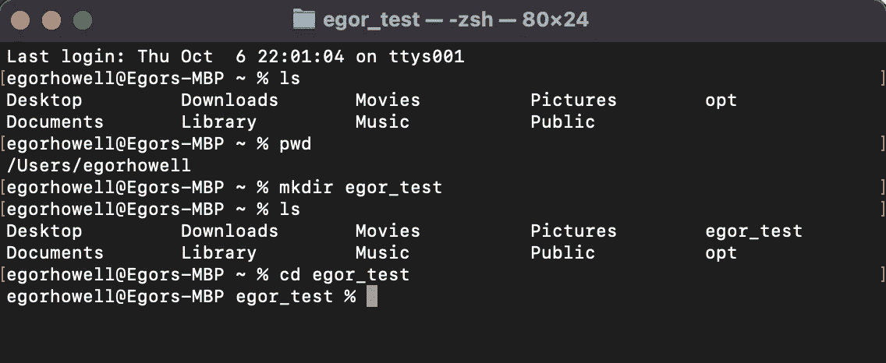
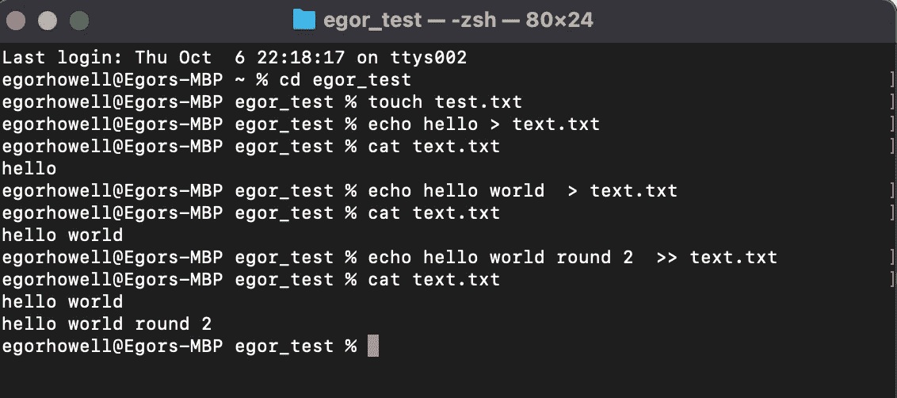

# 外壳介绍

> 原文：<https://towardsdatascience.com/an-introduction-to-the-shell-676ee5b899df>

## 解释外壳的用途和基本功能

加布里埃尔·海因策在 [Unsplash](https://unsplash.com?utm_source=medium&utm_medium=referral) 上的照片

# 介绍

我最近开始了一份新工作，我发现自己比以前用得更多的一个关键东西是 [**外壳**](https://en.wikipedia.org/wiki/Shell_(computing)) 。

在大学期间，我在编写 [**FORTRAN**](https://en.wikipedia.org/wiki/Fortran) 代码(是的，没错，是 FORTRAN)时接触到了 shell。然而，我并不真正理解 shell 是什么或者我使用的命令实际上在做什么(我更关心的是不要让任务失败！).

在这篇文章中，我想阐明 shell 的用途，并展示它的一些基本功能。

> 注意:这将是在 MacOS shell 上，因此大多数命令可能无法在 windows 机器上运行。但是，原理都是一样的！

# 外壳是什么？

让我们从讨论外壳实际上是什么开始。

如今，我们使用 [**图形用户界面(GUI)**](https://en.wikipedia.org/wiki/Graphical_user_interface) 与计算机进行交互，以访问文件、程序等。然而，图形用户界面有一定的局限性，不允许您使用计算机的全部潜力。

为了充分利用你的电脑，我们需要使用基于文本的界面，外壳。这个 shell 也被称为[**【CLI】**](https://en.wikipedia.org/wiki/Command-line_interface)并且运行在一个叫做 [**终端**](https://en.wikipedia.org/wiki/Computer_terminal) 的东西里面。终端只是一个运行 shell 的接口/应用程序。

> 请参考[本](https://askubuntu.com/questions/506510/what-is-the-difference-between-terminal-console-shell-and-command-line)栈交换线程，全面描述终端与外壳的区别。

在坚果壳(没有双关语)中，shell 允许您使用文本与操作系统进行通信。老办法！

# 贝壳的类型

每台计算机都有某种外壳，有些有多个外壳。它们之间的语法可以不同，但基本上它们执行相同的过程。

最广为人知的 shell 是 **Bourne Again Shell (Bash)** ，它通常是 Linux 和 MacOS 等类似 Unix 的**系统的默认 Shell。然而，MacOS 最近在 2019 年将其默认设置更改为 [**Z-Shell**](https://en.wikipedia.org/wiki/Z_shell) ，这只是 Bash 的一个扩展，因此具有许多相同的语法和功能。**

# **基本命令和功能**

## **访问外壳**

**如果您在 MacOS 系统上，您可以通过终端应用程序访问 shell，当您启动它时，它应该看起来像这样:**

****

**图片作者。**

**您需要了解一些功能:**

*   **在顶部栏中，您可以看到表示我们在 Z 外壳中的 **zsh****
*   ****egorhowell@Egors-MBP** 表示我在 Egors-MBP (Macbook Pro)上以 egorhowell 的用户身份登录**
*   ****%** 符号是 Z Shell 的命令提示符。对于 Bash shell，它将是一个美元符号 **$** 。**

## **查找、更改和创建目录**

**我们可以使用 shell 来浏览我们的计算机，就像您使用**

*   **命令 ***ls* (列表)**可以让你看到你当前所在的所有文件夹和目录**
*   **我们可以通过 ***pwd*** **(打印工作目录)**看到自己在什么目录**
*   **我们可以通过调用***mkdir*****(make directory)**命令，后跟我们想要创建的目录的名称，来创建一个目录**
*   **命令 ***cd*** **(改变目录)**后跟你要进入的目录。您也可以使用 ***cd..*** 回到上一个目录**

**让我们看一个例子。我们将使用 ***ls*** 和 ***pwd*** 查看我们当前的目录，然后使用 ***mkdir*** 创建目录*【egor _ test】*并使用 ***cd*** 移入其中。**

****

**图片作者。**

**请注意，现在它在命令提示符前显示“egor_test ”,以指示我们所在的目录。**

## **创建、编辑和查看文件**

**像目录一样，我们也可以从 shell 中创建、编辑和查看文件:**

*   *****触摸*** 允许我们创建一个给定的文件**
*   *****回显*** 允许我们将数据和变量写入屏幕或文件**
*   **我们可以用***'>>'*'**追加到文件中，用**'**'**覆盖****
*   **我们可以使用 ***cat*** 命令查看该文件**

**让我们再来看一个简单的例子。我们将创建一个名为 *'test.txt'* 的文件，然后向其中添加字符串 *'hello'* ，并查看该文件以确保它存在。然后，我们将使用*‘hello world’*覆盖它，并检查它是否确实覆盖了该文件。最后，我们将追加*‘hello world round 2’*:**

****

**图片作者。**

# **其他有用的命令**

*   *****手动*** 命令给你**手动**命令**
*   *****curl******(客户端 URL)*** 让您将数据从某个服务器传输到您的 shell，这在您想要安装 [**家酿**](https://brew.sh/) 或 [**诗歌**](https://python-poetry.org/) 等软件包时很有用**
*   *****chmod*** **(更改模式)**让您更改文件的权限和特权**
*   *****【复制】**复制文件***
*   ******rm*** **(删除)**删除文件和目录***
*   ******【移动】**移动和重命名文件****

****这只是触及了 shell 可用命令和功能的皮毛。我在这里链接了一些可爱的夜间阅读命令的完整列表！****

# ****引擎盖下发生了什么？****

****当我们在 shell 中键入一个命令时，如果它不是 shell 固有的，它会通过一个叫做 ***的路径*** 来查看。这包含了 shell 搜索的目录，以查看是否可以匹配与您的命令相关的可执行文件。我们可以通过键入 ***echo $PATH*** 来查看 shell 查询的目录:****

********

****图片作者。****

> ****注意:我已经安装了 Anaconda 发行版,所以我的路径看起来可能和你的略有不同。****

****因此，当我们键入一个命令时，shell 会按照给定的顺序查看上述目录，试图找到执行我们输入的命令的二进制文件。****

****我们可以通过运行*命令来检查 shell 执行的文件在哪里:*****

**********

*****图片作者。*****

*****这里我们看到 ***mkdir*** 的可执行文件在 ***/bin/mkdir*** 中，然后我们调用这个可执行文件来制作一个新的目录叫做*‘egor’*。*****

# ****数据科学家的目的****

****你可能在想，我们什么时候才能把 shell 当成数据科学家？我们可能不像软件工程师那样经常使用它，但是有很多例子:****

*   ****使用 [**pyenv**](https://github.com/pyenv/pyenv) 和 [**asdf**](https://asdf-vm.com/) 等包为生产代码管理项目 python 依赖关系****
*   ****安装工具来改善你的编码体验，例如 [**自制软件**](https://brew.sh/)****
*   ****使用 [**Anaconda**](https://anaconda.org/) 和 [**pip**](https://pypi.org/project/pip/) 下载软件包****

****在您的数据科学职业生涯中，还有很多时候您需要使用 shell 来实现某些目标！****

# ****结论****

****在这篇文章中，我们回顾了 shell is 和它的一些基本功能。这是一个非常强大的工具，你可能会在职业生涯的某个时候用到它。因此，这是值得舒适的！****

# ****和我联系！****

*   ****要在媒体上阅读无限的故事，请务必在这里注册！T37*💜*****
*   ****[*在我发布注册邮件通知时获取更新！*](/subscribe/@egorhowell) 😀****
*   ****[*LinkedIn*](https://www.linkedin.com/in/egor-howell-092a721b3/)*👔*****
*   *****[*碎碎念*](https://twitter.com/EgorHowell) 🖊*****
*   ****[*github*](https://github.com/egorhowell)*🖥*****
*   *******🏅*******

> *****(所有表情符号都是由 [OpenMoji](https://openmoji.org/) 设计的——开源的表情符号和图标项目。执照: [CC BY-SA 4.0](https://creativecommons.org/licenses/by-sa/4.0/#)*****