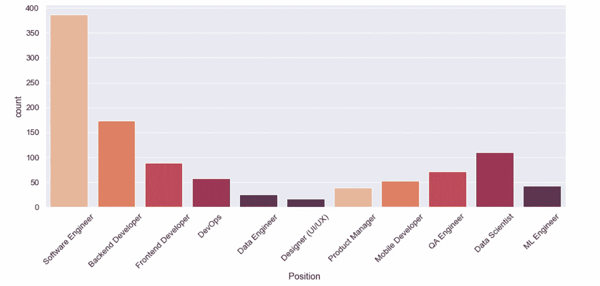
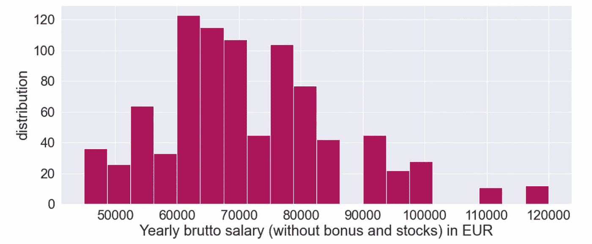
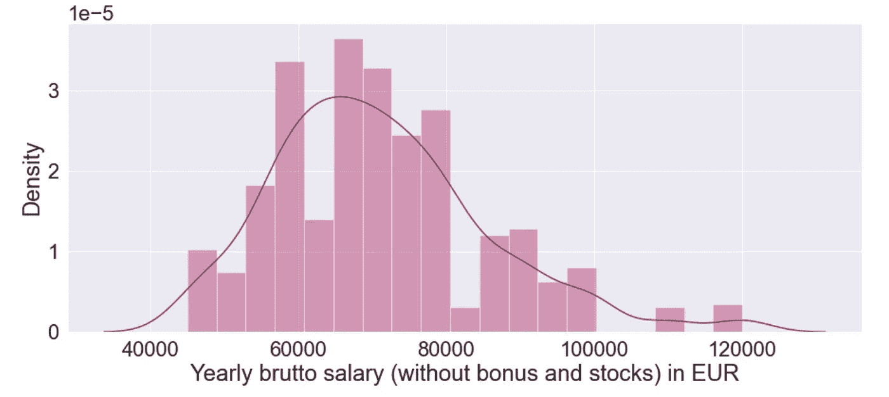
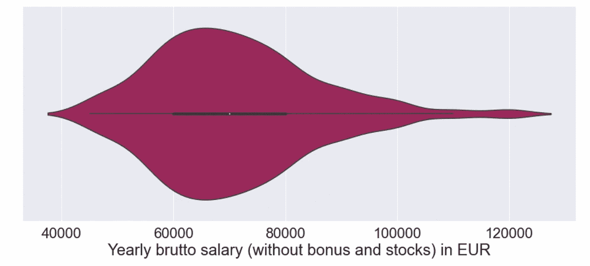

# Python 中探索性数据分析的可视化技术概述

> 原文：<https://towardsdatascience.com/an-overview-of-visual-techniques-for-exploratory-data-analysis-in-python-d35703d43faf>

## 探索性数据分析

## 关于如何在 seaborn 和 matplotlib 中为 Visual EDA 绘制最常见图形的教程


Firmbee.com 在 [Unsplash](https://unsplash.com?utm_source=medium&utm_medium=referral) 上[的照片](https://unsplash.com/@firmbee?utm_source=medium&utm_medium=referral)

在我们开展数据科学项目之前，我们必须首先尝试理解数据，并问自己一些问题。**探索性数据分析(EDA)** 是数据科学项目的初步阶段，它允许我们从数据中提取重要信息，了解哪些问题可以回答，哪些问题不能回答。

我们可以使用不同的技术进行 EDA，例如可视化和定量技术。在这篇文章中，我们关注**视觉技术**。许多不同类型的图表可以用来直观地分析数据。它们包括折线图、条形图、散点图、面积图、表格图、直方图、棒棒糖图、地图等等。

在可视化 EDA 阶段，我们使用的图表类型取决于我们想要回答的问题类型。**在此阶段，我们不关注美学，因为我们只对回答我们的问题感兴趣。**美学将在最后的**数据叙述**阶段得到关注。

我们可以执行两种类型的 EDA:

*   **单变量分析，**一次只关注一个变量
*   **多变量分析，**一次关注多个变量。

执行 EDA 时，我们可以有以下类型的变量:

*   **数字**——一个可以量化的变量。它可以是离散的，也可以是连续的。
*   **分类** —一个只能假设有限数量的值的变量。
*   **序数** —可以排序的数值变量

在本文中，我将通过一个实际例子向您展示一些最常见的 EDA 可视化技术，这个例子使用了`matplolib`和`seaborn` Python 库。所描述的概念是通用的，因此您可以轻松地将它们应用于其他 Python 库或编程语言。

文章组织如下:

*   场景的设置
*   单变量分析的可视化技术
*   多元分析的可视化技术

# 1 场景的设置

此场景的目的是说明 Visual EDA 的主要图形。作为一个样本数据集，我们使用了欧盟地区的 [IT 薪资调查，该调查在 CC0 许可下提供。我要感谢](https://www.kaggle.com/parulpandey/2020-it-salary-survey-for-eu-region)[帕鲁尔·潘迪](https://medium.com/u/7053de462a28?source=post_page-----d35703d43faf--------------------------------)，他为 EDA 写了一篇关于 [5 个真实世界数据集的精彩文章。我在那里发现了本文中使用的数据集。](/5-real-world-datasets-for-exploratory-data-analysis-21b7cc5afe7e)

首先，我们将数据集加载为熊猫数据帧:

```
import pandas as pddf = pd.read_csv('../Datasets/IT Salary Survey EU  2020.csv', parse_dates=['Timestamp'])
df.head()
```

数据集包含 1253 行和以下 23 列:

```
'Timestamp', 
'Age', 
'Gender', 
'City', 
'Position ',
'Total years of experience', 
'Years of experience in Germany',
'Seniority level', 
'Your main technology / programming language',
'Other technologies/programming languages you use often',
'Yearly brutto salary (without bonus and stocks) in EUR',
'Yearly bonus + stocks in EUR',
'Annual brutto salary (without bonus and stocks) one year ago. Only answer if staying in the same country',
'Annual bonus+stocks one year ago. Only answer if staying in same country',
'Number of vacation days', 
'Employment status', 
'Сontract duration',
'Main language at work', 
'Company size', 
'Company type',
'Have you lost your job due to the coronavirus outbreak?',
'Have you been forced to have a shorter working week (Kurzarbeit)? If yes, how many hours per week',
'Have you received additional monetary support from your employer due to Work From Home? If yes, how much in 2020 in EUR'
```

# 2 单变量分析的可视化技术

单变量分析一次只考虑一个变量。我们可以考虑两种类型的单变量分析:

*   分类变量
*   数字变量

## 2.1 分类变量

我们可以绘制的第一个图表是**计数图**，它统计了每个类别的频率。在我们的示例中，我们可以通过只考虑频率大于 10 的位置来绘制位置列的频率。首先，我们创建遮罩:

```
mask = df['Position '].value_counts()
df_10 = df[df['Position '].isin(mask.index[mask > 10])]
```

然后，我们建立图表:

```
import matplotlib.pyplot as plt
import seaborn as snscolors = sns.color_palette('rocket_r')
plt.figure(figsize=(15,6))
sns.set(font_scale=1.2)
plt.xticks(rotation = 45)
sns.**countplot**(df_10['Position '], palette=colors)
plt.show()
```



作者图片

我们可以绘制的第二种图形是**饼图**，它显示了计数图的相同信息，但它也添加了百分比:

```
values = df_10['Position '].value_counts()
plt.figure(figsize=(10,10))
values.**plot(kind='pie', colors = colors,fontsize=17, autopct='%.2f')**
plt.legend(labels=mask.index, loc="best")
plt.show()
```


作者图片

## 2.2 数值变量

在这种情况下，我们可能对数据分布感兴趣，所以我们可以绘制一个**直方图**。直方图将所有可能的值分解成多个仓，然后计算出一个值属于哪个仓。在我们的示例中，我们可以绘制前 10 名薪金的直方图，因此我们构建如下掩码:

```
mask = df['Yearly brutto salary (without bonus and stocks) in EUR'].value_counts()
df_10 = df[df['Yearly brutto salary (without bonus and stocks) in EUR'].isin(mask.index[mask > 10])]
```

然后，我们可以构建直方图:

```
plt.figure(figsize=(15,6))
sns.set(font_scale=2)
plt.xlabel('Yearly brutto salary (without bonus and stocks) in EUR')
plt.ylabel('distribution')
plt.**hist**(df_10['Yearly brutto salary (without bonus and stocks) in EUR'], bins=20, color='#AD1759')
plt.show()
```



作者图片

另一个类似于直方图的图形是 dist 图，它也绘制了内核密度估计值(KDE):

```
plt.figure(figsize=(15,6))
sns.set(font_scale=2)
sns.**distplot**(df_10['Yearly brutto salary (without bonus and stocks) in EUR'], color='#AD1759')
plt.show()
```



作者图片

另一种用于绘制数字变量的图形是**盒形图**，它允许您可视化中心和分布，以及其他有用的信息，包括最小、最大值。我们还可以使用箱线图来检测异常值:

```
plt.figure(figsize=(15,6))
sns.set(font_scale=2)
sns.**boxplot**(df_10['Yearly brutto salary (without bonus and stocks) in EUR'], color='#AD1759')
plt.show()
```


作者图片

有趣的是，在上图中有一个 120，000 欧元的异常值。

与箱形图相似的是小提琴图，它也显示了数据分布:

```
plt.figure(figsize=(15,6))
sns.set(font_scale=2)
sns.**violinplot**(df_10['Yearly brutto salary (without bonus and stocks) in EUR'], color='#AD1759')
plt.show()
```



作者图片

# 3 多变量分析的可视化技术

多元分析一次考虑更多的变量。在本文中，我们关注的是**双变量分析**，它一次只关注两个变量。

对于双变量分析，我们可以考虑三种类型的可视化技术:

*   数字到数字
*   数字到范畴
*   绝对到绝对

## 3.1 数值对数值

在这种情况下，我们考虑两个数值变量，我们想比较它们。最常见的表示它们之间关系的图形是**散点图**，它将两个变量之间的交叉点绘制成一个点。在我们的例子中，我们可以绘制工资与年龄的散点图:

```
plt.figure(figsize=(15,6))
sns.set(font_scale=2)
sns.**scatterplot**(df_10['Yearly brutto salary (without bonus and stocks) in EUR'],df_10['Age'],color='#AD1759')
plt.show()
```


作者图片

## 3.2 数值到分类

代表数字变量和分类变量之间关系的最常见的图形是**条形图。**在我们的示例中，我们可以绘制工资与性别的柱状图:

```
plt.figure(figsize=(15,6))
sns.set(font_scale=2)
sns.**barplot**(df_10['Yearly brutto salary (without bonus and stocks) in EUR'], df_10['Gender'],color='#AD1759')
plt.show()
```


作者图片

## 3.3 绝对到绝对

在这种情况下，我们比较两个分类变量。我们可以使用热图，通过颜色绘制两个变量之间的相关性。在我们的示例中，我们可以绘制资历级别与性别的关系图:

```
plt.figure(figsize=(15,6))
sns.set(font_scale=2)
sns.**heatmap**(pd.crosstab(df_10['Seniority level'], df_10['Gender']), cmap='rocket_r')
plt.show()
```


作者图片

# 摘要

在本文中，我通过两个 Python 库:matplotlib 和 seaborn，展示了一些基本的图形来执行可视化的探索性数据分析。在某些情况下，我使用 matplotlib，在其他情况下使用 seaborn。

可以绘制许多其他的可视图形。在这里，我描述了最常见的图表来开始。

我想提醒你，EDA 只是为了数据探索。如果你想构建精彩的可视化，你应该把重点放在数据叙事(讲故事)技术上。

如果你读到这里，对我来说，今天已经很多了。谢谢！你可以在[这篇文章](https://alod83.medium.com/which-topics-would-you-like-to-read-c68314dc6813)中读到更多关于我的信息。

# 相关文章

[](https://pub.towardsai.net/are-data-journalism-and-data-science-the-same-thing-77ba7ec794d4)  [](https://alod83.medium.com/how-to-design-a-data-journalism-story-b2e421673b6e)  [](/why-a-data-scientist-needs-to-also-be-a-storyteller-89b4636cb83) 