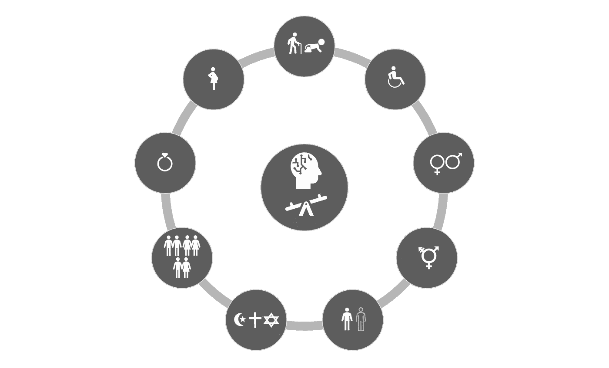
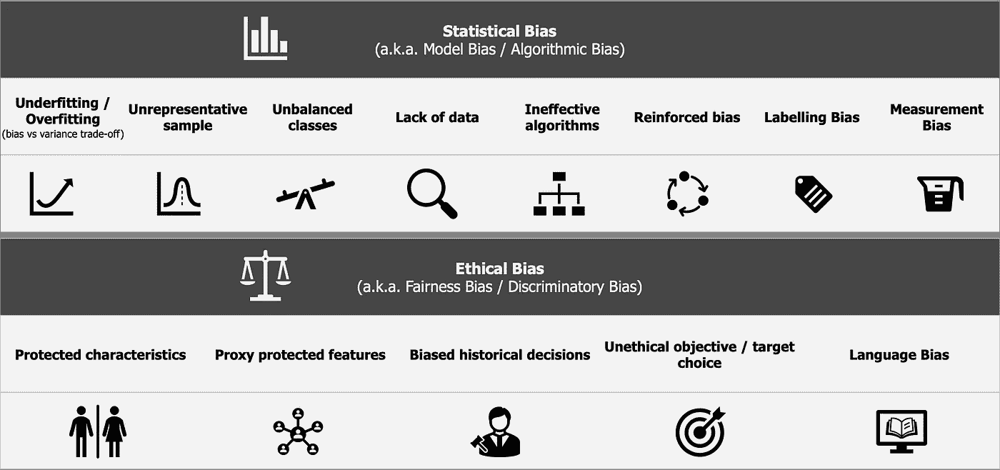
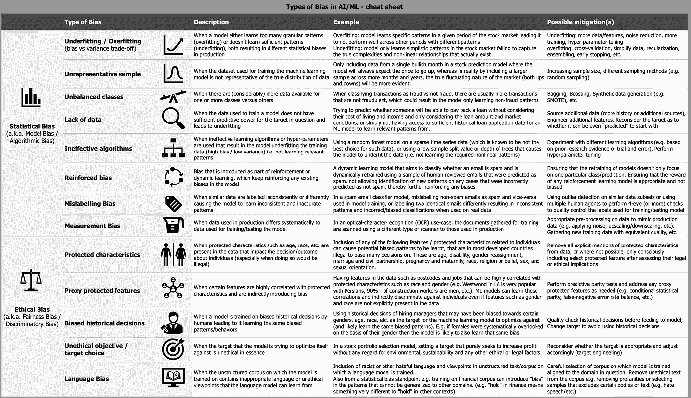

# 人工智能偏见的“无偏见”指南

> 原文：<https://towardsdatascience.com/an-unbiased-guide-to-bias-in-ai-3841c2b36165>

## 概念概述

## AI/ML 模型中的伦理与统计偏差

图 1——人工智能中的偏见……它是如何渗透进来的，有哪些不同的类型？—作者图片

每当在人工智能的背景下提到伦理，偏见、公平和公正的话题就会接踵而至。

类似地，每当提到训练和测试机器学习模型时，**偏差&方差**之间的权衡就显得很重要。

**但是这两次提到偏见是指同一件事吗？**在某种程度上很好，但不完全是…

图片 2 — **统计**(模型/算法)与**伦理**(公平/歧视)偏见— *作者图片*

# 一些基本定义..

在我继续解释之前，我怀疑本博客的大多数读者已经至少对机器学习和相关概念有了基本的了解，所以我将只浏览一些主要供参考的关键定义:

***机器学习:*** *计算机(即机器)使用算法从数据中“学习”模式的过程，不需要人类明确定义要学习哪些特定模式—作者*

为了让机器学习这些模式，特别是在“监督学习”中，它们要经历一个训练过程，通过这个过程，算法通常以迭代的方式从训练数据集中提取模式。然后，它在一个看不见的(样本外)测试数据集上测试其预测，以验证它从训练数据集学习的模式是否有效。

## **通俗地说什么叫偏见？**

剑桥词典对偏见的教科书定义如下:

> **偏见:**以不公平的方式支持或反对某个特定的人或事的行为，因为允许个人观点影响你的判断。

一个相关的例子是，体育迷支持一个特定的球队，由于他们的偏见，总是预测他们的球队将赢得每场比赛，即使实际上他们的胜率可能不到 50%，这清楚地表明了他们的幻灭(又名偏见)！

图片 3——曼联 2022/2023 英超赛季前三场比赛——**预测**vs**现实**——从一个球迷“有偏见”的角度——作者图片

## 什么是统计偏差？

在训练机器学习模型中，在偏差和方差之间存在权衡，其中偏差说明模型捕捉数据中的模式有多好，而方差说明这些模式应用于不同数据片段的有多好(即，训练对测试对验证)。

*   **欠拟合**:具有高偏差的模型被认为欠拟合训练数据集，即它没有学习到足够的模式来捕捉输入和输出/目标之间的相关关系。在这种情况下，模型在训练数据集和测试/验证数据集上的表现差异往往很小，即在所有数据集上表现同样差。
*   **过拟合**:具有低偏差的模型被称为过拟合训练数据集，即它在训练数据集中学习了太多的粒度模式，这使得它在针对训练数据集进行测试时表现得非常好，但在针对测试/验证数据集进行测试时表现得非常差，从而具有高方差。

当部署到生产中时，欠拟合和过拟合都会导致较差的性能，并表现出这里所谓的**统计偏差**。**统计偏差**可以总结为**模型预测与现实**的平均误差(即模型试图预测的正确输出)。

## 统计偏差的根本原因是什么？

统计偏差的主要根源通常是因为模型通过训练过程学习的模式不能反映输入数据和目标/输出之间的真实关系。因此，该模型要么需要更多的优化和训练，要么需要更多/更好的数据和/或特征来学习更多相关的模式。

现在，假设我们正在训练一个 ML 模型来预测一支足球队赢得比赛的可能性。为此，我们可以获得 20 年的历史比分，并利用这些数据来预测特定比赛的比分。这个模型很可能会有很大的偏差，因为我们都知道过去的成绩并不总是未来表现的良好指标(特别是在曼联的情况下…！).

在这种情况下，可以包括额外的预测特征以减少模型的偏差，例如:球员的健康状况、明星球员的可用性、使用中的阵型、球员和教练的相对经验、比赛中的统计数据，例如控球量、传球次数、黄/红牌数、最近的成绩等等。

## 那么道德偏见呢？

统计偏差和伦理偏差可以被认为是独立的。你可以有一个在统计偏差方面近乎完美的模型(即具有较低的偏差/平均误差)，但可能表现出极大的伦理偏差。道德偏见可定义为导致不道德(如非法、不公平或不道德)结果的偏见，通常不利于特定群体的个人权利。

# 统计偏差与伦理偏差——备忘单

我是所谓的“一页纸”的忠实粉丝，并创建了下面的备忘单，以浓缩的方式抓住了这个博客的精髓。它是一个有用的工具，可以评估 AI/ML 模型中统计和伦理偏见的潜在根本原因，以及解决这些问题的可能缓解措施的非详尽列表:

**表 1 —人工智能/人工智能备忘单中的偏差** —统计与伦理偏差—由作者创建

上表的前半部分涵盖了 AI/ML 模型中不同类型的“**统计偏差**，其中大部分在数据科学社区中相对成熟。欠拟合和过拟合可以被认为是帮助检测 AI/ML 模型中的统计偏差的主要症状，而其他 7 项可以被认为是导致这种统计偏差的根本原因。
这 7 个根本原因是: **1)** 用于训练的样本不具代表性， **2)** 类别不平衡， **3)** 缺乏足够的数据和/或预测特征， **4)** 无效的算法和/或超参数， **5)** 通过模型的无效动态再训练和/或强化学习代理中的“有偏见的”奖励函数来强化偏见， **6)** 不一致的标记或错误标记

表格的后半部分涵盖了 AI/ML 模型中“**道德偏见**”的潜在根本原因以及可能的缓解措施，这是数据科学社区中一个不太成熟的话题，仍在不断发展。因此，在下一节中，我将借助“真实”的例子/用例，更深入地探究道德偏见的每一个潜在根源。

# **通过真实例子解释伦理和统计偏见**

让我们考虑一个在金融服务行业很受欢迎的例子，一家银行开发了一个 ML 模型来预测个人的信用价值，以帮助他们决定是否发放贷款。

让我们假设这个模型以与个人家庭收入相关的历史数据作为输入，预测的目标是他们是否能够成功地全额偿还贷款。

在这种情况下，很有可能该模型学习了一种模式，即个人收入越高，全额偿还的可能性就越高。虽然这种模式在许多情况下可能是正确的，但它可能会有**高统计偏差**(即其预测的高平均误差)，因为它没有考虑其他重要因素，如生活成本、受抚养人数量、行业和工作类型等。

## 通过包含受保护的特征的伦理偏见

让我们继续同一个信誉预测场景。在意识到这种统计偏差后，银行向模型中输入额外的数据，包括上面强调的一些因素(如生活成本等)以及一些个人数据，如性别和种族。这导致模型产生近乎完美的预测，且**统计偏差较低。**然而，由于包含了个人数据，同一模型现在可能表现出高度的道德偏见。

从统计学上来说，这可能是“真实的”，例如，某些种族在历史上平均比其他种族更成功地偿还贷款，然而，尽管这可能是真实的，但在大多数国家，1) **非法**(基于平等法案，如欧盟的《欧洲商品和服务平等待遇指令》】和 2) **不道德**、在决定一个人的信贷价值时将该人的种族考虑在内。

这是一个很好的例子，说明了一个模型如何具有**较低的统计偏差，但同时表现出较高的伦理偏差。**

**图片 4** —通过包含受保护特征的人工智能中的伦理偏见—作者提供的图片

## 代理人的道德偏见

即使性别或种族等特征没有明确包含在输入数据中，模型也有可能通过所谓的代理特征以某种方式学习它们。**代理特征是与所讨论的个人特征**多少有些关联的特征，如男性占多数的某些工作(如建筑工人、飞行员等)，或特定种族更受欢迎的某些邮政编码。

## **因历史偏见决定而产生的道德偏见**

伦理偏见还会以另一种方式蔓延到机器学习模型中，那就是在模型试图优化自身的训练数据中使用历史偏见决策。

在相同的信用价值场景中，即使您从输入数据中删除了所有个人特征，如性别和种族，如果模型的输出是基于人类贷款官员以前做出的决定，则由于某些官员可能表现出的任何性别或道德偏见，另一种形式的道德偏见可能仍然存在。如果这些有偏见的决策有些系统化(例如，已经发生了很多次)，ML 模型可以很容易地发现它们并学习相同的有偏见的模式。

## 因目标选择不当而产生的道德偏见

如果模型试图优化自身的目标选择不当，就会导致伦理偏见。例如，在股票投资组合选择模型中，设定一个纯粹寻求增加利润的目标，而不考虑公司的环境或可持续性影响或任何其他道德/法律因素，可能会导致不道德的投资组合选择。

同样，在信誉的例子中，有一个纯粹寻求利润最大化的目标可能会导致某些服务不足的社区的利率增加，从而使他们更加困难，并强化导致他们贫困状况的任何社会偏见。

## 语言模型中的伦理偏见

语言模型通常在大型文本语料库上训练，因此容易学习文本可能包含的任何不适当的语言或不道德的观点。例如，在非结构化文本中包含种族主义语言或脏话会导致模型学习这种模式，并在聊天机器人、文本生成或其他类似上下文中应用时引起问题。

减轻这种风险的一种方法是从语料库中删除任何不道德的部分，以避免模型学习有问题的模式/语言。人们还可以从文本中删除脏话，以确保训练数据更加“干净”。另一方面，完全排除这样的脏话也会对模型产生负面影响，因为可能需要识别和移除仇恨言论/脏话，如果模型在其训练期间没有遇到这些数据，这是不可能的。

## 我们如何评估/测试一个模型是否表现出伦理偏见？

评估一个模型是否表现出伦理偏见迹象的一个好方法是执行**预测奇偶检验。**简而言之，预测奇偶校验检查预测的分布是否等同于相关子群(如性别、种族等)。).

有不同类型的预测性奇偶检验，如**偏差保持:**例如，在 CV 筛选模型中，尽管在我们的数据分布中男性可能比女性多，但两性接受 CV 的比率应该相似；和**偏见转化:**例如，不管男女分布是否倾斜，目标都是实现两性接受人数相等。

例如，为了测试道德偏见的信用价值模型，可以在模型被训练后包括个人的性别或种族，以便检查其预测是否偏向某一性别或种族。如果存在异常，那么 SHAPLEY 值之类的可解释性技术可以帮助识别哪些特征充当受保护特征的潜在代理，并采取适当的行动。

然而，应该注意的是，有时除了接受偏见之外，没有什么可以做的。例如，可能存在这样一种模式，即某一职业类别的人被评估为比其他人更有信誉，但是，由于该领域妇女的分布较多，均等测试突出了对女性的积极偏向。这种情况有时可能需要接受，但理解和记录仍然非常重要。

这些偏见测试的细节超出了本博客的范围，但最好的来源之一是回顾牛津大学桑德拉·沃希特教授关于这个主题的工作(相关链接见最后的“进一步阅读”)。

# 为什么在机器学习模型中，伦理偏见被认为是更大的“风险”？

有人可能会说，基于规则的模型同样容易受到伦理偏见的影响，因为它们也可能包含与个人的种族、性别和其他受保护特征有关的规则。然而，主要区别在于，在机器学习中，1)有时这些特征被错误地包括或仅通过代理存在，以及 2)人类没有对模型学习的特定模式的直接输入(当然，除了选择训练数据、工程特征、选择算法、调整超参数等)，因此，模型可能无意中学习有偏见的模式，这些模式保持隐藏，直到执行奇偶校验或其他类似测试来发现它们。

另一方面，在基于规则的系统中，所有这些规则都需要有人明确定义，除非开发人员有特定的恶意或无知，否则这些不道德的模式很难“潜入”。

# 总之…

偏见是人工智能中一个非常重要且不断发展的子领域，需要成为每个数据科学专业人员的首要考虑。这仍然是一个相对较新且不断发展的话题，对于行业来说，从一开始就统一一套通用的定义和术语是非常重要的。

正如在这篇博客中所提出的，统计偏差和伦理偏差是两种不同类别的偏差，具有不同的根本原因和缓解措施(参见表 1 的总结)。

大多数经验丰富的数据科学家已经很好地掌握了管理统计偏差，因为它涉及到 ML 中偏差与方差之间的既定权衡，但是，当涉及到管理 AI/ML 应用中的道德偏差时，需要更多的意识，特别是考虑到它可能会无意中歧视平等和隐私等基本人权。

# 延伸阅读…

这里有一些建议给那些有兴趣阅读更多关于这个话题的人:

*   [**为什么公平不能自动化:弥合欧盟非歧视法与人工智能**](https://papers.ssrn.com/sol3/papers.cfm?abstract_id=3547922)**——作者**桑德拉·沃希特教授、布伦特·米特斯塔特教授、克里斯·罗素****
*   ***[**机器学习中的偏见保留:欧盟非歧视法**](https://papers.ssrn.com/sol3/papers.cfm?abstract_id=3792772) 下公平指标的合法性——作者**桑德拉·沃希特教授、布伦特·米特斯塔特教授和克里斯·拉塞尔*****
*   ****[**公平性定义解释**](https://fairware.cs.umass.edu/papers/Verma.pdf)**——作者*萨希尔·瓦尔马和朱莉娅·鲁宾*******

*********你遇到过的 AI/ML 模型中有偏差的例子有哪些？期待大家的评论！*********