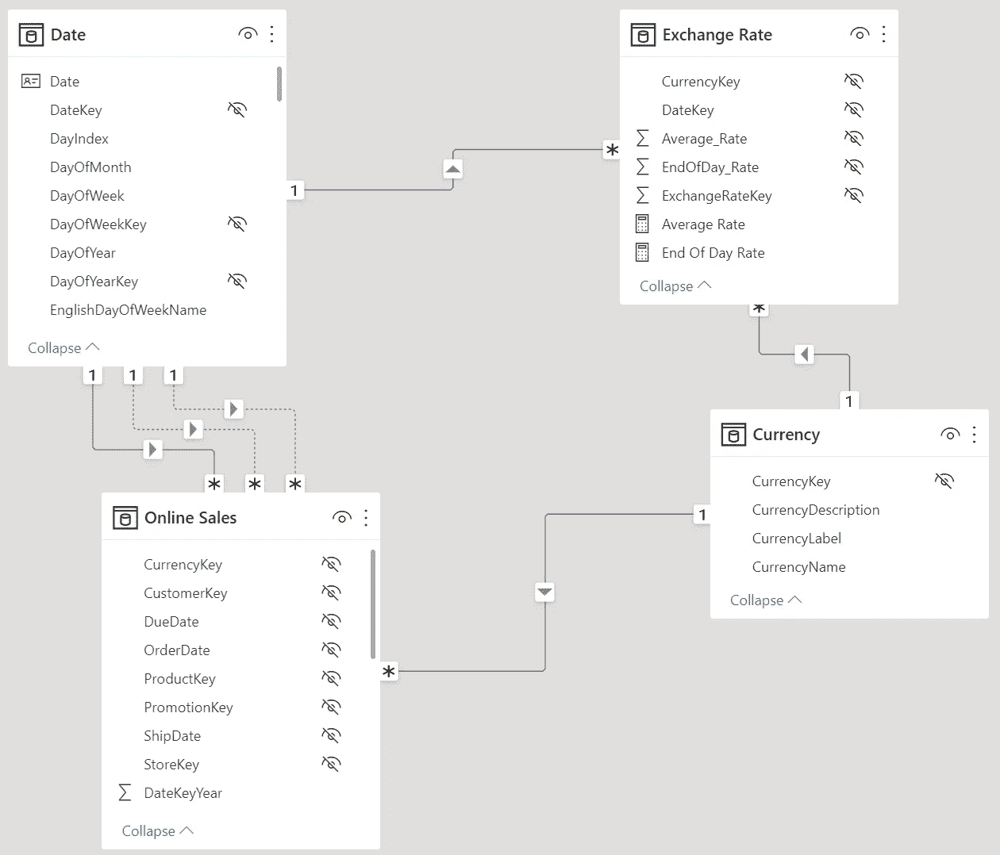
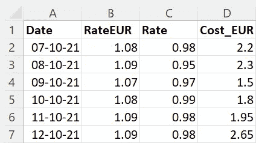
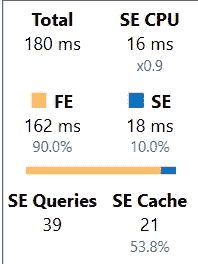
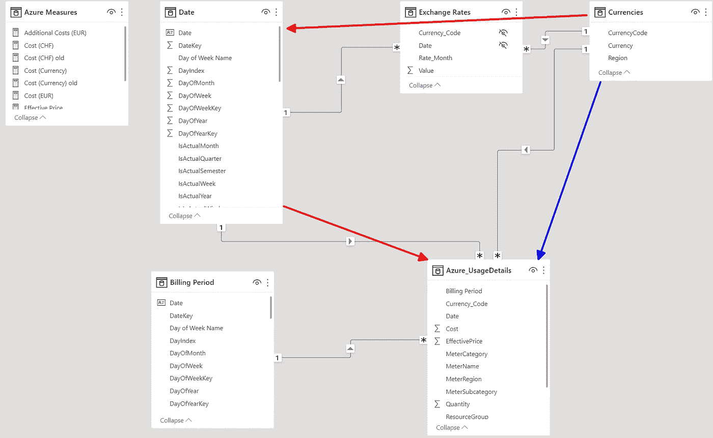

# 在 DAX 中计算货币转换的意外教训

> 原文：<https://towardsdatascience.com/an-unexpected-lesson-with-calculating-currency-conversions-in-dax-58014260a98>

## *货币兑换是常见的报告要求。在实现该解决方案时，我意外地学到了 Power BI 中的数据建模。*


约翰·麦克阿瑟在 [Unsplash](https://unsplash.com?utm_source=medium&utm_medium=referral) 上的照片

# 介绍

在进行货币换算时，您必须有一个特定时期的换算率列表。该期间可以是每日或每月的平均汇率或每月的最后(收盘)汇率。

你可以从你的国家银行网上获得这样的名单。

就我而言，我住在德国，在瑞士工作；我观察了[欧洲中央银行](https://www.ecb.europa.eu/stats/policy_and_exchange_rates/euro_reference_exchange_rates/html/index.en.html)和[瑞士国家银行](https://data.snb.ch/en/publishingSet/A) (SNB)。

在那里，你可以免费下载一套完整的汇率 Excel 文件或 CSV 文件。

根据要求，我必须从 SNB 获取汇率。不幸的是，导出的数据只包含月平均和每月收盘汇率。

因为我需要每日汇率，所以我使用了我以前的一篇文章中描述的技巧来填补时间序列数据中的空白:

<https://medium.com/codex/fill-gaps-in-time-series-with-this-simple-trick-in-sql-81ac655e5ad7>  

将费率表导入 Power BI 后，我编写了计算结果的方法。

以下三种方法从简单到复杂。

在我的开发工作中，我遇到了意想不到的困难，这使我在研究满足特定需求的最后一种方法时获得了新的知识。

# 案例 1 —一种来源货币兑换多种货币

在本例中，我们有一个 Transaction- (Fact-)表，其中包含以美元表示的值。然后，我们有一个货币兑换率表，它包括从美元到所有其他货币的每日兑换率。

数据模型如下:



图 1 —简单转换的数据模型(由作者提供)

我将使用同样的原理来模拟第三个也是最后一个解决方案。

因为我总是需要每期一个兑换率，所以在查看月度或年度数据时，我必须汇总每日兑换率。

出于这个原因，我需要首先创建一个平均比率指标:

```
Average Rate = AVERAGE(‘Exchange Rate’[Average_Rate])
```

现在，我可以使用以下方法来计算转化率:

```
Online Sales Currency =VAR SalesUSD =
    CALCULATE([Online Sales (By Order Date)]
              ,REMOVEFILTERS(‘Currency’)
              )VAR ExchangeRate = SELECTEDVALUE(‘Exchange Rate’[Average_Rate])RETURN
     SalesUSD * ExchangeRate
```

我必须在 CALCULATE()中使用 REMOVEFILTERS('Currency ')来确保目标货币选择不会过滤在线销售表。

或者，可以禁用货币和在线销售表之间的关系。

这种简单的方法有一些缺点:

1.  该度量计算所选期间的平均汇率。这在结果的计算中引入了误差
2.  该指标不考虑缺失率
3.  这种方法只适用于一个方向和一种货币。

# 案例 2 —多种货币对多种货币

SQLBI 的人写了一篇关于货币兑换作为 DAX 模式的文章。

他们的解决方案涵盖了第一种情况的所有问题:

*   将每日交易映射到相应的每日汇率
*   考虑缺失率
*   使用多种来源和目标货币的能力

在此重复细节毫无意义，因为文章和视频包含非常详细的解决方案描述。

您可以在下面的参考资料部分找到这篇文章和相应的视频。

# 案例 3 —使用过渡货币

在我的情况下，我有以下数据和要求:

*   我的数据是欧元货币
*   我有一个以瑞士法郎为基础货币的兑换率表
*   我需要主要以瑞士法郎报告我的数据
*   我也必须能够用美元分析数据

因为输入货币是固定的，所以我不需要两个货币汇率表，如第二个案例中的 DAX 模式解决方案之一所示。

当我想计算结果时，我首先要用欧元乘以欧元的汇率，得到瑞士法郎的值。然后，我可以将结果除以目标货币的汇率，得到最终结果。

我用与第一种情况略有不同的逻辑实现了下面的中间方法。嵌入了对逻辑的解释作为注释:

```
Cost (Currency) =// Step 1: Get the last date with an Exchange-Rate in the actual period
VAR LastExchRate = CALCULATE(
         LASTNONBLANK(‘Date’[Date], MIN(‘Exchange Rates’[Value]) )
         )// Step 2: Get the last Exchange-Rate for Euros
VAR ExchRateEUR = CALCULATE(AVERAGE(‘Exchange Rates’[Value])
                              ,REMOVEFILTERS(‘Currencies’)
                              ,’Currencies’[CurrencyCode] = “EUR1”
                              ,’Date’[Date] = LastExchRate
                              )// Step 3: Convert the Cost in EURO to CHF
// The Reason for the REMOVEFILTERS() is the same as explained in the first case
VAR CostCHF = CALCULATE([Cost (EUR)] * ExchRateEUR
                         ,REMOVEFILTERS(‘Currencies’)
                         )// Step 4: Get the current Currency Code
VAR SelectedCurr = SELECTEDVALUE(‘Currencies’[CurrencyCode])// Step 5: Calculate the Result using the Cost in CHF and the Rate of the current Currency Code
// The Formula to calculate the result is: (CostEuro * RateEUR => CHF) / RateSelectedCurrency
VAR Result = CALCULATE(DIVIDE ( CostCHF
                                , AVERAGE(‘Exchange Rates’[Value])
                                )
                          ,’Currencies’[CurrencyCode] = SelectedCurr
                          ,’Date’[Date] = LastExchRate
                          )RETURN
// Return the Result from Step 5 only when one Currency is selected.
// If no specific Currency is selected, the return Blank
IF ( HASONEVALUE(‘Currencies’[CurrencyCode])
                  ,SWITCH ( SelectedCurr
                            ,”EUR1", [Cost (EUR)]
                            ,”CHF1", CostCHF
                            ,Result)
                  , BLANK()
                  )
```

正如你在评论中看到的，我得到的是当期的最后一个汇率，而不是计算实际期间的平均汇率。

这样做的原因是，用这种方法验证结果很简单，因为我只需获得特定时期的最新汇率，就可以检查汇总结果(例如月和年)是否正确。

无论如何，我必须在步骤 2 中聚合汇率，因为 CALCULATE 只能使用一个聚合表达式作为第一个参数。但是，由于我将汇率限制在实际期间的最后一天，因此平均值()没有影响。

我需要 IF()中的开关()来检查:

*   当前货币是欧元，返回以欧元表示的值
*   当前货币为瑞士法郎，返回以瑞士法郎表示的值
*   否则，返回计算结果

下一步是通过实现 DAX 模式解决方案中描述的方法来改进代码。

最后的措施如下:

```
Cost (Currency) =// Step 1:
// Get the Rates for each row in the Data table for CHF (The bridge/intermediary) currency
// As the Data currency is EURO, I have to take the rate for EURO to be able the calculate the value in CHF
VAR AggregatedValue_CHF =
                  CALCULATETABLE (
                      ADDCOLUMNS(
                        SUMMARIZE(‘Azure_UsageDetails’
                                          ,‘Date’[Date])
                        ,“RateEUR”
                        ,CALCULATE(
                          SELECTEDVALUE( ‘Exchange Rates’[Value] ))
                        , “Cost_EUR”, [Cost (EUR)]
                        ),
                      ‘Currencies’[CurrencyCode] = “EUR1”
                      )// Step 2:
// Get the Rates for each row in the Data table for the selected currency
VAR AggregatedValue_EUR =
                 ADDCOLUMNS(
                     SUMMARIZE(‘Azure_UsageDetails’
                       ,‘Date’[Date])
                       ,“Rate”
                        ,CALCULATE(
                          SELECTEDVALUE( ‘Exchange Rates’[Value] ) ) ,“Cost_EUR”, [Cost (EUR)]
                     )// Step 3:
// Combine both tables into one to be able to perform the correct currency conversion
VAR Cost_Rates = NATURALINNERJOIN(AggregatedValue_CHF,
                                  AggregatedValue_EUR)// Step 4:
// Perform the actual currency conversion with the use of the intermediary currency
VAR Result = SUMX(Cost_Rates
                   ,DIVIDE(([Cost (EUR)] * [RateEUR]), [Rate])
                   )// Step 5:
// Get the CurrencyCode of the actual currency
VAR SelectedCurr = SELECTEDVALUE(‘Currencies’[CurrencyCode])RETURN
// Step 6:
// Return the Result from Step 5 only when one Currency is selected.
// If no specific Currency is selected, the return is the Value in EURO
IF ( HASONEVALUE(‘Currencies’[CurrencyCode])
                  // Step 7:
                  // Check if the Currency is either CHF or EURO
                  // if the selected curreny is one of these, use the existing measures to get the result
                  ,SWITCH ( SelectedCurr
                             ,”EUR1", [Cost (EUR)]
                             ,”CHF1", [Cost (CHF)]
                             ,Result)
                  , [Cost (EUR)]
                  )
```

前两个步骤生成两个表，其中包含数据表中每一行的相应汇率。一个表格包含将欧元转换为瑞士法郎(CHF)的兑换率。另一个从实际的过滤上下文中获取转换率(例如 USD 或 AUD)。

第三步将两个表合并成一个表，如下所示:



图 2 —样本组合数据(非实际数据)(作者提供的数据)

现在，我可以使用步骤 4 中的公式来计算结果。

第四步和第五步与第一步相同，用于解决这种情况。这一步控制输出。

成本(瑞士法郎)衡量标准具有以下代码:

```
Cost (CHF) =
    VAR AggregatedValue_CHF =
            CALCULATETABLE (
               ADDCOLUMNS(
                    SUMMARIZE(‘Azure_UsageDetails’
                               ,‘Date’[Date])
                    , “Rate”
                    ,CALCULATE(
                          SELECTEDVALUE( ‘Exchange Rates’[Value] ) )
                    ,“Cost_EUR”, [Cost (EUR)]
               ),
               ‘Currencies’[CurrencyCode] = “EUR1”
             )VAR Result = CALCULATE(
                    SUMX(AggregatedValue_CHF
                         ,[Cost (EUR)] * [Rate]
                         )
                    ,’Currencies’[CurrencyCode] = “CHF1”
                    )RETURN
     Result
```

乍一看，这种方法效率很低，因为它几乎只使用公式引擎:



图 3 —货币兑换的服务器计时(由作者提供)

我将它用于一个只有 32，000 行的小型数据集。

我检查了由 SQLBI 提供的解决方案中的计时。当您使用月费率而不是日费率时，性能会稍好一些。当你可以忍受不太精确的月汇率时，用月汇率计算可能是一个可行的解决方案。

在任何情况下，你都需要用你的数据来评估性能，以了解性能是否对你有利。

180 ms 的响应时间对于我的数据集来说已经足够好了。

然后，我在拥有 6400 万行的大型数据集上测试了相同的度量。结果令人惊讶:


图 4 —带有大型事实表的货币兑换的服务器计时(由作者提供)

存储引擎执行 71.8 %的工作，并行度为 3.4(在四核笔记本电脑上)。测量在不到 1.5 秒后返回结果。
这一测量得出的结论是，该解决方案可以很好地适应数据量。

结果如下所示，仅选择了瑞士法郎、欧元和美元:


图 5 —货币转换的结果(作者提供的数字)

正如开始提到的，在解决这个挑战时，我学到了一些意想不到的东西。

当您查看开始时使用的数据模型时，在货币表和事实表之间有两条路径:



图 6 —不明确的路径(作者提供的图片)

这两条路给我的测量带来了问题。

这种不确定性来自于在货币表中选择一种货币来过滤事实表中的数据。

该筛选器导致一个空结果，因为事实表只包含欧元货币的值。

我无法将 remove filters(' currences ')添加到度量中(步骤 1 和 2)，因为我需要选定的货币来获得正确的兑换率。

解决这个问题的唯一方法是禁用货币和事实表之间的关系。这种改变并没有改变结果:


图 7 —修正的数据模型(由作者提供)

这种行为是出乎意料的，因为我在其他货币转换项目中使用了这种建模技术。

# 结论

货币兑换的计算可能是一个棘手的挑战。

第一种情况下的解决方案很简单，但是它有一些缺点，因为它通过使用平均转换率返回不精确的数据。

DAX Pattern 网站上显示的解决方案非常好，因为它们使用每日或每月汇率来计算正确的结果。此外，这些解决方案还包含对缺失比率等的检查。

在大多数情况下，您可以使用这里显示的解决方案。

我根据自己的具体需求和可用数据创建了自己的解决方案。

但是，尽管这个解决方案很特别，我还是学到了一些宝贵的经验:

*   确保数据模型不包含任何潜在的模糊关系
*   根据不同值的数量和许多其他因素，解决方案在处理大量数据时会表现得更好
*   当创建一个复杂的解决方案时，从一个易于测试的解决方案开始。然后，使用第一个版本来验证后续版本的结果，这需要复杂的查询或对照源数据进行检查

任何方法的下一步都是创建一个计算组。但是，不可能为整个数据模型开发一个计算项，因为第二种和第三种情况的解决方案在一个事实表上迭代。因此，您必须为每个事实表创建一个计算项。


照片由[蒂姆·莫斯霍尔德](https://unsplash.com/@timmossholder?utm_source=medium&utm_medium=referral)在 [Unsplash](https://unsplash.com?utm_source=medium&utm_medium=referral) 上拍摄

# 参考

你可以在这里找到上面提到的 SQLBI 文章:[货币转换— DAX 模式](https://www.daxpatterns.com/currency-conversion/)

相应视频在 SQLBI YouTube 频道:

我在第一个示例中使用了 Contoso 示例数据集，就像我在以前的文章中一样。你可以从微软[这里](https://www.microsoft.com/en-us/download/details.aspx?id=18279)免费下载 ContosoRetailDW 数据集。

Contoso 的数据可以在麻省理工学院的许可下自由使用，正如这里的[所描述的](https://github.com/microsoft/Power-BI-Embedded-Contoso-Sales-Demo)。

第三个示例中使用的数据集包含来自我的 Azure 云订阅的实际使用数据，这些数据被导入到 Power BI 中。

<https://medium.com/@salvatorecagliari/membership> 